# Chapter 1: Cavity pressure, carrier inertia and directional jets

# 第 1 章：空腔压力、载液惯性与定向射流

## 1.1 Identify the actuator before choosing an equation

## 1.1 先辨认执行机制，再选择方程

Our objective is to establish the mechanical part of the transfer chain: how a cavity accelerates its surrounding liquid, how boundaries select a direction, and what extra information is needed to predict a usable jet. A PFC droplet begins as a liquid inclusion with a finite inventory. A bubble is a cavity containing vapor, permanent gas, or both. Their radii describe different physical objects; a bubble radius is not a measure of the remaining PFC mass.

本章建立转印链中的力学部分：空腔如何加速周围液体，边界如何选定方向，以及预测可用射流还需要哪些信息。PFC 液滴最初是具有有限物质库存的液态夹杂物。气泡是含蒸气、非凝结气体或两者的空腔。两者半径描述不同物理对象；气泡半径不能代表剩余 PFC 质量。

Pressure-driven cavitation and thermally initiated vaporization can both produce an inertially moving cavity. Here the phrase laser-induced cavitation includes heating, activation, growth, collapse and possible jetting, while the activation mechanism must be identified separately. Chapter 2 supplies absorption, heat transfer, nucleation and finite phase inventory. This chapter first treats internal pressure as a supplied input, so the mechanical derivation can be reconstructed without inventing an optical efficiency.

压力驱动空化与热诱导汽化均可形成具有惯性运动的空腔。本课程的“激光诱导空化”包括加热、激活、增长、塌缩以及可能的射流，但激活机制必须单独辨认。第二章补充吸收、传热、成核和有限相变库存。本章先把内部压力视为给定输入，从而在不虚构光能转换效率的条件下完整重建力学推导。

| Mechanism 机制 | Moving liquid and boundary 运动液体与边界 | What establishes the classification 判定依据 |
| --- | --- | --- |
| Expansion-driven ejection 膨胀驱动喷射 | The growing cavity displaces carrier toward an outlet or meniscus; the emitted jet is outside the cavity. 增长空腔将载液推向出口或弯月面；喷出射流位于空腔之外。 | Track cavity growth and the outgoing liquid together. 同时追踪空腔增长与向外喷出的液体。 |
| Collapse-driven re-entrant jet 塌缩驱动的再入射流 | An asymmetric liquid interface penetrates the collapsing cavity and can strike its opposite side or a wall. 非对称液体界面穿入塌缩空腔，可撞击另一侧界面或壁面。 | Show penetration into the cavity; do not rename it an external transfer jet. 观测射流穿入空腔；不能直接把它称为外部转印射流。 |
| Sealed-cavity inflation 密闭空腔膨胀 | Pressure deforms an intact membrane or stamp; liquid need not cross a gap. 压力使完整膜或印章变形；液体不必跨越间隙。 | Locate the closed boundary and the transmitted deformation. 确定封闭边界及其传递的变形。 |
| Liquid-bridge stretching 液桥拉伸 | A moving solid pulls a filament; the filament need not originate as a cavitation jet. 运动固体拉出液丝；液丝不一定起源于空化射流。 | Establish which moved first: the liquid tip or the solid. 辨明最先运动的是液体前端还是固体。 |

A bright cavity and a detached payload alone cannot distinguish these mechanisms. The required observations are the cavity boundary, liquid trajectories, outlet, receiving surface and event sequence. The capillary-meniscus study and asymmetric-collapse study cited here address different geometries; their findings are useful only after the boundary conditions are matched. [[R3]](../reference/sources.html#r3) [[R4]](../reference/sources.html#r4)

仅有明亮空腔与已脱离载荷，无法区分这些机制。需要观测空腔边界、液体轨迹、出口、受载表面及事件顺序。这里引用的毛细管弯月面研究与非对称塌缩研究对应不同几何结构；匹配边界条件之后，其结论才适用。 [[R3]](../reference/sources.html#r3) [[R4]](../reference/sources.html#r4)

## 1.2 Define the spherical control and its symbols

## 1.2 定义球形对照体系与符号

The first model is one spherical cavity in an infinite, incompressible Newtonian carrier. The center is fixed; the radial coordinate increases from the center into the liquid. Positive wall velocity means expansion. Density, viscosity and effective surface tension are constant. Gravity, bulk liquid vorticity, phase-transfer velocity slip and gas-side viscous stress are omitted. The bubble pressure is uniform in space but may depend on time. This is a single transient model; no periodic acoustic forcing is assumed.

第一个模型为无限、不可压缩牛顿载液中的单个球形空腔。中心固定；径向坐标从中心向液体外侧增加。壁面速度为正表示膨胀。密度、黏度和有效表面张力为常数。忽略重力、液体体内涡量、相变造成的速度滑移及气相黏性应力。气泡压力空间均匀，但可随时间变化。本模型描述单次瞬态，不假设周期声驱动。

| Symbol 符号 | Physical meaning 物理意义 | SI units SI 单位 | Role and convention 作用与约定 |
| --- | --- | --- | --- |
| $t$ | Elapsed time 经过时间 | s | Independent time coordinate; the initial instant is t = 0. 独立时间坐标；初始时刻取 t = 0。 |
| $r$ | Liquid radial coordinate 液体径向坐标 | m | Distance from the fixed cavity center to an observation point in the carrier; r ≥ R. 从固定空腔中心到载液中观察点的距离；r ≥ R。 |
| $R$ | Instantaneous cavity radius 瞬时空腔半径 | m | Locates the moving liquid–bubble interface; it is not the initial PFC-core radius. 定位运动的液体—气泡界面；并非初始 PFC 核半径。 |
| $\dot R$ | Wall radial velocity 壁面径向速度 | m s⁻¹ | First time derivative of R; positive means expansion and negative means collapse. R 对时间的一阶导数；正值表示膨胀，负值表示塌缩。 |
| $\ddot R$ | Wall radial acceleration 壁面径向加速度 | m s⁻² | Second time derivative of R; its sign describes velocity change, not motion direction alone. R 对时间的二阶导数；其符号描述速度变化，不能单独代表运动方向。 |
| $R_0$ | Prescribed initial cavity radius 给定初始空腔半径 | m | Positive initial value R(0); a state input to the mechanical model. 正的初始值 R(0)；是力学模型的状态输入。 |
| $U_0$ | Initial wall velocity 初始壁面速度 | m s⁻¹ | Prescribed value of the first time derivative of R at the initial instant. 初始时刻给定的 R 的一阶时间导数。 |
| $\rho$ | Carrier mass density 载液质量密度 | kg m⁻³ | Sets surrounding-liquid inertia; it must not be replaced by PFC vapor density. 决定周围液体的惯性；不能替换成 PFC 蒸气密度。 |
| $\mu$ | Carrier dynamic viscosity 载液动力黏度 | Pa s | Newtonian stress coefficient; viscous resistance dissipates energy in either motion direction. 牛顿流体应力系数；黏性阻力在两个运动方向均耗散能量。 |
| $\sigma$ | Effective bubble–carrier surface tension 有效气泡—载液表面张力 | N m⁻¹ | Belongs to the specified interface; contributes the spherical capillary pressure 2σ/R. 属于指定界面；产生球形毛细压力 2σ/R。 |
| $p_b$ | Uniform bubble absolute pressure 均匀气泡绝对压力 | Pa | Pressure on the cavity side of the interface; its history is supplied here. 界面空腔侧压力；本章将其时间历程作为输入。 |
| $p_l$ | Adjacent-liquid absolute pressure 邻近液体绝对压力 | Pa | Liquid-side pressure at the moving interface; stress balance relates it to bubble pressure. 运动界面的液体侧压力；通过应力平衡与泡内压力关联。 |
| $p_\infty$ | Far-field absolute pressure 远场绝对压力 | Pa | Pressure prescribed far from the cavity; pressure differences drive acceleration. 远离空腔处的给定压力；加速度由压力差驱动。 |
| $p$ | Liquid pressure field 液体压力场 | Pa | Pressure at a general liquid observation point, evaluated at the stated position and time. 指定位置与时间的普通液体观察点压力。 |
| $u$ | Scalar radial carrier velocity 标量载液径向速度 | m s⁻¹ | Positive outward from the center; differs from the spatial velocity vector below. 从中心向外取正；与下文空间速度矢量区别使用。 |
| $C(t)$ | Radial volume-flux factor 径向体积流量因子 | m³ s⁻¹ | Continuity makes r²u independent of r; this function is not a material constant. 连续性使 r²u 与 r 无关；该函数并非材料常数。 |
| $\phi$ | Velocity potential 速度势 | m² s⁻¹ | Its spatial derivative gives radial velocity; the reference value is fixed at infinity. 其空间导数给出径向速度；参考值固定在无穷远。 |
| $V_b$ | Cavity volume 空腔体积 | m³ | Geometric volume enclosed by the bubble boundary; pressure work uses its rate of change. 气泡边界围成的几何体积；压力功使用其变化率。 |
| $K_l$ | Carrier kinetic energy 载液动能 | J | Integrates motion throughout the exterior liquid, rather than mass inside the bubble. 对外部液体的运动进行积分，而不是计算气泡内部质量。 |
| $E_\sigma$ | Interfacial energy 界面能 | J | Surface tension multiplied by spherical interface area under the constant-tension assumption. 在张力恒定假设下，等于表面张力乘球形界面面积。 |
| $R_{\max}$ | Radius at the start of ideal collapse 理想塌缩开始时的半径 | m | Maximum cavity radius with zero initial wall velocity in the Rayleigh control. Rayleigh 对照中壁面初始速度为零时的最大空腔半径。 |
| $p_v$ | Stipulated constant vapor pressure 假定恒定蒸气压 | Pa | Ideal-collapse internal-pressure input; real thermal or finite-inventory evolution may change it. 理想塌缩的内部压力输入；实际热过程或有限存量变化可能改变它。 |
| $\Delta p_c$ | Positive ideal-collapse pressure difference 正的理想塌缩压差 | Pa | Defined as far-field pressure minus the stipulated vapor pressure in this control. 在该对照中定义为远场压力减去假定蒸气压。 |
| $t_c$ | Ideal collapse time 理想塌缩时间 | s | Time from the initial maximum radius to the excluded zero-radius limit of the ideal model. 从初始最大半径到理想模型所排除的零半径极限的时间。 |
| $E_B$ | Displaced-volume pressure-work scale 排开体积的压力功尺度 | J | Uses the stated pressure difference and initial cavity volume; not an assigned jet energy. 由所声明压差与初始空腔体积构成；并非预设的射流能量。 |
| $\boldsymbol x$ | Spatial position vector 空间位置矢量 | m | Locates a point in the nonspherical liquid domain. 定位非球形液体域中的一点。 |
| $\boldsymbol u$ | Spatial carrier velocity vector 空间载液速度矢量 | m s⁻¹ | Contains direction and spatial variation needed for a jet; scalar wall speed is insufficient. 包含射流所需的方向与空间变化；标量壁面速度不足以替代它。 |
| $\Pi$ | Pressure impulse per unit area 单位面积压力冲量 | Pa s | Time integral of the specified excess pressure; its gradient changes liquid velocity. 指定超压对时间的积分；其梯度改变液体速度。 |
| $\Gamma$ | Moving liquid–gas interface 运动液—气界面 | — | Geometric surface, not fracture energy; its position evolves with the interface condition. 几何曲面，不是断裂能；其位置按界面条件演化。 |
| $\boldsymbol n$ | Liquid-to-gas unit normal 液体指向气体的单位法向 | 1 | Fixes traction and signed-curvature conventions; reversing it changes those signs. 确定牵引与带符号曲率约定；反转法向会改变相关符号。 |
| $\kappa$ | Signed sum of principal curvatures 带符号的两主曲率之和 | m⁻¹ | For the stated liquid-to-gas normal on a spherical cavity, κ = −2/R. 对于所声明的球形空腔液体指向气体法向，κ = −2/R。 |

Ordinary superscripts are powers, bold symbols are vectors or tensors, and π is the dimensionless circle constant. Spatial gradient, divergence and Laplacian have their usual Cartesian meanings; partial time derivatives hold position fixed. Every display repeats its local definitions, including any new integration variables. The supplied initial radius is positive, which permits division by radius until the model reaches its excluded zero-radius limit.

通常的上标表示幂；粗体符号表示矢量或张量；π 是无量纲圆周率。空间梯度、散度与拉普拉斯算子采用通常的笛卡尔定义；时间偏导保持空间位置固定。每个公式前重复其局部符号定义，包括新引入的积分变量。给定初始半径为正，因此在到达模型所排除的零半径极限之前，可以除以半径。

**Symbols before Eq. (C1-E01).**

**式（C1-E01）前的符号定义。**

| First individual definition / 第一项单独定义 | Second individual definition / 第二项单独定义 |
| --- | --- |
| $R$ is the cavity radius (m) $R$ 为空腔半径（m） | $t$ is time (s), with 0 the chosen initial instant $t$ 为时间（s），0 为选定的初始时刻 |
| $R_0$ is its prescribed positive initial value (m) $R_0$ 为给定的正初始半径（m） | $\dot R$ is wall speed (m s⁻¹) $\dot R$ 为壁面速度（m s⁻¹） |
| $U_0$ its initial value (m s⁻¹) $U_0$ 为其初值（m s⁻¹） | $r$ is radial position (m) $r$ 为径向位置（m） |
| $u$ is radial liquid speed (m s⁻¹) $u$ 为液体径向速度（m s⁻¹） | $p$ is liquid pressure (Pa) $p$ 为液体压力（Pa） |
| $p_\infty$ is prescribed far-field pressure (Pa) $p_\infty$ 为给定远场压力（Pa） |  |

**Conventions and conditions.** The arrow denotes the far-field limit.

**约定与条件。** 箭头表示远场极限。

(C1-E01) · Prescribed initial and boundary conditions

$$
R(0)=R_0>0,\qquad \dot R(0)=U_0,\qquad u(r,t)\to0,\quad p(r,t)\to p_\infty(t)\quad(r\to\infty)
$$

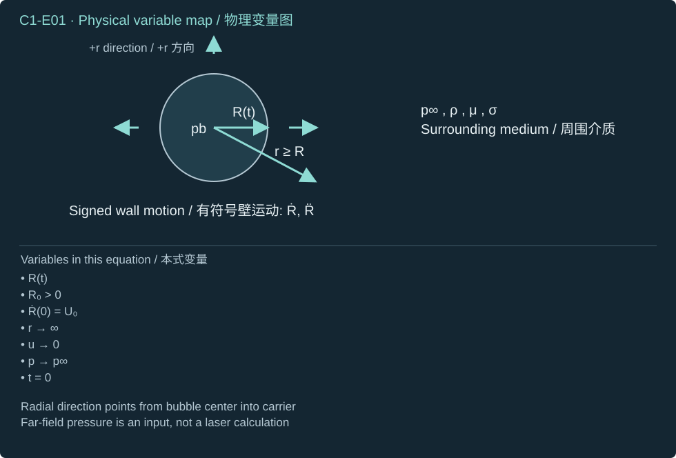

The evolving spherical boundary and the prescribed far-field state.

运动球形边界与给定的远场状态。

## 1.3 Derive Rayleigh–Plesset without hiding the derivative

## 1.3 不省略关键导数，推导 Rayleigh–Plesset 方程

**Step 1 — Conservation of carrier volume.** With radial symmetry, incompressibility makes the radial volume flux independent of radius. Integrate its radial derivative, and use the no-slip-in-the-normal-direction condition at the interface. No vapor density is required for this carrier-flow calculation.

**步骤 1——载液体积守恒。** 在径向对称条件下，不可压缩性使径向体积流量与半径无关。积分其径向导数，再应用界面法向无速度滑移条件。这一载液流动计算不需要蒸气密度。

**Symbols before Eq. (C1-E02).**

**式（C1-E02）前的符号定义。**

| First individual definition / 第一项单独定义 | Second individual definition / 第二项单独定义 |
| --- | --- |
| $r\ge R(t)>0$ is radial position (m) $r\ge R(t)>0$ 为径向位置（m） | $R$ is cavity radius (m) $R$ 为空腔半径（m） |
| $t$ is time (s) $t$ 为时间（s） | $u$ is radial carrier velocity (m s⁻¹) $u$ 为载液径向速度（m s⁻¹） |
| $\dot R$ is wall speed (m s⁻¹) $\dot R$ 为壁面速度（m s⁻¹） | $C(t)$ is the radius-independent flux factor (m³ s⁻¹), not a material constant $C(t)$ 为与径向位置无关的流量因子（m³ s⁻¹），并非材料常数 |

**Conventions and conditions.** $\partial/\partial r$ differentiates at fixed time; The implication arrows indicate integration and use of the interface condition.

**约定与条件。** $\partial/\partial r$ 表示固定时间下的径向求导；箭头表示积分及应用界面条件。

(C1-E02) · Exact continuity within the spherical model

$$
\frac{1}{r^2}\frac{\partial(r^2u)}{\partial r}=0\ \Longrightarrow\ r^2u=C(t),\qquad u(R,t)=\dot R\ \Longrightarrow\ C(t)=R^2\dot R,\qquad u(r,t)=\frac{R^2\dot R}{r^2}
$$

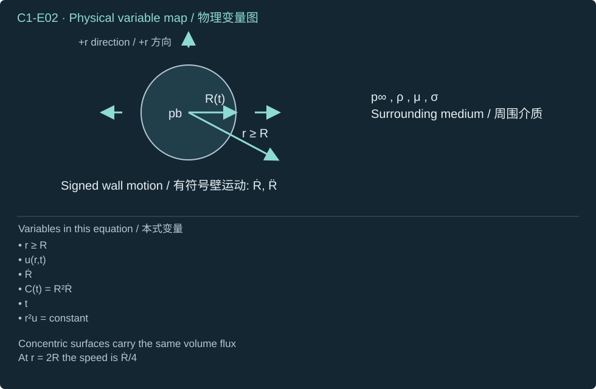

Inverse-square velocity decay places the inertia in the surrounding carrier.

速度按距离平方反比衰减，惯性来自周围载液。

**Step 2 — Fix the potential's reference.** Integrate the velocity from infinity to the chosen position. The resulting potential is valid in the liquid exterior. A constant added only in time is fixed by choosing zero potential at infinity.

**步骤 2——固定速度势的参考值。** 从无穷远积分速度至选定位置。所得速度势适用于液体外域。通过选取无穷远处速度势为零，固定仅随时间变化的附加常数。

**Symbols before Eq. (C1-E03).**

**式（C1-E03）前的符号定义。**

| First individual definition / 第一项单独定义 | Second individual definition / 第二项单独定义 |
| --- | --- |
| $\phi$ is velocity potential (m² s⁻¹) $\phi$ 为速度势（m² s⁻¹） | $r$ is liquid radial position (m) $r$ 为液体径向位置（m） |
| $R$ cavity radius (m) $R$ 为空腔半径（m） | $t$ is time (s) $t$ 为时间（s） |
| $s$ is a dummy radial integration coordinate (m) $s$ 为径向积分哑变量（m） | $u$ is radial velocity (m s⁻¹) $u$ 为径向速度（m s⁻¹） |
| $\dot R$ is wall speed (m s⁻¹) $\dot R$ 为壁面速度（m s⁻¹） |  |

**Conventions and conditions.** the integral is an improper integral convergent for $r\ge R>0$; $\partial/\partial r$ is the fixed-time spatial derivative.

**约定与条件。** 该广义积分在 $r\ge R>0$ 时收敛；$\partial/\partial r$ 为固定时间的空间导数。

(C1-E03) · Derived velocity potential

$$
\phi(r,t)=\int_\infty^r u(s,t)\,ds=R^2\dot R\int_\infty^r s^{-2}\,ds=-\frac{R^2\dot R}{r},\qquad \frac{\partial\phi}{\partial r}=u
$$

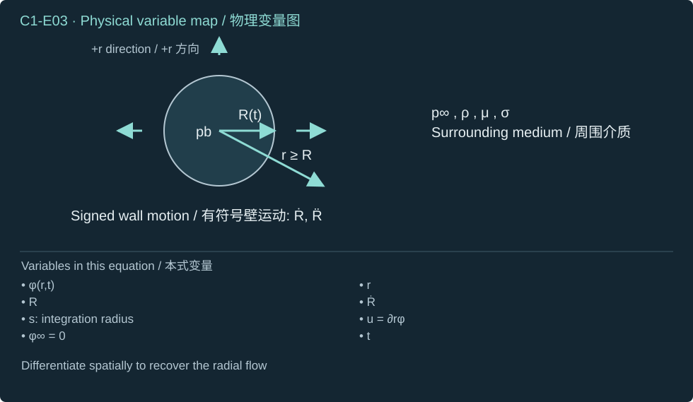

The potential reference is fixed at infinity before differentiation.

在求导之前，先固定无穷远处的速度势参考值。

**Step 3 — Differentiate at a fixed observation point.** The Eulerian derivative differentiates the numerator while holding the denominator fixed; only then is the observation point set equal to the instantaneous wall radius. Differentiating the wall value instead follows a moving point and includes an extra convective contribution.

**步骤 3——在固定观察点求导。** 欧拉时间导数只对分子求导，同时保持分母固定；之后才将观察点设为当前壁面半径。直接对壁面取值求导，相当于跟随运动点，会多出一个对流贡献。

**Symbols before Eq. (C1-E04).**

**式（C1-E04）前的符号定义。**

| First individual definition / 第一项单独定义 | Second individual definition / 第二项单独定义 |
| --- | --- |
| $\phi$ is velocity potential (m² s⁻¹) $\phi$ 为速度势（m² s⁻¹） | $t$ is time (s) $t$ 为时间（s） |
| $r$ is fixed radial position (m) $r$ 为固定径向位置（m） | $R(t)>0$ is moving cavity radius (m) $R(t)>0$ 为运动空腔半径（m） |
| $\dot R$ — Wall radial velocity (m s⁻¹) $\dot R$ — 壁面径向速度（m s⁻¹） | $\ddot R$ — Wall radial acceleration (m s⁻²) $\ddot R$ — 壁面径向加速度（m s⁻²） |

**Conventions and conditions.** vertical bars specify where the derivative is taken or evaluated; $d/dt$ follows the moving wall value; Each derivative has units m² s⁻².

**约定与条件。** 竖线表示求导或取值条件；$d/dt$ 跟随运动壁面的取值；各导数的单位均为 m² s⁻²。

(C1-E04) · Exact Eulerian and moving-point derivatives

$$
\left.\frac{\partial\phi}{\partial t}\right|_r=-\frac{2R\dot R^2+R^2\ddot R}{r},\qquad \left.\frac{\partial\phi}{\partial t}\right|_{r=R}=-(2\dot R^2+R\ddot R),\qquad \frac{d\phi(R(t),t)}{dt}=-\dot R^2-R\ddot R
$$

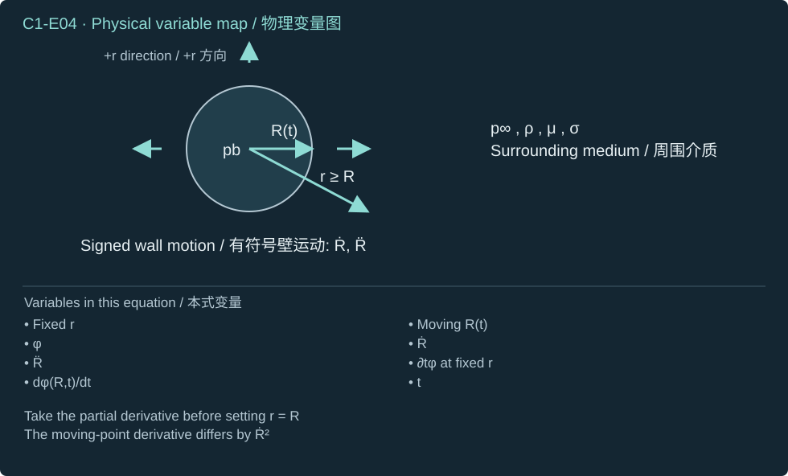

A fixed liquid observation point and a moving interface point have different time derivatives.

固定液体观察点与运动界面点对应不同的时间导数。

**Step 4 — Integrate the radial momentum equation.** This radial field is irrotational and its vector Laplacian vanishes in the exterior, so the bulk viscous force vanishes even though viscous normal stress and dissipation remain. Unsteady Bernoulli, referenced to infinity, then supplies the liquid-side pressure. Substitute the fixed-position derivative and the wall velocity; the coefficient is two minus one half.

**步骤 4——积分径向动量方程。** 此径向场无旋，且其矢量拉普拉斯在外域为零，因此体内黏性力为零，但黏性法向应力和耗散依然存在。以无穷远为参考的非定常伯努利方程给出液体侧压力。代入固定位置时间导数与壁面速度后，系数由二减去二分之一得到。

**Symbols before Eq. (C1-E05).**

**式（C1-E05）前的符号定义。**

| First individual definition / 第一项单独定义 | Second individual definition / 第二项单独定义 |
| --- | --- |
| $p_l$ is liquid pressure at the wall (Pa) $p_l$ 为壁面液体压力（Pa） | $p_\infty$ far-field pressure (Pa) $p_\infty$ 为远场压力（Pa） |
| $\rho>0$ is carrier density (kg m⁻³) $\rho>0$ 为载液密度（kg m⁻³） | $\phi$ is velocity potential (m² s⁻¹) $\phi$ 为速度势（m² s⁻¹） |
| $t$ is time (s) $t$ 为时间（s） | $r$ is radial position (m) $r$ 为径向位置（m） |
| $R>0$ cavity radius (m) $R>0$ 为空腔半径（m） | $u$ is radial velocity (m s⁻¹) $u$ 为径向速度（m s⁻¹） |
| $\dot R$ wall speed (m s⁻¹) $\dot R$ 为壁面速度（m s⁻¹） | $\ddot R$ is wall acceleration (m s⁻²) $\ddot R$ 为壁面加速度（m s⁻²） |

**Conventions and conditions.** $\partial_t$ is taken at fixed position before wall evaluation.

**约定与条件。** $\partial_t$ 必须先在固定位置求导，再于壁面取值。

(C1-E05) · Derived inertial pressure

$$
\frac{p_l-p_\infty}{\rho}=-\left.\frac{\partial\phi}{\partial t}\right|_{r=R}-\frac{u(R,t)^2}{2}=2\dot R^2+R\ddot R-\frac{\dot R^2}{2}=R\ddot R+\frac32\dot R^2
$$

Liquid inertia relates the interface pressure to wall acceleration and squared speed.

液体惯性把界面压力与壁面加速度及速度平方联系起来。

**Step 5 — Apply the clean-interface normal stress.** The radial rate of strain at the wall is negative during expansion. The capillary jump lowers liquid-side pressure relative to bubble pressure. Equal normal traction, including Newtonian viscous stress, gives the following pair of relations.

**步骤 5——应用洁净界面的法向应力。** 膨胀时壁面径向应变率为负。毛细压力跃变使液体侧压力低于气泡压力。包含牛顿黏性应力的法向牵引力平衡给出以下关系。

**Symbols before Eq. (C1-E06).**

**式（C1-E06）前的符号定义。**

| First individual definition / 第一项单独定义 | Second individual definition / 第二项单独定义 |
| --- | --- |
| $u$ — Radial liquid velocity (m s⁻¹) $u$ — 液体径向速度（m s⁻¹） | $\dot R$ — Bubble-wall radial velocity (m s⁻¹) $\dot R$ — 气泡壁面径向速度（m s⁻¹） |
| $r$ — Radial liquid position (m) $r$ — 液体径向位置（m） | $R>0$ — Positive cavity radius (m) $R>0$ — 正的空腔半径（m） |
| $p_l$ — Liquid-side pressure at the cavity wall (Pa) $p_l$ — 空腔壁面处的液体侧压力（Pa） | $p_b$ — Spatially uniform bubble pressure (Pa) $p_b$ — 空间均匀的气泡压力（Pa） |
| $\sigma\ge0$ — Nonnegative surface tension (N m⁻¹) $\sigma\ge0$ — 非负表面张力（N m⁻¹） | $\mu\ge0$ — Nonnegative carrier dynamic viscosity (Pa s) $\mu\ge0$ — 非负载液动力黏度（Pa s） |
| $\partial_r u$ — Radial strain rate, evaluated at the wall (s⁻¹) $\partial_r u$ — 在壁面取值的径向应变率（s⁻¹） |  |

**Conventions and conditions.** wall evaluation is performed at $r=R$.

**约定与条件。** 壁面取值在 $r=R$ 处进行。

(C1-E06) · Newtonian stress and capillary boundary condition

$$
\left.\frac{\partial u}{\partial r}\right|_{r=R}=\left.-\frac{2R^2\dot R}{r^3}\right|_{r=R}=-\frac{2\dot R}{R},\qquad p_l=p_b-\frac{2\sigma}{R}+2\mu\left.\frac{\partial u}{\partial r}\right|_{r=R}=p_b-\frac{2\sigma}{R}-\frac{4\mu\dot R}{R}
$$

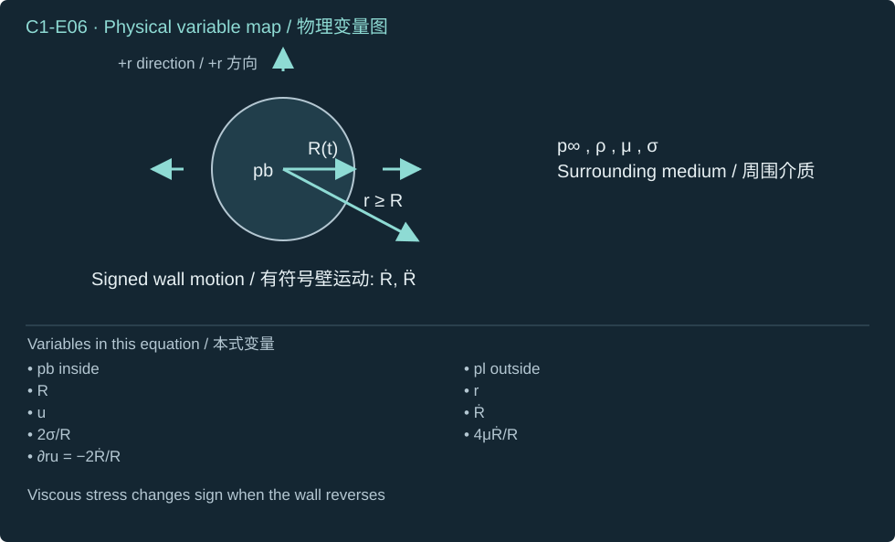

Capillary and viscous stresses act at the interface even when the radial bulk viscous force is zero.

即使径向体内黏性力为零，毛细与黏性应力仍作用于界面。

**Step 6 — Combine inertia and traction.** Substitute Eq. (C1-E06) into Eq. (C1-E05) and multiply by carrier density. This closes the radial momentum balance, but not the internal pressure. The surrounding aqueous carrier sets the inertia; replacing its density with liquid PFC density would describe a different exterior domain.

**步骤 6——联立惯性与牵引力。** 将式（C1-E06）代入式（C1-E05），再乘以载液密度。这闭合了径向动量平衡，却没有闭合内部压力。惯性由周围水性载液决定；若换成液态 PFC 密度，就相当于改换了外部流动区域。

**Symbols before Eq. (C1-E07).**

**式（C1-E07）前的符号定义。**

| First individual definition / 第一项单独定义 | Second individual definition / 第二项单独定义 |
| --- | --- |
| $\rho>0$ is carrier density (kg m⁻³) $\rho>0$ 为载液密度（kg m⁻³） | $R>0$ is cavity radius (m) $R>0$ 为空腔半径（m） |
| $\dot R$ — Wall radial velocity (m s⁻¹) $\dot R$ — 壁面径向速度（m s⁻¹） | $\ddot R$ — Wall radial acceleration (m s⁻²) $\ddot R$ — 壁面径向加速度（m s⁻²） |
| $p_b$ — Uniform bubble absolute pressure (Pa) $p_b$ — 均匀气泡绝对压力（Pa） | $p_\infty$ — Far-field absolute pressure (Pa) $p_\infty$ — 远场绝对压力（Pa） |
| $\sigma$ is constant surface tension (N m⁻¹) $\sigma$ 为常数表面张力（N m⁻¹） | $\mu$ is constant carrier viscosity (Pa s) $\mu$ 为常数载液黏度（Pa s） |

**Conventions and conditions.** Every term is a pressure.

**约定与条件。** 各项均具有压力单位。

(C1-E07) · Rayleigh–Plesset under the declared assumptions

$$
\rho\left(R\ddot R+\frac32\dot R^2\right)=p_b-p_\infty-\frac{2\sigma}{R}-\frac{4\mu\dot R}{R}
$$

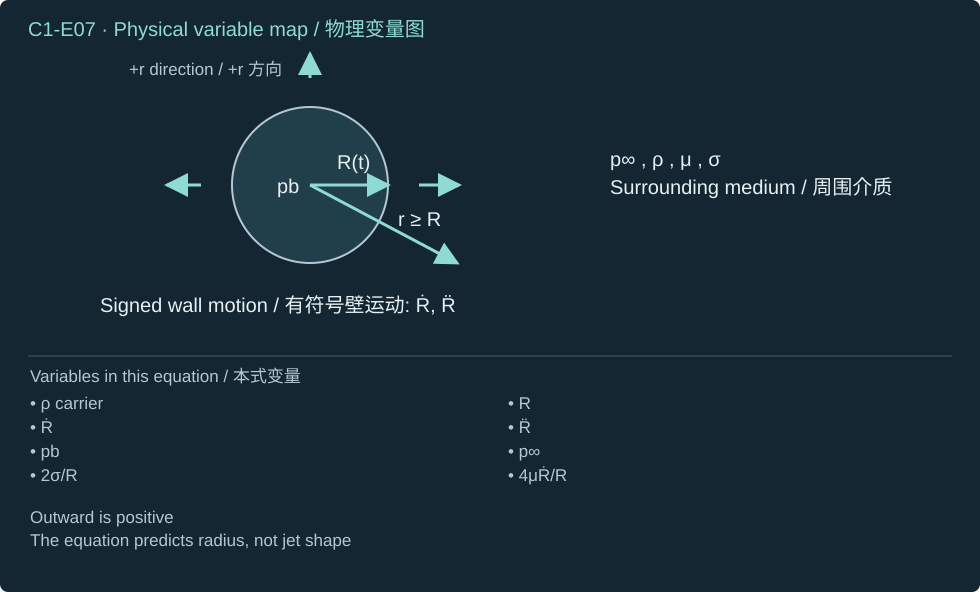

The spherical pressure–inertia balance has a scalar radial state.

球形压力—惯性平衡只具有标量径向状态。

Dimensions give density times length times acceleration = Pa; surface tension divided by radius and viscosity times speed divided by radius are also Pa. At rest, balance requires bubble pressure to exceed far-field pressure by the capillary jump. During inward motion, the viscous pressure term is positive and resists collapse. A negative right side is not alone the acceleration: the squared-speed term must also be subtracted when solving for acceleration. These results agree with the classical spherical treatment. [[R1]](../reference/sources.html#r1) [[Brennen, Ch. 2]](https://media.library.caltech.edu/CaltechBOOK%3A1995.001/chap2.htm)

量纲检查表明，密度乘长度乘加速度的单位为 Pa；表面张力除以半径、以及黏度乘速度除以半径也均为 Pa。静止时，气泡压力必须比远场压力高出毛细压力跃变。向内运动时，黏性压力项为正，阻碍塌缩。右端为负并不能单独给出加速度；求解加速度时还必须减去速度平方项。这些结果与经典球形理论一致。 [[R1]](../reference/sources.html#r1) [[Brennen，第 2 章]](https://media.library.caltech.edu/CaltechBOOK%3A1995.001/chap2.htm)

**Symbols before Eq. (C1-E08).**

**式（C1-E08）前的符号定义。**

| First individual definition / 第一项单独定义 | Second individual definition / 第二项单独定义 |
| --- | --- |
| $p_b$ is uniform total bubble pressure (Pa) $p_b$ 为空间均匀的气泡总压力（Pa） | $p_{v,\mathrm{PFC}}$ is the PFC-vapor partial pressure (Pa) $p_{v,\mathrm{PFC}}$ 为 PFC 蒸气分压（Pa） |
| $p_{v,w}$ water-vapor partial pressure (Pa) $p_{v,w}$ 为水蒸气分压（Pa） | $p_g$ permanent-gas partial pressure (all Pa) $p_g$ 为非凝结气体分压（均为 Pa） |

**Conventions and conditions.** Subscript $v$ labels vapor, PFC its chemical family; Additivity assumes a gas-mixture pressure description with the stated partial pressures; $w$ water; $g$ noncondensable gas.

**约定与条件。** 下标 $v$ 表示蒸气，PFC 表示该化学物质族；相加关系采用具有上述分压定义的气体混合物压力描述；$w$ 表示水；$g$ 表示非凝结气体。

(C1-E08) · Pressure composition requiring thermodynamic closure

$$
p_b=p_{v,\mathrm{PFC}}+p_{v,w}+p_g
$$

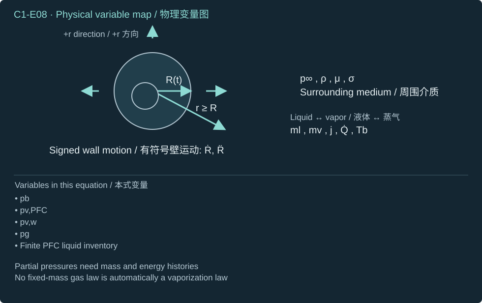

The mechanical input comes from the evolving contents, not from radius alone.

力学输入来自不断变化的气泡内容物，不能仅由半径决定。

A polytropic fixed-mass gas law is a useful gas-bubble control only when its mass and heat-transfer assumptions apply. Evaporation and condensation exchange mass and latent heat; they cannot be silently replaced by a permanent-gas law. The uniform-pressure approximation itself requires internal communication fast enough compared with state evolution. Chapter 2 will state the finite-inventory closure explicitly. [[R5]](../reference/sources.html#r5)

定质量多方气体定律只有在其质量与传热假设适用时，才能作为有用的气泡对照模型。蒸发与凝结伴随质量和潜热交换，不能悄然替换为非凝结气体定律。空间均匀压力近似本身也要求内部压力通信足够快，能够跟上状态演化。第二章将明确给出有限库存的闭合关系。 [[R5]](../reference/sources.html#r5)

## 1.4 Derive the carrier energy balance

## 1.4 推导载液能量平衡

**Step 7 — Integrate kinetic energy through the whole exterior.** Square the velocity from Eq. (C1-E02), multiply by the spherical volume element, and integrate. Although the domain is infinite, the remaining inverse-square integral converges. The effective moving inertia therefore belongs to carrier liquid extending beyond the cavity.

**步骤 7——在整个外域积分动能。** 将式（C1-E02）的速度平方，乘以球形体积元，再积分。尽管区域无限，剩余的平方反比积分仍收敛。因此，有效运动惯性属于空腔之外的载液。

**Symbols before Eq. (C1-E09).**

**式（C1-E09）前的符号定义。**

| First individual definition / 第一项单独定义 | Second individual definition / 第二项单独定义 |
| --- | --- |
| $K_l$ is exterior liquid kinetic energy (J) $K_l$ 为外部液体动能（J） | $\rho$ is carrier density (kg m⁻³) $\rho$ 为载液密度（kg m⁻³） |
| $u$ is radial liquid speed (m s⁻¹) $u$ 为径向液体速度（m s⁻¹） | $\dot R$ wall speed (m s⁻¹) $\dot R$ 为壁面速度（m s⁻¹） |
| $t$ is time (s) $t$ 为时间（s） | $R>0$ is cavity radius (m) $R>0$ 为空腔半径（m） |
| $r$ the integration radius (m) $r$ 为积分半径（m） | $\pi$ is the circle constant (dimensionless) $\pi$ 为圆周率（无量纲） |

**Conventions and conditions.** $4\pi r^2dr$ is the spherical volume element (m³); endpoint brackets mean upper minus lower evaluation.

**约定与条件。** $4\pi r^2dr$ 为球形体积元（m³）；端点方括号表示上限取值减下限取值。

(C1-E09) · Exact kinetic-energy integral in the spherical model

$$
\begin{aligned}K_l&=\int_R^\infty\frac12\rho u(r,t)^2\,4\pi r^2\,dr\\&=2\pi\rho R^4\dot R^2\int_R^\infty r^{-2}\,dr\\&=2\pi\rho R^4\dot R^2\left[-\frac1r\right]_R^\infty=2\pi\rho R^3\dot R^2.\end{aligned}
$$

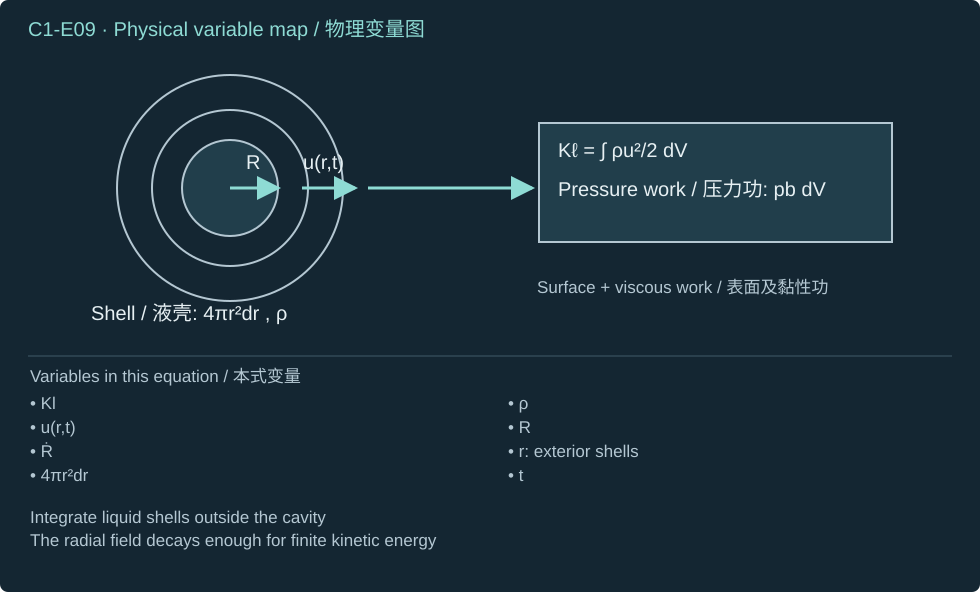

Exterior shells contribute finite kinetic energy even in an infinite domain.

即使外域无限，外部液壳贡献的总动能仍有限。

**Step 8 — Differentiate stored energies explicitly.** Radius changes both the volume of moving liquid and its speed. Apply the product rule; separately differentiate the geometric cavity volume and interface energy. Constant surface tension is needed for the last derivative.

**步骤 8——明确求出储能导数。** 半径变化同时改变运动液体体积和速度。应用乘积求导规则；另外分别对几何空腔体积与界面能求导。最后一项导数要求表面张力为常数。

**Symbols before Eq. (C1-E10).**

**式（C1-E10）前的符号定义。**

| First individual definition / 第一项单独定义 | Second individual definition / 第二项单独定义 |
| --- | --- |
| $K_l$ — Carrier kinetic energy (J) $K_l$ — 载液动能（J） | $E_\sigma$ — Interfacial energy (J) $E_\sigma$ — 界面能（J） |
| $t$ is time (s) $t$ 为时间（s） | $\rho$ is carrier density (kg m⁻³) $\rho$ 为载液密度（kg m⁻³） |
| $R$ is radius (m) $R$ 为半径（m） | $\dot R$ — Wall radial velocity (m s⁻¹) $\dot R$ — 壁面径向速度（m s⁻¹） |
| $\ddot R$ — Wall radial acceleration (m s⁻²) $\ddot R$ — 壁面径向加速度（m s⁻²） | $V_b$ is cavity volume (m³) $V_b$ 为空腔体积（m³） |
| $\dot V_b$ its time derivative (m³ s⁻¹) $\dot V_b$ 为其时间导数（m³ s⁻¹） | $\sigma$ is constant surface tension (N m⁻¹) $\sigma$ 为常数表面张力（N m⁻¹） |
| $\pi$ is the circle constant (dimensionless) $\pi$ 为圆周率（无量纲） |  |

**Conventions and conditions.** Energy derivatives are powers (W).

**约定与条件。** 能量的时间导数为功率（W）。

(C1-E10) · Exact product-rule derivatives

$$
\begin{aligned}\frac{dK_l}{dt}&=2\pi\rho\left(3R^2\dot R^3+2R^3\dot R\ddot R\right)=4\pi R^2\dot R\,\rho\left(R\ddot R+\frac32\dot R^2\right),\\V_b&=\frac{4\pi R^3}{3},\qquad \dot V_b=4\pi R^2\dot R,\\E_\sigma&=4\pi\sigma R^2,\qquad \frac{dE_\sigma}{dt}=8\pi\sigma R\dot R.\end{aligned}
$$

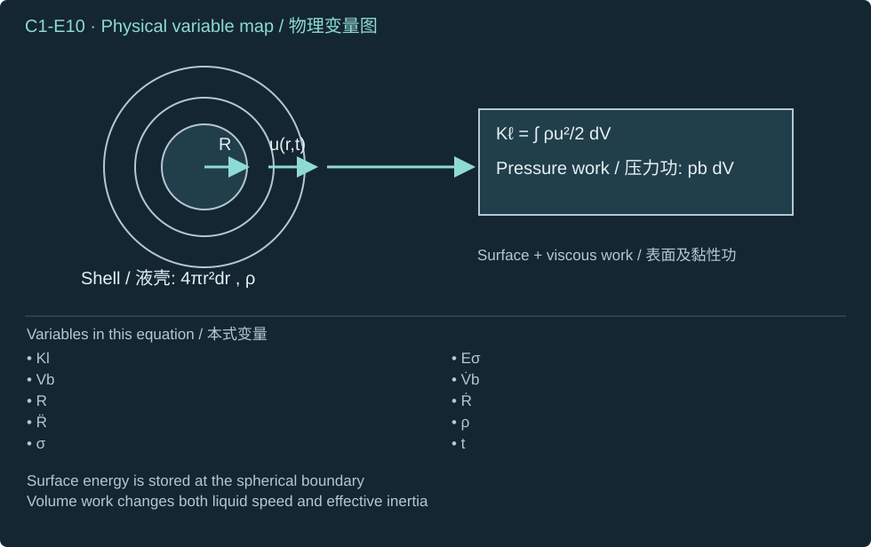

Volume work couples kinetic storage, interface storage and dissipation.

体积功耦合动能储存、界面能储存与耗散。

**Step 9 — Multiply the momentum balance by volume rate.** The left side becomes the first row of Eq. (C1-E10). The capillary term becomes minus the surface-energy derivative. The viscous term is negative regardless of expansion or collapse because it contains squared speed.

**步骤 9——将动量平衡乘以体积变化率。** 左侧成为式（C1-E10）的第一行。毛细项成为界面能导数的负值。黏性项包含速度平方，因此无论膨胀或塌缩均为负。

**Symbols before Eq. (C1-E11).**

**式（C1-E11）前的符号定义。**

| First individual definition / 第一项单独定义 | Second individual definition / 第二项单独定义 |
| --- | --- |
| $t$ is time (s) $t$ 为时间（s） | $K_l$ — Carrier kinetic energy (J) $K_l$ — 载液动能（J） |
| $E_\sigma$ — Interfacial energy (J) $E_\sigma$ — 界面能（J） | $p_b$ — Uniform bubble absolute pressure (Pa) $p_b$ — 均匀气泡绝对压力（Pa） |
| $p_\infty$ — Far-field absolute pressure (Pa) $p_\infty$ — 远场绝对压力（Pa） | $\dot V_b$ is cavity volume rate (m³ s⁻¹) $\dot V_b$ 为空腔体积变化率（m³ s⁻¹） |
| $\mu\ge0$ is carrier viscosity (Pa s) $\mu\ge0$ 为载液黏度（Pa s） | $R>0$ is cavity radius (m) $R>0$ 为空腔半径（m） |
| $\dot R$ is wall speed (m s⁻¹) $\dot R$ 为壁面速度（m s⁻¹） | $\pi$ is the circle constant (dimensionless) $\pi$ 为圆周率（无量纲） |

**Conventions and conditions.** The nonnegative term is dissipated power (W).

**约定与条件。** 非负项是耗散功率（W）。

(C1-E11) · Derived mechanical-energy balance

$$
\frac{d}{dt}(K_l+E_\sigma)=(p_b-p_\infty)\dot V_b-16\pi\mu R\dot R^2,\qquad 16\pi\mu R\dot R^2\ge0
$$

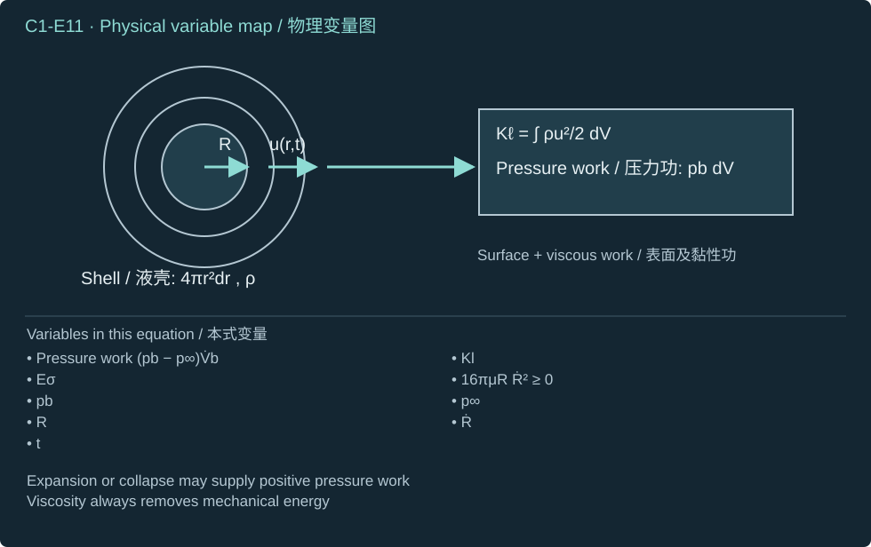

The pressure source supplies mechanical work; focusing cannot create extra energy.

压力源提供机械功；聚焦不能产生额外能量。

The dissipation can also be checked directly. The radial strain rates are minus twice, once and once the wall-speed flux factor divided by distance cubed. Their squared sum is six times that factor squared. Integrating the Newtonian dissipation density therefore recovers exactly the loss in Eq. (C1-E11). This independent route confirms its sign and numerical coefficient.

耗散还可以直接检验。三个主应变率分别为壁面速度流量因子除以距离三次方的负二倍、一倍与一倍；平方和为该因子平方的六倍。积分牛顿耗散密度，可准确恢复式（C1-E11）的损失项。这条独立推导路径检验了其符号与数值系数。

**Symbols before Eq. (C1-E12).**

**式（C1-E12）前的符号定义。**

| First individual definition / 第一项单独定义 | Second individual definition / 第二项单独定义 |
| --- | --- |
| $D_{rr}$ — Radial strain-rate component (s⁻¹) $D_{rr}$ — 径向应变率分量（s⁻¹） | $D_{\theta\theta}$ — Polar tangential strain-rate component (s⁻¹) $D_{\theta\theta}$ — 极角切向应变率分量（s⁻¹） |
| $D_{\psi\psi}$ — Azimuthal tangential strain-rate component (s⁻¹) $D_{\psi\psi}$ — 方位角切向应变率分量（s⁻¹） | $\mathcal D_\mu$ is total viscous dissipation rate (W) $\mathcal D_\mu$ 为总黏性耗散率（W） |
| $\mu$ is viscosity (Pa s) $\mu$ 为黏度（Pa s） | $R>0$ is radius (m) $R>0$ 为半径（m） |
| $r$ radial integration position (m) $r$ 为径向积分位置（m） | $\dot R$ is wall speed (m s⁻¹) $\dot R$ 为壁面速度（m s⁻¹） |
| $\pi$ is the circle constant (dimensionless) $\pi$ 为圆周率（无量纲） | $\theta$ — Polar direction label in the strain-rate components (—) $\theta$ — 应变率分量中的极角方向标记（—） |
| $\psi$ — Azimuthal direction label, distinct from velocity potential (—) $\psi$ — 与速度势区别使用的方位角方向标记（—） | $\phi$ — Velocity potential (m² s⁻¹) $\phi$ — 速度势（m² s⁻¹） |

**Conventions and conditions.** The integral is over the liquid exterior; angular labels do not reuse the potential symbol $\phi$.

**约定与条件。** 积分区域为液体外域；角向标记不复用速度势符号 $\phi$。

(C1-E12) · Independent dissipation and conservation check

$$
\begin{aligned}D_{rr}&=-\frac{2R^2\dot R}{r^3},\qquad D_{\theta\theta}=D_{\psi\psi}=\frac{R^2\dot R}{r^3},\\\mathcal D_\mu&=\int_R^\infty 2\mu\left(D_{rr}^2+D_{\theta\theta}^2+D_{\psi\psi}^2\right)4\pi r^2\,dr\\&=48\pi\mu R^4\dot R^2\int_R^\infty r^{-4}\,dr=16\pi\mu R\dot R^2.\end{aligned}
$$

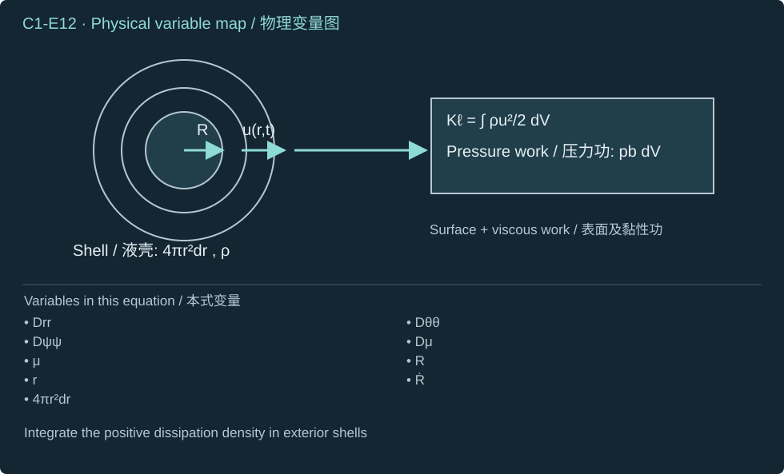

Direct strain-rate integration verifies the mechanical-energy loss.

直接积分应变率检验机械能损失。

The energy balance gives a useful design warning. More confinement can redirect liquid, while also requiring more pressure work, storing elastic energy, or dissipating energy. A larger incident laser pulse does not specify how much energy reaches carrier motion. The thermodynamic source and the mechanical receiver must both be accounted for.

能量平衡给出一个设计提醒：更强约束能够改变流动方向，同时也可能需要更多压力功、储存弹性能或耗散能量。入射激光脉冲增大，并不能确定有多少能量进入载液运动。必须同时核算热力学源与机械受载体系。

## 1.5 Solve ideal collapse and derive the coefficient

## 1.5 解出理想塌缩并推导系数

**Step 10 — Declare the reduced initial-value problem.** Set time zero at maximum radius with zero wall speed. Assume constant far-field and vapor pressures with a positive difference; omit surface tension, viscosity, permanent gas and liquid compressibility. This removes thermal and phase dynamics rather than proving that they are small in PFC. A hot vapor-rich cavity may still be growing under quite different conditions.

**步骤 10——声明约化初值问题。** 令零时刻对应最大半径，且壁面速度为零。假设远场压力与蒸气压为常数，两者差值为正；忽略表面张力、黏度、非凝结气体与液体可压缩性。这是在删除热与相变动力学，并非证明它们在 PFC 中很小。高温富蒸气空腔在完全不同的条件下仍可能增长。

**Symbols before Eq. (C1-E13).**

**式（C1-E13）前的符号定义。**

| First individual definition / 第一项单独定义 | Second individual definition / 第二项单独定义 |
| --- | --- |
| $\Delta p_c>0$ is constant collapse-driving pressure (Pa) $\Delta p_c>0$ 为常数塌缩驱动压差（Pa） | $p_\infty$ — Constant Far-field absolute pressure (Pa) $p_\infty$ — 恒定的远场绝对压力（Pa） |
| $p_v$ — Stipulated constant vapor pressure (Pa) $p_v$ — 假定恒定蒸气压（Pa） | $t=0$ is maximum-radius time (s) $t=0$ 为最大半径时刻（s） |
| $R>0$ — Instantaneous cavity radius (m) $R>0$ — 瞬时空腔半径（m） | $R_{\max}>0$ — Radius at the start of ideal collapse (m) $R_{\max}>0$ — 理想塌缩开始时的半径（m） |
| $\dot R$ — Wall radial velocity (m s⁻¹) $\dot R$ — 壁面径向速度（m s⁻¹） | $\ddot R$ — Wall radial acceleration (m s⁻²) $\ddot R$ — 壁面径向加速度（m s⁻²） |
| $\rho>0$ is carrier density (kg m⁻³) $\rho>0$ 为载液密度（kg m⁻³） |  |(C1-E13) · Idealized collapse initial-value problem

$$
\Delta p_c=p_\infty-p_v>0,\qquad R(0)=R_{\max},\quad \dot R(0)=0,\qquad R\ddot R+\frac32\dot R^2=-\frac{\Delta p_c}{\rho}
$$

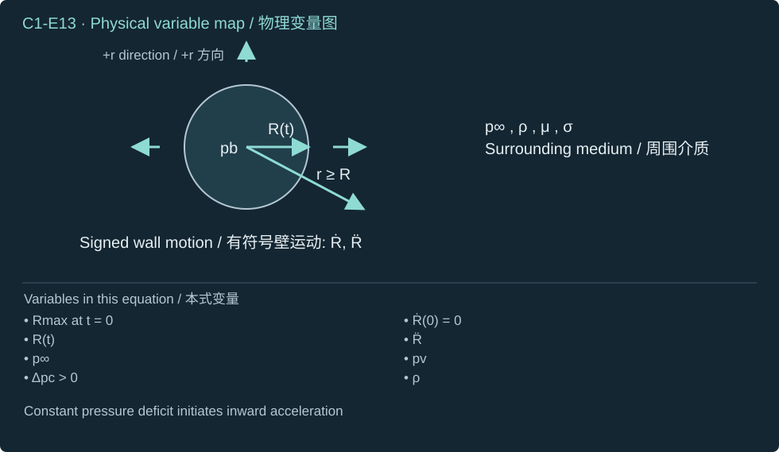

The ideal control begins at rest and excludes the mechanisms that arrest real collapse.

理想对照从静止开始，并排除了阻止实际塌缩的机制。

**Step 11 — Change the independent variable only on the collapse branch.** Initial acceleration is negative, so radius decreases for the interior of this branch. Define squared speed as a function of radius. Away from the turning point, use the chain rule and cancel the nonzero speed; extend the resulting relation continuously back to the initial endpoint. Multiply the first-order equation by radius cubed to form an exact derivative.

**步骤 11——仅在塌缩分支上改变自变量。** 初始加速度为负，因此半径在这一分支内部递减。把速度平方定义为半径函数。在转折点之外使用链式法则，并约去非零速度；随后通过连续延拓把关系带回初始端点。将一阶方程乘以半径三次方，形成完整导数。

**Symbols before Eq. (C1-E14).**

**式（C1-E14）前的符号定义。**

| First individual definition / 第一项单独定义 | Second individual definition / 第二项单独定义 |
| --- | --- |
| $y(R)$ is squared wall speed (m² s⁻²) $y(R)$ 为壁面速度平方（m² s⁻²） | $R\in(0,R_{\max})$ is decreasing radius (m) $R\in(0,R_{\max})$ 为递减半径（m） |
| $t$ is time (s) $t$ 为时间（s） | $\dot R\ne0$ — Wall radial velocity (m s⁻¹) $\dot R\ne0$ — 壁面径向速度（m s⁻¹） |
| $\ddot R$ — Wall radial acceleration (m s⁻²) $\ddot R$ — 壁面径向加速度（m s⁻²） | $\Delta p_c$ is positive pressure difference (Pa) $\Delta p_c$ 为正压差（Pa） |
| $\rho$ is carrier density (kg m⁻³) $\rho$ 为载液密度（kg m⁻³） |  |

**Conventions and conditions.** $d/dR$ and $d/dt$ are ordinary derivatives on the monotonic branch; Radius powers are the integrating factor, not derivatives.

**约定与条件。** $d/dR$ 与 $d/dt$ 为单调分支上的普通导数；半径幂构成积分因子，并非导数。

(C1-E14) · Exact chain rule and integrating factor

$$
\begin{aligned}y(R)&=\dot R^2,\qquad \frac{dy}{dt}=\frac{dy}{dR}\dot R=2\dot R\ddot R\quad\Longrightarrow\quad\ddot R=\frac12\frac{dy}{dR},\\\frac{dy}{dR}+\frac{3y}{R}&=-\frac{2\Delta p_c}{\rho R},\\\frac{d(R^3y)}{dR}&=R^3\frac{dy}{dR}+3R^2y=-\frac{2\Delta p_c}{\rho}R^2.\end{aligned}
$$

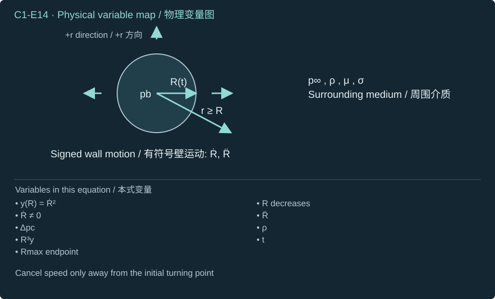

The monotonic collapse branch allows radius to replace time in the first integration.

单调塌缩分支允许在第一次积分中以半径取代时间。

**Symbols before Eq. (C1-E15).**

**式（C1-E15）前的符号定义。**

| First individual definition / 第一项单独定义 | Second individual definition / 第二项单独定义 |
| --- | --- |
| $R\in(0,R_{\max}]$ — Instantaneous cavity radius (m) $R\in(0,R_{\max}]$ — 瞬时空腔半径（m） | $R_{\max}$ — Radius at the start of ideal collapse (m) $R_{\max}$ — 理想塌缩开始时的半径（m） |
| $y$ is squared speed (m² s⁻²) $y$ 为速度平方（m² s⁻²） | $s$ is dummy radius (m) $s$ 为积分哑半径（m） |
| $\Delta p_c>0$ is collapse pressure (Pa) $\Delta p_c>0$ 为塌缩压差（Pa） | $\rho>0$ is carrier density (kg m⁻³) $\rho>0$ 为载液密度（kg m⁻³） |
| $\dot R\le0$ is inward wall velocity (m s⁻¹) $\dot R\le0$ 为向内壁面速度（m s⁻¹） |  |

**Conventions and conditions.** The square root denotes the nonnegative root; its prefixed minus sign selects collapse.

**约定与条件。** 根号表示非负平方根；前置负号选择塌缩分支。

(C1-E15) · Integrated speed with initial constant and branch

$$
\begin{aligned}R^3y(R)-R_{\max}^3y(R_{\max})&=-\frac{2\Delta p_c}{\rho}\int_{R_{\max}}^R s^2\,ds=-\frac{2\Delta p_c}{3\rho}(R^3-R_{\max}^3),\\y(R_{\max})&=0,\qquad \dot R=-\sqrt{\frac{2\Delta p_c}{3\rho}\left[\left(\frac{R_{\max}}{R}\right)^3-1\right]}.\end{aligned}
$$

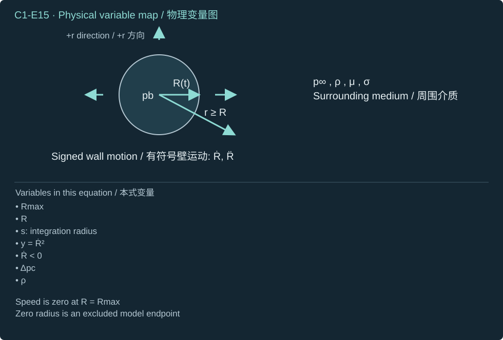

The initial condition fixes the integration constant and the inward sign fixes the branch.

初值确定积分常数，向内的符号确定解分支。

**Step 12 — Separate dimensions from the dimensionless trajectory.** Integrate reciprocal inward speed from maximum radius to zero. Change radius to a fraction of maximum radius. The same positive dimensionless integral applies to every member of this ideal family, which proves the proportionality rather than merely guessing it from units.

**步骤 12——将量纲尺度与无量纲轨迹分离。** 从最大半径至零积分向内速度的倒数，再把半径换成最大半径的比例。该理想模型族中的所有情形具有相同的正无量纲积分，因此得到的是比例关系的证明，而不只是量纲猜测。

**Symbols before Eq. (C1-E16).**

**式（C1-E16）前的符号定义。**

| First individual definition / 第一项单独定义 | Second individual definition / 第二项单独定义 |
| --- | --- |
| $t_c$ is ideal collapse time (s) $t_c$ 为理想塌缩时间（s） | $R$ is radius (m) $R$ 为半径（m） |
| $R_{\max}$ its maximum (m) $R_{\max}$ 为其最大值（m） | $\dot R<0$ is inward velocity (m s⁻¹) $\dot R<0$ 为向内速度（m s⁻¹） |
| $\rho$ is density (kg m⁻³) $\rho$ 为密度（kg m⁻³） | $\Delta p_c>0$ is pressure difference (Pa) $\Delta p_c>0$ 为压差（Pa） |
| $x=R/R_{\max}\in[0,1]$ is dimensionless radius $x=R/R_{\max}\in[0,1]$ 为无量纲半径 | $C_t$ is the dimensionless time coefficient $C_t$ 为无量纲时间系数 |
| $dx$ — Dimensionless-radius integration measure (dimensionless) $dx$ — 无量纲半径积分微元（无量纲） | $dR$ — Radius integration measure (m) $dR$ — 半径积分微元（m） |

**Conventions and conditions.** definite integrals follow the collapse branch.

**约定与条件。** 定积分沿塌缩分支进行。

(C1-E16) · Exact separation and nondimensionalization

$$
\begin{aligned}t_c&=\int_{R_{\max}}^0\frac{dR}{\dot R}=\sqrt{\frac{3\rho}{2\Delta p_c}}\int_0^{R_{\max}}\frac{dR}{\sqrt{(R_{\max}/R)^3-1}},\\x&=\frac{R}{R_{\max}},\qquad dR=R_{\max}dx,\\t_c&=R_{\max}\sqrt{\frac{\rho}{\Delta p_c}}\ C_t,\qquad C_t=\sqrt{\frac32}\int_0^1\frac{x^{3/2}}{\sqrt{1-x^3}}\,dx.\end{aligned}
$$

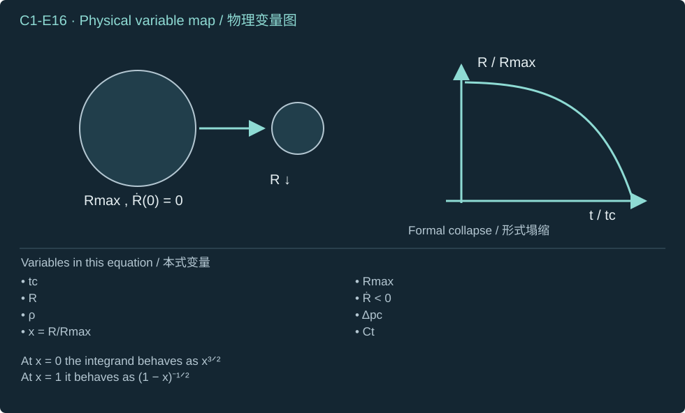

The endpoint singularity is integrable, so the model has a finite collapse time.

端点奇异性可积，因此该模型具有有限塌缩时间。

**Step 13 — Evaluate the coefficient, including the Jacobian.** Set the new integration variable equal to the cube of normalized radius. The radius power contributes a factor with exponent one half, and the Jacobian contributes exponent minus two thirds; their sum is minus one sixth. Recognize the beta integral. Both beta arguments are positive, establishing convergence. This derived coefficient agrees with the published Rayleigh factor. [[R1]](../reference/sources.html#r1) [[R3]](../reference/sources.html#r3)

**步骤 13——连同雅可比因子一起求出系数。** 令新积分变量为无量纲半径的三次方。半径幂贡献二分之一的指数，雅可比因子贡献负三分之二的指数；相加得到负六分之一。将其识别为贝塔积分。两个贝塔参数均为正，保证积分收敛。推导所得系数与文献中的瑞利因子一致。 [[R1]](../reference/sources.html#r1) [[R3]](../reference/sources.html#r3)

**Symbols before Eq. (C1-E17).**

**式（C1-E17）前的符号定义。**

| First individual definition / 第一项单独定义 | Second individual definition / 第二项单独定义 |
| --- | --- |
| $x$ — Dimensionless radius divided by the maximum radius (dimensionless) $x$ — 半径除以最大半径所得无量纲量（无量纲） | $q=x^3$ — Dimensionless substitution variable equal to the cube of the radius fraction (dimensionless) $q=x^3$ — 等于半径比例立方的无量纲换元变量（无量纲） |
| $C_t$ is the dimensionless collapse-time coefficient $C_t$ 为无量纲塌缩时间系数 | $B(a,b)$ is the beta function, defined by the displayed convergent integral (dimensionless) $B(a,b)$ 为贝塔函数，由公式中的收敛积分定义（无量纲） |
| $a$ — Positive first argument of the beta function (dimensionless) $a$ — 贝塔函数的正第一参数（无量纲） | $b$ — Positive second argument of the beta function (dimensionless) $b$ — 贝塔函数的正第二参数（无量纲） |
| $dx$ — Dimensionless-radius integration measure (dimensionless) $dx$ — 无量纲半径积分微元（无量纲） | $dq$ — Dimensionless substitution integration measure (dimensionless) $dq$ — 无量纲换元积分微元（无量纲） |

**Conventions and conditions.** The numeral 6 inside the root is a dimensionless constant; the ellipsis indicates decimal continuation; $x,q\in[0,1]$ and $q=x^3$ define the substitution domain..

**约定与条件。** 根号中的数字 6 为无量纲常数；省略号表示后续小数；$x,q\in[0,1]$ 且 $q=x^3$ 确定换元范围。。

(C1-E17) · Evaluated beta-function coefficient

$$
\begin{aligned}q&=x^3,\quad x=q^{1/3},\quad dx=\frac13q^{-2/3}\,dq,\\C_t&=\frac{1}{\sqrt6}\int_0^1q^{-1/6}(1-q)^{-1/2}\,dq=\frac{1}{\sqrt6}B\left(\frac56,\frac12\right)=0.9146813565\ldots,\\B(a,b)&=\int_0^1q^{a-1}(1-q)^{b-1}\,dq\quad(a>0,b>0).\end{aligned}
$$

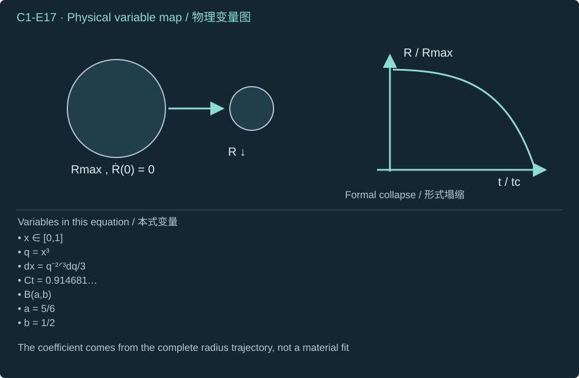

The change of variables exposes the beta integral that fixes the numerical coefficient.

换元揭示贝塔积分，从而确定数值系数。

**Step 14 — Check energy against the integrated trajectory.** Substitute squared speed from Eq. (C1-E15) into the kinetic-energy integral. The result equals the pressure work done as cavity volume is lost. Zero speed at maximum radius gives zero kinetic energy there, while decreasing radius gives positive energy. This independently verifies the sign and integration constant.

**步骤 14——用积分轨迹检验能量。** 将式（C1-E15）的速度平方代入动能积分。结果等于空腔体积减少时的压力功。最大半径处速度为零，因此动能为零；半径减小时，动能为正。这独立检验了符号与积分常数。

**Symbols before Eq. (C1-E18).**

**式（C1-E18）前的符号定义。**

| First individual definition / 第一项单独定义 | Second individual definition / 第二项单独定义 |
| --- | --- |
| $K_l$ is carrier kinetic energy (J) $K_l$ 为载液动能（J） | $E_B$ the maximum-volume pressure-work scale (J) $E_B$ 为最大体积的压力功尺度（J） |
| $R\in(0,R_{\max}]$ — Instantaneous cavity radius (m) $R\in(0,R_{\max}]$ — 瞬时空腔半径（m） | $R_{\max}$ — Radius at the start of ideal collapse (m) $R_{\max}$ — 理想塌缩开始时的半径（m） |
| $\rho$ is density (kg m⁻³) $\rho$ 为密度（kg m⁻³） | $\Delta p_c$ is constant positive pressure difference (Pa) $\Delta p_c$ 为常数正压差（Pa） |
| $V_{\max}$ is maximum cavity volume (m³) $V_{\max}$ 为最大空腔体积（m³） | $\pi$ is the circle constant (dimensionless) $\pi$ 为圆周率（无量纲） |
| $K_l/E_B$ is dimensionless and this control has zero viscous and capillary losses $K_l/E_B$ 无量纲，此对照模型的黏性与毛细损失为零 |  |(C1-E18) · Independent pressure-work conservation check

$$
\begin{aligned}K_l(R)&=2\pi\rho R^3\frac{2\Delta p_c}{3\rho}\left[\left(\frac{R_{\max}}R\right)^3-1\right]=\frac{4\pi}{3}\Delta p_c(R_{\max}^3-R^3),\\E_B&=\Delta p_cV_{\max}=\frac{4\pi}{3}\Delta p_cR_{\max}^3,\qquad \frac{K_l}{E_B}=1-\left(\frac R{R_{\max}}\right)^3.\end{aligned}
$$

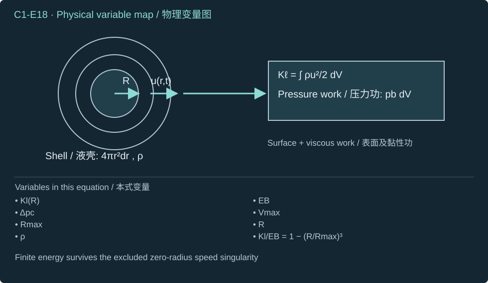

The Rayleigh speed solution and pressure-work balance agree exactly.

瑞利速度解与压力功平衡严格一致。

### Worked control: a 30 μm cavity

### 已解对照：30 μm 空腔

Use the supplied source's teaching inputs: maximum radius 30 μm, carrier density 1000 kg m⁻³, and collapse pressure 100 kPa. These are declared model inputs, not measured PFC properties. Substitute SI values before converting the outputs. At half radius, the cubic ratio is eight; subtracting one gives seven.

采用所提供文件的教学输入：最大半径 30 μm、载液密度 1000 kg m⁻³、塌缩压差 100 kPa。这些为声明的模型输入，并非 PFC 实测物性。先代入 SI 数值，再换算输出单位。在一半半径处，三次方比值为八；减去一后得到七。

**Symbols before Eq. (C1-E19).**

**式（C1-E19）前的符号定义。**

| First individual definition / 第一项单独定义 | Second individual definition / 第二项单独定义 |
| --- | --- |
| $t_c$ is collapse time (s) $t_c$ 为塌缩时间（s） | $E_B$ pressure-work scale (J) $E_B$ 为压力功尺度（J） |
| $K_l$ carrier kinetic energy (J) $K_l$ 为载液动能（J） | $R$ current radius (m) $R$ 为当前半径（m） |
| $R_{\max}=30\times10^{-6}$ m maximum radius $R_{\max}=30\times10^{-6}$ m 为最大半径 | $\dot R$ is signed wall speed (m s⁻¹) $\dot R$ 为带符号壁面速度（m s⁻¹） |
| $\Delta p_c=100\times10^3$ — Positive ideal-collapse pressure difference (Pa) $\Delta p_c=100\times10^3$ — 正的理想塌缩压差（Pa） | $\pi$ is the circle constant (dimensionless) $\pi$ 为圆周率（无量纲） |
| $\rho=1000$ — Substituted carrier density (kg m⁻³) $\rho=1000$ — 代入的载液密度（kg m⁻³） |  |

**Conventions and conditions.** s, J, μs and nJ mean seconds, joules, microseconds and nanojoules; the vertical bar specifies half-radius evaluation.

**约定与条件。** s、J、μs 与 nJ 分别为秒、焦耳、微秒与纳焦耳；竖线表示在一半半径处取值。

(C1-E19) · Declared teaching calculation

$$
\begin{aligned}t_c&=0.9146813565(30\times10^{-6})\sqrt{\frac{1000}{100\times10^3}}\ \mathrm s=2.74404\ \mu\mathrm s,\\E_B&=\frac{4\pi}{3}(100\times10^3)(30\times10^{-6})^3\ \mathrm J=11.3097\ \mathrm{nJ},\\\dot R\big|_{R=R_{\max}/2}&=-\sqrt{\frac{2(100\times10^3)}{3(1000)}(8-1)}\ \mathrm{m\,s^{-1}}=-21.6025\ \mathrm{m\,s^{-1}},\\K_l\big|_{R=R_{\max}/2}&=\frac78E_B=9.89602\ \mathrm{nJ}.\end{aligned}
$$

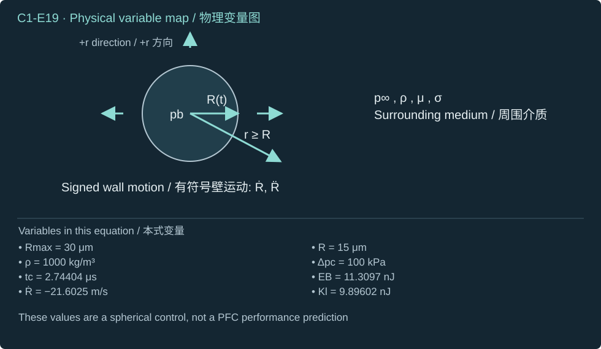

The original numerical control is preserved with its energy and branch checks.

保留原始数值对照，并补充能量与解分支检验。

The time scale has units of length times the square root of density divided by pressure, hence seconds. Doubling radius doubles time and multiplies the work scale by eight. Multiplying pressure difference by four halves time and doubles wall-speed magnitude at a fixed radius fraction; the coefficient remains unchanged because the dimensionless initial-value problem is unchanged. Gas cushioning, changing vapor pressure or confinement can change that problem and therefore its coefficient.

时间尺度的量纲为长度乘密度与压力之比的平方根，因此单位为秒。半径加倍使时间加倍，并使压力功尺度增至八倍。压差增至四倍使时间减半，并使固定半径比例处的壁面速率加倍；系数不变，是因为无量纲初值问题没有改变。气体缓冲、变化蒸气压或约束会改变该问题，因此也可能改变其系数。

As radius approaches zero, this model concentrates a finite energy into a shrinking moving-liquid scale and predicts unbounded wall speed. It does not prove unbounded physical velocity or a jet at all. Compressibility, internal pressure, thermal and mass transfer, molecular scales and loss of symmetry intervene. The next equation locates only where a selected Mach diagnostic is crossed in the ideal trajectory; it is neither an arrest law nor a maximum-speed prediction.

半径趋于零时，此模型把有限能量集中到不断缩小的运动液体尺度中，预测无界壁面速度。它既不能证明实际速度无界，也不能证明一定形成射流。可压缩性、内部压力、传热传质、分子尺度及对称性破坏都会介入。下一式仅定位理想轨迹越过所选马赫数诊断值的位置；它既不是终止塌缩定律，也不是最大速度预测。

**Symbols before Eq. (C1-E20).**

**式（C1-E20）前的符号定义。**

| First individual definition / 第一项单独定义 | Second individual definition / 第二项单独定义 |
| --- | --- |
| $M_w$ is wall Mach number (dimensionless) $M_w$ 为壁面马赫数（无量纲） | $\dot R$ is wall speed (m s⁻¹) $\dot R$ 为壁面速度（m s⁻¹） |
| $c>0$ is stipulated carrier sound speed (m s⁻¹) $c>0$ 为给定载液声速（m s⁻¹） | $M_*>0$ is a selected diagnostic Mach value (dimensionless) $M_*>0$ 为选择的诊断马赫值（无量纲） |
| $x_M=R_M/R_{\max}$ is the radius fraction when $M_w=M_*$ (dimensionless) $x_M=R_M/R_{\max}$ 为 $M_w=M_*$ 时的半径比例（无量纲） | $R_M$ — Cavity radius at the selected Mach value (m) $R_M$ — 选定马赫数处的空腔半径（m） |
| $R_{\max}$ — Radius at the start of ideal collapse (m) $R_{\max}$ — 理想塌缩开始时的半径（m） | $\rho$ is carrier density (kg m⁻³) $\rho$ 为载液密度（kg m⁻³） |
| $\Delta p_c$ is positive collapse pressure (Pa) $\Delta p_c$ 为正塌缩压差（Pa） |  |

**Conventions and conditions.** absolute bars denote magnitude; The number uses the previous teaching density and pressure.

**约定与条件。** 绝对值符号表示大小；数值使用前述教学密度与压差。

(C1-E20) · Ideal-trajectory diagnostic, not a physical limit

$$
M_w=\frac{|\dot R|}{c},\qquad x_M=\left[1+\frac{3\rho c^2M_*^2}{2\Delta p_c}\right]^{-1/3},\qquad M_*=0.1,\ c=1500\ \mathrm{m\,s^{-1}}\ \Longrightarrow\ x_M=0.143487
$$

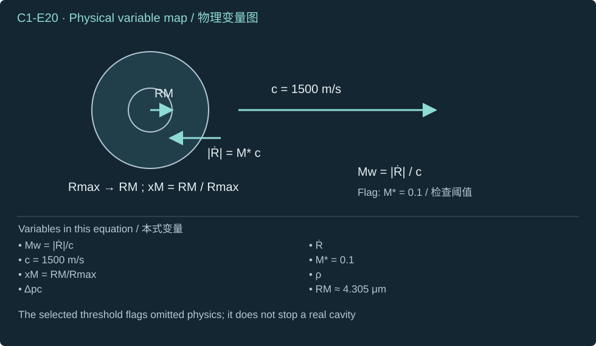

A Mach diagnostic exposes the shrinking validity range of incompressible collapse.

马赫数诊断揭示不可压缩塌缩模型的适用范围不断缩小。

## 1.6 Derive pressure impulse and locate directionality

## 1.6 推导压力冲量并定位方向性来源

**Step 15 — Define a field, not a pressure peak.** Pressure impulse is the time integral of local pressure relative to a spatially uniform reference. It is impulse per area, with units Pa s. Its spatial gradient will drive liquid acceleration. It must never be equated to the acoustic crossing time, which has units of seconds. The pressure-impulse literature motivates this short-event reduction; the following integration exposes its omitted terms. [[R2]](../reference/sources.html#r2)

**步骤 15——定义空间场，而非压力峰值。** 压力冲量是局部压力相对于空间均匀参考值的时间积分，属于单位面积上的冲量，单位为 Pa s。其空间梯度驱动液体加速。绝不能把它等同于单位为秒的声传播时间。压力冲量文献支持这一短事件约化；以下积分明确展示所忽略的项。 [[R2]](../reference/sources.html#r2)

**Symbols before Eq. (C1-E21).**

**式（C1-E21）前的符号定义。**

| First individual definition / 第一项单独定义 | Second individual definition / 第二项单独定义 |
| --- | --- |
| $\boldsymbol x$ is fixed liquid position (m) $\boldsymbol x$ 为固定液体位置（m） | $\Pi$ is pressure impulse (Pa s) $\Pi$ 为压力冲量（Pa s） |
| $p$ is local pressure (Pa) $p$ 为局部压力（Pa） | $p_{\mathrm{ref}}$ a spatially uniform reference (Pa) $p_{\mathrm{ref}}$ 为空间均匀参考压力（Pa） |
| $t$ is time (s) $t$ 为时间（s） | $t_0$ — Event start time (s) $t_0$ — 事件开始时刻（s） |
| $t_1$ — Event end time (s) $t_1$ — 事件结束时刻（s） | $\tau$ is event duration (s) $\tau$ 为持续时间（s） |

**Conventions and conditions.** Square brackets on $\Pi$ denote units, not endpoint evaluation; The integral is at fixed position in a liquid domain whose displacement will be assessed below.

**约定与条件。** $\Pi$ 的方括号表示单位，而非端点取值；积分在固定位置进行，液体区域的位移将在下文评估。

(C1-E21) · Definition of local pressure impulse

$$
\Pi(\boldsymbol x)=\int_{t_0}^{t_1}\left[p(\boldsymbol x,t)-p_{\mathrm{ref}}(t)\right]dt,\qquad \tau=t_1-t_0>0,\qquad [\Pi]=\mathrm{Pa\,s}
$$

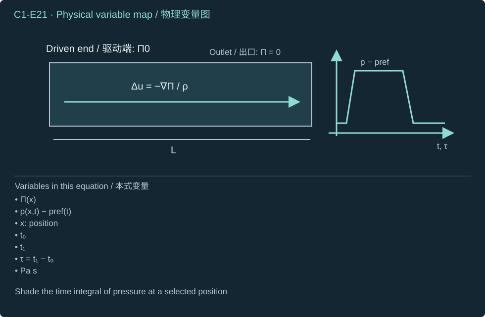

Impulse combines duration and amplitude at each liquid position.

压力冲量在每个液体位置组合压力幅值与持续时间。

**Symbols before Eq. (C1-E22).**

**式（C1-E22）前的符号定义。**

| First individual definition / 第一项单独定义 | Second individual definition / 第二项单独定义 |
| --- | --- |
| $\Delta\boldsymbol u$ is fixed-position velocity change (m s⁻¹) $\Delta\boldsymbol u$ 为固定位置速度变化（m s⁻¹） | $\boldsymbol u$ velocity (m s⁻¹) $\boldsymbol u$ 为速度（m s⁻¹） |
| $\Pi$ is pressure impulse (Pa s) $\Pi$ 为压力冲量（Pa s） | $\rho$ is constant density (kg m⁻³) $\rho$ 为常数密度（kg m⁻³） |
| $\mu$ is viscosity (Pa s) $\mu$ 为黏度（Pa s） | $\nu$ is kinematic viscosity (m² s⁻¹) $\nu$ 为运动黏度（m² s⁻¹） |
| $t_0$ — Event start time (s) $t_0$ — 事件开始时刻（s） | $t_1$ — Event end time (s) $t_1$ — 事件结束时刻（s） |
| $t$ — Elapsed time (s) $t$ — 经过时间（s） | $\boldsymbol x$ is fixed position (m) $\boldsymbol x$ 为固定位置（m） |

**Conventions and conditions.** $\nabla$ is spatial gradient (m⁻¹), $\nabla^2$ the vector Laplacian (m⁻²); the dot is a true vector contraction in convective acceleration, not an equation separator.

**约定与条件。** $\nabla$ 为空间梯度（m⁻¹），$\nabla^2$ 为矢量拉普拉斯（m⁻²）；圆点是对流加速度中的真正矢量缩并，并非公式分隔符。

(C1-E22) · Exact fixed-position integrated incompressible momentum

$$
\Delta\boldsymbol u=-\frac{\nabla\Pi}{\rho}-\int_{t_0}^{t_1}(\boldsymbol u\cdot\nabla)\boldsymbol u\,dt+\nu\int_{t_0}^{t_1}\nabla^2\boldsymbol u\,dt,\qquad \Delta\boldsymbol u=\boldsymbol u(\boldsymbol x,t_1)-\boldsymbol u(\boldsymbol x,t_0),\quad \nu=\frac\mu\rho
$$

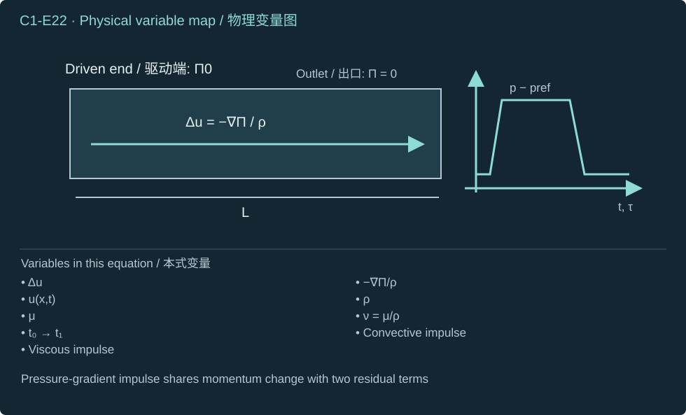

The short-event approximation must justify removing convective and viscous impulses.

短事件近似必须说明为何可以删除对流与黏性冲量。

**Step 16 — Declare the small-event conditions before discarding terms.** Choose a liquid speed and variation length. Convective and viscous impulses relative to that speed scale respectively with speed times duration divided by length, and kinematic viscosity times duration divided by length squared. Small interface displacement is also required to freeze the boundary geometry. These are scaling diagnostics, not guaranteed error bounds in a singular boundary layer. Under those conditions, subtract incompressible velocities and take the divergence.

**步骤 16——删项之前先声明小事件条件。** 选取液体速度与变化长度。对流和黏性冲量相对于该速度的尺度，分别为速度乘持续时间除以长度、以及运动黏度乘持续时间除以长度平方。冻结边界几何还要求界面位移足够小。这些是尺度诊断，并非奇异边界层中的严格误差上界。在这些条件下，将两个不可压缩速度场相减，再取散度。

**Symbols before Eq. (C1-E23).**

**式（C1-E23）前的符号定义。**

| First individual definition / 第一项单独定义 | Second individual definition / 第二项单独定义 |
| --- | --- |
| $U>0$ is a characteristic liquid speed (m s⁻¹) $U>0$ 为特征液体速度（m s⁻¹） | $\tau$ is impulse duration (s) $\tau$ 为冲量持续时间（s） |
| $L>0$ is liquid variation length (m) $L>0$ 为液体变化长度（m） | $\nu$ is kinematic viscosity (m² s⁻¹) $\nu$ 为运动黏度（m² s⁻¹） |
| $\Delta\boldsymbol u$ is velocity change (m s⁻¹) $\Delta\boldsymbol u$ 为速度变化（m s⁻¹） | $\Pi$ is pressure impulse (Pa s) $\Pi$ 为压力冲量（Pa s） |
| $\rho$ is density (kg m⁻³) $\rho$ 为密度（kg m⁻³） |  |

**Conventions and conditions.** $\nabla\cdot$ denotes divergence and $\nabla^2$ Laplacian; $\ll$ means asymptotically small, and $\simeq$ marks the reduced approximation; The last Laplace equation belongs to that reduced model.

**约定与条件。** $\nabla\cdot$ 表示散度，$\nabla^2$ 表示拉普拉斯算子；$\ll$ 表示渐近很小，$\simeq$ 表示约化近似；最后的拉普拉斯方程属于该约化模型。

(C1-E23) · Short-event reduced pressure-impulse model

$$
\frac{U\tau}{L}\ll1,\qquad \frac{\nu\tau}{L^2}\ll1,\qquad \Delta\boldsymbol u\simeq-\frac{\nabla\Pi}{\rho},\qquad 0=\nabla\cdot\Delta\boldsymbol u\simeq-\frac{\nabla^2\Pi}{\rho}\ \Longrightarrow\ \nabla^2\Pi=0
$$

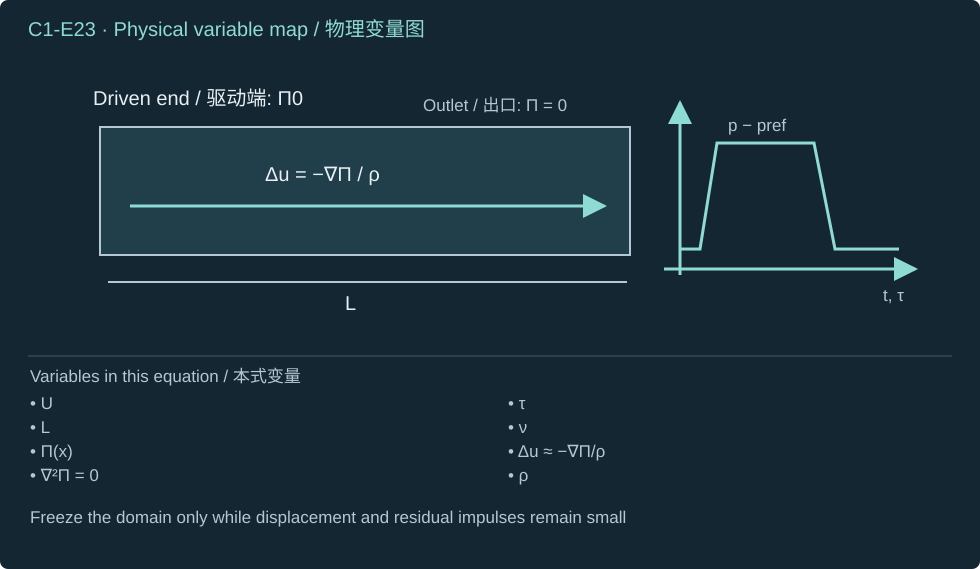

The velocity depends on a spatial impulse gradient constrained by boundary geometry.

速度取决于受边界几何约束的空间压力冲量梯度。

A fixed impermeable wall imposes zero normal velocity change and hence zero normal impulse derivative. A driven cavity supplies a prescribed impulse or a pressure history; a freely communicating outlet supplies its own pressure reference. These are different boundary data. Adding a spatially uniform impulse changes no velocity because its gradient vanishes. The same pressure maximum, acting for a different duration or over a different geometry, can therefore produce a different velocity field.

固定不可穿透壁面要求法向速度变化为零，因此法向压力冲量导数为零。受驱动空腔提供给定冲量或压力历程；自由连通的出口提供相应压力参考。这些是不同的边界数据。空间均匀增加压力冲量不会改变速度，因为其梯度为零。因此，同一个压力峰值在不同持续时间或不同几何中，可以产生不同速度场。

**Step 17 — Solve a straight-column benchmark completely.** Use an initially stationary uniform liquid column along a positive axial coordinate, with constant area, fixed side walls, prescribed positive impulse at its driven end and zero at its outlet. The one-dimensional Laplace equation integrates twice. Apply both endpoint values rather than assuming a uniform gradient.

**步骤 17——完整解出直液柱基准。** 考虑沿正轴向坐标的初始静止均匀液柱，其面积恒定、侧壁固定，受驱动端压力冲量给定为正、出口为零。一维拉普拉斯方程积分两次。应用两个端点条件，而不是直接假定均匀梯度。

**Symbols before Eq. (C1-E24).**

**式（C1-E24）前的符号定义。**

| First individual definition / 第一项单独定义 | Second individual definition / 第二项单独定义 |
| --- | --- |
| $z\in[0,L]$ is axial position (m) $z\in[0,L]$ 为轴向位置（m） | $L>0$ column length (m) $L>0$ 为液柱长度（m） |
| $\Pi(z)$ — Local column pressure impulse (Pa s) $\Pi(z)$ — 液柱局部压力冲量（Pa s） | $\Pi_0>0$ — Driven-end pressure impulse (Pa s) $\Pi_0>0$ — 驱动端压力冲量（Pa s） |
| $A_0$ is an integration constant (Pa s) $A_0$ 为积分常数（Pa s） | $A_1$ a gradient constant (Pa s m⁻¹) $A_1$ 为梯度常数（Pa s m⁻¹） |
| $\rho>0$ is carrier density (kg m⁻³) $\rho>0$ 为载液密度（kg m⁻³） | $\Delta u_z$ is positive axial speed change (m s⁻¹) $\Delta u_z$ 为正轴向速度变化（m s⁻¹） |

**Conventions and conditions.** $d/dz$ is an axial derivative; Subscript $z$ labels the component and 0 the driven endpoint.

**约定与条件。** $d/dz$ 为轴向导数；下标 $z$ 表示分量，0 表示受驱动端点。

(C1-E24) · Exact straight-column solution of the reduced model

$$
\begin{aligned}\frac{d^2\Pi}{dz^2}&=0\quad\Longrightarrow\quad\Pi=A_1z+A_0,\\\Pi(0)&=\Pi_0,\quad\Pi(L)=0\quad\Longrightarrow\quad A_0=\Pi_0,\quad A_1=-\frac{\Pi_0}{L},\\\Pi(z)&=\Pi_0\left(1-\frac zL\right),\qquad \Delta u_z=-\frac1\rho\frac{d\Pi}{dz}=\frac{\Pi_0}{\rho L}.\end{aligned}
$$

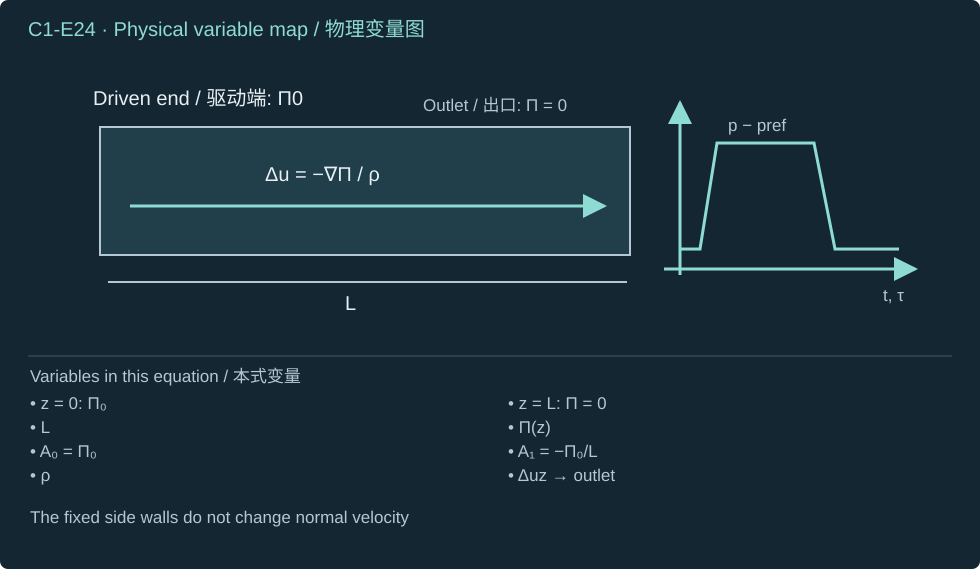

A linear spatial impulse drop accelerates liquid toward the outlet.

线性的空间冲量下降使液体向出口加速。

For a second declared teaching control, impose 0.60 MPa for 0.50 μs across a 100 μm column, with the earlier carrier density and stipulated viscosity 0.001 Pa s and sound speed 1500 m s⁻¹. The speed change is 3.0 m s⁻¹. The crossing time is much shorter than the pulse, but that fact does not prove uniform pressure, correct boundary data, or a final jet speed. The solved column has an end-to-end pressure gradient, not spatially equal pressure.

第二个声明的教学对照：在 100 μm 液柱两端施加 0.60 MPa 压差，持续 0.50 μs，采用前述载液密度，并给定黏度 0.001 Pa s、声速 1500 m s⁻¹。速度变化为 3.0 m s⁻¹。声传播时间远短于脉冲，但这不能证明空间压力均匀、边界数据正确或已经得到最终射流速度。解出的液柱具有端到端压力梯度，而非空间处处相同的压力。

**Symbols before Eq. (C1-E25).**

**式（C1-E25）前的符号定义。**

| First individual definition / 第一项单独定义 | Second individual definition / 第二项单独定义 |
| --- | --- |
| $\Pi_0$ is driven-end impulse (Pa s) $\Pi_0$ 为受驱动端冲量（Pa s） | $\Delta p$ is constant applied column pressure difference (Pa) $\Delta p$ 为施加的常数液柱压差（Pa） |
| $\tau$ is pulse duration (s) $\tau$ 为脉冲持续时间（s） | $U$ is column speed increment (m s⁻¹) $U$ 为液柱速度增量（m s⁻¹） |
| $\rho=1000$ kg m⁻³ is density $\rho=1000$ kg m⁻³ 为密度 | $L=100\times10^{-6}$ m is length $L=100\times10^{-6}$ m 为长度 |
| $c=1500$ m s⁻¹ is sound speed $c=1500$ m s⁻¹ 为声速 | $t_a$ is acoustic crossing time (s) $t_a$ 为声传播时间（s） |
| $\nu=\mu/\rho=10^{-6}$ m² s⁻¹ with $\mu=0.001$ Pa s $\nu=\mu/\rho=10^{-6}$ m² s⁻¹，且 $\mu=0.001$ Pa s | $\mu$ — Carrier dynamic viscosity (Pa s) $\mu$ — 载液动力黏度（Pa s） |

**Conventions and conditions.** The three ratios are dimensionless; μs means microseconds.

**约定与条件。** 三个比值均无量纲；μs 表示微秒。

(C1-E25) · Declared impulse calculation and applicability diagnostics

$$
\begin{aligned}\Pi_0&=\Delta p\tau=(0.60\times10^6)(0.50\times10^{-6})\ \mathrm{Pa\,s}=0.30\ \mathrm{Pa\,s},\\U&=\frac{\Pi_0}{\rho L}=3.0\ \mathrm{m\,s^{-1}},\qquad t_a=\frac Lc=0.066667\ \mu\mathrm s,\\\frac{U\tau}{L}&=0.015,\qquad\frac{\nu\tau}{L^2}=5.0\times10^{-5},\qquad\frac{\tau}{t_a}=7.5.\end{aligned}
$$

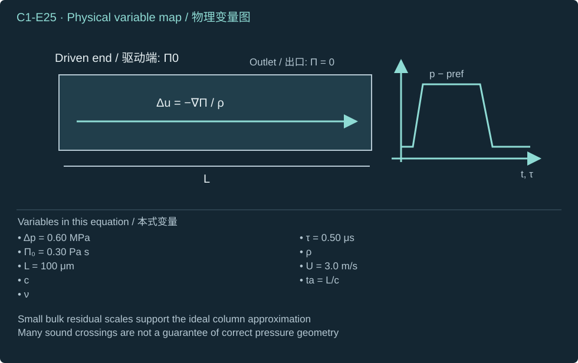

Pressure impulse and acoustic time have distinct definitions, dimensions and roles.

压力冲量与声传播时间具有不同的定义、量纲与作用。

Direction enters through asymmetry. A sphere in an infinite uniform liquid produces radial inflow or outflow with zero net preferred direction. An outlet, meniscus curvature, rigid or compliant wall, neighboring cavity, or nonuniform heating breaks that symmetry. Define stand-off as center-to-boundary distance normalized by maximum radius. Boundary curvature and material response remain additional parameters even when stand-off matches. A rigid plane commonly attracts a collapse jet toward it; deformable surfaces can alter or split the response. [[R3]](../reference/sources.html#r3) [[R12]](../reference/sources.html#r12)

方向性来自非对称性。无限均匀液体中的球形空腔产生径向流入或流出，但没有净优选方向。出口、弯月面曲率、刚性或柔顺壁面、邻近空腔、非均匀加热都能破坏对称性。离壁比定义为中心到边界的距离除以最大半径。即使离壁比相同，边界曲率与材料响应仍是额外参数。刚性平面通常使塌缩射流指向壁面；可变形表面能够改变或分裂响应。 [[R3]](../reference/sources.html#r3) [[R12]](../reference/sources.html#r12)

**Symbols before Eq. (C1-E26).**

**式（C1-E26）前的符号定义。**

| First individual definition / 第一项单独定义 | Second individual definition / 第二项单独定义 |
| --- | --- |
| $\gamma$ is dimensionless stand-off $\gamma$ 为无量纲离壁比 | $h$ is bubble-center-to-boundary distance (m) $h$ 为气泡中心到边界的距离（m） |
| $R_{\max}$ is maximum radius (m) $R_{\max}$ 为最大半径（m） | $S^2$ denotes all directions on the unit sphere (—) $S^2$ 表示单位球面上的全部方向（—） |
| $\boldsymbol e_r$ is the outward radial unit vector (dimensionless) $\boldsymbol e_r$ 为向外径向单位矢量（无量纲） | $d\Omega$ is the dimensionless solid-angle measure $d\Omega$ 为无量纲立体角测度 |
| $\boldsymbol0$ is the zero vector (dimensionless) $\boldsymbol0$ 为零矢量（无量纲） |  |

**Conventions and conditions.** The angular identity expresses directional cancellation under perfect spherical symmetry; it is not a boundary-jet prediction.

**约定与条件。** 角积分恒等式表示完全球对称下方向相互抵消，并非边界射流预测。

(C1-E26) · Geometry definition and exact symmetry identity

$$
\gamma=\frac h{R_{\max}},\qquad \int_{S^2}\boldsymbol e_r\,d\Omega=\boldsymbol0
$$

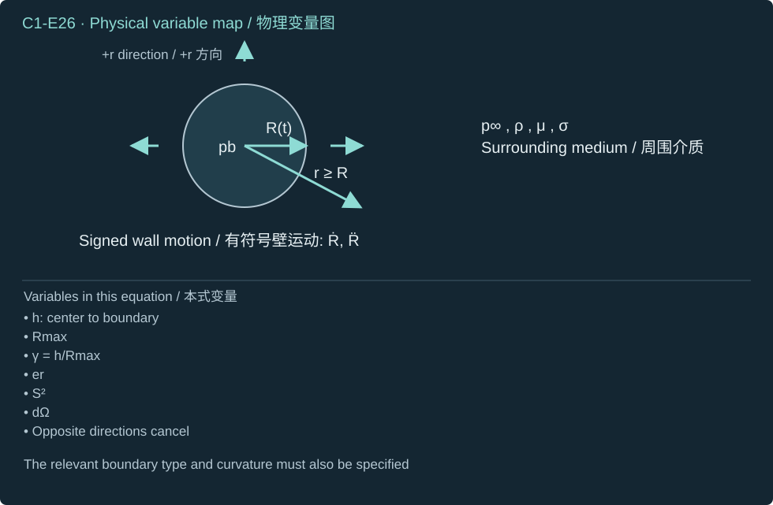

Stand-off locates a boundary; perfect spherical symmetry selects no outgoing direction.

离壁比定位边界；完全球对称不能选出向外喷射方向。

## 1.7 Close a spatial moving-interface problem

## 1.7 闭合空间运动界面问题

**Step 18 — Restore the degrees of freedom that a jet needs.** To predict jet direction, diameter and time-dependent velocity, specify the initial interface shape and carrier velocity, actual solid boundaries, outlet and contact-line behavior, and a pressure closure. The bulk conservation equations below are exact for an incompressible Newtonian carrier with constant properties and omitted gravity. Their solution requires the interface and boundary conditions that follow, and cannot be replaced by a fitted radius history alone.

**步骤 18——恢复射流所需的自由度。** 预测射流方向、直径与随时间变化的速度，需要给定初始界面形状和载液速度、实际固体边界、出口与接触线行为，以及压力闭合关系。以下体内守恒方程对物性恒定、忽略重力的不可压缩牛顿载液是精确的。求解需要后续界面与边界条件，不能仅用拟合的半径历程取代。

**Symbols before Eq. (C1-E27).**

**式（C1-E27）前的符号定义。**

| First individual definition / 第一项单独定义 | Second individual definition / 第二项单独定义 |
| --- | --- |
| $\boldsymbol u(\boldsymbol x,t)$ is liquid velocity (m s⁻¹) $\boldsymbol u(\boldsymbol x,t)$ 为液体速度（m s⁻¹） | $\boldsymbol x$ is spatial position (m) $\boldsymbol x$ 为空间位置（m） |
| $t$ is time (s) $t$ 为时间（s） | $\rho$ is constant carrier density (kg m⁻³) $\rho$ 为常数载液密度（kg m⁻³） |
| $p$ is liquid pressure (Pa) $p$ 为液体压力（Pa） | $\mu$ is constant viscosity (Pa s) $\mu$ 为常数黏度（Pa s） |

**Conventions and conditions.** $\nabla\cdot,\nabla,\nabla^2$ denote divergence, gradient and vector Laplacian; $\partial_t$ is the fixed-position derivative; The dot in convection is vector contraction; The momentum equation has force-per-volume units (N m⁻³).

**约定与条件。** $\nabla\cdot,\nabla,\nabla^2$ 分别为散度、梯度与矢量拉普拉斯；$\partial_t$ 为固定位置导数；对流中的圆点为矢量缩并；动量方程各项单位为单位体积力（N m⁻³）。

(C1-E27) · Bulk conservation and Newtonian constitutive assumption

$$
\nabla\cdot\boldsymbol u=0,\qquad \rho\left(\frac{\partial\boldsymbol u}{\partial t}+(\boldsymbol u\cdot\nabla)\boldsymbol u\right)=-\nabla p+\mu\nabla^2\boldsymbol u
$$

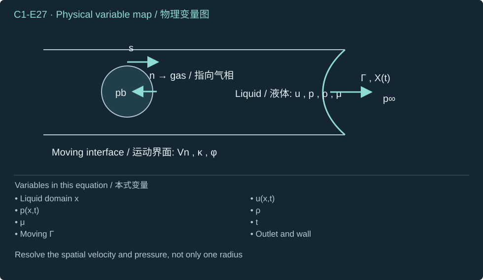

Bulk momentum and volume conservation supply the spatial field needed for jet formation.

体内动量与体积守恒给出射流形成所需的空间场。

**Step 19 — State the interface orientation and stress before using curvature.** The interface normal now points from the liquid into the gas. Therefore an inner spherical cavity has negative curvature, while an outer liquid droplet has positive curvature. This convention reproduces the spherical stress in Eq. (C1-E06). For a clean interface and negligible gas viscous stress, tangential viscous traction vanishes. Retain the viscosity factor: at zero viscosity this condition imposes no additional strain-rate constraint. With no phase transfer, the interface normal velocity equals the carrier normal velocity.

**步骤 19——使用曲率之前先声明界面方向与应力。** 此处界面法向由液体指向气体。因此，内部球形空腔的曲率为负，外部液滴曲率为正。这一约定能够恢复式（C1-E06）的球形应力。对洁净界面且气相黏性应力可忽略时，切向黏性牵引力为零。保留黏度因子：黏度为零时，此条件不施加额外应变率约束。无相变传质时，界面法向速度等于载液法向速度。

**Symbols before Eq. (C1-E28).**

**式（C1-E28）前的符号定义。**

| First individual definition / 第一项单独定义 | Second individual definition / 第二项单独定义 |
| --- | --- |
| $\boldsymbol D$ is symmetric liquid strain-rate tensor (s⁻¹) $\boldsymbol D$ 为液体对称应变率张量（s⁻¹） | $\boldsymbol u$ is velocity (m s⁻¹) $\boldsymbol u$ 为速度（m s⁻¹） |
| $\boldsymbol n$ is the unit normal from liquid into gas (dimensionless) $\boldsymbol n$ 为从液体指向气体的单位法向（无量纲） | $\kappa$ is signed curvature (m⁻¹) $\kappa$ 为带符号曲率（m⁻¹） |
| $V_n$ is interface normal speed (m s⁻¹) $V_n$ 为界面法向速度（m s⁻¹） | $p_l$ — Adjacent-liquid absolute pressure (Pa) $p_l$ — 邻近液体绝对压力（Pa） |
| $p_b$ — Uniform bubble absolute pressure (Pa) $p_b$ — 均匀气泡绝对压力（Pa） | $\sigma$ is surface tension (N m⁻¹) $\sigma$ 为表面张力（N m⁻¹） |
| $\mu$ is viscosity (Pa s) $\mu$ 为黏度（Pa s） | $\boldsymbol s$ is any unit tangent (dimensionless) $\boldsymbol s$ 为任意单位切向（无量纲） |
| $R$ is spherical cavity radius (m) $R$ 为球形空腔半径（m） |  |

**Conventions and conditions.** $\nabla\boldsymbol u$ is its spatial gradient, with superscript $\mathsf T$ denoting transpose; $\nabla_s\cdot$ is surface divergence; Dots denote tensor/vector contractions.

**约定与条件。** $\nabla\boldsymbol u$ 为其空间梯度，上标 $\mathsf T$ 表示转置；$\nabla_s\cdot$ 为表面散度；圆点表示张量或矢量缩并。

(C1-E28) · Kinematic condition and clean-interface traction

$$
\begin{aligned}\boldsymbol D&=\frac12\left(\nabla\boldsymbol u+(\nabla\boldsymbol u)^\mathsf T\right),\qquad \kappa=\nabla_s\cdot\boldsymbol n,\\V_n&=\boldsymbol u\cdot\boldsymbol n,\qquad p_l=p_b+\sigma\kappa+2\mu\boldsymbol n\cdot\boldsymbol D\boldsymbol n,\\2\mu\boldsymbol s\cdot\boldsymbol D\boldsymbol n&=0,\qquad \kappa_{\mathrm{sphere}}=-\frac2R.\end{aligned}
$$

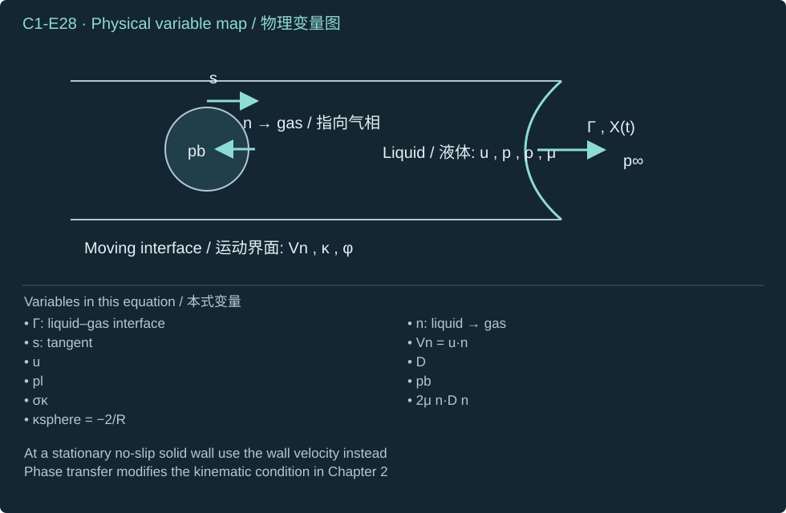

Interface normals, signed curvature and material motion must use one consistent convention.

界面法向、带符号曲率与物质运动必须采用一致约定。

At a stationary viscous solid wall, impose zero carrier velocity. At a moving film, its velocity and stress must be coupled to the liquid. At an outlet or free meniscus, prescribe the relevant external pressure and stress. A contact line needs an explicit pinned, moving-angle, or other physical closure; it is not determined by the bulk equations. Chapter 4 supplies the payload and release-interface mechanics. If phase transfer is appreciable, the no-slip-in-the-normal-direction condition must be replaced by the mass-flux balance derived in Chapter 2.

在静止黏性固壁处，载液速度为零。在运动膜处，必须把膜的速度与应力同液体耦合。在出口或自由弯月面处，应给定相应外部压力与应力。接触线需要明确的钉扎、运动接触角或其他物理闭合关系；体内方程无法决定它。第四章补充载荷与释放界面的力学。若相变传质显著，必须将界面法向无速度滑移条件替换为第二章推导的质量通量平衡。

**Step 20 — Use a potential-flow reduction only with its additional assumptions.** In an inviscid, initially irrotational carrier, away from shocks and unresolved wall layers, a velocity potential solves Laplace's equation. With no phase slip, material interface nodes follow the velocity. Distinguish the Eulerian Bernoulli derivative from the material derivative by adding velocity dotted with its own potential gradient. This gives a concrete pre-impact spatial closure rather than an equation for radius alone. Boundary-integral microjet calculations use this type of reduction. [[R4]](../reference/sources.html#r4)

**步骤 20——仅在额外假设成立时使用势流约化。** 在无黏、初始无旋的载液中，远离激波及未解析壁面层时，速度势满足拉普拉斯方程。无相变滑移时，物质界面节点跟随速度运动。把速度与其自身速度势梯度的点积加入欧拉伯努利时间导数，即可区分欧拉导数与物质导数。这样得到的是撞击前的具体空间闭合关系，而非只有半径的方程。边界积分微射流研究采用这类约化。 [[R4]](../reference/sources.html#r4)

**Symbols before Eq. (C1-E29).**

**式（C1-E29）前的符号定义。**

| First individual definition / 第一项单独定义 | Second individual definition / 第二项单独定义 |
| --- | --- |
| $\boldsymbol u$ is liquid velocity (m s⁻¹) $\boldsymbol u$ 为液体速度（m s⁻¹） | $\phi$ is velocity potential (m² s⁻¹) $\phi$ 为速度势（m² s⁻¹） |
| $\boldsymbol X$ is a material interface position (m) $\boldsymbol X$ 为物质界面点位置（m） | $t$ is time (s) $t$ 为时间（s） |
| $\Gamma$ is the liquid–gas interface (—) $\Gamma$ 为液—气界面（—） | $p_\infty$ — Far-field absolute pressure (Pa) $p_\infty$ — 远场绝对压力（Pa） |
| $p_b$ — Uniform bubble absolute pressure (Pa) $p_b$ — 均匀气泡绝对压力（Pa） | $\sigma$ is surface tension (N m⁻¹) $\sigma$ 为表面张力（N m⁻¹） |
| $\kappa$ is curvature for the liquid-to-gas normal (m⁻¹) $\kappa$ 为液体指向气体法向下的曲率（m⁻¹） | $\rho$ is density (kg m⁻³) $\rho$ 为密度（kg m⁻³） |

**Conventions and conditions.** $\nabla$ and $\nabla^2$ are spatial gradient and Laplacian; $D/Dt$ is the material derivative; $|\boldsymbol u|$ is speed and the dot a vector contraction; The potential gauge is fixed at infinity.

**约定与条件。** $\nabla$ 与 $\nabla^2$ 为空间梯度与拉普拉斯；$D/Dt$ 为物质导数；$|\boldsymbol u|$ 为速率，圆点为矢量缩并；速度势参考值固定在无穷远。

(C1-E29) · Inviscid pre-impact moving-interface closure

$$
\begin{aligned}\boldsymbol u&=\nabla\phi,\qquad \nabla^2\phi=0,\qquad\frac{d\boldsymbol X}{dt}=\boldsymbol u(\boldsymbol X,t),\\\frac{\partial\phi}{\partial t}&=\frac{p_\infty-p_b-\sigma\kappa}{\rho}-\frac12|\boldsymbol u|^2,\\\frac{D\phi}{Dt}&=\frac{\partial\phi}{\partial t}+\boldsymbol u\cdot\nabla\phi=\frac{p_\infty-p_b-\sigma\kappa}{\rho}+\frac12|\boldsymbol u|^2\qquad(\boldsymbol X\in\Gamma).\end{aligned}
$$

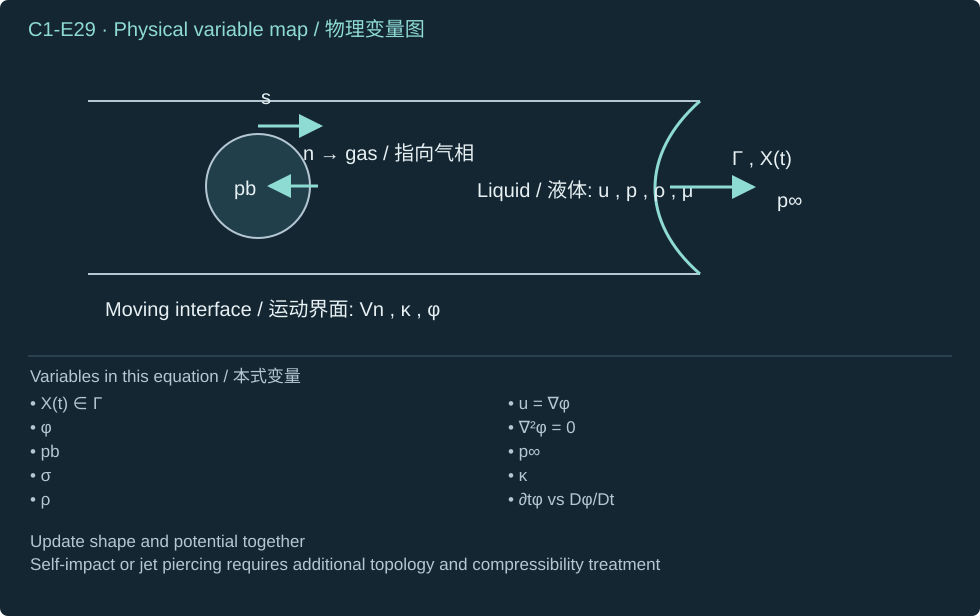

The interface shape evolves jointly with potential; changing geometry creates focusing.

界面形状与速度势共同演化，几何变化产生聚焦。

As a consistency check, the spherical interface has potential minus radius times wall speed and curvature minus two divided by radius. Insert those values into the last row of Eq. (C1-E29), differentiate the wall potential, and move the squared-speed term to the left. The original inviscid Rayleigh–Plesset equation is recovered. Once a re-entrant jet pierces the opposite interface, the simply connected pre-impact boundary problem is no longer sufficient: topology and rapid pressure transmission need their own treatment.

一致性检查如下：球形界面速度势为半径乘壁面速度的负值，曲率为负二除以半径。将其代入式（C1-E29）最后一行，对壁面速度势求导，再把速度平方项移至左侧，即可恢复原始无黏 Rayleigh–Plesset 方程。一旦再入射流穿透对侧界面，撞击前的单连通边界问题就不再充分；拓扑变化与快速压力传播需要另行处理。

**Symbols before Eq. (C1-E30).**

**式（C1-E30）前的符号定义。**

| First individual definition / 第一项单独定义 | Second individual definition / 第二项单独定义 |
| --- | --- |
| $\phi_\Gamma$ is the velocity potential evaluated on the spherical interface (m² s⁻¹), with subscript $\Gamma$ the interface label $\phi_\Gamma$ 为球形界面处速度势（m² s⁻¹），下标 $\Gamma$ 标识界面 | $R>0$ is radius (m) $R>0$ 为半径（m） |
| $\dot R$ — Wall radial velocity (m s⁻¹) $\dot R$ — 壁面径向速度（m s⁻¹） | $\ddot R$ — Wall radial acceleration (m s⁻²) $\ddot R$ — 壁面径向加速度（m s⁻²） |
| $\kappa$ is signed liquid-to-gas curvature (m⁻¹) $\kappa$ 为液体指向气体约定下的带符号曲率（m⁻¹） | $p_\infty$ — Far-field absolute pressure (Pa) $p_\infty$ — 远场绝对压力（Pa） |
| $p_b$ — Uniform bubble absolute pressure (Pa) $p_b$ — 均匀气泡绝对压力（Pa） | $\sigma$ is surface tension (N m⁻¹) $\sigma$ 为表面张力（N m⁻¹） |
| $\rho$ is carrier density (kg m⁻³) $\rho$ 为载液密度（kg m⁻³） | $\Gamma$ — Moving liquid–gas interface (—) $\Gamma$ — 运动液—气界面（—） |

**Conventions and conditions.** The potential is differentiated along the wall; viscosity is zero in this check.

**约定与条件。** 速度势沿壁面求导；此检验中黏度为零。

(C1-E30) · Exact spherical recovery of the potential closure

$$
\begin{aligned}\phi_\Gamma&=-R\dot R,\qquad\kappa=-\frac2R,\\-\dot R^2-R\ddot R&=\frac{p_\infty-p_b+2\sigma/R}{\rho}+\frac12\dot R^2,\\\rho\left(R\ddot R+\frac32\dot R^2\right)&=p_b-p_\infty-\frac{2\sigma}{R}.\end{aligned}
$$

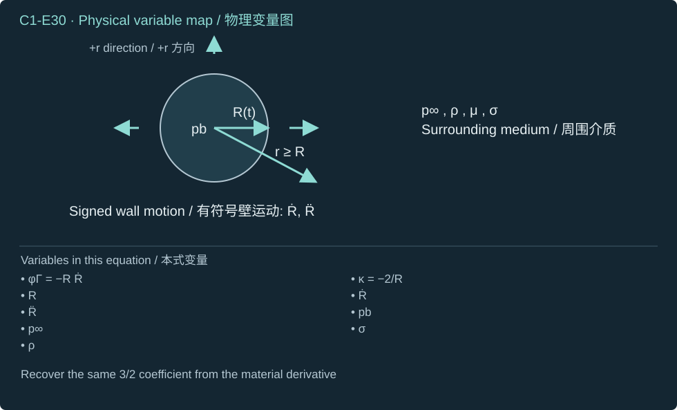

The spatial potential formulation returns the spherical model under spherical geometry.

空间势流表述在球形几何下恢复球形模型。

**Symbols before Eq. (C1-E31).**

**式（C1-E31）前的符号定义。**

| First individual definition / 第一项单独定义 | Second individual definition / 第二项单独定义 |
| --- | --- |
| $M_w$ is wall Mach number (dimensionless) $M_w$ 为壁面马赫数（无量纲） | $\mathcal C_e$ a pressure-communication ratio (both dimensionless) $\mathcal C_e$ 为压力通信比（两者均无量纲） |
| $\dot R$ is wall speed (m s⁻¹) $\dot R$ 为壁面速度（m s⁻¹） | $c>0$ is carrier sound speed (m s⁻¹) $c>0$ 为载液声速（m s⁻¹） |
| $L_e>0$ is the distance across which loading must communicate (m) $L_e>0$ 为载荷必须传播的距离（m） | $\tau_e>0$ is the event's relevant rise or change time (s) $\tau_e>0$ 为事件相关的上升或变化时间（s） |

**Conventions and conditions.** $|\ |$ denotes magnitude; subscript $e$ labels the selected event scale.

**约定与条件。** $|\ |$ 表示大小；下标 $e$ 标识选定事件尺度。

(C1-E31) · Compressibility applicability diagnostics

$$
M_w=\frac{|\dot R|}{c},\qquad \mathcal C_e=\frac{L_e}{c\tau_e}
$$

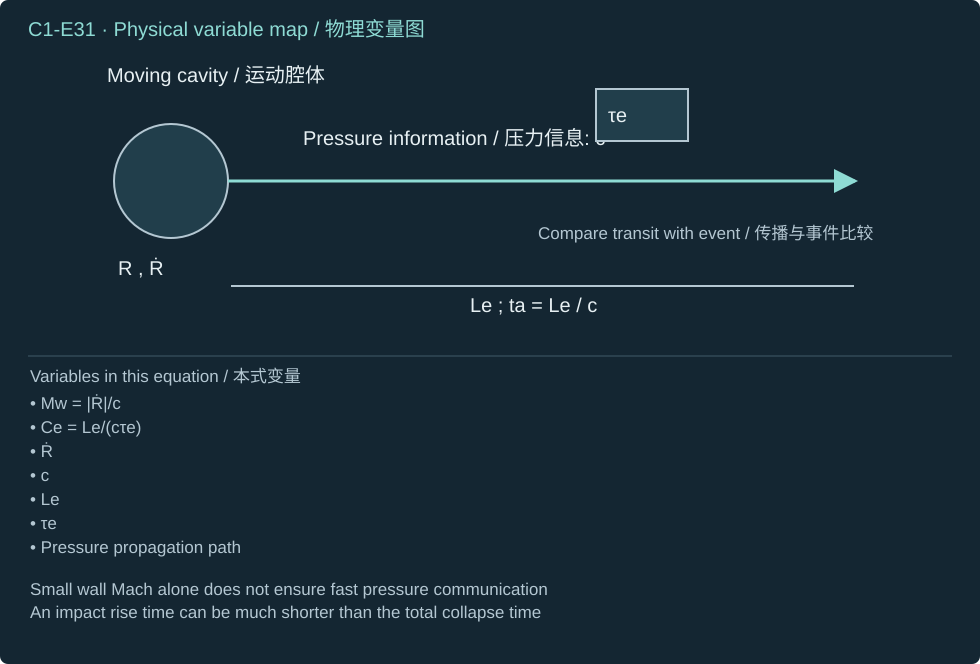

A pressure pulse can require compressibility even while the bulk wall speed is modest.

即使总体壁面速率不高，压力脉冲仍可能要求考虑可压缩性。

Small wall Mach and a small communication ratio support different aspects of an incompressible approximation. Neither specifies the jet's survival, arriving mass, impact footprint or receiver response. Chapter 3 carries the spatial jet into finite-mass, finite-time observables; Chapter 4 carries its load into release mechanics. Compressibility enters this course through rapid transmission and arrest, rather than through a separate harmonic bubble-oscillation syllabus.

小壁面马赫数与小通信比支持不可压缩近似的不同方面。两者都不能确定射流存活、到达质量、撞击面积或受载体响应。第三章将空间射流连接到有限质量、有限时间观测量；第四章再把载荷连接到释放力学。本课程通过快速传播与运动终止引入可压缩性，而不是另设谐波气泡振荡课程。

**What this chapter has closed.** The pressure–inertia equation, its mechanical-energy balance, the ideal collapse integral and a short-impulse benchmark are fully derived. The spatial jet problem is posed with consistent interface conditions. A predictive PFC jet still needs the thermodynamic pressure history, actual geometry and evolving spatial solution. These missing inputs are explicit; an ideal singularity supplies none of them.

**本章已经闭合的内容。** 压力—惯性方程、机械能平衡、理想塌缩积分与短冲量基准均已完整推导。空间射流问题具有一致的界面条件。预测 PFC 射流仍需热力学压力历程、实际几何与随时间演化的空间解。这些缺失输入已明确列出；理想奇异性不能提供其中任何一项。

## 1.8 Three oral-defense questions

## 1.8 三道口头答辩问题

These three questions adapt the final research defenses to this chapter's mechanical responsibility. A clear explanation in your own words can demonstrate mastery without reproducing every number. The reference answer starts with the original governing formulas so that each physical claim can be checked against its assumptions. The chapter is not mastered merely because the questions have been written or a response has been saved.

这三道问题将最终研究答辩调整为本章负责的力学内容。用自己的话作出清晰解释即可证明掌握，无须复现所有数值。参考答案先引用原始控制公式，使每个物理判断都能对照其假设核查。问题已经写出或回答已经保存，并不等于本章已经掌握。

### Defense 1 — What must happen mechanically between a laser-created cavity and a useful transfer jet?

### 答辩 1——从激光产生的空腔到有用的转印射流，力学上必须发生什么？

Explain this in your own words. Use assumptions, a physical argument, and a limitation; equation memorization is not required.

请用自己的话解释，说明假设、物理推理及适用限制；不要求背诵公式。

\*\*Reference answer and mastery criteria / 参考答案与掌握标准\*\*

**Symbols before Eq. (C1-E32).**

**式（C1-E32）前的符号定义。**

| First individual definition / 第一项单独定义 | Second individual definition / 第二项单独定义 |
| --- | --- |
| $\rho$ is carrier density (kg m⁻³) $\rho$ 为载液密度（kg m⁻³） | $R>0$ is cavity radius (m) $R>0$ 为空腔半径（m） |
| $\dot R$ — Wall radial velocity (m s⁻¹) $\dot R$ — 壁面径向速度（m s⁻¹） | $\ddot R$ — Wall radial acceleration (m s⁻²) $\ddot R$ — 壁面径向加速度（m s⁻²） |
| $p_b$ — Uniform bubble absolute pressure (Pa) $p_b$ — 均匀气泡绝对压力（Pa） | $p_\infty$ — Far-field absolute pressure (Pa) $p_\infty$ — 远场绝对压力（Pa） |
| $\sigma$ is surface tension (N m⁻¹) $\sigma$ 为表面张力（N m⁻¹） | $\mu$ is viscosity (Pa s) $\mu$ 为黏度（Pa s） |
| $p_{v,\mathrm{PFC}}$ — PFC-vapor partial pressure (Pa) $p_{v,\mathrm{PFC}}$ — PFC 蒸气分压（Pa） | $p_{v,w}$ — Water-vapor partial pressure (Pa) $p_{v,w}$ — 水蒸气分压（Pa） |
| $p_g$ — Noncondensable-gas partial pressure (Pa) $p_g$ — 非凝结气体分压（Pa） |  |

**Conventions and conditions.** The equations are the spherical mechanical balance and the pressure-composition closure target.

**约定与条件。** 两式分别为球形力学平衡与需要闭合的压力组成。

(C1-E32) · Original formulas quoted for defense 1

$$
\rho\left(R\ddot R+\frac32\dot R^2\right)=p_b-p_\infty-\frac{2\sigma}{R}-\frac{4\mu\dot R}{R},\qquad p_b=p_{v,\mathrm{PFC}}+p_{v,w}+p_g
$$

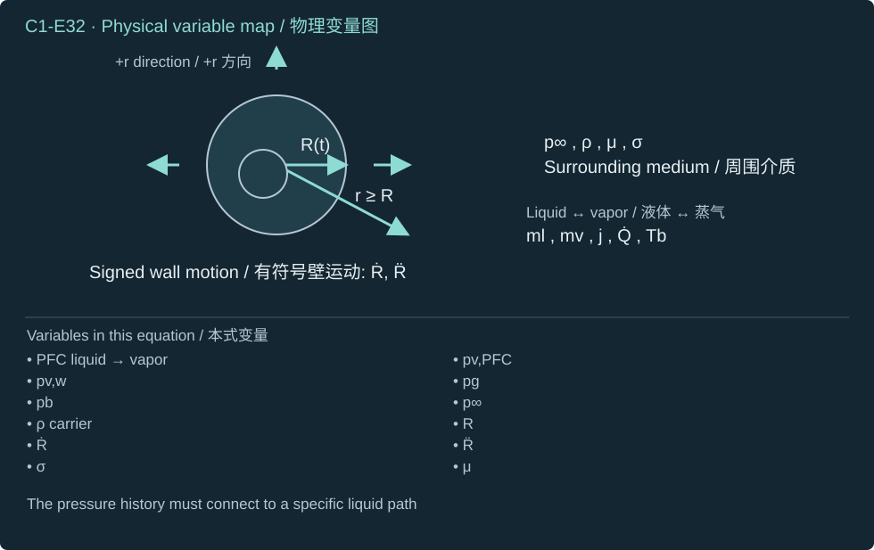

The source pressure moves carrier liquid; geometry determines whether that motion is a useful jet.

源压力使载液运动；几何决定这种运动能否成为有用射流。

First I would identify the liquid inventory, absorber location, cavity and force path. Absorption and phase change must provide a pressure history; a low boiling point does not provide that history by itself. The spherical balance then tells me how pressure accelerates mainly the surrounding carrier. Capillarity penalizes expansion and assists inward collapse; viscosity dissipates motion in either direction. The PFC inclusion and the cavity remain separate objects.

我会首先辨认液体库存、吸收体位置、空腔与传力路径。吸收和相变必须提供压力历程；低沸点本身不能给出该历程。球形平衡随后说明压力主要如何加速周围载液。毛细作用阻碍膨胀并促进向内塌缩；黏性在两种运动方向均耗散能量。PFC 夹杂液滴与空腔仍是不同对象。

For an external transfer jet I need a liquid outlet, meniscus or other directing geometry, coherent moving liquid and a receiving surface in its path. A collapse jet inside a bubble, a sealed membrane inflation and a pulled liquid bridge have different interfaces and event sequences. A detached film alone cannot identify which occurred. I would track bubble shape, emitted liquid and film motion together. Thermal closure belongs to Chapter 2; fracture and intact placement require Chapters 3 and 4.

外部转印射流需要液体出口、弯月面或其他定向几何，需要相干运动液体，以及位于路径上的受载表面。气泡内部塌缩射流、密闭膜膨胀与被拉出的液桥具有不同界面和事件顺序。仅看到膜脱离不能确定发生了哪种机制。我会同时追踪气泡形状、喷出液体与膜运动。热闭合属于第二章；断裂与完整落位需要第三、四章。

#### What a mastered answer demonstrates

#### 掌握后的回答应体现

* Distinguishes PFC liquid inventory, cavity contents and accelerated carrier, and states that the pressure history needs thermal/phase closure.

  区分 PFC 液体库存、空腔内容物与被加速载液，并说明压力历程需要热与相变闭合。
* Explains why a radial balance cannot select a jet direction; identifies a concrete asymmetric boundary or outlet.

  解释径向平衡为何不能选定射流方向，并指出具体非对称边界或出口。
* Distinguishes external ejection, re-entrant penetration, sealed inflation and liquid bridging using observable event order.

  利用可观测事件顺序区分外部喷射、再入穿透、密闭膨胀与液桥。
* Does not infer successful fracture or intact placement from cavity size or visible release alone.

  不单凭空腔尺寸或可见释放推断成功断裂或完整落位。

### Defense 2 — Why does the Rayleigh coefficient stay fixed when pressure changes, and why is its singular speed not the highest achievable jet speed?

### 答辩 2——压差变化时瑞利系数为何不变，其奇异速度为何不是最高可实现射流速度？

Explain this in your own words. Use assumptions, a physical argument, and a limitation; equation memorization is not required.

请用自己的话解释，说明假设、物理推理及适用限制；不要求背诵公式。

\*\*Reference answer and mastery criteria / 参考答案与掌握标准\*\*

**Symbols before Eq. (C1-E33).**

**式（C1-E33）前的符号定义。**

| First individual definition / 第一项单独定义 | Second individual definition / 第二项单独定义 |
| --- | --- |
| $\dot R\le0$ is inward wall velocity (m s⁻¹) $\dot R\le0$ 为向内壁面速度（m s⁻¹） | $R\in(0,R_{\max}]$ — Instantaneous cavity radius (m) $R\in(0,R_{\max}]$ — 瞬时空腔半径（m） |
| $R_{\max}$ — Radius at the start of ideal collapse (m) $R_{\max}$ — 理想塌缩开始时的半径（m） | $\Delta p_c>0$ is constant collapse pressure (Pa) $\Delta p_c>0$ 为常数塌缩压差（Pa） |
| $\rho$ is carrier density (kg m⁻³) $\rho$ 为载液密度（kg m⁻³） | $t_c$ is ideal collapse time (s) $t_c$ 为理想塌缩时间（s） |
| $B$ is the dimensionless beta function defined in Eq $B$ 为式（C1-E17）定义的无量纲贝塔函数 | $K_l$ is carrier kinetic energy (J) $K_l$ 为载液动能（J） |
| $\pi$ is the circle constant (dimensionless) $\pi$ 为圆周率（无量纲） |  |

**Conventions and conditions.** (C1-E17); The initial cavity is at rest, with no gas, viscosity, capillarity or compressibility.

**约定与条件。** 初始空腔静止，并忽略非凝结气体、黏性、毛细及可压缩性。

(C1-E33) · Original formulas quoted for defense 2

$$
\dot R=-\sqrt{\frac{2\Delta p_c}{3\rho}\left[\left(\frac{R_{\max}}R\right)^3-1\right]},\qquad t_c=\frac{B(5/6,1/2)}{\sqrt6}R_{\max}\sqrt{\frac\rho{\Delta p_c}},\qquad K_l=\frac{4\pi}{3}\Delta p_c(R_{\max}^3-R^3)
$$

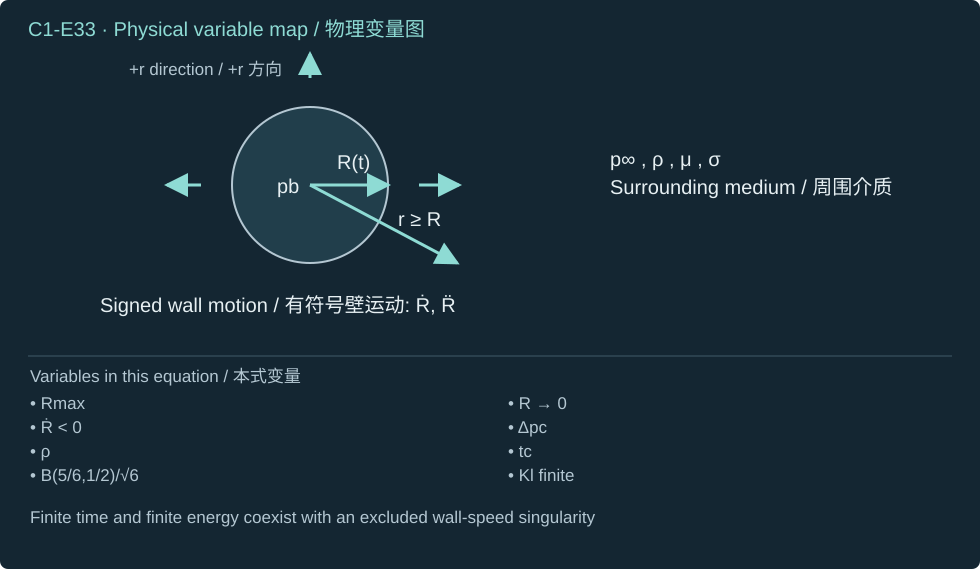

The singular velocity belongs to an ideal radial trajectory, not a validated physical maximum.

奇异速度属于理想径向轨迹，而非经过验证的实际最大值。

The coefficient is the integral of a universal dimensionless trajectory, not an empirical material factor. Squared speed reduces the radial equation to a first-order equation with integrating factor radius cubed. The initial zero speed fixes its constant; the negative root fixes collapse. Integrating reciprocal speed and substituting normalized radius cubed yields the beta function and 0.9146813565. Under the same assumptions, four times the pressure halves collapse time; the dimensionless coefficient stays fixed.

该系数是通用无量纲轨迹的积分，并非经验材料因子。速度平方把径向方程约化为一阶方程，其积分因子为半径三次方。初始零速度确定积分常数，负平方根确定塌缩。积分速度倒数，并以无量纲半径三次方换元，可得到贝塔函数与 0.9146813565。在相同假设下，压差变成四倍会使塌缩时间减半；无量纲系数保持不变。

The 30 μm control gives 2.744 μs, 11.31 nJ and inward wall speed 21.60 m s⁻¹ at half radius. These are pressure–inertia scales. They do not identify a PFC activation state or outgoing jet. Finite pressure work is consistent with diverging wall speed because the effective radial moving mass decreases with radius cubed. Before zero radius, permanent gas, changing vapor pressure, compressibility, heat/mass transfer or interface distortion can invalidate the model. A point singularity cannot answer a finite-mass maximum-velocity or finite-area, finite-time pressure question.

30 μm 对照给出 2.744 μs、11.31 nJ，以及一半半径处 21.60 m s⁻¹ 的向内壁面速率。这些是压力—惯性尺度，不能辨认 PFC 激活状态或向外射流。有限压力功与壁面速度发散并不矛盾，因为有效径向运动质量按半径三次方减小。到达零半径之前，非凝结气体、变化蒸气压、可压缩性、传热传质或界面变形都可能使模型失效。点奇异性无法回答有限质量的最大速度，或有限面积、有限时间的压力问题。

#### What a mastered answer demonstrates

#### 掌握后的回答应体现

* Connects the coefficient to the nondimensional radius integral, including the initial condition and collapse branch.

  把系数联系到无量纲半径积分，并说明初始条件与塌缩分支。
* Explains the pressure and radius scaling and gives a consistent numerical or proportionality example.

  解释压差与半径的尺度关系，并给出一致的数值或比例例子。
* Reconciles finite pressure work with the shrinking inertia scale, then identifies concrete neglected arrest mechanisms.

  用不断缩小的惯性尺度解释有限压力功，再指出具体被忽略的终止机制。
* Distinguishes radial wall velocity from a directional jet and refuses a universal maximum without defined geometry, mass and observation scale.

  区分径向壁面速度与定向射流，且在几何、质量和观测尺度未定义时不声称通用最大值。

### Defense 3 — Why are neither a pressure peak nor a short sound-crossing time enough to predict a transfer jet?

### 答辩 3——为什么压力峰值与短声传播时间都不足以预测转印射流？

Explain this in your own words. Use assumptions, a physical argument, and a limitation; equation memorization is not required.

请用自己的话解释，说明假设、物理推理及适用限制；不要求背诵公式。

\*\*Reference answer and mastery criteria / 参考答案与掌握标准\*\*

**Symbols before Eq. (C1-E34).**

**式（C1-E34）前的符号定义。**

| First individual definition / 第一项单独定义 | Second individual definition / 第二项单独定义 |
| --- | --- |
| $\Pi$ is local pressure impulse (Pa s) $\Pi$ 为局部压力冲量（Pa s） | $\boldsymbol x$ is fixed position (m) $\boldsymbol x$ 为固定位置（m） |
| $t$ — Elapsed time (s) $t$ — 经过时间（s） | $t_0$ — Event start time (s) $t_0$ — 事件开始时刻（s） |
| $t_1$ — Event end time (s) $t_1$ — 事件结束时刻（s） | $p$ — Liquid pressure field (Pa) $p$ — 液体压力场（Pa） |
| $p_{\mathrm{ref}}$ — Spatially uniform reference pressure (Pa) $p_{\mathrm{ref}}$ — 空间均匀参考压力（Pa） | $\Delta\boldsymbol u$ is liquid speed change (m s⁻¹) $\Delta\boldsymbol u$ 为液体速度变化（m s⁻¹） |
| $\rho$ is carrier density (kg m⁻³) $\rho$ 为载液密度（kg m⁻³） | $U_{\mathrm{column}}$ is the ideal straight-column speed increment (m s⁻¹) $U_{\mathrm{column}}$ 为理想直液柱速度增量（m s⁻¹） |
| $\Pi_0$ is driven-end impulse (Pa s) $\Pi_0$ 为受驱动端冲量（Pa s） | $L$ is column length (m) $L$ 为液柱长度（m） |
| $t_a$ is crossing time (s) $t_a$ 为传播时间（s） | $c$ is sound speed (m s⁻¹) $c$ 为声速（m s⁻¹） |

**Conventions and conditions.** $\nabla,\nabla^2$ denote spatial gradient and Laplacian; The reduced momentum formula needs a frozen geometry and small omitted impulses.

**约定与条件。** $\nabla,\nabla^2$ 为空间梯度与拉普拉斯；约化动量公式要求冻结几何，且被忽略的冲量项较小。

(C1-E34) · Original formulas quoted for defense 3

$$
\Pi(\boldsymbol x)=\int_{t_0}^{t_1}(p-p_{\mathrm{ref}})dt,\qquad\Delta\boldsymbol u\simeq-\frac{\nabla\Pi}{\rho},\quad\nabla^2\Pi=0,\qquad U_{\mathrm{column}}=\frac{\Pi_0}{\rho L},\quad t_a=\frac Lc
$$

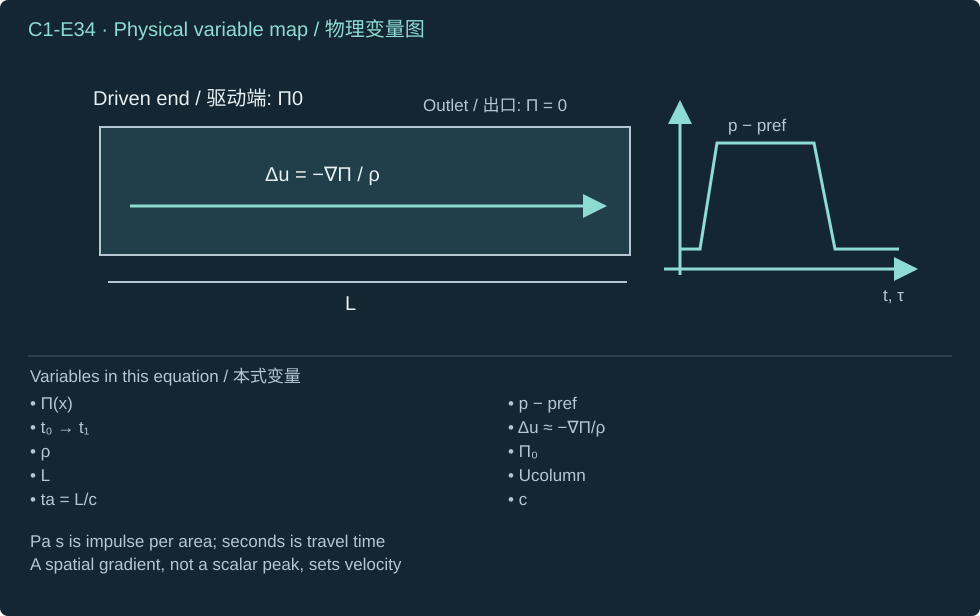

The impulse benchmark gives an early velocity field, followed by a moving-interface problem.

冲量基准给出早期速度场，之后还需解运动界面问题。

I would first define the driven boundary, outlet, initial meniscus and receiver geometry. The pressure pulse must be integrated at each location. Two pulses with the same peak can have different duration and impulse; two domains with the same scalar impulse can have different spatial gradients. The gradient determines early liquid velocity, while the boundary-value problem determines that gradient. A uniform addition to impulse cannot accelerate the liquid.

我会先定义受驱动边界、出口、初始弯月面及受载几何。需要在每个位置对压力脉冲积分。两个峰值相同的脉冲可具有不同持续时间与冲量；两个标量冲量相同的区域也可具有不同空间梯度。梯度决定早期液体速度，而边值问题决定该梯度。空间均匀增加冲量不能加速液体。

The teaching column gives 0.30 Pa s and 3.0 m s⁻¹ under its endpoint conditions. Its 0.0667 μs crossing time is a separate quantity. Several crossings make communication plausible on the pulse timescale but do not establish uniformity or exactness. I would check displacement, convection and viscosity, then evolve the actual interface with stress, pressure and contact-line conditions. Only that spatial evolution determines focusing and an outgoing jet. The thermodynamic pressure history remains necessary, and a rapidly changing or impacting state may require compressibility even when a nominal bulk speed is low.

教学液柱在其端点条件下给出 0.30 Pa s 与 3.0 m s⁻¹。其 0.0667 μs 传播时间是另一物理量。多次传播使脉冲时间内的通信具有可能性，却不能证明空间均匀或解的精确性。我会检验位移、对流与黏性，再用应力、压力及接触线条件演化实际界面。只有该空间演化才能决定聚焦与向外射流。热力学压力历程仍然必需；即使名义总体速率较低，快速变化或撞击状态也可能需要考虑可压缩性。

#### What a mastered answer demonstrates

#### 掌握后的回答应体现

* Distinguishes pressure (Pa), pressure impulse (Pa s), momentum (N s) and crossing time (s), without equating their units.

  区分压力（Pa）、压力冲量（Pa s）、动量（N s）与传播时间（s），不混淆其单位。
* Uses the spatial impulse gradient and actual boundary conditions to explain the initial velocity; a scalar peak is insufficient.

  利用空间冲量梯度与实际边界条件解释初始速度，说明单一峰值不足。
* Explains what the ideal column predicts and what its small-displacement and residual-impulse diagnostics do not guarantee.

  解释理想液柱预测的内容，以及小位移与残余冲量诊断不能保证的内容。
* Identifies the subsequent moving-interface, pressure, phase-transfer and compressibility information needed for a physical jet.

  指出实际射流还需要后续运动界面、压力、相变传质与可压缩性信息。