# Hydrogel versus liquid platforms

# 水凝胶与液体平台

## The question is whether gel improves complete transfer

## 问题在于凝胶是否改善完整转印过程

A hydrogel can preserve the position of PFC droplets, support a patterned liquid reservoir, and conform to a payload at small preload. It also adds a polymer network that stores energy, dissipates motion, changes heat and mass transport, and may tear. This chapter evaluates those changes through the same chain as the preceding chapters: absorbed energy → finite phase source → mechanical motion → intended interface release → intact placement and reset. A smaller cavity or a larger pressure peak alone does not establish improvement.

水凝胶可以保持 PFC 液滴的位置、支撑图案化液体储库，并在小预载下贴合被转印对象。它同时引入聚合物网络，该网络会储存能量、耗散运动、改变传热传质，并可能撕裂。本章沿用前面各章的链条评估这些变化：吸收能量 → 有限相变源 → 力学运动 → 目标界面释放 → 完整定位与复位。仅凭腔体更小或压力峰值更大，不能证明性能改善。

| Architecture  结构方案 | Where displaced material can go  被排开材料的去向 | Benefit to test; new cost  待检验的收益与新增代价 |
| --- | --- | --- |
| Conventional liquid site containing PFC  含 PFC 的常规液体位点 | Toward an exposed meniscus or defined outlet; the carrier remains a liquid.  朝暴露液面或明确出口运动；载液保持液体状态。 | Direct liquid displacement; wetting drift, spreading and neighboring flows can vary.  直接排开液体；润湿漂移、铺展和邻近流动可能发生变化。 |
| Open liquid pocket supported by gel  凝胶支撑的开放液腔 | Liquid leaves an opening while the gel wall deforms.  液体经开口离开，同时凝胶壁发生变形。 | A located outlet and compliant support; moving walls consume, return or redirect energy.  定位出口与柔顺支撑；运动壁面会消耗、返还能量或改变其方向。 |
| PFC embedded directly in bulk gel  PFC 直接嵌入体相凝胶 | Initially into network deformation; an external liquid path must exist or be created.  起初转化为网络变形；必须已有或形成通往外部的液体路径。 | Stable inclusion locations; large strain, trapped vapor, network rupture and solid contamination.  稳定的夹杂位置；大应变、滞留蒸气、网络破裂及固体污染。 |
| Sealed cavity under a gel/composite stamp  凝胶／复合印章下的密封腔体 | Boundary bulging and pressure transmission rather than an open liquid outlet.  通过边界鼓起与压力传递，而不是开放液体出口。 | Distributed deformation and local peeling; this can be a blister actuator with a different release mechanism.  分布式变形与局部剥离；它可以是具有不同释放机制的鼓泡致动器。 |

Li and colleagues demonstrated a sealed hydrogel-composite stamp in which laser heating creates a water-vapor cavity, deforms covering layers, and releases a platelet. It supports the pressure–deformation–fracture route; it does not verify a coherent jet from PFC embedded in bulk gel. Its millisecond heating event must not supply a microsecond PFC constitutive law by analogy. [[R11]](../reference/sources.html#r11)

Li 等人展示了密封水凝胶复合印章：激光加热产生水蒸气腔体，使覆盖层变形并释放片状对象。该研究支持压力—变形—断裂路径，却没有验证体相凝胶中嵌入 PFC 后产生相干射流。不能仅凭类比，用其毫秒级加热事件提供微秒级 PFC 过程的本构规律。[[R11]](../reference/sources.html#r11)

## 1. Declare the intact spherical control

## 1. 明确完整球形控制模型

The analytical control is an infinite, homogeneous, isotropic, incompressible medium with a continuous unbroken neo-Hookean network. An existing spherical cavity has stress-free reference radius $R\_{\mathrm{ref}}>0$ and current radius $R(t)>0$. Material occupies the exterior of the cavity. Far-field total radial stress is $-p\_\infty(t)$, the gas/liquid cavity pressure is spatially uniform $p\_b(t)$, and the interfacial tension is constant $\sigma$. Tensile Cauchy stress is positive. The radial coordinate points from the cavity center outward; positive wall speed means expansion. No gravity, nearby boundary, outlet, solvent drainage, damage, shell stress or material phase slip is resolved.

解析控制模型采用无限、均匀、各向同性、不可压缩介质，包含连续且未破坏的 neo-Hookean 网络。已有球形空腔的无应力参考半径为 $R\_{\mathrm{ref}}>0$，当前半径为 $R(t)>0$。材料位于空腔外部。远场总径向应力为 $-p\_\infty(t)$，腔内气体／液体压力 $p\_b(t)$ 在空间上均匀，界面张力 $\sigma$ 为常数。拉伸 Cauchy 应力取正。径向坐标从空腔中心向外，泡壁速度为正表示膨胀。模型不解析重力、附近边界、出口、溶剂排水、损伤、壳层应力或材料相间滑移。

At initial time $t=0$, take $R=R\_{\mathrm{ref}}$, $\dot R=0$ and an unstretched network. A constant-tension interface requires $p\_b(0)-p\_\infty(0)=2\sigma/R\_{\mathrm{ref}}$ for this initial mechanical equilibrium. A subsequent laser/phase calculation supplies $p\_b(t)$; the elastic calculation does not derive it. If the network was polymerized around a loaded inclusion, the stress-free configuration may differ from its observed initial shape. The initial liquid-PFC core radius $a\_0$ is an inventory variable and is not silently identified with $R\_{\mathrm{ref}}$ or with the evolving vapor-cavity radius.

初始时刻 $t=0$ 取 $R=R\_{\mathrm{ref}}$、$\dot R=0$，网络没有伸长。若界面张力为常数，该初始力学平衡要求 $p\_b(0)-p\_\infty(0)=2\sigma/R\_{\mathrm{ref}}$。后续激光／相变计算提供 $p\_b(t)$；弹性计算不会推导这个压力。若网络围绕受载夹杂进行聚合，其无应力构形可能不同于观测到的初始形状。初始液态 PFC 核半径 $a\_0$ 是描述物质量的变量，不能默默将其等同于 $R\_{\mathrm{ref}}$ 或不断演化的蒸气空腔半径。

| Notation and convention  符号与约定 | Meaning and units  意义与单位 |
| --- | --- |
| $r\_0$, $r$; $R\_{\mathrm{ref}}$, $R$; $a\_0$  $r\_0$、$r$；$R\_{\mathrm{ref}}$、$R$；$a\_0$ | Reference/current material radii; reference/current cavity radii; initial liquid-PFC core radius, all m.  参考／当前材料径向位置；参考／当前腔体半径；初始液态 PFC 核半径，单位均为 m。 |
| $\lambda\_r$, $\lambda\_\theta$, $\lambda\_\phi$; $\mathbf F$, $\mathbf B$  $\lambda\_r$、$\lambda\_\theta$、$\lambda\_\phi$；$\mathbf F$、$\mathbf B$ | Dimensionless principal stretches, deformation gradient and left Cauchy–Green tensor; $\theta,\phi$ denote tangential directions.  无量纲主伸长、变形梯度及左 Cauchy–Green 张量；$\theta,\phi$ 表示切向方向。 |
| $G\_g$, $\eta\_g$, $\rho\_g$, $\sigma$  $G\_g$、$\eta\_g$、$\rho\_g$、$\sigma$ | Gel-network shear modulus (Pa), chosen Kelvin–Voigt viscosity (Pa s), effective medium density (kg m⁻³), interface tension (N m⁻¹).  凝胶网络剪切模量（Pa）、选定的 Kelvin–Voigt 黏度（Pa s）、有效介质密度（kg m⁻³）、界面张力（N m⁻¹）。 |
| $\mathbf T^e$, $\mathbf T$, $\chi$; $p\_{\mathrm{el}}$  $\mathbf T^e$、$\mathbf T$、$\chi$；$p\_{\mathrm{el}}$ | Elastic Cauchy stress, total stress, incompressibility multiplier and signed elastic cavity resistance (Pa); $e$ labels elastic stress.  弹性 Cauchy 应力、总应力、不可压缩约束乘子及带符号的弹性腔体阻力（Pa）；上标 $e$ 标记弹性应力。 |
| $u\_r$, $\mathbf D$; Newton dots  $u\_r$、$\mathbf D$；牛顿点记号 | Radial material velocity (m s⁻¹), symmetric velocity-gradient tensor (s⁻¹); a dot/two dots denote one/two time derivatives.  径向材料速度（m s⁻¹）、对称速度梯度张量（s⁻¹）；一个点／两个点表示一阶／二阶时间导数。 |
| $W\_g$, $K\_g$, $E\_\sigma$, $P\_{\mathrm{dis}}$  $W\_g$、$K\_g$、$E\_\sigma$、$P\_{\mathrm{dis}}$ | Stored elastic work, medium kinetic energy, surface energy (J), and nonnegative viscous dissipation power (W).  储存弹性功、介质动能、表面能（J），以及非负黏性耗散功率（W）。 |
| $\tau\_e$, $\tau\_{\mathrm{rel}}$, $L\_g$  $\tau\_e$、$\tau\_{\mathrm{rel}}$、$L\_g$ | Event duration, independently identified stress-relaxation time (s), and specified gel communication/drainage length (m).  事件持续时间、独立确定的应力松弛时间（s），以及指定的凝胶传播／排水长度（m）。 |

Ordinary powers, scalar products and comparisons use their usual meanings; subscripts name directions, materials or states. $d/dr$ is a derivative in current radius, $\partial/\partial$ holds other independent coordinates fixed, $\int$ is a definite integral with its written limits, $\lim$ is a limit, and $\pi$ is the dimensionless circle constant. All local symbol declarations below repeat the quantities actually displayed. Gaudron, Warnez and Johnsen provide the nonlinear-elastic cavity framework; the intermediate transformations and work evaluation here are derived explicitly for this stated control. [[R13]](../reference/sources.html#r13)

普通幂、标量乘积和比较沿用通常意义；下标表示方向、材料或状态。$d/dr$ 表示对当前径向位置求导，$\partial/\partial$ 表示保持其他独立坐标不变的偏导，$\int$ 表示采用所写上下限的定积分，$\lim$ 表示极限，$\pi$ 为无量纲圆周率。下文每处局部符号声明都重复定义实际显示的量。Gaudron、Warnez 和 Johnsen 提供了非线性弹性空腔的理论框架；这里针对已声明的控制模型，显式推导中间变换及功的计算。[[R13]](../reference/sources.html#r13)

## 2. Derive the elastic pressure rather than inserting it

## 2. 推导弹性压力，而不是直接代入

Step 1 — exact volume conservation. Follow one material shell from its reference radius to its present radius. Incompressibility equates the material volume between the cavity and that shell. Differentiate at fixed time to obtain the radial stretch; divide only by strictly positive radii.

步骤 1——精确的体积守恒。跟踪一个材料球壳从参考位置到当前位置。不可压缩性要求腔体与球壳之间的材料体积相等。在固定时刻求导即可得到径向伸长；只有严格为正的半径才进行除法。

**Symbols before Eq. (C5-E01).** $r\_0\geq R\_{\mathrm{ref}}>0$ and $r\geq R>0$ are reference/current material radii (m); $R\_{\mathrm{ref}}$, $R$ are cavity radii (m). $\lambda\_r$, $\lambda\_\theta$, $\lambda\_\phi$ are dimensionless principal stretches; $\theta,\phi$ are tangential directions. $\partial r/\partial r\_0$ is the derivative with respect to the reference material coordinate at fixed time.

**式（C5-E01）前的符号定义。** $r\_0\geq R\_{\mathrm{ref}}>0$ 与 $r\geq R>0$ 为参考／当前材料半径（m）；$R\_{\mathrm{ref}}$、$R$ 为腔体半径（m）。$\lambda\_r$、$\lambda\_\theta$、$\lambda\_\phi$ 为无量纲主伸长；$\theta,\phi$ 为切向方向。$\partial r/\partial r\_0$ 表示构形映射中固定时刻的材料坐标导数。

(C5-E01) · Exact kinematics under incompressibility$$
\begin{aligned}r^3-R^3&=r\_0^3-R\_{\mathrm{ref}}^3,\\3r^2\frac{\partial r}{\partial r\_0}&=3r\_0^2,\\\lambda\_r:=\frac{\partial r}{\partial r\_0}&=\frac{r\_0^2}{r^2},\qquad\lambda\_\theta=\lambda\_\phi=\frac{r}{r\_0},\\\lambda\_r\lambda\_\theta\lambda\_\phi&=1.\end{aligned}
$$

The same network shell moves outward while thinning radially and stretching tangentially.

同一网络球壳向外移动，同时径向变薄、切向伸长。

Step 2 — declared constitutive law. In principal directions the neo-Hookean Cauchy stress is a common incompressibility multiplier plus a stretch-dependent part. Subtract radial from tangential stress to eliminate that unknown multiplier. This is a material model, not a universal hydrogel law.

步骤 2——明确采用的本构规律。在主方向上，neo-Hookean Cauchy 应力由共同的不可压缩约束乘子及依赖伸长的部分组成。用切向应力减去径向应力，消除未知约束乘子。这是材料模型，不是普适的水凝胶定律。

**Symbols before Eq. (C5-E02).** $\mathbf T^e$ and its $rr$, $\theta\theta$, $\phi\phi$ principal components are elastic Cauchy stresses (Pa), tensile positive. $\chi$ is the incompressibility multiplier (Pa); $\mathbf I$ is the dimensionless identity tensor; $G\_g>0$ is network shear modulus (Pa). $\mathbf F$ is the dimensionless deformation gradient, $\mathbf B$ its left Cauchy–Green tensor, and $\mathsf T$ denotes transpose. $\lambda\_r$, $\lambda\_\theta$ are stretches; $r,r\_0>0$ are current/reference material radii (m).

**式（C5-E02）前的符号定义。** $\mathbf T^e$ 及其 $rr$、$\theta\theta$、$\phi\phi$ 主分量为弹性 Cauchy 应力（Pa），拉伸取正。$\chi$ 为不可压缩约束乘子（Pa）；$\mathbf I$ 为无量纲单位张量；$G\_g>0$ 为网络剪切模量（Pa）。$\mathbf F$ 为无量纲变形梯度，$\mathbf B$ 为左 Cauchy–Green 张量，$\mathsf T$ 表示转置。$\lambda\_r$、$\lambda\_\theta$ 为伸长；$r,r\_0>0$ 为当前／参考材料半径（m）。

(C5-E02) · Constitutive assumption and exact subtraction$$
\begin{aligned}\mathbf T^e&=-\chi\mathbf I+G\_g\mathbf B,\qquad\mathbf B=\mathbf F\mathbf F^{\mathsf T},\\T^e\_{rr}&=-\chi+G\_g\lambda\_r^2,\qquad T^e\_{\theta\theta}=T^e\_{\phi\phi}=-\chi+G\_g\lambda\_\theta^2,\\T^e\_{\theta\theta}-T^e\_{rr}&=G\_g\left[\left(\frac r{r\_0}\right)^2-\left(\frac{r\_0}r\right)^4\right].\end{aligned}
$$
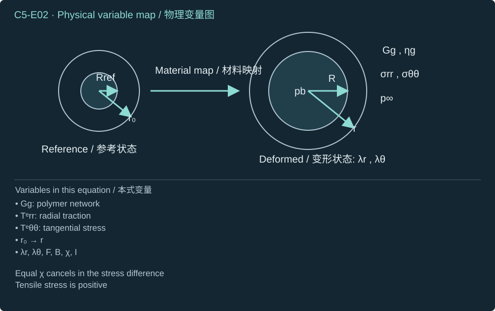

Radial and tangential stretches produce different network stresses around the cavity.

空腔周围的径向与切向伸长产生不同的网络应力。

Step 3 — integrate the elastic contribution. For a static spherical field, radial equilibrium places twice the tangential–radial stress difference over radius in the radial stress derivative. The wall traction and the far-field traction then identify the pressure needed to support the elastic deformation. The same stress-difference integral will reappear as a resistance in the dynamic balance; setting the whole dynamic field quasistatic is not required there.

步骤 3——积分弹性贡献。对静态球形应力场，径向平衡使径向应力导数等于切向—径向应力差的两倍除以半径。壁面牵引与远场牵引由此确定维持弹性变形所需的压力。同一应力差积分还会作为阻力出现在动力学平衡中；后者并不要求整个动态场处于准静态。

**Symbols before Eq. (C5-E03).** $T^e\_{rr}$, $T^e\_{\theta\theta}$ are radial/tangential elastic stresses (Pa) in this static control; $r$ is current radius, $r\_0=r\_0(r)$ the reference coordinate, $R>0$ the cavity radius (m). $p\_b$, $p\_\infty$ are inner/far-field pressures (Pa); $\sigma\geq0$ is constant tension (N m⁻¹); $G\_g>0$ is shear modulus (Pa); $p\_{\mathrm{el}}$ is the signed elastic resistance (Pa). $d/dr$ differentiates in $r$, $\int\_R^\infty$ integrates over exterior material, and $\infty$ labels the infinite far field.

**式（C5-E03）前的符号定义。** $T^e\_{rr}$、$T^e\_{\theta\theta}$ 为该静态控制模型的径向／切向弹性应力（Pa）；$r$ 为当前半径，$r\_0=r\_0(r)$ 为参考坐标，$R>0$ 为腔体半径（m）。$p\_b$、$p\_\infty$ 为内部／远场压力（Pa）；$\sigma\geq0$ 为恒定张力（N m⁻¹）；$G\_g>0$ 为剪切模量（Pa）；$p\_{\mathrm{el}}$ 为带符号的弹性阻力（Pa）。$d/dr$ 表示对 $r$ 求导，$\int\_R^\infty$ 对外部材料积分，$\infty$ 标记无限远场。

(C5-E03) · Static balance defining the elastic resistance$$
\begin{aligned}\frac{dT^e\_{rr}}{dr}&=\frac{2}{r}(T^e\_{\theta\theta}-T^e\_{rr}),\\T^e\_{rr}(\infty)&=-p\_\infty,\qquad T^e\_{rr}(R)=-p\_b+\frac{2\sigma}{R},\\p\_{\mathrm{el}}(R):=p\_b-p\_\infty-\frac{2\sigma}{R}&=2G\_g\int\_R^\infty\left[\left(\frac r{r\_0}\right)^2-\left(\frac{r\_0}r\right)^4\right]\frac{dr}{r}.\end{aligned}
$$
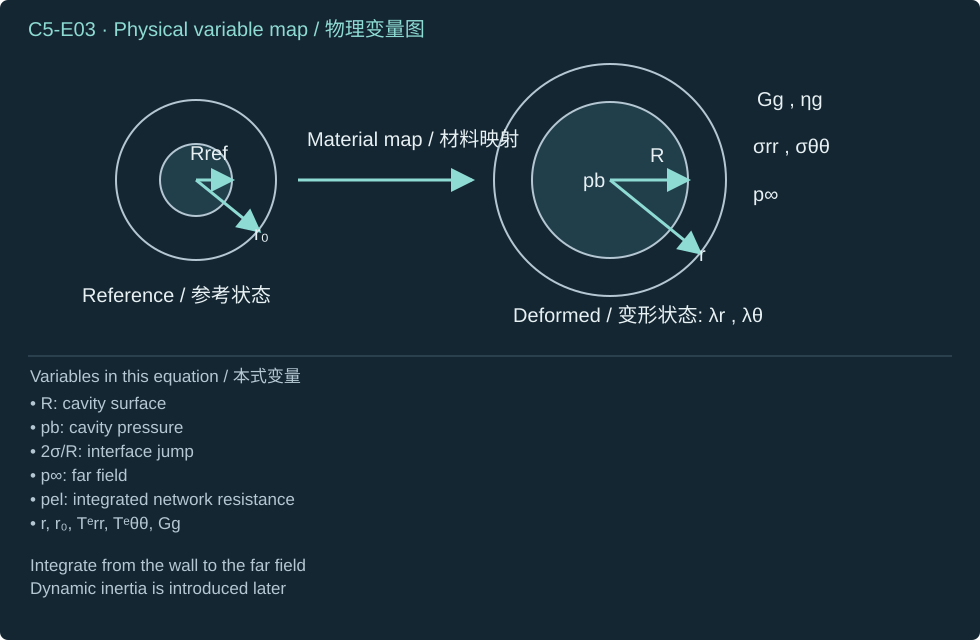

The wall pressure supports capillary traction and the accumulated elastic resistance.

壁面压力同时支撑毛细牵引与积分后的弹性阻力。

Step 4 — change variables with its Jacobian. During expansion $R>R\_{\mathrm{ref}}$, set the dimensionless ratio $q=r\_0/r$. The mapping makes it increase from $R\_{\mathrm{ref}}/R$ at the wall to one at infinity. Differentiate its cube, cancel its positive square, and use the positive factor $1-q^3$ for finite exterior positions. Exactly at the undeformed state the transformation is degenerate; evaluate zero resistance directly instead of dividing by zero.

步骤 4——带雅可比地变换变量。膨胀时 $R>R\_{\mathrm{ref}}$，定义无量纲比值 $q=r\_0/r$。由构形映射，它从壁面处的 $R\_{\mathrm{ref}}/R$ 增大到无穷远处的 1。对其三次方求导，约去正的平方，并对有限外部位置使用正因子 $1-q^3$。在恰好未变形的状态，这个变换退化；此时直接求得零阻力，而不是除以零。

**Symbols before Eq. (C5-E04).** $q=r\_0/r$ is a positive dimensionless coordinate ratio; $r\_0,r$ are reference/current material radii (m), and $R>R\_{\mathrm{ref}}>0$ are current/reference cavity radii (m). $q(R)$ and $q(\infty)$ denote endpoint values. $dq,dr$ are coordinate differentials; $\infty$ denotes the far-field limit. The factorization $1-q^6=(1-q^3)(1+q^3)$ applies for $q<1$ before taking the endpoint limit.

**式（C5-E04）前的符号定义。** $q=r\_0/r$ 为正的无量纲坐标比；$r\_0,r$ 为参考／当前材料半径（m），$R>R\_{\mathrm{ref}}>0$ 为当前／参考腔体半径（m）。$q(R)$、$q(\infty)$ 表示端点值。$dq,dr$ 为坐标微分；$\infty$ 表示远场极限。因式分解 $1-q^6=(1-q^3)(1+q^3)$ 先在 $q<1$ 时使用，再取端点极限。

(C5-E04) · Exact change of variable for expansion$$
\begin{aligned}q^3&=1-\frac{R^3-R\_{\mathrm{ref}}^3}{r^3},\qquad q(R)=\frac{R\_{\mathrm{ref}}}{R},\qquad q(\infty)=1,\\3q^2\,dq&=3(1-q^3)\frac{dr}{r},\qquad \frac{dr}{r}=\frac{q^2\,dq}{1-q^3},\\\left(q^{-2}-q^4\right)\frac{dr}{r}&=\frac{1-q^6}{1-q^3}\,dq=(1+q^3)\,dq.\end{aligned}
$$
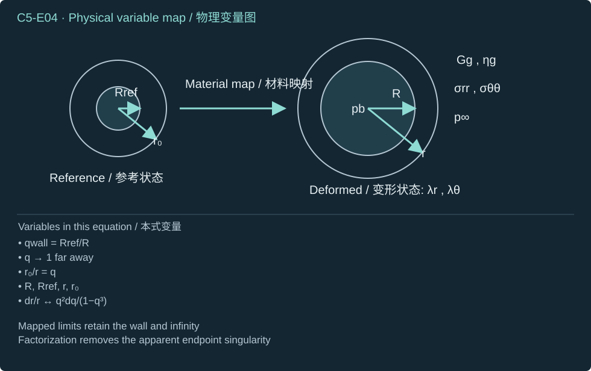

The material coordinate ratio converts a spatial stress integral into a regular polynomial integral.

材料坐标比将空间应力积分转化为正则的多项式积分。

**Symbols before Eq. (C5-E05).** $p\_{\mathrm{el}}$ is elastic cavity resistance (Pa); $G\_g>0$ is network shear modulus (Pa); $R\geq R\_{\mathrm{ref}}>0$ are current/reference cavity radii (m). $q$ is the dimensionless integration variable. $\int$ is a definite integral, and $[f(q)]\_a^b$ means upper-endpoint minus lower-endpoint evaluation of the bracketed function.

**式（C5-E05）前的符号定义。** $p\_{\mathrm{el}}$ 为弹性腔体阻力（Pa）；$G\_g>0$ 为网络剪切模量（Pa）；$R\geq R\_{\mathrm{ref}}>0$ 为当前／参考腔体半径（m）。$q$ 为无量纲积分变量。$\int$ 为定积分，$[f(q)]\_a^b$ 表示括号中函数的上端点值减去下端点值。

(C5-E05) · Derived neo-Hookean elastic resistance$$
\begin{aligned}p\_{\mathrm{el}}(R)&=2G\_g\int\_{R\_{\mathrm{ref}}/R}^{1}(1+q^3)\,dq\\&=2G\_g\left[q+\frac{q^4}{4}\right]\_{R\_{\mathrm{ref}}/R}^{1}\\&=2G\_g\left[\frac54-\frac{R\_{\mathrm{ref}}}{R}-\frac14\left(\frac{R\_{\mathrm{ref}}}{R}\right)^4\right]\\&=\frac{G\_g}{2}\left[5-4\frac{R\_{\mathrm{ref}}}{R}-\left(\frac{R\_{\mathrm{ref}}}{R}\right)^4\right].\end{aligned}
$$
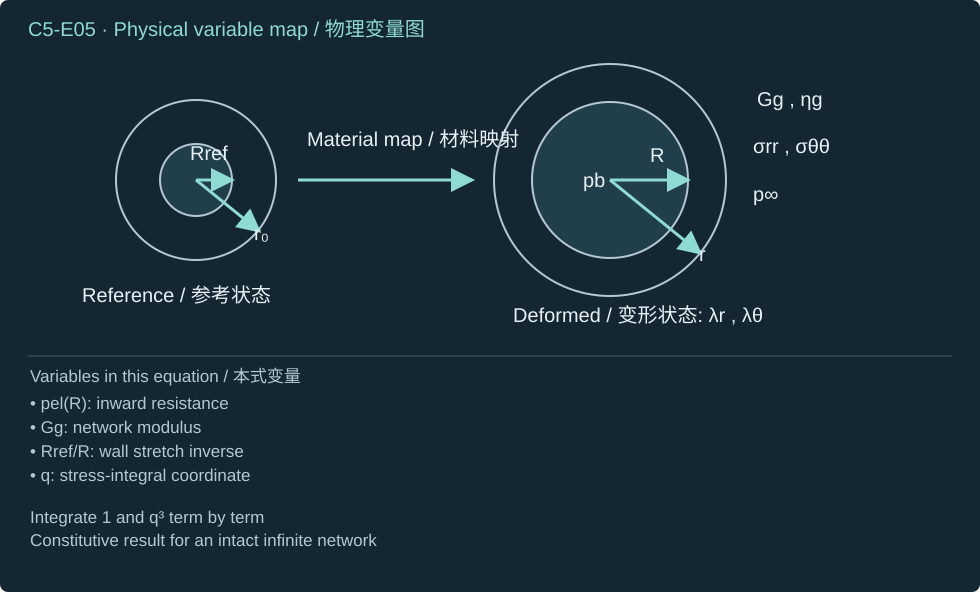

Elastic resistance follows from the full stretch field, not from a guessed constant pressure.

弹性阻力来自完整伸长场，而不是猜测的恒定压力。

Each row uses, in order, Eq. (C5-E04), the antiderivative of $1+q^3$, upper-minus-lower endpoint evaluation, and scalar multiplication. The result matches the neo-Hookean elastic term reported in Gaudron et al., Eq. (2.18). The constitutive large-expansion limit is a plateau in pressure resistance, not a material fracture threshold. A fractured, finite, prestressed or strain-stiffening gel can depart from this result. [[R13]](../reference/sources.html#r13)

各行依次使用式（C5-E04）、$1+q^3$ 的原函数、上端点减下端点，以及标量乘法。该结果与 Gaudron 等人式（2.18）报告的 neo-Hookean 弹性项一致。本构模型的大膨胀极限是压力阻力的平台值，不是材料断裂阈值。已破裂、有限尺寸、预应力或具有应变硬化的凝胶都可能偏离这一结果。[[R13]](../reference/sources.html#r13)

**Symbols before Eq. (C5-E06).** $p\_{\mathrm{el}}$ is pressure resistance (Pa); $G\_g>0$ is shear modulus (Pa); $R\geq R\_{\mathrm{ref}}>0$ are cavity radii (m). $d/dR$ is the radius derivative (giving Pa m⁻¹ here); $\lim$ takes the positive large-radius-ratio limit; $\infty$ denotes an unbounded ratio.

**式（C5-E06）前的符号定义。** $p\_{\mathrm{el}}$ 为压力阻力（Pa）；$G\_g>0$ 为剪切模量（Pa）；$R\geq R\_{\mathrm{ref}}>0$ 为腔体半径（m）。$d/dR$ 表示半径导数（此处单位为 Pa m⁻¹）；$\lim$ 取正的大半径比极限；$\infty$ 表示比值无界。

(C5-E06) · Limiting-state and sign checks$$
\begin{aligned}p\_{\mathrm{el}}(R\_{\mathrm{ref}})&=\frac{G\_g}{2}(5-4-1)=0,\\\frac{dp\_{\mathrm{el}}}{dR}&=2G\_g\left(\frac{R\_{\mathrm{ref}}}{R^2}+\frac{R\_{\mathrm{ref}}^4}{R^5}\right)>0,\\\lim\_{R/R\_{\mathrm{ref}}\to\infty}p\_{\mathrm{el}}(R)&=\frac52G\_g.\end{aligned}
$$
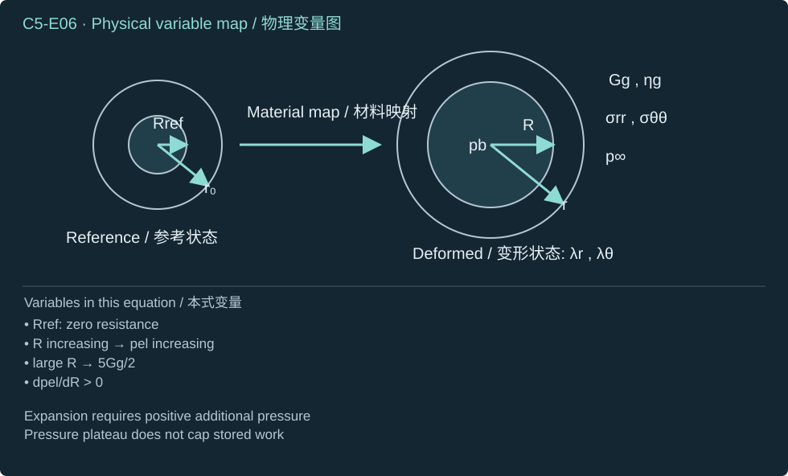

Zero deformation gives zero elastic resistance, and positive expansion raises it monotonically.

零变形给出零弹性阻力，正向膨胀使阻力单调增大。

## 3. Close the elastic work calculation

## 3. 完整计算弹性功

Step 5 — integrate work against cavity volume. Pressure is conjugate to volume change, not to radius change alone. Multiply by the spherical area, insert Eq. (C5-E05), and integrate each power of the dummy radius. The last term uses the antiderivative $-1/\xi$ of $\xi^{-2}$; retain both endpoints so that the reference work is zero.

步骤 5——对腔体体积积分功。压力与体积变化共轭，而不是单独与半径变化共轭。乘以球面面积，代入式（C5-E05），再逐项积分虚拟半径的各次幂。最后一项使用 $\xi^{-2}$ 的原函数 $-1/\xi$；保留两个端点，保证参考状态的功为零。

**Symbols before Eq. (C5-E07).** $W\_g$ is stored elastic work relative to the unstretched state (J); $p\_{\mathrm{el}}(\xi)$ is signed elastic resistance (Pa); $G\_g>0$ is modulus (Pa). $R\geq R\_{\mathrm{ref}}>0$ and dummy integration radius $\xi$ are lengths (m); $d\xi$ is its differential. $\pi$ is the circle constant; $[\ ]\_{R\_{\mathrm{ref}}}^{R}$ denotes endpoint subtraction.

**式（C5-E07）前的符号定义。** $W\_g$ 为相对未伸长状态的储存弹性功（J）；$p\_{\mathrm{el}}(\xi)$ 为带符号弹性阻力（Pa）；$G\_g>0$ 为模量（Pa）。$R\geq R\_{\mathrm{ref}}>0$ 与虚拟积分半径 $\xi$ 为长度（m）；$d\xi$ 为其微分。$\pi$ 为圆周率；$[\ ]\_{R\_{\mathrm{ref}}}^{R}$ 表示端点相减。

(C5-E07) · Exact work integral within the elastic model$$
\begin{aligned}W\_g(R)&=4\pi\int\_{R\_{\mathrm{ref}}}^{R}p\_{\mathrm{el}}(\xi)\xi^2\,d\xi\\&=2\pi G\_g\int\_{R\_{\mathrm{ref}}}^{R}\left(5\xi^2-4R\_{\mathrm{ref}}\xi-R\_{\mathrm{ref}}^4\xi^{-2}\right)d\xi\\&=2\pi G\_g\left[\frac{5\xi^3}{3}-2R\_{\mathrm{ref}}\xi^2+\frac{R\_{\mathrm{ref}}^4}{\xi}\right]\_{R\_{\mathrm{ref}}}^{R}\\&=2\pi G\_g\left[\frac{5R^3}{3}-2R\_{\mathrm{ref}}R^2+\frac{R\_{\mathrm{ref}}^4}{R}-\frac{2R\_{\mathrm{ref}}^3}{3}\right].\end{aligned}
$$
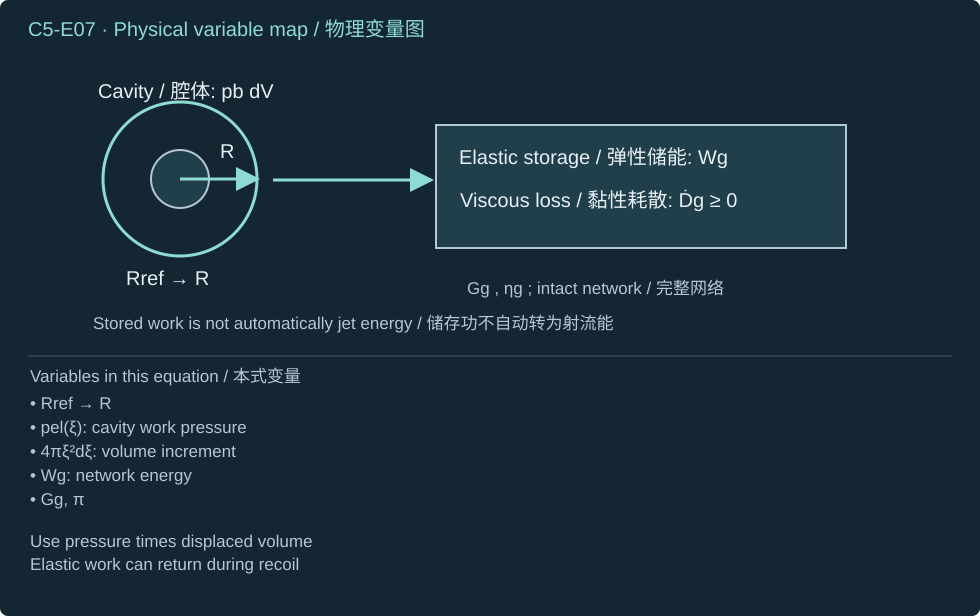

The area factor converts radius increments into cavity volume increments before integrating work.

先用面积因子将半径增量转化为腔体体积增量，再积分功。

In the final row the lower endpoint contributes $(5/3-2+1)R\_{\mathrm{ref}}^3=2R\_{\mathrm{ref}}^3/3$, which is subtracted. A pressure plateau therefore still allows work to grow approximately in proportion to cavity volume. The units are Pa m³ = J. Differentiating the closed form gives exactly pressure times area; this is a stronger check than comparing pressure magnitudes alone.

最后一行中，下端点贡献为 $(5/3-2+1)R\_{\mathrm{ref}}^3=2R\_{\mathrm{ref}}^3/3$，需将其减去。因此，即使压力出现平台，功仍可近似随腔体体积增长。单位为 Pa m³ = J。对闭式结果求导恰好得到压力乘面积；这个核查比单独比较压力大小更有力。

**Symbols before Eq. (C5-E08).** $W\_g$ is elastic work (J), $p\_{\mathrm{el}}$ resistance (Pa), $G\_g>0$ shear modulus (Pa), $R,R\_{\mathrm{ref}}>0$ cavity radii (m), and $\delta R=R-R\_{\mathrm{ref}}$ a small radius change (m), with $|\delta R|/R\_{\mathrm{ref}}\ll1$. $d/dR$ is differentiation in radius; $O$ denotes terms bounded by a constant times the indicated scale as that ratio tends to zero; $\pi$ is dimensionless.

**式（C5-E08）前的符号定义。** $W\_g$ 为弹性功（J），$p\_{\mathrm{el}}$ 为阻力（Pa），$G\_g>0$ 为剪切模量（Pa），$R,R\_{\mathrm{ref}}>0$ 为腔体半径（m），$\delta R=R-R\_{\mathrm{ref}}$ 为小半径变化（m），满足 $|\delta R|/R\_{\mathrm{ref}}\ll1$。$d/dR$ 表示对半径求导；$O$ 表示当该比值趋于零时，被某常数乘所示尺度界定的项；$\pi$ 为无量纲量。

(C5-E08) · Work-conjugacy and small-deformation checks$$
\begin{aligned}\frac{dW\_g}{dR}&=2\pi G\_g\left(5R^2-4R\_{\mathrm{ref}}R-\frac{R\_{\mathrm{ref}}^4}{R^2}\right)=4\pi R^2p\_{\mathrm{el}}(R),\\R=R\_{\mathrm{ref}}+\delta R\colon\qquad p\_{\mathrm{el}}&=\frac{4G\_g\delta R}{R\_{\mathrm{ref}}}+O\!\left(G\_g\frac{\delta R^2}{R\_{\mathrm{ref}}^2}\right),\\W\_g&=8\pi G\_gR\_{\mathrm{ref}}\delta R^2+O(G\_g\delta R^3).\end{aligned}
$$
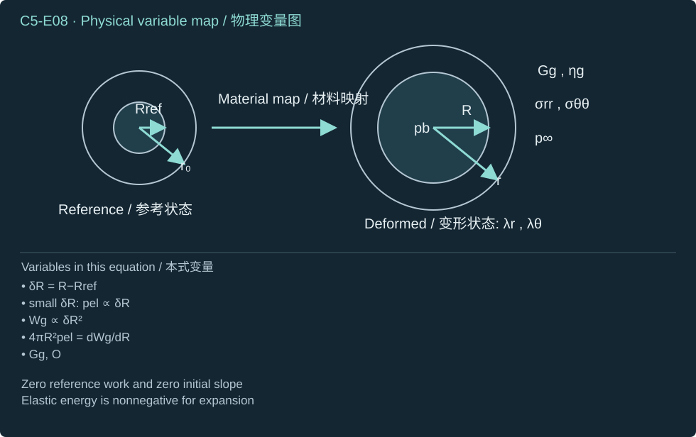

Near the reference cavity, pressure is linear in radius change and stored work is quadratic.

在参考腔体附近，压力与半径变化呈线性关系，储存功则呈二次关系。

The linear term follows by differentiating Eq. (C5-E05) at the reference radius; integrate $4\pi R\_{\mathrm{ref}}^2$ times that term to obtain the quadratic work. An independent volume-integral check sums the neo-Hookean strain-energy density throughout the reference material and reproduces Eq. (C5-E07). Energy storage is reversible in this intact hyperelastic law. Returning that energy to useful jet motion is conditional on timing and geometry; it is not guaranteed, and stored work should not automatically be counted as irreversible heat loss.

线性项来自在参考半径处对式（C5-E05）求导；将其乘以 $4\pi R\_{\mathrm{ref}}^2$ 后积分，得到二次功项。独立的体积积分核查对参考材料中的 neo-Hookean 应变能密度求和，重现式（C5-E07）。该完整超弹性规律中的能量储存可逆。能量能否返还给有效射流运动，取决于时序和几何，并不保证发生；储存功也不应自动计作不可逆热损失。

## 4. Add inertia and loss without double counting

## 4. 加入惯性与损耗，避免重复计算

Step 6 — choose a Kelvin–Voigt viscous contribution. Let the total stress add $2\eta\_g\mathbf D$ to the elastic stress, where $\mathbf D$ is the symmetric velocity gradient. Incompressibility and no wall/material slip supply the radial speed field. Its radial gradient is negative during outward motion, while tangential extension is positive.

步骤 6——选择 Kelvin–Voigt 黏性贡献。令总应力在弹性应力上加入 $2\eta\_g\mathbf D$，其中 $\mathbf D$ 为对称速度梯度。不可压缩性及壁面／材料无滑移给出径向速度场。向外运动时，其径向梯度为负，切向拉伸为正。

**Symbols before Eq. (C5-E09).** $\mathbf T$, $\mathbf T^e$ and their radial/tangential components are total/elastic Cauchy stresses (Pa). $\eta\_g\geq0$ is the chosen medium viscosity (Pa s); $\mathbf D$ and its components are strain rates (s⁻¹). $u\_r$ is radial material speed (m s⁻¹); $r\geq R(t)>0$ is current position, $R$ wall radius (m), $t$ time (s), and $\dot R$ wall speed (m s⁻¹). $\partial/\partial r$ is the fixed-time spatial derivative.

**式（C5-E09）前的符号定义。** $\mathbf T$、$\mathbf T^e$ 及其径向／切向分量为总／弹性 Cauchy 应力（Pa）。$\eta\_g\geq0$ 为所选介质黏度（Pa s）；$\mathbf D$ 及其分量为应变率（s⁻¹）。$u\_r$ 为径向材料速度（m s⁻¹）；$r\geq R(t)>0$ 为当前位置，$R$ 为壁面半径（m），$t$ 为时间（s），$\dot R$ 为泡壁速度（m s⁻¹）。$\partial/\partial r$ 为固定时刻的空间导数。

(C5-E09) · Kelvin–Voigt closure and exact radial kinematics$$
\begin{aligned}\mathbf T&=\mathbf T^e+2\eta\_g\mathbf D,\qquad u\_r(r,t)=\frac{R^2\dot R}{r^2},\\D\_{rr}&=\frac{\partial u\_r}{\partial r}=-\frac{2R^2\dot R}{r^3},\qquad D\_{\theta\theta}=D\_{\phi\phi}=\frac{u\_r}{r}=\frac{R^2\dot R}{r^3},\\T\_{\theta\theta}-T\_{rr}&=T^e\_{\theta\theta}-T^e\_{rr}+\frac{6\eta\_gR^2\dot R}{r^3}.\end{aligned}
$$
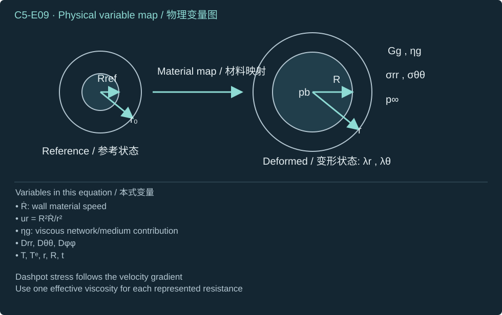

The viscous term derives from the surrounding-medium strain rate, not from bubble mass.

黏性项来自周围介质的应变率，而不是气泡质量。

Step 7 — integrate the radial momentum equation. The fixed-position time derivative and the convective derivative must both be retained. Substitution of Eq. (C5-E09) leaves an integrable acceleration field. The total wall stress is $-p\_b+2\sigma/R$, and total far-field stress is $-p\_\infty$; integrate the stress difference instead of guessing its sign.

步骤 7——积分径向动量方程。必须同时保留固定位置的时间偏导和对流导数。代入式（C5-E09）后得到可积的加速度场。总壁面应力为 $-p\_b+2\sigma/R$，总远场应力为 $-p\_\infty$；应积分应力差，而不是猜测其符号。

**Symbols before Eq. (C5-E10).** $a\_r$ is material radial acceleration (m s⁻²); $u\_r$ radial speed (m s⁻¹); $r\geq R>0$ position and cavity radius (m); $t$ time (s); $\dot R$, $\ddot R$ wall speed/acceleration (m s⁻¹, m s⁻²). $\rho\_g>0$ is density (kg m⁻³), $\eta\_g\geq0$ viscosity (Pa s), and $T\_{rr},T\_{\theta\theta}$ total stresses (Pa). $\partial$ denotes fixed-other-coordinate derivatives and the integrals run through the exterior to infinity. Integrated acceleration times density has units Pa.

**式（C5-E10）前的符号定义。** $a\_r$ 为材料径向加速度（m s⁻²）；$u\_r$ 为径向速度（m s⁻¹）；$r\geq R>0$ 为位置与腔体半径（m）；$t$ 为时间（s）；$\dot R$、$\ddot R$ 为泡壁速度／加速度（m s⁻¹、m s⁻²）。$\rho\_g>0$ 为密度（kg m⁻³），$\eta\_g\geq0$ 为黏度（Pa s），$T\_{rr},T\_{\theta\theta}$ 为总应力（Pa）。$\partial$ 表示保持其他坐标不变的偏导，积分经外部材料到无穷远。积分后的加速度乘以密度的单位为 Pa。

(C5-E10) · Momentum law and explicitly evaluated integrals$$
\begin{aligned}a\_r&:=\frac{\partial u\_r}{\partial t}+u\_r\frac{\partial u\_r}{\partial r}=\frac{2R\dot R^2+R^2\ddot R}{r^2}-\frac{2R^4\dot R^2}{r^5},\\\rho\_g a\_r&=\frac{\partial T\_{rr}}{\partial r}+\frac{2}{r}(T\_{rr}-T\_{\theta\theta}),\\\rho\_g\int\_R^\infty a\_r\,dr&=\rho\_g\left[R\ddot R+2\dot R^2-\frac{\dot R^2}{2}\right]=\rho\_g\left(R\ddot R+\frac32\dot R^2\right),\\2\int\_R^\infty\frac{6\eta\_gR^2\dot R}{r^4}\,dr&=12\eta\_gR^2\dot R\left(\frac{1}{3R^3}\right)=\frac{4\eta\_g\dot R}{R}.\end{aligned}
$$
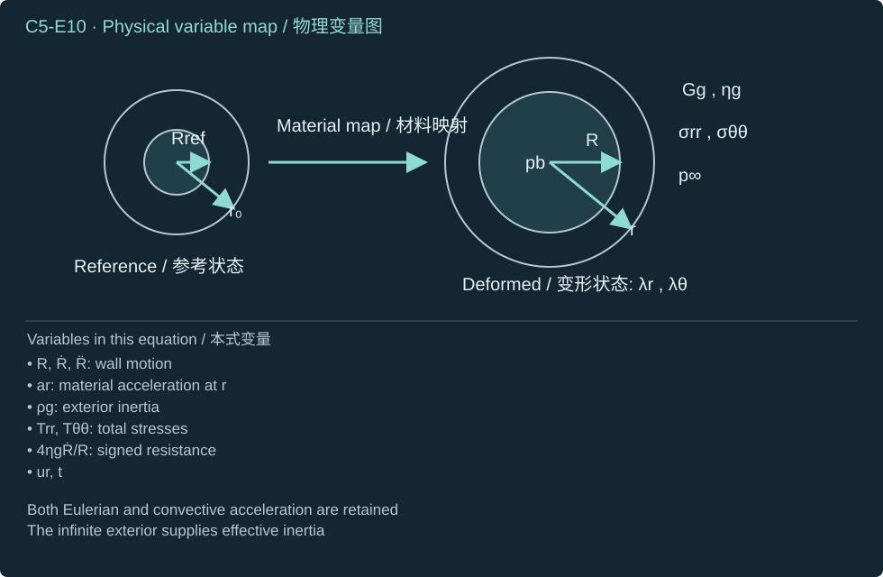

Integrating the material acceleration and the viscous stress difference gives their distinct radial contributions.

对材料加速度与黏性应力差积分，得到各自不同的径向贡献。

**Symbols before Eq. (C5-E11).** $\rho\_g$ is effective medium density (kg m⁻³); $R>0$ is the cavity radius (m); $\dot R$, $\ddot R$ are wall speed/acceleration (m s⁻¹, m s⁻²). $p\_b$, $p\_\infty$, $p\_{\mathrm{el}}(R)$ are cavity, far-field and signed elastic pressures (Pa); $\sigma$ is tension (N m⁻¹); $\eta\_g$ is the represented medium viscosity (Pa s). Each term has units Pa.

**式（C5-E11）前的符号定义。** $\rho\_g$ 为有效介质密度（kg m⁻³）；$R>0$ 为腔体半径（m）；$\dot R$、$\ddot R$ 为泡壁速度／加速度（m s⁻¹、m s⁻²）。$p\_b$、$p\_\infty$、$p\_{\mathrm{el}}(R)$ 为腔内、远场及带符号弹性压力（Pa）；$\sigma$ 为张力（N m⁻¹）；$\eta\_g$ 为所描述介质的黏度（Pa s）。每一项的单位均为 Pa。

(C5-E11) · Derived intact-medium radial control$$
\rho\_g\left(R\ddot R+\frac32\dot R^2\right)=p\_b-p\_\infty-\frac{2\sigma}{R}-p\_{\mathrm{el}}(R)-\frac{4\eta\_g\dot R}{R}.
$$
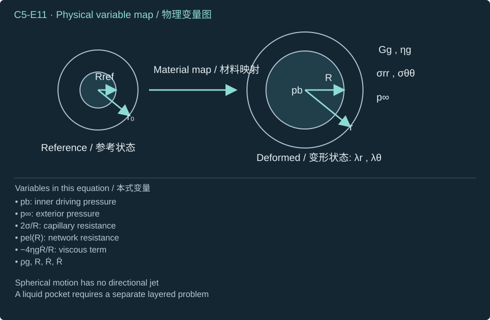

The spherical control quantifies cavity work and wall motion before any directional-flow calculation.

球形控制模型先量化腔体功与泡壁运动，再进行定向流动计算。

The stress derivative integrates to far-field minus wall stress; subtracting the two stress-difference integrals yields Eq. (C5-E11). Setting $G\_g=0$ recovers the corresponding liquid radial model. For expansion the viscous term is negative; during inward motion it is positive and opposes collapse. Do not add a separate solvent viscosity if the fitted $\eta\_g$ already represents the same dissipation. A separate solvent/network model needs its own relative motion and constitutive partition. Phase transfer that gives appreciable material/wall velocity slip also changes the kinematic premise.

应力导数积分得到远场应力减去壁面应力；再减去两个应力差积分，便得到式（C5-E11）。取 $G\_g=0$ 可恢复相应的液体径向模型。膨胀时黏性项为负；向内运动时为正，抵抗塌缩。若拟合的 $\eta\_g$ 已描述同一耗散，不应再另加溶剂黏度。独立的溶剂／网络模型需要各自的相对运动及本构分配。若相变传递造成明显的材料／壁面速度滑移，也会改变运动学前提。

Step 8 — multiply by the volume-change rate to check conservation. The medium kinetic energy follows the radial field, and the elastic work derivative was already checked. The viscous pressure has signed effects on acceleration but always removes mechanical energy because the dissipation contains the square of speed.

步骤 8——乘以体积变化率，核查能量守恒。介质动能由径向速度场确定，弹性功导数已完成核查。黏性压力对加速度的作用具有符号，但它总会移除机械能，因为耗散包含速度平方。

**Symbols before Eq. (C5-E12).** $K\_g,W\_g,E\_\sigma$ are medium kinetic energy, stored network work and interface energy (J); $\rho\_g$ density (kg m⁻³); $R>0$ radius (m); $\dot R$ wall speed (m s⁻¹); $\sigma$ tension (N m⁻¹). $\dot V$ is cavity volume-change rate (m³ s⁻¹), $p\_b,p\_\infty$ pressures (Pa), $P\_{\mathrm{dis}}$ nonnegative viscous power (W), $\eta\_g\geq0$ viscosity (Pa s), $t$ time (s); $d/dt$ is the full time derivative and $\pi$ the circle constant.

**式（C5-E12）前的符号定义。** $K\_g,W\_g,E\_\sigma$ 为介质动能、储存网络功与界面能（J）；$\rho\_g$ 为密度（kg m⁻³）；$R>0$ 为半径（m）；$\dot R$ 为泡壁速度（m s⁻¹）；$\sigma$ 为张力（N m⁻¹）。$\dot V$ 为腔体体积变化率（m³ s⁻¹），$p\_b,p\_\infty$ 为压力（Pa），$P\_{\mathrm{dis}}$ 为非负黏性功率（W），$\eta\_g\geq0$ 为黏度（Pa s），$t$ 为时间（s）；$d/dt$ 为全时间导数，$\pi$ 为圆周率。

(C5-E12) · Derived mechanical energy balance$$
\begin{aligned}K\_g&=2\pi\rho\_gR^3\dot R^2,\qquad E\_\sigma=4\pi\sigma R^2,\qquad \dot V=4\pi R^2\dot R,\\\frac{d}{dt}(K\_g+W\_g+E\_\sigma)&=(p\_b-p\_\infty)\dot V-P\_{\mathrm{dis}},\\P\_{\mathrm{dis}}&=16\pi\eta\_gR\dot R^2\geq0.\end{aligned}
$$
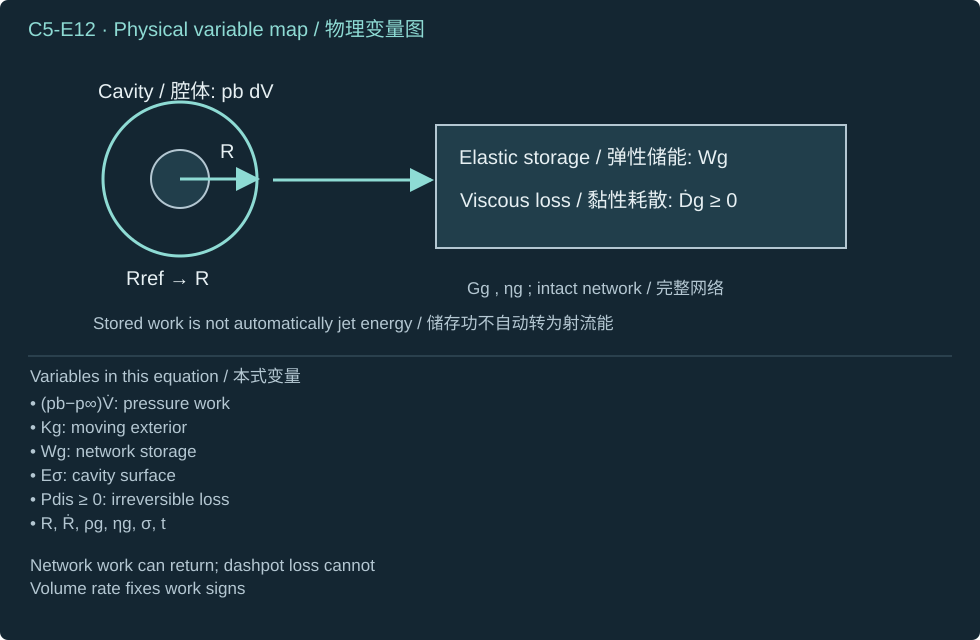

Pressure work divides into inertia, recoverable network energy, surface energy and viscous loss.

压力功分配到惯性、可恢复的网络能、表面能和黏性损耗。

## 5. Worked benchmark: pressure is not the work budget

## 5. 计算示例：压力并不等于功预算

All following numbers are declared teaching inputs, not measurements of a proposed PFC gel. Choose network shear modulus 20 kPa, stress-free radius 5 µm, current radius 30 µm and density 1000 kg m⁻³. First calculate the wall resistance and stored work. The sixfold wall stretch is large; assuming an intact neo-Hookean network there is an explicit hypothesis that needs material validation.

以下数值均为明确设定的教学输入，并非所提出 PFC 凝胶的实测值。取网络剪切模量 20 kPa、无应力半径 5 µm、当前半径 30 µm，以及密度 1000 kg m⁻³。先计算壁面阻力和储存功。壁面伸长六倍属于大变形；此时假设 neo-Hookean 网络保持完整，是需要材料验证的明确假设。

**Symbols before Eq. (C5-E13).** $p\_{\mathrm{el}}$ is elastic resistance (Pa); $W\_g$ is stored elastic work (J). The displayed 20000 is $G\_g$ in Pa, 5 and 30 in the dimensionless ratios are both radii in µm, and $5\times10^{-6}$, $30\times10^{-6}$ are $R\_{\mathrm{ref}},R$ in m. $\pi$ is dimensionless, $\mathrm{Pa}$ means pascal and $\mathrm J$ joule; $\times$ indicates multiplication.

**式（C5-E13）前的符号定义。** $p\_{\mathrm{el}}$ 为弹性阻力（Pa）；$W\_g$ 为储存弹性功（J）。所示 20000 为以 Pa 表示的 $G\_g$，无量纲比值中的 5 与 30 均为以 µm 表示的半径，$5\times10^{-6}$、$30\times10^{-6}$ 为以 m 表示的 $R\_{\mathrm{ref}},R$。$\pi$ 为无量纲量，$\mathrm{Pa}$ 表示帕斯卡，$\mathrm J$ 表示焦耳；$\times$ 表示乘法。

(C5-E13) · Teaching-input substitution$$
\begin{aligned}p\_{\mathrm{el}}&=\frac{20000}{2}\left[5-4\left(\frac5{30}\right)-\left(\frac5{30}\right)^4\right]=43325.6173\ \mathrm{Pa},\\W\_g&=2\pi(20000)\left[\frac53(30\times10^{-6})^3-2(5\times10^{-6})(30\times10^{-6})^2\right.\\&\hspace{30mm}\left.+\frac{(5\times10^{-6})^4}{30\times10^{-6}}-\frac23(5\times10^{-6})^3\right]\\&=4.51603944\times10^{-9}\ \mathrm J.\end{aligned}
$$
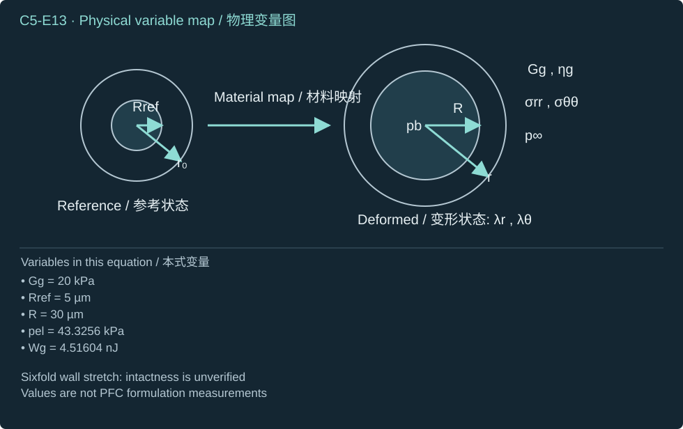

This soft network still stores several nanojoules when the cavity radius expands sixfold.

腔体半径膨胀六倍时，即使这个柔软网络也会储存数纳焦耳能量。

For comparison, prescribe a constant net pressure-work scale of 100 kPa over exactly the same displaced volume. This is a work scale, not a solved gas-pressure history. It gives 11.2574 nJ, of which the calculated network storage is 40.1163%. The remaining 6.74133 nJ is an upper residual for kinetic and surface increments plus losses in this artificial expansion ledger; it is not a predicted external jet energy. Initial surface energy cancels only after its increment is treated consistently.

作为比较，对完全相同的排开体积指定恒定净压力功尺度 100 kPa。这是功的尺度，而不是求解得到的气体压力历程。它给出 11.2574 nJ，其中计算出的网络储存占 40.1163%。余下 6.74133 nJ 是这个人为膨胀账本中，动能与表面能增量加损耗的剩余上限；它不是外部射流能量的预测值。只有一致地处理表面能增量后，初始表面能才能消去。

**Symbols before Eq. (C5-E14).** $\Delta V$ is expanded cavity volume (m³), $R=30$ µm and $R\_{\mathrm{ref}}=5$ µm are radii; $\Delta p\_w=100000$ Pa is a constant illustrative net pressure-work input. $W\_{100}$ is the resulting work scale (J), with subscript 100 labeling its 100 kPa input, and $W\_g=4.51603944$ nJ is stored network work. $\pi$ is dimensionless; nJ means $10^{-9}$ J.

**式（C5-E14）前的符号定义。** $\Delta V$ 为腔体膨胀体积（m³），$R=30$ µm、$R\_{\mathrm{ref}}=5$ µm 为半径；$\Delta p\_w=100000$ Pa 为恒定的示例净压力功输入。$W\_{100}$ 为由此得到的功尺度（J），下标 100 标记其 100 kPa 输入，$W\_g=4.51603944$ nJ 为储存网络功。$\pi$ 为无量纲量；nJ 表示 $10^{-9}$ J。

(C5-E14) · Finite work-budget comparison$$
\begin{aligned}\Delta V&=\frac{4\pi}{3}(R^3-R\_{\mathrm{ref}}^3)=1.12573737\times10^{-13}\ \mathrm{m^3},\\W\_{100}&:=\Delta p\_w\Delta V=11.2573737\ \mathrm{nJ},\\\frac{W\_g}{W\_{100}}&=0.401162791,\qquad W\_{100}-W\_g=6.74133424\ \mathrm{nJ}.\end{aligned}
$$
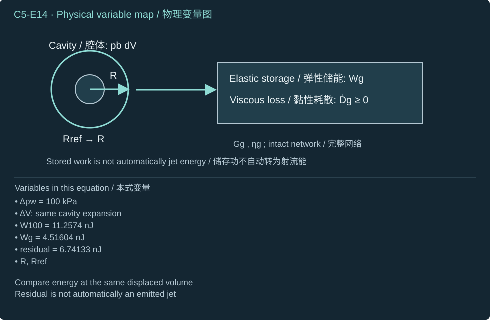

The elastic cost occupies a finite fraction of the work budget even though its pressure is below 100 kPa.

即使弹性压力低于 100 kPa，其能量代价也占据功预算的有限份额。

A separate sign calculation uses an illustrative viscosity 0.010 Pa s, current radius 30 µm and inward wall speed −10 m s⁻¹. Its signed right-hand-side pressure contribution is +13.3333 kPa, but its irreversible power remains +1.50796 mW. A positive resistance during collapse is not energy generation. These instantaneous values require a time history before integrating total dissipation.

另一个符号计算采用示例黏度 0.010 Pa s、当前半径 30 µm，以及向内泡壁速度 −10 m s⁻¹。其方程右侧带符号压力贡献为 +13.3333 kPa，但不可逆功率仍为 +1.50796 mW。塌缩时阻力为正不代表产生能量。这些瞬时值需要结合时间历程，才能积分总耗散。

**Symbols before Eq. (C5-E15).** $p\_{\mathrm{visc,RHS}}$ is the signed viscous pressure term on the radial equation's right-hand side (Pa); RHS labels that side. $P\_{\mathrm{dis}}$ is dissipated power (W), $\eta\_g=0.010$ Pa s is illustrative viscosity, $R=30\times10^{-6}$ m radius, $\dot R=-10$ m s⁻¹ wall speed, and $\pi$ the circle constant. The number 100 is the squared speed in m² s⁻².

**式（C5-E15）前的符号定义。** $p\_{\mathrm{visc,RHS}}$ 为径向方程右侧的带符号黏性压力项（Pa）；RHS 标记右侧。$P\_{\mathrm{dis}}$ 为耗散功率（W），$\eta\_g=0.010$ Pa s 为示例黏度，$R=30\times10^{-6}$ m 为半径，$\dot R=-10$ m s⁻¹ 为泡壁速度，$\pi$ 为圆周率。数值 100 为以 m² s⁻² 表示的速度平方。

(C5-E15) · Signed-pressure and positive-loss check$$
\begin{aligned}p\_{\mathrm{visc,RHS}}&=-\frac{4\eta\_g\dot R}{R}=-\frac{4(0.010)(-10)}{30\times10^{-6}}=13333.3333\ \mathrm{Pa},\\P\_{\mathrm{dis}}&=16\pi\eta\_gR\dot R^2=16\pi(0.010)(30\times10^{-6})(100)=1.50796447\times10^{-3}\ \mathrm W.\end{aligned}
$$
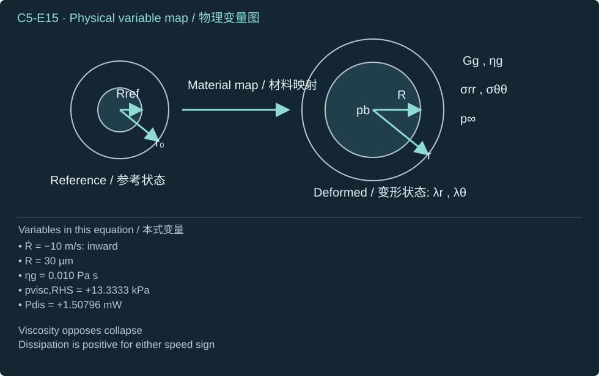

Inward motion changes the pressure sign but leaves dissipated power positive.

向内运动改变压力项符号，但耗散功率仍为正。

## 6. Use event times, not a separate vibration curriculum

## 6. 使用事件时间尺度，不另设振荡课程

Step 9 — compare network memory to event duration. The Deborah number uses an independently identified stress-relaxation time. A large value means stress memory persists during the event; it does not mean an infinitely stiff wall. A small value allows relaxation but does not remove geometric confinement or prove rapid solvent drainage. A relaxation spectrum may require several times rather than one.

步骤 9——比较网络记忆与事件持续时间。Deborah 数使用独立确定的应力松弛时间。数值大表示应力记忆在事件期间持续存在，并不表示壁面无限刚硬。数值小允许发生松弛，但不会消除几何约束，也不能证明溶剂迅速排出。若存在松弛谱，可能需要多个时间而不是一个。

**Symbols before Eq. (C5-E16).** $\mathrm{De}$ is the dimensionless event Deborah number; $\tau\_{\mathrm{rel}}>0$ is an independently identified network stress-relaxation time (s), and $\tau\_e>0$ is the specified cavity/jet event duration (s). Subscripts rel and e label relaxation and event respectively.

**式（C5-E16）前的符号定义。** $\mathrm{De}$ 为无量纲事件 Deborah 数；$\tau\_{\mathrm{rel}}>0$ 为独立确定的网络应力松弛时间（s），$\tau\_e>0$ 为指定的腔体／射流事件持续时间（s）。下标 rel、e 分别表示松弛与事件。

(C5-E16) · Response-time definition$$
\mathrm{De}:=\frac{\tau\_{\mathrm{rel}}}{\tau\_e}.
$$
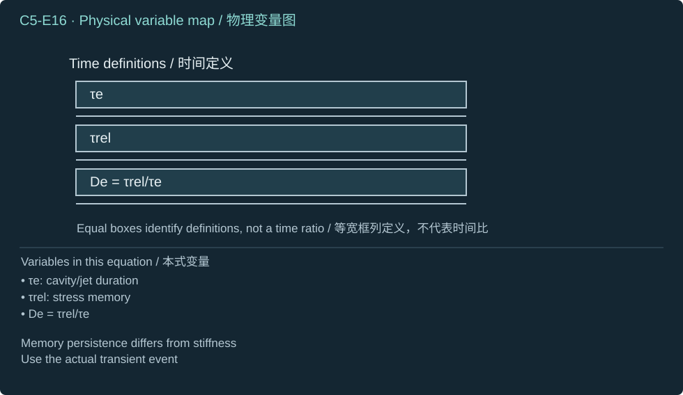

The event duration determines which part of the network response can act before the jet or load arrives.

事件持续时间决定网络响应的哪一部分能在射流或载荷到达前发挥作用。

Do not silently call $\eta\_g/G\_g$ a Kelvin–Voigt stress-relaxation time. In the linear shear version, held strain gives constant elastic stress after the rate term vanishes. Releasing the imposed stress instead gives exponential strain recovery with a retardation time. This distinction prevents fitting an invented relaxation mechanism to the spherical dashpot model.

不要默默把 $\eta\_g/G\_g$ 称作 Kelvin–Voigt 应力松弛时间。在其线性剪切版本中，保持应变不变时，速率项消失后弹性应力保持恒定。若解除外加应力，才会产生指数式应变恢复，其时间为迟滞时间。这一区分可避免给球形黏壶模型拟合一个凭空假设的松弛机制。

**Symbols before Eq. (C5-E17).** $T\_{\mathrm{sh}}$ is shear stress (Pa); $\gamma$ is dimensionless small shear strain, $\dot\gamma$ its rate (s⁻¹), $G\_g>0$ shear modulus (Pa), and $\eta\_g>0$ viscosity (Pa s). $t\geq0$ is time after release (s), $\gamma\_0$ initial strain, $\tau\_{\mathrm{KV}}$ the Kelvin–Voigt zero-stress recovery/retardation time (s), and $\exp$ the exponential of a dimensionless argument. sh and KV are labels, not multiplication.

**式（C5-E17）前的符号定义。** $T\_{\mathrm{sh}}$ 为剪切应力（Pa）；$\gamma$ 为无量纲小剪切应变，$\dot\gamma$ 为其速率（s⁻¹），$G\_g>0$ 为剪切模量（Pa），$\eta\_g>0$ 为黏度（Pa s）。$t\geq0$ 为卸载后的时间（s），$\gamma\_0$ 为初始应变，$\tau\_{\mathrm{KV}}$ 为 Kelvin–Voigt 零应力恢复／迟滞时间（s），$\exp$ 表示对无量纲参数取指数。sh 与 KV 是标签，不是乘法。

(C5-E17) · Linear constitutive check for the chosen dashpot$$
\begin{aligned}T\_{\mathrm{sh}}&=G\_g\gamma+\eta\_g\dot\gamma,\\T\_{\mathrm{sh}}=0:\quad\dot\gamma&=-\frac{G\_g}{\eta\_g}\gamma,\qquad\gamma(t)=\gamma\_0\exp(-t/\tau\_{\mathrm{KV}}),\qquad\tau\_{\mathrm{KV}}:=\frac{\eta\_g}{G\_g}.\end{aligned}
$$
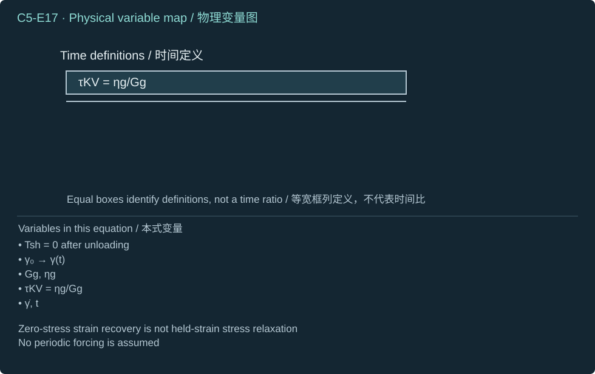

Kelvin–Voigt strain recovery illustrates what its parameter ratio means and what it does not mean.

Kelvin–Voigt 应变恢复说明其参数比值的意义及不能代表的意义。

Step 10 — test spatial communication. A small-strain shear speed estimate concerns network/shear deformation over a stated length. The ideal liquid-collapse reference concerns radial liquid inertia over a stated maximum radius. Use the same 30 µm comparison length but keep the two physical models distinct. The resulting ratio is 2.44464: global support shear equilibration is not automatically rapid on that liquid-collapse timescale. This is a flag for nonradial support motion, not a proof that the derived spherical model has omitted all inertia.

步骤 10——检验空间传播。小应变剪切波速估计涉及指定长度上的网络／剪切变形；理想液体塌缩参考则涉及指定最大半径上的液体径向惯性。比较时采用相同的 30 µm 长度，但保持两个物理模型的区别。所得比值为 2.44464：整个支撑体的剪切平衡并不自动比该液体塌缩过程快。这提示需关注非径向支撑运动，而不是证明所推导球形模型完全忽略了惯性。

**Symbols before Eq. (C5-E18).** $c\_s$ is a small-strain shear speed estimate (m s⁻¹), $G\_g=20000$ Pa modulus, $\rho\_g=1000$ kg m⁻³ medium density, $L\_g=30$ µm comparison length, and $t\_s$ its shear crossing time (s). $t\_{c,\mathrm{liq}}$ is ideal empty-liquid-cavity collapse time (s), $R\_{\max}=30$ µm maximum radius, $\rho\_l=1000$ kg m⁻³ liquid density, and $\Delta p\_c=100000$ Pa collapse pressure gap. The coefficient is the Rayleigh integral; liq labels the liquid control, $\simeq$ is an estimate, and µs means $10^{-6}$ s.

**式（C5-E18）前的符号定义。** $c\_s$ 为小应变剪切波速估计（m s⁻¹），$G\_g=20000$ Pa 为模量，$\rho\_g=1000$ kg m⁻³ 为介质密度，$L\_g=30$ µm 为比较长度，$t\_s$ 为该长度上的剪切传播时间（s）。$t\_{c,\mathrm{liq}}$ 为理想空液体腔的塌缩时间（s），$R\_{\max}=30$ µm 为最大半径，$\rho\_l=1000$ kg m⁻³ 为液体密度，$\Delta p\_c=100000$ Pa 为塌缩压力差。系数来自 Rayleigh 积分；liq 标记液体控制模型，$\simeq$ 表示估计，µs 表示 $10^{-6}$ s。

(C5-E18) · Teaching response-time comparison$$
\begin{aligned}c\_s&\simeq\sqrt{G\_g/\rho\_g}=4.47213595\ \mathrm{m\,s^{-1}},\qquad t\_s:=L\_g/c\_s=6.70820393\ \mathrm{\mu s},\\t\_{c,\mathrm{liq}}&=0.9146813565\,R\_{\max}\sqrt{\rho\_l/\Delta p\_c}=2.74404407\ \mathrm{\mu s},\qquad\frac{t\_s}{t\_{c,\mathrm{liq}}}=2.44464147.\end{aligned}
$$
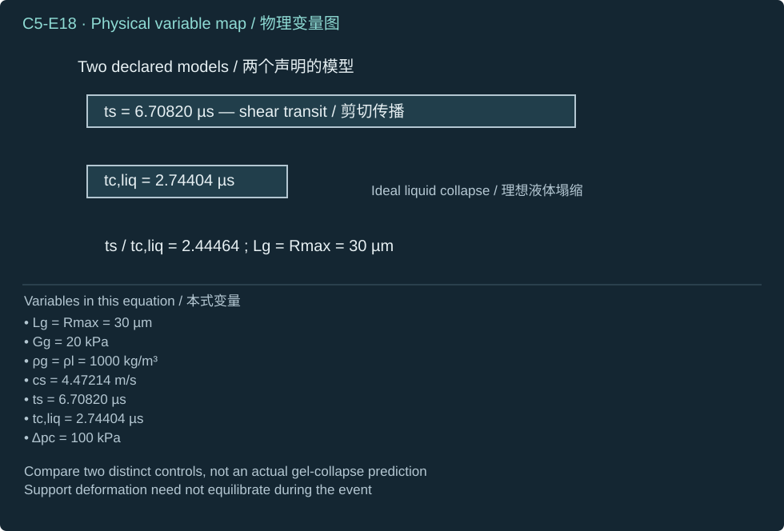

The gel communication estimate exceeds the ideal liquid-collapse reference for the declared inputs.

对已声明输入，凝胶传播时间估计大于理想液体塌缩参考时间。

Low shear modulus does not imply low rapid-compression resistance. In a small-strain compressible extension, longitudinal motion also samples the bulk modulus. Compressibility must be restored when acoustic travel or high wall speed becomes central. The incompressible spherical control takes that longitudinal propagation idealization to its limit; it cannot predict shock peaks or finite arrival times by itself.

低剪切模量不意味着快速压缩阻力小。在小应变可压缩扩展中，纵向运动还涉及体积模量。当声传播时间或较高泡壁速度变得关键时，必须恢复可压缩性。不可压缩球形控制模型采用了纵向传播的极限理想化；它自身不能预测冲击波峰值或有限传播到达时间。

**Symbols before Eq. (C5-E19).** $c\_L$ is longitudinal wave speed estimate (m s⁻¹) in a separate small-strain compressible extension; $K\_g^{\mathrm{bulk}}>0$ is bulk modulus (Pa), distinctly labeled from kinetic energy $K\_g$; $G\_g$ shear modulus (Pa), $\rho\_g$ density (kg m⁻³), $L\_g$ length (m), $t\_L$ longitudinal crossing time (s), $M\_w$ dimensionless wall Mach number, and $\dot R$ wall speed (m s⁻¹). $|\ |$ takes absolute value; $\simeq$ denotes an estimate.

**式（C5-E19）前的符号定义。** $c\_L$ 为独立小应变可压缩扩展中的纵波波速估计（m s⁻¹）；$K\_g^{\mathrm{bulk}}>0$ 为体积模量（Pa），其明确标签使之区别于动能 $K\_g$；$G\_g$ 为剪切模量（Pa），$\rho\_g$ 为密度（kg m⁻³），$L\_g$ 为长度（m），$t\_L$ 为纵波传播时间（s），$M\_w$ 为无量纲泡壁 Mach 数，$\dot R$ 为泡壁速度（m s⁻¹）。$|\ |$ 表示绝对值；$\simeq$ 表示估计。

(C5-E19) · Separate compressibility diagnostic$$
c\_L\simeq\sqrt{\frac{K\_g^{\mathrm{bulk}}+4G\_g/3}{\rho\_g}},\qquad t\_L:=\frac{L\_g}{c\_L},\qquad M\_w:=\frac{|\dot R|}{c\_L}.
$$
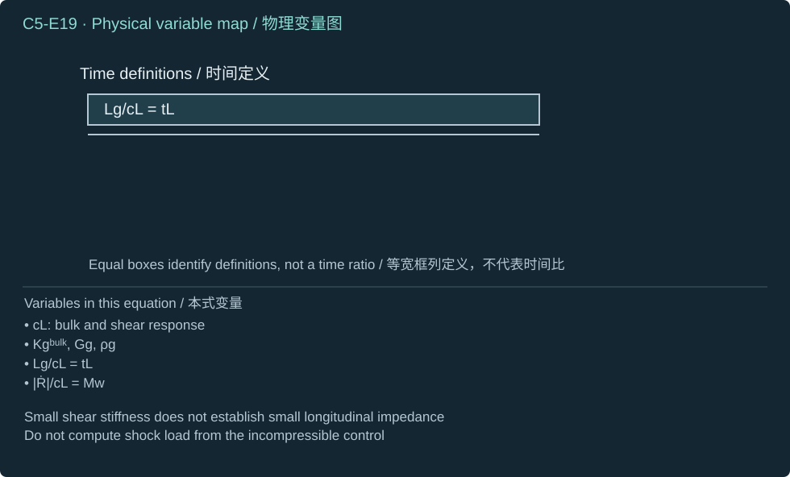

Shear and longitudinal propagation test different aspects of a water-rich gel's transient response.

剪切与纵向传播检验富水凝胶瞬态响应的不同方面。

Step 11 — derive the drainage estimate from a separate two-phase approximation. For small perturbations in a uniform gel, adopt Darcy relative solvent flux and a constant storage modulus. Solvent conservation then produces a diffusion equation. This does not extend the large-strain intact-cavity law automatically to porous flow near the vapor interface.

步骤 11——从独立的两相近似推导排水估计。对均匀凝胶中的小扰动，采用 Darcy 相对溶剂通量和恒定储存模量。溶剂守恒随后给出扩散方程。这并不会自动将大应变完整腔体规律扩展到蒸气界面附近的多孔流动。

**Symbols before Eq. (C5-E20).** $\mathbf j\_l$ is relative solvent volume flux (m s⁻¹); $k\_{\mathrm{perm}}>0$ permeability (m²), $\mu\_l>0$ solvent viscosity (Pa s), $p\_{\mathrm{pore}}$ incremental pore pressure (Pa), $M\_d>0$ storage/constrained drained modulus adopted for this scalar approximation (Pa), $t$ time (s), $D\_{\mathrm{poro}}$ diffusion coefficient (m² s⁻¹), $L\_g$ drainage length (m), and $t\_{\mathrm{poro}}$ drainage time estimate (s). $\nabla$, $\nabla\cdot$, $\nabla^2$ are gradient, divergence and Laplacian in space; the dot here is the vector divergence operator, not an equation separator; $\sim$ means scaling estimate.

**式（C5-E20）前的符号定义。** $\mathbf j\_l$ 为相对溶剂体积通量（m s⁻¹）；$k\_{\mathrm{perm}}>0$ 为渗透率（m²），$\mu\_l>0$ 为溶剂黏度（Pa s），$p\_{\mathrm{pore}}$ 为增量孔隙压力（Pa），$M\_d>0$ 为该标量近似采用的储存／受约束排水模量（Pa），$t$ 为时间（s），$D\_{\mathrm{poro}}$ 为扩散系数（m² s⁻¹），$L\_g$ 为排水长度（m），$t\_{\mathrm{poro}}$ 为排水时间估计（s）。$\nabla$、$\nabla\cdot$、$\nabla^2$ 为空间梯度、散度和 Laplace 算子；此处点号属于向量散度算子，不是方程分隔符；$\sim$ 表示尺度估计。

(C5-E20) · Darcy/storage approximation and derived diffusion$$
\begin{aligned}\mathbf j\_l&=-\frac{k\_{\mathrm{perm}}}{\mu\_l}\nabla p\_{\mathrm{pore}},\qquad\frac{1}{M\_d}\frac{\partial p\_{\mathrm{pore}}}{\partial t}+\nabla\cdot\mathbf j\_l=0,\\\frac{\partial p\_{\mathrm{pore}}}{\partial t}&=D\_{\mathrm{poro}}\nabla^2p\_{\mathrm{pore}},\qquad D\_{\mathrm{poro}}:=\frac{k\_{\mathrm{perm}}M\_d}{\mu\_l},\\t\_{\mathrm{poro}}&\sim\frac{L\_g^2}{D\_{\mathrm{poro}}}=\frac{\mu\_lL\_g^2}{k\_{\mathrm{perm}}M\_d}.\end{aligned}
$$
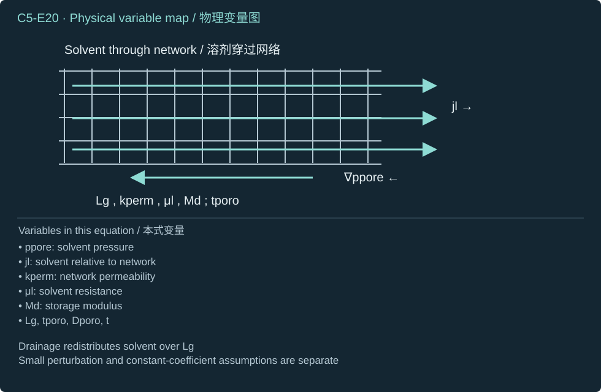

Pressure gradients drive solvent through the network, producing a length-dependent drainage time.

压力梯度驱动溶剂通过网络，产生依赖长度的排水时间。

Substitute the first row's Darcy flux into conservation to obtain the second row; constant coefficients allow them outside the derivatives. Balance a time derivative against a spatial second derivative over $L\_g$ for the third row. This scaling agrees with primary poroelastic gel measurements; the actual permeability and storage modulus still need characterization. For a deliberately illustrative permeability $10^{-17}$ m², modulus 60 kPa, solvent viscosity 0.001 Pa s and length 30 µm, the estimate is 1.5 s. A 3 µs event is then approximately undrained at that length, not proof that no local solvent movement occurs. [Primary drainage study](https://pubs.rsc.org/en/content/articlehtml/2021/sm/d0sm02243h).

将第一行的 Darcy 通量代入守恒式即可得到第二行；常系数可移到导数外。用 $L\_g$ 尺度上的空间二阶导数与时间导数平衡，得到第三行。该尺度关系与原始研究中的凝胶孔弹性测量一致；实际渗透率与储存模量仍需表征。若明确采用示例渗透率 $10^{-17}$ m²、模量 60 kPa、溶剂黏度 0.001 Pa s、长度 30 µm，估计时间为 1.5 s。此时 3 µs 事件在该长度上近似不排水，但这不证明完全不存在局部溶剂运动。[原始排水研究](https://pubs.rsc.org/en/content/articlehtml/2021/sm/d0sm02243h)。

## 7. Test mechanisms and compare complete operating windows

## 7. 检验机制，并比较完整工作窗口

The hypothesis that compliant confinement stabilizes a PFC-driven jet remains unresolved. Elastic-boundary experiments by Brujan and colleagues show that deformation and recoil can accompany jets in either direction and ejection of boundary material; their reported maximum liquid-jet speed was 960 m s⁻¹ in a particular laser-bubble/gel geometry. That observation defeats a universal stabilization claim and is not a performance limit or calibration for PFC transfer. [[R12]](../reference/sources.html#r12)

柔顺约束能够稳定 PFC 驱动射流这一假设仍未解决。Brujan 等人的弹性边界实验表明，变形与回弹可伴随向两个方向的射流，以及边界材料喷出；他们在特定激光气泡／凝胶几何中报告的最高液体射流速度为 960 m s⁻¹。该观察否定普适的稳定化主张，却不是 PFC 转印的性能极限或标定。[[R12]](../reference/sources.html#r12)

Keep all four architectures available for experiments. In a liquid pocket, resolve liquid momentum, moving-wall traction and outlet shape together. In bulk embedding, successful vaporization is only the source step: identify the route through which a finite carrier-liquid mass exits, or show that the actuator works by solid deformation instead. In a sealed cavity, use pressure–layer-motion–fracture coupling directly. For the film/PVC concept, retain both direct liquid/film loading and loading transmitted through an intact PVC layer. The intended release interface and payload stress must be identified in either route.

保留全部四种结构方案供实验使用。在液腔中，需要联合解析液体动量、运动壁面牵引与出口形状。对体相嵌入，成功汽化只是源环节：应明确有限载液质量离开的路径，或证明致动器其实通过固体变形工作。对密封腔体，直接采用压力—层运动—断裂耦合。对薄膜／PVC 概念，保留液体直接加载薄膜，以及载荷经完整 PVC 层传递这两条路径。两条路径都必须确定目标释放界面及被转印对象的应力。

| Control or observation  控制或观测 | What it discriminates  可区分的机制 |
| --- | --- |
| Match PFC inventory, distribution, shell survival, absorber position, initial temperature and measured absorbed energy.  匹配 PFC 物质量、分布、壳层存活、吸收体位置、初始温度及实测吸收能量。 | Separates optical/activation changes from mechanical support changes; equal incident energy alone does not do this.  将光学／激活变化与力学支撑变化区分开；仅使入射能量相等做不到这一点。 |
| Synchronize cavity contour, gel/film motion, emitted liquid composition, finite jet mass, speed, angle and arrival.  同步记录腔体轮廓、凝胶／薄膜运动、喷出液体成分、有限射流质量、速度、角度及到达时间。 | Distinguishes a liquid jet, a recoil-driven second jet, solid fragments and a membrane/blister actuator.  区分液体射流、回弹驱动的第二股射流、固体碎片及膜片／鼓泡致动器。 |
| Specify pressure location, area, bandwidth and time window; record displacement and crack progression.  明确压力位置、面积、带宽及时间窗口；记录位移和裂纹进展。 | Connects fluid output to interface work and selective release rather than an isolated peak.  将流体输出连接到界面功和选择性释放，而不是孤立峰值。 |
| Across independent events, compare angular spread, mass/speed variation, breakup, release success, damage and placement error.  在独立事件间比较角度分散、质量／速度变异、破碎、释放成功率、损伤及定位误差。 | Tests repeatability at a useful delivered load; a lower speed variation with insufficient release is not an improved process.  在有用的实际传递载荷下检验重复性；若载荷不足以释放，仅速度变异降低不代表工艺改善。 |
| Measure cooling, retained vapor, swelling, residue, network damage and reset before repeated pulses.  重复脉冲前测量冷却、滞留蒸气、溶胀、残留物、网络损伤及复位。 | Tests whether positional benefits survive reuse and whether activation/geometry drift accumulates.  检验定位优势能否在复用中持续，以及激活／几何漂移是否累积。 |

Report two different outcomes separately: the largest verified single-event pressure or finite-mass jet speed under stated conditions, and the repeatable intact-transfer window. A favorable gel may trade peak speed for controlled peeling and lower placement scatter, or may improve alignment while reducing useful impulse. Neither trade is decidable from the radial resistance formula. The unresolved inputs are event-rate material laws, actual inclusion/reference geometry, damage and phase kinetics, outlet evolution, and the measured release/landing interface laws.

分别报告两个不同结果：指定条件下经验证的最大单次压力或有限质量射流速度，以及可重复的完整转印窗口。有利的凝胶可能以降低峰值速度换取可控剥离和较小定位离散，也可能改善对准却降低有效冲量。这两类取舍都不能由径向阻力公式决定。尚未解决的输入包括事件速率下的材料规律、实际夹杂／参考几何、损伤及相变动力学、出口演化，以及实测释放／落点界面规律。

## 8. Three defense questions: explain the chain in your own words

## 8. 三道答辩题：用自己的话解释物理链条

### Why are an open pocket, bulk-embedded PFC and a sealed hydrogel stamp different actuators?

### 为什么开放液腔、体相嵌入 PFC 和密封水凝胶印章是不同致动器？

Explain this in your own words. Use assumptions, a physical argument, and a limitation; equation memorization is not required.

请用自己的话解释，说明假设、物理推理及适用限制；不要求背诵公式。

\*\*Reference answer and mastery criteria / 参考答案与掌握标准\*\*

**Symbols before Eq. (C5-E21).** $\rho\_g$ is effective exterior density (kg m⁻³); $R>0$ cavity radius (m); $\dot R,\ddot R$ wall speed/acceleration (m s⁻¹, m s⁻²); $p\_b,p\_\infty,p\_{\mathrm{el}}$ cavity, far-field and elastic pressures (Pa); $\sigma$ tension (N m⁻¹); $\eta\_g$ represented medium viscosity (Pa s). This quoted original formula has the intact spherical, no-slip assumptions of Eq. (C5-E11).

**式（C5-E21）前的符号定义。** $\rho\_g$ 为外部有效密度（kg m⁻³）；$R>0$ 为腔体半径（m）；$\dot R,\ddot R$ 为泡壁速度／加速度（m s⁻¹、m s⁻²）；$p\_b,p\_\infty,p\_{\mathrm{el}}$ 为腔内、远场及弹性压力（Pa）；$\sigma$ 为张力（N m⁻¹）；$\eta\_g$ 为所描述介质的黏度（Pa s）。这一引用的原始公式采用式（C5-E11）的完整球形、无滑移假设。

(C5-E21) · Original radial control recalled$$
\rho\_g\left(R\ddot R+\frac32\dot R^2\right)=p\_b-p\_\infty-\frac{2\sigma}{R}-p\_{\mathrm{el}}(R)-\frac{4\eta\_g\dot R}{R}.
$$
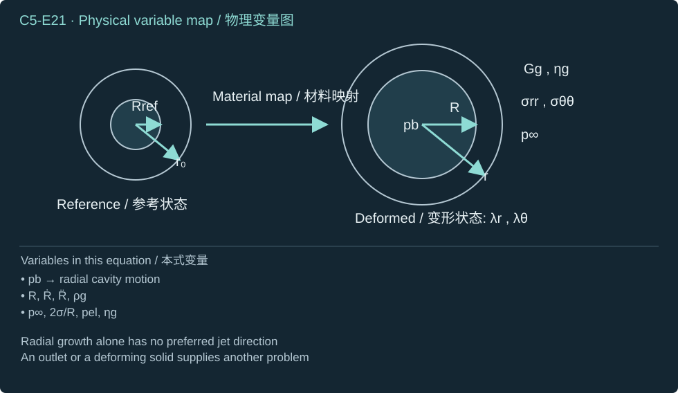

A radial model describes expansion and resistance; it does not manufacture an outlet.

径向模型描述膨胀及阻力，不会凭空产生出口。

A defensible explanation begins with where matter can move. A liquid site or open gel-supported pocket can emit carrier liquid through a meniscus/outlet if asymmetric pressure-driven flow develops. A buried inclusion can expand a cavity yet produce no external liquid jet; network rupture or a channel is an additional mechanism with contamination and damage consequences. A sealed composite cavity can instead bend a cover and drive an interfacial crack without any liquid jet leaving the stamp. The hydrogel paper demonstrates this pressure–deformation–release mechanism, not all four architectures.

可成立的解释应从材料能向哪里运动开始。液体位点或开放的凝胶支撑液腔，如果形成非对称的压力驱动流动，就可以通过液面／出口喷出载液。埋入的夹杂可以使腔体膨胀，却不产生外部液体射流；网络破裂或通道属于额外机制，会带来污染与损伤后果。密封复合腔体则可使覆盖层弯曲并驱动界面裂纹，而无需任何液体射流离开印章。水凝胶论文展示的是这种压力—变形—释放机制，并非全部四种结构。

The spherical equation supplies an intact-medium pressure/work control but cannot determine jet direction or release on its own. Use a spatial moving-interface calculation for an outlet, and a solid/interface calculation for a blister or intact PVC force path. A correct answer may retain all candidates while specifying their different missing closure. Successful PFC activation does not prove a carrier jet or selective transfer.

球形方程提供完整介质的压力／功控制关系，但自身不能确定射流方向或释放。对出口需要空间运动界面计算；对鼓泡或完整 PVC 载荷路径，需要固体／界面计算。正确回答可以保留所有候选方案，同时指出各自缺少的不同闭合关系。PFC 成功激活不证明载液射流或选择性转印。

#### What a mastered answer demonstrates

#### 掌握后的回答应体现

* Identifies the displaced-material path and distinguishes external liquid flow from solid deformation or damage.

  明确被排开材料的路径，区分外部液体流动、固体变形与损伤。
* Connects pressure to an explicit outlet or solid/interface load path and states what the spherical equation cannot calculate.

  将压力连接到明确出口或固体／界面载荷路径，并说明球形方程不能计算什么。
* Uses the hydrogel paper as architecture-specific evidence and keeps the other possibilities conditional rather than discarded.

  将水凝胶论文作为特定结构的证据，保留其他条件性可能，而不是排除它们。

### Why does the 5Gg/2 pressure plateau neither prove stabilization nor replace an energy calculation?

### 为什么 5Gg/2 压力平台既不能证明稳定化，也不能代替能量计算？

Explain this in your own words. Use assumptions, a physical argument, and a limitation; equation memorization is not required.

请用自己的话解释，说明假设、物理推理及适用限制；不要求背诵公式。

\*\*Reference answer and mastery criteria / 参考答案与掌握标准\*\*

**Symbols before Eq. (C5-E22).** $p\_{\mathrm{el}}$ is elastic resistance (Pa), $W\_g$ stored work (J), $G\_g>0$ shear modulus (Pa), and $R\geq R\_{\mathrm{ref}}>0$ current/reference cavity radii (m); $\pi$ is dimensionless. These quote Eqs. (C5-E05) and (C5-E07) for the intact infinite incompressible neo-Hookean medium.

**式（C5-E22）前的符号定义。** $p\_{\mathrm{el}}$ 为弹性阻力（Pa），$W\_g$ 为储存功（J），$G\_g>0$ 为剪切模量（Pa），$R\geq R\_{\mathrm{ref}}>0$ 为当前／参考腔体半径（m）；$\pi$ 为无量纲量。这些公式引用式（C5-E05）与（C5-E07），适用于完整、无限、不可压缩 neo-Hookean 介质。

(C5-E22) · Original pressure and work formulas recalled$$
\begin{aligned}p\_{\mathrm{el}}(R)&=\frac{G\_g}{2}\left[5-4\frac{R\_{\mathrm{ref}}}{R}-\left(\frac{R\_{\mathrm{ref}}}{R}\right)^4\right],\\W\_g(R)&=2\pi G\_g\left[\frac{5R^3}{3}-2R\_{\mathrm{ref}}R^2+\frac{R\_{\mathrm{ref}}^4}{R}-\frac{2R\_{\mathrm{ref}}^3}{3}\right].\end{aligned}
$$
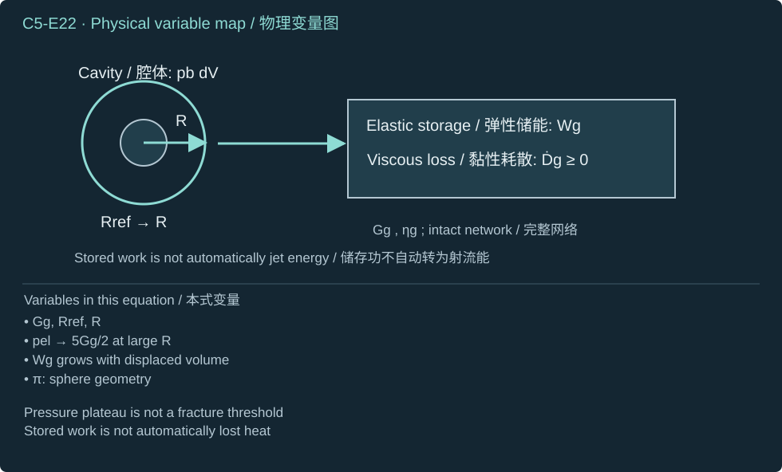

Pressure resistance and elastic work answer different parts of the feasibility calculation.

压力阻力与弹性功回答可行性计算中的不同部分。

At the declared 20 kPa modulus and 5 → 30 µm expansion, resistance is 43.3256 kPa and network work is 4.51604 nJ. A constant 100 kPa net-pressure scale supplies 11.2574 nJ over the same displaced volume, so 40.1163% is stored in the model network. Comparing only 43.3 kPa with 100 kPa misses this integral and the remaining surface, viscous and kinetic demands. The 5 µm reference is a cavity/network reference, not an automatically inherited PFC liquid core size.

对设定的 20 kPa 模量和 5 → 30 µm 膨胀，阻力为 43.3256 kPa，网络功为 4.51604 nJ。恒定 100 kPa 净压力尺度在同一排开体积上提供 11.2574 nJ，因此模型网络储存 40.1163%。仅比较 43.3 kPa 与 100 kPa，会漏掉这个积分及剩余的表面、黏性和动能需求。5 µm 参考值属于腔体／网络参考，不是自动沿用的 PFC 液态核尺寸。

The plateau $5G\_g/2$ belongs to a selected intact constitutive model. It neither limits fracture nor proves jet stability. Work continues to grow with volume, real material can stiffen or tear, and directional flow is absent from this radial model. Stored elastic energy can return on recoil but may return too late, in another direction, or into damage. Viscous loss, by contrast, is nonnegative in both expansion and collapse. The useful conversion needs the actual phase-pressure history, moving geometry and energy partition, not an assumed efficiency pasted onto the pressure formula.

平台值 $5G\_g/2$ 属于选定的完整本构模型。它既不限定断裂，也不证明射流稳定。功仍随体积增长，真实材料可能硬化或撕裂，而且该径向模型没有定向流动。储存弹性能可在回弹时返还，但返还可能太晚、朝另一个方向，或进入损伤。相反，黏性损耗在膨胀与塌缩时都非负。有效转换需要实际相变压力历程、运动几何和能量分配，不能把假定效率直接贴到压力公式上。

#### What a mastered answer demonstrates

#### 掌握后的回答应体现

* Explains the stretch-based elastic origin, zero reference resistance, and constitutive rather than fracture meaning of the plateau.

  说明基于伸长的弹性来源、参考状态零阻力，以及平台属于本构而非断裂意义。
* Uses pressure times volume change to interpret the 4.51604 nJ storage and its 40.1163% benchmark fraction without calling it a predicted jet energy.

  用压力乘体积变化解释 4.51604 nJ 储存及其 40.1163% 示例比例，不将其称为预测射流能量。
* Separates recoverable storage from irreversible viscosity and identifies damage, timing and nonspherical flow as unresolved links.

  区分可恢复储存与不可逆黏性，指出损伤、时序和非球形流动仍是未闭合环节。

### What evidence would establish that a hydrogel improves this PFC transfer process, rather than merely changing its mechanism?

### 什么证据能证明水凝胶改善了该 PFC 转印过程，而不只是改变其机制？

Explain this in your own words. Use assumptions, a physical argument, and a limitation; equation memorization is not required.

请用自己的话解释，说明假设、物理推理及适用限制；不要求背诵公式。

\*\*Reference answer and mastery criteria / 参考答案与掌握标准\*\*

**Symbols before Eq. (C5-E23).** $\mathrm{De}$ is dimensionless event Deborah number, $\tau\_{\mathrm{rel}}$ measured stress-memory time, $\tau\_e$ event duration and $t\_s,t\_{\mathrm{poro}}$ shear/drainage estimates (s). $L\_g$ is a specified length (m), $G\_g$ shear modulus (Pa), $\rho\_g$ density (kg m⁻³), $\mu\_l$ solvent viscosity (Pa s), $k\_{\mathrm{perm}}$ permeability (m²), and $M\_d$ adopted drained storage modulus (Pa). $\sim$ denotes scaling and the square root is the small-strain shear-speed estimate. These recall Eqs. (C5-E16), (C5-E18) and (C5-E20).

**式（C5-E23）前的符号定义。** $\mathrm{De}$ 为无量纲事件 Deborah 数，$\tau\_{\mathrm{rel}}$ 为实测应力记忆时间，$\tau\_e$ 为事件持续时间，$t\_s,t\_{\mathrm{poro}}$ 为剪切／排水时间估计（s）。$L\_g$ 为指定长度（m），$G\_g$ 为剪切模量（Pa），$\rho\_g$ 为密度（kg m⁻³），$\mu\_l$ 为溶剂黏度（Pa s），$k\_{\mathrm{perm}}$ 为渗透率（m²），$M\_d$ 为所采用的排水储存模量（Pa）。$\sim$ 表示尺度关系，平方根为小应变剪切波速估计。这些公式引用式（C5-E16）、（C5-E18）、（C5-E20）。

(C5-E23) · Original event-response formulas recalled$$
\mathrm{De}=\frac{\tau\_{\mathrm{rel}}}{\tau\_e},\qquad t\_s=\frac{L\_g}{\sqrt{G\_g/\rho\_g}},\qquad t\_{\mathrm{poro}}\sim\frac{\mu\_lL\_g^2}{k\_{\mathrm{perm}}M\_d}.
$$
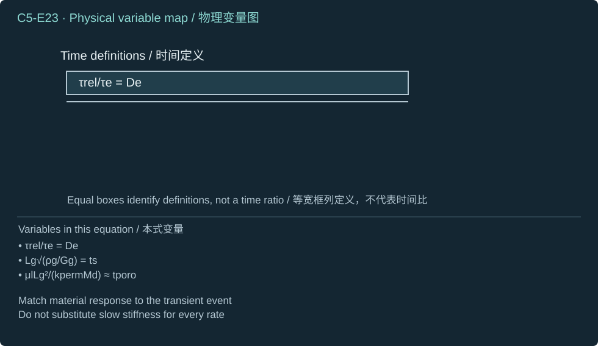

Three timescale comparisons constrain three different physical assumptions.

三个时间尺度比较分别约束三个不同的物理假设。

**Symbols before Eq. (C5-E24).** $\mathbf J\_{\mathrm{target}}$ is vector impulse delivered to the specified target (N s); $\mathbf t\_{\mathrm{load}}$ is external load traction (Pa), $A\_t$ target loading area (m²), and $t\_0,t\_1$ defined start/end times (s). $W\_{\mathrm{sep,min}}$ is necessary fracture-work budget (J), $A\_{\mathrm{rel}}$ intended released interface area (m²), and $\Gamma\_c$ relevant interface fracture energy (J m⁻²), conditional on mode and rate. $dA,dt$ are area/time measures and $\int$ is definite integration. Neither integral alone proves crack onset or intact landing.

**式（C5-E24）前的符号定义。** $\mathbf J\_{\mathrm{target}}$ 为传递到指定目标的向量冲量（N s）；$\mathbf t\_{\mathrm{load}}$ 为外加载荷牵引（Pa），$A\_t$ 为目标受载面积（m²），$t\_0,t\_1$ 为明确的起止时间（s）。$W\_{\mathrm{sep,min}}$ 为必要断裂功预算（J），$A\_{\mathrm{rel}}$ 为目标释放界面面积（m²），$\Gamma\_c$ 为相关界面断裂能（J m⁻²），取决于模态与速率。$dA,dt$ 为面积／时间测度，$\int$ 为定积分。这两个积分都不能独自证明裂纹起始或完整落点。

(C5-E24) · Original load and interface-work accounting$$
\mathbf J\_{\mathrm{target}}=\int\_{t\_0}^{t\_1}\int\_{A\_t}\mathbf t\_{\mathrm{load}}\,dA\,dt,\qquad W\_{\mathrm{sep,min}}=\int\_{A\_{\mathrm{rel}}}\Gamma\_c\,dA.
$$
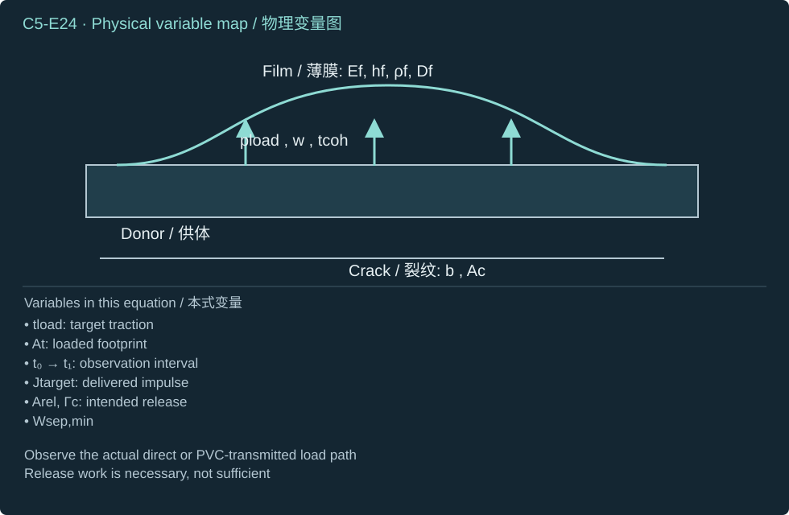

A fair comparison follows the delivered load into the intended interface and the final placement.

公平比较要跟踪实际载荷进入目标界面及最终定位。

I would preserve all architectures and match the PFC batch/inventory, absorber location, absorbed energy, initial temperature, outlet definition and release interface where physically possible. When an architecture changes a matched condition, I would measure that change and report the comparison as conditional. I would characterize network behavior at the event strain, rate and temperature, test shell survival and heat deposition, and distinguish the 6.7082 µs shear estimate from the 2.7440 µs empty-liquid reference. Those times do not predict the actual gel-cavity event or longitudinal shock load.

我会保留所有结构方案，并在物理允许范围内匹配 PFC 批次／物质量、吸收体位置、吸收能量、初始温度、出口定义及释放界面。若某一结构改变了匹配条件，就测量该变化，并将比较报告为有条件的比较。我会在事件的应变、速率和温度下表征网络行为，检验壳层存活及热沉积，并区分 6.7082 µs 剪切时间估计与 2.7440 µs 空液体参考。这两个时间不能预测实际凝胶腔体事件或纵向冲击载荷。

Then I would synchronize cavity, jet/composition, solid motion, calibrated load and crack images; compare independent-shot distributions and intact placement, contamination and reset. Stabilization means lower relevant angle/speed/mass/footprint variability at sufficient useful load, not one slower or smaller bubble. I would report the largest verified single-event output separately from the repeatable intact-transfer envelope. Missing rate-dependent mechanics, permeability, phase kinetics or fracture data leave a stated uncertainty instead of being replaced by the published hydrogel stamp's parameters.

随后，我会同步记录腔体、射流／成分、固体运动、标定载荷和裂纹影像；比较独立事件的分布，以及完整定位、污染和复位。稳定化意味着在足够的有效载荷下，相关角度／速度／质量／载荷范围变异降低，而不是一次更慢或更小的气泡。我会分别报告经验证的最大单次输出与可重复的完整转印范围。若缺少速率相关力学、渗透率、相变动力学或断裂数据，就明确保留不确定性，而不是用已发表水凝胶印章的参数代替。

#### What a mastered answer demonstrates

#### 掌握后的回答应体现

* Defines a fair absorbed-energy/material/geometry comparison while retaining each architecture and both film/PVC load paths.

  定义公平的吸收能量／材料／几何比较，同时保留每种结构及两条薄膜／PVC 载荷路径。
* Distinguishes stress memory, shear communication, solvent drainage and longitudinal compression, with the assumptions of each estimate.

  区分应力记忆、剪切传播、溶剂排水与纵向压缩，并说明各估计的假设。
* Links synchronized mechanism measurements to useful impulse, selective fracture, intact placement, variability and reset; separates extreme output from repeatable transfer.

  将同步机制测量连接到有效冲量、选择性断裂、完整定位、变异与复位；区分极端输出与可重复转印。