# Chapter 1: Cavity pressure, carrier inertia and directional jets

# 第 1 章：空腔压力、载液惯性与定向射流

## 1.1 Identify the actuator before choosing an equation

## 1.1 先辨认执行机制，再选择方程

Our objective is to establish the mechanical part of the transfer chain: how a cavity accelerates its surrounding liquid, how boundaries select a direction, and what extra information is needed to predict a usable jet. A PFC droplet begins as a liquid inclusion with a finite inventory. A bubble is a cavity containing vapor, permanent gas, or both. Their radii describe different physical objects; a bubble radius is not a measure of the remaining PFC mass.

本章建立转印链中的力学部分：空腔如何加速周围液体，边界如何选定方向，以及预测可用射流还需要哪些信息。PFC 液滴最初是具有有限物质库存的液态夹杂物。气泡是含蒸气、非凝结气体或两者的空腔。两者半径描述不同物理对象；气泡半径不能代表剩余 PFC 质量。

Pressure-driven cavitation and thermally initiated vaporization can both produce an inertially moving cavity. Here the phrase laser-induced cavitation includes heating, activation, growth, collapse and possible jetting, while the activation mechanism must be identified separately. Chapter 2 supplies absorption, heat transfer, nucleation and finite phase inventory. This chapter first treats internal pressure as a supplied input, so the mechanical derivation can be reconstructed without inventing an optical efficiency.

压力驱动空化与热诱导汽化均可形成具有惯性运动的空腔。本课程的“激光诱导空化”包括加热、激活、增长、塌缩以及可能的射流，但激活机制必须单独辨认。第二章补充吸收、传热、成核和有限相变库存。本章先把内部压力视为给定输入，从而在不虚构光能转换效率的条件下完整重建力学推导。

| Mechanism 机制 | Moving liquid and boundary 运动液体与边界 | What establishes the classification 判定依据 |
| --- | --- | --- |
| Expansion-driven ejection 膨胀驱动喷射 | The growing cavity displaces carrier toward an outlet or meniscus; the emitted jet is outside the cavity. 增长空腔将载液推向出口或弯月面；喷出射流位于空腔之外。 | Track cavity growth and the outgoing liquid together. 同时追踪空腔增长与向外喷出的液体。 |
| Collapse-driven re-entrant jet 塌缩驱动的再入射流 | An asymmetric liquid interface penetrates the collapsing cavity and can strike its opposite side or a wall. 非对称液体界面穿入塌缩空腔，可撞击另一侧界面或壁面。 | Show penetration into the cavity; do not rename it an external transfer jet. 观测射流穿入空腔；不能直接把它称为外部转印射流。 |
| Sealed-cavity inflation 密闭空腔膨胀 | Pressure deforms an intact membrane or stamp; liquid need not cross a gap. 压力使完整膜或印章变形；液体不必跨越间隙。 | Locate the closed boundary and the transmitted deformation. 确定封闭边界及其传递的变形。 |
| Liquid-bridge stretching 液桥拉伸 | A moving solid pulls a filament; the filament need not originate as a cavitation jet. 运动固体拉出液丝；液丝不一定起源于空化射流。 | Establish which moved first: the liquid tip or the solid. 辨明最先运动的是液体前端还是固体。 |

A bright cavity and a detached payload alone cannot distinguish these mechanisms. The required observations are the cavity boundary, liquid trajectories, outlet, receiving surface and event sequence. The capillary-meniscus study and asymmetric-collapse study cited here address different geometries; their findings are useful only after the boundary conditions are matched. [[R3]](../reference/sources.html#r3) [[R4]](../reference/sources.html#r4)

仅有明亮空腔与已脱离载荷，无法区分这些机制。需要观测空腔边界、液体轨迹、出口、受载表面及事件顺序。这里引用的毛细管弯月面研究与非对称塌缩研究对应不同几何结构；匹配边界条件之后，其结论才适用。 [[R3]](../reference/sources.html#r3) [[R4]](../reference/sources.html#r4)

## 1.2 Define the spherical control and its symbols

## 1.2 定义球形对照体系与符号

The first model is one spherical cavity in an infinite, incompressible Newtonian carrier. The center is fixed; the radial coordinate increases from the center into the liquid. Positive wall velocity means expansion. Density, viscosity and effective surface tension are constant. Gravity, bulk liquid vorticity, phase-transfer velocity slip and gas-side viscous stress are omitted. The bubble pressure is uniform in space but may depend on time. This is a single transient model; no periodic acoustic forcing is assumed.

第一个模型为无限、不可压缩牛顿载液中的单个球形空腔。中心固定；径向坐标从中心向液体外侧增加。壁面速度为正表示膨胀。密度、黏度和有效表面张力为常数。忽略重力、液体体内涡量、相变造成的速度滑移及气相黏性应力。气泡压力空间均匀，但可随时间变化。本模型描述单次瞬态，不假设周期声驱动。

| Symbol 符号 | Physical meaning 物理意义 | SI units SI 单位 | Role and convention 作用与约定 |
| --- | --- | --- | --- |
| $t$ | Elapsed time 经过时间 | s | Independent time coordinate; the initial instant is t = 0. 独立时间坐标；初始时刻取 t = 0。 |
| $r$ | Liquid radial coordinate 液体径向坐标 | m | Distance from the fixed cavity center to an observation point in the carrier; r ≥ R. 从固定空腔中心到载液中观察点的距离；r ≥ R。 |
| $R$ | Instantaneous cavity radius 瞬时空腔半径 | m | Locates the moving liquid–bubble interface; it is not the initial PFC-core radius. 定位运动的液体—气泡界面；并非初始 PFC 核半径。 |
| $\dot R$ | Wall radial velocity 壁面径向速度 | m s⁻¹ | First time derivative of R; positive means expansion and negative means collapse. R 对时间的一阶导数；正值表示膨胀，负值表示塌缩。 |
| $\ddot R$ | Wall radial acceleration 壁面径向加速度 | m s⁻² | Second time derivative of R; its sign describes velocity change, not motion direction alone. R 对时间的二阶导数；其符号描述速度变化，不能单独代表运动方向。 |
| $R_0$ | Prescribed initial cavity radius 给定初始空腔半径 | m | Positive initial value R(0); a state input to the mechanical model. 正的初始值 R(0)；是力学模型的状态输入。 |
| $U_0$ | Initial wall velocity 初始壁面速度 | m s⁻¹ | Prescribed value of the first time derivative of R at the initial instant. 初始时刻给定的 R 的一阶时间导数。 |
| $\rho$ | Carrier mass density 载液质量密度 | kg m⁻³ | Sets surrounding-liquid inertia; it must not be replaced by PFC vapor density. 决定周围液体的惯性；不能替换成 PFC 蒸气密度。 |
| $\mu$ | Carrier dynamic viscosity 载液动力黏度 | Pa s | Newtonian stress coefficient; viscous resistance dissipates energy in either motion direction. 牛顿流体应力系数；黏性阻力在两个运动方向均耗散能量。 |
| $\sigma$ | Effective bubble–carrier surface tension 有效气泡—载液表面张力 | N m⁻¹ | Belongs to the specified interface; contributes the spherical capillary pressure 2σ/R. 属于指定界面；产生球形毛细压力 2σ/R。 |
| $p_b$ | Uniform bubble absolute pressure 均匀气泡绝对压力 | Pa | Pressure on the cavity side of the interface; its history is supplied here. 界面空腔侧压力；本章将其时间历程作为输入。 |
| $p_l$ | Adjacent-liquid absolute pressure 邻近液体绝对压力 | Pa | Liquid-side pressure at the moving interface; stress balance relates it to bubble pressure. 运动界面的液体侧压力；通过应力平衡与泡内压力关联。 |
| $p_\infty$ | Far-field absolute pressure 远场绝对压力 | Pa | Pressure prescribed far from the cavity; pressure differences drive acceleration. 远离空腔处的给定压力；加速度由压力差驱动。 |
| $p$ | Liquid pressure field 液体压力场 | Pa | Pressure at a general liquid observation point, evaluated at the stated position and time. 指定位置与时间的普通液体观察点压力。 |
| $u$ | Scalar radial carrier velocity 标量载液径向速度 | m s⁻¹ | Positive outward from the center; differs from the spatial velocity vector below. 从中心向外取正；与下文空间速度矢量区别使用。 |
| $C(t)$ | Radial volume-flux factor 径向体积流量因子 | m³ s⁻¹ | Continuity makes r²u independent of r; this function is not a material constant. 连续性使 r²u 与 r 无关；该函数并非材料常数。 |
| $\phi$ | Velocity potential 速度势 | m² s⁻¹ | Its spatial derivative gives radial velocity; the reference value is fixed at infinity. 其空间导数给出径向速度；参考值固定在无穷远。 |
| $V_b$ | Cavity volume 空腔体积 | m³ | Geometric volume enclosed by the bubble boundary; pressure work uses its rate of change. 气泡边界围成的几何体积；压力功使用其变化率。 |
| $K_l$ | Carrier kinetic energy 载液动能 | J | Integrates motion throughout the exterior liquid, rather than mass inside the bubble. 对外部液体的运动进行积分，而不是计算气泡内部质量。 |
| $E_\sigma$ | Interfacial energy 界面能 | J | Surface tension multiplied by spherical interface area under the constant-tension assumption. 在张力恒定假设下，等于表面张力乘球形界面面积。 |
| $R_{\max}$ | Radius at the start of ideal collapse 理想塌缩开始时的半径 | m | Maximum cavity radius with zero initial wall velocity in the Rayleigh control. Rayleigh 对照中壁面初始速度为零时的最大空腔半径。 |
| $p_v$ | Stipulated constant vapor pressure 假定恒定蒸气压 | Pa | Ideal-collapse internal-pressure input; real thermal or finite-inventory evolution may change it. 理想塌缩的内部压力输入；实际热过程或有限存量变化可能改变它。 |
| $\Delta p_c$ | Positive ideal-collapse pressure difference 正的理想塌缩压差 | Pa | Defined as far-field pressure minus the stipulated vapor pressure in this control. 在该对照中定义为远场压力减去假定蒸气压。 |
| $t_c$ | Ideal collapse time 理想塌缩时间 | s | Time from the initial maximum radius to the excluded zero-radius limit of the ideal model. 从初始最大半径到理想模型所排除的零半径极限的时间。 |
| $E_B$ | Displaced-volume pressure-work scale 排开体积的压力功尺度 | J | Uses the stated pressure difference and initial cavity volume; not an assigned jet energy. 由所声明压差与初始空腔体积构成；并非预设的射流能量。 |
| $\boldsymbol x$ | Spatial position vector 空间位置矢量 | m | Locates a point in the nonspherical liquid domain. 定位非球形液体域中的一点。 |
| $\boldsymbol u$ | Spatial carrier velocity vector 空间载液速度矢量 | m s⁻¹ | Contains direction and spatial variation needed for a jet; scalar wall speed is insufficient. 包含射流所需的方向与空间变化；标量壁面速度不足以替代它。 |
| $\Pi$ | Pressure impulse per unit area 单位面积压力冲量 | Pa s | Time integral of the specified excess pressure; its gradient changes liquid velocity. 指定超压对时间的积分；其梯度改变液体速度。 |
| $\Gamma$ | Moving liquid–gas interface 运动液—气界面 | — | Geometric surface, not fracture energy; its position evolves with the interface condition. 几何曲面，不是断裂能；其位置按界面条件演化。 |
| $\boldsymbol n$ | Liquid-to-gas unit normal 液体指向气体的单位法向 | 1 | Fixes traction and signed-curvature conventions; reversing it changes those signs. 确定牵引与带符号曲率约定；反转法向会改变相关符号。 |
| $\kappa$ | Signed sum of principal curvatures 带符号的两主曲率之和 | m⁻¹ | For the stated liquid-to-gas normal on a spherical cavity, κ = −2/R. 对于所声明的球形空腔液体指向气体法向，κ = −2/R。 |

Ordinary superscripts are powers, bold symbols are vectors or tensors, and π is the dimensionless circle constant. Spatial gradient, divergence and Laplacian have their usual Cartesian meanings; partial time derivatives hold position fixed. Every display repeats its local definitions, including any new integration variables. The supplied initial radius is positive, which permits division by radius until the model reaches its excluded zero-radius limit.

通常的上标表示幂；粗体符号表示矢量或张量；π 是无量纲圆周率。空间梯度、散度与拉普拉斯算子采用通常的笛卡尔定义；时间偏导保持空间位置固定。每个公式前重复其局部符号定义，包括新引入的积分变量。给定初始半径为正，因此在到达模型所排除的零半径极限之前，可以除以半径。

**Symbols before Eq. (C1-E01).**

**式（C1-E01）前的符号定义。**

| First individual definition / 第一项单独定义 | Second individual definition / 第二项单独定义 |
| --- | --- |
| $R$ is the cavity radius (m) $R$ 为空腔半径（m） | $t$ is time (s), with 0 the chosen initial instant $t$ 为时间（s），0 为选定的初始时刻 |
| $R_0$ is its prescribed positive initial value (m) $R_0$ 为给定的正初始半径（m） | $\dot R$ is wall speed (m s⁻¹) $\dot R$ 为壁面速度（m s⁻¹） |
| $U_0$ its initial value (m s⁻¹) $U_0$ 为其初值（m s⁻¹） | $r$ is radial position (m) $r$ 为径向位置（m） |
| $u$ is radial liquid speed (m s⁻¹) $u$ 为液体径向速度（m s⁻¹） | $p$ is liquid pressure (Pa) $p$ 为液体压力（Pa） |
| $p_\infty$ is prescribed far-field pressure (Pa) $p_\infty$ 为给定远场压力（Pa） |  |

**Conventions and conditions.** The arrow denotes the far-field limit.

**约定与条件。** 箭头表示远场极限。

(C1-E01) · Prescribed initial and boundary conditions

$$
R(0)=R_0>0,\qquad \dot R(0)=U_0,\qquad u(r,t)\to0,\quad p(r,t)\to p_\infty(t)\quad(r\to\infty)
$$

The evolving spherical boundary and the prescribed far-field state.

运动球形边界与给定的远场状态。

## 1.3 Derive Rayleigh–Plesset without hiding the derivative

## 1.3 不省略关键导数，推导 Rayleigh–Plesset 方程

**Step 1 — Conservation of carrier volume.** With radial symmetry, incompressibility makes the radial volume flux independent of radius. Integrate its radial derivative, and use the no-slip-in-the-normal-direction condition at the interface. No vapor density is required for this carrier-flow calculation.

**步骤 1——载液体积守恒。** 在径向对称条件下，不可压缩性使径向体积流量与半径无关。积分其径向导数，再应用界面法向无速度滑移条件。这一载液流动计算不需要蒸气密度。

**Symbols before Eq. (C1-E02).**

**式（C1-E02）前的符号定义。**

| First individual definition / 第一项单独定义 | Second individual definition / 第二项单独定义 |
| --- | --- |
| $r\ge R(t)>0$ is radial position (m) $r\ge R(t)>0$ 为径向位置（m） | $R$ is cavity radius (m) $R$ 为空腔半径（m） |
| $t$ is time (s) $t$ 为时间（s） | $u$ is radial carrier velocity (m s⁻¹) $u$ 为载液径向速度（m s⁻¹） |
| $\dot R$ is wall speed (m s⁻¹) $\dot R$ 为壁面速度（m s⁻¹） | $C(t)$ is the radius-independent flux factor (m³ s⁻¹), not a material constant $C(t)$ 为与径向位置无关的流量因子（m³ s⁻¹），并非材料常数 |

**Conventions and conditions.** $\partial/\partial r$ differentiates at fixed time; The implication arrows indicate integration and use of the interface condition.

**约定与条件。** $\partial/\partial r$ 表示固定时间下的径向求导；箭头表示积分及应用界面条件。

(C1-E02) · Exact continuity within the spherical model

$$
\frac{1}{r^2}\frac{\partial(r^2u)}{\partial r}=0\ \Longrightarrow\ r^2u=C(t),\qquad u(R,t)=\dot R\ \Longrightarrow\ C(t)=R^2\dot R,\qquad u(r,t)=\frac{R^2\dot R}{r^2}
$$

Inverse-square velocity decay places the inertia in the surrounding carrier.

速度按距离平方反比衰减，惯性来自周围载液。

**Step 2 — Fix the potential's reference.** Integrate the velocity from infinity to the chosen position. The resulting potential is valid in the liquid exterior. A constant added only in time is fixed by choosing zero potential at infinity.

**步骤 2——固定速度势的参考值。** 从无穷远积分速度至选定位置。所得速度势适用于液体外域。通过选取无穷远处速度势为零，固定仅随时间变化的附加常数。

**Symbols before Eq. (C1-E03).**

**式（C1-E03）前的符号定义。**

| First individual definition / 第一项单独定义 | Second individual definition / 第二项单独定义 |
| --- | --- |
| $\phi$ is velocity potential (m² s⁻¹) $\phi$ 为速度势（m² s⁻¹） | $r$ is liquid radial position (m) $r$ 为液体径向位置（m） |
| $R$ cavity radius (m) $R$ 为空腔半径（m） | $t$ is time (s) $t$ 为时间（s） |
| $s$ is a dummy radial integration coordinate (m) $s$ 为径向积分哑变量（m） | $u$ is radial velocity (m s⁻¹) $u$ 为径向速度（m s⁻¹） |
| $\dot R$ is wall speed (m s⁻¹) $\dot R$ 为壁面速度（m s⁻¹） |  |

**Conventions and conditions.** the integral is an improper integral convergent for $r\ge R>0$; $\partial/\partial r$ is the fixed-time spatial derivative.

**约定与条件。** 该广义积分在 $r\ge R>0$ 时收敛；$\partial/\partial r$ 为固定时间的空间导数。

(C1-E03) · Derived velocity potential

$$
\phi(r,t)=\int_\infty^r u(s,t)\,ds=R^2\dot R\int_\infty^r s^{-2}\,ds=-\frac{R^2\dot R}{r},\qquad \frac{\partial\phi}{\partial r}=u
$$

The potential reference is fixed at infinity before differentiation.

在求导之前，先固定无穷远处的速度势参考值。

**Step 3 — Differentiate at a fixed observation point.** The Eulerian derivative differentiates the numerator while holding the denominator fixed; only then is the observation point set equal to the instantaneous wall radius. Differentiating the wall value instead follows a moving point and includes an extra convective contribution.

**步骤 3——在固定观察点求导。** 欧拉时间导数只对分子求导，同时保持分母固定；之后才将观察点设为当前壁面半径。直接对壁面取值求导，相当于跟随运动点，会多出一个对流贡献。

**Symbols before Eq. (C1-E04).**

**式（C1-E04）前的符号定义。**

| First individual definition / 第一项单独定义 | Second individual definition / 第二项单独定义 |
| --- | --- |
| $\phi$ is velocity potential (m² s⁻¹) $\phi$ 为速度势（m² s⁻¹） | $t$ is time (s) $t$ 为时间（s） |
| $r$ is fixed radial position (m) $r$ 为固定径向位置（m） | $R(t)>0$ is moving cavity radius (m) $R(t)>0$ 为运动空腔半径（m） |
| $\dot R$ — Wall radial velocity (m s⁻¹) $\dot R$ — 壁面径向速度（m s⁻¹） | $\ddot R$ — Wall radial acceleration (m s⁻²) $\ddot R$ — 壁面径向加速度（m s⁻²） |

**Conventions and conditions.** vertical bars specify where the derivative is taken or evaluated; $d/dt$ follows the moving wall value; Each derivative has units m² s⁻².

**约定与条件。** 竖线表示求导或取值条件；$d/dt$ 跟随运动壁面的取值；各导数的单位均为 m² s⁻²。

(C1-E04) · Exact Eulerian and moving-point derivatives

$$
\left.\frac{\partial\phi}{\partial t}\right|_r=-\frac{2R\dot R^2+R^2\ddot R}{r},\qquad \left.\frac{\partial\phi}{\partial t}\right|_{r=R}=-(2\dot R^2+R\ddot R),\qquad \frac{d\phi(R(t),t)}{dt}=-\dot R^2-R\ddot R
$$

A fixed liquid observation point and a moving interface point have different time derivatives.

固定液体观察点与运动界面点对应不同的时间导数。

**Step 4 — Integrate the radial momentum equation.** This radial field is irrotational and its vector Laplacian vanishes in the exterior, so the bulk viscous force vanishes even though viscous normal stress and dissipation remain. Unsteady Bernoulli, referenced to infinity, then supplies the liquid-side pressure. Substitute the fixed-position derivative and the wall velocity; the coefficient is two minus one half.

**步骤 4——积分径向动量方程。** 此径向场无旋，且其矢量拉普拉斯在外域为零，因此体内黏性力为零，但黏性法向应力和耗散依然存在。以无穷远为参考的非定常伯努利方程给出液体侧压力。代入固定位置时间导数与壁面速度后，系数由二减去二分之一得到。

**Symbols before Eq. (C1-E05).**

**式（C1-E05）前的符号定义。**

| First individual definition / 第一项单独定义 | Second individual definition / 第二项单独定义 |
| --- | --- |
| $p_l$ is liquid pressure at the wall (Pa) $p_l$ 为壁面液体压力（Pa） | $p_\infty$ far-field pressure (Pa) $p_\infty$ 为远场压力（Pa） |
| $\rho>0$ is carrier density (kg m⁻³) $\rho>0$ 为载液密度（kg m⁻³） | $\phi$ is velocity potential (m² s⁻¹) $\phi$ 为速度势（m² s⁻¹） |
| $t$ is time (s) $t$ 为时间（s） | $r$ is radial position (m) $r$ 为径向位置（m） |
| $R>0$ cavity radius (m) $R>0$ 为空腔半径（m） | $u$ is radial velocity (m s⁻¹) $u$ 为径向速度（m s⁻¹） |
| $\dot R$ wall speed (m s⁻¹) $\dot R$ 为壁面速度（m s⁻¹） | $\ddot R$ is wall acceleration (m s⁻²) $\ddot R$ 为壁面加速度（m s⁻²） |

**Conventions and conditions.** $\partial_t$ is taken at fixed position before wall evaluation.

**约定与条件。** $\partial_t$ 必须先在固定位置求导，再于壁面取值。

(C1-E05) · Derived inertial pressure

$$
\frac{p_l-p_\infty}{\rho}=-\left.\frac{\partial\phi}{\partial t}\right|_{r=R}-\frac{u(R,t)^2}{2}=2\dot R^2+R\ddot R-\frac{\dot R^2}{2}=R\ddot R+\frac32\dot R^2
$$

Liquid inertia relates the interface pressure to wall acceleration and squared speed.

液体惯性把界面压力与壁面加速度及速度平方联系起来。

**Step 5 — Apply the clean-interface normal stress.** The radial rate of strain at the wall is negative during expansion. The capillary jump lowers liquid-side pressure relative to bubble pressure. Equal normal traction, including Newtonian viscous stress, gives the following pair of relations.

**步骤 5——应用洁净界面的法向应力。** 膨胀时壁面径向应变率为负。毛细压力跃变使液体侧压力低于气泡压力。包含牛顿黏性应力的法向牵引力平衡给出以下关系。

**Symbols before Eq. (C1-E06).**

**式（C1-E06）前的符号定义。**

| First individual definition / 第一项单独定义 | Second individual definition / 第二项单独定义 |
| --- | --- |
| $u$ — Radial liquid velocity (m s⁻¹) $u$ — 液体径向速度（m s⁻¹） | $\dot R$ — Bubble-wall radial velocity (m s⁻¹) $\dot R$ — 气泡壁面径向速度（m s⁻¹） |
| $r$ — Radial liquid position (m) $r$ — 液体径向位置（m） | $R>0$ — Positive cavity radius (m) $R>0$ — 正的空腔半径（m） |
| $p_l$ — Liquid-side pressure at the cavity wall (Pa) $p_l$ — 空腔壁面处的液体侧压力（Pa） | $p_b$ — Spatially uniform bubble pressure (Pa) $p_b$ — 空间均匀的气泡压力（Pa） |
| $\sigma\ge0$ — Nonnegative surface tension (N m⁻¹) $\sigma\ge0$ — 非负表面张力（N m⁻¹） | $\mu\ge0$ — Nonnegative carrier dynamic viscosity (Pa s) $\mu\ge0$ — 非负载液动力黏度（Pa s） |
| $\partial_r u$ — Radial strain rate, evaluated at the wall (s⁻¹) $\partial_r u$ — 在壁面取值的径向应变率（s⁻¹） |  |

**Conventions and conditions.** wall evaluation is performed at $r=R$.

**约定与条件。** 壁面取值在 $r=R$ 处进行。

(C1-E06) · Newtonian stress and capillary boundary condition

$$
\left.\frac{\partial u}{\partial r}\right|_{r=R}=\left.-\frac{2R^2\dot R}{r^3}\right|_{r=R}=-\frac{2\dot R}{R},\qquad p_l=p_b-\frac{2\sigma}{R}+2\mu\left.\frac{\partial u}{\partial r}\right|_{r=R}=p_b-\frac{2\sigma}{R}-\frac{4\mu\dot R}{R}
$$

Capillary and viscous stresses act at the interface even when the radial bulk viscous force is zero.

即使径向体内黏性力为零，毛细与黏性应力仍作用于界面。

**Step 6 — Combine inertia and traction.** Substitute Eq. (C1-E06) into Eq. (C1-E05) and multiply by carrier density. This closes the radial momentum balance, but not the internal pressure. The surrounding aqueous carrier sets the inertia; replacing its density with liquid PFC density would describe a different exterior domain.

**步骤 6——联立惯性与牵引力。** 将式（C1-E06）代入式（C1-E05），再乘以载液密度。这闭合了径向动量平衡，却没有闭合内部压力。惯性由周围水性载液决定；若换成液态 PFC 密度，就相当于改换了外部流动区域。

**Symbols before Eq. (C1-E07).**

**式（C1-E07）前的符号定义。**

| First individual definition / 第一项单独定义 | Second individual definition / 第二项单独定义 |
| --- | --- |
| $\rho>0$ is carrier density (kg m⁻³) $\rho>0$ 为载液密度（kg m⁻³） | $R>0$ is cavity radius (m) $R>0$ 为空腔半径（m） |
| $\dot R$ — Wall radial velocity (m s⁻¹) $\dot R$ — 壁面径向速度（m s⁻¹） | $\ddot R$ — Wall radial acceleration (m s⁻²) $\ddot R$ — 壁面径向加速度（m s⁻²） |
| $p_b$ — Uniform bubble absolute pressure (Pa) $p_b$ — 均匀气泡绝对压力（Pa） | $p_\infty$ — Far-field absolute pressure (Pa) $p_\infty$ — 远场绝对压力（Pa） |
| $\sigma$ is constant surface tension (N m⁻¹) $\sigma$ 为常数表面张力（N m⁻¹） | $\mu$ is constant carrier viscosity (Pa s) $\mu$ 为常数载液黏度（Pa s） |

**Conventions and conditions.** Every term is a pressure.

**约定与条件。** 各项均具有压力单位。

(C1-E07) · Rayleigh–Plesset under the declared assumptions

$$
\rho\left(R\ddot R+\frac32\dot R^2\right)=p_b-p_\infty-\frac{2\sigma}{R}-\frac{4\mu\dot R}{R}
$$

The spherical pressure–inertia balance has a scalar radial state.

球形压力—惯性平衡只具有标量径向状态。

Dimensions give density times length times acceleration = Pa; surface tension divided by radius and viscosity times speed divided by radius are also Pa. At rest, balance requires bubble pressure to exceed far-field pressure by the capillary jump. During inward motion, the viscous pressure term is positive and resists collapse. A negative right side is not alone the acceleration: the squared-speed term must also be subtracted when solving for acceleration. These results agree with the classical spherical treatment. [[R1]](../reference/sources.html#r1) [[Brennen, Ch. 2]](https://media.library.caltech.edu/CaltechBOOK%3A1995.001/chap2.htm)

量纲检查表明，密度乘长度乘加速度的单位为 Pa；表面张力除以半径、以及黏度乘速度除以半径也均为 Pa。静止时，气泡压力必须比远场压力高出毛细压力跃变。向内运动时，黏性压力项为正，阻碍塌缩。右端为负并不能单独给出加速度；求解加速度时还必须减去速度平方项。这些结果与经典球形理论一致。 [[R1]](../reference/sources.html#r1) [[Brennen，第 2 章]](https://media.library.caltech.edu/CaltechBOOK%3A1995.001/chap2.htm)

**Symbols before Eq. (C1-E08).**

**式（C1-E08）前的符号定义。**

| First individual definition / 第一项单独定义 | Second individual definition / 第二项单独定义 |
| --- | --- |
| $p_b$ is uniform total bubble pressure (Pa) $p_b$ 为空间均匀的气泡总压力（Pa） | $p_{v,\mathrm{PFC}}$ is the PFC-vapor partial pressure (Pa) $p_{v,\mathrm{PFC}}$ 为 PFC 蒸气分压（Pa） |
| $p_{v,w}$ water-vapor partial pressure (Pa) $p_{v,w}$ 为水蒸气分压（Pa） | $p_g$ permanent-gas partial pressure (all Pa) $p_g$ 为非凝结气体分压（均为 Pa） |

**Conventions and conditions.** Subscript $v$ labels vapor, PFC its chemical family; Additivity assumes a gas-mixture pressure description with the stated partial pressures; $w$ water; $g$ noncondensable gas.

**约定与条件。** 下标 $v$ 表示蒸气，PFC 表示该化学物质族；相加关系采用具有上述分压定义的气体混合物压力描述；$w$ 表示水；$g$ 表示非凝结气体。

(C1-E08) · Pressure composition requiring thermodynamic closure

$$
p_b=p_{v,\mathrm{PFC}}+p_{v,w}+p_g
$$

The mechanical input comes from the evolving contents, not from radius alone.

力学输入来自不断变化的气泡内容物，不能仅由半径决定。

A polytropic fixed-mass gas law is a useful gas-bubble control only when its mass and heat-transfer assumptions apply. Evaporation and condensation exchange mass and latent heat; they cannot be silently replaced by a permanent-gas law. The uniform-pressure approximation itself requires internal communication fast enough compared with state evolution. Chapter 2 will state the finite-inventory closure explicitly. [[R5]](../reference/sources.html#r5)

定质量多方气体定律只有在其质量与传热假设适用时，才能作为有用的气泡对照模型。蒸发与凝结伴随质量和潜热交换，不能悄然替换为非凝结气体定律。空间均匀压力近似本身也要求内部压力通信足够快，能够跟上状态演化。第二章将明确给出有限库存的闭合关系。 [[R5]](../reference/sources.html#r5)

## 1.4 Derive the carrier energy balance

## 1.4 推导载液能量平衡

**Step 7 — Integrate kinetic energy through the whole exterior.** Square the velocity from Eq. (C1-E02), multiply by the spherical volume element, and integrate. Although the domain is infinite, the remaining inverse-square integral converges. The effective moving inertia therefore belongs to carrier liquid extending beyond the cavity.

**步骤 7——在整个外域积分动能。** 将式（C1-E02）的速度平方，乘以球形体积元，再积分。尽管区域无限，剩余的平方反比积分仍收敛。因此，有效运动惯性属于空腔之外的载液。

**Symbols before Eq. (C1-E09).**

**式（C1-E09）前的符号定义。**

| First individual definition / 第一项单独定义 | Second individual definition / 第二项单独定义 |
| --- | --- |
| $K_l$ is exterior liquid kinetic energy (J) $K_l$ 为外部液体动能（J） | $\rho$ is carrier density (kg m⁻³) $\rho$ 为载液密度（kg m⁻³） |
| $u$ is radial liquid speed (m s⁻¹) $u$ 为径向液体速度（m s⁻¹） | $\dot R$ wall speed (m s⁻¹) $\dot R$ 为壁面速度（m s⁻¹） |
| $t$ is time (s) $t$ 为时间（s） | $R>0$ is cavity radius (m) $R>0$ 为空腔半径（m） |
| $r$ the integration radius (m) $r$ 为积分半径（m） | $\pi$ is the circle constant (dimensionless) $\pi$ 为圆周率（无量纲） |

**Conventions and conditions.** $4\pi r^2dr$ is the spherical volume element (m³); endpoint brackets mean upper minus lower evaluation.

**约定与条件。** $4\pi r^2dr$ 为球形体积元（m³）；端点方括号表示上限取值减下限取值。

(C1-E09) · Exact kinetic-energy integral in the spherical model

$$
\begin{aligned}K_l&=\int_R^\infty\frac12\rho u(r,t)^2\,4\pi r^2\,dr\\&=2\pi\rho R^4\dot R^2\int_R^\infty r^{-2}\,dr\\&=2\pi\rho R^4\dot R^2\left[-\frac1r\right]_R^\infty=2\pi\rho R^3\dot R^2.\end{aligned}
$$

Exterior shells contribute finite kinetic energy even in an infinite domain.

即使外域无限，外部液壳贡献的总动能仍有限。

**Step 8 — Differentiate stored energies explicitly.** Radius changes both the volume of moving liquid and its speed. Apply the product rule; separately differentiate the geometric cavity volume and interface energy. Constant surface tension is needed for the last derivative.

**步骤 8——明确求出储能导数。** 半径变化同时改变运动液体体积和速度。应用乘积求导规则；另外分别对几何空腔体积与界面能求导。最后一项导数要求表面张力为常数。

**Symbols before Eq. (C1-E10).**

**式（C1-E10）前的符号定义。**

| First individual definition / 第一项单独定义 | Second individual definition / 第二项单独定义 |
| --- | --- |
| $K_l$ — Carrier kinetic energy (J) $K_l$ — 载液动能（J） | $E_\sigma$ — Interfacial energy (J) $E_\sigma$ — 界面能（J） |
| $t$ is time (s) $t$ 为时间（s） | $\rho$ is carrier density (kg m⁻³) $\rho$ 为载液密度（kg m⁻³） |
| $R$ is radius (m) $R$ 为半径（m） | $\dot R$ — Wall radial velocity (m s⁻¹) $\dot R$ — 壁面径向速度（m s⁻¹） |
| $\ddot R$ — Wall radial acceleration (m s⁻²) $\ddot R$ — 壁面径向加速度（m s⁻²） | $V_b$ is cavity volume (m³) $V_b$ 为空腔体积（m³） |
| $\dot V_b$ its time derivative (m³ s⁻¹) $\dot V_b$ 为其时间导数（m³ s⁻¹） | $\sigma$ is constant surface tension (N m⁻¹) $\sigma$ 为常数表面张力（N m⁻¹） |
| $\pi$ is the circle constant (dimensionless) $\pi$ 为圆周率（无量纲） |  |

**Conventions and conditions.** Energy derivatives are powers (W).

**约定与条件。** 能量的时间导数为功率（W）。

(C1-E10) · Exact product-rule derivatives

$$
\begin{aligned}\frac{dK_l}{dt}&=2\pi\rho\left(3R^2\dot R^3+2R^3\dot R\ddot R\right)=4\pi R^2\dot R\,\rho\left(R\ddot R+\frac32\dot R^2\right),\\V_b&=\frac{4\pi R^3}{3},\qquad \dot V_b=4\pi R^2\dot R,\\E_\sigma&=4\pi\sigma R^2,\qquad \frac{dE_\sigma}{dt}=8\pi\sigma R\dot R.\end{aligned}
$$

Volume work couples kinetic storage, interface storage and dissipation.

体积功耦合动能储存、界面能储存与耗散。

**Step 9 — Multiply the momentum balance by volume rate.** The left side becomes the first row of Eq. (C1-E10). The capillary term becomes minus the surface-energy derivative. The viscous term is negative regardless of expansion or collapse because it contains squared speed.

**步骤 9——将动量平衡乘以体积变化率。** 左侧成为式（C1-E10）的第一行。毛细项成为界面能导数的负值。黏性项包含速度平方，因此无论膨胀或塌缩均为负。

**Symbols before Eq. (C1-E11).**

**式（C1-E11）前的符号定义。**

| First individual definition / 第一项单独定义 | Second individual definition / 第二项单独定义 |
| --- | --- |
| $t$ is time (s) $t$ 为时间（s） | $K_l$ — Carrier kinetic energy (J) $K_l$ — 载液动能（J） |
| $E_\sigma$ — Interfacial energy (J) $E_\sigma$ — 界面能（J） | $p_b$ — Uniform bubble absolute pressure (Pa) $p_b$ — 均匀气泡绝对压力（Pa） |
| $p_\infty$ — Far-field absolute pressure (Pa) $p_\infty$ — 远场绝对压力（Pa） | $\dot V_b$ is cavity volume rate (m³ s⁻¹) $\dot V_b$ 为空腔体积变化率（m³ s⁻¹） |
| $\mu\ge0$ is carrier viscosity (Pa s) $\mu\ge0$ 为载液黏度（Pa s） | $R>0$ is cavity radius (m) $R>0$ 为空腔半径（m） |
| $\dot R$ is wall speed (m s⁻¹) $\dot R$ 为壁面速度（m s⁻¹） | $\pi$ is the circle constant (dimensionless) $\pi$ 为圆周率（无量纲） |

**Conventions and conditions.** The nonnegative term is dissipated power (W).

**约定与条件。** 非负项是耗散功率（W）。

(C1-E11) · Derived mechanical-energy balance

$$
\frac{d}{dt}(K_l+E_\sigma)=(p_b-p_\infty)\dot V_b-16\pi\mu R\dot R^2,\qquad 16\pi\mu R\dot R^2\ge0
$$

The pressure source supplies mechanical work; focusing cannot create extra energy.

压力源提供机械功；聚焦不能产生额外能量。

The dissipation can also be checked directly. The radial strain rates are minus twice, once and once the wall-speed flux factor divided by distance cubed. Their squared sum is six times that factor squared. Integrating the Newtonian dissipation density therefore recovers exactly the loss in Eq. (C1-E11). This independent route confirms its sign and numerical coefficient.

耗散还可以直接检验。三个主应变率分别为壁面速度流量因子除以距离三次方的负二倍、一倍与一倍；平方和为该因子平方的六倍。积分牛顿耗散密度，可准确恢复式（C1-E11）的损失项。这条独立推导路径检验了其符号与数值系数。

**Symbols before Eq. (C1-E12).**

**式（C1-E12）前的符号定义。**

| First individual definition / 第一项单独定义 | Second individual definition / 第二项单独定义 |
| --- | --- |
| $D_{rr}$ — Radial strain-rate component (s⁻¹) $D_{rr}$ — 径向应变率分量（s⁻¹） | $D_{\theta\theta}$ — Polar tangential strain-rate component (s⁻¹) $D_{\theta\theta}$ — 极角切向应变率分量（s⁻¹） |
| $D_{\psi\psi}$ — Azimuthal tangential strain-rate component (s⁻¹) $D_{\psi\psi}$ — 方位角切向应变率分量（s⁻¹） | $\mathcal D_\mu$ is total viscous dissipation rate (W) $\mathcal D_\mu$ 为总黏性耗散率（W） |
| $\mu$ is viscosity (Pa s) $\mu$ 为黏度（Pa s） | $R>0$ is radius (m) $R>0$ 为半径（m） |
| $r$ radial integration position (m) $r$ 为径向积分位置（m） | $\dot R$ is wall speed (m s⁻¹) $\dot R$ 为壁面速度（m s⁻¹） |
| $\pi$ is the circle constant (dimensionless) $\pi$ 为圆周率（无量纲） | $\theta$ — Polar direction label in the strain-rate components (—) $\theta$ — 应变率分量中的极角方向标记（—） |
| $\psi$ — Azimuthal direction label, distinct from velocity potential (—) $\psi$ — 与速度势区别使用的方位角方向标记（—） | $\phi$ — Velocity potential (m² s⁻¹) $\phi$ — 速度势（m² s⁻¹） |

**Conventions and conditions.** The integral is over the liquid exterior; angular labels do not reuse the potential symbol $\phi$.

**约定与条件。** 积分区域为液体外域；角向标记不复用速度势符号 $\phi$。

(C1-E12) · Independent dissipation and conservation check

$$
\begin{aligned}D_{rr}&=-\frac{2R^2\dot R}{r^3},\qquad D_{\theta\theta}=D_{\psi\psi}=\frac{R^2\dot R}{r^3},\\\mathcal D_\mu&=\int_R^\infty 2\mu\left(D_{rr}^2+D_{\theta\theta}^2+D_{\psi\psi}^2\right)4\pi r^2\,dr\\&=48\pi\mu R^4\dot R^2\int_R^\infty r^{-4}\,dr=16\pi\mu R\dot R^2.\end{aligned}
$$

Direct strain-rate integration verifies the mechanical-energy loss.

直接积分应变率检验机械能损失。

The energy balance gives a useful design warning. More confinement can redirect liquid, while also requiring more pressure work, storing elastic energy, or dissipating energy. A larger incident laser pulse does not specify how much energy reaches carrier motion. The thermodynamic source and the mechanical receiver must both be accounted for.

能量平衡给出一个设计提醒：更强约束能够改变流动方向，同时也可能需要更多压力功、储存弹性能或耗散能量。入射激光脉冲增大，并不能确定有多少能量进入载液运动。必须同时核算热力学源与机械受载体系。

## 1.5 Solve ideal collapse and derive the coefficient

## 1.5 解出理想塌缩并推导系数

**Step 10 — Declare the reduced initial-value problem.** Set time zero at maximum radius with zero wall speed. Assume constant far-field and vapor pressures with a positive difference; omit surface tension, viscosity, permanent gas and liquid compressibility. This removes thermal and phase dynamics rather than proving that they are small in PFC. A hot vapor-rich cavity may still be growing under quite different conditions.

**步骤 10——声明约化初值问题。** 令零时刻对应最大半径，且壁面速度为零。假设远场压力与蒸气压为常数，两者差值为正；忽略表面张力、黏度、非凝结气体与液体可压缩性。这是在删除热与相变动力学，并非证明它们在 PFC 中很小。高温富蒸气空腔在完全不同的条件下仍可能增长。

**Symbols before Eq. (C1-E13).**

**式（C1-E13）前的符号定义。**

| First individual definition / 第一项单独定义 | Second individual definition / 第二项单独定义 |
| --- | --- |
| $\Delta p_c>0$ is constant collapse-driving pressure (Pa) $\Delta p_c>0$ 为常数塌缩驱动压差（Pa） | $p_\infty$ — Constant Far-field absolute pressure (Pa) $p_\infty$ — 恒定的远场绝对压力（Pa） |
| $p_v$ — Stipulated constant vapor pressure (Pa) $p_v$ — 假定恒定蒸气压（Pa） | $t=0$ is maximum-radius time (s) $t=0$ 为最大半径时刻（s） |
| $R>0$ — Instantaneous cavity radius (m) $R>0$ — 瞬时空腔半径（m） | $R_{\max}>0$ — Radius at the start of ideal collapse (m) $R_{\max}>0$ — 理想塌缩开始时的半径（m） |
| $\dot R$ — Wall radial velocity (m s⁻¹) $\dot R$ — 壁面径向速度（m s⁻¹） | $\ddot R$ — Wall radial acceleration (m s⁻²) $\ddot R$ — 壁面径向加速度（m s⁻²） |
| $\rho>0$ is carrier density (kg m⁻³) $\rho>0$ 为载液密度（kg m⁻³） |  |(C1-E13) · Idealized collapse initial-value problem

$$
\Delta p_c=p_\infty-p_v>0,\qquad R(0)=R_{\max},\quad \dot R(0)=0,\qquad R\ddot R+\frac32\dot R^2=-\frac{\Delta p_c}{\rho}
$$

The ideal control begins at rest and excludes the mechanisms that arrest real collapse.

理想对照从静止开始，并排除了阻止实际塌缩的机制。

**Step 11 — Change the independent variable only on the collapse branch.** Initial acceleration is negative, so radius decreases for the interior of this branch. Define squared speed as a function of radius. Away from the turning point, use the chain rule and cancel the nonzero speed; extend the resulting relation continuously back to the initial endpoint. Multiply the first-order equation by radius cubed to form an exact derivative.

**步骤 11——仅在塌缩分支上改变自变量。** 初始加速度为负，因此半径在这一分支内部递减。把速度平方定义为半径函数。在转折点之外使用链式法则，并约去非零速度；随后通过连续延拓把关系带回初始端点。将一阶方程乘以半径三次方，形成完整导数。

**Symbols before Eq. (C1-E14).**

**式（C1-E14）前的符号定义。**

| First individual definition / 第一项单独定义 | Second individual definition / 第二项单独定义 |
| --- | --- |
| $y(R)$ is squared wall speed (m² s⁻²) $y(R)$ 为壁面速度平方（m² s⁻²） | $R\in(0,R_{\max})$ is decreasing radius (m) $R\in(0,R_{\max})$ 为递减半径（m） |
| $t$ is time (s) $t$ 为时间（s） | $\dot R\ne0$ — Wall radial velocity (m s⁻¹) $\dot R\ne0$ — 壁面径向速度（m s⁻¹） |
| $\ddot R$ — Wall radial acceleration (m s⁻²) $\ddot R$ — 壁面径向加速度（m s⁻²） | $\Delta p_c$ is positive pressure difference (Pa) $\Delta p_c$ 为正压差（Pa） |
| $\rho$ is carrier density (kg m⁻³) $\rho$ 为载液密度（kg m⁻³） |  |

**Conventions and conditions.** $d/dR$ and $d/dt$ are ordinary derivatives on the monotonic branch; Radius powers are the integrating factor, not derivatives.

**约定与条件。** $d/dR$ 与 $d/dt$ 为单调分支上的普通导数；半径幂构成积分因子，并非导数。

(C1-E14) · Exact chain rule and integrating factor

$$
\begin{aligned}y(R)&=\dot R^2,\qquad \frac{dy}{dt}=\frac{dy}{dR}\dot R=2\dot R\ddot R\quad\Longrightarrow\quad\ddot R=\frac12\frac{dy}{dR},\\\frac{dy}{dR}+\frac{3y}{R}&=-\frac{2\Delta p_c}{\rho R},\\\frac{d(R^3y)}{dR}&=R^3\frac{dy}{dR}+3R^2y=-\frac{2\Delta p_c}{\rho}R^2.\end{aligned}
$$

The monotonic collapse branch allows radius to replace time in the first integration.

单调塌缩分支允许在第一次积分中以半径取代时间。

**Symbols before Eq. (C1-E15).**

**式（C1-E15）前的符号定义。**

| First individual definition / 第一项单独定义 | Second individual definition / 第二项单独定义 |
| --- | --- |
| $R\in(0,R_{\max}]$ — Instantaneous cavity radius (m) $R\in(0,R_{\max}]$ — 瞬时空腔半径（m） | $R_{\max}$ — Radius at the start of ideal collapse (m) $R_{\max}$ — 理想塌缩开始时的半径（m） |
| $y$ is squared speed (m² s⁻²) $y$ 为速度平方（m² s⁻²） | $s$ is dummy radius (m) $s$ 为积分哑半径（m） |
| $\Delta p_c>0$ is collapse pressure (Pa) $\Delta p_c>0$ 为塌缩压差（Pa） | $\rho>0$ is carrier density (kg m⁻³) $\rho>0$ 为载液密度（kg m⁻³） |
| $\dot R\le0$ is inward wall velocity (m s⁻¹) $\dot R\le0$ 为向内壁面速度（m s⁻¹） |  |

**Conventions and conditions.** The square root denotes the nonnegative root; its prefixed minus sign selects collapse.

**约定与条件。** 根号表示非负平方根；前置负号选择塌缩分支。

(C1-E15) · Integrated speed with initial constant and branch

$$
\begin{aligned}R^3y(R)-R_{\max}^3y(R_{\max})&=-\frac{2\Delta p_c}{\rho}\int_{R_{\max}}^R s^2\,ds=-\frac{2\Delta p_c}{3\rho}(R^3-R_{\max}^3),\\y(R_{\max})&=0,\qquad \dot R=-\sqrt{\frac{2\Delta p_c}{3\rho}\left[\left(\frac{R_{\max}}{R}\right)^3-1\right]}.\end{aligned}
$$

The initial condition fixes the integration constant and the inward sign fixes the branch.

初值确定积分常数，向内的符号确定解分支。

**Step 12 — Separate dimensions from the dimensionless trajectory.** Integrate reciprocal inward speed from maximum radius to zero. Change radius to a fraction of maximum radius. The same positive dimensionless integral applies to every member of this ideal family, which proves the proportionality rather than merely guessing it from units.

**步骤 12——将量纲尺度与无量纲轨迹分离。** 从最大半径至零积分向内速度的倒数，再把半径换成最大半径的比例。该理想模型族中的所有情形具有相同的正无量纲积分，因此得到的是比例关系的证明，而不只是量纲猜测。

**Symbols before Eq. (C1-E16).**

**式（C1-E16）前的符号定义。**

| First individual definition / 第一项单独定义 | Second individual definition / 第二项单独定义 |
| --- | --- |
| $t_c$ is ideal collapse time (s) $t_c$ 为理想塌缩时间（s） | $R$ is radius (m) $R$ 为半径（m） |
| $R_{\max}$ its maximum (m) $R_{\max}$ 为其最大值（m） | $\dot R<0$ is inward velocity (m s⁻¹) $\dot R<0$ 为向内速度（m s⁻¹） |
| $\rho$ is density (kg m⁻³) $\rho$ 为密度（kg m⁻³） | $\Delta p_c>0$ is pressure difference (Pa) $\Delta p_c>0$ 为压差（Pa） |
| $x=R/R_{\max}\in[0,1]$ is dimensionless radius $x=R/R_{\max}\in[0,1]$ 为无量纲半径 | $C_t$ is the dimensionless time coefficient $C_t$ 为无量纲时间系数 |
| $dx$ — Dimensionless-radius integration measure (dimensionless) $dx$ — 无量纲半径积分微元（无量纲） | $dR$ — Radius integration measure (m) $dR$ — 半径积分微元（m） |

**Conventions and conditions.** definite integrals follow the collapse branch.

**约定与条件。** 定积分沿塌缩分支进行。

(C1-E16) · Exact separation and nondimensionalization

$$
\begin{aligned}t_c&=\int_{R_{\max}}^0\frac{dR}{\dot R}=\sqrt{\frac{3\rho}{2\Delta p_c}}\int_0^{R_{\max}}\frac{dR}{\sqrt{(R_{\max}/R)^3-1}},\\x&=\frac{R}{R_{\max}},\qquad dR=R_{\max}dx,\\t_c&=R_{\max}\sqrt{\frac{\rho}{\Delta p_c}}\ C_t,\qquad C_t=\sqrt{\frac32}\int_0^1\frac{x^{3/2}}{\sqrt{1-x^3}}\,dx.\end{aligned}
$$

The endpoint singularity is integrable, so the model has a finite collapse time.

端点奇异性可积，因此该模型具有有限塌缩时间。

**Step 13 — Evaluate the coefficient, including the Jacobian.** Set the new integration variable equal to the cube of normalized radius. The radius power contributes a factor with exponent one half, and the Jacobian contributes exponent minus two thirds; their sum is minus one sixth. Recognize the beta integral. Both beta arguments are positive, establishing convergence. This derived coefficient agrees with the published Rayleigh factor. [[R1]](../reference/sources.html#r1) [[R3]](../reference/sources.html#r3)

**步骤 13——连同雅可比因子一起求出系数。** 令新积分变量为无量纲半径的三次方。半径幂贡献二分之一的指数，雅可比因子贡献负三分之二的指数；相加得到负六分之一。将其识别为贝塔积分。两个贝塔参数均为正，保证积分收敛。推导所得系数与文献中的瑞利因子一致。 [[R1]](../reference/sources.html#r1) [[R3]](../reference/sources.html#r3)

**Symbols before Eq. (C1-E17).**

**式（C1-E17）前的符号定义。**

| First individual definition / 第一项单独定义 | Second individual definition / 第二项单独定义 |
| --- | --- |
| $x$ — Dimensionless radius divided by the maximum radius (dimensionless) $x$ — 半径除以最大半径所得无量纲量（无量纲） | $q=x^3$ — Dimensionless substitution variable equal to the cube of the radius fraction (dimensionless) $q=x^3$ — 等于半径比例立方的无量纲换元变量（无量纲） |
| $C_t$ is the dimensionless collapse-time coefficient $C_t$ 为无量纲塌缩时间系数 | $B(a,b)$ is the beta function, defined by the displayed convergent integral (dimensionless) $B(a,b)$ 为贝塔函数，由公式中的收敛积分定义（无量纲） |
| $a$ — Positive first argument of the beta function (dimensionless) $a$ — 贝塔函数的正第一参数（无量纲） | $b$ — Positive second argument of the beta function (dimensionless) $b$ — 贝塔函数的正第二参数（无量纲） |
| $dx$ — Dimensionless-radius integration measure (dimensionless) $dx$ — 无量纲半径积分微元（无量纲） | $dq$ — Dimensionless substitution integration measure (dimensionless) $dq$ — 无量纲换元积分微元（无量纲） |

**Conventions and conditions.** The numeral 6 inside the root is a dimensionless constant; the ellipsis indicates decimal continuation; $x,q\in[0,1]$ and $q=x^3$ define the substitution domain..

**约定与条件。** 根号中的数字 6 为无量纲常数；省略号表示后续小数；$x,q\in[0,1]$ 且 $q=x^3$ 确定换元范围。。

(C1-E17) · Evaluated beta-function coefficient

$$
\begin{aligned}q&=x^3,\quad x=q^{1/3},\quad dx=\frac13q^{-2/3}\,dq,\\C_t&=\frac{1}{\sqrt6}\int_0^1q^{-1/6}(1-q)^{-1/2}\,dq=\frac{1}{\sqrt6}B\left(\frac56,\frac12\right)=0.9146813565\ldots,\\B(a,b)&=\int_0^1q^{a-1}(1-q)^{b-1}\,dq\quad(a>0,b>0).\end{aligned}
$$

The change of variables exposes the beta integral that fixes the numerical coefficient.

换元揭示贝塔积分，从而确定数值系数。

**Step 14 — Check energy against the integrated trajectory.** Substitute squared speed from Eq. (C1-E15) into the kinetic-energy integral. The result equals the pressure work done as cavity volume is lost. Zero speed at maximum radius gives zero kinetic energy there, while decreasing radius gives positive energy. This independently verifies the sign and integration constant.

**步骤 14——用积分轨迹检验能量。** 将式（C1-E15）的速度平方代入动能积分。结果等于空腔体积减少时的压力功。最大半径处速度为零，因此动能为零；半径减小时，动能为正。这独立检验了符号与积分常数。

**Symbols before Eq. (C1-E18).**

**式（C1-E18）前的符号定义。**

| First individual definition / 第一项单独定义 | Second individual definition / 第二项单独定义 |
| --- | --- |
| $K_l$ is carrier kinetic energy (J) $K_l$ 为载液动能（J） | $E_B$ the maximum-volume pressure-work scale (J) $E_B$ 为最大体积的压力功尺度（J） |
| $R\in(0,R_{\max}]$ — Instantaneous cavity radius (m) $R\in(0,R_{\max}]$ — 瞬时空腔半径（m） | $R_{\max}$ — Radius at the start of ideal collapse (m) $R_{\max}$ — 理想塌缩开始时的半径（m） |
| $\rho$ is density (kg m⁻³) $\rho$ 为密度（kg m⁻³） | $\Delta p_c$ is constant positive pressure difference (Pa) $\Delta p_c$ 为常数正压差（Pa） |
| $V_{\max}$ is maximum cavity volume (m³) $V_{\max}$ 为最大空腔体积（m³） | $\pi$ is the circle constant (dimensionless) $\pi$ 为圆周率（无量纲） |
| $K_l/E_B$ is dimensionless and this control has zero viscous and capillary losses $K_l/E_B$ 无量纲，此对照模型的黏性与毛细损失为零 |  |(C1-E18) · Independent pressure-work conservation check

$$
\begin{aligned}K_l(R)&=2\pi\rho R^3\frac{2\Delta p_c}{3\rho}\left[\left(\frac{R_{\max}}R\right)^3-1\right]=\frac{4\pi}{3}\Delta p_c(R_{\max}^3-R^3),\\E_B&=\Delta p_cV_{\max}=\frac{4\pi}{3}\Delta p_cR_{\max}^3,\qquad \frac{K_l}{E_B}=1-\left(\frac R{R_{\max}}\right)^3.\end{aligned}
$$

The Rayleigh speed solution and pressure-work balance agree exactly.

瑞利速度解与压力功平衡严格一致。

### Worked control: a 30 μm cavity

### 已解对照：30 μm 空腔

Use the supplied source's teaching inputs: maximum radius 30 μm, carrier density 1000 kg m⁻³, and collapse pressure 100 kPa. These are declared model inputs, not measured PFC properties. Substitute SI values before converting the outputs. At half radius, the cubic ratio is eight; subtracting one gives seven.

采用所提供文件的教学输入：最大半径 30 μm、载液密度 1000 kg m⁻³、塌缩压差 100 kPa。这些为声明的模型输入，并非 PFC 实测物性。先代入 SI 数值，再换算输出单位。在一半半径处，三次方比值为八；减去一后得到七。

**Symbols before Eq. (C1-E19).**

**式（C1-E19）前的符号定义。**

| First individual definition / 第一项单独定义 | Second individual definition / 第二项单独定义 |
| --- | --- |
| $t_c$ is collapse time (s) $t_c$ 为塌缩时间（s） | $E_B$ pressure-work scale (J) $E_B$ 为压力功尺度（J） |
| $K_l$ carrier kinetic energy (J) $K_l$ 为载液动能（J） | $R$ current radius (m) $R$ 为当前半径（m） |
| $R_{\max}=30\times10^{-6}$ m maximum radius $R_{\max}=30\times10^{-6}$ m 为最大半径 | $\dot R$ is signed wall speed (m s⁻¹) $\dot R$ 为带符号壁面速度（m s⁻¹） |
| $\Delta p_c=100\times10^3$ — Positive ideal-collapse pressure difference (Pa) $\Delta p_c=100\times10^3$ — 正的理想塌缩压差（Pa） | $\pi$ is the circle constant (dimensionless) $\pi$ 为圆周率（无量纲） |
| $\rho=1000$ — Substituted carrier density (kg m⁻³) $\rho=1000$ — 代入的载液密度（kg m⁻³） |  |

**Conventions and conditions.** s, J, μs and nJ mean seconds, joules, microseconds and nanojoules; the vertical bar specifies half-radius evaluation.

**约定与条件。** s、J、μs 与 nJ 分别为秒、焦耳、微秒与纳焦耳；竖线表示在一半半径处取值。

(C1-E19) · Declared teaching calculation

$$
\begin{aligned}t_c&=0.9146813565(30\times10^{-6})\sqrt{\frac{1000}{100\times10^3}}\ \mathrm s=2.74404\ \mu\mathrm s,\\E_B&=\frac{4\pi}{3}(100\times10^3)(30\times10^{-6})^3\ \mathrm J=11.3097\ \mathrm{nJ},\\\dot R\big|_{R=R_{\max}/2}&=-\sqrt{\frac{2(100\times10^3)}{3(1000)}(8-1)}\ \mathrm{m\,s^{-1}}=-21.6025\ \mathrm{m\,s^{-1}},\\K_l\big|_{R=R_{\max}/2}&=\frac78E_B=9.89602\ \mathrm{nJ}.\end{aligned}
$$

The original numerical control is preserved with its energy and branch checks.

保留原始数值对照，并补充能量与解分支检验。

The time scale has units of length times the square root of density divided by pressure, hence seconds. Doubling radius doubles time and multiplies the work scale by eight. Multiplying pressure difference by four halves time and doubles wall-speed magnitude at a fixed radius fraction; the coefficient remains unchanged because the dimensionless initial-value problem is unchanged. Gas cushioning, changing vapor pressure or confinement can change that problem and therefore its coefficient.

时间尺度的量纲为长度乘密度与压力之比的平方根，因此单位为秒。半径加倍使时间加倍，并使压力功尺度增至八倍。压差增至四倍使时间减半，并使固定半径比例处的壁面速率加倍；系数不变，是因为无量纲初值问题没有改变。气体缓冲、变化蒸气压或约束会改变该问题，因此也可能改变其系数。

As radius approaches zero, this model concentrates a finite energy into a shrinking moving-liquid scale and predicts unbounded wall speed. It does not prove unbounded physical velocity or a jet at all. Compressibility, internal pressure, thermal and mass transfer, molecular scales and loss of symmetry intervene. The next equation locates only where a selected Mach diagnostic is crossed in the ideal trajectory; it is neither an arrest law nor a maximum-speed prediction.

半径趋于零时，此模型把有限能量集中到不断缩小的运动液体尺度中，预测无界壁面速度。它既不能证明实际速度无界，也不能证明一定形成射流。可压缩性、内部压力、传热传质、分子尺度及对称性破坏都会介入。下一式仅定位理想轨迹越过所选马赫数诊断值的位置；它既不是终止塌缩定律，也不是最大速度预测。

**Symbols before Eq. (C1-E20).**

**式（C1-E20）前的符号定义。**

| First individual definition / 第一项单独定义 | Second individual definition / 第二项单独定义 |
| --- | --- |
| $M_w$ is wall Mach number (dimensionless) $M_w$ 为壁面马赫数（无量纲） | $\dot R$ is wall speed (m s⁻¹) $\dot R$ 为壁面速度（m s⁻¹） |
| $c>0$ is stipulated carrier sound speed (m s⁻¹) $c>0$ 为给定载液声速（m s⁻¹） | $M_*>0$ is a selected diagnostic Mach value (dimensionless) $M_*>0$ 为选择的诊断马赫值（无量纲） |
| $x_M=R_M/R_{\max}$ is the radius fraction when $M_w=M_*$ (dimensionless) $x_M=R_M/R_{\max}$ 为 $M_w=M_*$ 时的半径比例（无量纲） | $R_M$ — Cavity radius at the selected Mach value (m) $R_M$ — 选定马赫数处的空腔半径（m） |
| $R_{\max}$ — Radius at the start of ideal collapse (m) $R_{\max}$ — 理想塌缩开始时的半径（m） | $\rho$ is carrier density (kg m⁻³) $\rho$ 为载液密度（kg m⁻³） |
| $\Delta p_c$ is positive collapse pressure (Pa) $\Delta p_c$ 为正塌缩压差（Pa） |  |

**Conventions and conditions.** absolute bars denote magnitude; The number uses the previous teaching density and pressure.

**约定与条件。** 绝对值符号表示大小；数值使用前述教学密度与压差。

(C1-E20) · Ideal-trajectory diagnostic, not a physical limit

$$
M_w=\frac{|\dot R|}{c},\qquad x_M=\left[1+\frac{3\rho c^2M_*^2}{2\Delta p_c}\right]^{-1/3},\qquad M_*=0.1,\ c=1500\ \mathrm{m\,s^{-1}}\ \Longrightarrow\ x_M=0.143487
$$

A Mach diagnostic exposes the shrinking validity range of incompressible collapse.

马赫数诊断揭示不可压缩塌缩模型的适用范围不断缩小。

## 1.6 Derive pressure impulse and locate directionality

## 1.6 推导压力冲量并定位方向性来源

**Step 15 — Define a field, not a pressure peak.** Pressure impulse is the time integral of local pressure relative to a spatially uniform reference. It is impulse per area, with units Pa s. Its spatial gradient will drive liquid acceleration. It must never be equated to the acoustic crossing time, which has units of seconds. The pressure-impulse literature motivates this short-event reduction; the following integration exposes its omitted terms. [[R2]](../reference/sources.html#r2)

**步骤 15——定义空间场，而非压力峰值。** 压力冲量是局部压力相对于空间均匀参考值的时间积分，属于单位面积上的冲量，单位为 Pa s。其空间梯度驱动液体加速。绝不能把它等同于单位为秒的声传播时间。压力冲量文献支持这一短事件约化；以下积分明确展示所忽略的项。 [[R2]](../reference/sources.html#r2)

**Symbols before Eq. (C1-E21).**

**式（C1-E21）前的符号定义。**

| First individual definition / 第一项单独定义 | Second individual definition / 第二项单独定义 |
| --- | --- |
| $\boldsymbol x$ is fixed liquid position (m) $\boldsymbol x$ 为固定液体位置（m） | $\Pi$ is pressure impulse (Pa s) $\Pi$ 为压力冲量（Pa s） |
| $p$ is local pressure (Pa) $p$ 为局部压力（Pa） | $p_{\mathrm{ref}}$ a spatially uniform reference (Pa) $p_{\mathrm{ref}}$ 为空间均匀参考压力（Pa） |
| $t$ is time (s) $t$ 为时间（s） | $t_0$ — Event start time (s) $t_0$ — 事件开始时刻（s） |
| $t_1$ — Event end time (s) $t_1$ — 事件结束时刻（s） | $\tau$ is event duration (s) $\tau$ 为持续时间（s） |

**Conventions and conditions.** Square brackets on $\Pi$ denote units, not endpoint evaluation; The integral is at fixed position in a liquid domain whose displacement will be assessed below.

**约定与条件。** $\Pi$ 的方括号表示单位，而非端点取值；积分在固定位置进行，液体区域的位移将在下文评估。

(C1-E21) · Definition of local pressure impulse

$$
\Pi(\boldsymbol x)=\int_{t_0}^{t_1}\left[p(\boldsymbol x,t)-p_{\mathrm{ref}}(t)\right]dt,\qquad \tau=t_1-t_0>0,\qquad [\Pi]=\mathrm{Pa\,s}
$$

Impulse combines duration and amplitude at each liquid position.

压力冲量在每个液体位置组合压力幅值与持续时间。

**Symbols before Eq. (C1-E22).**

**式（C1-E22）前的符号定义。**

| First individual definition / 第一项单独定义 | Second individual definition / 第二项单独定义 |
| --- | --- |
| $\Delta\boldsymbol u$ is fixed-position velocity change (m s⁻¹) $\Delta\boldsymbol u$ 为固定位置速度变化（m s⁻¹） | $\boldsymbol u$ velocity (m s⁻¹) $\boldsymbol u$ 为速度（m s⁻¹） |
| $\Pi$ is pressure impulse (Pa s) $\Pi$ 为压力冲量（Pa s） | $\rho$ is constant density (kg m⁻³) $\rho$ 为常数密度（kg m⁻³） |
| $\mu$ is viscosity (Pa s) $\mu$ 为黏度（Pa s） | $\nu$ is kinematic viscosity (m² s⁻¹) $\nu$ 为运动黏度（m² s⁻¹） |
| $t_0$ — Event start time (s) $t_0$ — 事件开始时刻（s） | $t_1$ — Event end time (s) $t_1$ — 事件结束时刻（s） |
| $t$ — Elapsed time (s) $t$ — 经过时间（s） | $\boldsymbol x$ is fixed position (m) $\boldsymbol x$ 为固定位置（m） |

**Conventions and conditions.** $\nabla$ is spatial gradient (m⁻¹), $\nabla^2$ the vector Laplacian (m⁻²); the dot is a true vector contraction in convective acceleration, not an equation separator.

**约定与条件。** $\nabla$ 为空间梯度（m⁻¹），$\nabla^2$ 为矢量拉普拉斯（m⁻²）；圆点是对流加速度中的真正矢量缩并，并非公式分隔符。

(C1-E22) · Exact fixed-position integrated incompressible momentum

$$
\Delta\boldsymbol u=-\frac{\nabla\Pi}{\rho}-\int_{t_0}^{t_1}(\boldsymbol u\cdot\nabla)\boldsymbol u\,dt+\nu\int_{t_0}^{t_1}\nabla^2\boldsymbol u\,dt,\qquad \Delta\boldsymbol u=\boldsymbol u(\boldsymbol x,t_1)-\boldsymbol u(\boldsymbol x,t_0),\quad \nu=\frac\mu\rho
$$

The short-event approximation must justify removing convective and viscous impulses.

短事件近似必须说明为何可以删除对流与黏性冲量。

**Step 16 — Declare the small-event conditions before discarding terms.** Choose a liquid speed and variation length. Convective and viscous impulses relative to that speed scale respectively with speed times duration divided by length, and kinematic viscosity times duration divided by length squared. Small interface displacement is also required to freeze the boundary geometry. These are scaling diagnostics, not guaranteed error bounds in a singular boundary layer. Under those conditions, subtract incompressible velocities and take the divergence.

**步骤 16——删项之前先声明小事件条件。** 选取液体速度与变化长度。对流和黏性冲量相对于该速度的尺度，分别为速度乘持续时间除以长度、以及运动黏度乘持续时间除以长度平方。冻结边界几何还要求界面位移足够小。这些是尺度诊断，并非奇异边界层中的严格误差上界。在这些条件下，将两个不可压缩速度场相减，再取散度。

**Symbols before Eq. (C1-E23).**

**式（C1-E23）前的符号定义。**

| First individual definition / 第一项单独定义 | Second individual definition / 第二项单独定义 |
| --- | --- |
| $U>0$ is a characteristic liquid speed (m s⁻¹) $U>0$ 为特征液体速度（m s⁻¹） | $\tau$ is impulse duration (s) $\tau$ 为冲量持续时间（s） |
| $L>0$ is liquid variation length (m) $L>0$ 为液体变化长度（m） | $\nu$ is kinematic viscosity (m² s⁻¹) $\nu$ 为运动黏度（m² s⁻¹） |
| $\Delta\boldsymbol u$ is velocity change (m s⁻¹) $\Delta\boldsymbol u$ 为速度变化（m s⁻¹） | $\Pi$ is pressure impulse (Pa s) $\Pi$ 为压力冲量（Pa s） |
| $\rho$ is density (kg m⁻³) $\rho$ 为密度（kg m⁻³） |  |

**Conventions and conditions.** $\nabla\cdot$ denotes divergence and $\nabla^2$ Laplacian; $\ll$ means asymptotically small, and $\simeq$ marks the reduced approximation; The last Laplace equation belongs to that reduced model.

**约定与条件。** $\nabla\cdot$ 表示散度，$\nabla^2$ 表示拉普拉斯算子；$\ll$ 表示渐近很小，$\simeq$ 表示约化近似；最后的拉普拉斯方程属于该约化模型。

(C1-E23) · Short-event reduced pressure-impulse model

$$
\frac{U\tau}{L}\ll1,\qquad \frac{\nu\tau}{L^2}\ll1,\qquad \Delta\boldsymbol u\simeq-\frac{\nabla\Pi}{\rho},\qquad 0=\nabla\cdot\Delta\boldsymbol u\simeq-\frac{\nabla^2\Pi}{\rho}\ \Longrightarrow\ \nabla^2\Pi=0
$$

The velocity depends on a spatial impulse gradient constrained by boundary geometry.

速度取决于受边界几何约束的空间压力冲量梯度。

A fixed impermeable wall imposes zero normal velocity change and hence zero normal impulse derivative. A driven cavity supplies a prescribed impulse or a pressure history; a freely communicating outlet supplies its own pressure reference. These are different boundary data. Adding a spatially uniform impulse changes no velocity because its gradient vanishes. The same pressure maximum, acting for a different duration or over a different geometry, can therefore produce a different velocity field.

固定不可穿透壁面要求法向速度变化为零，因此法向压力冲量导数为零。受驱动空腔提供给定冲量或压力历程；自由连通的出口提供相应压力参考。这些是不同的边界数据。空间均匀增加压力冲量不会改变速度，因为其梯度为零。因此，同一个压力峰值在不同持续时间或不同几何中，可以产生不同速度场。

**Step 17 — Solve a straight-column benchmark completely.** Use an initially stationary uniform liquid column along a positive axial coordinate, with constant area, fixed side walls, prescribed positive impulse at its driven end and zero at its outlet. The one-dimensional Laplace equation integrates twice. Apply both endpoint values rather than assuming a uniform gradient.

**步骤 17——完整解出直液柱基准。** 考虑沿正轴向坐标的初始静止均匀液柱，其面积恒定、侧壁固定，受驱动端压力冲量给定为正、出口为零。一维拉普拉斯方程积分两次。应用两个端点条件，而不是直接假定均匀梯度。

**Symbols before Eq. (C1-E24).**

**式（C1-E24）前的符号定义。**

| First individual definition / 第一项单独定义 | Second individual definition / 第二项单独定义 |
| --- | --- |
| $z\in[0,L]$ is axial position (m) $z\in[0,L]$ 为轴向位置（m） | $L>0$ column length (m) $L>0$ 为液柱长度（m） |
| $\Pi(z)$ — Local column pressure impulse (Pa s) $\Pi(z)$ — 液柱局部压力冲量（Pa s） | $\Pi_0>0$ — Driven-end pressure impulse (Pa s) $\Pi_0>0$ — 驱动端压力冲量（Pa s） |
| $A_0$ is an integration constant (Pa s) $A_0$ 为积分常数（Pa s） | $A_1$ a gradient constant (Pa s m⁻¹) $A_1$ 为梯度常数（Pa s m⁻¹） |
| $\rho>0$ is carrier density (kg m⁻³) $\rho>0$ 为载液密度（kg m⁻³） | $\Delta u_z$ is positive axial speed change (m s⁻¹) $\Delta u_z$ 为正轴向速度变化（m s⁻¹） |

**Conventions and conditions.** $d/dz$ is an axial derivative; Subscript $z$ labels the component and 0 the driven endpoint.

**约定与条件。** $d/dz$ 为轴向导数；下标 $z$ 表示分量，0 表示受驱动端点。

(C1-E24) · Exact straight-column solution of the reduced model

$$
\begin{aligned}\frac{d^2\Pi}{dz^2}&=0\quad\Longrightarrow\quad\Pi=A_1z+A_0,\\\Pi(0)&=\Pi_0,\quad\Pi(L)=0\quad\Longrightarrow\quad A_0=\Pi_0,\quad A_1=-\frac{\Pi_0}{L},\\\Pi(z)&=\Pi_0\left(1-\frac zL\right),\qquad \Delta u_z=-\frac1\rho\frac{d\Pi}{dz}=\frac{\Pi_0}{\rho L}.\end{aligned}
$$

A linear spatial impulse drop accelerates liquid toward the outlet.

线性的空间冲量下降使液体向出口加速。

For a second declared teaching control, impose 0.60 MPa for 0.50 μs across a 100 μm column, with the earlier carrier density and stipulated viscosity 0.001 Pa s and sound speed 1500 m s⁻¹. The speed change is 3.0 m s⁻¹. The crossing time is much shorter than the pulse, but that fact does not prove uniform pressure, correct boundary data, or a final jet speed. The solved column has an end-to-end pressure gradient, not spatially equal pressure.

第二个声明的教学对照：在 100 μm 液柱两端施加 0.60 MPa 压差，持续 0.50 μs，采用前述载液密度，并给定黏度 0.001 Pa s、声速 1500 m s⁻¹。速度变化为 3.0 m s⁻¹。声传播时间远短于脉冲，但这不能证明空间压力均匀、边界数据正确或已经得到最终射流速度。解出的液柱具有端到端压力梯度，而非空间处处相同的压力。

**Symbols before Eq. (C1-E25).**

**式（C1-E25）前的符号定义。**

| First individual definition / 第一项单独定义 | Second individual definition / 第二项单独定义 |
| --- | --- |
| $\Pi_0$ is driven-end impulse (Pa s) $\Pi_0$ 为受驱动端冲量（Pa s） | $\Delta p$ is constant applied column pressure difference (Pa) $\Delta p$ 为施加的常数液柱压差（Pa） |
| $\tau$ is pulse duration (s) $\tau$ 为脉冲持续时间（s） | $U$ is column speed increment (m s⁻¹) $U$ 为液柱速度增量（m s⁻¹） |
| $\rho=1000$ kg m⁻³ is density $\rho=1000$ kg m⁻³ 为密度 | $L=100\times10^{-6}$ m is length $L=100\times10^{-6}$ m 为长度 |
| $c=1500$ m s⁻¹ is sound speed $c=1500$ m s⁻¹ 为声速 | $t_a$ is acoustic crossing time (s) $t_a$ 为声传播时间（s） |
| $\nu=\mu/\rho=10^{-6}$ m² s⁻¹ with $\mu=0.001$ Pa s $\nu=\mu/\rho=10^{-6}$ m² s⁻¹，且 $\mu=0.001$ Pa s | $\mu$ — Carrier dynamic viscosity (Pa s) $\mu$ — 载液动力黏度（Pa s） |

**Conventions and conditions.** The three ratios are dimensionless; μs means microseconds.

**约定与条件。** 三个比值均无量纲；μs 表示微秒。

(C1-E25) · Declared impulse calculation and applicability diagnostics

$$
\begin{aligned}\Pi_0&=\Delta p\tau=(0.60\times10^6)(0.50\times10^{-6})\ \mathrm{Pa\,s}=0.30\ \mathrm{Pa\,s},\\U&=\frac{\Pi_0}{\rho L}=3.0\ \mathrm{m\,s^{-1}},\qquad t_a=\frac Lc=0.066667\ \mu\mathrm s,\\\frac{U\tau}{L}&=0.015,\qquad\frac{\nu\tau}{L^2}=5.0\times10^{-5},\qquad\frac{\tau}{t_a}=7.5.\end{aligned}
$$

Pressure impulse and acoustic time have distinct definitions, dimensions and roles.

压力冲量与声传播时间具有不同的定义、量纲与作用。

Direction enters through asymmetry. A sphere in an infinite uniform liquid produces radial inflow or outflow with zero net preferred direction. An outlet, meniscus curvature, rigid or compliant wall, neighboring cavity, or nonuniform heating breaks that symmetry. Define stand-off as center-to-boundary distance normalized by maximum radius. Boundary curvature and material response remain additional parameters even when stand-off matches. A rigid plane commonly attracts a collapse jet toward it; deformable surfaces can alter or split the response. [[R3]](../reference/sources.html#r3) [[R12]](../reference/sources.html#r12)

方向性来自非对称性。无限均匀液体中的球形空腔产生径向流入或流出，但没有净优选方向。出口、弯月面曲率、刚性或柔顺壁面、邻近空腔、非均匀加热都能破坏对称性。离壁比定义为中心到边界的距离除以最大半径。即使离壁比相同，边界曲率与材料响应仍是额外参数。刚性平面通常使塌缩射流指向壁面；可变形表面能够改变或分裂响应。 [[R3]](../reference/sources.html#r3) [[R12]](../reference/sources.html#r12)

**Symbols before Eq. (C1-E26).**

**式（C1-E26）前的符号定义。**

| First individual definition / 第一项单独定义 | Second individual definition / 第二项单独定义 |
| --- | --- |
| $\gamma$ is dimensionless stand-off $\gamma$ 为无量纲离壁比 | $h$ is bubble-center-to-boundary distance (m) $h$ 为气泡中心到边界的距离（m） |
| $R_{\max}$ is maximum radius (m) $R_{\max}$ 为最大半径（m） | $S^2$ denotes all directions on the unit sphere (—) $S^2$ 表示单位球面上的全部方向（—） |
| $\boldsymbol e_r$ is the outward radial unit vector (dimensionless) $\boldsymbol e_r$ 为向外径向单位矢量（无量纲） | $d\Omega$ is the dimensionless solid-angle measure $d\Omega$ 为无量纲立体角测度 |
| $\boldsymbol0$ is the zero vector (dimensionless) $\boldsymbol0$ 为零矢量（无量纲） |  |

**Conventions and conditions.** The angular identity expresses directional cancellation under perfect spherical symmetry; it is not a boundary-jet prediction.

**约定与条件。** 角积分恒等式表示完全球对称下方向相互抵消，并非边界射流预测。

(C1-E26) · Geometry definition and exact symmetry identity

$$
\gamma=\frac h{R_{\max}},\qquad \int_{S^2}\boldsymbol e_r\,d\Omega=\boldsymbol0
$$

Stand-off locates a boundary; perfect spherical symmetry selects no outgoing direction.

离壁比定位边界；完全球对称不能选出向外喷射方向。

## 1.7 Close a spatial moving-interface problem

## 1.7 闭合空间运动界面问题

**Step 18 — Restore the degrees of freedom that a jet needs.** To predict jet direction, diameter and time-dependent velocity, specify the initial interface shape and carrier velocity, actual solid boundaries, outlet and contact-line behavior, and a pressure closure. The bulk conservation equations below are exact for an incompressible Newtonian carrier with constant properties and omitted gravity. Their solution requires the interface and boundary conditions that follow, and cannot be replaced by a fitted radius history alone.

**步骤 18——恢复射流所需的自由度。** 预测射流方向、直径与随时间变化的速度，需要给定初始界面形状和载液速度、实际固体边界、出口与接触线行为，以及压力闭合关系。以下体内守恒方程对物性恒定、忽略重力的不可压缩牛顿载液是精确的。求解需要后续界面与边界条件，不能仅用拟合的半径历程取代。

**Symbols before Eq. (C1-E27).**

**式（C1-E27）前的符号定义。**

| First individual definition / 第一项单独定义 | Second individual definition / 第二项单独定义 |
| --- | --- |
| $\boldsymbol u(\boldsymbol x,t)$ is liquid velocity (m s⁻¹) $\boldsymbol u(\boldsymbol x,t)$ 为液体速度（m s⁻¹） | $\boldsymbol x$ is spatial position (m) $\boldsymbol x$ 为空间位置（m） |
| $t$ is time (s) $t$ 为时间（s） | $\rho$ is constant carrier density (kg m⁻³) $\rho$ 为常数载液密度（kg m⁻³） |
| $p$ is liquid pressure (Pa) $p$ 为液体压力（Pa） | $\mu$ is constant viscosity (Pa s) $\mu$ 为常数黏度（Pa s） |

**Conventions and conditions.** $\nabla\cdot,\nabla,\nabla^2$ denote divergence, gradient and vector Laplacian; $\partial_t$ is the fixed-position derivative; The dot in convection is vector contraction; The momentum equation has force-per-volume units (N m⁻³).

**约定与条件。** $\nabla\cdot,\nabla,\nabla^2$ 分别为散度、梯度与矢量拉普拉斯；$\partial_t$ 为固定位置导数；对流中的圆点为矢量缩并；动量方程各项单位为单位体积力（N m⁻³）。

(C1-E27) · Bulk conservation and Newtonian constitutive assumption

$$
\nabla\cdot\boldsymbol u=0,\qquad \rho\left(\frac{\partial\boldsymbol u}{\partial t}+(\boldsymbol u\cdot\nabla)\boldsymbol u\right)=-\nabla p+\mu\nabla^2\boldsymbol u
$$

Bulk momentum and volume conservation supply the spatial field needed for jet formation.

体内动量与体积守恒给出射流形成所需的空间场。

**Step 19 — State the interface orientation and stress before using curvature.** The interface normal now points from the liquid into the gas. Therefore an inner spherical cavity has negative curvature, while an outer liquid droplet has positive curvature. This convention reproduces the spherical stress in Eq. (C1-E06). For a clean interface and negligible gas viscous stress, tangential viscous traction vanishes. Retain the viscosity factor: at zero viscosity this condition imposes no additional strain-rate constraint. With no phase transfer, the interface normal velocity equals the carrier normal velocity.

**步骤 19——使用曲率之前先声明界面方向与应力。** 此处界面法向由液体指向气体。因此，内部球形空腔的曲率为负，外部液滴曲率为正。这一约定能够恢复式（C1-E06）的球形应力。对洁净界面且气相黏性应力可忽略时，切向黏性牵引力为零。保留黏度因子：黏度为零时，此条件不施加额外应变率约束。无相变传质时，界面法向速度等于载液法向速度。

**Symbols before Eq. (C1-E28).**

**式（C1-E28）前的符号定义。**

| First individual definition / 第一项单独定义 | Second individual definition / 第二项单独定义 |
| --- | --- |
| $\boldsymbol D$ is symmetric liquid strain-rate tensor (s⁻¹) $\boldsymbol D$ 为液体对称应变率张量（s⁻¹） | $\boldsymbol u$ is velocity (m s⁻¹) $\boldsymbol u$ 为速度（m s⁻¹） |
| $\boldsymbol n$ is the unit normal from liquid into gas (dimensionless) $\boldsymbol n$ 为从液体指向气体的单位法向（无量纲） | $\kappa$ is signed curvature (m⁻¹) $\kappa$ 为带符号曲率（m⁻¹） |
| $V_n$ is interface normal speed (m s⁻¹) $V_n$ 为界面法向速度（m s⁻¹） | $p_l$ — Adjacent-liquid absolute pressure (Pa) $p_l$ — 邻近液体绝对压力（Pa） |
| $p_b$ — Uniform bubble absolute pressure (Pa) $p_b$ — 均匀气泡绝对压力（Pa） | $\sigma$ is surface tension (N m⁻¹) $\sigma$ 为表面张力（N m⁻¹） |
| $\mu$ is viscosity (Pa s) $\mu$ 为黏度（Pa s） | $\boldsymbol s$ is any unit tangent (dimensionless) $\boldsymbol s$ 为任意单位切向（无量纲） |
| $R$ is spherical cavity radius (m) $R$ 为球形空腔半径（m） |  |

**Conventions and conditions.** $\nabla\boldsymbol u$ is its spatial gradient, with superscript $\mathsf T$ denoting transpose; $\nabla_s\cdot$ is surface divergence; Dots denote tensor/vector contractions.

**约定与条件。** $\nabla\boldsymbol u$ 为其空间梯度，上标 $\mathsf T$ 表示转置；$\nabla_s\cdot$ 为表面散度；圆点表示张量或矢量缩并。

(C1-E28) · Kinematic condition and clean-interface traction

$$
\begin{aligned}\boldsymbol D&=\frac12\left(\nabla\boldsymbol u+(\nabla\boldsymbol u)^\mathsf T\right),\qquad \kappa=\nabla_s\cdot\boldsymbol n,\\V_n&=\boldsymbol u\cdot\boldsymbol n,\qquad p_l=p_b+\sigma\kappa+2\mu\boldsymbol n\cdot\boldsymbol D\boldsymbol n,\\2\mu\boldsymbol s\cdot\boldsymbol D\boldsymbol n&=0,\qquad \kappa_{\mathrm{sphere}}=-\frac2R.\end{aligned}
$$

Interface normals, signed curvature and material motion must use one consistent convention.

界面法向、带符号曲率与物质运动必须采用一致约定。

At a stationary viscous solid wall, impose zero carrier velocity. At a moving film, its velocity and stress must be coupled to the liquid. At an outlet or free meniscus, prescribe the relevant external pressure and stress. A contact line needs an explicit pinned, moving-angle, or other physical closure; it is not determined by the bulk equations. Chapter 4 supplies the payload and release-interface mechanics. If phase transfer is appreciable, the no-slip-in-the-normal-direction condition must be replaced by the mass-flux balance derived in Chapter 2.

在静止黏性固壁处，载液速度为零。在运动膜处，必须把膜的速度与应力同液体耦合。在出口或自由弯月面处，应给定相应外部压力与应力。接触线需要明确的钉扎、运动接触角或其他物理闭合关系；体内方程无法决定它。第四章补充载荷与释放界面的力学。若相变传质显著，必须将界面法向无速度滑移条件替换为第二章推导的质量通量平衡。

**Step 20 — Use a potential-flow reduction only with its additional assumptions.** In an inviscid, initially irrotational carrier, away from shocks and unresolved wall layers, a velocity potential solves Laplace's equation. With no phase slip, material interface nodes follow the velocity. Distinguish the Eulerian Bernoulli derivative from the material derivative by adding velocity dotted with its own potential gradient. This gives a concrete pre-impact spatial closure rather than an equation for radius alone. Boundary-integral microjet calculations use this type of reduction. [[R4]](../reference/sources.html#r4)

**步骤 20——仅在额外假设成立时使用势流约化。** 在无黏、初始无旋的载液中，远离激波及未解析壁面层时，速度势满足拉普拉斯方程。无相变滑移时，物质界面节点跟随速度运动。把速度与其自身速度势梯度的点积加入欧拉伯努利时间导数，即可区分欧拉导数与物质导数。这样得到的是撞击前的具体空间闭合关系，而非只有半径的方程。边界积分微射流研究采用这类约化。 [[R4]](../reference/sources.html#r4)

**Symbols before Eq. (C1-E29).**

**式（C1-E29）前的符号定义。**

| First individual definition / 第一项单独定义 | Second individual definition / 第二项单独定义 |
| --- | --- |
| $\boldsymbol u$ is liquid velocity (m s⁻¹) $\boldsymbol u$ 为液体速度（m s⁻¹） | $\phi$ is velocity potential (m² s⁻¹) $\phi$ 为速度势（m² s⁻¹） |
| $\boldsymbol X$ is a material interface position (m) $\boldsymbol X$ 为物质界面点位置（m） | $t$ is time (s) $t$ 为时间（s） |
| $\Gamma$ is the liquid–gas interface (—) $\Gamma$ 为液—气界面（—） | $p_\infty$ — Far-field absolute pressure (Pa) $p_\infty$ — 远场绝对压力（Pa） |
| $p_b$ — Uniform bubble absolute pressure (Pa) $p_b$ — 均匀气泡绝对压力（Pa） | $\sigma$ is surface tension (N m⁻¹) $\sigma$ 为表面张力（N m⁻¹） |
| $\kappa$ is curvature for the liquid-to-gas normal (m⁻¹) $\kappa$ 为液体指向气体法向下的曲率（m⁻¹） | $\rho$ is density (kg m⁻³) $\rho$ 为密度（kg m⁻³） |

**Conventions and conditions.** $\nabla$ and $\nabla^2$ are spatial gradient and Laplacian; $D/Dt$ is the material derivative; $|\boldsymbol u|$ is speed and the dot a vector contraction; The potential gauge is fixed at infinity.

**约定与条件。** $\nabla$ 与 $\nabla^2$ 为空间梯度与拉普拉斯；$D/Dt$ 为物质导数；$|\boldsymbol u|$ 为速率，圆点为矢量缩并；速度势参考值固定在无穷远。

(C1-E29) · Inviscid pre-impact moving-interface closure

$$
\begin{aligned}\boldsymbol u&=\nabla\phi,\qquad \nabla^2\phi=0,\qquad\frac{d\boldsymbol X}{dt}=\boldsymbol u(\boldsymbol X,t),\\\frac{\partial\phi}{\partial t}&=\frac{p_\infty-p_b-\sigma\kappa}{\rho}-\frac12|\boldsymbol u|^2,\\\frac{D\phi}{Dt}&=\frac{\partial\phi}{\partial t}+\boldsymbol u\cdot\nabla\phi=\frac{p_\infty-p_b-\sigma\kappa}{\rho}+\frac12|\boldsymbol u|^2\qquad(\boldsymbol X\in\Gamma).\end{aligned}
$$

The interface shape evolves jointly with potential; changing geometry creates focusing.

界面形状与速度势共同演化，几何变化产生聚焦。

As a consistency check, the spherical interface has potential minus radius times wall speed and curvature minus two divided by radius. Insert those values into the last row of Eq. (C1-E29), differentiate the wall potential, and move the squared-speed term to the left. The original inviscid Rayleigh–Plesset equation is recovered. Once a re-entrant jet pierces the opposite interface, the simply connected pre-impact boundary problem is no longer sufficient: topology and rapid pressure transmission need their own treatment.

一致性检查如下：球形界面速度势为半径乘壁面速度的负值，曲率为负二除以半径。将其代入式（C1-E29）最后一行，对壁面速度势求导，再把速度平方项移至左侧，即可恢复原始无黏 Rayleigh–Plesset 方程。一旦再入射流穿透对侧界面，撞击前的单连通边界问题就不再充分；拓扑变化与快速压力传播需要另行处理。

**Symbols before Eq. (C1-E30).**

**式（C1-E30）前的符号定义。**

| First individual definition / 第一项单独定义 | Second individual definition / 第二项单独定义 |
| --- | --- |
| $\phi_\Gamma$ is the velocity potential evaluated on the spherical interface (m² s⁻¹), with subscript $\Gamma$ the interface label $\phi_\Gamma$ 为球形界面处速度势（m² s⁻¹），下标 $\Gamma$ 标识界面 | $R>0$ is radius (m) $R>0$ 为半径（m） |
| $\dot R$ — Wall radial velocity (m s⁻¹) $\dot R$ — 壁面径向速度（m s⁻¹） | $\ddot R$ — Wall radial acceleration (m s⁻²) $\ddot R$ — 壁面径向加速度（m s⁻²） |
| $\kappa$ is signed liquid-to-gas curvature (m⁻¹) $\kappa$ 为液体指向气体约定下的带符号曲率（m⁻¹） | $p_\infty$ — Far-field absolute pressure (Pa) $p_\infty$ — 远场绝对压力（Pa） |
| $p_b$ — Uniform bubble absolute pressure (Pa) $p_b$ — 均匀气泡绝对压力（Pa） | $\sigma$ is surface tension (N m⁻¹) $\sigma$ 为表面张力（N m⁻¹） |
| $\rho$ is carrier density (kg m⁻³) $\rho$ 为载液密度（kg m⁻³） | $\Gamma$ — Moving liquid–gas interface (—) $\Gamma$ — 运动液—气界面（—） |

**Conventions and conditions.** The potential is differentiated along the wall; viscosity is zero in this check.

**约定与条件。** 速度势沿壁面求导；此检验中黏度为零。

(C1-E30) · Exact spherical recovery of the potential closure

$$
\begin{aligned}\phi_\Gamma&=-R\dot R,\qquad\kappa=-\frac2R,\\-\dot R^2-R\ddot R&=\frac{p_\infty-p_b+2\sigma/R}{\rho}+\frac12\dot R^2,\\\rho\left(R\ddot R+\frac32\dot R^2\right)&=p_b-p_\infty-\frac{2\sigma}{R}.\end{aligned}
$$

The spatial potential formulation returns the spherical model under spherical geometry.

空间势流表述在球形几何下恢复球形模型。

**Symbols before Eq. (C1-E31).**

**式（C1-E31）前的符号定义。**

| First individual definition / 第一项单独定义 | Second individual definition / 第二项单独定义 |
| --- | --- |
| $M_w$ is wall Mach number (dimensionless) $M_w$ 为壁面马赫数（无量纲） | $\mathcal C_e$ a pressure-communication ratio (both dimensionless) $\mathcal C_e$ 为压力通信比（两者均无量纲） |
| $\dot R$ is wall speed (m s⁻¹) $\dot R$ 为壁面速度（m s⁻¹） | $c>0$ is carrier sound speed (m s⁻¹) $c>0$ 为载液声速（m s⁻¹） |
| $L_e>0$ is the distance across which loading must communicate (m) $L_e>0$ 为载荷必须传播的距离（m） | $\tau_e>0$ is the event's relevant rise or change time (s) $\tau_e>0$ 为事件相关的上升或变化时间（s） |

**Conventions and conditions.** $|\ |$ denotes magnitude; subscript $e$ labels the selected event scale.

**约定与条件。** $|\ |$ 表示大小；下标 $e$ 标识选定事件尺度。

(C1-E31) · Compressibility applicability diagnostics

$$
M_w=\frac{|\dot R|}{c},\qquad \mathcal C_e=\frac{L_e}{c\tau_e}
$$

A pressure pulse can require compressibility even while the bulk wall speed is modest.

即使总体壁面速率不高，压力脉冲仍可能要求考虑可压缩性。

Small wall Mach and a small communication ratio support different aspects of an incompressible approximation. Neither specifies the jet's survival, arriving mass, impact footprint or receiver response. Chapter 3 carries the spatial jet into finite-mass, finite-time observables; Chapter 4 carries its load into release mechanics. Compressibility enters this course through rapid transmission and arrest, rather than through a separate harmonic bubble-oscillation syllabus.

小壁面马赫数与小通信比支持不可压缩近似的不同方面。两者都不能确定射流存活、到达质量、撞击面积或受载体响应。第三章将空间射流连接到有限质量、有限时间观测量；第四章再把载荷连接到释放力学。本课程通过快速传播与运动终止引入可压缩性，而不是另设谐波气泡振荡课程。

**What this chapter has closed.** The pressure–inertia equation, its mechanical-energy balance, the ideal collapse integral and a short-impulse benchmark are fully derived. The spatial jet problem is posed with consistent interface conditions. A predictive PFC jet still needs the thermodynamic pressure history, actual geometry and evolving spatial solution. These missing inputs are explicit; an ideal singularity supplies none of them.

**本章已经闭合的内容。** 压力—惯性方程、机械能平衡、理想塌缩积分与短冲量基准均已完整推导。空间射流问题具有一致的界面条件。预测 PFC 射流仍需热力学压力历程、实际几何与随时间演化的空间解。这些缺失输入已明确列出；理想奇异性不能提供其中任何一项。

## 1.8 Three oral-defense questions

## 1.8 三道口头答辩问题

These three questions adapt the final research defenses to this chapter's mechanical responsibility. A clear explanation in your own words can demonstrate mastery without reproducing every number. The reference answer starts with the original governing formulas so that each physical claim can be checked against its assumptions. The chapter is not mastered merely because the questions have been written or a response has been saved.

这三道问题将最终研究答辩调整为本章负责的力学内容。用自己的话作出清晰解释即可证明掌握，无须复现所有数值。参考答案先引用原始控制公式，使每个物理判断都能对照其假设核查。问题已经写出或回答已经保存，并不等于本章已经掌握。

### Defense 1 — What must happen mechanically between a laser-created cavity and a useful transfer jet?

### 答辩 1——从激光产生的空腔到有用的转印射流，力学上必须发生什么？

Explain this in your own words. Use assumptions, a physical argument, and a limitation; equation memorization is not required.

请用自己的话解释，说明假设、物理推理及适用限制；不要求背诵公式。

\*\*Reference answer and mastery criteria / 参考答案与掌握标准\*\*

**Symbols before Eq. (C1-E32).**

**式（C1-E32）前的符号定义。**

| First individual definition / 第一项单独定义 | Second individual definition / 第二项单独定义 |
| --- | --- |
| $\rho$ is carrier density (kg m⁻³) $\rho$ 为载液密度（kg m⁻³） | $R>0$ is cavity radius (m) $R>0$ 为空腔半径（m） |
| $\dot R$ — Wall radial velocity (m s⁻¹) $\dot R$ — 壁面径向速度（m s⁻¹） | $\ddot R$ — Wall radial acceleration (m s⁻²) $\ddot R$ — 壁面径向加速度（m s⁻²） |
| $p_b$ — Uniform bubble absolute pressure (Pa) $p_b$ — 均匀气泡绝对压力（Pa） | $p_\infty$ — Far-field absolute pressure (Pa) $p_\infty$ — 远场绝对压力（Pa） |
| $\sigma$ is surface tension (N m⁻¹) $\sigma$ 为表面张力（N m⁻¹） | $\mu$ is viscosity (Pa s) $\mu$ 为黏度（Pa s） |
| $p_{v,\mathrm{PFC}}$ — PFC-vapor partial pressure (Pa) $p_{v,\mathrm{PFC}}$ — PFC 蒸气分压（Pa） | $p_{v,w}$ — Water-vapor partial pressure (Pa) $p_{v,w}$ — 水蒸气分压（Pa） |
| $p_g$ — Noncondensable-gas partial pressure (Pa) $p_g$ — 非凝结气体分压（Pa） |  |

**Conventions and conditions.** The equations are the spherical mechanical balance and the pressure-composition closure target.

**约定与条件。** 两式分别为球形力学平衡与需要闭合的压力组成。

(C1-E32) · Original formulas quoted for defense 1

$$
\rho\left(R\ddot R+\frac32\dot R^2\right)=p_b-p_\infty-\frac{2\sigma}{R}-\frac{4\mu\dot R}{R},\qquad p_b=p_{v,\mathrm{PFC}}+p_{v,w}+p_g
$$

The source pressure moves carrier liquid; geometry determines whether that motion is a useful jet.

源压力使载液运动；几何决定这种运动能否成为有用射流。

First I would identify the liquid inventory, absorber location, cavity and force path. Absorption and phase change must provide a pressure history; a low boiling point does not provide that history by itself. The spherical balance then tells me how pressure accelerates mainly the surrounding carrier. Capillarity penalizes expansion and assists inward collapse; viscosity dissipates motion in either direction. The PFC inclusion and the cavity remain separate objects.

我会首先辨认液体库存、吸收体位置、空腔与传力路径。吸收和相变必须提供压力历程；低沸点本身不能给出该历程。球形平衡随后说明压力主要如何加速周围载液。毛细作用阻碍膨胀并促进向内塌缩；黏性在两种运动方向均耗散能量。PFC 夹杂液滴与空腔仍是不同对象。

For an external transfer jet I need a liquid outlet, meniscus or other directing geometry, coherent moving liquid and a receiving surface in its path. A collapse jet inside a bubble, a sealed membrane inflation and a pulled liquid bridge have different interfaces and event sequences. A detached film alone cannot identify which occurred. I would track bubble shape, emitted liquid and film motion together. Thermal closure belongs to Chapter 2; fracture and intact placement require Chapters 3 and 4.

外部转印射流需要液体出口、弯月面或其他定向几何，需要相干运动液体，以及位于路径上的受载表面。气泡内部塌缩射流、密闭膜膨胀与被拉出的液桥具有不同界面和事件顺序。仅看到膜脱离不能确定发生了哪种机制。我会同时追踪气泡形状、喷出液体与膜运动。热闭合属于第二章；断裂与完整落位需要第三、四章。

#### What a mastered answer demonstrates

#### 掌握后的回答应体现

* Distinguishes PFC liquid inventory, cavity contents and accelerated carrier, and states that the pressure history needs thermal/phase closure.

  区分 PFC 液体库存、空腔内容物与被加速载液，并说明压力历程需要热与相变闭合。
* Explains why a radial balance cannot select a jet direction; identifies a concrete asymmetric boundary or outlet.

  解释径向平衡为何不能选定射流方向，并指出具体非对称边界或出口。
* Distinguishes external ejection, re-entrant penetration, sealed inflation and liquid bridging using observable event order.

  利用可观测事件顺序区分外部喷射、再入穿透、密闭膨胀与液桥。
* Does not infer successful fracture or intact placement from cavity size or visible release alone.

  不单凭空腔尺寸或可见释放推断成功断裂或完整落位。

### Defense 2 — Why does the Rayleigh coefficient stay fixed when pressure changes, and why is its singular speed not the highest achievable jet speed?

### 答辩 2——压差变化时瑞利系数为何不变，其奇异速度为何不是最高可实现射流速度？

Explain this in your own words. Use assumptions, a physical argument, and a limitation; equation memorization is not required.

请用自己的话解释，说明假设、物理推理及适用限制；不要求背诵公式。

\*\*Reference answer and mastery criteria / 参考答案与掌握标准\*\*

**Symbols before Eq. (C1-E33).**

**式（C1-E33）前的符号定义。**

| First individual definition / 第一项单独定义 | Second individual definition / 第二项单独定义 |
| --- | --- |
| $\dot R\le0$ is inward wall velocity (m s⁻¹) $\dot R\le0$ 为向内壁面速度（m s⁻¹） | $R\in(0,R_{\max}]$ — Instantaneous cavity radius (m) $R\in(0,R_{\max}]$ — 瞬时空腔半径（m） |
| $R_{\max}$ — Radius at the start of ideal collapse (m) $R_{\max}$ — 理想塌缩开始时的半径（m） | $\Delta p_c>0$ is constant collapse pressure (Pa) $\Delta p_c>0$ 为常数塌缩压差（Pa） |
| $\rho$ is carrier density (kg m⁻³) $\rho$ 为载液密度（kg m⁻³） | $t_c$ is ideal collapse time (s) $t_c$ 为理想塌缩时间（s） |
| $B$ is the dimensionless beta function defined in Eq $B$ 为式（C1-E17）定义的无量纲贝塔函数 | $K_l$ is carrier kinetic energy (J) $K_l$ 为载液动能（J） |
| $\pi$ is the circle constant (dimensionless) $\pi$ 为圆周率（无量纲） |  |

**Conventions and conditions.** (C1-E17); The initial cavity is at rest, with no gas, viscosity, capillarity or compressibility.

**约定与条件。** 初始空腔静止，并忽略非凝结气体、黏性、毛细及可压缩性。

(C1-E33) · Original formulas quoted for defense 2

$$
\dot R=-\sqrt{\frac{2\Delta p_c}{3\rho}\left[\left(\frac{R_{\max}}R\right)^3-1\right]},\qquad t_c=\frac{B(5/6,1/2)}{\sqrt6}R_{\max}\sqrt{\frac\rho{\Delta p_c}},\qquad K_l=\frac{4\pi}{3}\Delta p_c(R_{\max}^3-R^3)
$$

The singular velocity belongs to an ideal radial trajectory, not a validated physical maximum.

奇异速度属于理想径向轨迹，而非经过验证的实际最大值。

The coefficient is the integral of a universal dimensionless trajectory, not an empirical material factor. Squared speed reduces the radial equation to a first-order equation with integrating factor radius cubed. The initial zero speed fixes its constant; the negative root fixes collapse. Integrating reciprocal speed and substituting normalized radius cubed yields the beta function and 0.9146813565. Under the same assumptions, four times the pressure halves collapse time; the dimensionless coefficient stays fixed.

该系数是通用无量纲轨迹的积分，并非经验材料因子。速度平方把径向方程约化为一阶方程，其积分因子为半径三次方。初始零速度确定积分常数，负平方根确定塌缩。积分速度倒数，并以无量纲半径三次方换元，可得到贝塔函数与 0.9146813565。在相同假设下，压差变成四倍会使塌缩时间减半；无量纲系数保持不变。

The 30 μm control gives 2.744 μs, 11.31 nJ and inward wall speed 21.60 m s⁻¹ at half radius. These are pressure–inertia scales. They do not identify a PFC activation state or outgoing jet. Finite pressure work is consistent with diverging wall speed because the effective radial moving mass decreases with radius cubed. Before zero radius, permanent gas, changing vapor pressure, compressibility, heat/mass transfer or interface distortion can invalidate the model. A point singularity cannot answer a finite-mass maximum-velocity or finite-area, finite-time pressure question.

30 μm 对照给出 2.744 μs、11.31 nJ，以及一半半径处 21.60 m s⁻¹ 的向内壁面速率。这些是压力—惯性尺度，不能辨认 PFC 激活状态或向外射流。有限压力功与壁面速度发散并不矛盾，因为有效径向运动质量按半径三次方减小。到达零半径之前，非凝结气体、变化蒸气压、可压缩性、传热传质或界面变形都可能使模型失效。点奇异性无法回答有限质量的最大速度，或有限面积、有限时间的压力问题。

#### What a mastered answer demonstrates

#### 掌握后的回答应体现

* Connects the coefficient to the nondimensional radius integral, including the initial condition and collapse branch.

  把系数联系到无量纲半径积分，并说明初始条件与塌缩分支。
* Explains the pressure and radius scaling and gives a consistent numerical or proportionality example.

  解释压差与半径的尺度关系，并给出一致的数值或比例例子。
* Reconciles finite pressure work with the shrinking inertia scale, then identifies concrete neglected arrest mechanisms.

  用不断缩小的惯性尺度解释有限压力功，再指出具体被忽略的终止机制。
* Distinguishes radial wall velocity from a directional jet and refuses a universal maximum without defined geometry, mass and observation scale.

  区分径向壁面速度与定向射流，且在几何、质量和观测尺度未定义时不声称通用最大值。

### Defense 3 — Why are neither a pressure peak nor a short sound-crossing time enough to predict a transfer jet?

### 答辩 3——为什么压力峰值与短声传播时间都不足以预测转印射流？

Explain this in your own words. Use assumptions, a physical argument, and a limitation; equation memorization is not required.

请用自己的话解释，说明假设、物理推理及适用限制；不要求背诵公式。

\*\*Reference answer and mastery criteria / 参考答案与掌握标准\*\*

**Symbols before Eq. (C1-E34).**

**式（C1-E34）前的符号定义。**

| First individual definition / 第一项单独定义 | Second individual definition / 第二项单独定义 |
| --- | --- |
| $\Pi$ is local pressure impulse (Pa s) $\Pi$ 为局部压力冲量（Pa s） | $\boldsymbol x$ is fixed position (m) $\boldsymbol x$ 为固定位置（m） |
| $t$ — Elapsed time (s) $t$ — 经过时间（s） | $t_0$ — Event start time (s) $t_0$ — 事件开始时刻（s） |
| $t_1$ — Event end time (s) $t_1$ — 事件结束时刻（s） | $p$ — Liquid pressure field (Pa) $p$ — 液体压力场（Pa） |
| $p_{\mathrm{ref}}$ — Spatially uniform reference pressure (Pa) $p_{\mathrm{ref}}$ — 空间均匀参考压力（Pa） | $\Delta\boldsymbol u$ is liquid speed change (m s⁻¹) $\Delta\boldsymbol u$ 为液体速度变化（m s⁻¹） |
| $\rho$ is carrier density (kg m⁻³) $\rho$ 为载液密度（kg m⁻³） | $U_{\mathrm{column}}$ is the ideal straight-column speed increment (m s⁻¹) $U_{\mathrm{column}}$ 为理想直液柱速度增量（m s⁻¹） |
| $\Pi_0$ is driven-end impulse (Pa s) $\Pi_0$ 为受驱动端冲量（Pa s） | $L$ is column length (m) $L$ 为液柱长度（m） |
| $t_a$ is crossing time (s) $t_a$ 为传播时间（s） | $c$ is sound speed (m s⁻¹) $c$ 为声速（m s⁻¹） |

**Conventions and conditions.** $\nabla,\nabla^2$ denote spatial gradient and Laplacian; The reduced momentum formula needs a frozen geometry and small omitted impulses.

**约定与条件。** $\nabla,\nabla^2$ 为空间梯度与拉普拉斯；约化动量公式要求冻结几何，且被忽略的冲量项较小。

(C1-E34) · Original formulas quoted for defense 3

$$
\Pi(\boldsymbol x)=\int_{t_0}^{t_1}(p-p_{\mathrm{ref}})dt,\qquad\Delta\boldsymbol u\simeq-\frac{\nabla\Pi}{\rho},\quad\nabla^2\Pi=0,\qquad U_{\mathrm{column}}=\frac{\Pi_0}{\rho L},\quad t_a=\frac Lc
$$

The impulse benchmark gives an early velocity field, followed by a moving-interface problem.

冲量基准给出早期速度场，之后还需解运动界面问题。

I would first define the driven boundary, outlet, initial meniscus and receiver geometry. The pressure pulse must be integrated at each location. Two pulses with the same peak can have different duration and impulse; two domains with the same scalar impulse can have different spatial gradients. The gradient determines early liquid velocity, while the boundary-value problem determines that gradient. A uniform addition to impulse cannot accelerate the liquid.

我会先定义受驱动边界、出口、初始弯月面及受载几何。需要在每个位置对压力脉冲积分。两个峰值相同的脉冲可具有不同持续时间与冲量；两个标量冲量相同的区域也可具有不同空间梯度。梯度决定早期液体速度，而边值问题决定该梯度。空间均匀增加冲量不能加速液体。

The teaching column gives 0.30 Pa s and 3.0 m s⁻¹ under its endpoint conditions. Its 0.0667 μs crossing time is a separate quantity. Several crossings make communication plausible on the pulse timescale but do not establish uniformity or exactness. I would check displacement, convection and viscosity, then evolve the actual interface with stress, pressure and contact-line conditions. Only that spatial evolution determines focusing and an outgoing jet. The thermodynamic pressure history remains necessary, and a rapidly changing or impacting state may require compressibility even when a nominal bulk speed is low.

教学液柱在其端点条件下给出 0.30 Pa s 与 3.0 m s⁻¹。其 0.0667 μs 传播时间是另一物理量。多次传播使脉冲时间内的通信具有可能性，却不能证明空间均匀或解的精确性。我会检验位移、对流与黏性，再用应力、压力及接触线条件演化实际界面。只有该空间演化才能决定聚焦与向外射流。热力学压力历程仍然必需；即使名义总体速率较低，快速变化或撞击状态也可能需要考虑可压缩性。

#### What a mastered answer demonstrates

#### 掌握后的回答应体现

* Distinguishes pressure (Pa), pressure impulse (Pa s), momentum (N s) and crossing time (s), without equating their units.

  区分压力（Pa）、压力冲量（Pa s）、动量（N s）与传播时间（s），不混淆其单位。
* Uses the spatial impulse gradient and actual boundary conditions to explain the initial velocity; a scalar peak is insufficient.

  利用空间冲量梯度与实际边界条件解释初始速度，说明单一峰值不足。
* Explains what the ideal column predicts and what its small-displacement and residual-impulse diagnostics do not guarantee.

  解释理想液柱预测的内容，以及小位移与残余冲量诊断不能保证的内容。
* Identifies the subsequent moving-interface, pressure, phase-transfer and compressibility information needed for a physical jet.

  指出实际射流还需要后续运动界面、压力、相变传质与可压缩性信息。

---

# Chapter 2: From laser absorption to a finite PFC bubble

# 第 2 章：从激光吸收到有限 PFC 气泡

## 2. From laser absorption to a finite PFC bubble

## 2. 从激光吸收到有限 PFC 气泡

The objective is to determine what pressure history one laser-heated PFC inclusion can supply to the carrier liquid. Chapter 1 supplied the mechanical response to a prescribed bubble pressure; this chapter supplies the optical, thermal, activation, mass, and energy equations needed to calculate that pressure. The useful jet is usually predominantly carrier liquid. PFC density belongs to the core inventory; carrier density belongs to the surrounding inertia. A lower activation threshold is a possible benefit, but it does not establish a larger emitted momentum or a more repeatable transfer.

本章目标是确定一个激光加热的 PFC 夹杂能向载液提供怎样的压力历程。第一章给出了已知气泡压力下的力学响应；本章补充计算该压力所需的光学、热学、激活、质量和能量方程。有用射流通常主要由载液组成。PFC 密度用于核心库存，载液密度用于周围惯性。较低激活阈值可能有益，却不能据此证明喷出动量更大或转印更可重复。

**System and conventions.** Start with a spherical, initially liquid PFC core in an aqueous carrier, initially at temperature $T_0$ (K) and carrier pressure $p_c$ (Pa). The beam travels in the positive depth direction $z$ (m); transverse distance from its axis is $r$ (m). Time $t=0$ (s) precedes the pulse. Optical intensity entering an absorber is prescribed, the initial temperature field is prescribed, the sphere center has zero radial heat flux by symmetry, and the outer thermal boundary is a stated reservoir or an explicitly resolved carrier. At each material contact, enforce flux continuity and the declared contact law. All thermodynamic pressures are absolute. At a liquid–vapor interface, the dimensionless unit normal $\boldsymbol n$ points from liquid into vapor; evaporation flux is positive in this direction. For a bubble inside liquid this normal points inward, opposite the dimensionless outward radial unit vector $\boldsymbol e_r$.

**系统与约定。** 从水性载液中的球形液态 PFC 核心开始，初始温度为 $T_0$（K），载液压力为 $p_c$（Pa）。光束沿正深度方向 $z$（m）传播；离光轴的横向距离为 $r$（m）。$t=0$（s）位于脉冲之前。给定进入吸收体的光强与初始温度场，球心因对称性满足零径向热通量，外热边界设为明确的恒温环境或显式解析的载液。材料接触处满足热通量连续及所声明的接触定律。所有热力学压力均为绝对压力。液–汽界面的无量纲单位法向量 $\boldsymbol n$ 从液体指向蒸汽；沿此方向的蒸发通量为正。对于液体内部的气泡，此法向指向内侧，与无量纲向外径向单位向量 $\boldsymbol e_r$ 相反。

**Assumptions are introduced in stages.** The first optical control neglects scattering and nonlinear absorption. The pre-phase heat equation assumes negligible pressure-work and viscous heating within each nearly incompressible phase. The nucleation calculation adopts a locally isothermal capillarity model with a nucleus much smaller than its available liquid core. The final uniform-bubble closure assumes a common bulk temperature and uses an ideal mixture only when dilute. These are different approximations, not a single universally valid PFC model. A micron-scale teaching core is not a nanodroplet.

**逐步引入假设。** 首个光学参照忽略散射和非线性吸收。相变前的热方程假设每个近不可压缩相内的压力功与黏性生热可忽略。成核计算采用局部等温毛细模型，且汽核远小于可用液核。最后的均匀气泡闭合假设共同的体相温度，仅在稀薄条件下使用理想混合物。这些是不同近似，不能合并为普适 PFC 模型。微米级教学核心也不是纳米液滴。

| Symbol 符号 | Physical meaning 物理意义 | SI units SI 单位 | Role and convention 作用与约定 |
| --- | --- | --- | --- |
| $F$ | Laser fluence 激光能量面密度 | J m⁻² | Pulse energy incident per unit area; it is a time integral, not an instantaneous irradiance. 单位面积接收的脉冲能量；是时间积分，而非瞬时辐照度。 |
| $I$ | Laser irradiance 激光辐照度 | W m⁻² | Instantaneous optical power per unit area; integrating it over the pulse gives fluence. 单位面积上的瞬时光功率；对脉冲历时积分得到能量面密度。 |
| $E_L$ | Incident laser-pulse energy 入射激光脉冲能量 | J | Total incident optical budget before interception, reflection and absorption losses. 截获、反射及吸收损失之前的总入射光能预算。 |
| $E_{\mathrm{abs}}$ | Absorbed optical energy 吸收光能 | J | Energy actually deposited in the defined absorber; not necessarily heat delivered to PFC. 实际沉积在指定吸收体中的能量；不一定等于传给 PFC 的热量。 |
| $T$ | Thermodynamic temperature 热力学温度 | K | Local state in the heat/phase balance; phase equilibrium and rate laws require its history. 热／相平衡中的局部状态；相平衡与速率规律需要其时间历程。 |
| $\rho$ | Local material mass density 局部材料质量密度 | kg m⁻³ | The material or phase must be specified; PFC heating density and carrier inertia density differ. 必须指定材料或相；PFC 加热密度与载液惯性密度不同。 |
| $c_p$ | Specific heat capacity at constant pressure 定压比热容 | J kg⁻¹ K⁻¹ | Sensible-heat capacity per mass; constant-property examples are declared approximations. 单位质量的显热容量；恒物性例题是明确声明的近似。 |
| $k$ | Thermal conductivity 导热系数 | W m⁻¹ K⁻¹ | Relates temperature gradient to conductive heat flux, not to fluid permeability. 关联温度梯度与导热热流，不是流体渗透率。 |
| $\alpha$ | Thermal diffusivity 热扩散率 | m² s⁻¹ | Conductivity divided by volumetric heat capacity; determines thermal communication time. 导热系数除以体积热容量；决定热传播时间。 |
| $a_0$ | Initial liquid-PFC core radius 初始液态 PFC 核半径 | m | Defines the initial finite liquid inventory; not the growing vapor-cavity radius. 确定初始有限液体存量；并非增长中的蒸气腔体半径。 |
| $R$ | Subsequent bubble radius 后续气泡半径 | m | Geometric cavity coordinate after activation; by itself it does not determine phase mass. 激活后的几何空腔坐标；仅凭它无法确定各相质量。 |
| $V_b$ | Bubble volume 气泡体积 | m³ | Volume enclosing the vapor/gas mixture; requires mass, temperature and pressure closure. 蒸气／气体混合物所在体积；需要质量、温度与压力闭合。 |
| $m_l$ | Remaining liquid-PFC mass 剩余液态 PFC 质量 | kg | Liquid reservoir remaining after signed interfacial phase transfer. 带符号界面相变传递之后剩余的液体储量。 |
| $m_v$ | PFC vapor mass PFC 蒸气质量 | kg | Vapor inventory, constrained by the original core and any stated transport sources. 蒸气存量，受原始液核及所声明传输源约束。 |
| $j_s$ | Signed species phase-transfer mass flux 带符号组分相变质量通量 | kg m⁻² s⁻¹ | Mass crossing unit interfacial area per time; the chosen evaporation direction fixes its sign. 单位界面面积每单位时间穿过的质量；所选蒸发方向确定其符号。 |
| $\sigma_{pc}$ | PFC–carrier interfacial tension PFC—载液界面张力 | N m⁻¹ | Acts at the original liquid-droplet boundary; not the vapor–PFC nucleation tension. 作用于原始液滴边界；不是蒸气—PFC 成核张力。 |
| $\sigma_{vp}$ | Vapor–liquid-PFC interfacial tension 蒸气—液态 PFC 界面张力 | N m⁻¹ | Belongs to the vapor nucleus inside PFC and its capillary/nucleation cost. 属于 PFC 内部蒸气核及其毛细／成核代价。 |
| $U_b$ | Bubble internal energy 气泡内能 | J | Thermodynamic energy of the cavity contents; changes by heat, phase enthalpy and boundary work. 腔内物质的热力学能量；由热、相变焓与边界功改变。 |
| $h_s$ | Transported species specific enthalpy 输运组分比焓 | J kg⁻¹ | Enthalpy carried with unit transferred species mass; phase and state must be specified. 单位传递组分质量携带的焓；必须指定相与状态。 |
| $M_s$ | Species molar mass 组分摩尔质量 | kg mol⁻¹ | Converts species mass to amount of substance in the chosen equation of state. 在所选状态方程中，将组分质量换算为物质的量。 |
| $L_{v,s}$ | Species-specific latent heat of vaporization 组分汽化比潜热 | J kg⁻¹ | Phase-change energy per converted species mass; the interface state and approximation are specified. 单位转化组分质量的相变能量；需指定界面状态与近似。 |
| $R_u$ | Universal molar gas constant 通用摩尔气体常数 | J mol⁻¹ K⁻¹ | Used with amount of substance, not silently with mass-specific variables. 与物质的量共同使用，不能默默代入质量比形式。 |

A fair PFC comparison uses a PFC-free aqueous droplet with matched outer geometry, absorber location, absorbed energy, initial temperature, pressure, outlet, and target load path. Changing absorber concentration or spot size simultaneously cannot isolate a material benefit. Compare activation probability, emitted mass and velocity, useful impulse, intact-transfer yield, and reset. A persistently vapor-filled inclusion can activate readily while cushioning the subsequent collapse.

公平的 PFC 对比应使用不含 PFC 的水性液滴，并匹配外部几何、吸收体位置、吸收能量、初始温度、压力、出口及目标受力路径。同时改变吸收体浓度或光斑大小，就不能分离材料优势。应比较激活概率、喷出质量与速度、有用冲量、完整转印成功率及复位。长期充满蒸汽的夹杂可能易于激活，却缓冲后续塌缩。

## 2.1 Count incident and absorbed energy correctly

## 2.1 正确计算入射与吸收能量

**Step 1 — prescribe a Gaussian fluence.** Fluence is the time integral of irradiance. Specify the transverse profile first, with the beam radius defined by the $e^{-2}$ level. This convention must accompany a quoted spot size.

**步骤 1——给定高斯能量密度。** 能量密度是辐照度的时间积分。先给定横向分布，将光束半径定义为 $e^{-2}$ 水平对应的半径。引用光斑尺寸时必须同时说明该约定。

**Symbols before Eq. (C2-E01).**

**式（C2-E01）前的符号定义。**

| First individual definition / 第一项单独定义 | Second individual definition / 第二项单独定义 |
| --- | --- |
| $F(r)$ is incident fluence at radial coordinate $r\ge0$ (J m⁻²) $F(r)$ 为径向坐标 $r\ge0$ 处的入射能量密度（J m⁻²） | $F_0>0$ is on-axis fluence (J m⁻²) $F_0>0$ 为轴上能量密度（J m⁻²） |
| $w>0$ is the transverse $e^{-2}$ beam radius (m) $w>0$ 为横向 $e^{-2}$ 光束半径（m） | $r$ — Transverse distance from the laser-beam axis (m) $r$ — 到激光光束轴线的横向距离（m） |

**Conventions and conditions.** $\exp$ is the natural exponential.

**约定与条件。** $\exp$ 为自然指数函数。

(C2-E01) · Prescribed optical profile

$$
F(r)=F_0\exp(-2r^2/w^2)
$$

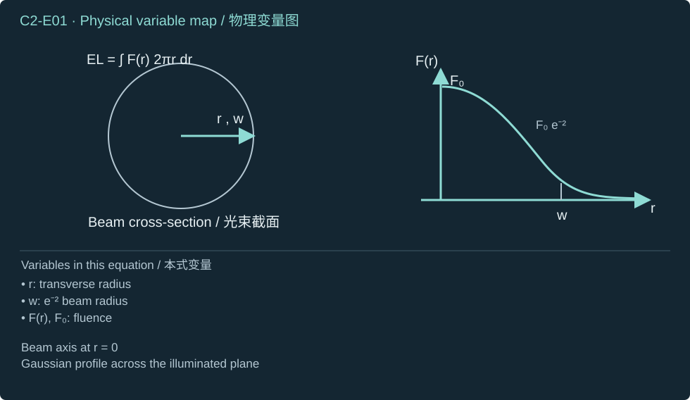

Fluence varies across the beam; the quoted radius fixes its definition.

能量密度沿光束横向变化；所给半径明确其定义。

**Step 2 — integrate over the illuminated plane.** Annuli have area $2\pi r\,dr$. Set the dimensionless integration variable $x=2r^2/w^2$, so $dx=4r\,dr/w^2$ and both limits remain zero and infinity. The positive exponential is integrable; the upper endpoint vanishes.

**步骤 2——在照射平面上积分。** 环带面积为 $2\pi r\,dr$。令无量纲积分变量 $x=2r^2/w^2$，于是 $dx=4r\,dr/w^2$，上下限仍为零与无穷。正的指数函数可积，且上端点项趋于零。

**Symbols before Eq. (C2-E02).**

**式（C2-E02）前的符号定义。**

| First individual definition / 第一项单独定义 | Second individual definition / 第二项单独定义 |
| --- | --- |
| $E_L$ is total incident pulse energy (J) $E_L$ 为总入射脉冲能量（J） | $F_0$ is on-axis fluence (J m⁻²) $F_0$ 为轴上能量密度（J m⁻²） |
| $w>0$ — Transverse Gaussian beam radius at the e⁻² level (m) $w>0$ — 横向高斯光束 e⁻² 半径（m） | $r\ge0$ — Transverse distance from the laser-beam axis (m) $r\ge0$ — 到激光光束轴线的横向距离（m） |
| $x=2r^2/w^2$ is a dimensionless substitution variable $x=2r^2/w^2$ 为无量纲换元变量 | $\pi$ is the circular constant (dimensionless) $\pi$ 为圆周率（无量纲） |

**Conventions and conditions.** $e^x$ is the exponential; $\int$ and brackets denote integration and endpoint evaluation.

**约定与条件。** $e^x$ 为指数函数；$\int$ 与方括号表示积分及端点求值。

(C2-E02) · Exact integral of the prescribed profile

$$
\begin{aligned}E_L&=2\pi F_0\int_0^\infty r e^{-2r^2/w^2}\,dr\\&=\frac{\pi w^2F_0}{2}\int_0^\infty e^{-x}\,dx\\&=\frac{\pi w^2F_0}{2}[-e^{-x}]_0^\infty=\frac{\pi w^2F_0}{2}.\end{aligned}
$$

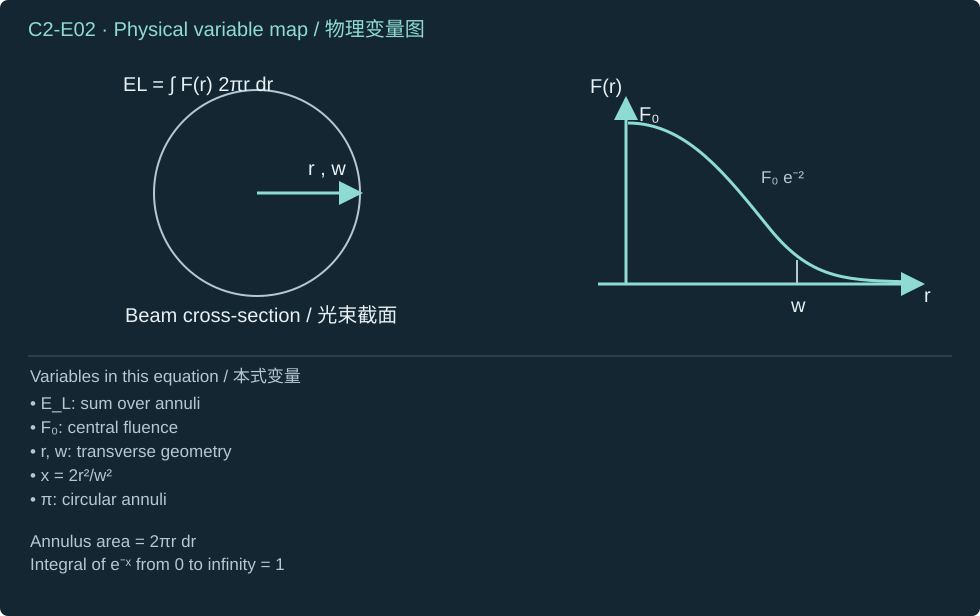

The Gaussian energy follows from summing annular contributions.

高斯光束能量来自环带贡献之和。

**Step 3 — calculate interception rather than assuming all light hits the actuator.** For a centered circular absorber aperture of radius $b_a$ (m), terminate the same integral at that radius and divide by total beam energy. An off-axis droplet or irregular layer needs its actual area integral.

**步骤 3——计算截获比例，不假定全部光能照到驱动器。** 对半径为 $b_a$（m）的同轴圆形吸收体窗口，将同一积分截断于该半径，再除以光束总能量。偏轴液滴或不规则层需要对其实际面积积分。

**Symbols before Eq. (C2-E03).**

**式（C2-E03）前的符号定义。**

| First individual definition / 第一项单独定义 | Second individual definition / 第二项单独定义 |
| --- | --- |
| $f_{\mathrm{geo}}$ is intercepted energy fraction (dimensionless), with label geo meaning geometry $f_{\mathrm{geo}}$ 为截获能量比例（无量纲），geo 下标表示几何 | $b_a\ge0$ is centered absorber-aperture radius (m) $b_a\ge0$ 为同轴吸收体窗口半径（m） |
| $F(r)$ is Gaussian fluence (J m⁻²) $F(r)$ 为高斯能量密度（J m⁻²） | $r$ is transverse integration distance (m) $r$ 为横向积分距离（m） |
| $E_L>0$ is total pulse energy (J) $E_L>0$ 为总脉冲能量（J） | $w>0$ is beam radius (m) $w>0$ 为光束半径（m） |
| $\pi$ is the circular constant (dimensionless) $\pi$ 为圆周率（无量纲） |  |

**Conventions and conditions.** $\exp$ and $\int$ denote exponential and integration.

**约定与条件。** $\exp$ 和 $\int$ 表示指数函数与积分。

(C2-E03) · Derived interception fraction

$$
f_{\mathrm{geo}}=\frac{\int_0^{b_a}F(r)2\pi r\,dr}{E_L}=1-\exp(-2b_a^2/w^2),\qquad 0\le f_{\mathrm{geo}}\le1
$$

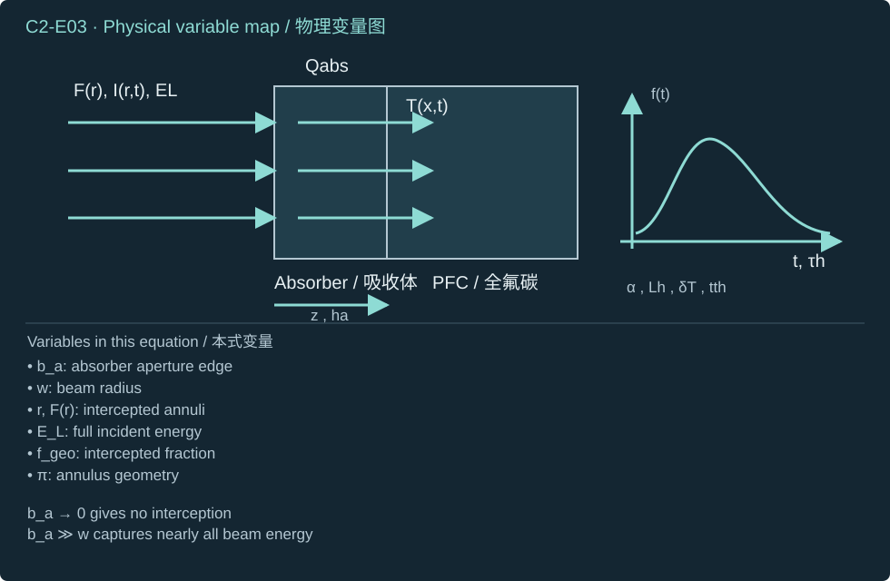

The aperture removes the outer annuli from the useful incident energy.

窗口使外侧环带不再计入有用入射能量。

**Step 4 — restore time.** Normalize the temporal pulse shape so that its integral is one. A rectangular pulse has a shape equal to the reciprocal pulse duration while the pulse is on. Thus a shorter pulse raises irradiance at the same fluence; it does not increase incident energy.

**步骤 4——恢复时间变量。** 将时间脉冲形状归一化，使其积分为一。矩形脉冲在开启时的形状值等于脉冲时长的倒数。因此，在能量密度相同时，缩短脉冲会提高辐照度，却不会提高入射能量。

**Symbols before Eq. (C2-E04).**

**式（C2-E04）前的符号定义。**

| First individual definition / 第一项单独定义 | Second individual definition / 第二项单独定义 |
| --- | --- |
| $f(t)\ge0$ is normalized pulse shape (s⁻¹) $f(t)\ge0$ 为归一化脉冲形状（s⁻¹） | $t$ is time (s) $t$ 为时间（s） |
| $I(r,t)$ is irradiance (W m⁻²) $I(r,t)$ 为辐照度（W m⁻²） | $F(r)$ — Local laser fluence (J m⁻²) $F(r)$ — 局部激光能量面密度（J m⁻²） |
| $F_0$ — On-axis laser fluence (J m⁻²) $F_0$ — 轴上激光能量面密度（J m⁻²） | $r$ is transverse distance (m) $r$ 为横向距离（m） |
| $I_{\mathrm{peak}}$ is central peak irradiance (W m⁻²) $I_{\mathrm{peak}}$ 为中心峰值辐照度（W m⁻²） | $\tau_L>0$ is rectangular laser-pulse duration (s), with L naming laser $\tau_L>0$ 为矩形激光脉冲时长（s），L 表示激光 |

**Conventions and conditions.** $\int$ is time integration.

**约定与条件。** $\int$ 为时间积分。

(C2-E04) · Temporal profile definition

$$
\int_{-\infty}^{\infty} f(t)\,dt=1,\qquad I(r,t)=F(r)f(t),\qquad I_{\mathrm{peak}}=F_0/\tau_L\quad\text{(rectangular pulse)}
$$

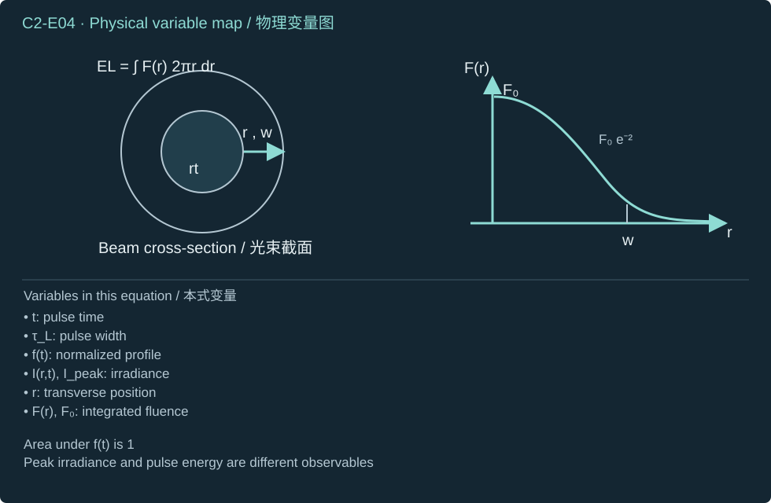

A pulse waveform specifies when the energy is deposited.

脉冲波形规定能量何时沉积。

**Step 5 — solve absorption-only transport.** Conservation of beam power in a thin slab says that the decrement of irradiance equals deposited heat per unit volume times thickness. With constant positive absorption coefficient, separate the irradiance differential, integrate from the entry face to depth, and exponentiate. The optical transit is treated as instantaneous on the thermal timescale.

**步骤 5——求解仅有吸收的光传输。** 薄层内光功率守恒说明，辐照度减少量等于单位体积沉积热量乘以厚度。取正常数吸收系数，分离辐照度微分，从入口面到指定深度积分，再取指数。在热学时间尺度上将光传播视为瞬时。

**Symbols before Eq. (C2-E05).**

**式（C2-E05）前的符号定义。**

| First individual definition / 第一项单独定义 | Second individual definition / 第二项单独定义 |
| --- | --- |
| $z\ge0$ is absorber depth (m) $z\ge0$ 为吸收体深度（m） | $I(z)>0$ — Irradiance inside the absorber (W m⁻²) $I(z)>0$ — 吸收体内部辐照度（W m⁻²） |
| $I_{\mathrm{in}}>0$ — Irradiance entering the absorber (W m⁻²) $I_{\mathrm{in}}>0$ — 进入吸收体的辐照度（W m⁻²） | $\mu_a>0$ is constant absorption coefficient (m⁻¹), with a labeling absorption $\mu_a>0$ 为常数吸收系数（m⁻¹），a 表示吸收 |
| $Q_{\mathrm{abs}}$ is volumetric optical heat deposition (W m⁻³) $Q_{\mathrm{abs}}$ 为光学体积生热率（W m⁻³） | $I^{\prime}$ — Dummy irradiance integration variable (W m⁻²) $I^{\prime}$ — 辐照度积分哑变量（W m⁻²） |
| $z^{\prime}$ — Dummy depth integration coordinate (m) $z^{\prime}$ — 深度积分哑坐标（m） | $I$ — Laser irradiance (W m⁻²) $I$ — 激光辐照度（W m⁻²） |

**Conventions and conditions.** $\partial_z$ denotes differentiation in depth; $z$; $\int$ denotes integration; $e^x$ denotes the exponential; Zero input gives identically zero deposition without dividing by irradiance.

**约定与条件。** $\partial_z$ 表示对深度求导；$z$ 相同；$\int$ 表示积分；$e^x$ 表示指数函数；零输入时沉积恒为零，无须除以辐照度。

(C2-E05) · Beer–Lambert constitutive model and solution

$$
\begin{aligned}\partial_z I&=-\mu_a I,& Q_{\mathrm{abs}}&=\mu_a I,\\ \int_{I_{\mathrm{in}}}^{I(z)}\frac{dI^{\prime}}{I^{\prime}}&=-\int_0^z\mu_a\,dz^{\prime},&I(z)&=I_{\mathrm{in}}e^{-\mu_a z}.\end{aligned}
$$

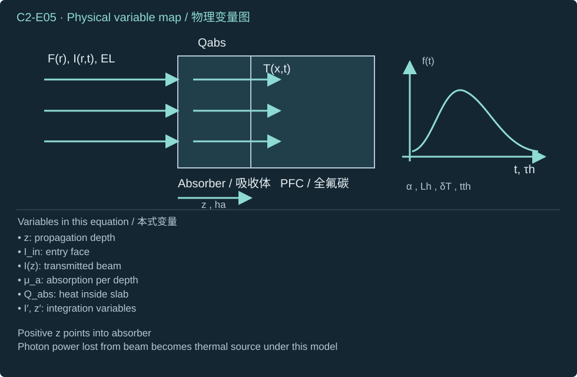

The absorber deposits heat over a finite optical depth.

吸收体在有限光学深度内沉积热量。

**Step 6 — integrate deposited heat.** Integrating in depth turns the volumetric source back into absorbed power per area. Integrating the normalized pulse and then the intercepted area gives the total energy. With one front-face reflected fraction, multiply the fraction entering the slab once. The effective absorptance below already includes this reflection; it must not be multiplied by a second reflection correction.

**步骤 6——积分沉积热量。** 对深度积分，将体积热源变回单位面积吸收功率；再对归一化脉冲和截获面积积分，得到总能量。若存在一个前表面反射比例，将进入薄层的比例乘入一次。下式的有效吸收率已包含该反射，不能再次乘上反射修正。

**Symbols before Eq. (C2-E06).**

**式（C2-E06）前的符号定义。**

| First individual definition / 第一项单独定义 | Second individual definition / 第二项单独定义 |
| --- | --- |
| $h_a>0$ is uniform absorber thickness (m) $h_a>0$ 为均匀吸收体厚度（m） | $z$ is depth (m) $z$ 为深度（m） |
| $Q_{\mathrm{abs}}$ is volumetric heat source (W m⁻³) $Q_{\mathrm{abs}}$ 为体积热源（W m⁻³） | $I_{\mathrm{in}}$ is irradiance entering the slab (W m⁻²) $I_{\mathrm{in}}$ 为进入薄层的辐照度（W m⁻²） |
| $\mu_a$ is absorption coefficient (m⁻¹) $\mu_a$ 为吸收系数（m⁻¹） | $\mathcal R_\lambda\in[0,1]$ — Front-face reflected energy fraction (dimensionless) $\mathcal R_\lambda\in[0,1]$ — 前表面反射能量比例（无量纲） |
| $A_\lambda$ is effective incident-light absorptance (dimensionless) $A_\lambda$ 为相对于入射光的有效吸收率（无量纲） | $f_{\mathrm{geo}}$ is intercepted fraction (dimensionless) $f_{\mathrm{geo}}$ 为截获比例（无量纲） |
| $E_L$ — Incident laser-pulse energy (J) $E_L$ — 入射激光脉冲能量（J） | $E_{\mathrm{abs}}$ — Absorbed optical energy (J) $E_{\mathrm{abs}}$ — 吸收光能（J） |
| $\Omega_a$ is absorbing volume (m³) $\Omega_a$ 为吸收体体积（m³） | $dV$ its volume element (m³) $dV$ 为其体积元（m³） |
| $t$ — Time (s) $t$ — 时间（s） | $dt$ — Time integration element (s) $dt$ — 时间积分微元（s） |
| $\lambda$ — Laser wavelength (m) $\lambda$ — 激光波长（m） |  |

**Conventions and conditions.** $\int$ is integration; $e^x$ is the exponential.

**约定与条件。** $\int$ 为积分；$e^x$ 为指数函数。

(C2-E06) · Derived optical-energy balance

$$
\begin{aligned}\int_0^{h_a}Q_{\mathrm{abs}}\,dz&=I_{\mathrm{in}}(1-e^{-\mu_a h_a}),\\ A_\lambda&=(1-\mathcal R_\lambda)(1-e^{-\mu_a h_a}),\\ E_{\mathrm{abs}}&=f_{\mathrm{geo}}A_\lambda E_L=\int\!\int_{\Omega_a}Q_{\mathrm{abs}}\,dV\,dt.\end{aligned}
$$

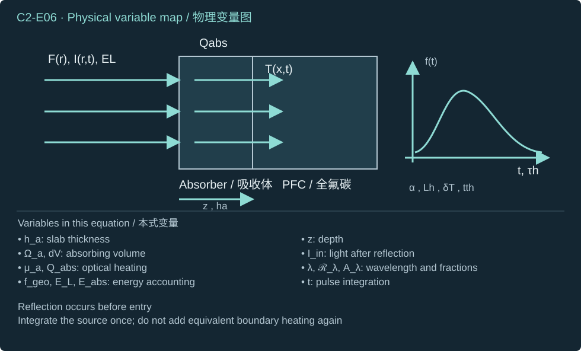

Interception, reflection, and internal absorption each act once.

截获、反射与内部吸收各作用一次。

Checks are physical: absorptance tends to zero as optical thickness tends to zero, and tends to the entering fraction for an optically thick layer. $Q_{\mathrm{abs}}$ has units W m⁻³ because absorption coefficient multiplies W m⁻². Its volume–time integral has units J. The model fails when scattering, multiple reflections, saturation, or plasma formation matters. A boundary heat source may replace the resolved layer if it represents the same energy; adding both counts that energy twice.

物理检验如下：光学厚度趋于零时吸收率趋于零；薄层光学足够厚时，吸收率趋于进入薄层的比例。吸收系数乘以 W m⁻²，使 $Q_{\mathrm{abs}}$ 的单位为 W m⁻³；其体积–时间积分的单位为 J。散射、多次反射、饱和或等离子体形成重要时，该模型失效。若边界热源代表相同能量，可以替代解析薄层；同时添加两者会重复计能。

Optical activation has been observed in specified absorber-containing PFC formulations. Strohm et al. used PbS-loaded PFP and a 1064 nm laser; Wei et al. used gold-containing PFH nanoemulsion. These primary studies establish optical routes, not a universal optical threshold, a liquid-jet speed, or a transfer yield. Absorber position and formulation remain experimental inputs. [[R6]](../reference/sources.html#r6) [[R7]](../reference/sources.html#r7)

在明确的含吸收体 PFC 配方中，已观测到光激活。Strohm 等使用含 PbS 的 PFP 与 1064 nm 激光；Wei 等使用含金颗粒的 PFH 纳米乳液。这些原始研究确立了光学激活途径，却没有提供普适光阈值、液体射流速度或转印成功率。吸收体位置和配方仍是实验输入。[[R6]](../reference/sources.html#r6) [[R7]](../reference/sources.html#r7)

## 2.2 Heat must reach the core on the event timescale

## 2.2 热量必须在事件时间尺度内到达核心

**Step 7 — apply thermal-energy conservation.** Before phase change, a material parcel gains sensible enthalpy through conduction and optical deposition. In a nearly incompressible phase with constant properties, negligible viscous heating and negligible pressure-work, use heat capacity at nearly constant pressure. Moving fluid contributes material advection; a solid absorber uses zero velocity. The divergence term is heat influx because conductive flux points down the temperature gradient.

**步骤 7——应用热能守恒。** 相变前，物质微团通过传导与光沉积获得显热焓。对于性质为常数、黏性生热及压力功可忽略的近不可压缩相，使用近恒压比热容。流动液体产生物质对流项；固体吸收层的速度取零。传导热流指向温度下降方向，因此散度项表示热量流入。

**Symbols before Eq. (C2-E07).**

**式（C2-E07）前的符号定义。**

| First individual definition / 第一项单独定义 | Second individual definition / 第二项单独定义 |
| --- | --- |
| $\boldsymbol q$ is conductive heat flux (W m⁻²) $\boldsymbol q$ 为传导热通量（W m⁻²） | $k>0$ is thermal conductivity (W m⁻¹ K⁻¹) $k>0$ 为导热系数（W m⁻¹ K⁻¹） |
| $T$ is temperature (K) $T$ 为温度（K） | $\rho>0$ is phase density (kg m⁻³) $\rho>0$ 为该相密度（kg m⁻³） |
| $c_p>0$ is constant specific heat capacity (J kg⁻¹ K⁻¹) $c_p>0$ 为常数比热容（J kg⁻¹ K⁻¹） | $t$ is time (s) $t$ 为时间（s） |
| $\boldsymbol u$ is material velocity (m s⁻¹) $\boldsymbol u$ 为物质速度（m s⁻¹） | $Q_{\mathrm{abs}}$ is optical heating (W m⁻³) $Q_{\mathrm{abs}}$ 为光生热率（W m⁻³） |

**Conventions and conditions.** $D/Dt$ is the material derivative; $\partial_t$ is the fixed-position time derivative; $\nabla$ and $\nabla\cdot$ are spatial gradient and divergence (m⁻¹); the centered dot here is a vector contraction, not punctuation.

**约定与条件。** $D/Dt$ 为物质导数；$\partial_t$ 为固定位置时间导数；$\nabla$ 与 $\nabla\cdot$ 为空间梯度和散度（m⁻¹）；式中的中心点表示向量缩并，不是标点。

(C2-E07) · Reduced heat equation and Fourier constitutive law

$$
\boldsymbol q=-k\nabla T,\qquad \rho c_p\frac{DT}{Dt}=\rho c_p(\partial_tT+\boldsymbol u\cdot\nabla T)=-\nabla\cdot\boldsymbol q+Q_{\mathrm{abs}}=\nabla\cdot(k\nabla T)+Q_{\mathrm{abs}}
$$

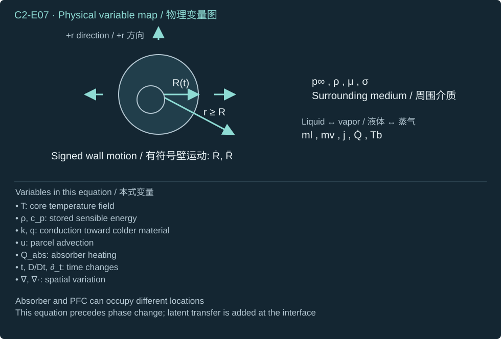

Heating the absorber and heating the PFC are separate parts of the thermal path.

加热吸收体与加热 PFC 是热路径中的不同环节。

**Step 8 — close material contacts.** At an absorber–core contact, take the normal from material A into material B. Positive normal heat flux travels from A to B. With no interfacial thermal storage, the flux is continuous; a nonnegative contact resistance permits a temperature jump. A zero resistance gives continuous temperature. This contact is not the liquid–vapor Stefan interface below.

**步骤 8——闭合材料接触条件。** 在吸收体–核心接触面，将法向从材料 A 指向材料 B。正法向热通量从 A 流向 B。无界面热储存时，热通量连续；非负接触热阻允许温度跳跃。热阻为零时温度连续。该接触面不同于后文的液–汽 Stefan 界面。

**Symbols before Eq. (C2-E08).**

**式（C2-E08）前的符号定义。**

| First individual definition / 第一项单独定义 | Second individual definition / 第二项单独定义 |
| --- | --- |
| $q_n$ is signed normal heat flux (W m⁻²) $q_n$ 为带符号法向热通量（W m⁻²） | $\boldsymbol q_A$ — Conductive heat flux in material A (W m⁻²) $\boldsymbol q_A$ — 材料 A 中的传导热通量（W m⁻²） |
| $\boldsymbol q_B$ — Conductive heat flux in material B (W m⁻²) $\boldsymbol q_B$ — 材料 B 中的传导热通量（W m⁻²） | $\boldsymbol n_{AB}$ is unit normal from A into B (dimensionless) $\boldsymbol n_{AB}$ 为从 A 指向 B 的单位法向（无量纲） |
| $T_A$ — Temperature on contact side A (K) $T_A$ — 接触面 A 侧温度（K） | $T_B$ — Temperature on contact side B (K) $T_B$ — 接触面 B 侧温度（K） |
| $\mathcal R_T\ge0$ is area-specific thermal contact resistance (m² K W⁻¹) $\mathcal R_T\ge0$ 为单位面积热接触阻力（m² K W⁻¹） |  |

**Conventions and conditions.** $\cdot$ denotes a vector dot product.

**约定与条件。** $\cdot$ 表示向量点积。

(C2-E08) · Thermal-contact boundary conditions

$$
q_n=\boldsymbol q_A\cdot\boldsymbol n_{AB}=\boldsymbol q_B\cdot\boldsymbol n_{AB},\qquad T_A-T_B=\mathcal R_T q_n
$$

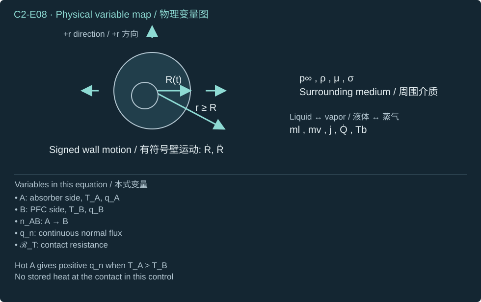

Contact resistance delays heat transfer even after the light has been absorbed.

即使光已被吸收，接触热阻仍会延迟热传递。

**Step 9 — derive diffusion scales.** In a motionless constant-property region, divide the heat equation by volumetric heat capacity. Substitute a temperature change over time and a second spatial derivative over heating distance. Equating those orders gives a diffusion time; solving it for distance gives penetration during a specified heating duration. These are scaling estimates, not a sharp thermal-front solution. The heating duration can include post-pulse conduction and need not equal the optical pulse width.

**步骤 9——推导扩散尺度。** 在静止、常性质区域，将热方程除以体积热容。分别用时间内温度变化和加热距离上的二阶空间导数估计项量级。平衡这些量级得到扩散时间；反解距离得到指定加热时长内的渗透尺度。这是尺度估计，不是具有锐利热前沿的精确解。加热时长可包括脉冲后的传导，不必等于光脉冲宽度。

**Symbols before Eq. (C2-E09).**

**式（C2-E09）前的符号定义。**

| First individual definition / 第一项单独定义 | Second individual definition / 第二项单独定义 |
| --- | --- |
| $\alpha>0$ is thermal diffusivity (m² s⁻¹) $\alpha>0$ 为热扩散率（m² s⁻¹） | $k$ — Thermal conductivity (W m⁻¹ K⁻¹) $k$ — 导热系数（W m⁻¹ K⁻¹） |
| $\rho$ — Local material mass density (kg m⁻³) $\rho$ — 局部材料质量密度（kg m⁻³） | $c_p$ — Specific heat capacity at constant pressure (J kg⁻¹ K⁻¹) $c_p$ — 定压比热容（J kg⁻¹ K⁻¹） |
| $\Delta T\ne0$ is characteristic temperature change (K) $\Delta T\ne0$ 为特征温度变化（K） | $L_h>0$ is heating distance (m) $L_h>0$ 为加热距离（m） |
| $t_{\mathrm{th}}$ is diffusion time estimate (s) $t_{\mathrm{th}}$ 为扩散时间估计（s） | $\tau_h>0$ is available heating duration (s) $\tau_h>0$ 为可用加热时长（s） |
| $\delta_T$ is penetration estimate (m) $\delta_T$ 为渗透深度估计（m） |  |

**Conventions and conditions.** $\sim$ means order-of-magnitude scaling, not equality.

**约定与条件。** $\sim$ 表示量级尺度关系，不表示严格相等。

(C2-E09) · Diffusive scaling derived from the heat equation

$$
\alpha=\frac{k}{\rho c_p},\qquad \frac{\Delta T}{t_{\mathrm{th}}}\sim\alpha\frac{\Delta T}{L_h^2},\qquad t_{\mathrm{th}}\sim\frac{L_h^2}{\alpha},\qquad \delta_T\sim\sqrt{\alpha\tau_h}
$$

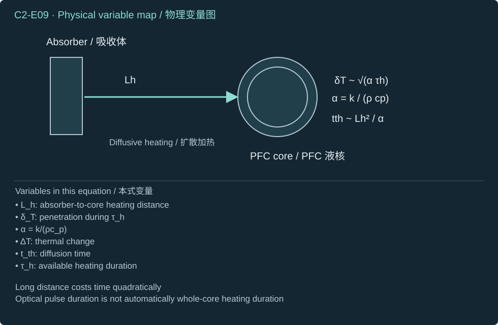

Compare heat penetration with the distance to the PFC, not only with beam width.

应比较热渗透尺度与到达 PFC 的距离，而不只是光束宽度。

**Worked thermal control.** Declare PFP-like teaching coefficients: density 1630 kg m⁻³, heat capacity 654 J kg⁻¹ K⁻¹, and conductivity 0.050 W m⁻¹ K⁻¹. Only the rounded near-293 K heat capacity is tied to the cited NIST datum; the other constants are supplied teaching inputs. Use a 5 μm heating distance and a 10 ns heating duration.

**热学参照计算。** 声明近似 PFP 的教学系数：密度 1630 kg m⁻³、比热容 654 J kg⁻¹ K⁻¹、导热系数 0.050 W m⁻¹ K⁻¹。只有取整的近 293 K 比热容对应所引 NIST 数据；其余常数是给定教学输入。取加热距离为 5 μm，加热时长为 10 ns。

**Symbols before Eq. (C2-E10).**

**式（C2-E10）前的符号定义。**

| First individual definition / 第一项单独定义 | Second individual definition / 第二项单独定义 |
| --- | --- |
| $\alpha_d$ is declared PFC-liquid diffusivity (m² s⁻¹), with d labeling droplet liquid $\alpha_d$ 为所声明 PFC 液体的热扩散率（m² s⁻¹），d 表示液滴液体 | $t_{\mathrm{th}}$ is diffusion-time estimate (s) $t_{\mathrm{th}}$ 为扩散时间估计（s） |
| $\delta_T$ is penetration estimate (m) $\delta_T$ 为渗透深度估计（m） |  |

**Conventions and conditions.** The numerator 0.050 is conductivity in W m⁻¹ K⁻¹; 1630 is density in kg m⁻³; 654 is specific heat in J kg⁻¹ K⁻¹; $5\times10^{-6}$ is distance in m; $10^{-8}$ is duration in s; Powers are numerical exponents, and $\sim$ denotes a scale estimate.

**约定与条件。** 分子 0.050 为导热系数，单位 W m⁻¹ K⁻¹；1630 为密度，单位 kg m⁻³；654 为比热容，单位 J kg⁻¹ K⁻¹；$5\times10^{-6}$ 为距离，单位 m；$10^{-8}$ 为时长，单位 s；幂为数值指数，$\sim$ 表示尺度估计。

(C2-E10) · Declared-input thermal calculation

$$
\begin{aligned}\alpha_d&=\frac{0.050}{1630(654)}=4.69034\times10^{-8}\ \mathrm{m^2\,s^{-1}},\\t_{\mathrm{th}}&\sim\frac{(5\times10^{-6})^2}{4.69034\times10^{-8}}=5.33010\times10^{-4}\ \mathrm{s},\\\delta_T&\sim\sqrt{(4.69034\times10^{-8})(10^{-8})}=2.16572\times10^{-8}\ \mathrm{m}.\end{aligned}
$$

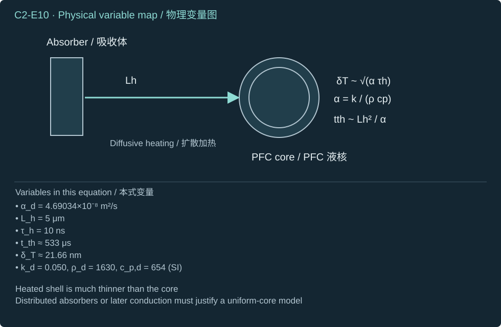

A short pulse does not imply uniform temperature in a micron-scale core.

短脉冲不意味着微米级核心内温度均匀。

The penetration estimate is only 0.00433 of the chosen heating distance. Without distributed heat deposition, the 10 ns pulse cannot justify uniform core temperature. Reducing distance to 100 nm reduces this constant-coefficient diffusion scale to 0.213 μs, still longer than 10 ns. Hotspots, aggregation, and shell contact can matter more than a bulk-average temperature. Optical breakdown is a distinct source mechanism and requires optical conditions and observations that support it; it is not added to a thermal-vaporization model by default.

渗透尺度仅为所选加热距离的 0.00433。若无分布式热沉积，10 ns 脉冲不足以支持核心温度均匀的假设。将距离降为 100 nm，会使该常系数扩散尺度降为 0.213 μs，仍长于 10 ns。热点、聚集及壳层接触可能比体平均温度更重要。光学击穿是不同的源机制，需要相应光学条件及观测支持，不能默认添加到热汽化模型中。

## 2.3 Volatility, confinement, and activation are different

## 2.3 挥发性、约束与激活并不相同

**Step 10 — distinguish initial liquid pressure from ambient pressure.** A spherical PFC–carrier interface carries capillary stress. Add a declared shell-supported excess pressure when the shell has one. This static reference ignores rapid acceleration and shell-rate effects, which need a dynamic constitutive law.

**步骤 10——区分初始液体压力与环境压力。** 球形 PFC–载液界面承受毛细应力；若壳层能承压，还应加上明确的壳层支撑超压。该静态参照忽略快速加速度与壳层速率效应；这些需要动态本构定律。

**Symbols before Eq. (C2-E11).**

**式（C2-E11）前的符号定义。**

| First individual definition / 第一项单独定义 | Second individual definition / 第二项单独定义 |
| --- | --- |
| $p_d$ is initial PFC-liquid pressure (Pa) $p_d$ 为初始 PFC 液体压力（Pa） | $p_c$ carrier pressure (Pa) $p_c$ 为载液压力（Pa） |
| $a>0$ is PFC-core radius (m) $a>0$ 为 PFC 核心半径（m） | $\sigma_{pc}\ge0$ is PFC–carrier interfacial tension (N m⁻¹), with pc naming those phases $\sigma_{pc}\ge0$ 为 PFC–载液界面张力（N m⁻¹），pc 表示这两个相 |
| $\Pi_{\mathrm{shell}}$ is shell-supported excess pressure (Pa) $\Pi_{\mathrm{shell}}$ 为壳层支撑超压（Pa） |  |

**Conventions and conditions.** $\simeq$ is the static spherical approximation; The numerical interfacial tension 0.020 is a teaching input in N m⁻¹, the radii are in m, and 1 kPa = 1000 Pa.

**约定与条件。** $\simeq$ 表示静态球形近似；数值界面张力 0.020 是教学输入，单位 N m⁻¹；半径单位为 m；1 kPa = 1000 Pa。

(C2-E11) · Static capillary and shell-pressure control

$$
p_d\simeq p_c+\frac{2\sigma_{pc}}{a}+\Pi_{\mathrm{shell}},\qquad \frac{2(0.020)}{5\times10^{-6}}=8.00\ \mathrm{kPa},\qquad\frac{2(0.020)}{10^{-7}}=400\ \mathrm{kPa}
$$

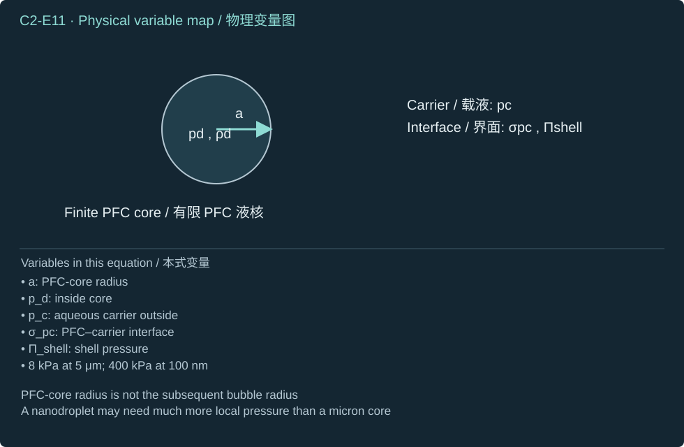

The smaller inclusion has a larger capillary contribution at the same tension.

界面张力相同时，较小夹杂的毛细压力贡献更大。

Use named compounds rather than a generic “PFC boiling point.” The following NIST entries refer to neat compounds. The displayed boiling ranges are different tabulated datasets, not uncertainty bands for a formulation. Convert molar heat capacity or enthalpy to mass-specific values by dividing by the stated molar mass. [[R8]](../reference/sources.html#r8) [[R9]](../reference/sources.html#r9) [[R15]](../reference/sources.html#r15)

应使用明确化合物，而不是笼统的“PFC 沸点”。下列 NIST 条目指纯化合物。列出的沸点范围来自不同数据集，不是某配方的不确定性区间。摩尔热容或焓除以所给摩尔质量，才得到质量比性质。[[R8]](../reference/sources.html#r8) [[R9]](../reference/sources.html#r9) [[R15]](../reference/sources.html#r15)

| Compound and identity 化合物与身份 | Bulk reference 体相参照 | Proper scope 正确用途 |
| --- | --- | --- |
| PFP: C₅F₁₂; CAS 678-26-2; molar mass 0.2880343 kg mol⁻¹ PFP：C₅F₁₂；CAS 678-26-2；摩尔质量 0.2880343 kg mol⁻¹ | Normal-boiling entries 302.6–303.2 K; liquid heat-capacity datum 188.3 J mol⁻¹ K⁻¹ at 293 K, giving 653.74 J kg⁻¹ K⁻¹. 正常沸点条目 302.6–303.2 K；293 K 液体热容数据为 188.3 J mol⁻¹ K⁻¹，对应 653.74 J kg⁻¹ K⁻¹。 | Compound-specific thermal reference; not a coated-droplet activation law. 特定化合物热学参照；不是包覆液滴激活定律。 |
| PFH: C₆F₁₄; CAS 355-42-0; molar mass 0.3380418 kg mol⁻¹ PFH：C₆F₁₄；CAS 355-42-0；摩尔质量 0.3380418 kg mol⁻¹ | Normal-boiling entries 330.3–333 K; vaporization enthalpy 31.5 kJ mol⁻¹ at 316 K, giving 93.18 kJ kg⁻¹. 正常沸点条目 330.3–333 K；316 K 汽化焓为 31.5 kJ mol⁻¹，对应 93.18 kJ kg⁻¹。 | Retain temperature and dataset; do not transfer this value to every PFC. 保留温度及数据集；不能将此值套用到所有 PFC。 |
| Water: H₂O; molar mass 0.0180153 kg mol⁻¹ 水：H₂O；摩尔质量 0.0180153 kg mol⁻¹ | Normal-boiling compilation approximately 373.17 K. 正常沸点汇编约为 373.17 K。 | PFC-free thermal comparison at matched temperature and pressure. 在相同温度与压力下的不含 PFC 热学参照。 |

**Step 11 — calculate equilibrium vapor pressure within the correlation domain.** NIST tabulates the Barber–Cady Antoine fit for PFP. The logarithm acts on pressure divided by one bar, so its argument is dimensionless. The fit coefficients are empirical, not derived from the optical heating model. [[R8]](../reference/sources.html#r8)

**步骤 11——在关联式适用域内计算平衡蒸汽压。** NIST 列出了 PFP 的 Barber–Cady Antoine 拟合。对压力除以一巴后的比值取对数，故对数自变量无量纲。拟合系数是经验数据，并非由光加热模型推导。[[R8]](../reference/sources.html#r8)

**Symbols before Eq. (C2-E12).**

**式（C2-E12）前的符号定义。**

| First individual definition / 第一项单独定义 | Second individual definition / 第二项单独定义 |
| --- | --- |
| $p_{\mathrm{sat,PFP}}(T)$ is bulk equilibrium PFP vapor pressure (Pa), sat labeling saturation $p_{\mathrm{sat,PFP}}(T)$ 为体相平衡 PFP 蒸汽压（Pa），sat 表示饱和 | $T$ is absolute temperature in the stated range (K) $T$ 为所给范围内的绝对温度（K） |

**Conventions and conditions.** $\log_{10}$ is the base-ten logarithm; One bar equals $10^5$ Pa; Empirical coefficient 4.2063 is dimensionless; 1103.454 K and 39.77 K have temperature units; The denominator is positive throughout the stated domain.

**约定与条件。** $\log_{10}$ 为常用对数；一巴等于 $10^5$ Pa；经验系数 4.2063 无量纲；1103.454 K 和 39.77 K 具有温度单位；所给范围内分母为正。

(C2-E12) · Verified empirical PFP property correlation

$$
\log_{10}\!\left(\frac{p_{\mathrm{sat,PFP}}(T)}{10^5\ \mathrm{Pa}}\right)=4.2063-\frac{1103.454\ \mathrm{K}}{T-39.77\ \mathrm{K}},\qquad282.82\ \mathrm{K}\le T\le337.94\ \mathrm{K}
$$

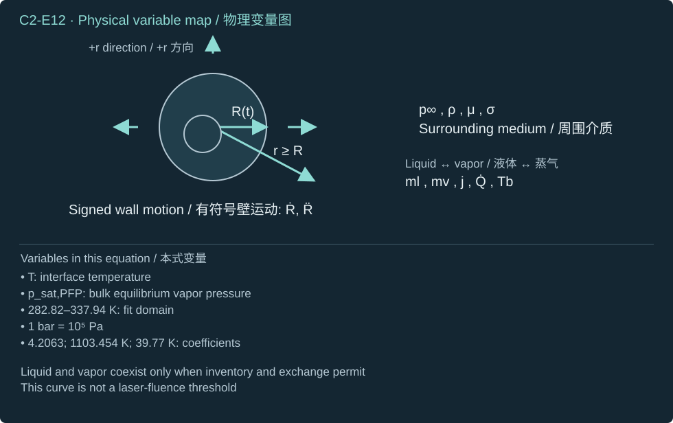

The saturation curve concerns an equilibrium state, not automatic activation.

饱和曲线描述平衡状态，而不是自动激活。

Evaluating Eq. (C2-E12) gives 70.60 kPa at 293 K, 103.35 kPa at 303 K, and 204.33 kPa at 323 K. For water use its stated temperature interval, rather than extrapolating one coefficient set. The NIST water coefficients below produce 2.315 kPa at 293 K and 12.248 kPa at 323 K. These are calculated comparisons, not project measurements. [[R15]](../reference/sources.html#r15)

式（C2-E12）给出 293 K 时 70.60 kPa、303 K 时 103.35 kPa、323 K 时 204.33 kPa。水应使用对应温区的系数，不能外推同一组系数。下列 NIST 水系数给出 293 K 时 2.315 kPa、323 K 时 12.248 kPa。这些是计算对比，不是项目测量。[[R15]](../reference/sources.html#r15)

**Symbols before Eq. (C2-E13).**

**式（C2-E13）前的符号定义。**

| First individual definition / 第一项单独定义 | Second individual definition / 第二项单独定义 |
| --- | --- |
| $p_{\mathrm{sat,w}}$ is bulk equilibrium water vapor pressure (Pa), w labeling water $p_{\mathrm{sat,w}}$ 为体相平衡水蒸汽压（Pa），w 表示水 | $T$ is temperature (K), restricted to either listed interval $T$ 为温度（K），限定在两个所列区间之一 |
| $T/\mathrm K$ is the numerical temperature in kelvin (dimensionless) $T/\mathrm K$ 为以开尔文计的温度数值（无量纲） |  |

**Conventions and conditions.** $\log_{10}$ is the base-ten logarithm of pressure relative to one bar ($10^5$ Pa); The leading coefficients are dimensionless; all coefficients multiplied by K have temperature units; No value is assigned to the 303–304 K gap by these two branches.

**约定与条件。** $\log_{10}$ 为相对于一巴（$10^5$ Pa）的压力比值的常用对数；首项系数无量纲；乘以 K 的系数具有温度单位；这两个分支未给出 303–304 K 间隙的值。

(C2-E13) · Verified empirical water property correlations

$$
\log_{10}\!\left(\frac{p_{\mathrm{sat,w}}(T)}{10^5\ \mathrm{Pa}}\right)=\begin{cases}5.40221-1838.675\ \mathrm{K}/(T-31.737\ \mathrm{K}),&273\le T/\mathrm{K}\le303,\\5.20389-1733.926\ \mathrm{K}/(T-39.485\ \mathrm{K}),&304\le T/\mathrm{K}\le333.\end{cases}
$$

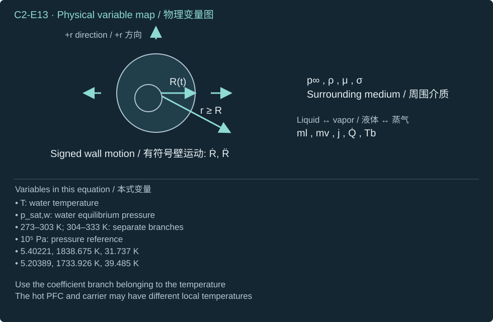

Water provides a matched-temperature reference, not a guaranteed vapor reservoir.

水提供同温参照，却不是有保证的蒸汽库。

At 323 K and 100 kPa carrier pressure, the declared 5 μm shell-free PFP core has initial liquid pressure 108 kPa, below the 204.33 kPa equilibrium PFP reference. The 100 nm core has 500 kPa liquid pressure, above it. Thus the same temperature can provide positive bulk driving for the larger core and no positive driving in this smaller-core control. This conclusion uses the stated constant tension and neglects shell stress; neither temperature is a measured onset threshold.

在 323 K、载液压力 100 kPa 下，所声明的无壳 5 μm PFP 核初始液体压力为 108 kPa，低于 204.33 kPa 的 PFP 平衡参照；100 nm 核的液体压力为 500 kPa，高于该值。因此，同一温度可能对较大核心提供正体相驱动力，却在此较小核心参照中没有正驱动力。此结论使用声明的常界面张力并忽略壳层应力；这两个温度都不是测得的起始阈值。

**Step 12 — construct the capillarity free energy.** Define a vapor nucleus inside the liquid PFC, not a whole-core interface. Under the local isothermal, bulk-reservoir approximation, forming the new interface costs tension times area; replacing liquid by favorable vapor gains driving pressure times volume. The vapor–PFC tension is not the PFC–carrier tension in Eq. (C2-E11).

**步骤 12——构造毛细自由能。** 在液态 PFC 内定义汽核，而非整个核心的外界面。在局部等温、体相库近似下，产生新界面的代价是界面张力乘面积；有利蒸汽替代液体的收益是驱动压差乘体积。蒸汽–PFC 张力不同于式（C2-E11）中的 PFC–载液张力。

**Symbols before Eq. (C2-E14).**

**式（C2-E14）前的符号定义。**

| First individual definition / 第一项单独定义 | Second individual definition / 第二项单独定义 |
| --- | --- |
| $\Delta p_n$ is vapor-nucleation driving pressure (Pa), n labeling nucleation $\Delta p_n$ 为汽化成核驱动压差（Pa），n 表示成核 | $p_{\mathrm{sat,PFC}}(T_i)$ is bulk PFC saturation pressure at local interface temperature $T_i$ (Pa and K) $p_{\mathrm{sat,PFC}}(T_i)$ 为局部界面温度 $T_i$ 下的体相 PFC 饱和蒸汽压（Pa 和 K） |
| $p_d$ is PFC-liquid pressure (Pa) $p_d$ 为 PFC 液体压力（Pa） | $W(r_n)$ is nucleus formation free energy (J) $W(r_n)$ 为汽核形成自由能（J） |
| $r_n\ge0$ is vapor-nucleus radius (m) $r_n\ge0$ 为汽核半径（m） | $\sigma_{vp}>0$ is vapor–PFC tension (N m⁻¹), vp naming the interface $\sigma_{vp}>0$ 为蒸汽–PFC 张力（N m⁻¹），vp 表示该界面 |
| $\pi$ is the circular constant (dimensionless) $\pi$ 为圆周率（无量纲） | $T_i$ — Local phase-interface temperature (K) $T_i$ — 局部相界面温度（K） |

**Conventions and conditions.** The model assumes fixed $T_i,p_d$; $r_n$ small compared with the PFC core.

**约定与条件。** 模型假设 $T_i,p_d$ 固定，且 $r_n$ 远小于 PFC 核心。

(C2-E14) · Classical homogeneous capillarity approximation

$$
\Delta p_n=p_{\mathrm{sat,PFC}}(T_i)-p_d,\qquad W(r_n)=4\pi\sigma_{vp}r_n^2-\frac{4\pi}{3}\Delta p_n r_n^3
$$

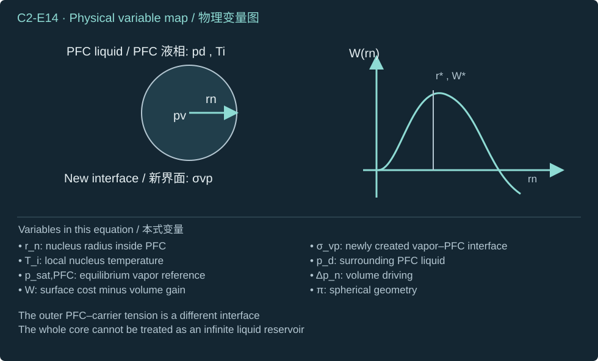

The barrier belongs to creating a new internal vapor interface.

势垒来自生成新的内部蒸汽界面。

**Step 13 — find the stationary point and its branch.** Differentiate the two powers of nucleus radius. For positive driving pressure, the nonzero stationary radius is obtained by dividing the bracket by positive radius and driving pressure. The second derivative there is negative, so it is a barrier maximum. For nonpositive driving pressure, the derivative is positive for every positive radius and there is no positive critical-radius branch in this model.

**步骤 13——求驻点并区分分支。** 对汽核半径的两个幂求导。驱动压差为正时，除以正半径与正压差，可得到非零驻点半径。在该点二阶导数为负，因此是势垒最大值。驱动压差非正时，每个正半径处的导数均为正，在本模型中不存在正临界半径分支。

**Symbols before Eq. (C2-E15).**

**式（C2-E15）前的符号定义。**

| First individual definition / 第一项单独定义 | Second individual definition / 第二项单独定义 |
| --- | --- |
| $W$ is nucleus free energy (J) $W$ 为汽核自由能（J） | $r_n>0$ is nucleus radius (m) $r_n>0$ 为汽核半径（m） |
| $\sigma_{vp}>0$ is vapor–PFC interfacial tension (N m⁻¹) $\sigma_{vp}>0$ 为蒸汽–PFC 界面张力（N m⁻¹） | $\Delta p_n$ is fixed driving pressure (Pa) $\Delta p_n$ 为固定驱动压差（Pa） |
| $r_*$ is the positive critical radius (m), with star labeling the stationary point and requiring $\Delta p_n>0$ $r_*$ 为正临界半径（m），星号标记驻点，且要求 $\Delta p_n>0$ | $\pi$ is the circular constant (dimensionless) $\pi$ 为圆周率（无量纲） |

**Conventions and conditions.** $d/dr_n$ is radius differentiation, $|_{r_*}$ denotes evaluation there; The first derivative has units J m⁻¹ and the second J m⁻².

**约定与条件。** $d/dr_n$ 为对半径求导，$|_{r_*}$ 表示在该点求值；一阶导数单位为 J m⁻¹，二阶导数为 J m⁻²。

(C2-E15) · Derived critical radius and branch check

$$
\begin{aligned}\frac{dW}{dr_n}&=8\pi\sigma_{vp}r_n-4\pi\Delta p_n r_n^2=4\pi r_n(2\sigma_{vp}-\Delta p_n r_n),\\r_*&=2\sigma_{vp}/\Delta p_n\quad(\Delta p_n>0),\\\left.\frac{d^2W}{dr_n^2}\right|_{r_*}&=8\pi\sigma_{vp}-8\pi\Delta p_n r_*=-8\pi\sigma_{vp}<0.\end{aligned}
$$

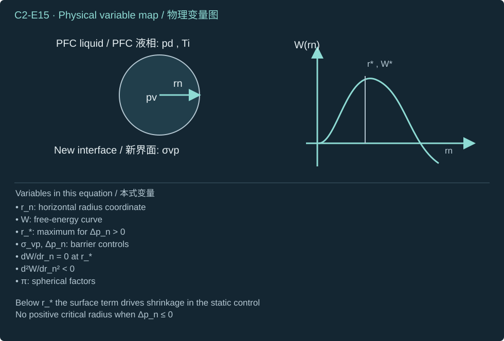

The stationary point is a maximum, not a stable equilibrium nucleus.

该驻点是最大值，不是稳定平衡汽核。

**Step 14 — substitute the critical radius explicitly.** Square and cube the positive radius, then subtract the two coefficients. The barrier falls as driving pressure increases, but remains positive at any finite positive driving pressure and positive tension.

**步骤 14——显式代入临界半径。** 对正半径平方、立方，再将两项系数相减。随驱动压差增加，势垒降低；但对有限正驱动压差及正张力，势垒仍为正。

**Symbols before Eq. (C2-E16).**

**式（C2-E16）前的符号定义。**

| First individual definition / 第一项单独定义 | Second individual definition / 第二项单独定义 |
| --- | --- |
| $W_*=W(r_*)$ is critical-nucleus free-energy barrier (J), with star labeling the critical value $W_*=W(r_*)$ 为临界汽核自由能势垒（J），星号标记临界值 | $\sigma_{vp}>0$ is vapor–PFC interfacial tension (N m⁻¹) $\sigma_{vp}>0$ 为蒸汽–PFC 界面张力（N m⁻¹） |
| $\Delta p_n>0$ is driving pressure (Pa) $\Delta p_n>0$ 为驱动压差（Pa） | $\pi$ is the circular constant (dimensionless) $\pi$ 为圆周率（无量纲） |

**Conventions and conditions.** superscripts 2 and 3 are powers; This result inherits the homogeneous, locally isothermal, small-nucleus assumptions.

**约定与条件。** 上标 2、3 表示幂；该结果继承均匀成核、局部等温及小汽核假设。

(C2-E16) · Derived homogeneous barrier height

$$
\begin{aligned}W_*&=4\pi\sigma_{vp}\frac{4\sigma_{vp}^2}{\Delta p_n^2}-\frac{4\pi}{3}\Delta p_n\frac{8\sigma_{vp}^3}{\Delta p_n^3}\\&=\left(16-\frac{32}{3}\right)\frac{\pi\sigma_{vp}^3}{\Delta p_n^2}=\frac{16\pi\sigma_{vp}^3}{3\Delta p_n^2}.\end{aligned}
$$

Positive superheat driving does not make the nucleation barrier vanish.

正的过热驱动力并不会使成核势垒消失。

The units check is $\mathrm{(N/m)^3/Pa^2=N\,m=J}$. The critical radius scales as tension divided by pressure, hence has units m. If the computed nucleus is comparable to the core radius, the reservoir approximation fails. Absorber surfaces, shell defects, dissolved gas, and wetting can replace homogeneous nucleation by a heterogeneous route. A seed imposed after the pulse defines a post-nucleation calculation; it is not a prediction of onset.

单位检验为 $\mathrm{(N/m)^3/Pa^2=N\,m=J}$。临界半径按张力除以压力缩放，故单位为 m。若计算得到的汽核与核心半径相当，体相库近似失效。吸收体表面、壳层缺陷、溶解气体及润湿可能使均匀成核转为异质成核。脉冲后人为给定的种子仅定义成核后计算，不是起始预测。

**Step 15 — turn a rate into a probability only under a stated stochastic model.** For independent Poisson nucleation events, survival over a small interval loses the expected number of events times its current value. Integrate its logarithmic derivative with initial survival one. The result applies even when the rate varies in space and time; it does not determine that rate. A formulation-specific empirical activation law is preferable when the homogeneous premise is false.

**步骤 15——只有明确随机模型，才能将速率变为概率。** 对独立 Poisson 成核事件，短时间内的未成核概率减少量等于当前值乘以预期事件数。以初始未成核概率为一，积分其对数导数。即使速率随时空变化，该结果仍适用；但它不提供速率本身。均匀成核前提不成立时，更应采用特定配方的经验激活定律。

**Symbols before Eq. (C2-E17).**

**式（C2-E17）前的符号定义。**

| First individual definition / 第一项单独定义 | Second individual definition / 第二项单独定义 |
| --- | --- |
| $J(T,p)\ge0$ is prescribed nucleation rate (m⁻³ s⁻¹) at local temperature $T$ (K) and pressure $p$ (Pa) $J(T,p)\ge0$ 为给定的成核速率（m⁻³ s⁻¹），取决于局部温度 $T$（K）与压力 $p$（Pa） | $V_d(t)$ denotes the remaining liquid-core region and its volume (m³), d labeling droplet $V_d(t)$ 表示剩余液核区域及其体积（m³），d 表示液滴 |
| $\Lambda(t)$ is total event rate (s⁻¹) $\Lambda(t)$ 为总事件速率（s⁻¹） | $S(t)$ is no-event survival probability (dimensionless) $S(t)$ 为未发生事件的概率（无量纲） |
| $P_{\mathrm{act}}$ activation probability (dimensionless) $P_{\mathrm{act}}$ 为激活概率（无量纲） | $t\ge0$ — Time (s) $t\ge0$ — 时间（s） |
| $dV$ is volume element (m³) $dV$ 为体积元（m³） | $T$ — Thermodynamic temperature (K) $T$ — 热力学温度（K） |
| $p$ — Local or prescribed thermodynamic pressure as specified (Pa) $p$ — 按情景指定的局部或给定热力学压力（Pa） |  |

**Conventions and conditions.** $d/dt$, $\int$, $\ln$, and $e^x$ denote differentiation, integration, natural logarithm, and exponential; The derivation assumes finite integrated nonnegative rate and independent Poisson events.

**约定与条件。** $d/dt$、$\int$、$\ln$、$e^x$ 表示求导、积分、自然对数和指数函数；推导要求积分非负速率有限，且事件满足独立 Poisson 模型。

(C2-E17) · Derived probability under a prescribed Poisson rate

$$
\begin{aligned}\Lambda(t)&=\int_{V_d(t)}J(T, p)\,dV,\qquad\frac{dS}{dt}=-\Lambda(t)S,\qquad S(0)=1,\\\ln S(t)&=-\int_0^t\Lambda(t^{\prime})\,dt^{\prime},\qquad P_{\mathrm{act}}(t)=1-S(t)=1-e^{-\int_0^t\int_{V_d(t^{\prime})}J(T,p)\,dV\,dt^{\prime}}.\end{aligned}
$$

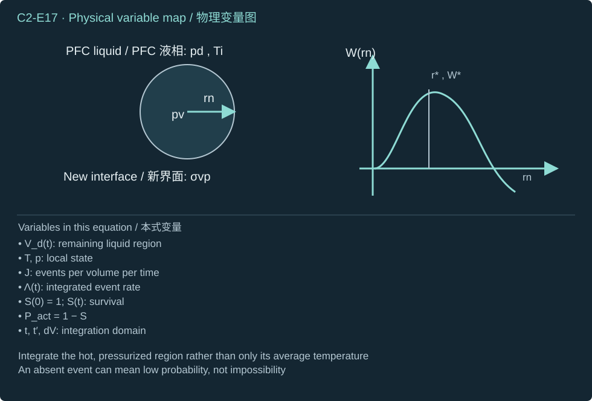

Activation probability requires the rate and the time spent in the activating state.

激活概率需要速率及处于可激活状态的时长。

## 2.4 Close phase mass and energy without an infinite reservoir

## 2.4 用有限库存闭合相质量与能量

**Step 16 — conserve compound inventory.** Initial PFC mass is liquid density times core volume. Later liquid, vapor, dissolved, and escaped PFC exhaust that same initial mass when there is no external supply. Escaped mass is a cumulative ledger, not vapor remaining inside the bubble. The water carrier cannot replenish PFC.

**步骤 16——守恒化合物库存。** 初始 PFC 质量等于液体密度乘以核心体积。无外部供应时，后续液体、蒸汽、溶解及逸出 PFC 的总和就是该初始质量。逸出质量是累计账目，不是气泡内的剩余蒸汽。水性载液不能补充 PFC。

**Symbols before Eq. (C2-E18).**

**式（C2-E18）前的符号定义。**

| First individual definition / 第一项单独定义 | Second individual definition / 第二项单独定义 |
| --- | --- |
| $m_{\mathrm{PFC},0}$ is initial PFC mass (kg), 0 labeling the initial state $m_{\mathrm{PFC},0}$ 为初始 PFC 质量（kg），0 表示初始状态 | $\rho_d>0$ is initial PFC-liquid density (kg m⁻³), d labeling droplet $\rho_d>0$ 为初始 PFC 液体密度（kg m⁻³），d 表示液滴 |
| $a_0>0$ is initial core radius (m) $a_0>0$ 为初始核心半径（m） | $m_l$ — Remaining liquid-PFC mass (kg) $m_l$ — 剩余液态 PFC 质量（kg） |
| $m_v$ — PFC vapor mass (kg) $m_v$ — PFC 蒸气质量（kg） | $m_{\mathrm{diss}}$ — Dissolved PFC mass (kg) $m_{\mathrm{diss}}$ — 溶解 PFC 质量（kg） |
| $m_{\mathrm{esc}}\ge0$ — Cumulative escaped PFC mass (kg) $m_{\mathrm{esc}}\ge0$ — 累计逸出 PFC 质量（kg） | $\pi$ is the circular constant (dimensionless) $\pi$ 为圆周率（无量纲） |

**Conventions and conditions.** the l, v, diss, and esc labels name those compartments; The bound assumes no subsequent PFC supply.

**约定与条件。** l、v、diss、esc 分别标记这些部分；质量上界假设后续没有 PFC 供应。

(C2-E18) · Exact compound-mass ledger under the stated closed supply

$$
m_{\mathrm{PFC},0}=\frac{4\pi}{3}\rho_da_0^3,\qquad m_l+m_v+m_{\mathrm{diss}}+m_{\mathrm{esc}}=m_{\mathrm{PFC},0},\qquad 0\le m_v\le m_{\mathrm{PFC},0}
$$

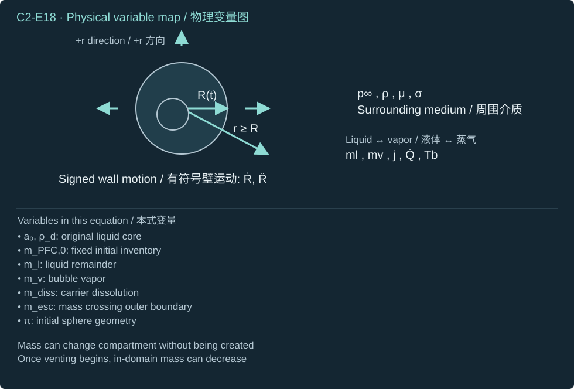

The compound ledger survives expansion, condensation, dissolution, and venting.

化合物账目在膨胀、凝结、溶解及排气过程中均成立。

**Step 17 — locate the actual phase-change surface.** Integrate species flux over the interface that this species contacts. The full spherical area is available only if that species contacts the complete surface and its flux is uniform. A residual PFC inclusion in water may instead provide a much smaller vaporization surface.

**步骤 17——定位实际相变表面。** 应在该组分接触的界面上积分其通量。只有该组分接触整个球面且通量均匀，才可使用全球面积。水中残余 PFC 夹杂可能只提供更小的汽化表面。

**Symbols before Eq. (C2-E19).**

**式（C2-E19）前的符号定义。**

| First individual definition / 第一项单独定义 | Second individual definition / 第二项单独定义 |
| --- | --- |
| $m_{v,s}$ is vapor mass of species $s$ (kg), where $s$ labels a specified species such as PFC or water $m_{v,s}$ 为组分 $s$ 的蒸汽质量（kg） | $j_s$ is signed liquid-to-vapor mass flux (kg m⁻² s⁻¹) $j_s$ 为带符号液到汽质量通量（kg m⁻² s⁻¹） |
| $\Gamma_s$ is the species-contacting interface (—) $\Gamma_s$ 为该组分接触的界面（—） | $dA$ is its area element (m²) $dA$ 为面积元（m²） |
| $R>0$ is spherical interface radius (m) only in the special second formula $R>0$ 仅在第二个特殊式中表示球形界面半径（m） | $\pi$ is the circular constant (dimensionless) $\pi$ 为圆周率（无量纲） |
| $s$ — Species index (dimensionless) $s$ — 组分指标（无量纲） |  |

**Conventions and conditions.** a dot is a time derivative (kg s⁻¹); the phase label isolates the phase-change contribution, excluding escape and dissolution; $\int$ is surface integration.

**约定与条件。** 上点表示时间导数（kg s⁻¹）；phase 标记单独的相变贡献，不含逸出与溶解；$\int$ 为面积积分。

(C2-E19) · Species phase-mass balance

$$
\left.\dot m_{v,s}\right|_{\mathrm{phase}}=\int_{\Gamma_s}j_s\,dA,\qquad \left.\dot m_{v,s}\right|_{\mathrm{phase}}=4\pi R^2j_s\quad\text{only for uniform complete spherical contact}
$$

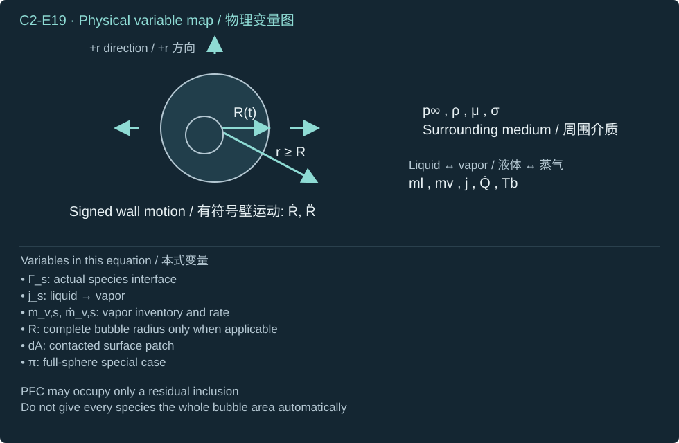

A bubble surface and a PFC evaporation surface need not be identical.

气泡表面与 PFC 蒸发表面未必相同。

**Step 18 — derive the phase-change velocity slip.** At a single-component interface, fluid crosses the moving interface at the same mass flux on each side. In a bubble, the liquid-to-vapor normal is inward. Taking its dot product with radial liquid velocity minus interface velocity gives radius speed minus liquid speed. Solve that signed equality for the liquid speed. A velocity potential using interface speed as liquid speed inherits the small-slip approximation.

**步骤 18——推导相变速度滑移。** 单组分界面两侧，流体穿过运动界面的质量通量相同。对气泡，液到汽法向指向内侧；径向液速减去界面速度，再与该法向点乘，得到半径速度减液体速度。解这个带符号等式得到液速。若速度势将界面速度当作液速，就继承了小滑移近似。

**Symbols before Eq. (C2-E20).**

**式（C2-E20）前的符号定义。**

| First individual definition / 第一项单独定义 | Second individual definition / 第二项单独定义 |
| --- | --- |
| $j_s$ is single-component phase mass flux (kg m⁻² s⁻¹), s labeling that component $j_s$ 为单组分相变质量通量（kg m⁻² s⁻¹），s 标记该组分 | $\rho_l$ — Adjacent liquid density (kg m⁻³) $\rho_l$ — 邻接液体密度（kg m⁻³） |
| $\rho_v>0$ — Adjacent vapor density (kg m⁻³) $\rho_v>0$ — 邻接蒸气密度（kg m⁻³） | $\boldsymbol u_l$ — Adjacent liquid velocity (m s⁻¹) $\boldsymbol u_l$ — 邻接液体速度（m s⁻¹） |
| $\boldsymbol u_v$ — Adjacent vapor velocity (m s⁻¹) $\boldsymbol u_v$ — 邻接蒸气速度（m s⁻¹） | $\boldsymbol v_\Gamma$ is interface velocity (m s⁻¹) $\boldsymbol v_\Gamma$ 为界面速度（m s⁻¹） |
| $\boldsymbol n$ is unit normal liquid→vapor (dimensionless) $\boldsymbol n$ 为液→汽单位法向（无量纲） | $\boldsymbol e_r$ outward radial unit vector (dimensionless) $\boldsymbol e_r$ 为向外径向单位向量（无量纲） |
| $R>0$ is bubble radius (m) $R>0$ 为气泡半径（m） | $\dot R$ its time derivative (m s⁻¹) $\dot R$ 为其时间导数（m s⁻¹） |
| $u_l(R)$ is outward radial liquid velocity at the interface (m s⁻¹) $u_l(R)$ 为界面处向外径向液速（m s⁻¹） |  |

**Conventions and conditions.** $\cdot$ is a vector dot product.

**约定与条件。** $\cdot$ 为向量点积。

(C2-E20) · Exact single-component interface mass jump

$$
\begin{aligned}j_s&=\rho_l(\boldsymbol u_l-\boldsymbol v_\Gamma)\cdot\boldsymbol n=\rho_v(\boldsymbol u_v-\boldsymbol v_\Gamma)\cdot\boldsymbol n,\\\boldsymbol n&=-\boldsymbol e_r,\quad\boldsymbol v_\Gamma=\dot R\boldsymbol e_r,\quad j_s=\rho_l[\dot R-u_l(R)],\\u_l(R)&=\dot R-j_s/\rho_l.\end{aligned}
$$

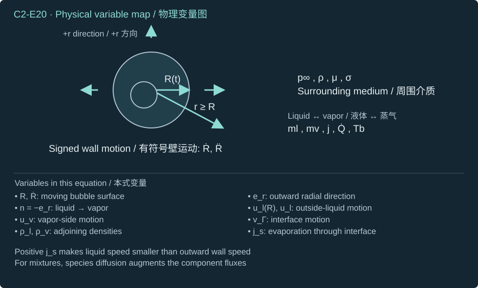

The interface need not move at the same speed as the adjacent liquid.

界面不必以邻接液体的速度运动。

The phase-slip approximation requires $|j_s|/\rho_l$ small relative to the relevant liquid or interface velocity scale. At a turning point, division by zero radius speed cannot be a useful criterion; choose a finite event velocity scale and check absolute slip. Strong evaporation can also contribute recoil stress through the momentum jump. Reusing Chapter 1’s simple spherical stress relation requires that recoil be negligible or explicitly added. Mixtures require species diffusion and composition boundary conditions, not the pure-component jump applied independently without a common mass balance.

相变滑移近似要求 $|j_s|/\rho_l$ 相对于相关液体或界面速度尺度足够小。在转折点，除以零半径速度不能形成有效判据；应选有限事件速度尺度并检查绝对滑移。强蒸发还可通过动量跳跃产生反冲应力。复用第一章的简单球形应力关系，要求反冲可忽略或显式补入。混合物需要组分扩散与组成边界条件，不能无共同质量守恒而对每个组分独立套用纯组分跳跃式。

**Step 19 — derive the Stefan sign from interfacial energy conservation.** With no surface heat storage and negligible kinetic and mechanical jump corrections, conductive heat arriving from the liquid, minus that leaving toward vapor, pays the enthalpy needed to change phase. The enthalpy difference uses the same temperature and reference convention on both sides. Reverse the heat supply and flux becomes negative: condensation releases latent enthalpy.

**步骤 19——由界面能量守恒确定 Stefan 符号。** 无表面热储存、且动能及力学跳跃修正可忽略时，从液体到达的传导热减去流向蒸汽的热，为相变所需焓提供能量。焓差在两侧采用相同温度与参考约定。热供应反向时，通量为负：凝结释放潜焓。

**Symbols before Eq. (C2-E21).**

**式（C2-E21）前的符号定义。**

| First individual definition / 第一项单独定义 | Second individual definition / 第二项单独定义 |
| --- | --- |
| $L_{v,s}>0$ is latent enthalpy per species mass (J kg⁻¹) $L_{v,s}>0$ 为单位组分质量的潜焓（J kg⁻¹） | $h_{v,s}$ — Specific vapor enthalpy of species s at the actual boundary state (J kg⁻¹) $h_{v,s}$ — 实际边界状态下组分 s 的蒸气比焓（J kg⁻¹） |
| $h_{l,s}$ — Specific liquid enthalpy of species s at the interface (J kg⁻¹) $h_{l,s}$ — 界面处组分 s 的液体比焓（J kg⁻¹） | $j_s$ is signed evaporation flux (kg m⁻² s⁻¹) $j_s$ 为带符号蒸发通量（kg m⁻² s⁻¹） |
| $\boldsymbol q_l$ — Liquid-side conductive heat flux (W m⁻²) $\boldsymbol q_l$ — 液体侧传导热通量（W m⁻²） | $\boldsymbol q_v$ — Vapor-side conductive heat flux (W m⁻²) $\boldsymbol q_v$ — 蒸气侧传导热通量（W m⁻²） |
| $\boldsymbol n$ points liquid→vapor (dimensionless) $\boldsymbol n$ 从液指向汽（无量纲） | $\eta\in\{l,v\}$ labels phase (dimensionless) $\eta\in\{l,v\}$ 表示相（无量纲） |
| $k_\eta$ — Thermal conductivity of the selected phase (W m⁻¹ K⁻¹) $k_\eta$ — 所选相的导热系数（W m⁻¹ K⁻¹） | $T_\eta$ — Temperature of the selected phase (K) $T_\eta$ — 所选相的温度（K） |

**Conventions and conditions.** $\nabla$ is spatial gradient (m⁻¹); $\cdot$ is a vector dot product; All terms in the heat jump have units W m⁻².

**约定与条件。** $\nabla$ 为空间梯度（m⁻¹）；$\cdot$ 为向量点积；热跳跃式各项单位均为 W m⁻²。

(C2-E21) · Reduced interfacial energy jump and Fourier law

$$
L_{v,s}=h_{v,s}-h_{l,s}>0,\qquad j_sL_{v,s}=(\boldsymbol q_l-\boldsymbol q_v)\cdot\boldsymbol n,\qquad\boldsymbol q_\eta=-k_\eta\nabla T_\eta\quad(\eta=l,v)
$$

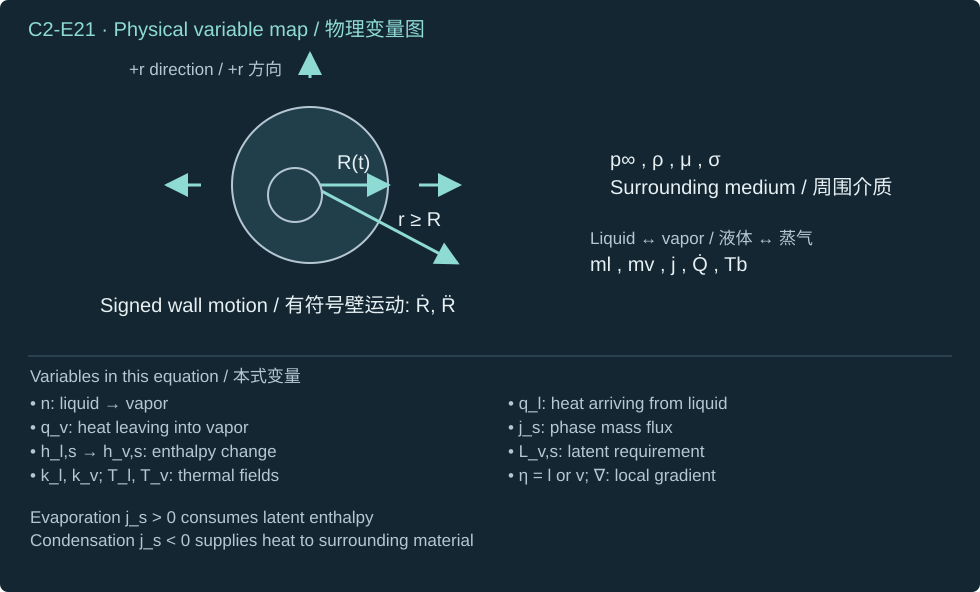

The liquid-to-vapor normal fixes the signs of heat and phase flux.

液到汽法向确定热通量及相变通量符号。

For a separate single-component sign control, declare heat supply projected along the liquid-to-vapor normal of 0.95 MW m⁻², zero projected vapor-side conductive loss, and latent enthalpy 95 kJ kg⁻¹. The Stefan flux is 10 kg m⁻² s⁻¹. A stipulated adjacent liquid density of 1000 kg m⁻³ gives liquid velocity slip 0.010 m s⁻¹. This density belongs to the evaporating liquid in this control, not automatically to the aqueous carrier or the PFC interface. With the teaching PFC density 1630 kg m⁻³, the same flux instead gives 0.006135 m s⁻¹ slip at that PFC interface. Reversing the heat supply reverses both flux and slip. This check establishes units and sign; it does not establish actual interface temperature or rate in a PFC nanoemulsion.

对单独的单组分符号对照，声明沿液到汽法向的热供应为 0.95 MW m⁻²、蒸汽侧投影传导损失为零、潜焓为 95 kJ kg⁻¹。Stefan 通量为 10 kg m⁻² s⁻¹。指定相邻液相密度为 1000 kg m⁻³，可得液体速度滑移 0.010 m s⁻¹。此密度属于该对照中发生汽化的液体，并非自动属于水载液或 PFC 界面。若采用教学 PFC 密度 1630 kg m⁻³，同一通量在该 PFC 界面对应的滑移为 0.006135 m s⁻¹。反转热供应，通量及滑移均反向。该检验只确立单位与符号，没有确立 PFC 纳米乳液的真实界面温度或速率。

**Step 20 — apply the first law to the moving bubble.** Choose the vapor domain as a uniform-state open control. Incoming mass carries enthalpy, including the flow work required to enter. Expansion performs pressure work on the surroundings. Conductive heat input is separately counted. The scalar equation below omits resolved internal kinetic energy and surface storage; outgoing mass carries its actual outgoing enthalpy. It requires a consistent boundary state, not one enthalpy assigned indiscriminately to all fluxes.

**步骤 20——对运动气泡应用第一定律。** 选择蒸汽域作为均匀状态的开放控制体。流入质量携带焓，包括进入所需的流动功；膨胀对周围做压力功；传导热输入单独计入。下式标量方程忽略显式内部动能及表面储能；流出质量携带实际流出焓。它要求一致的边界状态，不能对所有通量不加区别地赋予同一个焓。

**Symbols before Eq. (C2-E22).**

**式（C2-E22）前的符号定义。**

| First individual definition / 第一项单独定义 | Second individual definition / 第二项单独定义 |
| --- | --- |
| $U_b$ is bubble internal energy (J) $U_b$ 为气泡内能（J） | $\dot Q_b$ is net conductive heat into the bubble (W), excluding transported mass enthalpy $\dot Q_b$ 为进入气泡的净传导热（W），不含随质量输运的焓 |
| $p_b$ is uniform absolute bubble pressure (Pa) $p_b$ 为均匀绝对气泡压力（Pa） | $V_b$ is bubble volume (m³) $V_b$ 为气泡体积（m³） |
| $R>0$ is radius in the spherical control (m) $R>0$ 为球形参照的半径（m） | $h_{v,s}$ is boundary specific vapor enthalpy of species s (J kg⁻¹) $h_{v,s}$ 为组分 s 的边界蒸汽比焓（J kg⁻¹） |
| $\dot m_{v,s}$ is its signed net mass-entry rate (kg s⁻¹) $\dot m_{v,s}$ 为其带符号净流入质量速率（kg s⁻¹） | $s=1,\ldots,N_s$ — Species index, from 1 through the declared species count (dimensionless) $s=1,\ldots,N_s$ — 从 1 到所声明组分数的组分指标（无量纲） |
| $\pi$ is the circular constant (dimensionless) $\pi$ 为圆周率（无量纲） | $N_s$ — Number of declared species (dimensionless) $N_s$ — 声明的组分数（无量纲） |

**Conventions and conditions.** $\sum$ is summation; a dot is a time derivative; Distinct entry/exit states require distinct summed boundary terms.

**约定与条件。** $\sum$ 为求和；上点为时间导数；不同流入／流出状态要求分别求和其边界项。

(C2-E22) · Uniform-state open-bubble first-law model

$$
\dot U_b=\dot Q_b-p_b\dot V_b+\sum_{s=1}^{N_s}h_{v,s}\dot m_{v,s},\qquad V_b=\frac{4\pi}{3}R^3,\qquad\dot V_b=4\pi R^2\dot R
$$

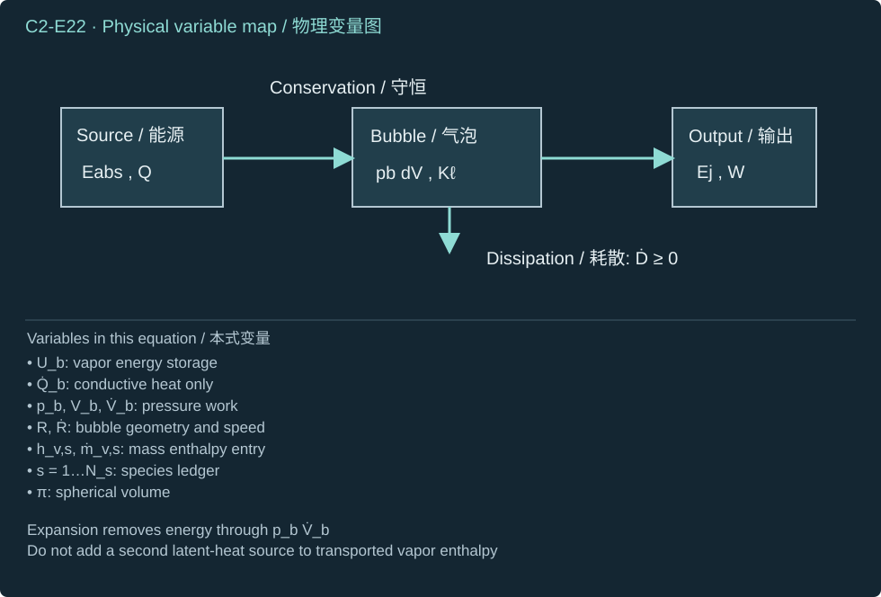

Mass enthalpy and conductive heat are different terms in the bubble ledger.

质量焓与传导热是气泡账目中的不同项。

**Step 21 — expose the temperature derivative.** For a common bulk temperature and ideal species energies depending only on temperature, differentiate every mass–specific-energy product. The specific heat at constant volume is the derivative of specific internal energy. Subtract the bulk specific internal energy from the boundary specific enthalpy. The difference is pure pressure flow work only when both refer to the same thermodynamic state; when entry temperature differs from bulk temperature, it also includes the boundary-to-bulk sensible internal-energy difference. This expansion makes changing vapor mass visible instead of hiding it in a fitted polytropic exponent.

**步骤 21——展开温度导数。** 对共同体相温度、且理想组分内能只依赖温度的情形，对每个质量乘比内能的乘积求导。定容比热是比内能对温度的导数。从边界比焓中减去体相比内能。只有两者对应同一热力学状态时，差值才纯粹是压力流动功；若流入温度与体相温度不同，差值还包括边界与体相之间的显热内能差。该展开明确显示蒸汽质量变化，而不是将其藏入拟合多方指数。

**Symbols before Eq. (C2-E23).**

**式（C2-E23）前的符号定义。**

| First individual definition / 第一项单独定义 | Second individual definition / 第二项单独定义 |
| --- | --- |
| $U_b$ is internal energy (J) $U_b$ 为内能（J） | $m_{v,s}$ is species vapor mass (kg) $m_{v,s}$ 为组分蒸汽质量（kg） |
| $e_s(T_b)$ is specific internal energy using a consistent reference (J kg⁻¹) $e_s(T_b)$ 为采用一致参考的比内能（J kg⁻¹） | $T_b$ is common bubble temperature (K) $T_b$ 为共同气泡温度（K） |
| $c_{v,s}=de_s/dT_b$ is constant-volume specific heat (J kg⁻¹ K⁻¹) $c_{v,s}=de_s/dT_b$ 为定容比热（J kg⁻¹ K⁻¹） | $h_{v,s}$ is actual boundary specific enthalpy (J kg⁻¹) $h_{v,s}$ 为实际边界比焓（J kg⁻¹） |
| $\dot Q_b$ is conductive heat input (W) $\dot Q_b$ 为传导热输入（W） | $p_b$ — Uniform total absolute bubble pressure (Pa) $p_b$ — 均匀总绝对气泡压力（Pa） |
| $V_b$ — Bubble volume (m³) $V_b$ — 气泡体积（m³） | $s=1,\ldots,N_s$ — Species index, from 1 through the declared species count (dimensionless) $s=1,\ldots,N_s$ — 从 1 到所声明组分数的组分指标（无量纲） |
| $N_s$ — Number of declared species (dimensionless) $N_s$ — 声明的组分数（无量纲） |  |

**Conventions and conditions.** a dot denotes a time derivative; $d/dT_b$ is temperature differentiation; Boundary temperature may differ from $T_b$ and must then be used in $h_{v,s}$.

**约定与条件。** 上点表示时间导数；$d/dT_b$ 为温度求导；边界温度可不同于 $T_b$，此时 $h_{v,s}$ 必须使用边界温度。

(C2-E23) · Product-rule derivation of thermal closure

$$
\begin{aligned}U_b&=\sum_{s=1}^{N_s}m_{v,s}e_s(T_b),\qquad c_{v,s}=de_s/dT_b,\\\dot U_b&=\left(\sum_s m_{v,s}c_{v,s}\right)\dot T_b+\sum_s e_s\dot m_{v,s},\\\left(\sum_s m_{v,s}c_{v,s}\right)\dot T_b&=\dot Q_b-p_b\dot V_b+\sum_s(h_{v,s}-e_s)\dot m_{v,s}.\end{aligned}
$$

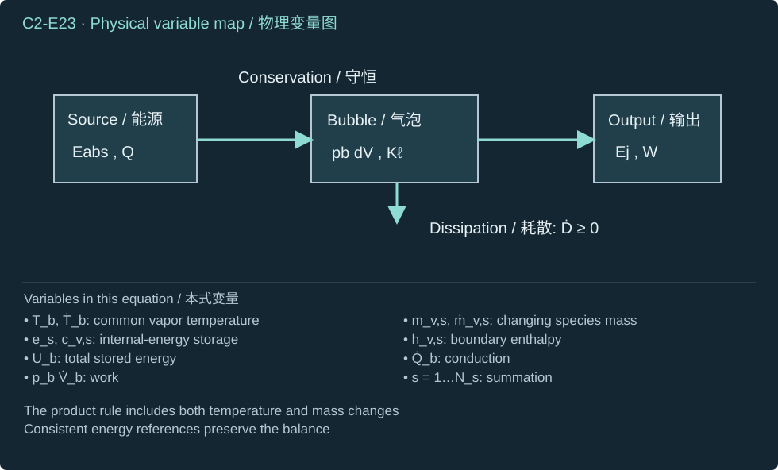

A variable vapor mass makes a fixed-mass polytropic shortcut conditional.

蒸汽质量变化，使固定质量多方捷径只能有条件成立。

The Stefan interface balance and bubble first law must share enthalpy references. The interface heat pays for converting liquid enthalpy into vapor enthalpy; that vapor then enters with its already specified enthalpy. Adding an independent latent source to Eq. (C2-E22) counts the conversion twice. With fixed mass, no conductive heat, and positive expansion rate, the bubble energy decreases. Condensation and cooling can reduce its pressure; if mass exchange is too slow, retained vapor can cushion collapse. Dissolution, permanent gas, and escape each need their own balances.

Stefan 界面平衡与气泡第一定律必须使用共同焓参考。界面热将液体焓转为蒸汽焓，随后蒸汽携带已指定的焓进入气泡。在式（C2-E22）中再添加独立潜热源，会将该转化重复计算。质量固定、无传导热且膨胀速率为正时，气泡能量降低。凝结及冷却可降低压力；若质量交换过慢，保留蒸汽可缓冲塌缩。溶解、永久气体和逸出各需独立守恒式。

A post-nucleation uniform-bubble calculation also needs a nonzero seed volume, initial species masses and temperature, and initial interface shape and velocity. Those inputs must satisfy the original inventory and energy ledger. A fitted probability of onset does not determine them. With no vapor yet present, the liquid heating and activation description applies; do not divide by zero vapor heat capacity to start the uniform-bubble temperature equation.

成核后的均匀气泡计算还需要非零种子体积、初始组分质量与温度、以及初始界面形状与速度。这些输入必须满足原始库存与能量账目。拟合的起始概率并不确定这些量。尚无蒸汽时，应使用液体加热及激活描述；不能除以零蒸汽热容来启动均匀气泡温度方程。

**Step 22 — close pressure with a finite mass and an equation of state.** In a dilute ideal mixture, each partial pressure follows from that species mole number, common temperature, and volume. Sum partial pressures, including noncondensable gas. A real-fluid or mixture equation of state must replace this approximation during high-density compression; neither an Antoine curve nor a fixed polytropic exponent supplies that missing closure.

**步骤 22——用有限质量与状态方程闭合压力。** 在稀薄理想混合物中，每种分压由该组分摩尔数、共同温度及体积决定。各分压求和时包含不可凝气体。高密度压缩时，必须用真实流体或混合物状态方程替代理想近似；Antoine 曲线或固定多方指数均不能补足该缺失闭合。

**Symbols before Eq. (C2-E24).**

**式（C2-E24）前的符号定义。**

| First individual definition / 第一项单独定义 | Second individual definition / 第二项单独定义 |
| --- | --- |
| $p_{v,s}$ is ideal partial pressure of species s (Pa), v naming the vapor-domain component $p_{v,s}$ 为组分 s 的理想分压（Pa），v 标记蒸汽域组分 | $V_b>0$ is bubble volume (m³) $V_b>0$ 为气泡体积（m³） |
| $m_{v,s}\ge0$ is its mass (kg) $m_{v,s}\ge0$ 为其质量（kg） | $M_s>0$ is molar mass (kg mol⁻¹) $M_s>0$ 为摩尔质量（kg mol⁻¹） |
| $R_u=8.314462618$ J mol⁻¹ K⁻¹ is the universal gas constant $R_u=8.314462618$ J mol⁻¹ K⁻¹ 为通用气体常数 | $T_b>0$ is bulk temperature (K) $T_b>0$ 为体相温度（K） |
| $p_b$ is total pressure (Pa) $p_b$ 为总压力（Pa） | $s=1,\ldots,N_s$ — Species index, from 1 through the declared species count (dimensionless) $s=1,\ldots,N_s$ — 从 1 到所声明组分数的组分指标（无量纲） |
| $\mathcal P$ is a specified equation-of-state function (—) $\mathcal P$ 为明确的状态方程函数（—） | $\rho_b$ mixture density (kg m⁻³) $\rho_b$ 为混合物密度（kg m⁻³） |
| $e_b$ specific internal energy (J kg⁻¹) $e_b$ 为比内能（J kg⁻¹） | $\boldsymbol Y$ the species mass-fraction vector (dimensionless, entries summing to one) $\boldsymbol Y$ 为组分质量分数向量（无量纲，各分量之和为一） |
| $N_s$ — Number of declared species (dimensionless) $N_s$ — 声明的组分数（无量纲） |  |

**Conventions and conditions.** $\sum$ is summation; EOS means equation of state.

**约定与条件。** $\sum$ 为求和；EOS 指状态方程。

(C2-E24) · Ideal-mixture constitutive control and required refinement

$$
p_{v,s}V_b=\frac{m_{v,s}}{M_s}R_uT_b,\qquad p_b=\sum_{s=1}^{N_s}p_{v,s},\qquad p_b=\mathcal P(\rho_b,e_b,\boldsymbol Y)\quad\text{for a stated real-mixture EOS}
$$

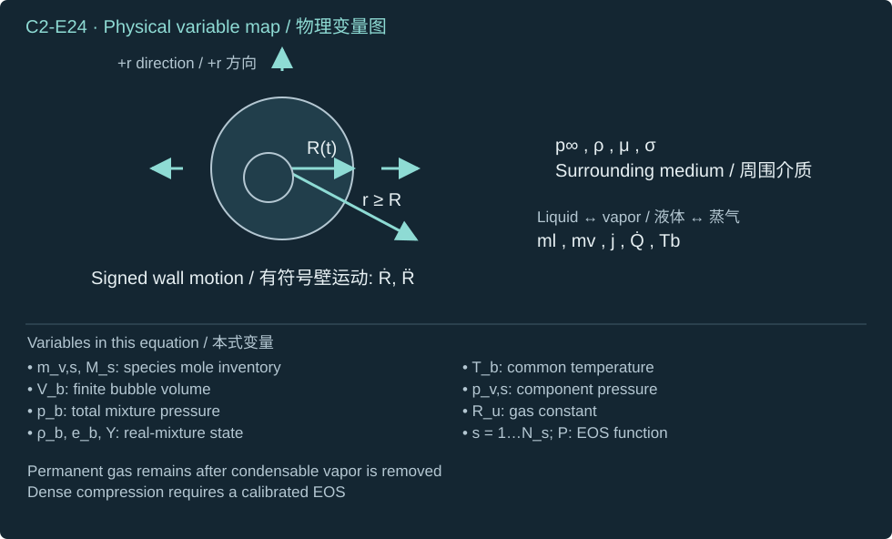

The pressure responds to species masses, temperature, and changing volume.

压力响应组分质量、温度及体积变化。

**Step 23 — display the three causes of changing partial pressure.** For positive species mass, temperature, pressure, and volume, take the logarithm of the ideal equation and differentiate. The mass, temperature, and compression terms then appear separately. At zero species mass use Eq. (C2-E24) directly instead of taking a logarithm.

**步骤 23——明确分压变化的三个原因。** 当组分质量、温度、压力和体积为正时，对理想方程取对数并求导。质量、温度和压缩项便分别显现。组分质量为零时直接使用式（C2-E24），不要取对数。

**Symbols before Eq. (C2-E25).**

**式（C2-E25）前的符号定义。**

| First individual definition / 第一项单独定义 | Second individual definition / 第二项单独定义 |
| --- | --- |
| $p_{v,s}>0$ is species partial pressure (Pa) $p_{v,s}>0$ 为组分分压（Pa） | $m_{v,s}>0$ is its vapor-domain mass (kg), s labeling species $m_{v,s}>0$ 为其蒸汽域质量（kg），s 表示组分 |
| $T_b>0$ is bubble temperature (K) $T_b>0$ 为气泡温度（K） | $V_b>0$ is volume (m³) $V_b>0$ 为体积（m³） |
| $R>0$ is radius for a spherical bubble (m) $R>0$ 为球形气泡半径（m） |  |

**Conventions and conditions.** a dot is a time derivative; Every ratio has units s⁻¹; the final equality uses $V_b=4\pi R^3/3$ and is restricted to spherical geometry.

**约定与条件。** 上点表示时间导数；各比值单位均为 s⁻¹；最后一个等式使用 $V_b=4\pi R^3/3$，仅限球形几何。

(C2-E25) · Derived ideal-pressure evolution identity

$$
\frac{\dot p_{v,s}}{p_{v,s}}=\frac{\dot m_{v,s}}{m_{v,s}}+\frac{\dot T_b}{T_b}-\frac{\dot V_b}{V_b}=\frac{\dot m_{v,s}}{m_{v,s}}+\frac{\dot T_b}{T_b}-3\frac{\dot R}{R}\quad\text{(sphere)}
$$

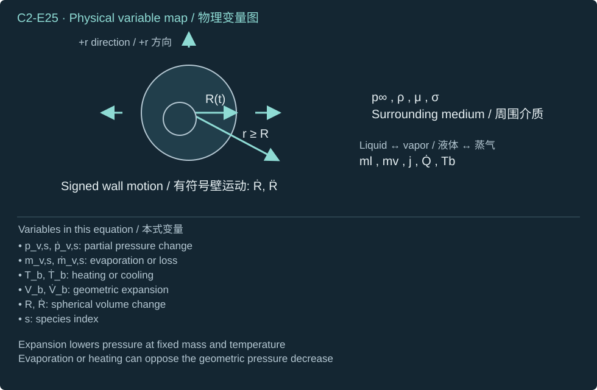

A radius-only gas law hides mass and thermal changes.

仅由半径决定的气体定律会隐藏质量与热变化。

**Step 24 — cap an equilibrium control by available inventory.** For a closed, nondissolving PFC supply at prescribed temperature and free vapor volume, the saturated vapor mass is pressure times volume divided by the species gas constant and temperature. If that required mass exceeds the original supply, all PFC is vapor and the ideal partial pressure falls below saturation. This algebraic control assumes fast phase equilibration, negligible curved-interface corrections, and thermodynamic coexistence conditions; it is not a nonequilibrium evaporation-rate law.

**步骤 24——以可用库存限制平衡参照。** 对闭合、不溶解的 PFC 供应，在给定温度与自由蒸汽体积下，饱和蒸汽质量等于压力乘体积，再除以组分气体常数与温度。若所需质量超过原供应，PFC 全部成为蒸汽，理想分压低于饱和。该代数参照假设相平衡迅速、曲面界面修正可忽略并满足热力学共存条件；它不是非平衡蒸发速率定律。

**Symbols before Eq. (C2-E26).**

**式（C2-E26）前的符号定义。**

| First individual definition / 第一项单独定义 | Second individual definition / 第二项单独定义 |
| --- | --- |
| $m_{v,\mathrm{eq}}$ is equilibrium PFC vapor mass (kg), eq labeling the restricted equilibrium control $m_{v,\mathrm{eq}}$ 为平衡 PFC 蒸汽质量（kg），eq 标记受限平衡参照 | $m_{\mathrm{PFC},0}$ is finite initial supply (kg) $m_{\mathrm{PFC},0}$ 为有限初始供应（kg） |
| $M_{\mathrm{PFC}}$ is PFC molar mass (kg mol⁻¹) $M_{\mathrm{PFC}}$ 为 PFC 摩尔质量（kg mol⁻¹） | $p_{\mathrm{sat,PFC}}(T_b)$ is bulk saturation pressure (Pa) $p_{\mathrm{sat,PFC}}(T_b)$ 为体相饱和蒸汽压（Pa） |
| $p_{v,\mathrm{PFC,eq}}$ is ideal equilibrium PFC partial pressure (Pa) $p_{v,\mathrm{PFC,eq}}$ 为理想平衡 PFC 分压（Pa） | $T_b>0$ is prescribed temperature (K) $T_b>0$ 为给定温度（K） |
| $V_b>0$ is available vapor volume (m³) $V_b>0$ 为可用蒸汽体积（m³） | $R_u$ is universal gas constant (J mol⁻¹ K⁻¹) $R_u$ 为通用气体常数（J mol⁻¹ K⁻¹） |

**Conventions and conditions.** The supply is closed and nondissolving, and mass exchange is assumed fast; $\min$ selects the lesser nonnegative argument.

**约定与条件。** 供应闭合且不溶解，并假设质量交换迅速；$\min$ 选择较小非负值。

(C2-E26) · Finite-inventory equilibrium benchmark

$$
m_{v,\mathrm{eq}}=\min\!\left[m_{\mathrm{PFC},0},\frac{M_{\mathrm{PFC}}p_{\mathrm{sat,PFC}}(T_b)V_b}{R_uT_b}\right],\qquad p_{v,\mathrm{PFC,eq}}=\min\!\left[p_{\mathrm{sat,PFC}}(T_b),\frac{m_{\mathrm{PFC},0}R_uT_b}{M_{\mathrm{PFC}}V_b}\right]
$$

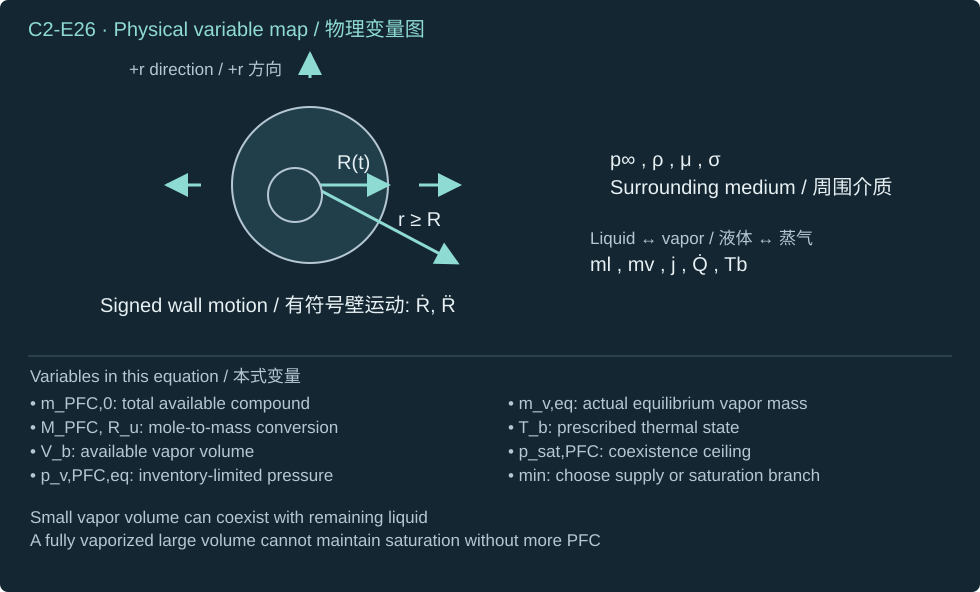

The saturation branch ends when the finite liquid inventory is exhausted.

有限液体库存耗尽时，饱和分支终止。

## 2.5 A complete single-core numerical benchmark

## 2.5 完整单核心数值参照

Declare a 5 μm initial PFP-like liquid core at 293 K, final reference vapor temperature 323 K, density 1630 kg m⁻³, constant liquid heat capacity 654 J kg⁻¹ K⁻¹, and constant latent enthalpy 95 kJ kg⁻¹. The molar mass is the named PFP value. The size, density, constant transport model, latent value, and final state are teaching inputs. They do not describe a verified nanodroplet formulation. The constant latent enthalpy is not presented as a NIST value at 323 K.

声明一个初始温度 293 K、半径 5 μm 的近似 PFP 液核，最终参照蒸汽温度为 323 K，密度为 1630 kg m⁻³，常液相比热容为 654 J kg⁻¹ K⁻¹，常潜焓为 95 kJ kg⁻¹。摩尔质量采用明确的 PFP 数值。尺寸、密度、常系数传输模型、潜焓值与最终状态都是教学输入，不代表已验证的纳米液滴配方。此常潜焓并未被表述为 323 K 下的 NIST 数值。

**Step 25 — evaluate initial mass.** Cube the radius in meters, multiply by density, and use the sphere-volume factor. One nanogram is $10^{-12}$ kg, not $10^{-9}$ kg.

**步骤 25——计算初始质量。** 将以米计的半径立方，乘密度及球体积系数。一纳克是 $10^{-12}$ kg，而不是 $10^{-9}$ kg。

**Symbols before Eq. (C2-E27).**

**式（C2-E27）前的符号定义。**

| First individual definition / 第一项单独定义 | Second individual definition / 第二项单独定义 |
| --- | --- |
| $m_{\mathrm{PFC},0}$ is initial PFC mass (kg), 0 labeling initial state $m_{\mathrm{PFC},0}$ 为初始 PFC 质量（kg），0 表示初态 | $\pi$ is the circular constant (dimensionless) $\pi$ 为圆周率（无量纲） |

**Conventions and conditions.** 1630 is density in kg m⁻³; $5\times10^{-6}$ is initial radius in m; the cube is a power; ng denotes nanogram; $1$ ng = $10^{-12}$ kg.

**约定与条件。** 1630 为以 kg m⁻³ 计的密度；$5\times10^{-6}$ 为以 m 计的初始半径；立方表示幂；ng 为纳克；$1$ ng = $10^{-12}$ kg。

(C2-E27) · Finite-mass worked calculation

$$
m_{\mathrm{PFC},0}=\frac{4\pi}{3}(1630)(5\times10^{-6})^3=8.534660\times10^{-13}\ \mathrm{kg}=0.853466\ \mathrm{ng}
$$

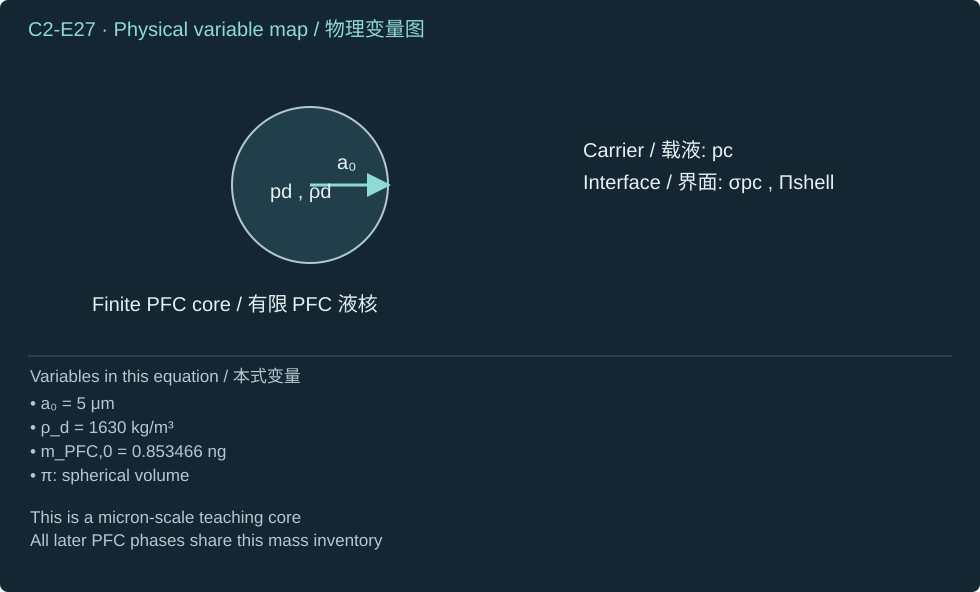

A mass ledger begins with the actual core volume.

质量账目从实际核心体积开始。

**Step 26 — estimate preparation enthalpy.** A declared near-constant-pressure path first heats liquid and then converts it to the chosen vapor reference, using constant coefficients. The sensible term is mass times heat capacity times temperature rise; the latent term is mass times latent enthalpy. This is a preparation-energy screen. It omits the detailed pressure path, carrier heating, shell work, gradients, and losses, and is not automatically an activation threshold or jet energy.

**步骤 26——估计制备焓。** 声明一个近恒压路径，先加热液体，再用常系数将其转为所选蒸汽参照。显热项为质量乘比热容乘温升；潜热项为质量乘潜焓。这是制备能量筛选，忽略详细压力路径、载液加热、壳层做功、梯度及损失，不能自动等同于激活阈值或射流能量。

**Symbols before Eq. (C2-E28).**

**式（C2-E28）前的符号定义。**

| First individual definition / 第一项单独定义 | Second individual definition / 第二项单独定义 |
| --- | --- |
| $Q_{\mathrm{sens}}$ — Estimated sensible preparation energy (J) $Q_{\mathrm{sens}}$ — 估计的显热制备能量（J） | $Q_{\mathrm{lat}}$ — Estimated latent preparation energy (J) $Q_{\mathrm{lat}}$ — 估计的潜热制备能量（J） |
| $Q_{\mathrm{prep}}$ — Estimated total preparation energy (J) $Q_{\mathrm{prep}}$ — 估计的总制备能量（J） | $m_{\mathrm{PFC},0}$ is mass (kg) $m_{\mathrm{PFC},0}$ 为质量（kg） |
| $c_{p,d}=654$ J kg⁻¹ K⁻¹ is constant liquid heat capacity $c_{p,d}=654$ J kg⁻¹ K⁻¹ 为常液相比热容 | $T_*=323$ K is final reference temperature, star labeling the selected state rather than a critical nucleus $T_*=323$ K 为最终参照温度，此处星号标记所选状态，不是临界汽核 |
| $T_0=293$ K is initial temperature $T_0=293$ K 为初始温度 | $L_v=95000$ J kg⁻¹ is declared latent enthalpy $L_v=95000$ J kg⁻¹ 为声明的潜焓 |

**Conventions and conditions.** nJ means $10^{-9}$ J; $\approx$ denotes the constant-property preparation estimate.

**约定与条件。** nJ 表示 $10^{-9}$ J；$\approx$ 表示常性质制备估计。

(C2-E28) · Declared preparation-path enthalpy estimate

$$
\begin{aligned}Q_{\mathrm{sens}}&\approx m_{\mathrm{PFC},0}c_{p,d}(T_*-T_0)=(8.534660\times10^{-13})(654)(323-293)=16.7450\ \mathrm{nJ},\\Q_{\mathrm{lat}}&\approx m_{\mathrm{PFC},0}L_v=(8.534660\times10^{-13})(95000)=81.0793\ \mathrm{nJ},\\Q_{\mathrm{prep}}&\approx Q_{\mathrm{sens}}+Q_{\mathrm{lat}}=97.8243\ \mathrm{nJ}.\end{aligned}
$$

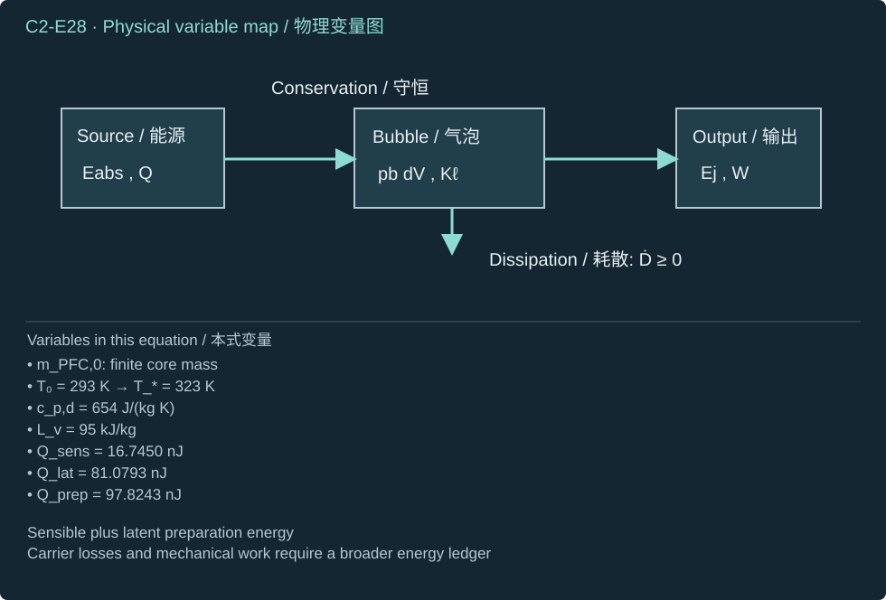

Most of this declared preparation estimate is latent enthalpy.

该制备估计中的大部分能量是潜焓。

**Refinement of the preparation path.** For an equilibrium near-isobaric path with initial subcooled liquid and final superheated vapor, liquid heats only to the saturation temperature at that pressure, then vaporizes, then the vapor heats to its final temperature. Integrate the appropriate phase heat capacities over those separate intervals. The 97.82 nJ screen replaces this full enthalpy path by a constant liquid heat capacity over the whole 30 K rise plus a fixed latent value; it is therefore not an exact endpoint enthalpy. Vapor heat capacity and the actual pressure path are needed to refine it.

**制备路径的改进。** 对初始过冷液体、最终过热蒸汽的近平衡等压路径，液体仅加热到该压力下的饱和温度，随后汽化，最后将蒸汽加热到最终温度。应分别在这些区间积分对应相的比热容。97.82 nJ 筛选用全程 30 K 温升中的常液相比热及固定潜焓替代完整焓路径，因此并非精确端态焓。进一步改进需要蒸汽比热容与实际压力路径。

**Symbols before Eq. (C2-E29).**

**式（C2-E29）前的符号定义。**

| First individual definition / 第一项单独定义 | Second individual definition / 第二项单独定义 |
| --- | --- |
| $Q_{\mathrm{iso}}$ is heat needed for the stated constant-pressure preparation path (J), iso labeling isobaric $Q_{\mathrm{iso}}$ 为所述恒压制备路径的需热（J），iso 表示等压 | $m_{\mathrm{PFC},0}$ is conserved PFC mass (kg) $m_{\mathrm{PFC},0}$ 为守恒 PFC 质量（kg） |
| $p$ is prescribed constant pressure (Pa) $p$ 为给定常压力（Pa） | $T_0$ — Initial liquid temperature (K) $T_0$ — 初始液体温度（K） |
| $T_{\mathrm{sat}}$ — Liquid–vapor coexistence temperature at the prescribed pressure (K) $T_{\mathrm{sat}}$ — 给定压力下的液—汽共存温度（K） | $T_*$ — Selected final vapor temperature on the constant-pressure path (K) $T_*$ — 恒压路径上选定的最终蒸气温度（K） |
| $T$ is dummy integration temperature (K) $T$ 为积分哑温度（K） | $c_{p,l}$ — Temperature- and pressure-dependent liquid specific heat at constant pressure (J kg⁻¹ K⁻¹) $c_{p,l}$ — 依赖温度与压力的液体定压比热（J kg⁻¹ K⁻¹） |
| $c_{p,v}$ — Temperature- and pressure-dependent vapor specific heat at constant pressure (J kg⁻¹ K⁻¹) $c_{p,v}$ — 依赖温度与压力的蒸气定压比热（J kg⁻¹ K⁻¹） | $L_v(T_{\mathrm{sat}},p)$ is latent enthalpy at coexistence (J kg⁻¹) $L_v(T_{\mathrm{sat}},p)$ 为共存状态潜焓（J kg⁻¹） |

**Conventions and conditions.** $\int$ denotes temperature integration; No heat losses or other work are included; pressure work is already contained in this enthalpy path.

**约定与条件。** $\int$ 为温度积分；未计入热损失或其他做功；压力功已包含在该焓路径中。

(C2-E29) · Refined constant-pressure enthalpy path

$$
Q_{\mathrm{iso}}=m_{\mathrm{PFC},0}\!\left[\int_{T_0}^{T_{\mathrm{sat}}}c_{p,l}(T,p)\,dT+L_v(T_{\mathrm{sat}},p)+\int_{T_{\mathrm{sat}}}^{T_*}c_{p,v}(T,p)\,dT\right],\qquad T_0<T_{\mathrm{sat}}\le T_*
$$

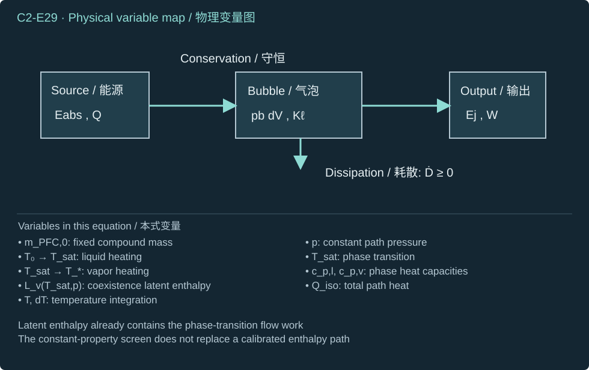

A rigorous preparation path uses the heat capacity of each phase over its own interval.

严谨制备路径在各相自身温区使用对应比热容。

**Step 27 — find a radius associated with a specified vapor state.** As a separate mass-conservation test, fully vaporize that supply at 323 K and 100 kPa PFC partial pressure using the ideal-vapor control. Equate bubble volume from the gas law to core mass divided by original density times the expansion factor. Cancel the positive sphere factor and cube-root the positive ratio. This computes a state-associated inventory radius; it does not solve the dynamics or give maximum radius.

**步骤 27——求指定蒸汽状态对应的半径。** 作为独立质量守恒检验，采用理想蒸汽参照，将该库存全部汽化至 323 K、PFC 分压 100 kPa。将气体定律的气泡体积与核心质量除以初始密度再乘膨胀倍数相等。约去正的球体积系数，对正比值开立方根。该计算得到状态对应的库存半径，并未求解动力学或最大半径。

**Symbols before Eq. (C2-E30).**

**式（C2-E30）前的符号定义。**

| First individual definition / 第一项单独定义 | Second individual definition / 第二项单独定义 |
| --- | --- |
| $R_{b,\mathrm{inv}}>0$ is ideal inventory-state bubble radius (m), b naming bubble and inv naming inventory $R_{b,\mathrm{inv}}>0$ 为理想库存状态气泡半径（m），b 表示气泡，inv 表示库存 | $a_0=5$ μm is initial core radius $a_0=5$ μm 为初始核心半径 |
| $m_{\mathrm{PFC},0}$ is initial mass (kg) $m_{\mathrm{PFC},0}$ 为初始质量（kg） | $\rho_d=1630$ kg m⁻³ is original liquid density $\rho_d=1630$ kg m⁻³ 为初始液体密度 |
| $R_u=8.314462618$ J mol⁻¹ K⁻¹ is gas constant $R_u=8.314462618$ J mol⁻¹ K⁻¹ 为气体常数 | $T_*=323$ K is chosen final reference $T_*=323$ K 为选定最终参照 |
| $M_{\mathrm{PFC}}=0.2880343$ kg mol⁻¹ is PFP molar mass $M_{\mathrm{PFC}}=0.2880343$ kg mol⁻¹ 为 PFP 摩尔质量 | $p_{v,\mathrm{PFC}}=10^5$ Pa is chosen partial pressure $p_{v,\mathrm{PFC}}=10^5$ Pa 为所选分压 |
| $\pi$ is the circular constant (dimensionless) $\pi$ 为圆周率（无量纲） |  |

**Conventions and conditions.** powers 3 and 1/3 denote cube and positive cube root; The ratio is dimensionless.

**约定与条件。** 幂 3 和 1/3 表示立方及正立方根；该比值无量纲。

(C2-E30) · Derived ideal-vapor inventory radius

$$
\begin{aligned}\frac{4\pi}{3}R_{b,\mathrm{inv}}^3&=\frac{m_{\mathrm{PFC},0}R_uT_*}{M_{\mathrm{PFC}}p_{v,\mathrm{PFC}}}=\frac{4\pi}{3}\rho_da_0^3\frac{R_uT_*}{M_{\mathrm{PFC}}p_{v,\mathrm{PFC}}},\\\left(\frac{R_{b,\mathrm{inv}}}{a_0}\right)^3&=\frac{\rho_dR_uT_*}{M_{\mathrm{PFC}}p_{v,\mathrm{PFC}}}=151.9778,\\R_{b,\mathrm{inv}}&=a_0(151.9778)^{1/3}=26.6827\ \mu\mathrm m.\end{aligned}
$$

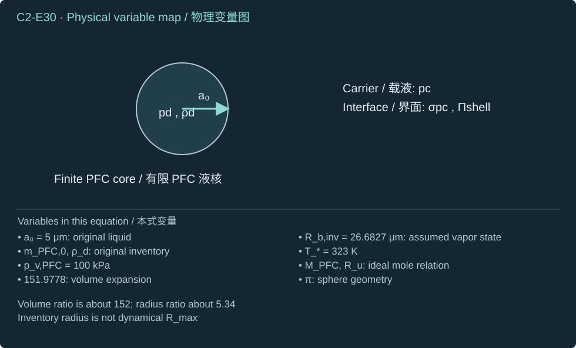

The expansion ratio follows from mass conservation at a stated pressure and temperature.

膨胀比来自指定压力与温度下的质量守恒。

At 323 K, the 100 kPa PFC reference is below 204.33 kPa saturation. It is fully vaporized and unsaturated, not coexistence with an unlimited liquid reservoir. Its ideal gas law can be checked by inserting the computed radius and recovering 100 kPa. At a larger 30 μm radius and the same temperature, even placing the entire supply in vapor gives only 70.36 kPa PFC partial pressure. Maintaining saturation there would require more PFC than the original core contains. Added water vapor or gas can alter total pressure, but requires its own inventory and energy accounting.

323 K 时，100 kPa 的 PFC 参照低于 204.33 kPa 饱和压力。它是完全汽化、未饱和状态，不是与无限液体库共存。将计算半径代回理想气体定律，可恢复 100 kPa，完成检验。在更大的 30 μm 半径及同温度下，即使全部库存均在蒸汽中，PFC 分压也仅为 70.36 kPa。此时维持饱和将需要超过原核心的 PFC。额外水蒸汽或气体可改变总压力，但必须有各自的库存与能量账目。

**Step 28 — connect the optical and thermal energy screens without claiming an activation threshold.** Declare incident energy 1 μJ, beam radius 20 μm, centered aperture radius 10 μm, absorber thickness 5 μm, absorption coefficient $2\times10^5$ m⁻¹, and reflected fraction 0.10. Calculate the intercepted fraction and absorptance before comparing energy. These values specify a hypothetical slab and are independent of the optical studies cited earlier.

**步骤 28——连接光学与热学能量筛选，不将其声称为激活阈值。** 声明入射能量 1 μJ、光束半径 20 μm、同轴窗口半径 10 μm、吸收层厚度 5 μm、吸收系数 $2\times10^5$ m⁻¹、反射比例 0.10。比较能量前先计算截获比例与吸收率。这些值定义假想薄层，与此前引用的光学研究相互独立。

**Symbols before Eq. (C2-E31).**

**式（C2-E31）前的符号定义。**

| First individual definition / 第一项单独定义 | Second individual definition / 第二项单独定义 |
| --- | --- |
| $f_{\mathrm{geo}}$ is interception fraction (dimensionless) $f_{\mathrm{geo}}$ 为截获比例（无量纲） | $A_\lambda$ is effective absorptance at the chosen wavelength $\lambda$ (m) $A_\lambda$ 为所选波长 $\lambda$（m）处的有效吸收率 |
| $E_{\mathrm{abs}}$ is absorbed energy (J) $E_{\mathrm{abs}}$ 为吸收能量（J） | $Q_{\mathrm{prep}}$ is declared preparation-energy estimate (J) $Q_{\mathrm{prep}}$ 为声明的制备能量估计（J） |
| $\eta_{\mathrm{th,min}}$ is the minimum heat-delivery fraction in this loss-excluding estimate, th naming thermal and min minimum (dimensionless) $\eta_{\mathrm{th,min}}$ 为该不含损失估计中的最低热输送比例，th 表示热学，min 表示最低（无量纲） | $\lambda$ — Laser wavelength (m) $\lambda$ — 激光波长（m） |

**Conventions and conditions.** both are dimensionless; The 10 and 20 are aperture and beam radii in the same μm unit; 0.10 is reflection fraction; $2\times10^5$ is absorption coefficient in m⁻¹; $5\times10^{-6}$ is thickness in m; μJ and nJ mean $10^{-6}$ J; $10^{-9}$ J; $e^x$ is the exponential.

**约定与条件。** 两者无量纲；10 和 20 是使用相同 μm 单位的窗口与光束半径；0.10 是反射比例；$2\times10^5$ 是以 m⁻¹ 计的吸收系数；$5\times10^{-6}$ 是以 m 计的厚度；μJ 与 nJ 分别为 $10^{-6}$ J 和 $10^{-9}$ J；$e^x$ 为指数函数。

(C2-E31) · Declared optical-to-heat energy screen

$$
\begin{aligned}f_{\mathrm{geo}}&=1-e^{-2(10/20)^2}=0.393469,\\A_\lambda&=(1-0.10)[1-e^{-(2\times10^5)(5\times10^{-6})}]=0.568909,\\E_{\mathrm{abs}}&=(0.393469)(0.568909)(1\ \mu\mathrm J)=223.848\ \mathrm{nJ},\\\eta_{\mathrm{th,min}}&=Q_{\mathrm{prep}}/E_{\mathrm{abs}}=97.8243/223.848=0.437012.\end{aligned}
$$

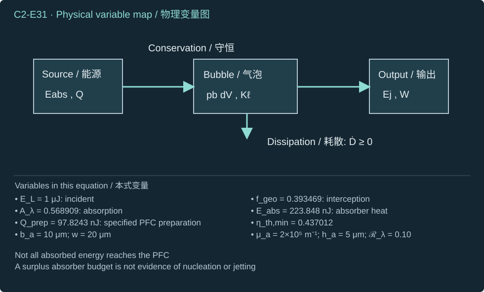

The preparation estimate demands at least 43.7% of the declared absorbed energy.

该制备估计要求至少 43.7% 的所声明吸收能量。

If only 20% of this absorbed energy reaches the chosen core, the delivered heat is 44.77 nJ, below the declared 97.82 nJ full-preparation estimate. If 50% reaches it, the 111.92 nJ budget clears that estimate but still does not demonstrate nucleation, spatial uniformity, shell opening, or useful pressure work. With unchanged coefficients and reference states, halving core radius divides mass and preparation enthalpy by eight while preserving the ideal volume expansion factor; its capillary pressure doubles. Thus small size simultaneously changes inventory, heating distance, and confinement.

若仅 20% 吸收能量到达所选核心，所送热量为 44.77 nJ，低于声明的 97.82 nJ 完全制备估计。若达到 50%，111.92 nJ 的预算超过该估计，却仍不能证明成核、空间均温、壳层开启或有用压力功。在系数与参照状态不变时，核心半径减半会使质量与制备焓降为八分之一，同时保持理想体积膨胀倍数；毛细压力却加倍。因此，小尺寸会同时改变库存、加热距离及约束。

**Handoff to the connected calculation.** Chapter 3 repeats this exact 5 μm teaching-core inventory across 25 sites: total PFC mass is 21.3367 ng and the summed preparation screen is 2.44561 μJ. Those totals are a source mass/enthalpy ledger. They are not a freely available 2.44561 μJ jet budget, and the hypothetical optical slab above is not a calibration of those cells. Chapter 3 states the separate-cell assumption and declares any mechanical-conversion fraction before calculating finite emitted liquid mass and energy.

**贯穿算例的交接。** 第三章在 25 个位点重复使用此相同的 5 μm 教学核心库存：PFC 总质量为 21.3367 ng，制备筛选之和为 2.44561 μJ。这些总量是源质量／焓账目，不能当作可自由使用的 2.44561 μJ 射流预算；上面的假想光学薄层也不是这些单元的标定。第三章将明确独立单元假设，并在计算有限喷出液体质量与能量之前声明任何力学转换比例。

**Unresolved project inputs.** To predict a target formulation, identify its PFC compound and purity; size distribution; shell and interfacial laws; absorber spectrum, loading, and location; carrier transport; thermal contact; nucleation or activation statistics; phase kinetics; permanent gas; and a valid high-state EOS. This chapter establishes a consistent theory and verified teaching controls. It does not establish the project’s laser threshold, pressure maximum, or jet velocity. Chapter 3 uses site-specific source histories to analyze arrays and useful output.

**尚未解决的项目输入。** 预测目标配方需要明确 PFC 化合物与纯度、尺寸分布、壳层及界面定律、吸收体光谱／载量／位置、载液传输、热接触、成核或激活统计、相变动力学、永久气体及有效高状态 EOS。本章建立一致理论及已核验教学参照，尚未确立项目激光阈值、最高压力或射流速度。第三章将使用各位点源历程分析阵列及有用输出。

## 2.6 Three research-defense questions

## 2.6 三道研究答辩题

### A PFC formulation absorbs a stronger laser pulse but produces no useful jet. How would you explain and investigate the missing links?

### PFC 配方吸收了更强激光脉冲，却没有产生有用射流。你会如何解释并查明缺失环节？

Explain this in your own words. Use assumptions, a physical argument, and a limitation; equation memorization is not required.

请用自己的话解释，说明假设、物理推理及适用限制；不要求背诵公式。

\*\*Reference answer and mastery criteria / 参考答案与掌握标准\*\*

**Symbols before Eq. (C2-E32).**

**式（C2-E32）前的符号定义。**

| First individual definition / 第一项单独定义 | Second individual definition / 第二项单独定义 |
| --- | --- |
| $E_L$ — Incident laser-pulse energy (J) $E_L$ — 入射激光脉冲能量（J） | $E_{\mathrm{abs}}$ — Absorbed optical energy (J) $E_{\mathrm{abs}}$ — 吸收光能（J） |
| $w>0$ is Gaussian beam radius (m) $w>0$ 为高斯光束半径（m） | $F_0$ is central fluence (J m⁻²) $F_0$ 为中心能量密度（J m⁻²） |
| $\pi$ is the circular constant (dimensionless) $\pi$ 为圆周率（无量纲） | $f_{\mathrm{geo}}$ — Intercepted incident-energy fraction (dimensionless) $f_{\mathrm{geo}}$ — 截获的入射能量比例（无量纲） |
| $A_\lambda$ — Effective absorptance of incident light (dimensionless) $A_\lambda$ — 相对于入射光的有效吸收率（无量纲） | $\lambda$ labeling wavelength (m) $\lambda$ 标记波长（m） |
| $t_{\mathrm{th}}$ is diffusion-time estimate (s) $t_{\mathrm{th}}$ 为扩散时间估计（s） | $L_h>0$ is heating distance (m) $L_h>0$ 为加热距离（m） |
| $\alpha>0$ is diffusivity (m² s⁻¹) $\alpha>0$ 为扩散率（m² s⁻¹） | $\tau_h$ is heating duration (s) $\tau_h$ 为加热时长（s） |
| $\delta_T$ is penetration scale (m) $\delta_T$ 为渗透尺度（m） |  |

**Conventions and conditions.** $\sim$ denotes scaling.

**约定与条件。** $\sim$ 表示尺度关系。

(C2-E32) · Original formulas for Defense 1

$$
E_L=\frac{\pi w^2F_0}{2},\qquad E_{\mathrm{abs}}=f_{\mathrm{geo}}A_\lambda E_L,\qquad t_{\mathrm{th}}\sim L_h^2/\alpha,\qquad\delta_T\sim\sqrt{\alpha\tau_h}
$$

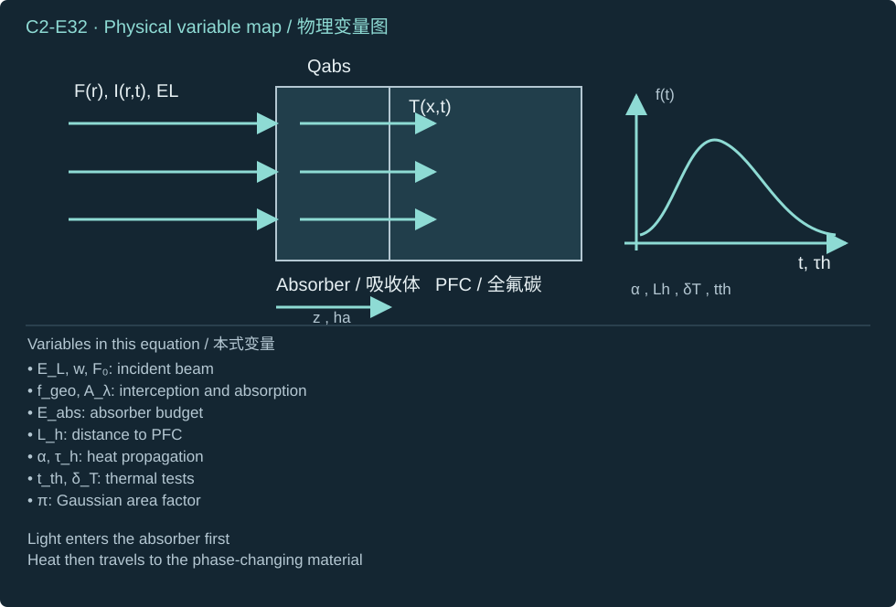

Original optical and thermal formulas used in the reference answer.

参考答案使用的原始光学与热学公式。

First identify where light is actually absorbed. At fixed pulse energy, a smaller spot raises local fluence; at fixed fluence, a shorter pulse raises irradiance. Neither operation proves that the PFC receives the heat. The intercepted area, absorption spectrum and thickness, reflection, and absorber location determine the absorber budget. Next compare the distance to the core with thermal penetration during the available event time and account for contact resistance and carrier loss. The 5 μm, 10 ns control has only about 22 nm penetration, so surface heating cannot be declared uniform-core heating. A dispersed absorber changes that geometry and must be resolved or justified.

首先确定光实际在哪里吸收。脉冲能量固定时，较小光斑提高局部能量密度；能量密度固定时，较短脉冲提高辐照度。两者都不能证明 PFC 收到热量。截获面积、吸收光谱与厚度、反射及吸收体位置决定吸收体预算。随后比较到核心的距离与可用事件时长内的热渗透，并考虑接触热阻及载液损失。5 μm、10 ns 参照只有约 22 nm 的渗透，因此不能将表面加热声明为核心均温加热。分散吸收体改变该几何，需要解析或论证。

In the declared example 223.85 nJ is absorbed and about 97.82 nJ is the selected preparation estimate; at least 43.7% heat delivery would be required even before the omitted losses. Passing that screen is not onset proof. Activation, finite phase inventory, pressure work, and directional jet formation follow as separate causal stages. A matched PFC-free control must keep these optical and geometric inputs comparable, rather than attribute an absorber change to PFC chemistry.

在声明示例中，吸收 223.85 nJ，所选制备估计约 97.82 nJ；即使还未计入省略损失，也至少需要 43.7% 热输送。通过该筛选不是起始证明。激活、有限相库存、压力功及定向射流形成是后续独立因果阶段。匹配的不含 PFC 参照必须使这些光学及几何输入可比，不能将吸收体改变归因于 PFC 化学。

#### What a mastered answer demonstrates

#### 掌握后的回答应体现

* Distinguishes incident energy, absorbed energy, irradiance, and heat delivered to PFC; traces absorber location and heat-transfer time.

  区分入射能量、吸收能量、辐照度与送达 PFC 的热量；追踪吸收体位置及热传递时间。
* Explains how spot size, duration, penetration, and a finite energy budget affect the source without calling an energy screen an activation threshold.

  说明光斑、时长、渗透及有限能量预算如何影响源，而不将能量筛选称为激活阈值。
* Identifies activation and geometry-dependent pressure-to-jet conversion as additional stages, and specifies a fair PFC-free comparison.

  指出激活与依赖几何的压力到射流转化是额外阶段，并给出公平的不含 PFC 对照。

### Why can a low-boiling PFC nanodroplet remain liquid during laser heating, and why is one failed activation not evidence of impossibility?

### 为什么低沸点 PFC 纳米液滴在激光加热时仍可能保持液态？为什么一次激活失败不能证明不可能？

Explain this in your own words. Use assumptions, a physical argument, and a limitation; equation memorization is not required.

请用自己的话解释，说明假设、物理推理及适用限制；不要求背诵公式。

\*\*Reference answer and mastery criteria / 参考答案与掌握标准\*\*

**Symbols before Eq. (C2-E33).**

**式（C2-E33）前的符号定义。**

| First individual definition / 第一项单独定义 | Second individual definition / 第二项单独定义 |
| --- | --- |
| $p_d$ — Initial liquid-PFC core pressure (Pa) $p_d$ — 初始液态 PFC 核压力（Pa） | $p_c$ — Carrier-liquid pressure (Pa) $p_c$ — 载液压力（Pa） |
| $\Pi_{\mathrm{shell}}$ — Shell-supported excess pressure (Pa) $\Pi_{\mathrm{shell}}$ — 壳层支撑超压（Pa） | $a>0$ is core radius (m) $a>0$ 为核心半径（m） |
| $\sigma_{pc}$ is PFC–carrier tension (N m⁻¹) $\sigma_{pc}$ 为 PFC–载液张力（N m⁻¹） | $p_{\mathrm{sat,PFC}}(T_i)$ is equilibrium PFC vapor pressure (Pa) at local interface temperature $T_i$ (K) $p_{\mathrm{sat,PFC}}(T_i)$ 为局部界面温度 $T_i$（K）处的平衡 PFC 蒸汽压（Pa） |
| $\Delta p_n>0$ is nucleation driving pressure (Pa) $\Delta p_n>0$ 为成核驱动压差（Pa） | $\sigma_{vp}>0$ is vapor–PFC tension (N m⁻¹) $\sigma_{vp}>0$ 为蒸汽–PFC 张力（N m⁻¹） |
| $r_*$ is critical nucleus radius (m) $r_*$ 为临界汽核半径（m） | $W_*$ is barrier (J) $W_*$ 为势垒（J） |
| $\pi$ is the circular constant (dimensionless) $\pi$ 为圆周率（无量纲） | $T_i$ — Local phase-interface temperature (K) $T_i$ — 局部相界面温度（K） |

**Conventions and conditions.** star labels critical values; $\simeq$ denotes the static core-pressure approximation; Critical formulas assume homogeneous small-nucleus capillarity.

**约定与条件。** 星号标记临界值；$\simeq$ 表示静态核压力近似；临界公式假设均匀小汽核毛细模型。

(C2-E33) · Original formulas for Defense 2

$$
p_d\simeq p_c+2\sigma_{pc}/a+\Pi_{\mathrm{shell}},\quad \Delta p_n=p_{\mathrm{sat,PFC}}(T_i)-p_d,\quad r_*=2\sigma_{vp}/\Delta p_n,\quad W_*=16\pi\sigma_{vp}^3/(3\Delta p_n^2)\quad(\Delta p_n>0)
$$

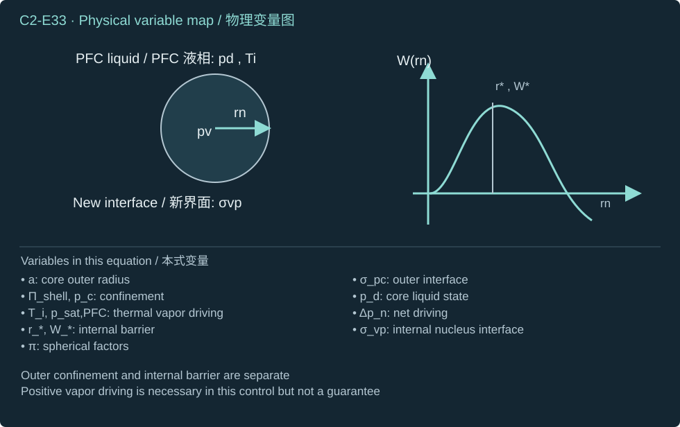

Original confinement and nucleation formulas used in the reference answer.

参考答案使用的原始约束与成核公式。

**Symbols before Eq. (C2-E34).**

**式（C2-E34）前的符号定义。**

| First individual definition / 第一项单独定义 | Second individual definition / 第二项单独定义 |
| --- | --- |
| $P_{\mathrm{act}}$ is activation probability (dimensionless) $P_{\mathrm{act}}$ 为激活概率（无量纲） | $J(T,p)\ge0$ is supplied Poisson event rate (m⁻³ s⁻¹), evaluated at local temperature $T$ (K) and pressure $p$ (Pa) $J(T,p)\ge0$ 为给定 Poisson 事件速率（m⁻³ s⁻¹），取局部温度 $T$（K）与压力 $p$（Pa） |
| $V_d(t^{\prime})$ is remaining PFC-liquid region, d labeling droplet (m³) $V_d(t^{\prime})$ 为剩余 PFC 液体区域，d 表示液滴（m³） | $t\ge0$ — Time (s) $t\ge0$ — 时间（s） |
| $dV$ is volume element (m³) $dV$ 为体积元（m³） | $T$ — Thermodynamic temperature (K) $T$ — 热力学温度（K） |
| $p$ — Local or prescribed thermodynamic pressure as specified (Pa) $p$ — 按情景指定的局部或给定热力学压力（Pa） |  |

**Conventions and conditions.** $\int$ is integration; $\exp$ is the natural exponential; Independent events and finite integrated rate are assumed.

**约定与条件。** $\int$ 为积分；$\exp$ 为自然指数函数；假设事件独立且积分速率有限。

(C2-E34) · Original activation-probability formula

$$
P_{\mathrm{act}}=1-\exp\!\left[-\int_0^t\int_{V_d(t^{\prime})}J(T,p)\,dV\,dt^{\prime}\right]
$$

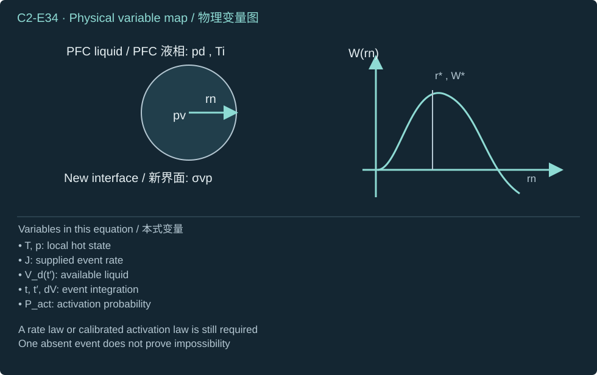

The probability formula does not replace the missing material-specific rate.

概率公式不能替代缺失的材料特定速率。

A low bulk boiling point means bulk liquid and vapor coexist at relatively low temperature and specified pressure. A small coated core has a different liquid pressure because capillarity scales as inverse radius and the shell may add resistance. At 323 K, the declared 5 μm control is at 108 kPa and has positive PFP reference driving, but the 100 nm control is at 500 kPa and does not. Even positive driving leaves a barrier: the internal vapor–PFC tension sets the critical nucleus and must not be replaced by the outer tension. The rate and time in the hot state determine event probability; heterogeneity may require a measured activation law.

低体相沸点意味着在明确压力下，体相液体和蒸汽能在较低温度共存。小包覆核心的液体压力不同，因为毛细压力与半径成反比，且壳层可能增加阻力。323 K 时，声明的 5 μm 参照位于 108 kPa，具有正 PFP 参照驱动力；100 nm 参照位于 500 kPa，则没有。即使驱动力为正，势垒仍存在：内部蒸汽–PFC 张力决定临界汽核，不能由外界面张力替换。速率及热状态持续时间决定事件概率；异质过程可能需要测量激活定律。

No activation in one exposure can mean insufficient heat, unfavorable confinement, a low probability, or an unsuitable nucleation site, not necessarily impossibility. A simulation seeded after onset answers what follows that seed and must not be described as predicting the optical threshold. Useful tests separately observe absorbed energy, onset statistics, core or shell state, and bubble evolution under the same exposure.

一次照射未激活，可能意味着热量不足、约束不利、概率低或成核位点不合适，不一定意味着不可能。起始后给种子的模拟只回答该种子后续怎样，不能称为预测光学阈值。有用检验应在同样照射下分别观测吸收能量、起始统计、核心或壳层状态及气泡演化。

#### What a mastered answer demonstrates

#### 掌握后的回答应体现

* Explains bulk saturation versus the pressure inside a finite core, including inverse-radius capillarity and shell stress.

  解释体相饱和与有限核心内部压力的区别，包含反半径毛细压力及壳层应力。
* Distinguishes the PFC–carrier and vapor–PFC tensions and explains the positive-driving branch, barrier, and finite hot-state duration.

  区分 PFC–载液与蒸汽–PFC 张力，并解释正驱动分支、势垒及有限热状态时长。
* Treats activation statistically when appropriate and separates seeded dynamics from a demonstrated onset prediction.

  适当时以统计过程看待激活，并区分种子后的动力学与已证明的起始预测。

### How would you build a mass- and energy-consistent PFC pressure history, and why is its inventory radius neither a maximum bubble radius nor a jet-speed prediction?

### 你会如何建立质量与能量一致的 PFC 压力历程？为什么库存半径既不是最大气泡半径，也不是射流速度预测？

Explain this in your own words. Use assumptions, a physical argument, and a limitation; equation memorization is not required.

请用自己的话解释，说明假设、物理推理及适用限制；不要求背诵公式。

\*\*Reference answer and mastery criteria / 参考答案与掌握标准\*\*

**Symbols before Eq. (C2-E35).**

**式（C2-E35）前的符号定义。**

| First individual definition / 第一项单独定义 | Second individual definition / 第二项单独定义 |
| --- | --- |
| $m_{\mathrm{PFC},0}$ is initial PFC mass (kg) $m_{\mathrm{PFC},0}$ 为初始 PFC 质量（kg） | $\rho_d$ is initial liquid density (kg m⁻³) $\rho_d$ 为初始液体密度（kg m⁻³） |
| $a_0$ is initial core radius (m) $a_0$ 为初始核心半径（m） | $m_l$ — Remaining liquid-PFC mass (kg) $m_l$ — 剩余液态 PFC 质量（kg） |
| $m_v$ — PFC vapor mass (kg) $m_v$ — PFC 蒸气质量（kg） | $m_{\mathrm{diss}}$ — Dissolved PFC mass (kg) $m_{\mathrm{diss}}$ — 溶解 PFC 质量（kg） |
| $m_{\mathrm{esc}}$ — Cumulative escaped PFC mass (kg) $m_{\mathrm{esc}}$ — 累计逸出 PFC 质量（kg） | $p_{v,\mathrm{PFC}}$ is ideal PFC partial pressure (Pa) $p_{v,\mathrm{PFC}}$ 为理想 PFC 分压（Pa） |
| $V_b>0$ is bubble volume (m³) $V_b>0$ 为气泡体积（m³） | $M_{\mathrm{PFC}}$ is molar mass (kg mol⁻¹) $M_{\mathrm{PFC}}$ 为摩尔质量（kg mol⁻¹） |
| $R_u$ is universal gas constant (J mol⁻¹ K⁻¹) $R_u$ 为通用气体常数（J mol⁻¹ K⁻¹） | $T_b>0$ is bulk temperature (K) $T_b>0$ 为体相温度（K） |
| $\pi$ is the circular constant (dimensionless) $\pi$ 为圆周率（无量纲） |  |

**Conventions and conditions.** 0 denotes initial state and other subscripts name compartments; No external compound supply is allowed.

**约定与条件。** 0 表示初态，其余下标标记分区；不允许外部化合物供应。

(C2-E35) · Original inventory and pressure formulas for Defense 3

$$
m_{\mathrm{PFC},0}=\frac{4\pi}{3}\rho_da_0^3,\qquad m_l+m_v+m_{\mathrm{diss}}+m_{\mathrm{esc}}=m_{\mathrm{PFC},0},\qquad p_{v,\mathrm{PFC}}V_b=\frac{m_v}{M_{\mathrm{PFC}}}R_uT_b
$$

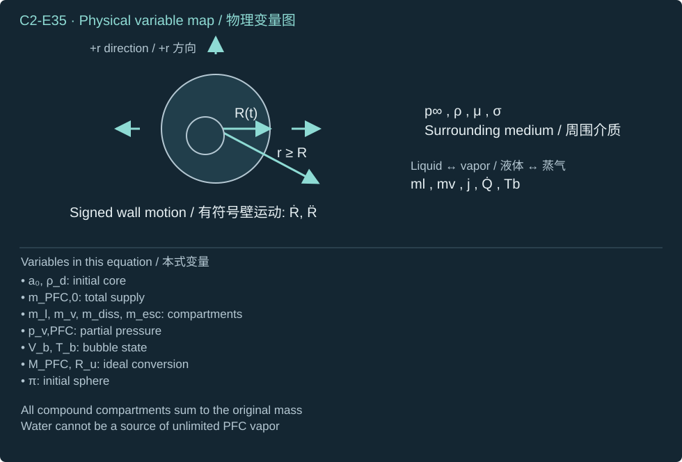

Original finite-inventory formulas used in the reference answer.

参考答案使用的原始有限库存公式。

**Symbols before Eq. (C2-E36).**

**式（C2-E36）前的符号定义。**

| First individual definition / 第一项单独定义 | Second individual definition / 第二项单独定义 |
| --- | --- |
| $j_s$ is signed phase flux (kg m⁻² s⁻¹) $j_s$ 为带符号相变通量（kg m⁻² s⁻¹） | $L_{v,s}$ is latent enthalpy (J kg⁻¹) $L_{v,s}$ 为潜焓（J kg⁻¹） |
| $\boldsymbol q_l$ — Liquid-side conductive heat flux (W m⁻²) $\boldsymbol q_l$ — 液体侧传导热通量（W m⁻²） | $\boldsymbol q_v$ — Vapor-side conductive heat flux (W m⁻²) $\boldsymbol q_v$ — 蒸气侧传导热通量（W m⁻²） |
| $\boldsymbol n$ is unit liquid→vapor normal (dimensionless) $\boldsymbol n$ 为液→汽单位法向（无量纲） | $U_b$ is bubble internal energy (J) $U_b$ 为气泡内能（J） |
| $\dot Q_b$ is conductive heat input excluding mass enthalpy (W) $\dot Q_b$ 为不含质量焓的传导热输入（W） | $p_b$ is pressure (Pa) $p_b$ 为压力（Pa） |
| $V_b$ is volume (m³) $V_b$ 为体积（m³） | $h_{v,s}$ is boundary specific vapor enthalpy (J kg⁻¹) $h_{v,s}$ 为边界蒸汽比焓（J kg⁻¹） |
| $m_{v,s}$ is species mass (kg) $m_{v,s}$ 为组分质量（kg） | $R$ is spherical bubble radius (m) $R$ 为球形气泡半径（m） |
| $\dot R$ its wall speed (m s⁻¹) $\dot R$ 为壁速（m s⁻¹） | $u_l(R)$ adjacent radial liquid speed (m s⁻¹) $u_l(R)$ 为邻接径向液速（m s⁻¹） |
| $\rho_l$ liquid density (kg m⁻³) $\rho_l$ 为液体密度（kg m⁻³） |  |

**Conventions and conditions.** $\sum_s$ sums all declared species; A dot is a time derivative and $\cdot$ is a vector dot product; Interface heat and slip formulas assume the stated single-component reduced jump.

**约定与条件。** $\sum_s$ 对所有声明组分求和；上点表示时间导数，$\cdot$ 表示向量点积；界面热及滑移公式采用所声明单组分简化跳跃假设。

(C2-E36) · Original phase-energy and velocity-slip formulas

$$
j_sL_{v,s}=(\boldsymbol q_l-\boldsymbol q_v)\cdot\boldsymbol n,\qquad\dot U_b=\dot Q_b-p_b\dot V_b+\sum_s h_{v,s}\dot m_{v,s},\qquad u_l(R)=\dot R-j_s/\rho_l
$$

Original conservation formulas prevent unlimited vapor and duplicated latent energy.

原始守恒公式防止无限蒸汽及重复潜热计入。

Begin with the measured or declared core mass and conserve it across liquid, vapor, dissolved, and escaped compartments. The ideal PFC partial pressure follows from vapor mass, temperature, and volume; total pressure also includes water vapor and permanent gas. Saturation is only an equilibrium branch when enough liquid and fast heat/mass exchange sustain it. Once all PFC has vaporized, expansion lowers its pressure at fixed temperature. The 5 μm control contains only 0.8535 ng and gives a 26.68 μm inventory radius at 323 K and 100 kPa, not a dynamical maximum. At 30 μm it can supply only 70.36 kPa PFC partial pressure in that ideal control.

应从测得或声明的核心质量出发，在液体、蒸汽、溶解与逸出分区间守恒。理想 PFC 分压由蒸汽质量、温度及体积决定；总压力还包含水蒸汽与永久气体。只有液体足够、热质交换快速时，饱和才是可维持的平衡分支。PFC 全部汽化后，在温度固定时膨胀使其压力降低。5 μm 参照仅含 0.8535 ng，在 323 K、100 kPa 下得到 26.68 μm 库存半径，而不是动力学最大值。在 30 μm 时，该理想参照仅能提供 70.36 kPa PFC 分压。

Next use the Stefan balance to determine signed evaporation or condensation from interface heat, and use the open first law for pressure work and transported enthalpy. Do not add latent heating a second time. Phase change can make wall speed differ from liquid speed; a simple RP closure must check slip and recoil. Rapid compression can retain nonequilibrium vapor, and permanent gas persists after condensation. A high-state real EOS, thermal transport, and resolved geometry are necessary refinements. The useful jet remains predominantly carrier liquid and requires Chapter 1/3’s mechanical and directional closure; an inventory expansion ratio is not a jet-speed prediction.

随后用 Stefan 平衡根据界面热确定带符号蒸发或凝结，用开放第一定律计入压力功及输运焓；不能再计一次潜热。相变可使壁速不同于液速，简单 RP 闭合必须检查滑移与反冲。快速压缩可保留非平衡蒸汽，凝结后永久气体仍在。高状态真实 EOS、热传输及解析几何是必要改进。有用射流仍主要是载液，需要第一／三章的力学与方向闭合；库存膨胀比不是射流速度预测。

#### What a mastered answer demonstrates

#### 掌握后的回答应体现

* Conserves finite PFC across all relevant compartments and explains when saturation can and cannot be sustained.

  在所有相关分区间守恒有限 PFC，并说明饱和何时可维持、何时不能。
* Explains signed Stefan transfer, open-system enthalpy and pressure work, and avoids duplicated latent heat; recognizes phase-change velocity slip.

  解释带符号 Stefan 传输、开放系统焓与压力功，并避免重复潜热；认识相变速度滑移。
* Separates assumed inventory state from nonlinear dynamics and useful carrier-jet output; identifies retained vapor, gas, and EOS limits.

  区分假定库存状态、非线性动力学及有用载液射流输出；指出残留蒸汽、气体及 EOS 限制。

---

# Chapter 3: Arrays, finite jets and measurable impact

# 第 3 章：阵列、有限射流与可测冲击

## 1. Define the array, its energy constraint, and the desired output

## 1. 定义阵列、能量约束及所需输出

Our objective is to follow a finite laser-activated array from individual cavity histories to an emitted liquid jet, coherent arrival, and pressure measured at a stated receiver. Chapter 2 supplies each site's heat input, finite PFC inventory, and internal-pressure history. Here we solve mechanical controls with declared source histories; we do not claim to have calculated a target PFC jet maximum. The carrier liquid supplies most of the moving mass. Internal bubble pressure, external jet speed, exposed-surface pressure, and buried-interface traction remain distinct outputs.

本章目标是沿有限激光激活阵列，追踪各腔体历程、喷出液体射流、相干到达，以及规定接收位置的实测压力。第二章提供各位点热输入、有限 PFC 储量及内部压力历程。本章在声明源历程的条件下求解力学对照，并不声称已算出目标 PFC 射流的最大值。运动质量主要来自载液。气泡内部压力、外部射流速度、暴露表面压力及埋藏界面牵引仍是不同输出。

Use fixed Cartesian bubble centers for the first interaction model; neglect center translation, gravity, walls, coalescence and shape modes. Require nearly spherical bubbles, radius much smaller than separation, low wall Mach number, and pressure communication faster than the radial event. At time zero the ideal-collapse controls start at their maximum radius with zero wall velocity, with constant positive ambient-minus-bubble pressure. Real PFC pressures must instead be coupled to Chapter 2. The spatial launch problem later uses the actual walls, outlets and moving interfaces. Its liquid-to-gas normal defines positive curvature for an exterior cylindrical jet and negative curvature for an interior spherical cavity.

第一种相互作用模型采用固定 Cartesian 气泡中心，忽略中心平移、重力、壁面、合并及形状模态。要求气泡接近球形、半径远小于间距、壁面 Mach 数小，且压力传播快于径向事件。理想塌缩对照在零时刻从最大半径及零壁速开始，环境压力减去泡内压力为恒定正值。实际 PFC 压力则必须与第二章耦合。后续空间发射问题采用实际壁面、出口及运动界面。液体指向气体的法向，使外部圆柱射流曲率为正、内部球腔曲率为负。

| Symbol 符号 | Physical meaning 物理意义 | SI units SI 单位 | Role and convention 作用与约定 |
| --- | --- | --- | --- |
| $i$ | Index of the bubble being evaluated 当前评估气泡的编号 | 1 | Integer from 1 to the activated-bubble count; selects the local radial equation. 从 1 到已激活气泡数的整数；选择局部径向方程。 |
| $j$ | Index of a neighboring bubble 相邻气泡的编号 | 1 | In an interaction sum the evaluated site is excluded: j ≠ i. 相互作用求和中排除当前位点：j ≠ i。 |
| $N_d$ | Fabricated droplet-site count 制造的液滴位点数 | 1 | Counts available sites; it does not imply every site activates. 计数可用位点；不意味着每个位点都激活。 |
| $N_b$ | Activated-bubble count 已激活气泡数 | 1 | Counts actual bubble sources used in the interaction equations. 计数相互作用方程中实际使用的气泡源。 |
| $R_i$ | Radius of bubble i 气泡 i 的半径 | m | Moving radial coordinate of the selected bubble; Newton dots denote its time derivatives. 选定气泡的运动径向坐标；牛顿点号表示其时间导数。 |
| $d_{ij}$ | Bubble-center separation 气泡中心间距 | m | Distance between centers i and j; reciprocal distance weights dilute interactions. 中心 i 与 j 的距离；距离倒数加权稀疏相互作用。 |
| $s$ | Nearest-vertex array pitch 阵列相邻顶点间距 | m | Defined nearest-neighbor spacing in the regular-polygon control. 正多边形对照中定义的最近邻间距。 |
| $R_{\max}$ | Maximum bubble radius 最大气泡半径 | m | Reference radius for the specified collapse control and geometric interaction parameter. 指定塌缩对照与几何相互作用参数采用的参考半径。 |
| $\rho$ | Carrier-liquid density 载液密度 | kg m⁻³ | Sets bubble-exterior inertia and emitted liquid mass; not PFC-vapor density. 决定泡外惯性与喷出液体质量；不是 PFC 蒸气密度。 |
| $\mu$ | Carrier dynamic viscosity 载液动力黏度 | Pa s | Controls viscous stresses and jet dissipation in the stated liquid model. 在指定液体模型中控制黏性应力及射流耗散。 |
| $\sigma_b$ | Bubble-interface surface tension 气泡界面表面张力 | N m⁻¹ | Bubble capillary coefficient; need not equal the jet-interface coefficient. 气泡毛细系数；不必等于射流界面系数。 |
| $\sigma_j$ | Jet-interface surface tension 射流界面表面张力 | N m⁻¹ | Coefficient for the emitted jet and its capillary disturbance growth. 喷出射流及其毛细扰动增长使用的系数。 |
| $c$ | Liquid sound speed 液体声速 | m s⁻¹ | Sets acoustic transit and ideal early-contact impedance, not a universal jet-speed ceiling. 决定声传播时间及理想早期接触阻抗，并非通用射流速度上限。 |
| $\phi$ | Velocity potential 速度势 | m² s⁻¹ | Its spatial gradient gives the adopted potential-flow velocity. 其空间梯度给出所采用的势流速度。 |
| $\Pi$ | Pressure impulse per unit area 单位面积压力冲量 | Pa s | Pressure integrated over a stated time interval; distinct from total force impulse. 指定时间区间内的压力积分；与总力冲量不同。 |
| $\boldsymbol u$ | Liquid velocity field 液体速度场 | m s⁻¹ | Vector field needed to distinguish focusing, jet formation and transport. 用于区分聚焦、射流形成与输运的矢量场。 |
| $E$ | Specified mechanical energy 指定力学能量 | J | The subscript identifies its budget; optical, bubble and jet energies are not interchangeable. 下标标识预算对象；光能、气泡能与射流能不能混同。 |
| $m$ | Finite moving-liquid mass 有限运动液体质量 | kg | Mass of the declared jet or control volume used in energy and momentum bounds. 能量与动量界限中所声明射流或控制体的质量。 |
| $P$ | Directional liquid momentum 液体方向动量 | N s | Projection of moving-liquid momentum along the selected transfer direction. 运动液体动量沿选定转印方向的投影。 |
| $\mathcal J$ | Delivered force impulse 传递的力冲量 | N s | Time integral of force at the specified target; not pressure impulse per area. 指定目标处的力对时间的积分；不是单位面积压力冲量。 |
| $a_j$ | Jet radius 射流半径 | m | Half the declared circular jet diameter; sets lateral-release and capillary scales. 所声明圆形射流直径的一半；决定侧向释放与毛细尺度。 |
| $d_j$ | Jet diameter 射流直径 | m | Transverse size used with emitted length to determine finite jet volume. 与喷出长度共同确定有限射流体积的横向尺寸。 |
| $L_j$ | Finite emitted-jet length 有限喷出射流长度 | m | Longitudinal liquid inventory; must not be replaced by an unlimited steady stream. 液体纵向存量；不能替换为无限稳态液流。 |
| $H$ | Flight gap 飞行间隙 | m | Distance traveled by the emitted liquid before reaching the specified target. 喷出液体到达指定目标之前经过的距离。 |
| $z$ | Jet axial coordinate 射流轴向坐标 | m | Coordinate along the transport direction used for slice conservation. 用于切片守恒的输运方向坐标。 |
| $S$ | Neighbor reciprocal-distance sum 邻距倒数和 | m⁻¹ | Finite sum of the inverse center separations in the regular-array control. 规则阵列对照中中心间距倒数的有限和。 |
| $\chi$ | Dimensionless interaction parameter 无量纲相互作用参数 | 1 | Maximum radius multiplied by S; quantifies interaction within the adopted dilute model. 最大半径乘以 S；量化所采用稀疏模型中的相互作用。 |
| $C(\chi)$ | Formal collapse-time coefficient 形式塌缩时间系数 | 1 | Result of the stated array-control integral; not a pressure amplification factor. 指定阵列对照积分的结果；不是压力放大系数。 |
| $b_i$ | Radial source strength of bubble i 气泡 i 的径向源强度 | m³ s⁻¹ | Defined by radius squared times wall velocity in the monopole-flow control. 在单极流动对照中定义为半径平方乘壁面速度。 |
| $\Gamma$ | Moving liquid interface 运动液体界面 | — | Geometric surface carrying kinematic and traction conditions; not fracture energy. 承载运动学及牵引条件的几何曲面；不是断裂能。 |
| $\Omega$ | Liquid spatial domain 液体空间域 | — | Region occupied by liquid in the spatial-flow problem. 空间流动问题中液体占据的区域。 |
| $\boldsymbol n$ | Outward liquid unit normal 液体外向单位法向 | 1 | Points out of liquid; fixes traction and signed curvature. 指向液体外部；确定牵引及带符号曲率。 |
| $\kappa$ | Signed interfacial curvature 带符号界面曲率 | m⁻¹ | Sum of principal curvatures for the stated normal convention. 在指定法向约定下的两主曲率之和。 |
| $g$ | Disturbance growth rate 扰动增长率 | s⁻¹ | Exponential capillary growth coefficient; this symbol is not gravitational acceleration. 指数毛细增长系数；该符号不是重力加速度。 |
| $\delta$ | Jet-radius disturbance amplitude 射流半径扰动振幅 | m | Small deviation from the undeformed jet; linear growth ceases to apply at large amplitude. 相对未变形射流的小偏差；大振幅时线性增长不再适用。 |
| $k$ | Axial disturbance wavenumber 轴向扰动波数 | m⁻¹ | Spatial oscillation frequency along the jet; not thermal conductivity. 沿射流的空间振荡频率；不是导热系数。 |
| $q$ | Dimensionless disturbance wavenumber 无量纲扰动波数 | 1 | Defined as axial wavenumber multiplied by jet radius. 定义为轴向波数乘射流半径。 |
| $I_0$ | Modified Bessel function of order zero 零阶修正 Bessel 函数 | 1 | Dimensionless radial eigenfunction in the cylindrical capillary control. 圆柱毛细对照中的无量纲径向特征函数。 |
| $I_1$ | Modified Bessel function of order one 一阶修正 Bessel 函数 | 1 | Used with I₀ in the stated disturbance dispersion relation. 在指定扰动色散关系中与 I₀ 共同使用。 |
| $Z_l$ | Liquid acoustic impedance 液体声阻抗 | Pa s m⁻¹ | Density times sound speed in the adopted one-dimensional early-contact model. 在所采用的一维早期接触模型中为密度乘声速。 |
| $Z_r$ | Receiver acoustic impedance 接收体声阻抗 | Pa s m⁻¹ | Determines early wave matching; finite thickness and motion can invalidate the half-space control. 决定早期波匹配；有限厚度与运动可能使半空间对照失效。 |
| $A_o$ | Pressure observation area 压力观测面积 | m² | Fixed footprint over which the reported load is spatially averaged. 用于对报告载荷进行空间平均的固定范围。 |
| $\tau_o$ | Pressure averaging interval 压力平均时间区间 | s | Specified time window; changing it changes the observable pressure. 指定时间窗口；改变它会改变可观测压力。 |
| $p_{\mathrm{obs}}$ | Observed mean excess pressure 观测平均超压 | Pa | Area/time average on the defined target; differs from a brief local pressure spike. 指定目标上的面积／时间平均；不同于短暂局部压力尖峰。 |

Step 1 — distinguish five uniformities: core inventory, carrier volume, pitch, optical fluence and activation time. Separate liquid cells can be summed only after their finite outputs and arrival times are known. Bubbles sharing a liquid domain move common liquid and modify one another's ambient pressure. A regular pattern therefore supplies geometry, not a count-proportional pressure law.

步骤 1——区分五种均匀性：芯部储量、载液体积、间距、光学通量及激活时间。分隔液体单元只能在有限输出及到达时间已知后求和。共享液体域的气泡推动共同液体，并改变彼此的周围压力。因此规则排列只提供几何，并不提供压力正比于数量的定律。

**Symbols before Eq. (C3-E01).**

**式（C3-E01）前的符号定义。**

| First individual definition / 第一项单独定义 | Second individual definition / 第二项单独定义 |
| --- | --- |
| $N_d$ is positive integer site count (dimensionless) $N_d$ 是正整数位点数（无量纲） | $N_b$ is the random activated count (dimensionless) $N_b$ 为随机已激活数量（无量纲） |
| $p_a\in(0,1]$ is identical independent activation probability (dimensionless) $p_a\in(0,1]$ 为相同且相互独立的激活概率（无量纲） | $\mathbb E$ — Expectation operator (—) $\mathbb E$ — 期望算子（—） |
| $\operatorname{Var}$ — Variance operator (—) $\operatorname{Var}$ — 方差算子（—） | $\Pr$ — Probability operator (—) $\Pr$ — 概率算子（—） |
| $\mathrm{CV}$ is standard deviation divided by nonzero mean (dimensionless) $\mathrm{CV}$ 是标准差除以非零均值（无量纲） |  |

**Conventions and conditions.** All are dimensionless.

**约定与条件。** 所有量均无量纲。

(C3-E01) · Independent-event statistical model

$$
\begin{aligned}\mathbb E[N_b]&=N_dp_a,\quad \operatorname{Var}(N_b)=N_dp_a(1-p_a),\\ \mathrm{CV}(N_b)&=\frac{\sqrt{N_dp_a(1-p_a)}}{N_dp_a}=\sqrt{\frac{1-p_a}{N_dp_a}},\quad \Pr(N_b=N_d)=p_a^{N_d}.\end{aligned}
$$

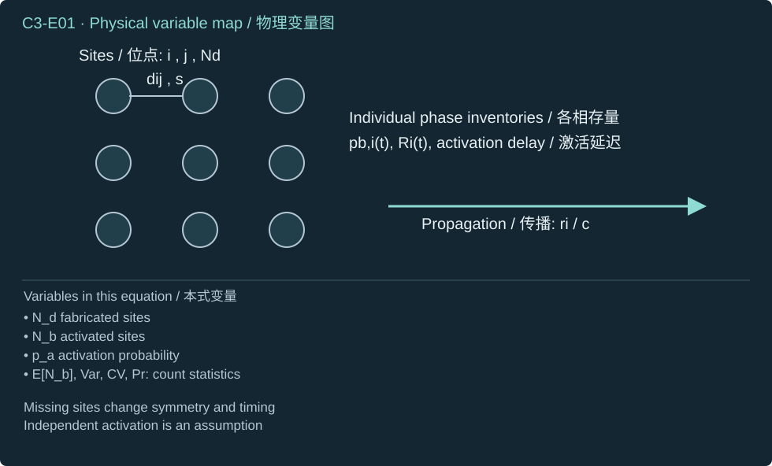

Count reproducibility and complete activation are different tests.

数量重复性与全部激活是不同检验。

For 25 sites and activation probability 0.95, the mean count is 23.75 and relative standard deviation is 4.588%. Nevertheless, complete activation occurs with probability 0.27739. This calculation assumes independent Bernoulli trials; common heating and mechanical feedback can invalidate it. Counting bubbles alone does not verify a fully actuated, symmetric load.

25 个位点、激活概率 0.95 时，平均数量为 23.75，相对标准差为 4.588%。然而全部激活概率仅为 0.27739。该计算假设独立 Bernoulli 试验；共同加热及力学反馈可破坏这一假设。仅统计气泡数量不能核验完全激活的对称载荷。

**Symbols before Eq. (C3-E02).**

**式（C3-E02）前的符号定义。**

| First individual definition / 第一项单独定义 | Second individual definition / 第二项单独定义 |
| --- | --- |
| $F(r)$ is Gaussian pulse fluence at radial distance $r$ (J m⁻²) $F(r)$ 是径向距离 $r$ 处的 Gaussian 脉冲通量（J m⁻²） | $F_0>0$ is central fluence (J m⁻²) $F_0>0$ 为中心通量（J m⁻²） |
| $R_A>0$ encloses the array (m) $R_A>0$ 包围阵列（m） | $w>0$ is the Gaussian 1/e² radius (m) $w>0$ 为 Gaussian 的 1/e² 半径（m） |
| $\epsilon\in(0,1)$ is allowed fractional edge decrease (dimensionless) $\epsilon\in(0,1)$ 是允许的边缘相对降低量（无量纲） | $r$ — Transverse distance from the laser axis (m) $r$ — 到激光轴线的横向距离（m） |

**Conventions and conditions.** $\exp$ and $\ln$ are exponential and natural logarithm of dimensionless arguments.

**约定与条件。** $\exp$、$\ln$ 分别为无量纲自变量的指数及自然对数。

(C3-E02) · Derived optical-uniformity condition

$$
\frac{F(R_A)}{F_0}=\exp(-2R_A^2/w^2)\ge1-\epsilon\ \Longrightarrow\ w^2\ge\frac{2R_A^2}{-\ln(1-\epsilon)}\ \Longrightarrow\ w\ge R_A\sqrt{\frac{2}{-\ln(1-\epsilon)}}.
$$

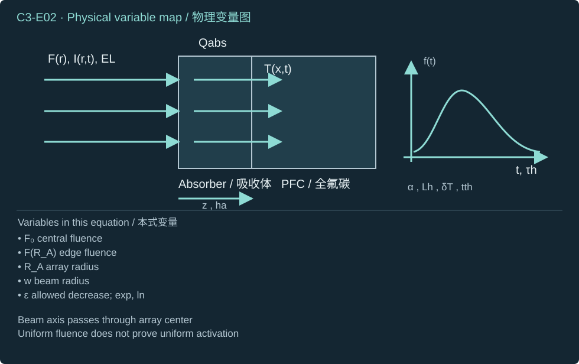

An optical condition can be checked before solving cavity mechanics.

求解腔体力学前即可检验光学条件。

Taking logarithms preserves order because the logarithm is increasing. Multiplying by minus one reverses the inequality; the denominator is positive because the allowed decrease lies between zero and one. A 10% decrease requires a beam radius at least 4.35688 times the enclosing array radius. Increasing beam width can improve uniformity while increasing energy deposited outside the array. This does not determine the absorbed energy at individual cores.

对数单调递增，因此取对数保持不等号方向；乘以负一使不等号反向。允许降低量位于零与一之间，故分母为正。允许降低 10% 时，束半径至少为包围阵列半径的 4.35688 倍。增大束宽可以改善均匀性，同时增加阵列外能量沉积。该条件并不确定各芯部吸收的能量。

## 2. Derive the first bubble–bubble interaction from the velocity potential

## 2. 从速度势推导首阶气泡相互作用

Step 2 — use incompressibility to obtain one source. At a distance from a fixed spherical center, radial volume flux is constant over concentric spheres. Integrate the velocity radially and choose zero potential at infinity. For another well-separated center the source potential is almost spatially uniform over that bubble. Its fixed-position time derivative supplies the leading surrounding-pressure correction through unsteady Bernoulli.

步骤 2——利用不可压缩性得到单个源。在距固定球形中心的不同位置，同心球面上的径向体积流率相同。对速度作径向积分，并取无穷远速度势为零。对另一个充分分离的中心，该源势在目标气泡表面近乎空间均匀。通过非定常 Bernoulli，其固定位置时间导数提供首阶周围压力修正。

**Symbols before Eq. (C3-E03).**

**式（C3-E03）前的符号定义。**

| First individual definition / 第一项单独定义 | Second individual definition / 第二项单独定义 |
| --- | --- |
| $j$ labels the emitting bubble (dimensionless) $j$ 标记发射气泡（无量纲） | $i\ne j$ a receiving center (dimensionless) $i\ne j$ 标记接收中心（无量纲） |
| $R_j(t)>0$ — Time-dependent radius of source bubble j (m) $R_j(t)>0$ — 源气泡 j 的随时间变化半径（m） | $r_j\ge R_j$ — Radial distance from the center of source bubble j (m) $r_j\ge R_j$ — 到源气泡 j 中心的径向距离（m） |
| $t$ is time (s) $t$ 为时间（s） | $\dot R_j$ — Wall radial velocity of source bubble j (m s⁻¹) $\dot R_j$ — 源气泡 j 的壁面径向速度（m s⁻¹） |
| $\ddot R_j$ — Wall radial acceleration of source bubble j (m s⁻²) $\ddot R_j$ — 源气泡 j 的壁面径向加速度（m s⁻²） | $u_j$ is radial velocity (m s⁻¹) $u_j$ 为径向速度（m s⁻¹） |
| $\phi_j$ is velocity potential (m² s⁻¹) $\phi_j$ 为速度势（m² s⁻¹） | $\pi$ is dimensionless $\pi$ 无量纲 |
| $d_{ij}>0$ — Fixed separation between source j and observation center i (m) $d_{ij}>0$ — 源 j 与观察中心 i 之间的固定距离（m） | $\xi$ — Dummy radial integration coordinate (m) $\xi$ — 径向积分哑坐标（m） |

**Conventions and conditions.** $\partial_t$ holds position fixed; $\int$ is radial integration, $\infty$ the zero-potential far field.

**约定与条件。** $\partial_t$ 保持位置固定；$\int$ 为径向积分，$\infty$ 为速度势为零的远场。

(C3-E03) · Continuity and potential integration

$$
\begin{aligned}4\pi r_j^2u_j(r_j,t)&=4\pi R_j^2\dot R_j,\\ \phi_j(r_j,t)&=\int_{\infty}^{r_j}\frac{R_j^2\dot R_j}{\xi^2}\,d\xi=-\frac{R_j^2\dot R_j}{r_j},\\ \partial_t\phi_j\big|_{r_j=d_{ij}}&=-\frac{2R_j\dot R_j^2+R_j^2\ddot R_j}{d_{ij}}.\end{aligned}
$$

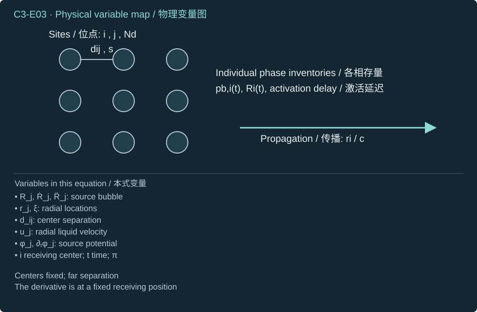

A moving spherical volume produces a monopole potential.

运动球体体积产生单极子速度势。

**Symbols before Eq. (C3-E04).**

**式（C3-E04）前的符号定义。**

| First individual definition / 第一项单独定义 | Second individual definition / 第二项单独定义 |
| --- | --- |
| $i$ — Bubble index over the declared activated sources (dimensionless) $i$ — 遍历声明的已激活源的气泡指标（无量纲） | $j$ — Bubble index over the declared activated sources (dimensionless) $j$ — 遍历声明的已激活源的气泡指标（无量纲） |
| $p'_{j\to i}$ is source $j$'s pressure disturbance at $i$ (Pa) $p'_{j\to i}$ 是源 $j$ 在 $i$ 处的压力扰动（Pa） | $p_{\mathrm{ext},i}$ external pressure (Pa) $p_{\mathrm{ext},i}$ 为外压（Pa） |
| $p_\infty$ remote pressure (Pa) $p_\infty$ 为远场压力（Pa） | $\rho$ is constant carrier density (kg m⁻³) $\rho$ 为恒定载液密度（kg m⁻³） |
| $\phi_j$ is potential (m² s⁻¹) $\phi_j$ 为速度势（m² s⁻¹） | $t$ is time (s), $\partial_t$ its fixed-position derivative $t$ 为时间（s），$\partial_t$ 为固定位置导数 |
| $R_j$ — Radius of source bubble j (m) $R_j$ — 源气泡 j 的半径（m） | $d_{ij}$ — Bubble-center separation (m) $d_{ij}$ — 气泡中心间距（m） |
| $N_b$ — Activated-bubble count (dimensionless) $N_b$ — 已激活气泡数（无量纲） |  |

**Conventions and conditions.** $\sum_{j\ne i}$ adds all other sources; $\simeq$ marks the leading far-separated approximation; $i\ne j$; each index runs from 1 to $N_b$; Newton dots on a radius denote its time derivatives..

**约定与条件。** $\sum_{j\ne i}$ 对其他源求和；$\simeq$ 表示充分分离时的首阶近似；$i\ne j$；每个指标从 1 遍历至 $N_b$；半径上的牛顿点号表示其时间导数。。

(C3-E04) · Leading unsteady-Bernoulli approximation

$$
p'_{j\to i}\simeq-\rho\partial_t\phi_j(d_{ij},t)=\frac{\rho}{d_{ij}}(R_j^2\ddot R_j+2R_j\dot R_j^2),\qquad p_{\mathrm{ext},i}\simeq p_\infty+\sum_{j\ne i}p'_{j\to i}.
$$

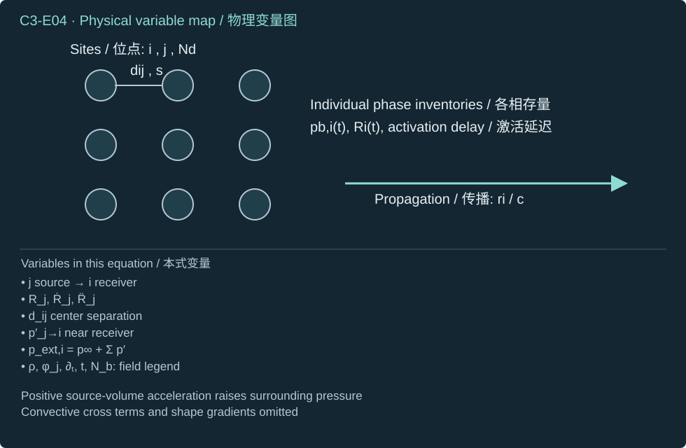

The correction changes surrounding pressure; it is not a new energy reservoir.

该修正改变周围压力，并不增加新的能量库。

The product rule supplies both terms in the numerator; keeping only the radius acceleration would be inconsistent. Each term divided by separation has unit m² s⁻², which density converts to pressure. The omitted squared-speed Bernoulli term, nonuniform pressure over the receiver, translation and reflected fields must remain small. Positive volume acceleration raises surrounding pressure; the correction can have either sign during a full event. A pressure-lowered surface-cavitation experiment shows shielding and later collapse of interior bubbles, with spherical modeling failing during final jetting. That is a relevant interaction benchmark, not a laser-PFC calibration. [Bremond et al. (2006)](https://doi.org/10.1103/PhysRevLett.96.224501)

分子两项均由乘积法则产生；仅保留半径加速度项不自洽。各项除以间距后单位为 m² s⁻²，再乘密度即为压力。被忽略的 Bernoulli 速度平方项、接收泡上的非均匀压力、平移及反射场必须足够小。体积正加速度升高周围压力；完整事件中修正可以取两种符号。降压表面空化实验显示内部气泡受到屏蔽并延迟塌缩，最终射流阶段球形模型失效。它是相关相互作用对照，而非激光 PFC 标定。[Bremond 等（2006）](https://doi.org/10.1103/PhysRevLett.96.224501)

**Symbols before Eq. (C3-E05).**

**式（C3-E05）前的符号定义。**

| First individual definition / 第一项单独定义 | Second individual definition / 第二项单独定义 |
| --- | --- |
| $i$ — Bubble index over the declared activated sources (dimensionless) $i$ — 遍历声明的已激活源的气泡指标（无量纲） | $j$ — Bubble index over the declared activated sources (dimensionless) $j$ — 遍历声明的已激活源的气泡指标（无量纲） |
| $R_i$ — Radius of bubble i (m) $R_i$ — 气泡 i 的半径（m） | $R_j$ — Radius of source bubble j (m) $R_j$ — 源气泡 j 的半径（m） |
| $d_{ij}>0$ — Bubble-center separation (m) $d_{ij}>0$ — 气泡中心间距（m） | $p_{b,i}$ is bubble $i$'s internal pressure (Pa) $p_{b,i}$ 为第 $i$ 个气泡内压（Pa） |
| $p_\infty$ remote pressure (Pa) $p_\infty$ 为远场压力（Pa） | $\sigma_b$ is bubble–carrier tension (N m⁻¹) $\sigma_b$ 为泡—载液张力（N m⁻¹） |
| $\mu$ carrier dynamic viscosity (Pa s) $\mu$ 为载液动力黏度（Pa s） | $\rho$ carrier density (kg m⁻³) $\rho$ 为载液密度（kg m⁻³） |
| $B_i$ is the isolated radial driving expression (m² s⁻²) $B_i$ 为孤立泡径向驱动表达式（m² s⁻²） | $\dot R_j$ — Wall radial velocity of source bubble j (m s⁻¹) $\dot R_j$ — 源气泡 j 的壁面径向速度（m s⁻¹） |
| $\ddot R_j$ — Wall radial acceleration of source bubble j (m s⁻²) $\ddot R_j$ — 源气泡 j 的壁面径向加速度（m s⁻²） | $\dot R_i$ — Wall radial velocity of bubble i (m s⁻¹) $\dot R_i$ — 气泡 i 的壁面径向速度（m s⁻¹） |
| $\ddot R_i$ — Wall radial acceleration of bubble i (m s⁻²) $\ddot R_i$ — 气泡 i 的壁面径向加速度（m s⁻²） |  |

**Conventions and conditions.** $\sum_{j\ne i}$ sums other sources; Every term has unit m² s⁻².

**约定与条件。** $\sum_{j\ne i}$ 对其他源求和；各项单位均为 m² s⁻²。

(C3-E05) · Coupled spherical approximation

$$
\begin{aligned}R_i\ddot R_i+\frac32\dot R_i^2+\sum_{j\ne i}\frac{R_j^2\ddot R_j+2R_j\dot R_j^2}{d_{ij}}&=B_i,\\ B_i&=\frac{p_{b,i}-p_\infty-2\sigma_b/R_i-4\mu\dot R_i/R_i}{\rho}.\end{aligned}
$$

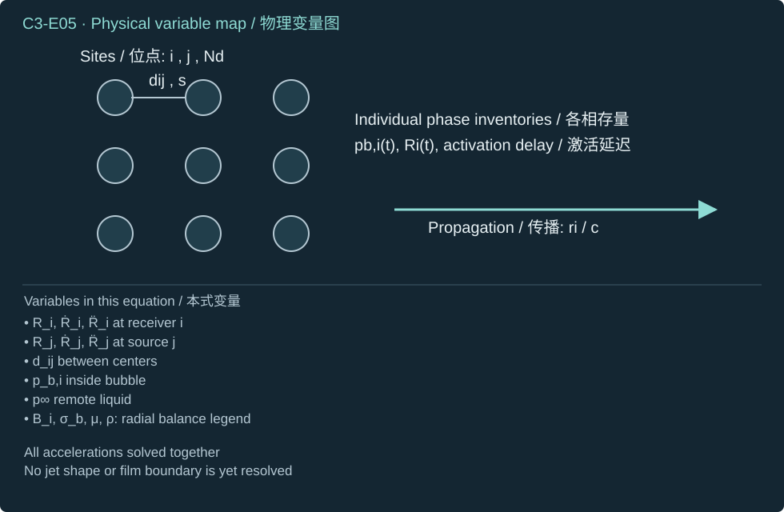

Substitute the corrected external pressure into each radial balance.

将修正外压代入各径向平衡。

Step 3 — move the neighbor-pressure term to the left, producing Eq. (C3-E05). This is a coupled acceleration system, not a collection of isolated trajectories followed by multiplying their pressures. The phase-pressure law still belongs to each individual site. Taking separations to infinity removes the interaction terms and recovers the single-bubble equation. Taking radii comparable to separation violates the approximation even if the formula can still be evaluated numerically.

步骤 3——将邻泡压力项移至左侧，得到式（C3-E05）。这是耦合加速度系统，并非先各自求孤立轨迹，再相乘压力。相变压力规律仍属于各个位点。间距趋于无穷时相互作用项消失，还原单泡方程。半径与间距相当时，即使数值上仍可代入，近似也已失效。

## 3. Work the three-, four-, and five-bubble controls; then fix total energy

## 3. 求解三、四、五泡对照，再固定总能量

Step 4 — constrain identical cavities to a regular polygon, with identical initial data and pressure histories. Cyclic symmetry makes each neighbor-distance sum equal, permitting one shared radius. The following distance formula derives the sums instead of treating bubble count as a coefficient. Here pitch means neighboring-vertex distance, not polygon circumradius.

步骤 4——将相同腔体约束在正多边形顶点，采用相同初值与压力历程。循环对称使各点邻距和相等，从而允许统一半径。下式推导距离和，而不是把气泡数量当作系数。此处间距指相邻顶点距离，并非外接圆半径。

**Symbols before Eq. (C3-E06).**

**式（C3-E06）前的符号定义。**

| First individual definition / 第一项单独定义 | Second individual definition / 第二项单独定义 |
| --- | --- |
| $N\in\{3,4,5\}$ is regular-polygon bubble count (dimensionless) $N\in\{3,4,5\}$ 为正多边形气泡数（无量纲） | $k=1,\ldots,N-1$ counts steps from one vertex (dimensionless) $k=1,\ldots,N-1$ 为从一个顶点出发的步数（无量纲） |
| $s>0$ — Nearest-vertex array pitch (m) $s>0$ — 阵列相邻顶点间距（m） | $d_k>0$ — Bubble-center separation across k polygon steps (m) $d_k>0$ — 相隔 k 个多边形步长的气泡中心距离（m） |
| $S_N$ is the reciprocal-distance sum (m⁻¹) $S_N$ 为距离倒数和（m⁻¹） | $\varphi_g$ is the dimensionless golden ratio $\varphi_g$ 为无量纲黄金比 |
| $\pi$ — Circle constant (dimensionless) $\pi$ — 圆周率（无量纲） |  |

**Conventions and conditions.** $k$-step center distances (m); $\sin$ takes angles in radians; $\sum$ sums the stated polygon steps; $k$ runs from 1 to $N-1$..

**约定与条件。** $\sin$ 的角度采用弧度；$\sum$ 对规定步数求和；$\sum$ 对规定多边形步数求和；$k$ 从 1 遍历至 $N-1$。。

(C3-E06) · Exact polygon geometry

$$
\begin{aligned}d_k&=s\frac{\sin(k\pi/N)}{\sin(\pi/N)},\qquad S_N=\sum_{k=1}^{N-1}\frac1{d_k},\\ S_3&=\frac2s,\qquad S_4=\frac{2+1/\sqrt2}{s},\qquad S_5=\frac{2+2/\varphi_g}{s},\quad\varphi_g=\frac{1+\sqrt5}{2}.\end{aligned}
$$

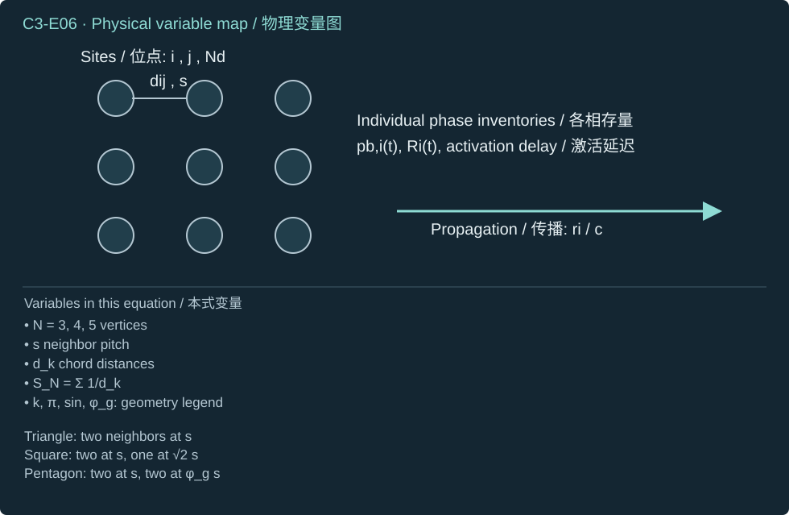

Equal geometric sums justify a shared radial trajectory in this constrained control.

相同几何和使这一约束对照可采用共同径向轨迹。

**Symbols before Eq. (C3-E07).**

**式（C3-E07）前的符号定义。**

| First individual definition / 第一项单独定义 | Second individual definition / 第二项单独定义 |
| --- | --- |
| $p_\infty$ — Constant Remote carrier pressure (Pa) $p_\infty$ — 恒定的远场载液压力（Pa） | $p_b$ — Constant Uniform internal bubble pressure in the stated control (Pa) $p_b$ — 恒定的指定对照中的均匀气泡内部压力（Pa） |
| $\Delta p_c>0$ their collapse-driving difference (Pa) $\Delta p_c>0$ 为其塌缩驱动压差（Pa） | $S=S_N\ge0$ is the fixed reciprocal-distance sum (m⁻¹) $S=S_N\ge0$ 为固定距离倒数和（m⁻¹） |
| $R(t)>0$ — Shared time-dependent bubble radius (m) $R(t)>0$ — 共同的随时间变化气泡半径（m） | $R_{\max}>0$ — Maximum bubble radius (m) $R_{\max}>0$ — 最大气泡半径（m） |
| $t=0$ the initial time (s) $t=0$ 为初始时刻（s） | $\rho>0$ is carrier density (kg m⁻³) $\rho>0$ 为载液密度（kg m⁻³） |
| $SR$ is dimensionless $SR$ 无量纲 | $\dot R$ — Bubble-wall radial velocity (m s⁻¹) $\dot R$ — 气泡壁面径向速度（m s⁻¹） |
| $\ddot R$ — Bubble-wall radial acceleration (m s⁻²) $\ddot R$ — 气泡壁面径向加速度（m s⁻²） |  |

**Conventions and conditions.** Dots are time derivatives; Surface tension and viscosity are omitted in this ideal control.

**约定与条件。** 点为时间导数；本理想对照忽略表面张力及黏度。

(C3-E07) · Symmetric constant-pressure collapse control

$$
\begin{aligned}\Delta p_c&=p_\infty-p_b>0,\qquad S=S_N,\\ (1+SR)R\ddot R+\left(\frac32+2SR\right)\dot R^2&=-\frac{\Delta p_c}{\rho},\qquad R(0)=R_{\max},\quad\dot R(0)=0.\end{aligned}
$$

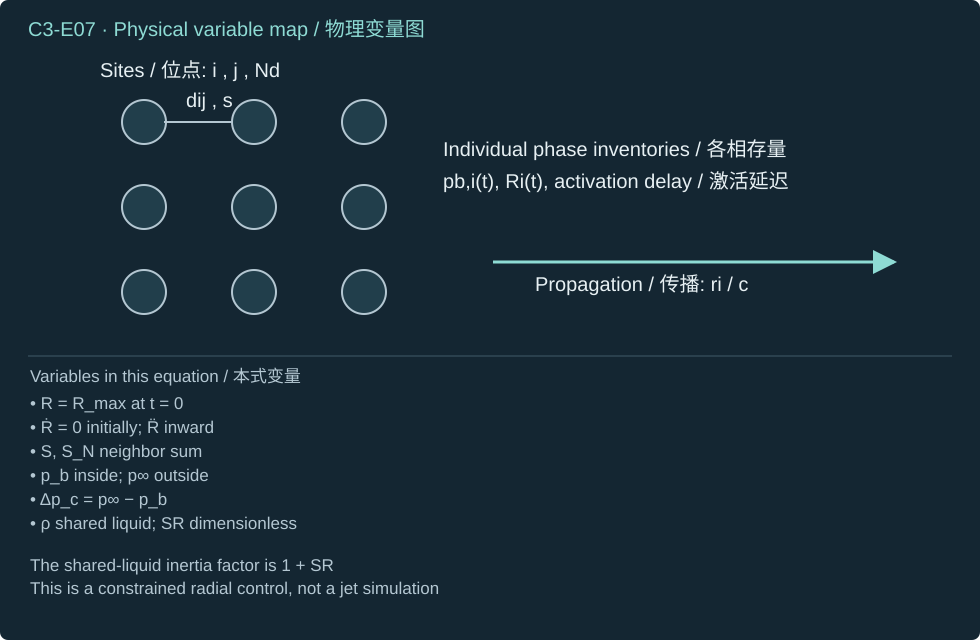

Substitution of the common radius collects the two interaction contributions.

代入共同半径后合并两种相互作用贡献。

Step 5 — solve the reduced equation on the inward branch. Away from the initial turning point, introduce squared wall speed as a function of radius. Its derivative is twice wall acceleration by the chain rule. The resulting linear equation has integrating factor proportional to radius cubed times the interaction factor; the logarithmic derivatives shown below establish that choice. The solution extends continuously to the initial zero-speed point.

步骤 5——求解缩小分支。离开初始转折点后，将壁速平方视为半径的函数。链式法则使其半径导数等于两倍壁加速度。所得线性方程的积分因子正比于半径三次方乘相互作用因子；下示对数导数证明这一选择。解连续延伸至初始零速度点。

**Symbols before Eq. (C3-E08).**

**式（C3-E08）前的符号定义。**

| First individual definition / 第一项单独定义 | Second individual definition / 第二项单独定义 |
| --- | --- |
| $y(R)\ge0$ is squared wall speed (m² s⁻²) $y(R)\ge0$ 为壁速平方（m² s⁻²） | $y'=dy/dR$ (m s⁻²) $y'=dy/dR$（m s⁻²） |
| $R>0$ is radius (m) and dots its time derivatives $R>0$ 为半径（m），点表示其时间导数 | $S\ge0$ is neighbor sum (m⁻¹) $S\ge0$ 为邻距和（m⁻¹） |
| $\rho>0$ density (kg m⁻³) $\rho>0$ 为密度（kg m⁻³） | $\Delta p_c>0$ pressure difference (Pa) $\Delta p_c>0$ 为压差（Pa） |
| $\ell_*>0$ is an arbitrary constant reference length (m), inserted solely to make the logarithm dimensionless $\ell_*>0$ 为任意恒定参考长度（m），仅用来使对数无量纲，并在积分因子中抵消 | $\dot R$ — Bubble-wall radial velocity (m s⁻¹) $\dot R$ — 气泡壁面径向速度（m s⁻¹） |
| $\ddot R$ — Bubble-wall radial acceleration (m s⁻²) $\ddot R$ — 气泡壁面径向加速度（m s⁻²） |  |

**Conventions and conditions.** it cancels from the integrating factor; $\ln$ is natural logarithm; $d/dR$ differentiates in radius; Division by $\dot R$ is used only on the moving branch.

**约定与条件。** $\ln$ 为自然对数；$d/dR$ 对半径求导；仅在运动分支除以 $\dot R$。

(C3-E08) · Chain rule and integrating-factor derivation

$$
\begin{aligned}y(R)&=\dot R^2,\quad \frac{dy}{dR}=\frac{2\dot R\ddot R}{\dot R}=2\ddot R\quad(\dot R\ne0),\\ y'+\frac{3+4SR}{R(1+SR)}y&=-\frac{2\Delta p_c}{\rho R(1+SR)},\\ \frac{3+4SR}{R(1+SR)}&=\frac3R+\frac S{1+SR}=\frac{d}{dR}\ln[R^3(1+SR)/\ell_*^3],\\ \frac{d}{dR}\left[R^3(1+SR)y\right]&=-\frac{2\Delta p_c}{\rho}R^2.\end{aligned}
$$

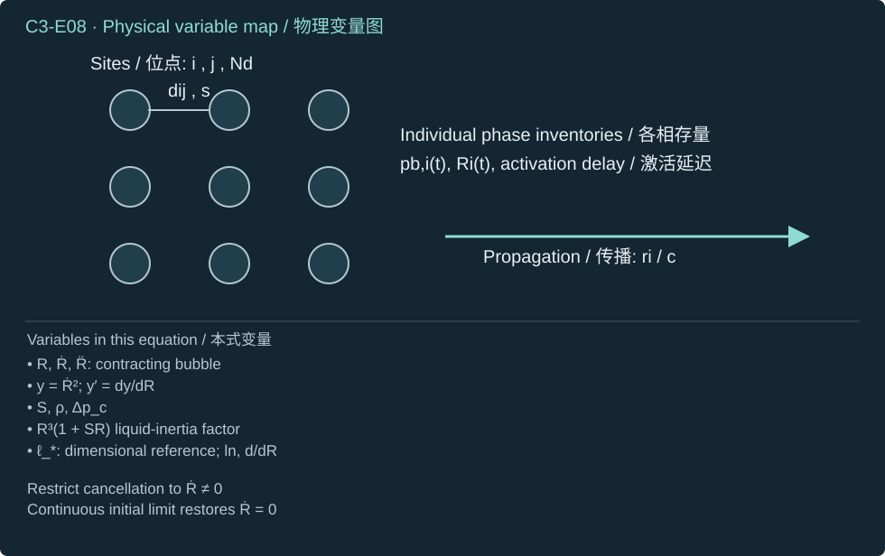

Every term of the integrating factor can be reconstructed from the radial equation.

积分因子的每一项均可从径向方程重构。

**Symbols before Eq. (C3-E09).**

**式（C3-E09）前的符号定义。**

| First individual definition / 第一项单独定义 | Second individual definition / 第二项单独定义 |
| --- | --- |
| $R\in(0,R_{\max}]$ — Shared instantaneous bubble radius (m) $R\in(0,R_{\max}]$ — 共同瞬时气泡半径（m） | $R_{\max}$ — Maximum bubble radius (m) $R_{\max}$ — 最大气泡半径（m） |
| $\xi$ is dummy radius (m), dots radius time derivatives $\xi$ 为积分半径（m），点为半径时间导数 | $y=\dot R^2$ (m² s⁻²) $y=\dot R^2$（m² s⁻²） |
| $S\ge0$ neighbor sum (m⁻¹) $S\ge0$ 为邻距和（m⁻¹） | $\rho>0$ density (kg m⁻³) $\rho>0$ 为密度（kg m⁻³） |
| $\Delta p_c>0$ pressure difference (Pa) $\Delta p_c>0$ 为压差（Pa） | $\dot R$ — Bubble-wall radial velocity (m s⁻¹) $\dot R$ — 气泡壁面径向速度（m s⁻¹） |
| $\ddot R$ — Bubble-wall radial acceleration (m s⁻²) $\ddot R$ — 气泡壁面径向加速度（m s⁻²） |  |

**Conventions and conditions.** Brackets mean upper minus lower endpoint, $\int$ definite integration and $\sqrt{\ }$ the nonnegative root; the explicit minus sign selects collapse.

**约定与条件。** 方括号表示上端减下端，$\int$ 为定积分，$\sqrt{\ }$ 取非负根；显式负号选择塌缩。

(C3-E09) · Integrated solution on the inward branch

$$
\begin{aligned}[R^3(1+SR)y]_{R_{\max}}^R&=-\frac{2\Delta p_c}{\rho}\int_{R_{\max}}^R\xi^2d\xi=\frac{2\Delta p_c}{3\rho}(R_{\max}^3-R^3),\\ \dot R^2&=\frac{2\Delta p_c}{3\rho}\frac{R_{\max}^3-R^3}{R^3(1+SR)},\qquad \dot R=-\sqrt{\frac{2\Delta p_c}{3\rho}\frac{R_{\max}^3-R^3}{R^3(1+SR)}}.\end{aligned}
$$

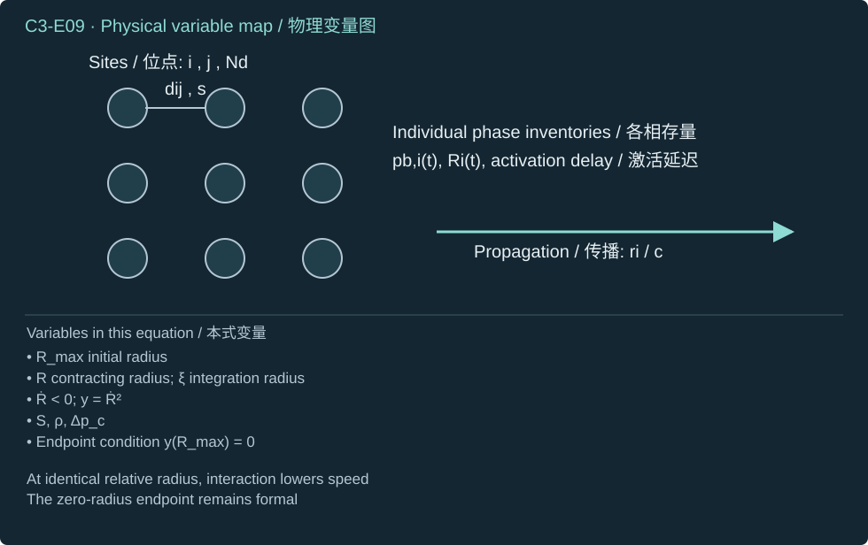

The initial condition removes the integration constant and the physical branch fixes the sign.

初值消去积分常数，物理分支固定符号。

**Symbols before Eq. (C3-E10).**

**式（C3-E10）前的符号定义。**

| First individual definition / 第一项单独定义 | Second individual definition / 第二项单独定义 |
| --- | --- |
| $t_c$ is formal collapse time (s) $t_c$ 为形式塌缩时间（s） | $R$ — Shared instantaneous bubble radius (m) $R$ — 共同瞬时气泡半径（m） |
| $R_{\max}>0$ — Maximum bubble radius (m) $R_{\max}>0$ — 最大气泡半径（m） | $\dot R$ wall velocity (m s⁻¹), $\|\ \|$ absolute value $\dot R$ 为壁速（m s⁻¹），$\|\ \|$ 为绝对值 |
| $\rho$ is density (kg m⁻³) $\rho$ 为密度（kg m⁻³） | $\Delta p_c>0$ pressure difference (Pa) $\Delta p_c>0$ 为压差（Pa） |
| $S\ge0$ neighbor sum (m⁻¹) $S\ge0$ 为邻距和（m⁻¹） | $x\in[0,1]$ is dimensionless integration radius $x\in[0,1]$ 为无量纲积分半径 |
| $\chi\ge0$ interaction strength (dimensionless) $\chi\ge0$ 为相互作用强度（无量纲） | $C$ — Collapse-time coefficient as a function of interaction strength (dimensionless) $C$ — 相互作用强度的塌缩时间系数函数（无量纲） |
| $C'=dC/d\chi$ — Derivative of that coefficient with respect to interaction strength (dimensionless) $C'=dC/d\chi$ — 该系数对相互作用强度的导数（无量纲） |  |

**Conventions and conditions.** integrals are convergent improper integrals at $x=1$.

**约定与条件。** 积分在 $x=1$ 处为收敛广义积分。

(C3-E10) · Collapse-time quadrature and sign check

$$
\begin{aligned}t_c&=\int_0^{R_{\max}}\frac{dR}{|\dot R|}=R_{\max}\sqrt{\frac{\rho}{\Delta p_c}}\,C(\chi),\quad x=R/R_{\max},\quad\chi=SR_{\max},\\ C(\chi)&=\sqrt{\frac32}\int_0^1\sqrt{\frac{x^3(1+\chi x)}{1-x^3}}\,dx,\\ C'(\chi)&=\frac12\sqrt{\frac32}\int_0^1\frac{x^{5/2}}{\sqrt{(1-x^3)(1+\chi x)}}\,dx>0\quad(\chi\ge0).\end{aligned}
$$

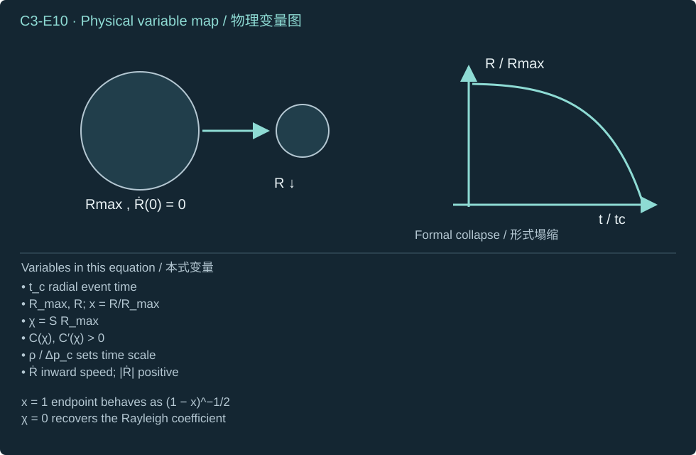

Shared-liquid interaction increases this constrained collapse time.

共享液体相互作用使这一约束塌缩时间增加。

At the upper endpoint the integrand is proportional to the inverse square root of the distance to the endpoint, so it is integrable. The differentiated integrand is positive and has the same integrable endpoint form, justifying both differentiation and monotonicity. For zero interaction, substitution of cubed radius reproduces the Chapter 1 Rayleigh coefficient 0.9146813565. Numerical quadrature for radius 30 μm, pitch 200 μm, density 1000 kg m⁻³ and pressure difference 100 kPa yields the following controls. Maximum radius divided by nearest distance is 0.15: a leading approximation, not an error-certified exact prediction.

上端积分函数正比于距端点距离的负二分之一次方，因此可积。求导后积分函数为正，并保持同一可积端点形式，从而支持交换求导与积分及单调性。零相互作用时，以半径三次方作变量代换，还原第一章 Rayleigh 系数 0.9146813565。对半径 30 μm、间距 200 μm、密度 1000 kg m⁻³、压差 100 kPa 作数值积分，得到下列对照。最大半径与最近距离之比为 0.15：属于首阶近似，并非有误差保证的精确预测。

| Configuration 构型 | $\chi$ $\chi$ | $C(\chi)$ $C(\chi)$ | Formal time (μs) 形式时间（μs） |
| --- | --- | --- | --- |
| Isolated 孤立 | 0 0 | 0.914681 0.914681 | 2.744044 2.744044 |
| Triangle 正三角形 | 0.300000 0.300000 | 1.019836 1.019836 | 3.059509 3.059509 |
| Square 正方形 | 0.406066 0.406066 | 1.054396 1.054396 | 3.163188 3.163188 |
| Pentagon 正五边形 | 0.485410 0.485410 | 1.079497 1.079497 | 3.238492 3.238492 |

Step 6 — verify the shared-liquid kinetic energy, including the pair cross terms. Green's identity converts an interaction integral to the emitting bubble boundary; the outward normal of the liquid points into the cavity. A positive outward bubble velocity therefore gives a negative liquid-normal derivative. Multiplying two negative boundary factors makes the cross contribution positive for synchronized motion.

步骤 6——核验包含两泡交叉项的共享液体动能。Green 恒等式将相互作用积分转换至发射泡边界；液体外法向指入腔体。因此向外的正泡壁速度对应负的液体法向导数。两个负的边界因子相乘，使同步运动的交叉贡献为正。

**Symbols before Eq. (C3-E11).**

**式（C3-E11）前的符号定义。**

| First individual definition / 第一项单独定义 | Second individual definition / 第二项单独定义 |
| --- | --- |
| $K_N$ is leading cluster liquid kinetic energy (J) $K_N$ 为首阶气泡群液体动能（J） | $N$ count (dimensionless) $N$ 为数量（无量纲） |
| $i$ — Index of the bubble being evaluated (dimensionless) $i$ — 当前评估气泡的编号（无量纲） | $j$ — Index of a neighboring bubble (dimensionless) $j$ — 相邻气泡的编号（无量纲） |
| $R_i$ — Radius of bubble i (m) $R_i$ — 气泡 i 的半径（m） | $R_j$ — Radius of source bubble j (m) $R_j$ — 源气泡 j 的半径（m） |
| $r_i$ radial distance from $i$ (m) $r_i$ 为至 $i$ 的径距（m） | $d_{ij}$ center separation (m) $d_{ij}$ 为中心间距（m） |
| $R$ common radius (m) $R$ 为共同半径（m） | $R_{\max}$ its initial maximum (m) $R_{\max}$ 为其初始最大值（m） |
| $R_{\max,N}$ fixed-total-work maximum (m) $R_{\max,N}$ 为固定总做功最大半径（m） | $R_*$ isolated reference radius (all m) $R_*$ 为孤立参考半径（均为 m） |
| $b_i=R_i^2\dot R_i$ — Volume-source strength of bubble i (m³ s⁻¹) $b_i=R_i^2\dot R_i$ — 气泡 i 的体积源强度（m³ s⁻¹） | $b_j=R_j^2\dot R_j$ — Volume-source strength of bubble j (m³ s⁻¹) $b_j=R_j^2\dot R_j$ — 气泡 j 的体积源强度（m³ s⁻¹） |
| $\phi_i$ — Velocity potential of source bubble i (m² s⁻¹) $\phi_i$ — 源气泡 i 的速度势（m² s⁻¹） | $\phi_j$ — Velocity potential of source bubble j (m² s⁻¹) $\phi_j$ — 源气泡 j 的速度势（m² s⁻¹） |
| $\Omega$ liquid domain (—) $\Omega$ 为液体域（—） | $\Gamma_j$ bubble boundary (—) $\Gamma_j$ 为泡边界（—） |
| $dV$ — Volume integration element (m³) $dV$ — 体积积分微元（m³） | $dA$ — Area integration element (m²) $dA$ — 面积积分微元（m²） |
| $dr_i$ — Radial integration element from center i (m) $dr_i$ — 以中心 i 为原点的径向积分微元（m） | $S$ equal reciprocal-distance sum (m⁻¹) $S$ 为相同距离倒数和（m⁻¹） |
| $\rho$ density (kg m⁻³) $\rho$ 为密度（kg m⁻³） | $\Delta p_c$ pressure difference (Pa) $\Delta p_c$ 为压差（Pa） |
| $E_{B,\mathrm{tot}}$ fixed initial work (J) $E_{B,\mathrm{tot}}$ 为固定初始做功（J） | $\pi$ dimensionless $\pi$ 无量纲 |

**Conventions and conditions.** dots are time derivatives; $\nabla$ gradient, $\partial_n$ liquid-outward normal derivative; $i<j$ counts each unordered pair once; $|\ |$ is vector norm and $\infty$ the far radial endpoint; Far separation justifies retaining self and leading pair integrals; $*$ labels a reference.

**约定与条件。** 点为时间导数；$\nabla$ 为梯度，$\partial_n$ 为液体外法向导数；$i<j$ 将各无序对计一次；$|\ |$ 为向量范数，$\infty$ 为径向远端；充分分离使保留自身及首阶两泡积分成立；$*$ 标记参考。

(C3-E11) · Leading-model energy check and fixed-total-work comparison

$$
\begin{aligned}b_i&=R_i^2\dot R_i,\quad \phi_i=-b_i/r_i,\quad K_N\simeq\frac{\rho}{2}\sum_{i,j=1}^{N}\int_\Omega\nabla\phi_i\cdot\nabla\phi_j\,dV,\\ \int_\Omega|\nabla\phi_i|^2\,dV&\simeq4\pi b_i^2\int_{R_i}^\infty r_i^{-2}\,dr_i=4\pi R_i^3\dot R_i^2,\\ \int_\Omega\nabla\phi_i\cdot\nabla\phi_j\,dV&\simeq\int_{\Gamma_j}\phi_i\partial_n\phi_j\,dA\simeq(-b_i/d_{ij})(-\dot R_j)4\pi R_j^2=\frac{4\pi b_ib_j}{d_{ij}}\quad(i\ne j),\\ K_N&\simeq2\pi\rho\sum_i R_i^3\dot R_i^2+4\pi\rho\sum_{i<j}\frac{b_ib_j}{d_{ij}}=2\pi\rho NR^3(1+SR)\dot R^2,\\ K_N&=\frac{4\pi N}{3}\Delta p_c(R_{\max}^3-R^3)\quad\text{in the leading symmetric model},\\ E_{B,\mathrm{tot}}&=N\frac{4\pi}{3}\Delta p_c R_{\max,N}^3=\frac{4\pi}{3}\Delta p_c R_*^3,\quad R_{\max,N}=R_*N^{-1/3}.\end{aligned}
$$

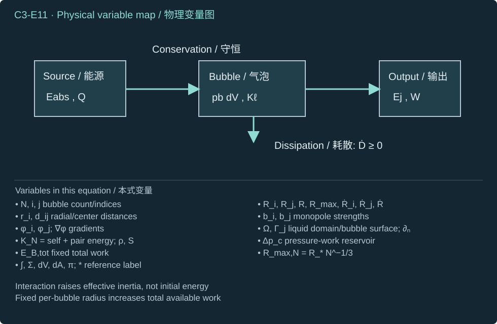

The integrated trajectory conserves the leading energy budget.

积分轨迹守恒首阶能量预算。

Integrating inverse squared radius gives the reciprocal lower radius because the far endpoint vanishes. The harmonic source from another bubble is nearly constant on the emitting surface, giving the shown pair integral. Ordered cross terms occur twice in the squared total gradient; unordered-pair notation supplies the coefficient four. For identical motion each bubble's reciprocal-distance sum is the same, so pair counting gives half the count times that sum. Substituting Eq. (C3-E09) cancels the interaction factor and equals released pressure work. At fixed total work take the positive cube root in the final row. With an isolated reference radius of 30 μm, three, four and five bubbles have radii 20.80084, 18.89882 and 17.54411 μm. At 200-μm pitch their formal times become 2.05687, 1.89946 and 1.77980 μs. Shorter time now reflects smaller cavities; it proves neither stronger jets nor optical-efficiency gain.

对半径负二次方积分，因远端为零，得到下端半径倒数。另一泡调和源在发射表面近乎恒定，得到所示两泡积分。总梯度平方中有序交叉项出现两次；无序对记号因此对应系数四。对相同运动，每泡倒距和相同，故两泡计数为数量乘该和再除以二。代入式（C3-E09）消去相互作用因子，等于释放的压力做功。固定总做功时，在最后一行取正立方根。孤立参考半径 30 μm 时，三、四、五泡半径分别为 20.80084、18.89882、17.54411 μm；间距 200 μm 时，形式时间分别为 2.05687、1.89946、1.77980 μs。此时时间变短源于腔体更小，并不证明射流更强或光学效率提高。

A center-and-four-arm cross is not a pentagon. If the arm length is the pitch, the center's reciprocal-distance sum is four divided by pitch; an outer site's sum is the sum of one, one half and the square root of two, divided by pitch. The different sums prevent an identical shared-radius history. Likewise, a large array needs an averaging length much larger than pitch and much smaller than macroscopic variation length before homogenization is justified; volume fraction alone does not supply that separation.

中心加四臂的十字并非正五边形。若臂长为间距，中心倒距和为四除以间距；外点倒距和为一、二分之一及根号二之和除以间距。不同距离和使相同共同半径历程无法维持。同理，大阵列需平均尺度远大于间距、远小于宏观变化尺度，才能支持均匀化；仅凭体积分数不能提供这种尺度分离。

**Symbols before Eq. (C3-E12).**

**式（C3-E12）前的符号定义。**

| First individual definition / 第一项单独定义 | Second individual definition / 第二项单独定义 |
| --- | --- |
| $\phi_b$ is dimensionless instantaneous bubble-volume fraction $\phi_b$ 为无量纲瞬时气泡体积分数 | $V_i$ bubble volume (m³) $V_i$ 为泡体积（m³） |
| $V_\Omega>0$ representative-region volume (m³) $V_\Omega>0$ 为代表区体积（m³） | $N_b$ bubble count (dimensionless) $N_b$ 为泡数（无量纲） |
| $R_i$ — Radius of bubble i (m) $R_i$ — 气泡 i 的半径（m） | $R$ — Shared instantaneous bubble radius (m) $R$ — 共同瞬时气泡半径（m） |
| $s$ — Nearest-vertex array pitch (m) $s$ — 阵列相邻顶点间距（m） | $\pi$ dimensionless $\pi$ 无量纲 |
| $\phi(\boldsymbol x,t)$ is weak far-field potential (m² s⁻¹) $\phi(\boldsymbol x,t)$ 为弱扰动远场势（m² s⁻¹） | $p'$ pressure disturbance (Pa) $p'$ 为压力扰动（Pa） |
| $\boldsymbol x$ observation position (m) $\boldsymbol x$ 为观察位置（m） | $t$ time (s) $t$ 为时间（s） |
| $r_i>0$ distance to source $i$ (m) $r_i>0$ 为至源 $i$ 的距离（m） | $c$ sound speed (m s⁻¹) $c$ 为声速（m s⁻¹） |
| $\rho$ density (kg m⁻³) $\rho$ 为密度（kg m⁻³） | $t-r_i/c$ is retarded time (s) $t-r_i/c$ 为延迟时间（s） |
| $\dot V_i$ — First time derivative of bubble-i volume (m³ s⁻¹) $\dot V_i$ — 气泡 i 体积的一阶时间导数（m³ s⁻¹） | $\ddot V_i$ — Second time derivative of bubble-i volume (m³ s⁻²) $\ddot V_i$ — 气泡 i 体积的二阶时间导数（m³ s⁻²） |
| $i$ — Index of the bubble being evaluated (dimensionless) $i$ — 当前评估气泡的编号（无量纲） |  |

**Conventions and conditions.** Dots on $V_i$ are volume time derivatives (m³ s⁻¹, m³ s⁻²); $\sum$ sums sources; $\simeq$ is a distant, compact, weak-source approximation.

**约定与条件。** $V_i$ 上的点为体积时间导数（m³ s⁻¹、m³ s⁻²）；$\sum$ 对源求和；$\simeq$ 为远距、紧致、弱源近似。

(C3-E12) · Volume-fraction definition and retarded monopole approximation

$$
\begin{aligned}\phi_b&=\frac{\sum_{i=1}^{N_b}V_i}{V_\Omega},\quad V_i=\frac{4\pi}{3}R_i^3,\quad\phi_b\big|_{\mathrm{cubic}}=\frac{4\pi R^3}{3s^3},\\ \phi(\boldsymbol x,t)&\simeq-\sum_i\frac{\dot V_i(t-r_i/c)}{4\pi r_i},\qquad p'(\boldsymbol x,t)\simeq\sum_i\frac{\rho}{4\pi r_i}\ddot V_i(t-r_i/c).\end{aligned}
$$

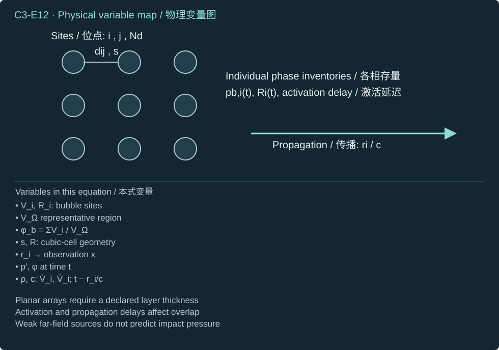

A spatial sum needs source histories and travel times, not only site count.

空间求和需要源历程及传播时间，不能只给位点数。

Step 7 — replace instantaneous source time by retarded time only in the weak, compact-source wave control. Differentiate the far-field potential at fixed observation position to obtain the pressure row. Instantaneous bubble-volume fraction differs from initial liquid-PFC loading; a planar array needs a stated layer thickness before assigning region volume. This is a propagation estimate, not a complete compressible interaction model. If neighbors alter the source histories, those histories must first be solved consistently. At 200 μm separation and 1480 m s⁻¹ sound speed, travel time is 0.13514 μs; it is short against a 3-μs radial control but not against an arbitrary nanosecond laser pressure pulse. Regular spacing does not remove edges, propagation delay or nonlinear shielding.

步骤 7——仅在弱扰动、紧致源波动对照中，以延迟时间替代瞬时源时间。在固定观察位置对远场势求导，得到压力行。瞬时气泡体积分数不同于初始液体 PFC 装载分数；平面阵列需先规定层厚度，再指定区域体积。它是传播估计，并非完整可压缩相互作用模型。若邻泡改变源历程，必须先自洽求解这些历程。200 μm 间距、1480 m s⁻¹ 声速时，传播时间为 0.13514 μs；相对于 3 μs 径向对照较短，却不能相对于任意纳秒激光压力脉冲宣称较短。规则间距无法消除边缘、传播延迟及非线性屏蔽。

## 4. Close spatial jet formation; pay for focusing with momentum and energy

## 4. 闭合空间射流形成，并核算聚焦的动量与能量

Step 8 — replace spherical radii by a resolved liquid domain when an outlet meniscus deforms or a re-entrant finger enters a cavity. A radial calculation supplies cavity scale and source timing, but has no directional jet shape. For an initially irrotational, inviscid, incompressible carrier over the inertial launch interval, introduce a velocity potential. Here the liquid interfaces are treated as material surfaces; appreciable simultaneous evaporation requires the Chapter 2 mass-flux jump instead of the following kinematic approximation.

步骤 8——当出口弯液面变形或再入液指进入腔体时，以已解析液体域替代球形半径。径向计算提供腔体尺度及源时序，却没有方向性射流形状。对惯性发射阶段初始无旋、无黏、不可压缩的载液，引入速度势。此处液体界面视为材料表面；若同时蒸发不可忽略，运动学近似必须改用第二章质量通量跳跃条件。

**Symbols before Eq. (C3-E13).**

**式（C3-E13）前的符号定义。**

| First individual definition / 第一项单独定义 | Second individual definition / 第二项单独定义 |
| --- | --- |
| $\boldsymbol u(\boldsymbol x,t)$ is velocity (m s⁻¹) $\boldsymbol u(\boldsymbol x,t)$ 为速度（m s⁻¹） | $\phi(\boldsymbol x,t)$ potential (m² s⁻¹) $\phi(\boldsymbol x,t)$ 为势（m² s⁻¹） |
| $\boldsymbol x$ spatial position (m) $\boldsymbol x$ 为空间位置（m） | $t$ time (s) $t$ 为时间（s） |
| $\Omega(t)$ the moving liquid domain (—) $\Omega(t)$ 为运动液体域（—） |  |

**Conventions and conditions.** $\nabla$, $\nabla\cdot$ and $\nabla^2$ are spatial gradient, divergence and Laplacian; the central dot is an actual contraction, not an equation separator.

**约定与条件。** $\nabla$、$\nabla\cdot$、$\nabla^2$ 为空间梯度、散度、Laplace 算子；中心点是真正缩并，并非方程分隔符。

(C3-E13) · Potential-flow reduction

$$
\boldsymbol u=\nabla\phi,\qquad \nabla\cdot\boldsymbol u=0\ \Longrightarrow\ \nabla^2\phi=0\quad\text{in }\Omega(t).
$$

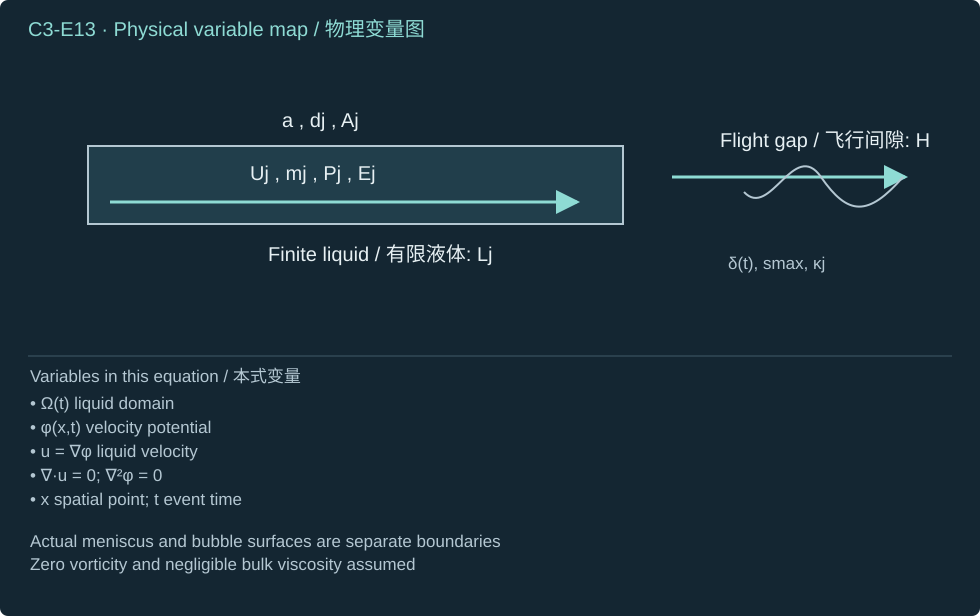

Geometry enters through the domain and its boundary conditions.

几何通过区域及边界条件进入。

**Symbols before Eq. (C3-E14).**

**式（C3-E14）前的符号定义。**

| First individual definition / 第一项单独定义 | Second individual definition / 第二项单独定义 |
| --- | --- |
| $\boldsymbol X$ is a material interface point (m) $\boldsymbol X$ 为材料界面点（m） | $t$ is time (s), $d/dt$ its trajectory derivative $t$ 为时间（s），$d/dt$ 为轨迹导数 |
| $\boldsymbol u$ is liquid velocity (m s⁻¹) $\boldsymbol u$ 为液速（m s⁻¹） | $\boldsymbol V_w$ prescribed wall velocity (m s⁻¹) $\boldsymbol V_w$ 为规定壁速（m s⁻¹） |
| $\boldsymbol n$ is outward from liquid toward gas or solid, unitless (dimensionless) $\boldsymbol n$ 从液体指向气体或固体，是无量纲单位法向（无量纲） | $V_n$ normal interface speed (m s⁻¹), $\partial_n\phi=\nabla\phi\cdot\boldsymbol n$ $V_n$ 为界面法向速度（m s⁻¹），$\partial_n\phi=\nabla\phi\cdot\boldsymbol n$ |
| $\phi$ potential (m² s⁻¹) $\phi$ 为势（m² s⁻¹） | $\Gamma$ is the complete moving interface (—) $\Gamma$ 为完整运动界面（—） |
| $\phi_\Gamma$ its potential (m² s⁻¹) $\phi_\Gamma$ 为其势（m² s⁻¹） | $\Gamma_0$ — Prescribed initial interface geometry (—) $\Gamma_0$ — 给定初始界面几何（—） |
| $\phi_0$ — Prescribed initial velocity potential (m² s⁻¹) $\phi_0$ — 给定初始速度势（m² s⁻¹） |  |

**Conventions and conditions.** Arrows indicate the stated far-field limit.

**约定与条件。** 箭头表示规定远场极限。

(C3-E14) · Kinematic, initial and wall conditions

$$
\begin{aligned}\frac{d\boldsymbol X}{dt}&=\boldsymbol u(\boldsymbol X,t),\quad V_n=\partial_n\phi,\quad \partial_n\phi=\boldsymbol V_w\cdot\boldsymbol n\quad\text{on walls},\\ (\Gamma,\phi_\Gamma)_{t=0}&=(\Gamma_0,\phi_0),\qquad \phi\to0\quad\text{in a quiescent far field}.\end{aligned}
$$

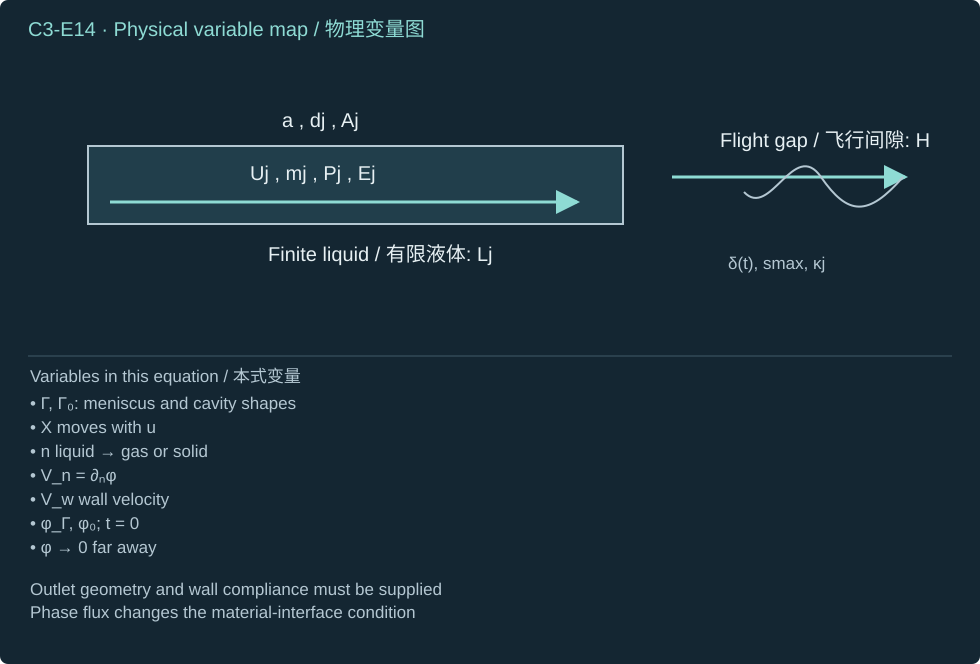

A potential equation without initial shape and wall data cannot predict a jet.

无初始形状及壁面数据的势方程无法预测射流。

**Symbols before Eq. (C3-E15).**

**式（C3-E15）前的符号定义。**

| First individual definition / 第一项单独定义 | Second individual definition / 第二项单独定义 |
| --- | --- |
| $p_l$ — Interface-liquid pressure (Pa) $p_l$ — 界面液体压力（Pa） | $p_g$ — Adjacent gas pressure (Pa) $p_g$ — 邻接气体压力（Pa） |
| $p_\infty$ — Remote carrier pressure (Pa) $p_\infty$ — 远场载液压力（Pa） | $\sigma$ is the tension appropriate to that interface (N m⁻¹) $\sigma$ 为对应界面张力（N m⁻¹） |
| $\kappa$ is signed total curvature (m⁻¹), $\nabla_s\cdot$ surface divergence $\kappa$ 为带符号总曲率（m⁻¹），$\nabla_s\cdot$ 为表面散度 | $\boldsymbol n$ the liquid-to-gas unit normal (dimensionless) $\boldsymbol n$ 为液体指向气体的单位法向（无量纲） |
| $R$ inner-cavity radius (m) $R$ 为内部腔体半径（m） | $a_j$ exterior-cylinder radius (m) $a_j$ 为外部圆柱半径（m） |
| $\phi_\Gamma$ — Interface velocity potential (m² s⁻¹) $\phi_\Gamma$ — 界面速度势（m² s⁻¹） | $\phi$ — Velocity potential (m² s⁻¹) $\phi$ — 速度势（m² s⁻¹） |
| $\boldsymbol u$ velocity (m s⁻¹) $\boldsymbol u$ 为速度（m s⁻¹） | $\rho$ density (kg m⁻³) $\rho$ 为密度（kg m⁻³） |
| $t$ time (s) $t$ 为时间（s） |  |

**Conventions and conditions.** $D/Dt$ is the material derivative, $\partial_t$ fixed-position derivative, $\nabla$ spatial gradient, $|\ |$ Euclidean norm; labels cavity and jet select geometries.

**约定与条件。** $D/Dt$ 为材料导数，$\partial_t$ 为固定位置导数，$\nabla$ 为空间梯度，$|\ |$ 为 Euclidean 范数；cavity、jet 标签选择几何。

(C3-E15) · Normal stress and material Bernoulli condition

$$
\begin{aligned}p_l&=p_g+\sigma\kappa,\quad\kappa=\nabla_s\cdot\boldsymbol n,\quad\kappa_{\mathrm{cavity}}=-2/R,\quad\kappa_{\mathrm{jet}}=1/a_j,\\ \frac{D\phi_\Gamma}{Dt}&=\frac12|\nabla\phi|^2+\frac{p_\infty-p_g-\sigma\kappa}{\rho},\qquad \frac D{Dt}=\partial_t+\boldsymbol u\cdot\nabla.\end{aligned}
$$

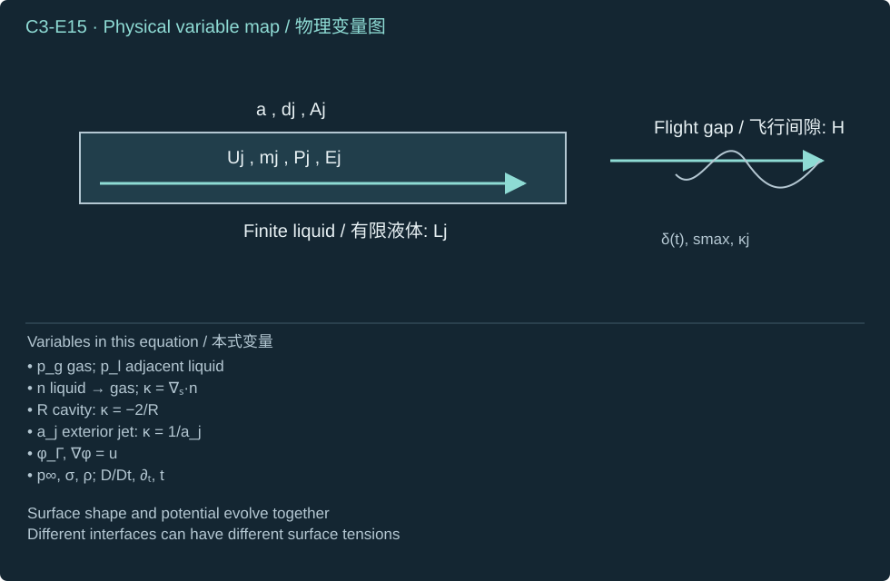

Signed curvature and the material derivative keep the dynamic condition consistent.

带符号曲率及材料导数使动力学条件自洽。

Step 9 — normal stress supplies the first row of Eq. (C3-E15). Eulerian Bernoulli contains minus one half of squared speed when solved for the fixed-position potential derivative; adding velocity dotted with its gradient produces the plus sign in the material derivative. At a sphere the surface potential is minus radius times wall speed. Its material derivative is minus squared wall speed minus radius times acceleration, so the condition recovers the spherical balance with resisting surface tension. This displayed reference uses a quiescent reservoir; a finite sealed cell needs its actual pressure/volume boundary and potential gauge instead of a fictitious far field. Solve the harmonic boundary-value problem and advance shape/potential until topology or compressibility invalidates the stage. An internal re-entry jet and an exterior meniscus jet are distinct events; one is not proof of the other. The calculations of Peters et al. illustrate why resolving the free surface matters. [[R4]](../reference/sources.html#r4)

步骤 9——法向应力给出式（C3-E15）第一行。将 Euler 型 Bernoulli 解为固定位置势导数时含负的二分之一速度平方；加入速度与势梯度的点积后，材料导数中变为正号。球形表面势为负的半径乘壁速，材料导数为负壁速平方减半径乘加速度，因此界面条件还原带抵抗表面张力的球形平衡。所示参考使用静止储液域；有限封闭单元需采用实际压力／体积边界及势的规范条件，而不能假造远场。应求解调和边值问题、推进形状／势，直到拓扑或可压缩性使该阶段失效。内部再入射流及外部弯液面射流是不同事件；出现一者并不能证明另一者。Peters 等的计算说明解析自由表面的必要性。[[R4]](../reference/sources.html#r4)

**Symbols before Eq. (C3-E16).**

**式（C3-E16）前的符号定义。**

| First individual definition / 第一项单独定义 | Second individual definition / 第二项单独定义 |
| --- | --- |
| $\Pi(\boldsymbol x)$ — Local pressure impulse per unit area (Pa s) $\Pi(\boldsymbol x)$ — 局部单位面积压力冲量（Pa s） | $\Pi_0$ — Driven-end pressure impulse (Pa s) $\Pi_0$ — 驱动端压力冲量（Pa s） |
| $p$ — Local liquid pressure (Pa) $p$ — 局部液体压力（Pa） | $p_{\mathrm{ref}}$ — Specified reference pressure (Pa) $p_{\mathrm{ref}}$ — 指定参考压力（Pa） |
| $\boldsymbol x$ position (m) $\boldsymbol x$ 为位置（m） | $t$ — Time (s) $t$ — 时间（s） |
| $t_0$ — Pulse start time (s) $t_0$ — 脉冲开始时刻（s） | $\tau_p>0$ — Pressure-pulse duration (s) $\tau_p>0$ — 压力脉冲时长（s） |
| $\Delta\boldsymbol u$ velocity increment (m s⁻¹) $\Delta\boldsymbol u$ 为速度增量（m s⁻¹） | $U$ column speed (m s⁻¹) $U$ 为液柱速度（m s⁻¹） |
| $\rho>0$ density (kg m⁻³) $\rho>0$ 为密度（kg m⁻³） | $z\in[0,L]$ axial coordinate (m) $z\in[0,L]$ 为轴坐标（m） |
| $L>0$ length (m) $L>0$ 为长度（m） | $A>0$ area (m²) $A>0$ 为面积（m²） |
| $m>0$ liquid mass (kg) $m>0$ 为液体质量（kg） | $\mathcal J$ is total directional force impulse (N s) $\mathcal J$ 为总方向力冲量（N s） |
| $E$ kinetic energy (J) $E$ 为动能（J） |  |

**Conventions and conditions.** $\nabla,\nabla^2$ are gradient/Laplacian; $\int$ time integration and vertical bars denote a stated fixed-budget branch; The pulse approximation freezes geometry and neglects integrated convection and viscosity.

**约定与条件。** $\nabla,\nabla^2$ 为梯度／Laplace 算子；$\int$ 为时间积分，竖线表示指定固定预算分支；脉冲近似冻结几何并忽略积分后的对流及黏性。

(C3-E16) · Pressure-impulse control and distinct focusing budgets

$$
\begin{aligned}\Pi(\boldsymbol x)&=\int_{t_0}^{t_0+\tau_p}(p-p_{\mathrm{ref}})\,dt,\quad \Delta\boldsymbol u\simeq-\nabla\Pi/\rho,\quad\nabla^2\Pi=0,\\ \Pi(z)&=\Pi_0(1-z/L),\quad U=\frac{\Pi_0}{\rho L},\quad m=\rho AL,\quad\mathcal J=\Pi_0A=mU,\\ U\big|_{\mathcal J\ \mathrm{fixed}}&=\frac{\mathcal J}{m},\quad E=\frac{\mathcal J^2}{2m},\qquad U\big|_{E\ \mathrm{fixed}}=\sqrt{\frac{2E}{m}}.\end{aligned}
$$

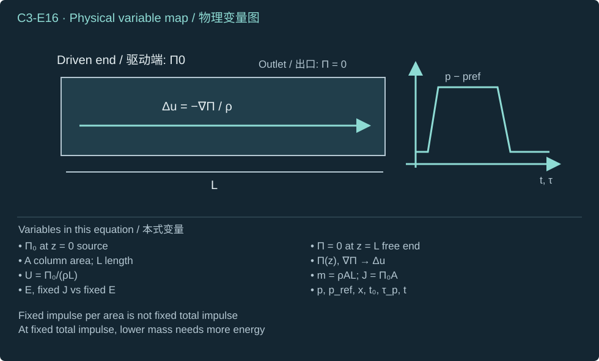

The pressure-impulse field and the total energy constraint must be compatible.

压力冲量场必须与总能量约束相容。

Step 10 — integrate momentum over a short pulse and then take divergence using incompressibility. The straight-column solution obeys the two end impulse values and insulating sidewalls. Its pressure-impulse gradient gives uniform initial speed; reducing area alone at fixed impulse per area does not increase that speed. At fixed total impulse, reducing liquid mass fourfold raises speed fourfold and required kinetic energy fourfold. At fixed energy it raises uniform speed only twofold and reduces momentum by one half. These are different experiments. A concave moving meniscus concentrates a solved spatial velocity field, but mass conservation alone does not pay for that concentration. The geometry-frozen condition additionally needs small pulse displacement and viscous effects; several acoustic crossings alone do not establish it. [[R2]](../reference/sources.html#r2)

步骤 10——在短脉冲内积分动量，再利用不可压缩性取散度。直液柱解满足两端冲量值及侧壁无通量条件。其压力冲量梯度给出均匀初速度；固定单位面积冲量时仅减面积并不提高速度。固定总冲量时，液体质量降至四分之一，会使速度及所需动能均增大四倍。固定能量时均匀速度只增大两倍，而动量降为一半。这是不同实验。凹形运动弯液面会集中已求解的空间速度场，但仅凭质量守恒并不能支付聚焦代价。冻结几何还要求脉冲位移及黏性作用小；经历若干声传播周期本身不足以确立近似。[[R2]](../reference/sources.html#r2)

**Symbols before Eq. (C3-E17).**

**式（C3-E17）前的符号定义。**

| First individual definition / 第一项单独定义 | Second individual definition / 第二项单独定义 |
| --- | --- |
| $Q$ is steady volume flow (m³ s⁻¹) $Q$ 为稳态体积流量（m³ s⁻¹） | $a_{\mathrm{in}}$ — Solid-tube inlet radius (m) $a_{\mathrm{in}}$ — 固体管入口半径（m） |
| $U_{\mathrm{in}}$ — Uniform inlet speed (m s⁻¹) $U_{\mathrm{in}}$ — 均匀入口速度（m s⁻¹） | $U_j$ — Uniform jet speed (m s⁻¹) $U_j$ — 均匀射流速度（m s⁻¹） |
| $\alpha$ — Jet-to-inlet cross-sectional area ratio (dimensionless) $\alpha$ — 射流截面积与入口截面积之比（无量纲） | $p_{\mathrm{in}}$ — Tube-inlet pressure (Pa) $p_{\mathrm{in}}$ — 管入口压力（Pa） |
| $p_g$ — Adjacent gas pressure (Pa) $p_g$ — 邻接气体压力（Pa） | $\Delta p_{\mathrm{loss}}\ge0$ prescribed loss (Pa) $\Delta p_{\mathrm{loss}}\ge0$ 为给定损失（Pa） |
| $\rho>0$ density (kg m⁻³) $\rho>0$ 为密度（kg m⁻³） | $\sigma_j$ jet–gas tension (N m⁻¹) $\sigma_j$ 为射流—气体张力（N m⁻¹） |
| $\pi$ dimensionless $\pi$ 无量纲 | $a_j$ — Exterior cylindrical-jet radius (m) $a_j$ — 外部圆柱射流半径（m） |

**Conventions and conditions.** The square root requires nonnegative numerator; This is a steady inviscid-core nozzle control with optional loss, not a transient cavity solution; $a_{\mathrm{in}}>a_j>0$; $\alpha=(a_j/a_{\mathrm{in}})^2$ and $0<\alpha<1$..

**约定与条件。** 平方根要求分子非负；它是允许损失的稳态无黏核心喷嘴对照，并非瞬态腔体解；$a_{\mathrm{in}}>a_j>0$；$\alpha=(a_j/a_{\mathrm{in}})^2$ 且 $0<\alpha<1$。。

(C3-E17) · Continuity plus Bernoulli focusing benchmark

$$
\begin{aligned}Q&=\pi a_{\mathrm{in}}^2U_{\mathrm{in}}=\pi a_j^2U_j,\qquad \alpha=(a_j/a_{\mathrm{in}})^2,\quad U_{\mathrm{in}}=\alpha U_j,\\ p_{\mathrm{in}}-p_g&=\frac12\rho(U_j^2-U_{\mathrm{in}}^2)+\frac{\sigma_j}{a_j}+\Delta p_{\mathrm{loss}},\\ U_j&=\sqrt{\frac{2[p_{\mathrm{in}}-p_g-\sigma_j/a_j-\Delta p_{\mathrm{loss}}]}{\rho(1-\alpha^2)}}\quad(0<\alpha<1).\end{aligned}
$$

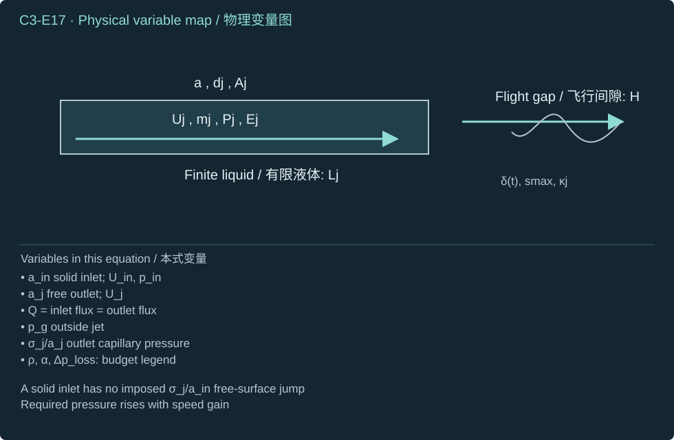

Specify either source pressure or flow and solve the compatible remaining quantity.

指定源压力或流量，再求其余相容量。

For a 40-μm inlet radius, 10-μm outlet radius and 3 m s⁻¹ inlet speed, continuity gives 48 m s⁻¹ outlet speed. With density 1000 kg m⁻³, tension 0.072 N m⁻¹ and zero loss, the required inlet overpressure is 1.1547 MPa: 1.1475 MPa kinetic increase plus 7.2 kPa capillary pressure. If overpressure is instead fixed at 0.20 MPa, Eq. (C3-E17) gives 19.6752 m s⁻¹ outlet speed and 1.22970 m s⁻¹ inlet speed. Holding the original inlet speed and the smaller pressure simultaneously would violate energy conservation. This solved control reveals a budget error; the actual evolving meniscus still requires Eqs. (C3-E13–15).

入口半径 40 μm、出口半径 10 μm、入口速度 3 m s⁻¹ 时，连续性给出出口速度 48 m s⁻¹。密度 1000 kg m⁻³、张力 0.072 N m⁻¹、零损失时，所需入口超压为 1.1547 MPa：动能增量对应 1.1475 MPa，毛细压力为 7.2 kPa。若超压改为固定 0.20 MPa，式（C3-E17）给出出口速度 19.6752 m s⁻¹、入口速度 1.22970 m s⁻¹。同时保持原入口速度及较小压力会违反能量守恒。这个已解对照揭示预算错误；实际演化弯液面仍需式（C3-E13—15）。

**Symbols before Eq. (C3-E18).**

**式（C3-E18）前的符号定义。**

| First individual definition / 第一项单独定义 | Second individual definition / 第二项单独定义 |
| --- | --- |
| $A_j$ is area (m²) $A_j$ 为面积（m²） | $d_j$ — Jet diameter (m) $d_j$ — 射流直径（m） |
| $L_j>0$ — Finite emitted-jet length (m) $L_j>0$ — 有限喷出射流长度（m） | $\rho$ carrier density (kg m⁻³) $\rho$ 为载液密度（kg m⁻³） |
| $m_j>0$ emitted mass (kg) $m_j>0$ 为喷出质量（kg） | $\mathcal M_j$ is the emitted material collection (—) $\mathcal M_j$ 为喷出材料集合（—） |
| $dm$ mass element (kg) $dm$ 为质量微元（kg） | $\boldsymbol u$ velocity field (m s⁻¹) $\boldsymbol u$ 为速度场（m s⁻¹） |
| $U_{\mathrm{rms}}$ mass-weighted root-mean-square speed (m s⁻¹) $U_{\mathrm{rms}}$ 为质量加权均方根速度（m s⁻¹） | $\boldsymbol e_z$ is a unit vector along intended transfer (dimensionless) $\boldsymbol e_z$ 为期望转印方向的单位向量（无量纲） |
| $P_j$ its signed momentum (N s) $P_j$ 为该方向带符号动量（N s） | $E_j$ kinetic energy (J) $E_j$ 为动能（J） |
| $E_{\mathrm{avail}}\ge E_j$ available mechanical energy (J) $E_{\mathrm{avail}}\ge E_j$ 为可用机械能（J） | $\pi$ is dimensionless $\pi$ 无量纲 |

**Conventions and conditions.** the cylinder expression assumes uniform area/density; $\int$ integrates over emitted mass; $|\ |$ denotes vector norm or scalar magnitude.

**约定与条件。** 圆柱式假设面积及密度均匀；$\int$ 对喷出质量积分；$|\ |$ 为向量范数或标量大小。

(C3-E18) · Finite-mass definitions and Cauchy–Schwarz bound

$$
\begin{aligned}A_j&=\pi d_j^2/4,\qquad m_j=\rho A_jL_j,\qquad E_j=\frac12\int_{\mathcal M_j}|\boldsymbol u|^2dm=\frac12m_jU_{\mathrm{rms}}^2,\\ P_j&=\int_{\mathcal M_j}(\boldsymbol u\cdot\boldsymbol e_z)\,dm,\\ |P_j|^2&\le\left(\int_{\mathcal M_j}1\,dm\right)\left(\int_{\mathcal M_j}|\boldsymbol u\cdot\boldsymbol e_z|^2dm\right)\le2m_jE_j,\qquad U_{\mathrm{rms}}\le\sqrt{2E_{\mathrm{avail}}/m_j}.\end{aligned}
$$

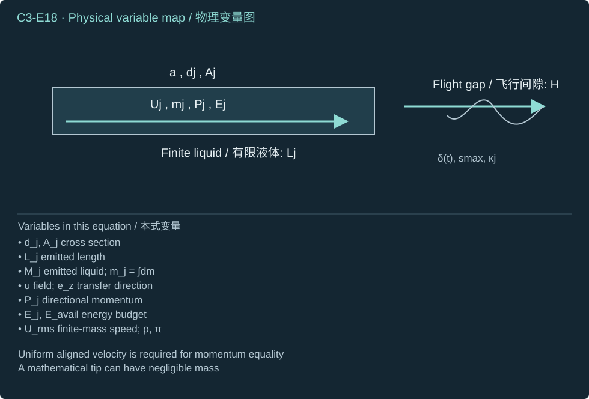

Finite jet mass converts an energy budget into a meaningful speed and momentum bound.

有限射流质量将能量预算转化为有意义的速度及动量界。

Step 11 — apply Cauchy–Schwarz to the mass integrals of one and axial velocity, then bound axial squared velocity by total squared velocity. Equality requires every emitted element to move at the same speed along the chosen axis. Energy divided by mass has units m² s⁻²; the speed bound has units m s⁻¹. Both squared momentum and mass times energy have units kg² m² s⁻². For all jets together the proof uses total mass and total kinetic energy, so a site count does not escape the bound. Directional cancellation, a rapidly moving tiny tip, or energy in lateral flow can reduce useful momentum even when a camera records a high maximum speed.

步骤 11——对一与轴向速度的质量积分应用 Cauchy–Schwarz，再以总速度平方限制轴向速度平方。等号要求所有喷出微元以相同速度沿所选轴运动。能量除以质量单位为 m² s⁻²，因此速度界单位为 m s⁻¹。动量平方及质量乘能量的单位均为 kg² m² s⁻²。对全部射流，证明使用总质量及总动能，故增加位点数不能逃离该界。方向抵消、高速但微小的尖端，或侧向流中的能量，即使相机记录最大速度很高，也会减少有用动量。

## 5. Derive transport and the breakup test after a slender jet exists

## 5. 射流形成细长形态后推导输运及断裂检验

Step 12 — take an axisymmetric Newtonian jet in dynamically negligible gas, constant density and surface tension, negligible gravity, and no mass exchange. Let its local radius and axial velocity vary along the flight direction. Exact conservation on a fixed finite slice uses the integral of area, not one endpoint area times slice length. Divide that balance by the positive slice length and take its zero-length limit for differentiable fields to obtain differential continuity. Substitute area equals pi times radius squared and divide by positive twice pi times radius. This description begins after launch, with initial shape, velocity, inflow history and end conditions supplied by the spatial calculation or measurements. It is not valid for the strongly two-dimensional neck turning into a jet at birth.

步骤 12——采用动力学作用可忽略气体中的轴对称 Newton 流体射流，密度及表面张力恒定，忽略重力及质量交换。其局部半径、轴向速度沿飞行方向变化。固定有限切片的精确守恒使用面积积分，不能用某端面积直接乘切片长度。将平衡除以正切片长度，并对可微场取长度趋零极限，得到微分连续性。代入面积等于圆周率乘半径平方，再除以正的两倍圆周率乘半径。此描述从发射之后开始，初始形状、速度、流入历程及端部条件由空间计算或测量提供。它不适用于射流初生时强二维颈部的转向。

**Symbols before Eq. (C3-E19).**

**式（C3-E19）前的符号定义。**

| First individual definition / 第一项单独定义 | Second individual definition / 第二项单独定义 |
| --- | --- |
| $z$ is axial position (m) $z$ 为轴向位置（m） | $t$ time (s) $t$ 为时间（s） |
| $\Delta z>0$ fixed finite slice length (m) $\Delta z>0$ 为固定有限切片长度（m） | $\xi$ — Dummy axial integration coordinate (m) $\xi$ — 轴向积分哑坐标（m） |
| $a(z,t)>0$ is local jet radius (m) $a(z,t)>0$ 为局部射流半径（m） | $A(z,t)$ area (m²) $A(z,t)$ 为面积（m²） |
| $v(z,t)$ cross-sectional average axial velocity (m s⁻¹) $v(z,t)$ 为截面平均轴速（m s⁻¹） | $\pi$ dimensionless $\pi$ 无量纲 |
| $[Av]$ denotes the volume flux (m³ s⁻¹) evaluated at the stated end $[Av]$ 表示在指定端点评价的体积流率（m³ s⁻¹） | $d\xi$ — Integration-coordinate element (m) $d\xi$ — 积分坐标微元（m） |

**Conventions and conditions.** $\partial_t,\partial_z$ are fixed-coordinate derivatives; $\int$ integrates over the slice; the differential limit requires differentiable fields; The last step divides by positive $2\pi a$.

**约定与条件。** $\partial_t,\partial_z$ 为固定坐标导数；$\int$ 为切片积分；微分极限要求场可微；最后一步除以正的 $2\pi a$。

(C3-E19) · Slender-jet volume conservation

$$
\begin{aligned}A(z,t)&=\pi a(z,t)^2,\\ \partial_t\int_z^{z+\Delta z}A(\xi,t)\,d\xi&=[Av](z,t)-[Av](z+\Delta z,t),\\ \partial_t\frac{1}{\Delta z}\int_z^{z+\Delta z}A\,d\xi+\frac{[Av](z+\Delta z,t)-[Av](z,t)}{\Delta z}&=0,\\ \Delta z\to0:\quad \partial_tA+\partial_z(Av)&=0\ \Longrightarrow\ \partial_ta+v\partial_za=-\frac a2\partial_zv.\end{aligned}
$$

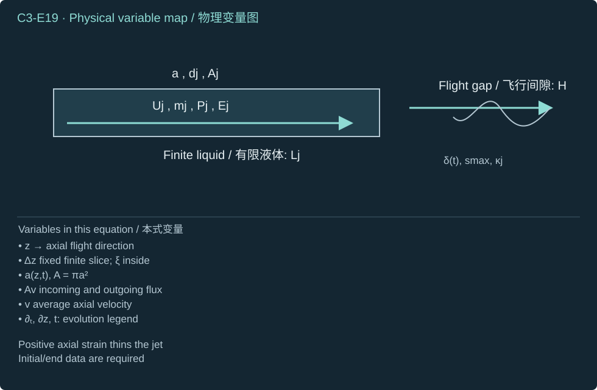

Axial stretching changes radius even before capillary necking grows.

在毛细颈缩增长前，轴向拉伸即会改变半径。

**Symbols before Eq. (C3-E20).**

**式（C3-E20）前的符号定义。**

| First individual definition / 第一项单独定义 | Second individual definition / 第二项单独定义 |
| --- | --- |
| $r\in[0,a]$ — Radial position measured from the liquid-jet axis (m) $r\in[0,a]$ — 从液体射流轴线计量的径向位置（m） | $z$ — Axial liquid-jet coordinate (m) $z$ — 液体射流轴向坐标（m） |
| $t$ time (s) $t$ 为时间（s） | $u_r$ is radial (m s⁻¹) $u_r$ 为径向（m s⁻¹） |
| $v$ axial velocity (m s⁻¹) $v$ 为轴向速度（m s⁻¹） | $a>0$ radius (m) $a>0$ 为半径（m） |
| $A=\pi a^2$ area (m²) $A=\pi a^2$ 为面积（m²） | $\rho$ is density (kg m⁻³) $\rho$ 为密度（kg m⁻³） |
| $\mu$ Newtonian viscosity (Pa s) $\mu$ 为 Newton 黏度（Pa s） | $\sigma_j$ jet–gas tension (N m⁻¹) $\sigma_j$ 为射流—气体张力（N m⁻¹） |
| $\tau_{zz}$ — Axial viscous normal stress (Pa) $\tau_{zz}$ — 轴向黏性法向应力（Pa） | $\tau_{rr}$ — Radial viscous normal stress (Pa) $\tau_{rr}$ — 径向黏性法向应力（Pa） |
| $\kappa$ is outward liquid-to-gas curvature (m⁻¹) $\kappa$ 为液体朝气体外法向曲率（m⁻¹） |  |

**Conventions and conditions.** $\partial_r,\partial_z,\partial_t$ are partial derivatives; $\partial_{zz}$ is a second axial derivative; The axial momentum law is a slender approximation although the geometric curvature is retained in full.

**约定与条件。** $\partial_r,\partial_z,\partial_t$ 为偏导数；$\partial_{zz}$ 为轴向二阶导数；虽然保留完整几何曲率，轴向动量规律仍为细长近似。

(C3-E20) · Newtonian stress and slender axial momentum

$$
\begin{aligned}\partial_r u_r+u_r/r+\partial_zv&=0\ \Longrightarrow\ u_r=-\frac r2\partial_zv,\\ \tau_{zz}&=2\mu\partial_zv,\quad\tau_{rr}=2\mu\partial_ru_r=-\mu\partial_zv,\quad\tau_{zz}-\tau_{rr}=3\mu\partial_zv,\\ \partial_tv+v\partial_zv&=-\frac{\sigma_j}{\rho}\partial_z\kappa+\frac{3\mu}{\rho A}\partial_z(A\partial_zv),\\ \kappa&=\frac1{a\sqrt{1+(\partial_za)^2}}-\frac{\partial_{zz}a}{[1+(\partial_za)^2]^{3/2}}.\end{aligned}
$$

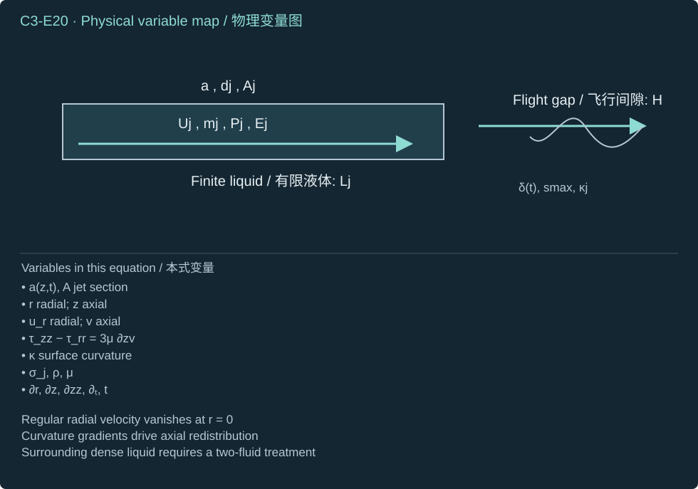

The factor three follows from extensional stress, rather than ordinary shear drag.

因子三来自拉伸应力，而不是普通剪切阻力。

Step 13 — integrate radial continuity from the axis and impose regularity to obtain radial velocity. Insert its derivative into Newtonian stresses; subtract radial from axial stress to obtain the extensional factor three. The free-surface normal stress removes radial stress from liquid pressure, leaving the axial stress difference and capillary-pressure gradient. Dividing the axial force balance by mass per unit length gives the third row of Eq. (C3-E20). Each acceleration term has unit m s⁻². Constant radius and constant velocity make the right side zero, while an axial strain changes radius through Eq. (C3-E19). These reduced equations and their energy dissipation are established in Eggers and Dupont; retaining exact curvature does not make the reduced momentum equation an exact three-dimensional theory. [[R14]](../reference/sources.html#r14)

步骤 13——从轴线积分径向连续性并施加正则性，得到径向速度。将其导数代入 Newton 应力，以轴向减径向应力，得到拉伸因子三。自由表面法向应力从液压中消去径向应力，留下轴向应力差及毛细压力梯度。轴向受力平衡除以单位长度质量，得到式（C3-E20）第三行。各加速度项单位为 m s⁻²。恒定半径及恒定速度使右侧为零，而轴向应变通过式（C3-E19）改变半径。Eggers 与 Dupont 建立了这些约化方程及其能量耗散；保留精确曲率并不使约化动量方程成为精确三维理论。[[R14]](../reference/sources.html#r14)

**Symbols before Eq. (C3-E21).**

**式（C3-E21）前的符号定义。**

| First individual definition / 第一项单独定义 | Second individual definition / 第二项单独定义 |
| --- | --- |
| $a$ is perturbed radius (m) $a$ 为扰动半径（m） | $a_0>0$ base-cylinder radius (m) $a_0>0$ 为基态圆柱半径（m） |
| $\delta_0$ — Initial small radius-disturbance amplitude (m) $\delta_0$ — 初始微小半径扰动振幅（m） | $\delta(t)$ — Time-dependent small radius-disturbance amplitude (m) $\delta(t)$ — 随时间变化的微小半径扰动振幅（m） |
| $z$ — Axial liquid-column or jet position (m) $z$ — 液柱或射流的轴向位置（m） | $r$ — Radial position measured from the liquid-jet axis (m) $r$ — 从液体射流轴线计量的径向位置（m） |
| $t$ time (s) $t$ 为时间（s） | $U_j$ base axial speed (m s⁻¹) $U_j$ 为基态轴速（m s⁻¹） |
| $k>0$ wavenumber (m⁻¹) $k>0$ 为波数（m⁻¹） | $\kappa$ is curvature (m⁻¹) $\kappa$ 为曲率（m⁻¹） |
| $\psi$ perturbation potential (m² s⁻¹) $\psi$ 为扰动势（m² s⁻¹） | $B\ne0$ its amplitude (m² s⁻¹) $B\ne0$ 为其振幅（m² s⁻¹） |
| $g>0$ — Positive temporal growth rate, not gravitational acceleration (s⁻¹) $g>0$ — 正的时间增长率，并非重力加速度（s⁻¹） | $I_0$ — Modified Bessel function of order zero (dimensionless) $I_0$ — 零阶修正贝塞尔函数（无量纲） |
| $I_1$ — Modified Bessel function of order one (dimensionless) $I_1$ — 一阶修正贝塞尔函数（无量纲） | $q$ dimensionless wavenumber $q$ 为无量纲波数 |
| $\rho$ density (kg m⁻³) $\rho$ 为密度（kg m⁻³） | $\sigma_j$ tension (N m⁻¹) $\sigma_j$ 为张力（N m⁻¹） |

**Conventions and conditions.** $g$ does not denote gravity in this chapter; cosine and exponential have dimensionless arguments; This inviscid infinite-cylinder linear control neglects surrounding-gas dynamics; $0<\delta_0\le\delta(t)\ll a_0$ defines the small-disturbance regime..

**约定与条件。** 本章 $g$ 不表示重力；余弦及指数自变量无量纲；该无黏无限圆柱线性对照忽略周围气体动力学；$0<\delta_0\le\delta(t)\ll a_0$ 定义微小扰动范围。。

(C3-E21) · Inviscid-cylinder instability derivation

$$
\begin{aligned}a&=a_0+\delta(t)\cos[k(z-U_jt)],\quad \kappa\simeq a_0^{-1}+(k^2-a_0^{-2})\delta\cos[k(z-U_jt)],\\ \psi&=B I_0(kr)e^{gt}\cos[k(z-U_jt)],\quad\delta=\delta_0e^{gt},\\ g\delta_0&=BkI_1(ka_0),\quad \rho gB I_0(ka_0)=\sigma_j(a_0^{-2}-k^2)\delta_0,\\ g^2&=\frac{\sigma_j}{\rho a_0^3}\,q(1-q^2)\frac{I_1(q)}{I_0(q)},\quad q=ka_0\in(0,1).\end{aligned}
$$

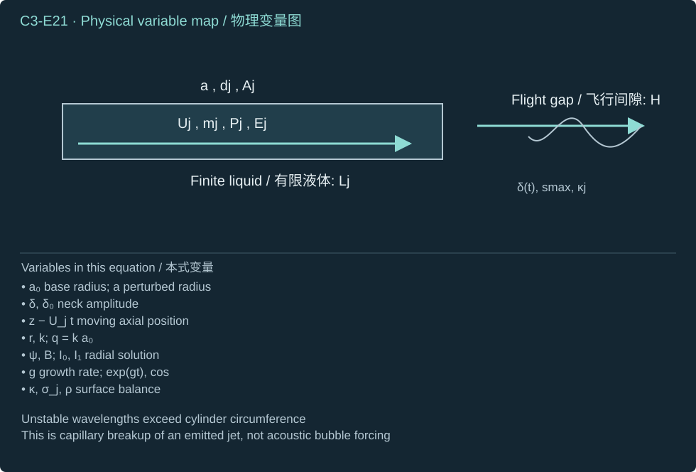

Kinematic and pressure conditions eliminate the potential amplitude and determine growth.

运动学及压力条件消去势振幅，从而确定增长。

Step 14 — expand curvature to first order: the reciprocal radius contributes minus amplitude divided by squared base radius, and axial curvature contributes wavenumber squared times amplitude. Solve Laplace's equation with a regular radial modified-Bessel function; its radial derivative is wavenumber times the order-one function. The kinematic condition and linear Bernoulli pressure give the middle row of Eq. (C3-E21). Eliminate the nonzero potential amplitude to obtain the last row. It is positive only below dimensionless wavenumber one. Independent maximization gives 0.697019 for the fastest dimensionless wavenumber and 0.343339 for growth rate times capillary time, consistent with the classical cylinder benchmark. [MIT interfacial-phenomena derivation, Lecture 11](https://ocw.mit.edu/courses/18-357-interfacial-phenomena-fall-2010/d77da8d5f1bb8b69a62682bc0dbc5845_MIT18_357F10_Lecture11.pdf)

步骤 14——将曲率展开至一阶：半径倒数贡献负的振幅除以基态半径平方，轴向曲率贡献波数平方乘振幅。采用轴线上正则的径向修正 Bessel 函数求解 Laplace 方程；其径向导数为波数乘一阶函数。运动学条件及线性 Bernoulli 压力给出式（C3-E21）中间行。消去非零势振幅得到最后一行；仅当无量纲波数小于一时为正。独立求最大值给出最快无量纲波数 0.697019，增长率乘毛细时间为 0.343339，与经典圆柱对照一致。[MIT 界面现象推导，第 11 讲](https://ocw.mit.edu/courses/18-357-interfacial-phenomena-fall-2010/d77da8d5f1bb8b69a62682bc0dbc5845_MIT18_357F10_Lecture11.pdf)

**Symbols before Eq. (C3-E22).**

**式（C3-E22）前的符号定义。**

| First individual definition / 第一项单独定义 | Second individual definition / 第二项单独定义 |
| --- | --- |
| $t_\sigma$ — Capillary response-time scale (s) $t_\sigma$ — 毛细响应时间尺度（s） | $t_{\mathrm{lin}}$ — Time to the selected small linear threshold (s) $t_{\mathrm{lin}}$ — 达到选定微小线性阈值的时间（s） |
| $t_{\mathrm{flight}}$ — Jet flight time (s) $t_{\mathrm{flight}}$ — 射流飞行时间（s） | $\rho$ density (kg m⁻³) $\rho$ 为密度（kg m⁻³） |
| $a_0$ — Base-cylinder radius (m) $a_0$ — 基态圆柱半径（m） | $d_j$ — Jet diameter (m) $d_j$ — 射流直径（m） |
| $H$ — Liquid-jet flight gap (m) $H$ — 液体射流飞行间隙（m） | $\sigma_j$ tension (N m⁻¹) $\sigma_j$ 为张力（N m⁻¹） |
| $\mu$ viscosity (Pa s) $\mu$ 为黏度（Pa s） | $U_j>0$ uniform speed (m s⁻¹) $U_j>0$ 为均匀速度（m s⁻¹） |
| $g_{\max}>0$ fastest inviscid growth rate (s⁻¹) $g_{\max}>0$ 为最快无黏增长率（s⁻¹） | $\lambda_{\max}$ its wavelength (m) $\lambda_{\max}$ 为其波长（m） |
| $\delta_0$ — Initial small radius-disturbance amplitude (m) $\delta_0$ — 初始微小半径扰动振幅（m） | $\delta_{\mathrm{arr}}$ arrival amplitude (m) $\delta_{\mathrm{arr}}$ 为到达振幅（m） |
| $\pi$ dimensionless $\pi$ 无量纲 | $\mathrm{Re}_j$ — Diameter-based jet Reynolds number (dimensionless) $\mathrm{Re}_j$ — 以直径定义的射流雷诺数（无量纲） |
| $\mathrm{We}_j$ — Diameter-based jet Weber number (dimensionless) $\mathrm{We}_j$ — 以直径定义的射流韦伯数（无量纲） | $\mathrm{Oh}_j$ — Diameter-based jet Ohnesorge number (dimensionless) $\mathrm{Oh}_j$ — 以直径定义的射流奥内佐格数（无量纲） |
| $\delta_{\mathrm{crit}}$ — Chosen small linear-response threshold amplitude (m) $\delta_{\mathrm{crit}}$ — 选定的微小线性响应阈值振幅（m） |  |

**Conventions and conditions.** $\ln,\exp$ are natural logarithm/exponential; Constant base state and a sufficiently long cylinder are assumed for growth; $\delta_0<\delta_{\mathrm{crit}}\ll a_0$; the chosen threshold remains within linear theory..

**约定与条件。** $\ln,\exp$ 为自然对数／指数；增长计算假设基态恒定且圆柱足够长；$\delta_0<\delta_{\mathrm{crit}}\ll a_0$；所选阈值仍处于线性理论范围。。

(C3-E22) · Finite-flight growth and regime diagnostics

$$
\begin{aligned}t_\sigma&=\sqrt{\rho a_0^3/\sigma_j},\quad g_{\max}=0.343339/t_\sigma,\quad\lambda_{\max}=2\pi a_0/0.697019,\\ t_{\mathrm{lin}}&=\frac1{g_{\max}}\ln\left(\frac{\delta_{\mathrm{crit}}}{\delta_0}\right),\qquad\frac{\delta_{\mathrm{arr}}}{a_0}=\frac{\delta_0}{a_0}\exp\left(g_{\max}\frac H{U_j}\right),\quad t_{\mathrm{flight}}=H/U_j,\\ \mathrm{Re}_j&=\frac{\rho U_jd_j}{\mu},\quad\mathrm{We}_j=\frac{\rho U_j^2d_j}{\sigma_j},\quad\mathrm{Oh}_j=\frac{\mu}{\sqrt{\rho\sigma_jd_j}},\qquad d_j=2a_0.\end{aligned}
$$

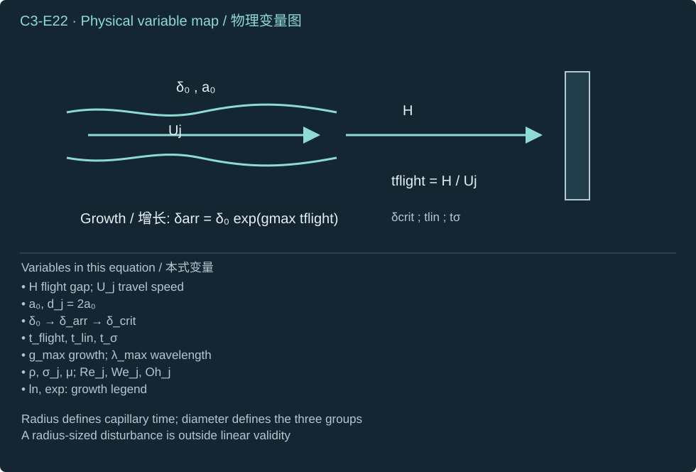

Compare growth during actual flight against a declared small-amplitude threshold.

比较实际飞行期间增长与明确的小振幅阈值。

Step 15 — take the logarithm of exponential growth to reach a selected small disturbance threshold. Capillary time squared has units (kg)/(kg s⁻²) = s². Growth tends to zero when tension tends to zero, and at the dimensionless-wavenumber zero/one endpoints. A threshold of 0.1 radius is a declared edge-of-linearity diagnostic. Substituting a whole radius gives the source's 17.7-μs estimate in the later example, but that is an extrapolation, not an exact pinch-off time. A 50-μm jet is only about one fastest wavelength long, so finite ends and startup shape matter. For stretching jets use the evolving transport equations and disturbance history; for a jet in another dense liquid use two-fluid stress and stability. Large Weber number alone does not guarantee coherent landing.

步骤 15——对指数增长取对数，求达到选定小扰动阈值的时间。毛细时间平方的单位为（kg）／（kg s⁻²）= s²。张力趋零时增长趋零，无量纲波数为零／一的端点也为零。0.1 倍半径是明确声明的线性边缘诊断阈值。代入整个半径会给出后续算例中的原文 17.7 μs 估计，但它是外推，并非精确夹断时间。50 μm 射流仅约一个最快波长长，因此有限端部及初始形状重要。拉伸射流应使用演化输运方程及扰动历程；在另一种稠密液体中的射流则需双流体应力及稳定性模型。大 Weber 数本身不能保证相干落地。

## 6. Match early impact, finite impulse, and a declared pressure observer

## 6. 匹配早期冲击、有限冲量及规定的压力观察量

Step 16 — distinguish two deceleration regimes. Steady redirection of a uniform jet onto a fixed receiver has a momentum-flux force, provided its outlet axial momentum vanishes. The initial contact instead compresses both media and launches transient waves. These are consequences of one finite incoming state, not two loads to add independently. We take positive normal velocity into the receiver, initially stationary, and define compressive pressure as excess over its precontact reference.

步骤 16——区分两种减速阶段。均匀射流在固定接收面稳态转向、且出口轴向动量消失时，存在动量流率产生的力；初始接触则压缩双方介质并发出瞬态波。这是同一有限入射状态的不同后果，并非两个可独立相加的载荷。规定进入接收体的法向速度为正，接收体初始静止，压缩压力为相对接触前参考值的超压。

**Symbols before Eq. (C3-E23).**

**式（C3-E23）前的符号定义。**

| First individual definition / 第一项单独定义 | Second individual definition / 第二项单独定义 |
| --- | --- |
| $q_j$ is jet dynamic-pressure scale (Pa) $q_j$ 为射流动压尺度（Pa） | $\rho$ density (kg m⁻³) $\rho$ 为密度（kg m⁻³） |
| $U_j>0$ uniform speed (m s⁻¹) $U_j>0$ 为均匀速度（m s⁻¹） | $A_j$ incident area (m²) $A_j$ 为入射面积（m²） |
| $\dot m$ positive mass-flow rate (kg s⁻¹; dot on $m$ here denotes throughflow, not changing the finite emitted mass) $\dot m$ 为正的质量流率（kg s⁻¹；此处 $m$ 上的点表示通过流率，并非有限喷出质量变化） | $F_{\mathrm{steady}}$ receiver-normal steady force (N) $F_{\mathrm{steady}}$ 为接收体法向稳态力（N） |
| $m$ — Liquid-column mass (kg) $m$ — 液柱质量（kg） |  |

**Conventions and conditions.** Complete lateral redirection, fixed receiver, negligible other axial forces and uniform inlet are assumed.

**约定与条件。** 假设完全侧向转流、接收体固定、其他轴向力可忽略且入口均匀。

(C3-E23) · Dynamic-pressure definition and steady momentum flux

$$
q_j=\frac12\rho U_j^2,\qquad\dot m=\rho A_jU_j,\qquad F_{\mathrm{steady}}=\dot mU_j=\rho A_jU_j^2=2q_jA_j.
$$

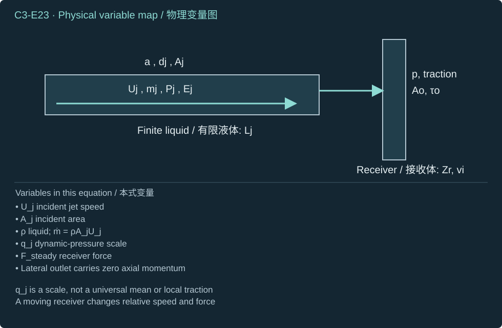

Steady force follows from momentum flux, rather than assigning dynamic pressure everywhere.

稳态力来自动量流率，而非将动压指定至全部表面。

**Symbols before Eq. (C3-E24).**

**式（C3-E24）前的符号定义。**

| First individual definition / 第一项单独定义 | Second individual definition / 第二项单独定义 |
| --- | --- |
| $u$ is liquid normal velocity (m s⁻¹) $u$ 为液体法向速度（m s⁻¹） | $U_j$ its initial incident speed (m s⁻¹) $U_j$ 为初始入射速度（m s⁻¹） |
| $v_i$ common contact velocity (m s⁻¹) $v_i$ 为共同接触速度（m s⁻¹） | $p'$ is linear compressive pressure disturbance (Pa) $p'$ 为线性压缩压力扰动（Pa） |
| $p_{\mathrm{early}}$ contact value (Pa) $p_{\mathrm{early}}$ 为接触值（Pa） | $\rho$ is liquid density (kg m⁻³) $\rho$ 为液体密度（kg m⁻³） |
| $c$ liquid longitudinal sound speed (m s⁻¹) $c$ 为液体纵向声速（m s⁻¹） | $Z_l=\rho c>0$ liquid (Pa s m⁻¹) $Z_l=\rho c>0$ 为液体阻抗（Pa s m⁻¹） |
| $Z_r>0$ receiver longitudinal impedance (Pa s m⁻¹) $Z_r>0$ 为接收体纵向阻抗（Pa s m⁻¹） | $z$ is normal coordinate (m) $z$ 为法向坐标（m） |
| $t$ — Time (s) $t$ — 时间（s） |  |

**Conventions and conditions.** The two differential operators follow right/left characteristics; Both media are locally semi-infinite and initially unpressurized relative to the same contact reference; the receiver is initially at rest.

**约定与条件。** 两个微分算子沿右／左行特征；两介质局部半无限，相对同一接触参考值初始无压力扰动；接收体初始静止。

(C3-E24) · Linear transient wave equations and impact matching

$$
\begin{aligned}\partial_tu&=-\rho^{-1}\partial_zp',\qquad\partial_tp'=-\rho c^2\partial_zu,\quad Z_l=\rho c,\\ (\partial_t+c\partial_z)(u+p'/Z_l)&=0,\quad(\partial_t-c\partial_z)(u-p'/Z_l)=0,\\ p_{\mathrm{early}}&=Z_l(U_j-v_i)=Z_rv_i\ \Longrightarrow\ v_i=\frac{Z_l}{Z_l+Z_r}U_j,\quad p_{\mathrm{early}}=\frac{Z_lZ_r}{Z_l+Z_r}U_j.\end{aligned}
$$

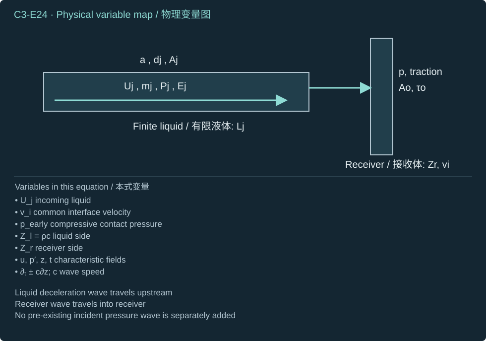

Pressure continuity and equal normal velocity determine the early contact state.

压力连续及相同法向速度确定早期接触状态。

Step 17 — substitute the momentum and compression equations into each characteristic derivative; the pressure-gradient terms and velocity-gradient terms cancel. The upstream-going liquid wave reduces speed from the incoming value to contact velocity, producing pressure equal to impedance times that speed reduction. The downstream receiver wave starts from rest. Match the two pressures, add the positive impedances in the denominator, and solve for contact velocity and pressure. As receiver impedance tends to infinity, contact velocity tends to zero and pressure approaches density times sound speed times incident speed. As receiver impedance tends to zero, pressure tends to zero. These limiting cases verify the sign and physical role of compliance. This is a transient deceleration calculation, with no harmonic forcing prerequisite. [MIT continuum acoustics: conservation, impedance and interface conditions](https://ocw.mit.edu/courses/6-013-electromagnetics-and-applications-spring-2009/50a609ff2cc992401a099bca53801474_MIT6_013S09_chap13.pdf)

步骤 17——把动量及压缩方程代入各特征导数，压力梯度及速度梯度项相互抵消。向上游传播的液体波使速度从入射值降到接触速度，压力等于阻抗乘这一降速；接收体下行波从静止状态开始。匹配双方压力，在分母相加两个正阻抗，解出接触速度及压力。接收体阻抗趋于无穷时，接触速度趋零，压力趋于密度乘声速乘入射速度；接收体阻抗趋零时，压力趋零。这些极限核验符号及柔顺性的物理作用。这是瞬态减速计算，不需要外加简谐激励前置知识。[MIT 连续介质声学：守恒、阻抗及界面条件](https://ocw.mit.edu/courses/6-013-electromagnetics-and-applications-spring-2009/50a609ff2cc992401a099bca53801474_MIT6_013S09_chap13.pdf)

**Symbols before Eq. (C3-E25).**

**式（C3-E25）前的符号定义。**

| First individual definition / 第一项单独定义 | Second individual definition / 第二项单独定义 |
| --- | --- |
| $\mathcal J_{\mathrm{rec}}$ is receiver normal contact impulse (N s) $\mathcal J_{\mathrm{rec}}$ 为接收体法向接触冲量（N s） | $P_{\mathrm{in}}$ — Incoming axial liquid momentum (N s) $P_{\mathrm{in}}$ — 入射液体轴向动量（N s） |
| $P_{\mathrm{out}}$ — Outgoing axial liquid momentum (N s) $P_{\mathrm{out}}$ — 出射液体轴向动量（N s） | $m_j$ emitted mass (kg) $m_j$ 为喷出质量（kg） |
| $\rho$ liquid density (kg m⁻³) $\rho$ 为密度（kg m⁻³） | $A_j$ area (m²) $A_j$ 为面积（m²） |
| $a_j$ — Exterior cylindrical-jet radius (m) $a_j$ — 外部圆柱射流半径（m） | $L_j$ — Finite emitted-jet length (m) $L_j$ — 有限喷出射流长度（m） |
| $U_j$ incident speed (m s⁻¹) $U_j$ 为入射速度（m s⁻¹） | $c$ sound speed (m s⁻¹) $c$ 为声速（m s⁻¹） |
| $\tau_{\mathrm{eq}}$ is an impulse-equivalent duration (s) for a fictitious uniform rigid-contact rectangle with zero outgoing axial momentum $\tau_{\mathrm{eq}}$ 为出射轴向动量为零时，假想均匀刚性接触矩形载荷的冲量等效时长（s） | $t_{\mathrm{side}}$ — Side-release time (s) $t_{\mathrm{side}}$ — 侧向释放时间（s） |
| $t_{\mathrm{axial}}$ — Axial-release time (s) $t_{\mathrm{axial}}$ — 轴向释放时间（s） | $t_{\mathrm{early}}$ — Early observation time (s) $t_{\mathrm{early}}$ — 早期观察时间（s） |
| $t_{\mathrm{return}}$ — First receiver-return time (s) $t_{\mathrm{return}}$ — 首个接收体回波时间（s） |  |

**Conventions and conditions.** The liquid momentum balance excludes additional direct source forces or a separate collapse shock; receiver support reactions affect receiver motion but are not counted as a second direct liquid impulse; $\min$ selects the earliest.

**约定与条件。** 液体动量平衡排除额外直接源力或独立塌缩激波；接收体支撑反力影响其运动，但不另算为第二个直接液体冲量；$\min$ 取最早值。

(C3-E25) · Finite momentum and early-impact duration conditions

$$
\begin{aligned}\mathcal J_{\mathrm{rec}}&=P_{\mathrm{in}}-P_{\mathrm{out}},\quad P_{\mathrm{in}}=m_jU_j=\rho A_jL_jU_j,\\ (\rho cU_j)A_j\tau_{\mathrm{eq}}&=m_jU_j\ \Longrightarrow\ \tau_{\mathrm{eq}}=L_j/c,\\ t_{\mathrm{side}}&=a_j/c,\quad t_{\mathrm{axial}}=L_j/c,\quad t_{\mathrm{early}}\ll\min(t_{\mathrm{side}},t_{\mathrm{axial}},t_{\mathrm{return}}).\end{aligned}
$$

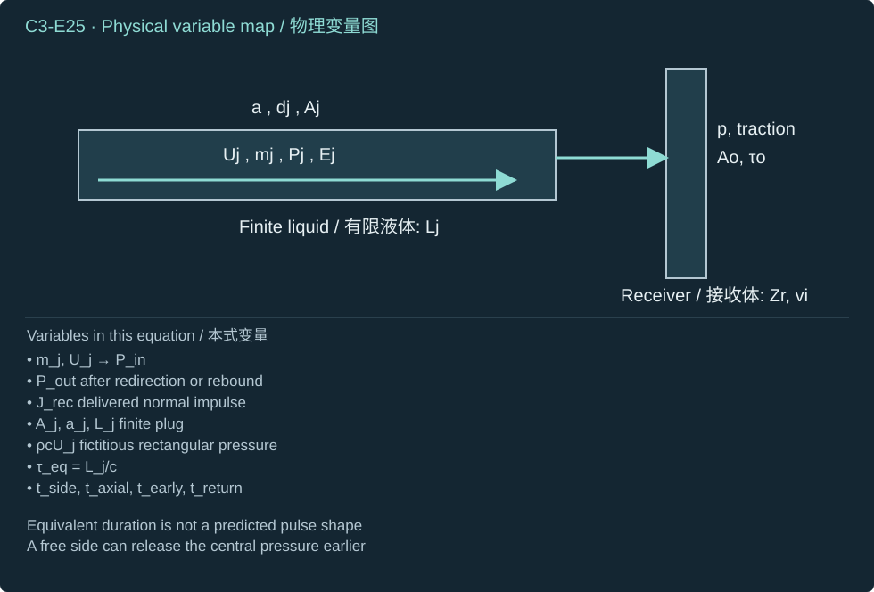

A very large initial pressure has a finite momentum budget and restricted duration.

很大的初始压力仍受有限动量预算及持续时间限制。

Step 18 — integrate the receiver force over the full event and use the emitted control-volume momentum balance. Zero outgoing axial momentum gives the stopping impulse. Divide that finite impulse by a hypothetical full-area water-hammer force to obtain the equivalent duration. This does not justify a rectangular pressure trace: a central one-dimensional estimate also requires lateral release and receiver reflections to be absent over the observation interval. A thin film with bending and returning waves is not automatically a semi-infinite receiver. Rebound can increase axial momentum change; a separate collapse wave or continued source work must enter its own balance rather than being silently attributed to the finite plug.

步骤 18——在完整事件中积分接收体力，并使用喷出控制体动量平衡。出射轴向动量为零时得到停止冲量，再除以假想全面积水锤力得到等效时长。这并不支持矩形压力曲线：中心一维估计还要求观察期间没有侧向释放及接收体反射。存在弯曲及回波的薄膜并不自动等于半无限接收体。反弹可增加轴向动量变化；独立塌缩波或持续源做功应计入各自平衡，不能默默归给有限液柱。

**Symbols before Eq. (C3-E26).**

**式（C3-E26）前的符号定义。**

| First individual definition / 第一项单独定义 | Second individual definition / 第二项单独定义 |
| --- | --- |
| $p_{\mathrm{obs}}$ is signed area–time mean excess pressure (Pa) $p_{\mathrm{obs}}$ 为带符号面积—时间平均超压（Pa） | $p$ local pressure (Pa) $p$ 为局部压力（Pa） |
| $p_{\mathrm{ref}}$ fixed reference (Pa) $p_{\mathrm{ref}}$ 为固定参考值（Pa） | $\boldsymbol x$ position (m) $\boldsymbol x$ 为位置（m） |
| $t$ current time (s) $t$ 为当前时间（s） | $\xi$ — Dummy time in the pressure-observation integral (s) $\xi$ — 压力观察积分中的时间哑变量（s） |
| $A_o>0$ is the fixed observer area (m²) $A_o>0$ 为固定观察面积（m²） | $\tau_o>0$ averaging duration (s) $\tau_o>0$ 为平均时长（s） |
| $dA$ area element (m²) $dA$ 为面积微元（m²） | $\mathcal J_{\mathrm{rec}}\ge0$ total compressive normal impulse over the observed footprint (N s) $\mathcal J_{\mathrm{rec}}\ge0$ 为观察载荷区域上的总法向压缩冲量（N s） |

**Conventions and conditions.** Integrals sum the area and preceding time window; The bound assumes negligible normal viscous stress, so excess pressure equals compressive normal traction; this excess must be nonnegative throughout the full-event footprint budget, with no omitted forces; An arbitrary signed waveform, finite normal viscous stress or a different interface does not satisfy these premises.

**约定与条件。** 积分对面积及前一时间窗口求和；界限假设法向黏性应力可忽略，因而超压等于法向压缩牵引；在采用完整事件冲量预算的整个区域内，该超压须始终非负，且不存在漏项力；任意带符号波形、有限法向黏性应力或另一界面不满足这些前提。

(C3-E26) · Observer definition and conditional impulse bound

$$
\begin{aligned}p_{\mathrm{obs}}(t)&=\frac1{A_o\tau_o}\int_{t-\tau_o}^t\int_{A_o}[p(\boldsymbol x,\xi)-p_{\mathrm{ref}}]\,dA\,d\xi,\\ 0\le p_{\mathrm{obs}}(t)&\le\frac{\mathcal J_{\mathrm{rec}}}{A_o\tau_o},\\ &\text{for nonnegative excess pressure, negligible normal viscous stress,}\\ &\text{and full-event footprint impulse }\mathcal J_{\mathrm{rec}}.\end{aligned}
$$

A reported maximum is meaningful only for an unchanged observer.

仅在观察定义不变时，报告的最大值才具有可比较含义。

**Symbols before Eq. (C3-E27).**

**式（C3-E27）前的符号定义。**

| First individual definition / 第一项单独定义 | Second individual definition / 第二项单独定义 |
| --- | --- |
| $E_w$ is outgoing linear plane-wave energy crossing the stated footprint/window (J) $E_w$ 为通过规定面积／时间窗口的单向线性平面波能量（J） | $p'$ its pressure disturbance (Pa) $p'$ 为其压力扰动（Pa） |
| $\overline p$ signed area–time mean (Pa) $\overline p$ 为带符号面积—时间均值（Pa） | $Z_l>0$ constant wave impedance (Pa s m⁻¹) $Z_l>0$ 为恒定波阻抗（Pa s m⁻¹） |
| $A_o>0$ area (m²) $A_o>0$ 为面积（m²） | $\tau_o>0$ duration (s) $\tau_o>0$ 为时长（s） |
| $t$ time (s) $t$ 为时间（s） | $dA$ area element (m²) $dA$ 为面积微元（m²） |

**Conventions and conditions.** $\int$ is area/time integration and $|\ |$ magnitude; The premise is one-way linear pressure–velocity relation $u'=p'/Z_l$, so intensity is $p'^2/Z_l$; This is not an energy bound on arbitrary standing-wave or solid contact traction.

**约定与条件。** $\int$ 为面积／时间积分，$|\ |$ 为大小；前提为单向线性压力—速度关系 $u'=p'/Z_l$，故强度为 $p'^2/Z_l$；它不是任意驻波或固体接触牵引的能量界。

(C3-E27) · One-way-wave energy and finite-observer Cauchy–Schwarz bound

$$
\begin{aligned}E_w&=\int_0^{\tau_o}\int_{A_o}\frac{p'^2}{Z_l}\,dA\,dt,\qquad \overline p=\frac1{A_o\tau_o}\int_0^{\tau_o}\int_{A_o}p'\,dA\,dt,\\ |\overline p|^2&\le\frac1{A_o\tau_o}\int_0^{\tau_o}\int_{A_o}p'^2\,dA\,dt=\frac{Z_lE_w}{A_o\tau_o}.\end{aligned}
$$

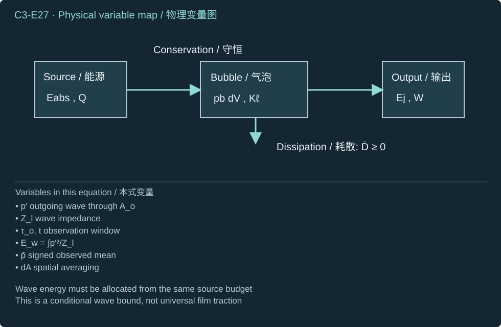

Finite area and time prevent an unmeasured point spike from standing in for delivered loading.

有限面积及时间避免用未测量点尖峰代替实际传递载荷。

Step 19 — a nonnegative observed load in any subwindow cannot exceed its full-event impulse, yielding Eq. (C3-E26). For a one-way linear wave apply Cauchy–Schwarz to pressure and one over the area–time region, whose measure is area times duration; substituting wave energy gives Eq. (C3-E27). The assumptions differ and must not be merged into a universal theorem. They do show why reducing an observation window or area can raise a reported peak without increasing delivered energy. A pointwise mesh spike is not an experimentally resolved maximum. The highest single-shot output and the largest repeatable intact-transfer output require separate admissible sets and different evidence.

步骤 19——任意子窗口中非负观察载荷不能超过完整事件冲量，得到式（C3-E26）。对单向线性波，在面积—时间域上对压力及一应用 Cauchy–Schwarz，其测度为面积乘时长；代入波能量即得式（C3-E27）。两者假设不同，不能合并为普适定理。它们说明减小观察时间或面积可能提高报告峰值，却不增加传递能量。网格点尖峰不是实验已解析最大值。最高单次输出及最大可重复完整转印输出需要分开的可行域及不同证据。

**Symbols before Eq. (C3-E28).**

**式（C3-E28）前的符号定义。**

| First individual definition / 第一项单独定义 | Second individual definition / 第二项单独定义 |
| --- | --- |
| $\rho(\boldsymbol x,t)$ is compressible density (kg m⁻³) $\rho(\boldsymbol x,t)$ 为可压缩密度（kg m⁻³） | $\boldsymbol u$ velocity (m s⁻¹) $\boldsymbol u$ 为速度（m s⁻¹） |
| $p$ absolute thermodynamic pressure (Pa) $p$ 为绝对热力学压力（Pa） | $e$ specific internal energy (J kg⁻¹) $e$ 为比内能（J kg⁻¹） |
| $e_t$ total specific energy (J kg⁻¹) $e_t$ 为总比能（J kg⁻¹） | $\boldsymbol I$ is identity tensor (dimensionless) $\boldsymbol I$ 为单位张量（无量纲） |
| $\boldsymbol\tau$ viscous stress (Pa) $\boldsymbol\tau$ 为黏性应力（Pa） | $\boldsymbol q$ conductive heat flux (W m⁻²) $\boldsymbol q$ 为导热通量（W m⁻²） |
| $Q_{\mathrm{abs}}$ optical volumetric heating (W m⁻³; zero after heating if no continued absorption) $Q_{\mathrm{abs}}$ 为光学体积加热（W m⁻³；加热后若无继续吸收则为零） | $\mathcal P$ is the adopted equation-of-state function (—) $\mathcal P$ 为采用的状态方程函数（—） |
| $Y_k$ species mass fractions (dimensionless) $Y_k$ 为组分质量分数（无量纲） | $k$ — Species index, not the jet-instability wavenumber (dimensionless) $k$ — 组分指标，并非射流失稳波数（无量纲） |
| $\boldsymbol x$ position (m) $\boldsymbol x$ 为位置（m） | $t$ time (s), $\partial_t$ fixed-position derivative $t$ 为时间（s），$\partial_t$ 为固定位置导数 |

**Conventions and conditions.** $\nabla\cdot$ tensor/vector divergence, $\otimes$ tensor product and $\cdot$ contraction; $|\ |$ velocity norm.

**约定与条件。** $\nabla\cdot$ 为张量／向量散度，$\otimes$ 为张量积、$\cdot$ 为缩并；$|\ |$ 为速度范数。

(C3-E28) · Compressible bulk conservation and required constitutive closure

$$
\begin{aligned}\partial_t\rho+\nabla\cdot(\rho\boldsymbol u)&=0,\\ \partial_t(\rho\boldsymbol u)+\nabla\cdot(\rho\boldsymbol u\otimes\boldsymbol u+p\boldsymbol I-\boldsymbol\tau)&=0,\\ \partial_t(\rho e_t)+\nabla\cdot[(\rho e_t+p)\boldsymbol u-\boldsymbol\tau\cdot\boldsymbol u+\boldsymbol q]&=Q_{\mathrm{abs}},\quad e_t=e+|\boldsymbol u|^2/2,\quad p=\mathcal P(\rho,e,\{Y_k\}).\end{aligned}
$$

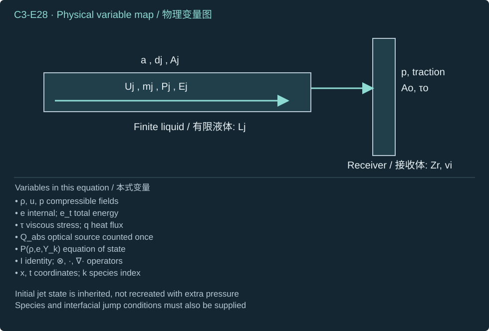

Strong compression requires conservative evolution with an appropriate equation of state.

强压缩需要采用适当状态方程的守恒演化。

Step 20 — when wall or jet Mach number is no longer small, replace the incompatible incompressible/linear-impact control with conservation of mass, momentum and total energy. Momentum flux includes pressure and viscous traction; total-energy flux includes pressure work, viscous work and heat. Optical heating enters only once. Species conservation, phase-interface jumps, constitutive properties and solid response close the problem. Source history and incoming jet state must be inherited consistently. Sound speed signals that a model needs refinement; it is not a universal ceiling on laser-driven jet velocity. The highest achievable target value remains unresolved until source conversion, geometry, finite inventory, admissible damage and the observer are specified and verified. [[R5]](../reference/sources.html#r5)

步骤 20——壁面或射流 Mach 数不再小时，应以质量、动量及总能量守恒替代不相容的不可压缩／线性冲击对照。动量流率包含压力及黏性牵引；总能量流率包含压力做功、黏性做功及热。光学加热仅计一次。组分守恒、相界面跳跃、本构物性及固体响应闭合问题，并须自洽继承源历程及入射射流状态。声速意味着模型需要改进，并非激光射流速度的普适上限。最高目标值仍未解决，直到源转换、几何、有限储量、允许损伤及观察量均被规定并核验。[[R5]](../reference/sources.html#r5)

## 7. Carry the declared 25-cell example into the next chapter

## 7. 将明确声明的 25 单元算例接入下一章

Teaching control, not project measurements: 25 separate, independently supplied cells on a 5 × 5 pattern with 200 μm pitch. Each has the Chapter 2 PFP teaching inventory and 50 pL carrier. Ideal patterned/addressed illumination is assumed for equal optical allocation and the stipulated interception fraction; it is not the broad Gaussian uniformity control above. These are separate cells; the interacting triangle/square/pentagon solution is not a pressure multiplier to apply here. The Chapter 2 5-μm teaching PFP core is not silently relabeled a real nanodroplet.

教学对照，并非项目测量：25 个独立供液且相互分隔的单元，按 5 × 5、200 μm 间距排列。各单元采用第二章教学 PFP 储量及 50 pL 载液。为均等光能分配及规定截获比例，假设理想图案化／逐点寻址照明，并非前面的宽 Gaussian 均匀性对照。它们是分隔单元；不能将相互作用三角形／正方形／五边形解当作增压倍数应用于此。第二章 5 μm 教学 PFP 液核也不能默默改称真实纳米液滴。

Step 21 — allocate incident optical energy, then separately declare the thermal-routing and final kinetic-energy conversion assumptions. Incident energy is 25 μJ, intercepted fraction 0.8, effective absorptance 0.5. Equal division gives 400 nJ absorbed per site. Assume 40% has reached the PFC by the activation deadline, so its 160 nJ exceeds the approximately 97.82-nJ preparation estimate from Chapter 2. This comparison does not certify the spatial temperature or nucleation timing. Independently assume final emitted-jet kinetic energy is 0.5% of absorbed energy. The thermal fraction and jet fraction represent successive transfers of the same energy, not disjoint quantities to add together.

步骤 21——先分配入射光能，再分别声明热路由及最终动能转换假设。入射能为 25 μJ，截获比例 0.8，有效吸收率 0.5。均分后各位点吸收 400 nJ。假设激活截止时有 40% 到达 PFC，因此其 160 nJ 超过第二章约 97.82 nJ 的准备估计；但这一比较不能证明空间温度或成核时序。另假设最终喷出射流动能为吸收能的 0.5%。热比例及射流比例表示同一能量的连续转移，并非可相加的互斥预算项。

**Symbols before Eq. (C3-E29).**

**式（C3-E29）前的符号定义。**

| First individual definition / 第一项单独定义 | Second individual definition / 第二项单独定义 |
| --- | --- |
| $E_L$ is incident laser energy (J) $E_L$ 为入射激光能（J） | $E_{\mathrm{abs,tot}}$ total absorbed energy (J) $E_{\mathrm{abs,tot}}$ 为总吸收能（J） |
| $E_{\mathrm{abs,site}}$ per-site absorbed energy (J) $E_{\mathrm{abs,site}}$ 为单个位点吸收能（J） | $E_{\mathrm{PFC,deadline}}$ energy delivered to that PFC inventory by the activation deadline (J) $E_{\mathrm{PFC,deadline}}$ 为激活截止前到达该 PFC 储量的能量（J） |
| $E_j$ final per-jet kinetic energy (J) $E_j$ 为最终单射流动能（J） | $E_{j,\mathrm{tot}}$ total jet energy (J; μJ = 10⁻⁶ J, nJ = 10⁻⁹ J) $E_{j,\mathrm{tot}}$ 为总射流动能（J；μJ = 10⁻⁶ J，nJ = 10⁻⁹ J） |
| $N_d=25$ is site count (dimensionless) $N_d=25$ 为位点数（无量纲） | $f_{\mathrm{geo}}=0.8$ intercepted fraction (dimensionless) $f_{\mathrm{geo}}=0.8$ 为截获比例（无量纲） |
| $A_\lambda=0.5$ effective absorptance at laser wavelength $\lambda$ (m) $A_\lambda=0.5$ 为激光波长 $\lambda$（m）处有效吸收率 | $f_T=0.40$ stipulated thermal fraction (dimensionless) $f_T=0.40$ 为假设热比例（无量纲） |
| $\eta_j=0.005$ stipulated absorbed-to-jet kinetic efficiency (dimensionless) $\eta_j=0.005$ 为假设吸收能至射流动能效率（无量纲） | $\lambda$ — Laser wavelength (m) $\lambda$ — 激光波长（m） |

**Conventions and conditions.** Subscripts label reservoirs/stages.

**约定与条件。** 下标区分能量库／阶段。

(C3-E29) · Declared optical and mechanical allocation

$$
\begin{aligned}E_{\mathrm{abs,tot}}&=f_{\mathrm{geo}}A_\lambda E_L=(0.8)(0.5)(25\,\mu\mathrm J)=10\,\mu\mathrm J,\\ E_{\mathrm{abs,site}}&=E_{\mathrm{abs,tot}}/N_d=400\,\mathrm{nJ},\quad E_{\mathrm{PFC,deadline}}=f_T E_{\mathrm{abs,site}}=160\,\mathrm{nJ},\\ E_j&=\eta_j E_{\mathrm{abs,site}}=2.00\,\mathrm{nJ},\quad E_{j,\mathrm{tot}}=N_dE_j=50.0\,\mathrm{nJ}.\end{aligned}
$$

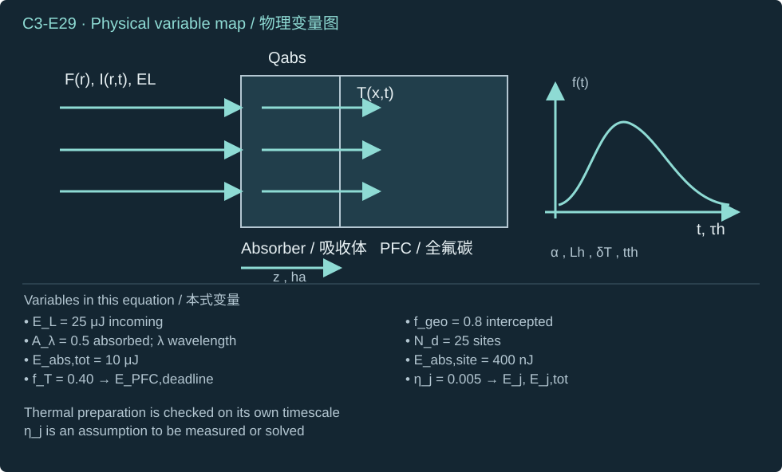

Energy allocations follow the project chain without double counting.

沿项目因果链分配能量，并避免重复计数。

**Symbols before Eq. (C3-E30).**

**式（C3-E30）前的符号定义。**

| First individual definition / 第一项单独定义 | Second individual definition / 第二项单独定义 |
| --- | --- |
| $m_j$ is per-jet carrier mass (kg) $m_j$ 为单射流载液质量（kg） | $\rho=1000$ kg m⁻³ carrier density $\rho=1000$ kg m⁻³ 为载液密度 |
| $d_j=10\times10^{-6}$ m diameter $d_j=10\times10^{-6}$ m 直径及 $L_j=50\times10^{-6}$ m 喷出长度用于第一行 | $L_j=50\times10^{-6}$ — Specified emitted jet length (m) $L_j=50\times10^{-6}$ — 指定喷出射流长度（m） |
| $E_j=2.00\times10^{-9}$ J is per-jet kinetic energy $E_j=2.00\times10^{-9}$ J 为单射流动能 | $U_j$ uniform speed (m s⁻¹) $U_j$ 为均匀速度（m s⁻¹） |
| $q_j=\rho U_j^2/2$ dynamic pressure (Pa) $q_j=\rho U_j^2/2$ 为动压（Pa） | $p_{\mathrm{rigid,early}}$ early rigid-contact pressure (Pa; MPa = 10⁶ Pa) $p_{\mathrm{rigid,early}}$ 为早期刚性接触压力（Pa；MPa = 10⁶ Pa） |
| $c=1480$ m s⁻¹ is stipulated sound speed $c=1480$ m s⁻¹ 为给定声速 | $P_j$ — Signed jet momentum along the transfer direction (N s) $P_j$ — 沿转印方向的带符号射流动量（N s） |
| $P_{\mathrm{tot}}$ — Total aligned incoming jet momentum (N s) $P_{\mathrm{tot}}$ — 总对齐入射射流动量（N s） | $\pi$ dimensionless $\pi$ 无量纲 |

**Conventions and conditions.** Uniform direction, full activation and independent cells are assumed.

**约定与条件。** 假设方向相同、全部激活且单元独立。

(C3-E30) · Worked finite jet mass, speed and pressure scales

$$
\begin{aligned}m_j&=(1000\,\mathrm{kg\,m^{-3}})\frac{\pi(10\times10^{-6}\,\mathrm m)^2}{4}(50\times10^{-6}\,\mathrm m)\simeq3.926991\times10^{-12}\,\mathrm{kg},\\ U_j&=\sqrt{\frac{2(2.00\times10^{-9}\,\mathrm J)}{3.926991\times10^{-12}\,\mathrm{kg}}}\simeq31.91538\,\mathrm{m\,s^{-1}},\\ q_j&\simeq0.5092958\,\mathrm{MPa},\quad p_{\mathrm{rigid,early}}=\rho cU_j\simeq47.23477\,\mathrm{MPa},\\ P_j&=m_jU_j\simeq1.253314\times10^{-10}\,\mathrm{N\,s},\quad P_{\mathrm{tot}}=25P_j\simeq3.133285\times10^{-9}\,\mathrm{N\,s}.\end{aligned}
$$

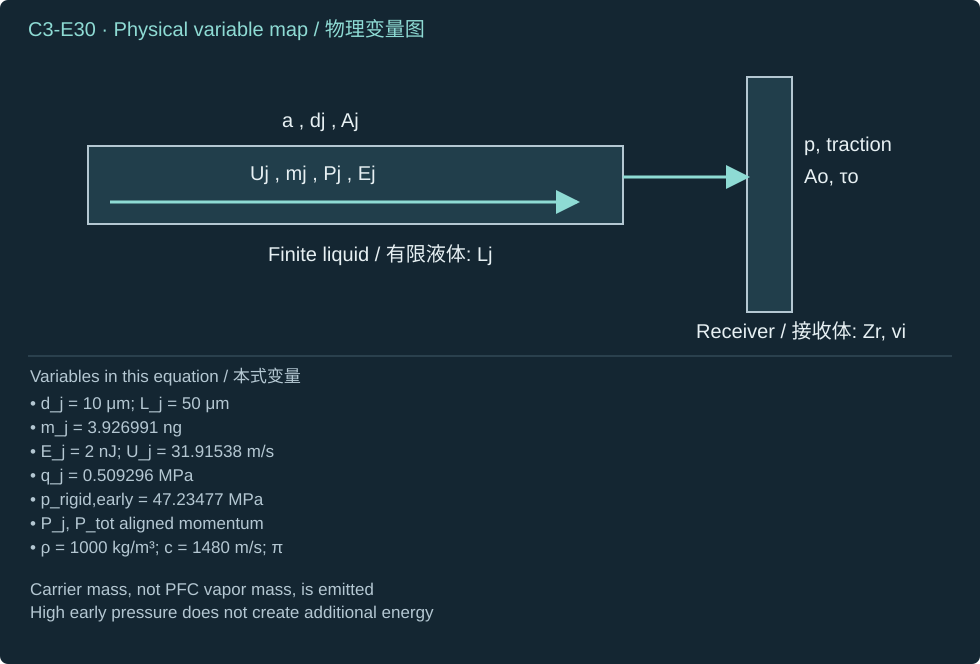

The finite state carried to Chapter 4 includes mass and energy, not only a pressure peak.

传入第四章的有限状态包含质量及能量，而非只有压力峰值。

| Checked quantity 已核验量 | Result 结果 | Interpretation 解释 |
| --- | --- | --- |
| Emitted volume per site 各位点喷出体积 | 3.926991 pL 3.926991 pL | Below the 50-pL carrier inventory 小于 50 pL 载液储量 |
| Total emitted mass 总喷出质量 | 98.17477 ng 98.17477 ng | 25 independent finite jets 25 个独立有限射流 |
| Emission duration estimate 发射时长估计 | 1.566643 μs 1.566643 μs | Length divided by assigned uniform speed 长度除以给定均匀速度 |
| Flight across 100 μm air gap 飞越 100 μm 气隙 | 3.133285 μs 3.133285 μs | No dense-liquid drag assumed 假设无稠密液体阻力 |
| Impulse-equivalent early duration 冲量等效早期时长 | 33.78378 ns 33.78378 ns | Not a predicted rectangular pulse 并非预测矩形脉冲 |
| Side-release scale 侧向释放尺度 | 3.378378 ns 3.378378 ns | Central 1D impact requires still earlier observation 中心一维冲击要求更早观察 |
| Reynolds / Weber / Ohnesorge Reynolds／Weber／Ohnesorge 数 | 319.1538 / 141.4711 / 0.0372678 319.1538 / 141.4711 / 0.0372678 | Diameter-based diagnostics 以直径定义的诊断量 |
| Capillary time / fastest wavelength 毛细时间／最快波长 | 1.317616 μs / 45.07184 μm 1.317616 μs／45.07184 μm | Radius-based infinite-cylinder benchmark 以半径定义的无限圆柱对照 |
| Arrival disturbance from 1% initial amplitude 初始 1% 振幅的到达扰动 | 2.26247% of radius 半径的 2.26247% | Linear control permits coherent arrival 线性对照允许相干到达 |
| 1% to 10% radius linear-threshold time 半径 1% 到 10% 的线性阈值时间 | 8.836529 μs 8.836529 μs | A declared validity screen, not pinch-off time 声明的适用性筛查，并非夹断时间 |
| Formal extrapolation from 1% to full radius 1% 到整个半径的形式外推 | 17.67306 μs 17.67306 μs | Reproduces source estimate outside linear validity 还原原文估计，但超出线性适用范围 |

All numerical properties and efficiencies in this worked control are stipulated water-like teaching inputs, not a calibrated PFC formulation. The 47.2348-MPa value is an early rigid-contact scale with a nanosecond spatial-validity condition. Sustaining that full-area pressure over the 1.5666-μs emitted duration would demand 46.37 times the plug's available axial momentum. The incoming energy remains 2.00 nJ per site or 50.0 nJ total. Chapter 4 will test whether the actual footprint, time history and force path deliver enough opening work without damaging the film. A high early-impact scale can therefore coexist with failure of an intact-transfer fracture-energy screen.

本对照所有物性及效率均为给定类水教学输入，并非已标定 PFC 配方。47.2348 MPa 是具有纳秒空间适用条件的早期刚性接触尺度。若将其保持在全部面积上、持续整个 1.5666 μs 喷出时间，则需液柱可用轴向动量的 46.37 倍。入射能仍为每位点 2.00 nJ 或总计 50.0 nJ。第四章将检验实际载荷区域、时间历程及传力路径，能否传递足够开裂功且不损伤薄膜。因此高的早期冲击尺度完全可以与完整转印断裂能筛查失败同时存在。

## 8. Three graduation-defense questions

## 8. 三道毕业答辩式问题

### Why is a uniform 25-site PFC array not a free 25-fold pressure amplifier, and how would you calculate it fairly?

### 为什么均匀的 25 位点 PFC 阵列不是免费的 25 倍增压器？应如何公平计算？

Explain this in your own words. Use assumptions, a physical argument, and a limitation; equation memorization is not required.

请用自己的话解释，说明假设、物理推理及适用限制；不要求背诵公式。

\*\*Reference answer and mastery criteria / 参考答案与掌握标准\*\*

**Symbols before Eq. (C3-E31).**

**式（C3-E31）前的符号定义。**

| First individual definition / 第一项单独定义 | Second individual definition / 第二项单独定义 |
| --- | --- |
| $i$ — Bubble index over the declared activated sources (dimensionless) $i$ — 遍历声明的已激活源的气泡指标（无量纲） | $j$ — Bubble index over the declared activated sources (dimensionless) $j$ — 遍历声明的已激活源的气泡指标（无量纲） |
| $R_i$ — Radius of bubble i (m) $R_i$ — 气泡 i 的半径（m） | $R_j$ — Radius of source bubble j (m) $R_j$ — 源气泡 j 的半径（m） |
| $d_{ij}$ — Bubble-center separation (m) $d_{ij}$ — 气泡中心间距（m） | $p_{b,i}$ — Constant Internal pressure of bubble i (Pa) $p_{b,i}$ — 恒定的气泡 i 的内部压力（Pa） |
| $p_\infty$ — Constant Remote carrier pressure (Pa) $p_\infty$ — 恒定的远场载液压力（Pa） | $\Delta p_c>0$ — Positive constant ideal-collapse pressure difference (Pa) $\Delta p_c>0$ — 正的恒定理想塌缩压差（Pa） |
| $\sigma_b$ tension (N m⁻¹) $\sigma_b$ 为张力（N m⁻¹） | $\mu$ viscosity (Pa s) $\mu$ 为黏度（Pa s） |
| $\rho$ carrier density (kg m⁻³), $\sum$ sums neighbors $\rho$ 为载液密度（kg m⁻³），$\sum$ 对邻泡求和 | $N$ is count (dimensionless) $N$ 为数量（无量纲） |
| $E_{B,\mathrm{tot}}$ fixed total initial pressure work (J) $E_{B,\mathrm{tot}}$ 为固定初始总压力做功（J） | $R_{\max,N}$ per-bubble maximum radius (m) $R_{\max,N}$ 为单泡最大半径（m） |
| $R_*$ isolated reference radius (m) $R_*$ 为孤立参考半径（m） | $\pi$ dimensionless $\pi$ 无量纲 |
| $\dot R_j$ — Wall radial velocity of source bubble j (m s⁻¹) $\dot R_j$ — 源气泡 j 的壁面径向速度（m s⁻¹） | $\ddot R_j$ — Wall radial acceleration of source bubble j (m s⁻²) $\ddot R_j$ — 源气泡 j 的壁面径向加速度（m s⁻²） |
| $\dot R_i$ — Wall radial velocity of bubble i (m s⁻¹) $\dot R_i$ — 气泡 i 的壁面径向速度（m s⁻¹） | $\ddot R_i$ — Wall radial acceleration of bubble i (m s⁻²) $\ddot R_i$ — 气泡 i 的壁面径向加速度（m s⁻²） |

**Conventions and conditions.** $*$ reference label; The coupled row requires far separation; the fixed-work row assumes identical constant-pressure ideal cavities.

**约定与条件。** $*$ 为参考标签；耦合行要求充分分离；固定做功行假设相同恒定压力理想腔体。

(C3-E31) · Reference answer: original interaction and allocation formulas

$$
\begin{aligned}R_i\ddot R_i+\frac32\dot R_i^2&=\frac{p_{b,i}-p_\infty-2\sigma_b/R_i-4\mu\dot R_i/R_i}{\rho}-\sum_{j\ne i}\frac{R_j^2\ddot R_j+2R_j\dot R_j^2}{d_{ij}},\\ E_{B,\mathrm{tot}}&=N\frac{4\pi}{3}\Delta p_cR_{\max,N}^3,\qquad R_{\max,N}=R_*N^{-1/3}.\end{aligned}
$$

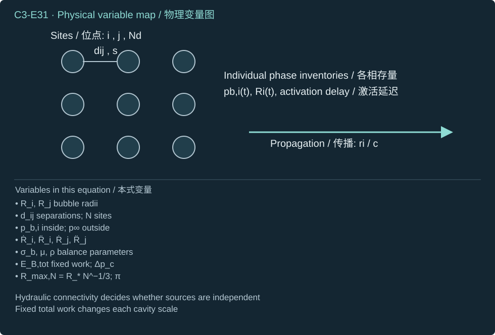

Use connectivity and source allocation before any sum of outputs.

求和输出前先确定液体连通性及源分配。

I would first distinguish uniform core size, carrier supply, pitch, fluence and activation timing, then check whether cells are hydraulically separated. For separate cells I can add emitted energies and aligned momenta only after calculating each finite jet; pressures remain local unless their fields overlap at a defined observer. For connected bubbles I solve the coupled source histories because neighbors change surrounding pressure and liquid inertia. Regular spacing does not remove edge effects or missing activations. The three/four/five polygon control demonstrates delayed contraction at fixed per-bubble radius, while the fixed-total-work calculation makes radii shrink as count rises. Neither predicts a count-proportional useful pressure.

我会先区分均匀芯尺寸、载液供应、间距、通量及激活时序，再判断单元是否液压分隔。分隔单元中，只有各有限射流求出后才能累加喷出能量及对齐动量；压力仍为局部量，除非它们在已定义观察量中重叠。连通气泡必须求耦合源历程，因为邻泡改变周围压力及液体惯性。规则间距不能去掉边缘效应及漏激活。三／四／五泡多边形对照展示固定单泡半径时收缩延迟，而固定总做功计算要求数量增加时半径缩小。两者都不预测有用压力正比于数量。

At 25 sites and 0.95 independent activation probability, low count variability still permits only 27.7% complete activation. I would measure site-resolved activation and arrival-time variation, not only a total count. I would retain the common energy budget and propagate delays to the receiver. Near contact, coalescence, deformation or strong waves, the monopole model must be replaced; its analytic time table is a control, not the final PFC-array solution.

25 个位点、独立激活概率 0.95 时，即使数量变化小，全部激活也仅有 27.7% 概率。我会测各位点激活及到达时间变化，而不只看总数量；保留统一能量预算并把延迟传播至接收体。邻泡接触、合并、变形或强波阶段必须替换单极子模型；解析时间表只是对照，并非最终 PFC 阵列解。

#### What a mastered answer demonstrates

#### 掌握后的回答应体现

* Distinguishes optical/statistical uniformity from hydraulic independence, including activation and arrival-time evidence.

  区分光学／统计均匀性与液压独立性，并说明激活及到达时序证据。
* Explains neighbor-pressure coupling and fixed-total-energy allocation without multiplying single-bubble pressure by count.

  解释邻泡压力耦合及固定总能量分配，避免把单泡压力直接乘数量。
* States the separated-spherical and weak-wave limits, and keeps the polygon control separate from the independent-cell example.

  说明分离球形及弱波限制，并把多边形对照与独立单元算例分开。

### What must be solved between a cavity calculation and a useful coherent jet, and why can a faster tip be a worse transfer actuator?

### 从腔体计算到有用相干射流之间必须求解什么？为什么更快尖端可能是更差的转印致动器？

Explain this in your own words. Use assumptions, a physical argument, and a limitation; equation memorization is not required.

请用自己的话解释，说明假设、物理推理及适用限制；不要求背诵公式。

\*\*Reference answer and mastery criteria / 参考答案与掌握标准\*\*

**Symbols before Eq. (C3-E32).**

**式（C3-E32）前的符号定义。**

| First individual definition / 第一项单独定义 | Second individual definition / 第二项单独定义 |
| --- | --- |
| $U_{\mathrm{rms}}$ is mass-weighted speed (m s⁻¹) $U_{\mathrm{rms}}$ 为质量加权速度（m s⁻¹） | $U_j$ uniform benchmark speed (m s⁻¹) $U_j$ 为均匀对照速度（m s⁻¹） |
| $m_j>0$ emitted carrier mass (kg) $m_j>0$ 为喷出载液质量（kg） | $E_{\mathrm{avail}}$ — Available mechanical-energy budget (J) $E_{\mathrm{avail}}$ — 可用力学能量预算（J） |
| $E_j$ — Jet kinetic energy (J) $E_j$ — 射流动能（J） | $P_j$ directional momentum (N s) $P_j$ 为方向动量（N s） |
| $a_0$ — Base-cylinder radius (m) $a_0$ — 基态圆柱半径（m） | $H$ — Liquid-jet flight gap (m) $H$ — 液体射流飞行间隙（m） |
| $\delta_0$ — Initial small radius-disturbance amplitude (m) $\delta_0$ — 初始微小半径扰动振幅（m） | $\delta_{\mathrm{arr}}$ — Disturbance amplitude at arrival (m) $\delta_{\mathrm{arr}}$ — 到达时的扰动振幅（m） |
| $g_{\max}$ fastest cylinder growth rate (s⁻¹), $\exp$ exponential of dimensionless argument $g_{\max}$ 为最快圆柱增长率（s⁻¹），$\exp$ 为无量纲自变量的指数 |  |

**Conventions and conditions.** Growth assumes constant inviscid base cylinder and a small perturbation in negligible surrounding gas.

**约定与条件。** 增长假设恒定无黏基态圆柱、微小扰动及周围气体动力学可忽略。

(C3-E32) · Reference answer: original finite-mass and growth formulas

$$
U_{\mathrm{rms}}\le\sqrt{\frac{2E_{\mathrm{avail}}}{m_j}},\qquad P_j^2\le2m_jE_j,\qquad \frac{\delta_{\mathrm{arr}}}{a_0}=\frac{\delta_0}{a_0}\exp(g_{\max}H/U_j).
$$

Speed, focusing and survival must refer to the same emitted liquid state.

速度、聚焦及存活须指向同一喷出液体状态。

A radius equation cannot tell me the jet shape or whether an internal liquid finger becomes an external transfer jet. I need the actual moving interfaces, pressure history, wall/outlet conditions and a compatible energy balance. Fixed total impulse and fixed total energy are different focusing controls: reducing mass fourfold at fixed impulse increases speed and required energy fourfold; at fixed energy speed only doubles and available directional momentum halves. Thus a tiny fast tip need not deliver useful loading. I would report tip speed, finite emitted mass, mass-weighted speed, directional momentum and energy separately.

半径方程不能告诉我射流形状，也不能证明内部液指成为外部转印射流。我需要实际运动界面、压力历程、壁面／出口条件及相容能量平衡。固定总冲量与固定总能量是不同聚焦对照：质量降为四分之一时，固定冲量使速度及所需能量均增大四倍；固定能量则只使速度增大两倍，并使可用方向动量减半。因此微小高速尖端未必提供有用载荷。我会分别报告尖端速度、有限喷出质量、质量加权速度、方向动量及能量。

After a slender jet exists, its mass and axial momentum equations determine thinning and curvature-driven redistribution. I compare disturbance growth during the actual flight with a declared small threshold. In the 25-cell control, a 1%-radius disturbance reaches about 2.26% over a 3.133-μs gap crossing, so coherent arrival is plausible within the cylinder model. The 17.7-μs full-radius extrapolation is not an exact breakup time. Finite ends, startup shape, stretch, viscosity and a dense surrounding liquid can change survival; evidence should include time-resolved jet shape and delivered mass at the receiver.

射流形成细长形态后，质量及轴向动量方程决定变细和曲率驱动的再分配。我比较实际飞行期间扰动增长与明确小阈值。在 25 单元对照中，初始半径 1% 的扰动经过 3.133 μs 跨隙后约为 2.26%，因此在圆柱模型内相干到达可行。17.7 μs 全半径外推并非精确断裂时间。有限端部、初始形状、拉伸、黏性及稠密周围液体都会改变存活；证据应包括时间分辨射流形状及接收位置到达质量。

#### What a mastered answer demonstrates

#### 掌握后的回答应体现

* Explains why spatial interface geometry and source/wall conditions are required for a directional emitted jet.

  解释定向喷出射流为什么需要空间界面几何及源／壁面条件。
* Separates fixed impulse, fixed energy and fixed impulse per area; connects finite mass to speed, momentum and focusing cost.

  区分固定冲量、固定能量及固定单位面积冲量，将有限质量联系至速度、动量及聚焦代价。
* Uses flight-time versus disturbance-growth reasoning and acknowledges nonlinear/finite-length breakdown instead of guaranteeing breakup-free arrival.

  用飞行时间与扰动增长推理，并承认非线性／有限长度失效，避免保证无断裂到达。

### Why can a 47-MPa early impact scale coexist with failed transfer, and what makes a reported maximum scientifically comparable?

### 为什么 47 MPa 早期冲击尺度可以与转印失败并存？怎样使报告的最大值具有科学可比性？

Explain this in your own words. Use assumptions, a physical argument, and a limitation; equation memorization is not required.

请用自己的话解释，说明假设、物理推理及适用限制；不要求背诵公式。

\*\*Reference answer and mastery criteria / 参考答案与掌握标准\*\*

**Symbols before Eq. (C3-E33).**

**式（C3-E33）前的符号定义。**

| First individual definition / 第一项单独定义 | Second individual definition / 第二项单独定义 |
| --- | --- |
| $p_{\mathrm{early}}$ is early compressive impact scale (Pa) $p_{\mathrm{early}}$ 为早期压缩冲击尺度（Pa） | $p_{\mathrm{obs}}$ signed finite-observer mean (Pa) $p_{\mathrm{obs}}$ 为带符号有限观察均值（Pa） |
| $Z_l$ — Liquid longitudinal wave impedance (Pa s m⁻¹) $Z_l$ — 液体纵向波阻抗（Pa s m⁻¹） | $Z_r>0$ — Receiver longitudinal wave impedance (Pa s m⁻¹) $Z_r>0$ — 接收体纵向波阻抗（Pa s m⁻¹） |
| $\rho$ carrier density (kg m⁻³) $\rho$ 为载液密度（kg m⁻³） | $c$ sound speed (m s⁻¹) $c$ 为声速（m s⁻¹） |
| $U_j$ incident speed (m s⁻¹) $U_j$ 为入射速度（m s⁻¹） | $L_j$ finite jet length (m) $L_j$ 为有限射流长度（m） |
| $\tau_{\mathrm{eq}}$ rigid stopping-impulse equivalent duration (s) $\tau_{\mathrm{eq}}$ 为刚性停止冲量等效时长（s） | $A_o$ observation area (m²) $A_o$ 为观察面积（m²） |
| $dA$ element (m²) $dA$ 为面积微元（m²） | $\tau_o$ averaging duration (s) $\tau_o$ 为平均时长（s） |
| $t$ current time (s) $t$ 为当前时间（s） | $\xi$ — Dummy time in the pressure-observation integral (s) $\xi$ — 压力观察积分中的时间哑变量（s） |
| $p$ — Local liquid pressure (Pa) $p$ — 局部液体压力（Pa） | $p_{\mathrm{ref}}$ — Specified reference pressure (Pa) $p_{\mathrm{ref}}$ — 指定参考压力（Pa） |
| $\boldsymbol x$ — Spatial observation position (m) $\boldsymbol x$ — 空间观察位置（m） |  |

**Conventions and conditions.** $\int$ integrates local pressure $p(\boldsymbol x,\xi)$ over the footprint/window, with position $\boldsymbol x$ (m) implicit; Impact is locally one-dimensional and linear; equivalent duration assumes zero outgoing axial momentum and no added force source.

**约定与条件。** $\int$ 将局部压力 $p(\boldsymbol x,\xi)$ 在载荷区域／窗口积分，位置 $\boldsymbol x$（m）为隐含自变量；冲击局部一维且线性；等效时长假设出射轴向动量为零且无额外力源。

(C3-E33) · Reference answer: original impact and observer formulas

$$
p_{\mathrm{early}}\simeq\frac{Z_lZ_r}{Z_l+Z_r}U_j,\quad Z_l=\rho c,\qquad \tau_{\mathrm{eq}}=\frac{L_j}{c},\qquad p_{\mathrm{obs}}(t)=\frac1{A_o\tau_o}\int_{t-\tau_o}^t\int_{A_o}(p-p_{\mathrm{ref}})\,dA\,d\xi.
$$

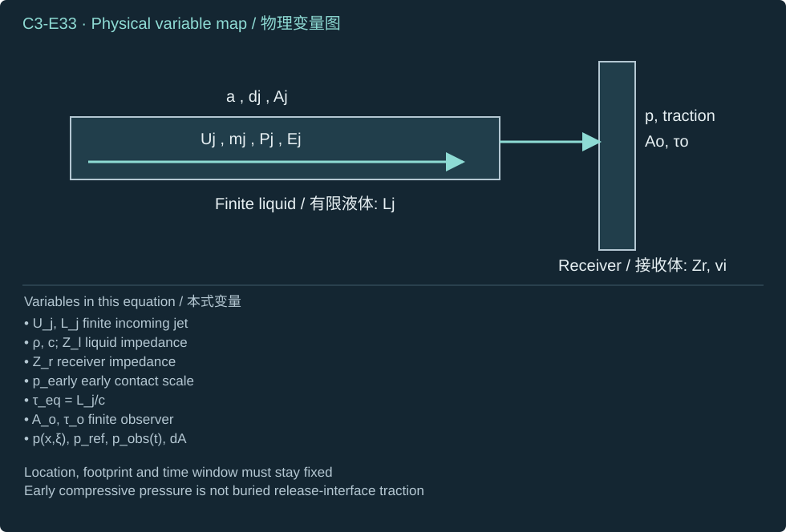

A finite impact scale is an input to load-path analysis, not proof of intact release.

有限冲击尺度是传力路径分析的输入，并非完整释放的证明。

The 47.2348-MPa teaching value follows from initially compressing a nearly rigid contact, not from a pressure sustained for the emitted jet's full duration. Its corresponding incoming state is only 3.92699 ng, 2 nJ and 1.25331 × 10⁻¹⁰ N s per jet. An equivalent rectangle would last 33.78 ns, while lateral release matters on about 3.38 ns in this narrow jet. Actual pressure needs a resolved time history and receiver response. I would fix the pressure location, reference, footprint, bandwidth and averaging interval, then check momentum and energy against the same finite state.

47.2348 MPa 教学值来自近乎刚性接触的初始压缩，并非整个射流喷出期间持续的压力。其对应入射状态每射流仅为 3.92699 ng、2 nJ、1.25331 × 10⁻¹⁰ N s。等效矩形时长为 33.78 ns，而这一细射流侧向释放约在 3.38 ns 上已重要。实际压力需要已解析时间历程及接收体响应。我会固定压力位置、参考值、载荷区域、带宽及平均时间，再用同一有限状态核验动量与能量。

This does not yet determine opening at a buried release interface. Chapter 4 must transmit loading through the chosen liquid/film/PVC path and test interface strength, fracture work and payload damage. A 50-nJ total jet-energy budget can fail the release-work requirement despite an impressive nanosecond contact pressure. For a maximum I would constrain laser/absorber damage, PFC and carrier inventory, geometry, finite measured mass and observer; I would report the best verified single shot separately from a repeatable intact-transfer envelope. I would not claim a universal limit from singular collapse or count alone.

这仍未决定埋藏释放界面的张开。第四章必须沿所选液体／薄膜／PVC 路径传递载荷，并检验界面强度、断裂功及载荷损伤。即使纳秒接触压力很高，50 nJ 总射流能预算仍可能不满足释放功需求。定义最大值时，我会约束激光／吸收体损伤、PFC 及载液储量、几何、有限实测质量及观察量；把已核验的最好单次结果与可重复完整转印范围分别报告，而不从奇异塌缩或数量本身声称普适极限。

#### What a mastered answer demonstrates

#### 掌握后的回答应体现

* Distinguishes dynamic pressure, early impedance pressure, finite observed pressure and buried-interface opening traction.

  区分动压、早期阻抗压力、有限观察压力及埋藏界面张开牵引。
* Explains finite mass/energy/impulse and duration, retaining the exact 25-cell state for fracture analysis.

  解释有限质量／能量／冲量及持续时间，并保留明确的 25 单元状态用于断裂分析。
* Defines the observer and operating constraints, separates single-shot output from repeatable intact transfer, and identifies unresolved geometry/material evidence.

  定义观察量及运行约束，分开单次输出与可重复完整转印，并指出尚缺的几何／材料证据。

---

# Chapter 4: Fracture and transfer

# 第 4 章：断裂与转印

## 1 · The question is release of the intended interface

## 1 · 问题在于释放目标界面

A useful transfer event begins with a finite arriving liquid jet and ends with an intact object attached at its intended receiving location. Our objective is to connect the liquid load to film deformation, crack advance and departure. The input from Chapter 3 is a velocity field, liquid mass, momentum, kinetic energy, footprint and arrival history at a specified exposed surface. The output is an opening and fracture history at the actual donor/release interface. These two surfaces can occupy different positions in the stack.

一次有效转印从有限的到达液体射流开始，以完整对象附着在预定接收位置结束。本章目标是将液体载荷连接到薄膜变形、裂纹扩展及离开供体。第3章的输入，是指定外露表面处的速度场、液体质量、动量、动能、作用范围与到达历程。本章输出，是实际供体／释放界面处的张开与断裂历程。这两个表面可能位于结构叠层中的不同位置。

Use Cartesian coordinates with the film initially in the horizontal plane. The positive vertical direction is the intended payload departure direction. The film starts at rest with its actual initial adhesion and any explicitly stated pre-existing delamination. The reduced plate examples use a stationary donor reference face; a moving donor requires its own momentum and power balances. Liquid pressure is a compressive normal stress; an opening traction is defined by relative separation of the two interface faces. They are not interchangeable signs. A prescribed fluid traction is an input boundary condition; a resolved fluid–solid calculation instead enforces compatible velocities and equal, opposite tractions. Never apply both as independent loads.

采用笛卡尔坐标，薄膜初始位于水平面。正竖直方向定义为对象预定的离开方向。薄膜初始静止，并具有实际初始黏附状态，以及明确声明的任何预存脱层。降阶薄板算例采用静止供体参考面；运动供体需要自身的动量与功率平衡。液体压力是压缩法向应力；张开牵引则由界面两面的相对分离定义。二者的正负号不能互换。给定流体牵引时，它是输入边界条件；若解析求解流固耦合，则应满足速度相容与大小相等、方向相反的牵引。不能将两者作为独立载荷同时施加。

| Architecture 结构方案 | Force path 传力路径 | What must be solved 需要求解的内容 |
| --- | --- | --- |
| Direct liquid-to-film actuation 液体直接致动薄膜 | Liquid or jet → exposed film → release interface. 液体或射流 → 外露薄膜 → 释放界面。 | Fluid traction, film deformation and interface separation. 流体牵引、薄膜变形及界面分离。 |
| Intact PVC-mediated actuation 完整PVC层介导致动 | Liquid or jet → PVC → contact or bond → film → release interface. 液体或射流 → PVC → 接触或粘接层 → 薄膜 → 释放界面。 | PVC inertia, thickness, compliance, reflections, contact and the transmitted traction. PVC的惯性、厚度、柔顺性、反射、接触及传递牵引。 |
| Sealed cavity 封闭腔体 | Finite vapor source → cavity wall or stamp → release interface. 有限蒸气源 → 腔壁或印章 → 释放界面。 | Coupled cavity thermodynamics, bulging and fracture; an outgoing jet need not exist. 耦合腔体热力学、鼓起与断裂；不一定存在出射射流。 |

An intact PVC sheet blocks liquid passage. A jet incident on PVC cannot also be assigned directly to the film behind it without an actual opening or rupture. A sealed cavity and an open liquid pocket are also different actuators. Appendix A compares those hydrogel architectures; the same load-path discipline applies here.

完整PVC片层阻挡液体穿过。射流冲击PVC后，若没有真实开口或破裂，就不能同时假设它直接冲击后方薄膜。封闭腔体与开放液体口袋也是不同致动器。附录 A 比较这些水凝胶结构；本章同样必须明确传力路径。

### Working glossary and restrictions

### 基本符号与限制

| Symbol 符号 | Physical meaning 物理意义 | SI units SI 单位 | Role and convention 作用与约定 |
| --- | --- | --- | --- |
| $\boldsymbol n_f$ | Solid-to-liquid unit normal 固体指向液体的单位法向 | 1 | At a film with liquid below, it points downward; pressure traction can still push upward. 对于下方接触液体的薄膜，该法向向下；压力牵引仍可向上推动。 |
| $\boldsymbol t_l$ | Liquid traction on the solid 液体施加于固体的牵引 | Pa | Stress contracted with the specified normal at the exposed face. 外露面上应力与指定法向的收缩。 |
| $p$ | Liquid absolute pressure 液体绝对压力 | Pa | Acts compressively on the exposed face; release-interface opening depends on structural motion. 对外露面产生压缩作用；释放界面张开取决于结构运动。 |
| $q$ | Signed transverse applied load 带符号横向外加载荷 | Pa | Positive in the upward film-opening direction; distinguishes applied pressure from net reactions. 沿薄膜向上张开方向取正；区分外加压力与净反力。 |
| $w$ | Film transverse displacement 薄膜横向位移 | m | Positive upward; its spatial profile determines bending and interface opening. 向上取正；其空间分布决定弯曲与界面张开。 |
| $\dot w$ | Film transverse velocity 薄膜横向速度 | m s⁻¹ | First time derivative of displacement; enters kinetic energy and power. 位移的一阶时间导数；进入动能及功率计算。 |
| $\ddot w$ | Film transverse acceleration 薄膜横向加速度 | m s⁻² | Second time derivative of displacement; gives the areal inertial load. 位移的二阶时间导数；给出单位面积惯性载荷。 |
| $h_f$ | Film thickness 薄膜厚度 | m | Controls areal mass and the cubic thickness dependence of bending rigidity. 控制面质量及弯曲刚度对厚度的三次方依赖。 |
| $\rho_f$ | Film mass density 薄膜质量密度 | kg m⁻³ | Solid density used in areal mass; distinct from the incoming liquid density. 面质量采用的固体密度；与入射液体密度不同。 |
| $E_f$ | Film Young’s modulus 薄膜杨氏模量 | Pa | Elastic stiffness for the declared thin-plate constitutive control. 指定薄板本构对照的弹性刚度参数。 |
| $\nu_f$ | Film Poisson’s ratio 薄膜泊松比 | 1 | Relates transverse and longitudinal elastic strains within the adopted isotropic model. 在所采用各向同性模型中关联横向与纵向弹性应变。 |
| $D_f$ | Film bending rigidity 薄膜弯曲刚度 | N m | Combines modulus, thickness and Poisson’s ratio; not a diffusivity or strain-rate tensor. 结合模量、厚度与泊松比；不是扩散率或应变率张量。 |
| $\Gamma$ | Practical interfacial fracture energy 实际界面断裂能 | J m⁻² | Resistance per newly released area under the relevant mode and rate; not a geometric surface here. 相关模式与速率下单位新释放面积的阻力；此处不是几何曲面。 |
| $G$ | Mechanical energy-release rate 力学能量释放率 | J m⁻² | Energy available per incremental crack area; compared with fracture resistance. 单位增量裂纹面积可获得的能量；与断裂阻力比较。 |
| $T_{\max}$ | Peak tensile cohesive traction 峰值拉伸内聚牵引 | Pa | Local cohesive strength; not equivalent to interfacial fracture energy. 局部内聚强度；不等同于界面断裂能。 |
| $\delta$ | Relative opening of the release interface 释放界面相对张开量 | m | Relative displacement across the bonded interface; not the absolute displacement of one film. 粘接界面两侧的相对位移；不是某一薄膜的绝对位移。 |
| $a$ | Circular released/blister radius 圆形释放／鼓泡区域半径 | m | Defines the crack front and domain size in the clamped circular-plate control. 在固支圆板对照中定义裂纹前缘与区域尺度。 |
| $t$ | Time 时间 | s | Independent coordinate for pulse loading, inertia and fracture evolution. 脉冲受载、惯性及断裂演化的独立坐标。 |
| $\nabla_\parallel$ | Film-plane spatial gradient 薄膜平面空间梯度 | m⁻¹ | Differentiates within the plate plane; it is an operator rather than a material parameter. 在薄板平面内求导；是算子，而非材料参数。 |

## 2 · Derive the solid load from fluid stress

## 2 · 从流体应力得到固体载荷

Step 1 — Adopt a Newtonian liquid constitutive law. Take the surface normal outward from the solid into the liquid. With that choice, the liquid stress contracted with this normal is the traction exerted by the liquid on the solid. For liquid below a horizontal film, that normal points downward and positive pressure pushes the film upward. It remains compressive stress on the exposed face; opening of a different bonded interface requires the film’s deformation and relative motion.

步骤1——采用牛顿液体本构关系。表面法向取从固体指向液体的外法向。此时，液体应力与该法向收缩，得到液体施加在固体上的牵引。若液体位于水平薄膜下方，该法向向下，正压力会将薄膜向上推动。这仍是外露表面上的压缩应力；另一个粘接界面是否张开，取决于薄膜变形与相对运动。

**Symbols before Eq. (C4-E01).**

**式（C4-E01）前的符号定义。**

| First individual definition / 第一项单独定义 | Second individual definition / 第二项单独定义 |
| --- | --- |
| $\boldsymbol u(\boldsymbol x,t)$ is liquid velocity (m s⁻¹) $\boldsymbol u(\boldsymbol x,t)$为液体速度（m s⁻¹） | $\boldsymbol x$ position (m) $\boldsymbol x$为位置（m） |
| $t$ time (s) $t$为时间（s） | $\boldsymbol D_u$ is strain-rate tensor (s⁻¹) $\boldsymbol D_u$为应变率张量（s⁻¹） |
| $\boldsymbol T_l$ liquid Cauchy stress (Pa) $\boldsymbol T_l$为液体柯西应力（Pa） | $p$ liquid pressure (Pa) $p$为液体压力（Pa） |
| $\mu\ge0$ dynamic viscosity (Pa s) $\mu\ge0$为动力黏度（Pa s） | $\boldsymbol I$ the dimensionless identity tensor $\boldsymbol I$为无量纲单位张量 |
| $\boldsymbol n_f$ is the unit solid-to-liquid normal (dimensionless) $\boldsymbol n_f$为固体指向液体的单位法向（无量纲） | $\boldsymbol t_l$ is traction on the solid (Pa) $\boldsymbol t_l$为固体上的牵引（Pa） |

**Conventions and conditions.** $\nabla$ is the spatial gradient (m⁻¹); superscript $\mathsf T$ transposes a tensor; Subscripts u, l and f label velocity strain, liquid and film surface.

**约定与条件。** $\nabla$为空间梯度（m⁻¹）；上标$\mathsf T$表示张量转置；下标u、l、f分别标识速度应变、液体及薄膜表面。

(C4-E01) · Constitutive assumption and traction identity

$$
\boldsymbol D_u=\frac{\nabla\boldsymbol u+(\nabla\boldsymbol u)^{\mathsf T}}{2},\qquad \boldsymbol T_l=-p\boldsymbol I+2\mu\boldsymbol D_u,\qquad \boldsymbol t_l=\boldsymbol T_l\boldsymbol n_f
$$

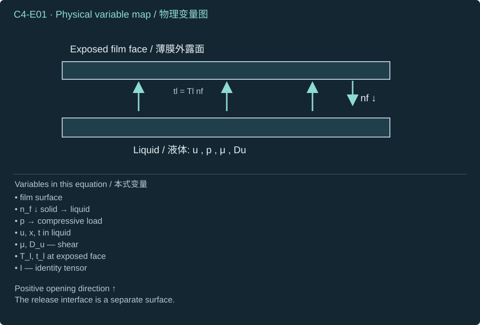

Pressure and shear act at the exposed film face; the drawn normal fixes the traction sign.

压力与剪切作用于薄膜外露面；所画法向决定牵引符号。

Step 2 — Integrate the traction in space to obtain force. Integrate force in time to obtain impulse. To obtain work, project traction onto the surface velocity before integrating. Pressure in Pa, impulse in N s and work in J cannot be equated. A nearly rigid surface can receive a substantial short stress and impulse while its displacement, hence deformation work, remains small.

步骤2——对牵引作空间积分得到力，再对力作时间积分得到冲量。求功时，则必须先将牵引投影到表面速度上再积分。单位分别为Pa的压力、N s的冲量与J的功不能相等。近刚性表面可能承受显著短时应力与冲量，但位移很小，因此变形功仍很小。

**Symbols before Eq. (C4-E02).**

**式（C4-E02）前的符号定义。**

| First individual definition / 第一项单独定义 | Second individual definition / 第二项单独定义 |
| --- | --- |
| $A_f(t)$ is the loaded solid surface (m²) $A_f(t)$为固体受载表面（m²） | $dA$ its surface-area element (m²), and $\int$ denotes integration over the indicated surface or time $dA$为表面积微元（m²），$\int$表示对所示表面或时间积分 |
| $\boldsymbol t_l$ is applied liquid traction (Pa) $\boldsymbol t_l$为液体施加的牵引（Pa） | $\boldsymbol F_l$ its resultant (N) $\boldsymbol F_l$为其合力（N） |
| $\boldsymbol I_l$ its impulse (N s) $\boldsymbol I_l$为其冲量（N s） | $\mathcal W_l$ work delivered to the solid (J) $\mathcal W_l$为传入固体的功（J） |
| $\boldsymbol v_f$ is local solid surface velocity (m s⁻¹) $\boldsymbol v_f$为固体表面局部速度（m s⁻¹） | $t_a$ — Load-event start time (s) $t_a$ — 载荷事件开始时刻（s） |
| $t_b$ — Load-event end time (s) $t_b$ — 载荷事件结束时刻（s） | $t$ — Time (s) $t$ — 时间（s） |
| $dt$ — Time integration element (s) $dt$ — 时间积分微元（s） |  |

**Conventions and conditions.** The vector dot product projects force onto velocity; Subscripts l and f label liquid and film; $t_a<t_b$ fixes the integration interval..

**约定与条件。** 向量点乘将力投影到速度上；下标l和f表示液体与薄膜；$t_a<t_b$ 确定积分区间。。

(C4-E02) · Exact mechanical definitions

$$
\begin{aligned}\boldsymbol F_l(t)&=\int_{A_f(t)}\boldsymbol t_l\,dA,\\ \boldsymbol I_l&=\int_{t_a}^{t_b}\boldsymbol F_l(t)\,dt,\\ \mathcal W_l&=\int_{t_a}^{t_b}\int_{A_f(t)}\boldsymbol t_l\cdot\boldsymbol v_f\,dA\,dt.\end{aligned}
$$

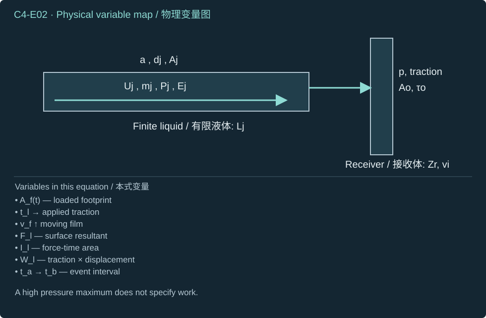

The same footprint supplies force and impulse, but surface motion is additionally required for work.

同一作用范围决定力与冲量，而求功还需要表面运动信息。

## 3 · Retain the minimum transient film mechanics

## 3 · 保留最必要的薄膜瞬态力学

Step 3 — Adopt a homogeneous isotropic Kirchhoff–Love plate with linear elastic plane stress, small strains, small slopes and thickness small compared with its deformation length. Integrating density through thickness gives areal mass. Integrating the bending stress moment through the symmetric thickness gives bending stiffness: the second moment integral is the thickness cubed divided by twelve. A bonded multilayer requires its own laminate stiffness; two films’ stiffnesses cannot be added without locating the common neutral surface.

步骤3——采用均匀各向同性Kirchhoff–Love薄板，假设线弹性平面应力、小应变、小斜率，且厚度远小于变形长度。沿厚度积分密度得到面密度；沿对称厚度积分弯曲应力矩得到弯曲刚度，其中二阶矩积分为厚度立方除以十二。粘接多层结构需要自身的层合刚度；若未确定共同中性面，不能简单相加两层薄膜的刚度。

**Symbols before Eq. (C4-E03).**

**式（C4-E03）前的符号定义。**

| First individual definition / 第一项单独定义 | Second individual definition / 第二项单独定义 |
| --- | --- |
| $m_A>0$ is film areal mass (kg m⁻²) $m_A>0$为薄膜面密度（kg m⁻²） | $D_f>0$ bending stiffness (N m) $D_f>0$为弯曲刚度（N m） |
| $\rho_f>0$ constant density (kg m⁻³) $\rho_f>0$为恒定密度（kg m⁻³） | $h_f>0$ film thickness (m) $h_f>0$为薄膜厚度（m） |
| $E_f>0$ Young’s modulus (Pa) $E_f>0$为杨氏模量（Pa） | $-1<\nu_f<1/2$ Poisson’s ratio (dimensionless) $-1<\nu_f<1/2$为泊松比（无量纲） |
| $z$ is thickness coordinate (m), zero at the neutral midplane $z$为厚度坐标（m），中性面处为零 | $dz$ is its integration element (m) $dz$为其积分微元（m） |

**Conventions and conditions.** $\int$ is definite thickness integration; Subscripts A and f label areal quantity and film.

**约定与条件。** $\int$表示沿厚度定积分；下标A与f标识面量与薄膜。

(C4-E03) · Derived plate parameters under constitutive assumptions

$$
m_A=\int_{-h_f/2}^{h_f/2}\rho_f\,dz=\rho_fh_f,\qquad D_f=\frac{E_f}{1-\nu_f^2}\int_{-h_f/2}^{h_f/2}z^2\,dz=\frac{E_fh_f^3}{12(1-\nu_f^2)}
$$

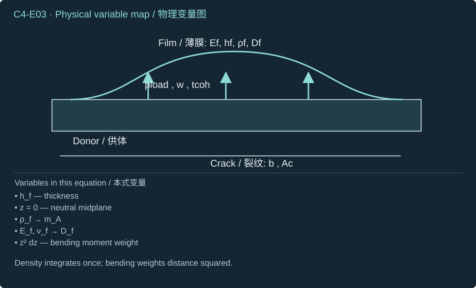

Areal inertia and bending stiffness come from different thickness integrals.

面惯性与弯曲刚度来自不同的厚度积分。

Step 4 — Form the kinetic, bending and prescribed-pretension energies. Curvature is the second spatial derivative of displacement in this linear plate model. The two in-plane curvature directions and twist couple through Poisson’s ratio. Pretension is held uniform; its energy penalizes slope. These expressions distinguish the energy stored by shape from the kinetic energy carried by motion.

步骤4——写出动能、弯曲能与给定预张力能。在此线性薄板模型中，曲率由位移的二阶空间导数给出。两个面内方向的曲率及扭曲通过泊松比耦合。预张力假定均匀，其储能与斜率有关。这些表达式区分形状储能与运动动能。

**Symbols before Eq. (C4-E04).**

**式（C4-E04）前的符号定义。**

| First individual definition / 第一项单独定义 | Second individual definition / 第二项单独定义 |
| --- | --- |
| $\Omega_f$ is the reference film plane (m²) $\Omega_f$为薄膜参考平面（m²） | $dA$ its area element (m²) $dA$为面积微元（m²） |
| $w(x,y,t)$ vertical displacement (m) $w(x,y,t)$为竖直位移（m） | $x$ — First Cartesian in-plane coordinate (m) $x$ — 第一笛卡尔面内坐标（m） |
| $y$ — Second Cartesian in-plane coordinate (m) $y$ — 第二笛卡尔面内坐标（m） | $t$ time (s) $t$为时间（s） |
| $m_A$ is areal mass (kg m⁻²) $m_A$为面密度（kg m⁻²） | $D_f$ bending stiffness (N m) $D_f$为弯曲刚度（N m） |
| $\nu_f$ Poisson’s ratio $\nu_f$为泊松比 | $T_0\ge0$ prescribed isotropic tensile force per edge length (N m⁻¹) $T_0\ge0$为给定各向同性单位边长拉力（N m⁻¹） |
| $K_f$ — Film kinetic energy (J) $K_f$ — 薄膜动能（J） | $U_b$ — Plate bending energy, not bubble internal energy in this unit (J) $U_b$ — 板弯曲能，本单元不表示气泡内能（J） |
| $U_T$ — Stored pretension energy (J) $U_T$ — 预张力储能（J） |  |

**Conventions and conditions.** A dot differentiates in time; subscripts $xx,yy,xy$ differentiate twice in the indicated coordinates, giving curvatures (m⁻¹); $\nabla_\parallel$ is the in-plane gradient; $|\ |$ denotes Euclidean magnitude; $\int$ denotes area integration; Labels f, b, T identify film, bending and tension.

**约定与条件。** 上点表示时间导数；下标$xx,yy,xy$表示对所示坐标求二阶导数，得到曲率（m⁻¹）；$\nabla_\parallel$为面内梯度；$|\ |$为欧氏模长；$\int$表示面积积分；标签f、b、T分别指薄膜、弯曲与张力。

(C4-E04) · Linear-plate energy model

$$
\begin{aligned}K_f&=\frac{m_A}{2}\int_{\Omega_f}\dot w^2\,dA,\\U_b&=\frac{D_f}{2}\int_{\Omega_f}\left[w_{xx}^2+w_{yy}^2+2\nu_fw_{xx}w_{yy}+2(1-\nu_f)w_{xy}^2\right]dA,\\U_T&=\frac{T_0}{2}\int_{\Omega_f}|\nabla_\parallel w|^2\,dA.\end{aligned}
$$

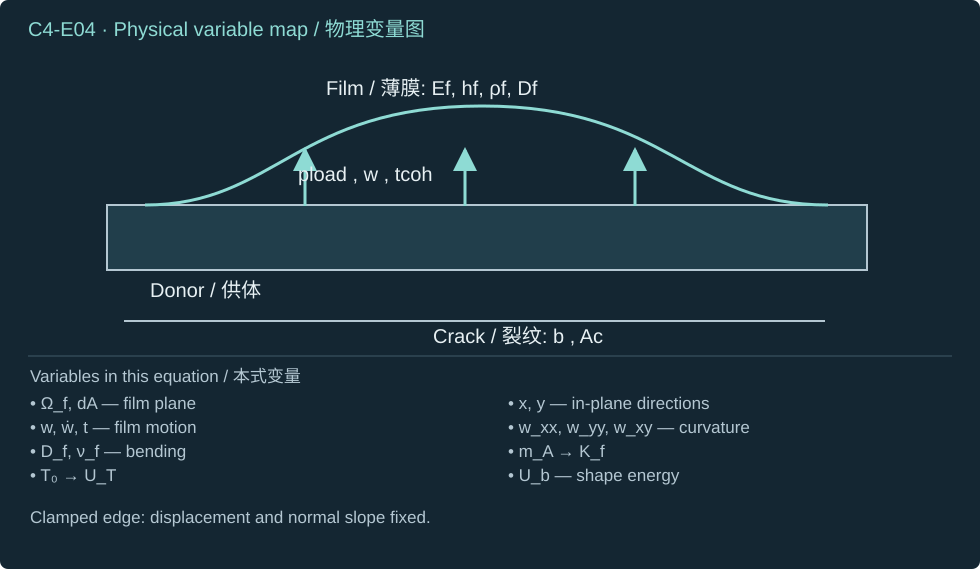

Bending energy is stored by curvature; inertia depends on velocity.

曲率储存弯曲能，速度决定惯性动能。

Step 5 — Vary displacement while holding a clamped boundary fixed. Two integrations by parts convert each bending second derivative to a fourth derivative acting on displacement; the boundary terms vanish because both the displacement variation and its normal slope vanish. One integration by parts converts the tension term to a negative Laplacian. The resulting transverse virtual-work balance has pressure units in every term.

步骤5——在固定夹持边界的条件下对位移作变分。对弯曲的各二阶导数作两次分部积分，转为作用于位移的四阶导数；由于位移变分及其法向斜率变分均为零，边界项消失。对张力项作一次分部积分，得到负拉普拉斯算子。所得横向虚功平衡中，每一项均具有压力单位。

**Symbols before Eq. (C4-E40).**

**式（C4-E40）前的符号定义。**

| First individual definition / 第一项单独定义 | Second individual definition / 第二项单独定义 |
| --- | --- |
| $\Omega_f$ is the smooth reference film plane (m²), $\partial\Omega_f$ its boundary $\Omega_f$为光滑薄膜参考平面（m²），$\partial\Omega_f$为其边界 | $dA$ area element (m²) $dA$为面积微元（m²） |
| $d\ell$ boundary arc-length element (m) $d\ell$为边界弧长微元（m） | $w$ is displacement (m) $w$为位移（m） |
| $\delta w$ an admissible infinitesimal variation (m) $\delta w$为容许无穷小变分（m） | $\delta U_b$ — Bending-energy variation (J) $\delta U_b$ — 弯曲能变分（J） |
| $\delta U_T$ — Pretension-energy variation (J) $\delta U_T$ — 预张力能变分（J） | $\alpha$ — Cartesian in-plane direction index, taking 1 or 2 (dimensionless) $\alpha$ — 取 1 或 2 的笛卡尔面内方向指标（无量纲） |
| $\beta$ — Cartesian in-plane direction index, taking 1 or 2 (dimensionless) $\beta$ — 取 1 或 2 的笛卡尔面内方向指标（无量纲） | $w_{\alpha\beta}=\partial_\alpha\partial_\beta w$ is curvature (m⁻¹) $w_{\alpha\beta}=\partial_\alpha\partial_\beta w$为曲率（m⁻¹） |
| $D_f$ is bending stiffness (N m) $D_f$为弯曲刚度（N m） | $\nu_f$ Poisson’s ratio $\nu_f$为泊松比 |
| $T_0$ pretension (N m⁻¹) $T_0$为预张力（N m⁻¹） | $B_{\alpha\beta}$ the bending-energy tensor conjugate to curvature (N) $B_{\alpha\beta}$为与曲率共轭的弯曲能张量（N） |
| $\delta_{\alpha\beta}$ is the dimensionless Kronecker identity, distinct from variation notation $\delta_{\alpha\beta}$为无量纲Kronecker单位张量，与变分记号不同 | $n_\alpha$ — Component of the outward in-plane unit normal (dimensionless) $n_\alpha$ — 面内外单位法向的分量（无量纲） |
| $n_\beta$ — Component of the outward in-plane unit normal (dimensionless) $n_\beta$ — 面内外单位法向的分量（无量纲） | $\boldsymbol0$ is zero gradient (dimensionless) $\boldsymbol0$为零梯度（无量纲） |

**Conventions and conditions.** $\partial_\alpha$ is coordinate differentiation (m⁻¹); $\partial_n$ its derivative; $\nabla_\parallel$ and $\nabla_\parallel^2$ are in-plane gradient and Laplacian; $\int,\oint$ denote area and closed-boundary integrals; $\Rightarrow$ uses zero tangential derivative of an identically zero boundary variation plus the prescribed zero normal derivative; $\sum_{\alpha,\beta=1}^{2}$ sums all four index pairs..

**约定与条件。** $\partial_\alpha$为坐标求导（m⁻¹）；$\partial_n$为沿该法向求导；$\nabla_\parallel$及$\nabla_\parallel^2$为面内梯度及拉普拉斯算子；$\int,\oint$分别表示面积积分与闭合边界积分；$\Rightarrow$使用恒为零的边界变分具有零切向导数，并结合给定零法向导数；$\sum_{\alpha,\beta=1}^{2}$ 对四种指标组合求和。。

(C4-E40) · Explicit integration-by-parts boundary terms

$$
\begin{aligned}B_{\alpha\beta}&=D_f[(1-\nu_f)w_{\alpha\beta}+\nu_f\delta_{\alpha\beta}\nabla_\parallel^2w],\\\delta U_b&=\sum_{\alpha,\beta=1}^{2}\int_{\Omega_f}B_{\alpha\beta}\partial_\alpha\partial_\beta(\delta w)\,dA\\&=\sum_{\alpha,\beta=1}^{2}\oint_{\partial\Omega_f}n_\alpha B_{\alpha\beta}\partial_\beta(\delta w)\,d\ell-\sum_{\alpha,\beta=1}^{2}\int_{\Omega_f}(\partial_\alpha B_{\alpha\beta})\partial_\beta(\delta w)\,dA\\&=\sum_{\alpha,\beta=1}^{2}\oint_{\partial\Omega_f}[n_\alpha B_{\alpha\beta}\partial_\beta(\delta w)-n_\beta(\partial_\alpha B_{\alpha\beta})\delta w]\,d\ell+\sum_{\alpha,\beta=1}^{2}\int_{\Omega_f}(\partial_\beta\partial_\alpha B_{\alpha\beta})\delta w\,dA,\\\delta U_T&=T_0\oint_{\partial\Omega_f}\delta w\,\partial_nw\,d\ell-T_0\int_{\Omega_f}\delta w\nabla_\parallel^2w\,dA,\\\delta w=0,\quad\partial_n\delta w=0&\ \Longrightarrow\ \nabla_\parallel\delta w=\boldsymbol0\quad\text{on the fixed clamp}.\end{aligned}
$$

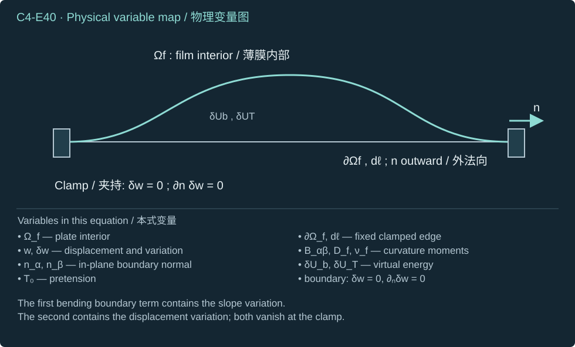

Two integrations by parts expose the boundary moment and shear terms before they are removed.

两次分部积分先明确显示边界弯矩与剪力项，再依据条件将其消去。

**Symbols before Eq. (C4-E05).**

**式（C4-E05）前的符号定义。**

| First individual definition / 第一项单独定义 | Second individual definition / 第二项单独定义 |
| --- | --- |
| $\delta w$ is a displacement variation (m) $\delta w$为位移变分（m） | $U_b$ — Plate bending energy, not bubble internal energy in this unit (J) $U_b$ — 板弯曲能，本单元不表示气泡内能（J） |
| $U_T$ — Stored pretension energy (J) $U_T$ — 预张力储能（J） | $D_f$ is bending stiffness (N m) $D_f$为弯曲刚度（N m） |
| $\nu_f$ is dimensionless Poisson’s ratio $\nu_f$为无量纲泊松比 | $T_0$ is uniform pretension (N m⁻¹) $T_0$为均匀预张力（N m⁻¹） |
| $w$ is transverse displacement (m) $w$为横向位移（m） | $x$ — First Cartesian in-plane coordinate (m) $x$ — 第一笛卡尔面内坐标（m） |
| $y$ — Second Cartesian in-plane coordinate (m) $y$ — 第二笛卡尔面内坐标（m） | $\Omega_f$ is film area (m²) $\Omega_f$为薄膜面积（m²） |
| $dA$ is its element (m²) $dA$为面积微元（m²） |  |

**Conventions and conditions.** Subscripts $xxxx,xxyy,yyyy$ denote the indicated fourth derivatives (m⁻³); $\nabla_\parallel^2=\partial_x^2+\partial_y^2$ is the in-plane Laplacian; $\nabla_\parallel^4$ is that Laplacian applied twice; $\int$ is area integration; The variations and their normal slopes vanish at a clamped boundary; $\delta$ denotes an infinitesimal admissible variation, not physical crack opening here.

**约定与条件。** 下标$xxxx,xxyy,yyyy$表示所示四阶导数（m⁻³）；$\nabla_\parallel^2=\partial_x^2+\partial_y^2$为面内拉普拉斯算子；$\nabla_\parallel^4$为将该算子作用两次；$\int$表示面积积分；夹持边界处变分及其法向斜率均为零；$\delta$在此表示无穷小容许变分，而非物理裂纹张开。

(C4-E05) · Derived variational identity for fixed clamps

$$
\begin{aligned}\delta U_b&=D_f\int_{\Omega_f}\left[w_{xxxx}+\{2\nu_f+2(1-\nu_f)\}w_{xxyy}+w_{yyyy}\right]\delta w\,dA\\&=D_f\int_{\Omega_f}(w_{xxxx}+2w_{xxyy}+w_{yyyy})\delta w\,dA=D_f\int_{\Omega_f}\nabla_\parallel^4w\,\delta w\,dA,\\\delta U_T&=-T_0\int_{\Omega_f}\nabla_\parallel^2w\,\delta w\,dA.\end{aligned}
$$

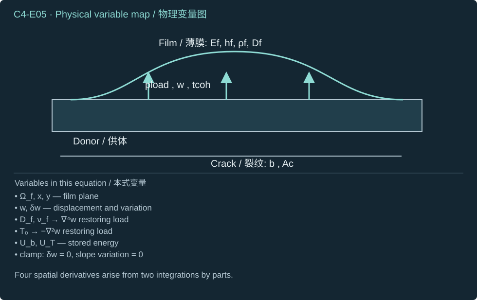

A fixed clamp removes the boundary virtual-work terms.

固定夹持边界使边界虚功项消失。

**Symbols before Eq. (C4-E06).**

**式（C4-E06）前的符号定义。**

| First individual definition / 第一项单独定义 | Second individual definition / 第二项单独定义 |
| --- | --- |
| $w(\boldsymbol x,t)$ is film displacement in the positive departure direction (m) $w(\boldsymbol x,t)$为沿正离开方向的薄膜位移（m） | $\boldsymbol x=(x,y)$ is in-plane position (m) $\boldsymbol x=(x,y)$为面内位置（m） |
| $t$ time (s) $t$为时间（s） | $\dot w$ — Film transverse velocity (m s⁻¹) $\dot w$ — 薄膜横向速度（m s⁻¹） |
| $\ddot w$ — Film transverse acceleration (m s⁻²) $\ddot w$ — 薄膜横向加速度（m s⁻²） | $m_A$ is areal mass (kg m⁻²) $m_A$为面密度（kg m⁻²） |
| $D_f$ bending stiffness (N m) $D_f$为弯曲刚度（N m） | $T_0\ge0$ pretension (N m⁻¹) $T_0\ge0$为预张力（N m⁻¹） |
| $p_{\rm load}$ is net applied transverse traction projected positively (Pa) $p_{\rm load}$为沿正方向投影的净外加横向牵引（Pa） | $t_{\rm coh}\ge0$ is an opening-resisting cohesive traction magnitude (Pa) $t_{\rm coh}\ge0$为抵抗张开的内聚牵引幅值（Pa） |

**Conventions and conditions.** $\nabla_\parallel^2$ is in-plane Laplacian (m⁻²), and $\nabla_\parallel^4$ its square; $\partial_n$ differentiates along the outward in-plane boundary normal; Initial zero is displacement or velocity according to its row; Labels load and coh identify applied and cohesive forces.

**约定与条件。** $\nabla_\parallel^2$为面内拉普拉斯算子（m⁻²），$\nabla_\parallel^4$为其平方；$\partial_n$表示沿面内边界外法向求导；初始零值按对应行分别表示位移或速度；标签load和coh表示外载与内聚力。

(C4-E06) · Reduced transient momentum balance with explicit initial/boundary data

$$
\begin{aligned}m_A\ddot w+D_f\nabla_\parallel^4w-T_0\nabla_\parallel^2w&=p_{\rm load}-t_{\rm coh},\\w(\boldsymbol x,0)=0,\quad\dot w(\boldsymbol x,0)&=0,\\w=0,\quad\partial_n w&=0\quad\text{on a clamped edge}.\end{aligned}
$$

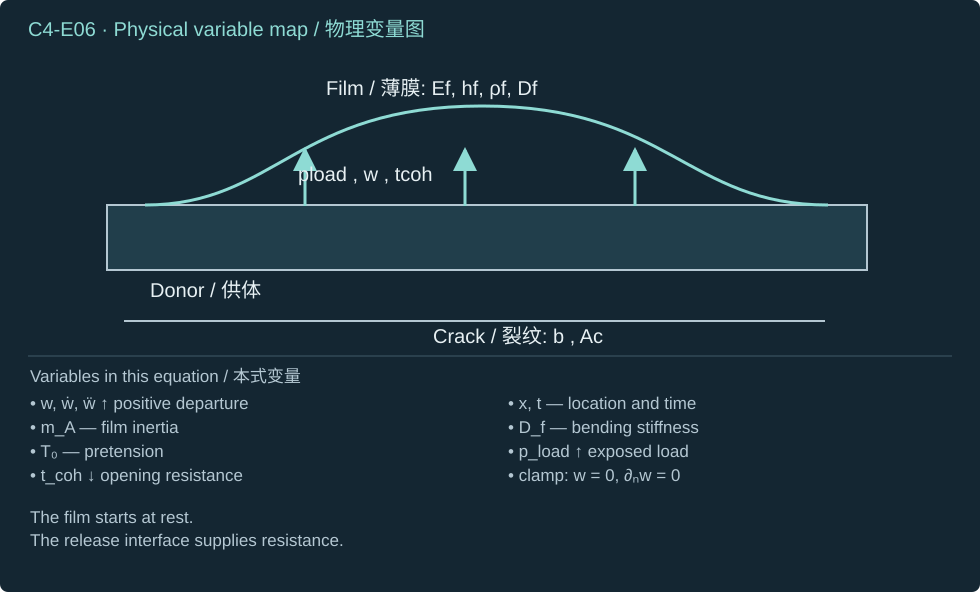

Film acceleration balances applied traction, elastic restoring forces and cohesive resistance.

薄膜加速度由外加牵引、弹性恢复力与内聚阻力的平衡决定。

A fixed clamp also has zero boundary velocity and zero normal velocity slope. Multiply the plate balance by velocity and integrate over its plane. The inertia term differentiates kinetic energy; the same two spatial integrations by parts now differentiate bending energy, and one differentiates pretension energy. Thus the transient balance has a direct work check. Cohesive power is the work rate taken from plate motion; its recoverable and irreversible parts must be assigned by the interface law.

固定夹持边界还具有零边界速度及零法向速度斜率。将薄板平衡乘以速度，再在平面上积分。惯性项成为动能的导数；同样两次空间分部积分使弯曲项成为弯曲能导数，一次分部积分使张力项成为预张力能导数。因此，瞬态平衡具有直接的功检验。内聚功率是从板运动中取出的功率，其可恢复与不可逆部分必须由界面关系分配。

**Symbols before Eq. (C4-E41).**

**式（C4-E41）前的符号定义。**

| First individual definition / 第一项单独定义 | Second individual definition / 第二项单独定义 |
| --- | --- |
| $\Omega_f$ is reference film area (m²) $\Omega_f$为薄膜参考面积（m²） | $dA$ its area element (m²) $dA$为面积微元（m²） |
| $w$ displacement (m) $w$为位移（m） | $\dot w$ — Film transverse velocity (m s⁻¹) $\dot w$ — 薄膜横向速度（m s⁻¹） |
| $\ddot w$ — Film transverse acceleration (m s⁻²) $\ddot w$ — 薄膜横向加速度（m s⁻²） | $m_A$ is areal mass (kg m⁻²) $m_A$为面密度（kg m⁻²） |
| $D_f$ bending stiffness (N m) $D_f$为弯曲刚度（N m） | $T_0$ constant pretension (N m⁻¹) $T_0$为恒定预张力（N m⁻¹） |
| $p_{\rm load}$ applied transverse traction (Pa) $p_{\rm load}$为外加横向牵引（Pa） | $t_{\rm coh}$ resisting cohesive traction (Pa) $t_{\rm coh}$为抵抗内聚牵引（Pa） |
| $K_f$ — Film kinetic energy (J) $K_f$ — 薄膜动能（J） | $U_b$ — Plate bending energy, not bubble internal energy in this unit (J) $U_b$ — 板弯曲能，本单元不表示气泡内能（J） |
| $U_T$ — Stored pretension energy (J) $U_T$ — 预张力储能（J） | $t$ is time (s) $t$为时间（s） |

**Conventions and conditions.** $d/dt$ is its derivative; $\nabla_\parallel^2$ is planar Laplacian and $\nabla_\parallel^4$ its square; $\int$ is area integration; The derivatives are valid for the stated constant parameters and sufficiently regular fields at a fixed clamp with zero velocity and normal velocity slope; Every row has power units W; f, b, T, load and coh label film, bending, tension, applied and cohesive.

**约定与条件。** $d/dt$为时间导数；$\nabla_\parallel^2$为平面拉普拉斯算子，$\nabla_\parallel^4$为其平方；$\int$表示面积积分；导数适用于所述恒定参数、足够正则的场，以及速度和法向速度斜率均为零的固定夹持边界；各行单位均为功率W；f、b、T、load、coh分别表示薄膜、弯曲、张力、外加及内聚。

(C4-E41) · Transient plate power identity under fixed clamps

$$
\begin{aligned}\int_{\Omega_f}m_A\ddot w\dot w\,dA&=\frac{dK_f}{dt},\qquad \int_{\Omega_f}D_f\nabla_\parallel^4w\dot w\,dA=\frac{dU_b}{dt},\\-\int_{\Omega_f}T_0\nabla_\parallel^2w\dot w\,dA&=\frac{dU_T}{dt},\\\frac{d}{dt}(K_f+U_b+U_T)&=\int_{\Omega_f}p_{\rm load}\dot w\,dA-\int_{\Omega_f}t_{\rm coh}\dot w\,dA.\end{aligned}
$$

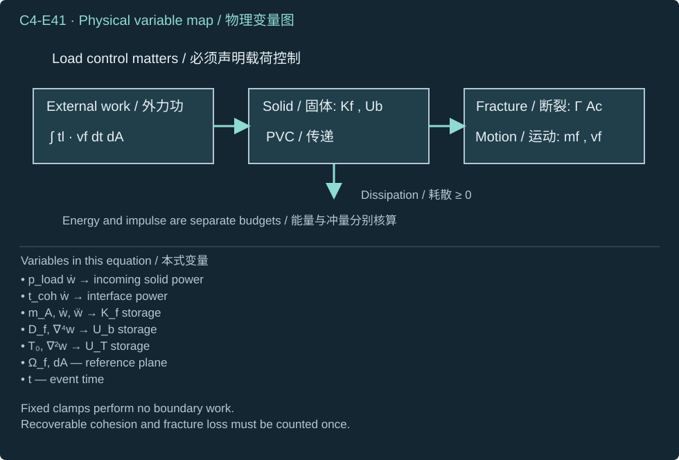

The transient plate equation conserves power between applied work, motion, shape and interface response.

瞬态薄板方程在外加功、运动、形状与界面响应之间保持功率守恒。

This equation is an exact balance inside an adopted reduced plate model, not an exact description of every payload. Its bending and tension terms have units N m × m⁻³ and N m⁻¹ × m⁻¹, respectively, both Pa. Setting mass to zero recovers quasistatic balance; setting stiffness, tension and cohesion to zero recovers free areal acceleration. Large slope, significant stretching, plasticity, crystal anisotropy, finite thickness or evolving contact requires a refined structural model. The static clamped-plate law is independently documented in the MIT plate notes; the derivation here retains transient inertia. [MIT plate benchmark](https://ocw.mit.edu/courses/2-080j-structural-mechanics-fall-2013/resources/mit2_080jf13_lecture7/)

此方程是在所采用降阶薄板模型内部的严格平衡，而非所有对象的精确描述。弯曲项与张力项的单位分别为N m × m⁻³及N m⁻¹ × m⁻¹，均为Pa。将质量设为零得到准静态平衡；将刚度、张力及内聚力设为零则得到无约束面质量的自由加速。大斜率、显著拉伸、塑性、晶体各向异性、有限厚度或变化接触需要更完善的结构模型。静态夹持薄板关系可由MIT薄板讲义独立核对；本章推导保留瞬态惯性。[MIT薄板基准](https://ocw.mit.edu/courses/2-080j-structural-mechanics-fall-2013/resources/mit2_080jf13_lecture7/)

Step 6 — Keep the intermediate PVC sheet as a mechanical participant. As a simple transverse two-sheet model, assign each layer its own areal inertia, stiffness and support. The unknown transmitted traction acts with opposite signs on the two sheets by Newton’s third law. A contact or bond law must determine it. This model does not describe a fully bonded laminate’s in-plane composite bending; such a laminate needs compatibility and the appropriate laminate stiffness instead.

步骤6——将中间PVC片层保留为独立力学环节。作为简单横向双片层模型，给每层指定各自面惯性、刚度与支承。根据牛顿第三定律，未知传递牵引对两片层的作用符号相反，必须由接触或粘接关系确定。此模型不描述完全粘接层合结构的面内组合弯曲；后者应满足相容条件并采用相应层合刚度。

**Symbols before Eq. (C4-E07).**

**式（C4-E07）前的符号定义。**

| First individual definition / 第一项单独定义 | Second individual definition / 第二项单独定义 |
| --- | --- |
| $w_P$ — PVC displacement along the common positive direction (m) $w_P$ — 沿共同正方向的 PVC 位移（m） | $w$ — Film displacement along the same positive direction as PVC displacement (m) $w$ — 与 PVC 位移采用相同正方向的薄膜位移（m） |
| $m_{A,P}$ — PVC areal mass (kg m⁻²) $m_{A,P}$ — PVC 面密度（kg m⁻²） | $m_A$ — Film areal mass (kg m⁻²) $m_A$ — 薄膜面密度（kg m⁻²） |
| $D_P$ — PVC bending stiffness (N m) $D_P$ — PVC 弯曲刚度（N m） | $D_f$ — Film bending rigidity (N m) $D_f$ — 薄膜弯曲刚度（N m） |
| $T_P$ — Prescribed PVC pretension (N m⁻¹) $T_P$ — 给定 PVC 预张力（N m⁻¹） | $T_0$ — Prescribed isotropic tensile force per edge length (N m⁻¹) $T_0$ — 给定的单位边长各向同性拉力（N m⁻¹） |
| $p_{\rm liq}$ is net liquid traction on PVC (Pa) $p_{\rm liq}$为液体作用于PVC的净牵引（Pa） | $t_{P\to f}$ transmitted PVC-to-film traction projected positively (Pa) $t_{P\to f}$为沿正方向投影的PVC传向薄膜牵引（Pa） |
| $t_{\rm coh}$ film-release resistance (Pa) $t_{\rm coh}$为薄膜释放阻力（Pa） |  |

**Conventions and conditions.** double dots are accelerations (m s⁻²); $\nabla_\parallel^2$ is the in-plane Laplacian and $\nabla_\parallel^4$ its square; P labels PVC, f film, A areal, liq liquid and coh cohesion; the arrow labels the transmission direction; Each sheet has its actual initial and support conditions; No value of transmitted traction is supplied without an additional contact/bond closure.

**约定与条件。** 双上点为加速度（m s⁻²）；$\nabla_\parallel^2$为面内拉普拉斯算子，$\nabla_\parallel^4$为其平方；P表示PVC，f表示薄膜，A表示面量，liq表示液体，coh表示内聚；箭头标识传递方向；每层均具有自身实际初始及支承条件；若无附加接触／粘接闭合关系，传递牵引就尚未确定。

(C4-E07) · Conditional coupled-sheet model

$$
\begin{aligned}m_{A,P}\ddot w_P+D_P\nabla_\parallel^4w_P-T_P\nabla_\parallel^2w_P&=p_{\rm liq}-t_{P\to f},\\m_A\ddot w+D_f\nabla_\parallel^4w-T_0\nabla_\parallel^2w&=t_{P\to f}-t_{\rm coh}.\end{aligned}
$$

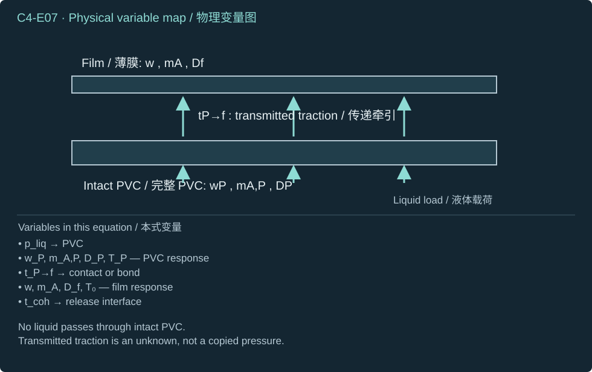

The PVC-to-film load follows intermediate-sheet motion and contact.

PVC传向薄膜的载荷由中间片层运动与接触决定。

Step 7 — Integrate the transient film equation through a finite pulse. The exact reduced balance includes the time-integrated restoring and cohesive forces. Only when those impulses are small compared with the applied impulse does a free velocity jump follow. A film clamped to a rigid donor over the entire loaded region does not meet that condition. Spatially resolved fluid inertia must not be counted again as an independently added fluid mass.

步骤7——在有限脉冲期间积分薄膜瞬态方程。降阶模型的严格积分平衡包含恢复力与内聚力的时间积分。只有这些冲量相较外加冲量很小时，才可得到自由速度跃变。若整个受载区都被刚性供体约束，就不满足这一条件。已经在流体求解中解析的惯性，也不能再以独立附加液体质量重复计入。

**Symbols before Eq. (C4-E08).**

**式（C4-E08）前的符号定义。**

| First individual definition / 第一项单独定义 | Second individual definition / 第二项单独定义 |
| --- | --- |
| $m_A$ is film areal mass (kg m⁻²) $m_A$为薄膜面密度（kg m⁻²） | $w(\boldsymbol x,t)$ vertical displacement (m) $w(\boldsymbol x,t)$为竖直位移（m） |
| $\boldsymbol x$ in-plane position (m) $\boldsymbol x$为面内位置（m） | $\dot w$ velocity (m s⁻¹) $\dot w$为速度（m s⁻¹） |
| $t_a$ — Load-event start time (s) $t_a$ — 载荷事件开始时刻（s） | $t_b$ — Load-event end time (s) $t_b$ — 载荷事件结束时刻（s） |
| $t$ — Time (s) $t$ — 时间（s） | $dt$ — Time integration element (s) $dt$ — 时间积分微元（s） |
| $J_A$ is local applied impulse per area (Pa s) $J_A$为局部单位面积外加冲量（Pa s） | $p_{\rm load}$ net applied traction (Pa) $p_{\rm load}$为净外加牵引（Pa） |
| $t_{\rm coh}$ cohesive resistance (Pa) $t_{\rm coh}$为内聚阻力（Pa） | $D_f$ bending stiffness (N m) $D_f$为弯曲刚度（N m） |
| $T_0$ pretension (N m⁻¹) $T_0$为预张力（N m⁻¹） |  |

**Conventions and conditions.** $\nabla_\parallel^2$ and $\nabla_\parallel^4$ are the in-plane Laplacian and its square; $\int$ integrates the actual local load/response during the pulse; Labels A, f, load and coh mean areal, film, applied and cohesive.

**约定与条件。** $\nabla_\parallel^2$与$\nabla_\parallel^4$为面内拉普拉斯算子及其平方；$\int$表示对脉冲期间实际局部载荷／响应积分；标签A、f、load、coh分别表示面量、薄膜、外加及内聚。

(C4-E08) · Exact time integral within the reduced plate model

$$
m_A[\dot w(\boldsymbol x,t_b)-\dot w(\boldsymbol x,t_a)]=J_A-\int_{t_a}^{t_b}[D_f\nabla_\parallel^4w-T_0\nabla_\parallel^2w+t_{\rm coh}]\,dt,\qquad J_A=\int_{t_a}^{t_b}p_{\rm load}\,dt
$$

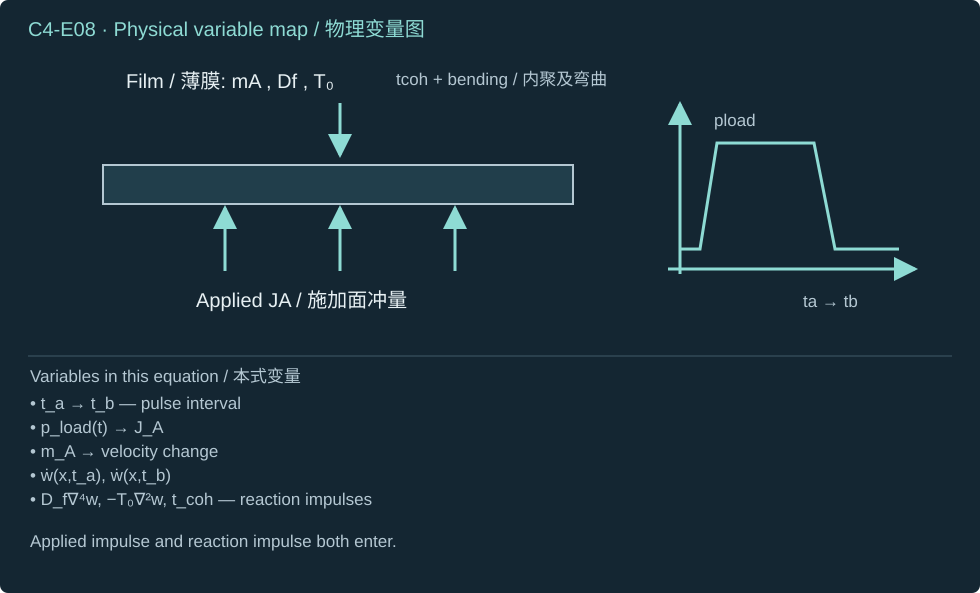

Pulse integration exposes the reactions that can invalidate a free velocity jump.

脉冲积分明确显示哪些反作用冲量会使自由速度跃变失效。

**Symbols before Eq. (C4-E09).**

**式（C4-E09）前的符号定义。**

| First individual definition / 第一项单独定义 | Second individual definition / 第二项单独定义 |
| --- | --- |
| $\Delta\dot w$ is the film velocity change from rest (m s⁻¹) $\Delta\dot w$为薄膜从静止开始的速度变化（m s⁻¹） | $J_A$ is local applied impulse per area (Pa s) $J_A$为局部单位面积外加冲量（Pa s） |
| $m_A>0$ film areal mass (kg m⁻²) $m_A>0$为薄膜面密度（kg m⁻²） | $\mathcal E_A$ resulting kinetic energy per area (J m⁻²) $\mathcal E_A$为所得单位面积动能（J m⁻²） |

**Conventions and conditions.** $\simeq$ marks negligible restoring/cohesive impulse during the pulse, not guaranteed transmission through an adhered stack; Subscript A labels quantities per area; $\Delta$ denotes final-minus-initial difference, and a dot is a time derivative.

**约定与条件。** $\simeq$表示脉冲期间恢复力／内聚力冲量可忽略，而非保证粘接叠层中的载荷传递；下标A表示单位面积量；$\Delta$表示终值减初值，上点为时间导数。

(C4-E09) · Short-pulse free-response approximation

$$
\Delta\dot w\simeq\frac{J_A}{m_A},\qquad \mathcal E_A\simeq\frac12m_A(\Delta\dot w)^2=\frac{J_A^2}{2m_A}
$$

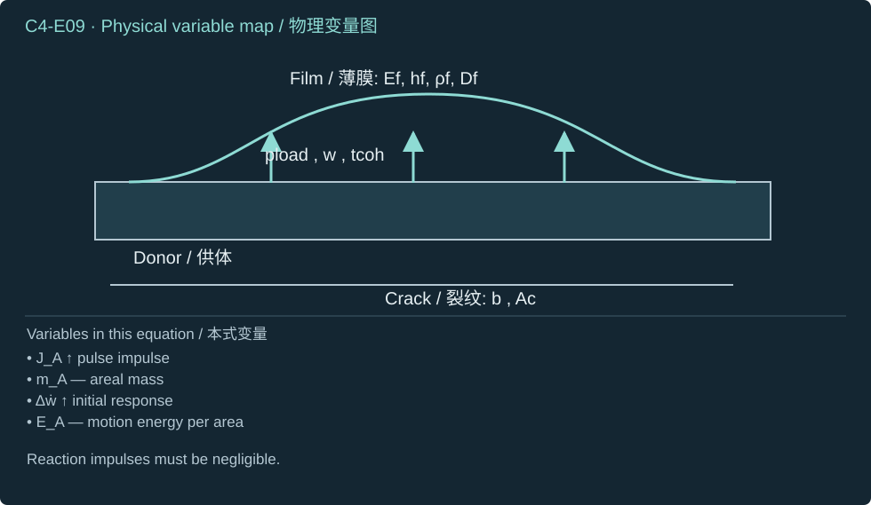

Impulse creates film kinetic energy that may subsequently feed deformation and fracture.

冲量产生薄膜动能，之后才可能转入变形与断裂。

For a deformation varying over a lateral length, compare the pulse duration with bending and tension response scales obtained by balancing inertia with the corresponding restoring term. A small-opening cohesive stiffness supplies a third scale. These are transient comparisons, not an invitation to a harmonic-resonance curriculum. A slow pulse alone is also insufficient to claim equilibrium if its shape is abrupt or its crack is rapidly propagating.

对在某一横向长度上变化的变形，将脉冲持续时间与惯性和相应恢复项平衡所得的弯曲、张力响应尺度比较。小张开内聚刚度还提供第三个尺度。这是瞬态比较，不需要另设简谐共振知识主线。若脉冲形状突变或裂纹高速扩展，仅仅持续时间较长也不足以宣称平衡。

**Symbols before Eq. (C4-E10).**

**式（C4-E10）前的符号定义。**

| First individual definition / 第一项单独定义 | Second individual definition / 第二项单独定义 |
| --- | --- |
| $t_b^{\rm scale}$ — Bending response-time estimate (s) $t_b^{\rm scale}$ — 弯曲响应时间估计（s） | $t_T^{\rm scale}$ — Pretension response-time estimate (s) $t_T^{\rm scale}$ — 预张力响应时间估计（s） |
| $t_n^{\rm scale}$ — Normal-cohesion response-time estimate (s) $t_n^{\rm scale}$ — 法向内聚响应时间估计（s） | $a_f>0$ is lateral deformation length (m) $a_f>0$为横向变形长度（m） |
| $m_A>0$ areal mass (kg m⁻²) $m_A>0$为面密度（kg m⁻²） | $D_f>0$ bending stiffness (N m) $D_f>0$为弯曲刚度（N m） |
| $T_0>0$ pretension (N m⁻¹) $T_0>0$为预张力（N m⁻¹） | $K_n>0$ small-opening normal cohesive stiffness (Pa m⁻¹) $K_n>0$为小张开法向内聚刚度（Pa m⁻¹） |

**Conventions and conditions.** superscript scale labels estimates and subscripts b, T, n identify the restoring mechanisms; $\sqrt{\ }$ is the positive root; If pretension or cohesion is absent, its corresponding timescale is omitted rather than divided by zero.

**约定与条件。** 上标scale表示估计，下标b、T、n标识恢复机制；$\sqrt{\ }$取正根；若预张力或内聚机制不存在，则不使用对应时间尺度，不能除以零。

(C4-E10) · Derived term-balance estimates

$$
t_b^{\rm scale}=a_f^2\sqrt{\frac{m_A}{D_f}},\qquad t_T^{\rm scale}=a_f\sqrt{\frac{m_A}{T_0}},\qquad t_n^{\rm scale}=\sqrt{\frac{m_A}{K_n}}
$$

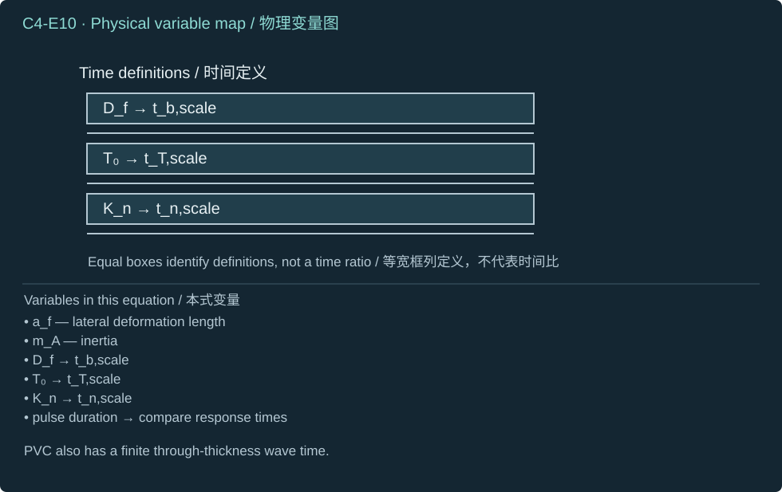

Pulse duration must be compared with the response scales of the actual load path.

脉冲持续时间须与实际传力路径的响应尺度比较。

## 4 · Separate strength from fracture work

## 4 · 区分强度与断裂功

Step 8 — Define crack driving force under an explicit loading control. Peak tensile cohesive traction is a local strength in Pa. Reversible work of adhesion is a thermodynamic surface-energy difference. Practical fracture energy includes the dissipation required to advance the real interface and has units J m⁻². For a quasistatic conservative mechanical system, differentiate its potential with respect to crack area while holding the stated source control fixed. Opening/shear mixture, temperature and crack speed can change the resistance.

步骤8——在明确加载控制方式下定义裂纹驱动力。峰值拉伸内聚牵引是单位为Pa的局部强度。可逆黏附功是热力学表面能差；实际断裂能还包含真实界面扩展所需耗散，单位为J m⁻²。对准静态保守力学系统，应在保持所述源控制量不变时，按裂纹面积对势能求导。张开／剪切混合、温度与裂纹速度均可能改变断裂阻力。

**Symbols before Eq. (C4-E11).**

**式（C4-E11）前的符号定义。**

| First individual definition / 第一项单独定义 | Second individual definition / 第二项单独定义 |
| --- | --- |
| $G$ is quasistatic energy-release rate (J m⁻²) $G$为准静态能量释放率（J m⁻²） | $\mathcal P$ total mechanical potential including the external loading system (J) $\mathcal P$为包含外部加载系统的总力学势能（J） |
| $A_c$ crack area (m²), and $\partial/\partial A_c$ a partial derivative $A_c$为裂纹面积（m²），$\partial/\partial A_c$为偏导数 | $\mathcal C$ labels the held loading control, such as pressure or displacement (—) $\mathcal C$标识保持不变的加载控制量，例如压力或位移，而非材料系数（—） |
| $\Gamma$ is fracture resistance (J m⁻²) $\Gamma$为断裂阻力（J m⁻²） | $\psi$ mode-mixture parameter (dimensionless) $\psi$为模态混合参数（无量纲） |
| $T_i$ interface temperature (K) $T_i$为界面温度（K） | $v_c$ crack-front speed (m s⁻¹) $v_c$为裂纹前沿速度（m s⁻¹） |

**Conventions and conditions.** it is not a material coefficient; Subscripts c and i label crack and interface; The inequality is an energetic propagation criterion for the specified fracture model, not a sufficient transfer criterion.

**约定与条件。** 下标c与i表示裂纹及界面；此不等式是指定断裂模型的能量扩展判据，而非充分转印判据。

(C4-E11) · Definition with quasistatic fracture criterion

$$
G=-\left.\frac{\partial\mathcal P}{\partial A_c}\right|_{\mathcal C},\qquad G\ge\Gamma(\psi,T_i,v_c)
$$

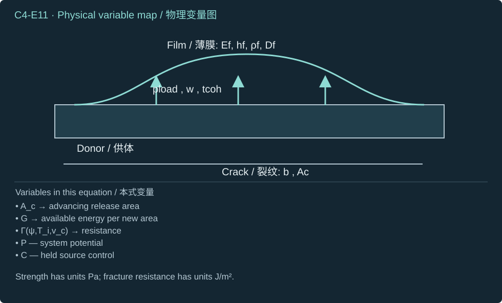

A crack is driven by energy per newly separated area, under a specified load control.

裂纹由每单位新分离面积的可用能量驱动，且加载控制必须明确。

The fluid pressure cannot be compared directly with fracture energy without a deformation length and mechanical relation. Transfer also involves competing fracture paths: the intended donor interface may release, an unintended bond may fail, or the payload may tear. Feng and colleagues studied how interface kinetics alter that competition in transfer printing; their result motivates measuring the actual rate and temperature dependence, not importing their PDMS values into a new PFC stack. [[R10]](../reference/sources.html#r10)

若没有变形长度和力学关系，流体压力就不能直接与断裂能比较。转印还涉及竞争断裂路径：可能是目标供体界面释放，也可能是错误粘接界面失效，或对象自身撕裂。Feng等研究了界面动力学如何改变转印中的竞争关系；该结果说明应测量实际速率和温度依赖性，而非将其PDMS参数直接用于新PFC叠层。[[R10]](../reference/sources.html#r10)

During rapid fracture, retain kinetic energy. For a specified crack-front model, the instantaneous solid power balance contains elastic storage, inertia, fracture consumption and other dissipation. This expression assumes that the chosen fracture energy accounts for the cohesive dissipation once; do not add a second copy of the same dissipation. It does not determine the crack path without the structural and interface equations.

快速断裂时必须保留动能。对指定裂纹前沿模型，固体瞬时功率平衡包含弹性储能、惯性、断裂消耗与其他耗散。下式假设所选断裂能已经计入一次内聚耗散，不能再重复加入同一耗散。若没有结构及界面方程，它仍不能确定裂纹路径。

**Symbols before Eq. (C4-E12).**

**式（C4-E12）前的符号定义。**

| First individual definition / 第一项单独定义 | Second individual definition / 第二项单独定义 |
| --- | --- |
| $P_{\rm load}$ is mechanical power delivered to the solid (W) $P_{\rm load}$为传入固体的力学功率（W） | $K_f$ its kinetic energy (J) $K_f$为固体动能（J） |
| $U_f$ its recoverable elastic energy including any recoverable interface energy (J), and $d/dt$ the time derivative with $t$ in s $U_f$为可恢复弹性能，含任何可恢复界面能（J），$d/dt$为时间导数 | $\mathcal L_c$ is the active crack-front line (—) $\mathcal L_c$为活跃裂纹前沿曲线（—） |
| $d\ell$ is its arc-length element (m) $d\ell$为弧长微元（m） | $v_c\ge0$ is front speed (m s⁻¹) $v_c\ge0$为前沿速度（m s⁻¹） |
| $\Gamma$ fracture energy (J m⁻²) $\Gamma$为断裂能（J m⁻²） | $\psi$ dimensionless mode mixture $\psi$为无量纲模态混合参数 |
| $T_i$ interface temperature (K) $T_i$为界面温度（K） | $P_{\rm other}\ge0$ is additional nonfracture dissipation (W) $P_{\rm other}\ge0$为其他非断裂耗散（W） |
| $t$ — Time (s) $t$ — 时间（s） |  |

**Conventions and conditions.** $\int$ integrates along the front; Labels load, f, c, i and other denote applied, solid film, crack, interface and remaining dissipative processes.

**约定与条件。** $\int$表示沿前沿积分；标签load、f、c、i、other分别表示外加、固体薄膜、裂纹、界面及其余耗散过程。

(C4-E12) · Conditional dynamic energy balance

$$
P_{\rm load}=\frac{d}{dt}(K_f+U_f)+\int_{\mathcal L_c}\Gamma(\psi,T_i,v_c)v_c\,d\ell+P_{\rm other}
$$

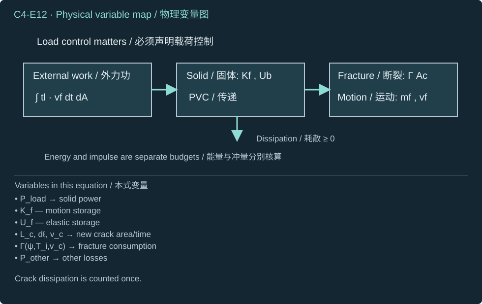

Dynamic loading can store kinetic energy before or during crack advance.

动态载荷可在裂纹扩展前或扩展中储存动能。

## 5 · Derive the circular blister benchmark completely

## 5 · 完整推导圆形鼓泡基准

Step 9 — Specify a solvable pressure-controlled limit. A circular pre-existing delamination lies beneath a thin isotropic plate; the bonded outer region clamps its edge. An external reservoir maintains a uniform positive pressure difference while the crack radius varies. Neglect inertia, pretension and membrane stretching. At the centre there is no point force or singular bending moment; displacement and curvature remain regular. This is a separate benchmark, not the 25-jet transient load.

步骤9——指定可解的恒压控制极限。薄各向同性板下方具有圆形预存脱层，其外部粘接区夹持边缘。在裂纹半径变化时，外部储库保持均匀正压差。忽略惯性、预张力及膜拉伸。中心没有点力或奇异弯矩，位移与曲率保持正则。这是独立基准，并非25射流瞬态载荷。

**Symbols before Eq. (C4-E13).**

**式（C4-E13）前的符号定义。**

| First individual definition / 第一项单独定义 | Second individual definition / 第二项单独定义 |
| --- | --- |
| $r\in[0,b]$ is radius in the plate plane (m) $r\in[0,b]$为板平面内半径（m） | $b>0$ delamination radius (m) $b>0$为脱层半径（m） |
| $w(r)$ opening displacement (m) $w(r)$为张开位移（m） | $p_0>0$ externally maintained pressure difference (Pa) $p_0>0$为外部保持的压差（Pa） |
| $D_f>0$ bending stiffness (N m) $D_f>0$为弯曲刚度（N m） | $\mathscr L_r$ is the axisymmetric planar Laplacian (m⁻²) $\mathscr L_r$为轴对称平面拉普拉斯算子（m⁻²） |
| $f$ is an arbitrary smooth radial function (—) $f$为任意光滑径向函数（—） | $g=\mathscr L_rw$ has units m⁻¹ $g=\mathscr L_rw$的单位为m⁻¹ |

**Conventions and conditions.** $d/dr$ and a prime denote radial differentiation; the operator at $r=0$ is its regular limit; Labels r, f and 0 denote radial operator, film/arbitrary function according to context, and maintained load; The two zero values prescribe edge displacement and slope.

**约定与条件。** $d/dr$及撇号表示径向求导；$r=0$处算子取正则极限；标签r、f、0分别表示径向算子、薄膜／任意函数（依语境）及恒定载荷；两个零值指定边缘位移与斜率。

(C4-E13) · Quasistatic plate boundary-value model

$$
\mathscr L_rg=\frac{p_0}{D_f},\qquad g=\mathscr L_rw,\qquad \mathscr L_r f=\frac1r\frac{d}{dr}\left(r\frac{df}{dr}\right),\qquad w(b)=0,\quad w^{\prime}(b)=0
$$

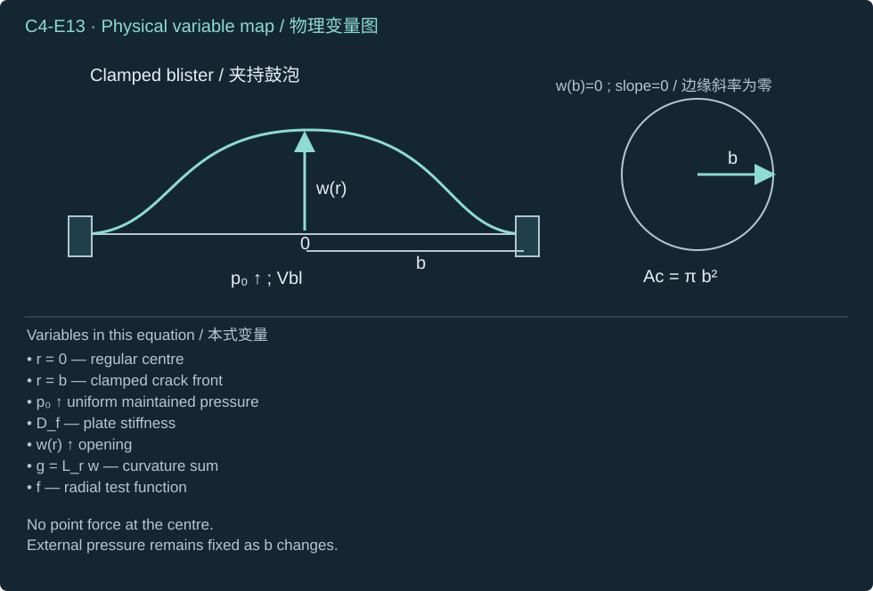

Uniform pressure loads a clamped circular delamination with regular central fields.

均匀压力作用于边缘夹持的圆形脱层，中心场必须正则。

Step 10 — First solve for the curvature sum. Multiply its radial Laplacian equation by radius, integrate once, and divide by radius only away from the centre. Regularity of the curvature gradient eliminates the inverse-radius term. Integrating again leaves a constant curvature offset, which the edge slope will later fix.

步骤10——先求曲率和。将其径向拉普拉斯方程乘以半径，积分一次，仅在离开中心时除以半径。曲率梯度的正则性排除反比于半径的项。再积分一次留下恒定曲率偏移，之后由边缘斜率确定。

**Symbols before Eq. (C4-E14).**

**式（C4-E14）前的符号定义。**

| First individual definition / 第一项单独定义 | Second individual definition / 第二项单独定义 |
| --- | --- |
| $r\in(0,b]$ is radial coordinate (m) $r\in(0,b]$为径向坐标（m） | $b$ is delamination radius (m) $b$为脱层半径（m） |
| $g(r)=\mathscr L_rw$ is the curvature sum (m⁻¹), with a prime and $d/dr$ denoting radial differentiation $g(r)=\mathscr L_rw$为曲率和（m⁻¹），撇号及$d/dr$表示径向求导 | $p_0$ is maintained pressure difference (Pa) $p_0$为恒定压差（Pa） |
| $D_f$ bending stiffness (N m) $D_f$为弯曲刚度（N m） | $C_1$ — Curvature integration constant (m⁻¹) $C_1$ — 曲率积分常数（m⁻¹） |
| $C_2$ — Curvature integration constant (m⁻¹) $C_2$ — 曲率积分常数（m⁻¹） | $\mathscr L_r$ is the radial Laplacian (m⁻²) $\mathscr L_r$为径向拉普拉斯算子（m⁻²） |
| $w$ displacement (m) $w$为位移（m） |  |

**Conventions and conditions.** $C_1=0$ follows from regular central curvature gradient and absence of a point load; the subscript 0 labels the maintained pressure, not the initial liquid pressure.

**约定与条件。** $C_1=0$来自中心曲率梯度正则及无点载荷条件；下标0标识恒定压力，而非液体初始压力。

(C4-E14) · Derived first two radial integrations

$$
\begin{aligned}\frac{d}{dr}(rg^{\prime})&=\frac{p_0r}{D_f},\\rg^{\prime}&=\frac{p_0r^2}{2D_f}+C_1,\\g^{\prime}&=\frac{p_0r}{2D_f}+\frac{C_1}{r},\quad C_1=0,\\g(r)&=\frac{p_0r^2}{4D_f}+C_2.\end{aligned}
$$

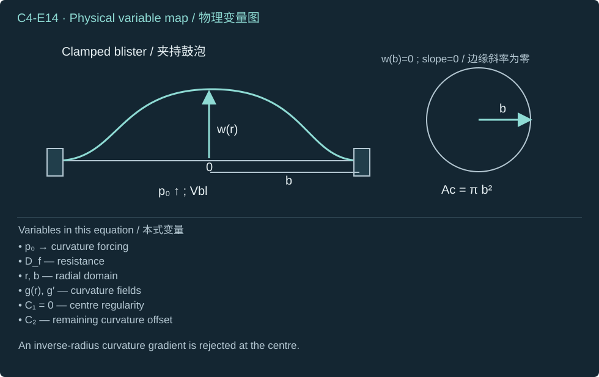

Regularity removes the singular integration constant before edge conditions are used.

在使用边缘条件之前，正则性先排除奇异积分常数。

Step 11 — Integrate the curvature sum to obtain displacement. The first integral gives a possible inverse-radius slope, excluded by central regularity. The second produces a quartic particular solution plus quadratic and constant terms. Apply zero slope at the edge to find the curvature offset, then zero edge displacement to find the remaining constant.

步骤11——对曲率和积分得到位移。第一次积分可能产生反比于半径的斜率，中心正则性将其排除。第二次积分得到四次特解，以及二次项和常数项。先使用边缘零斜率求曲率偏移，再使用边缘零位移求剩余常数。

**Symbols before Eq. (C4-E15).**

**式（C4-E15）前的符号定义。**

| First individual definition / 第一项单独定义 | Second individual definition / 第二项单独定义 |
| --- | --- |
| $r\in(0,b]$ is radial position (m) $r\in(0,b]$为径向位置（m） | $b$ delamination radius (m) $b$为脱层半径（m） |
| $w$ displacement (m) $w$为位移（m） | $g$ curvature sum (m⁻¹) $g$为曲率和（m⁻¹） |
| $w^{\prime}$ is dimensionless slope $w^{\prime}$为无量纲斜率 | $p_0$ is maintained pressure (Pa) $p_0$为恒定压力（Pa） |
| $D_f$ bending stiffness (N m) $D_f$为弯曲刚度（N m） | $C_2$ curvature integration constant (m⁻¹) $C_2$为曲率积分常数（m⁻¹） |
| $C_3$ — Displacement integration constant (m) $C_3$ — 位移积分常数（m） | $C_4$ — Displacement integration constant (m) $C_4$ — 位移积分常数（m） |

**Conventions and conditions.** A prime and $d/dr$ are radial derivatives; $C_3=0$ excludes a central inverse-radius slope; All rows are regular-limit solutions at the centre; Subscripts 2,3,4 index distinct constants, not derivative orders.

**约定与条件。** 撇号及$d/dr$为径向导数；$C_3=0$排除中心反比于半径的斜率；各行在中心均取正则极限；下标2、3、4标识不同常数，而非导数阶数。

(C4-E15) · Derived second pair of radial integrations

$$
\begin{aligned}\frac{d}{dr}(rw^{\prime})&=rg=\frac{p_0r^3}{4D_f}+C_2r,\\rw^{\prime}&=\frac{p_0r^4}{16D_f}+\frac{C_2r^2}{2}+C_3,\quad C_3=0,\\w^{\prime}&=\frac{p_0r^3}{16D_f}+\frac{C_2r}{2},\\w(r)&=\frac{p_0r^4}{64D_f}+\frac{C_2r^2}{4}+C_4.\end{aligned}
$$

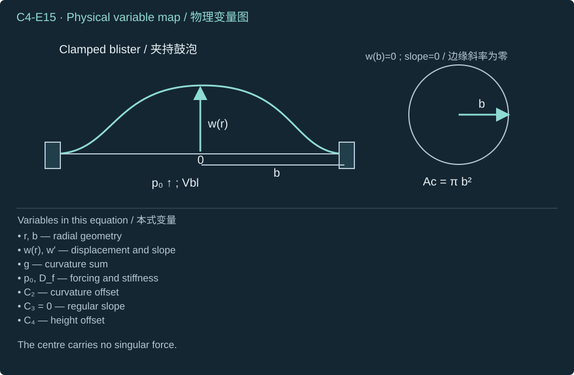

The regular displacement contains quartic, quadratic and constant contributions.

正则位移含四次项、二次项与常数项。

**Symbols before Eq. (C4-E16).**

**式（C4-E16）前的符号定义。**

| First individual definition / 第一项单独定义 | Second individual definition / 第二项单独定义 |
| --- | --- |
| $w(r)$ is displacement (m) $w(r)$为位移（m） | $w^{\prime}$ radial slope (dimensionless) $w^{\prime}$为径向斜率（无量纲） |
| $r\in[0,b]$ radial position (m) $r\in[0,b]$为径向位置（m） | $b>0$ delamination radius (m), allowing division by $b$ $b>0$为脱层半径（m），因此可以除以$b$ |
| $p_0>0$ is maintained pressure (Pa) $p_0>0$为恒定压力（Pa） | $D_f>0$ bending stiffness (N m) $D_f>0$为弯曲刚度（N m） |
| $C_2$ curvature constant (m⁻¹) $C_2$为曲率常数（m⁻¹） | $C_4$ displacement constant (m) $C_4$为位移常数（m） |

**Conventions and conditions.** The prime denotes $d/dr$; $\Rightarrow$ denotes the algebraic consequence of each clamped boundary condition; Subscripts 2 and 4 label constants, and f labels film.

**约定与条件。** 撇号表示$d/dr$；$\Rightarrow$表示各夹持边界条件的代数结果；下标2与4标识常数，f表示薄膜。

(C4-E16) · Exact solution of the stated linear-plate benchmark

$$
\begin{aligned}0=w^{\prime}(b)&=\frac{p_0b^3}{16D_f}+\frac{C_2b}{2}\quad\Rightarrow\quad C_2=-\frac{p_0b^2}{8D_f},\\0=w(b)&=\frac{p_0b^4}{64D_f}-\frac{p_0b^4}{32D_f}+C_4\quad\Rightarrow\quad C_4=\frac{p_0b^4}{64D_f},\\w(r)&=\frac{p_0}{64D_f}(r^4-2b^2r^2+b^4)=\frac{p_0}{64D_f}(b^2-r^2)^2.\end{aligned}
$$

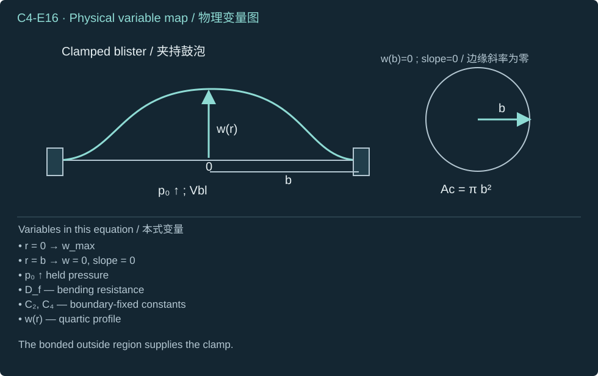

Applying both edge conditions fixes the unique regular blister profile.

同时应用两个边缘条件，确定唯一正则鼓泡轮廓。

Step 12 — Check the solution by substitution, not only by its shape. The radial Laplacian of radius squared is four; that of radius to the fourth is sixteen times radius squared. Applying it twice gives a constant sixty-four. The edge displacement and slope vanish. Positive pressure gives positive centre opening, and stiffness tending upward suppresses displacement. The dimensions are Pa × m⁴ /(N m) = m. This agrees with the clamped circular solution in MIT Lecture 7, Eq. 7.24.

步骤12——通过代入检验解，而不仅仅观察轮廓。半径平方的径向拉普拉斯为四；半径四次方的径向拉普拉斯为十六倍半径平方。再作用一次得到常数六十四。边缘位移与斜率均为零。正压力给出正中心张开，刚度增大则抑制位移。量纲为Pa × m⁴ /(N m) = m。结果与MIT第7讲式7.24的夹持圆板解一致。

**Symbols before Eq. (C4-E17).**

**式（C4-E17）前的符号定义。**

| First individual definition / 第一项单独定义 | Second individual definition / 第二项单独定义 |
| --- | --- |
| $\mathscr L_r$ is the radial planar Laplacian (m⁻²), and superscript 2 on the operator means composition twice $\mathscr L_r$为径向平面拉普拉斯算子（m⁻²），算子上的上标2表示连续作用两次 | $r$ is radial position (m) $r$为径向位置（m） |
| $b$ delamination radius (m) $b$为脱层半径（m） | $w$ blister displacement (m), and its prime is radial slope $w$为鼓泡位移（m），其撇号为径向斜率 |
| $D_f$ is bending stiffness (N m) $D_f$为弯曲刚度（N m） | $p_0$ maintained pressure (Pa) $p_0$为恒定压力（Pa） |
| $\mathscr L_r(r^2)$ is dimensionless $\mathscr L_r(r^2)$无量纲 | $\mathscr L_r(r^4)$ has units m² $\mathscr L_r(r^4)$单位为m² |

**Conventions and conditions.** superscripts on $r$ are powers; Literal 4 and 16 are numerical coefficients; The slope expression vanishes at $r=0$; $r=b$.

**约定与条件。** $r$上的上标表示幂；数字4与16是数值系数；斜率式在$r=0$及$r=b$均为零。

(C4-E17) · Governing-equation and boundary verification

$$
\mathscr L_r(r^2)=4,\qquad \mathscr L_r(r^4)=16r^2,\qquad D_f\mathscr L_r^2w=p_0,\qquad w^{\prime}(r)=\frac{p_0r(r^2-b^2)}{16D_f}
$$

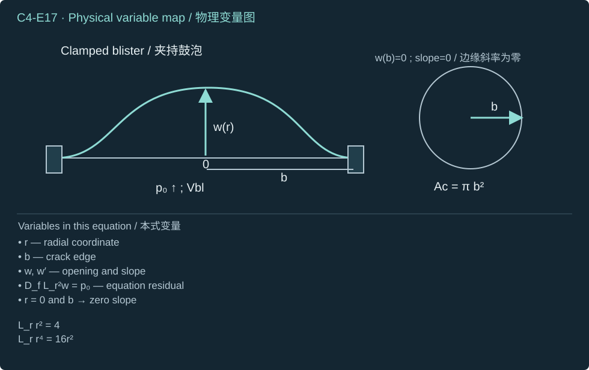

Direct radial differentiation verifies the pressure balance and regular clamped profile.

直接径向求导可检验压力平衡及正则夹持轮廓。

Step 13 — Integrate displacement to obtain added cavity volume. The axisymmetric surface element contains radius times radial increment, so this is not merely centre displacement times area. Expand the square, integrate each power, and evaluate the limits. The first two endpoint contributions cancel; the final sixth-power contribution remains.

步骤13——积分位移得到新增腔体体积。轴对称表面积微元包含半径乘径向增量，因此不能简单用中心位移乘面积。展开平方，逐项积分各次幂，再代入上下限。前两项的端点贡献相消，只剩最后的六次幂贡献。

**Symbols before Eq. (C4-E18).**

**式（C4-E18）前的符号定义。**

| First individual definition / 第一项单独定义 | Second individual definition / 第二项单独定义 |
| --- | --- |
| $V_{\rm bl}$ is added blister volume (m³) $V_{\rm bl}$为新增鼓泡体积（m³） | $w(r)$ displacement (m) $w(r)$为位移（m） |
| $r\in[0,b]$ radial integration coordinate (m) $r\in[0,b]$为径向积分坐标（m） | $dr$ its integration element (m) $dr$为积分微元（m） |
| $b$ delamination radius (m) $b$为脱层半径（m） | $p_0$ is maintained pressure (Pa) $p_0$为恒定压力（Pa） |
| $D_f$ bending stiffness (N m) $D_f$为弯曲刚度（N m） | $\pi$ the dimensionless circle constant $\pi$为无量纲圆周率 |

**Conventions and conditions.** $\int$ is radial integration; Subscript bl labels the blister; superscripts on lengths are powers; $[\ ]_0^b$ denotes antiderivative at the upper endpoint minus its value at zero.

**约定与条件。** $\int$表示径向积分；下标bl表示鼓泡；长度上的上标均表示幂；$[\ ]_0^b$表示原函数在上端点的值减去其零端点值。

(C4-E18) · Exact geometric volume integral for the benchmark

$$
\begin{aligned}V_{\rm bl}&=2\pi\int_0^b w(r)r\,dr=\frac{\pi p_0}{32D_f}\int_0^b(b^4r-2b^2r^3+r^5)\,dr,\\&=\frac{\pi p_0}{32D_f}\left[\frac{b^4r^2}{2}-\frac{b^2r^4}{2}+\frac{r^6}{6}\right]_0^b=\frac{\pi p_0b^6}{192D_f}.\end{aligned}
$$

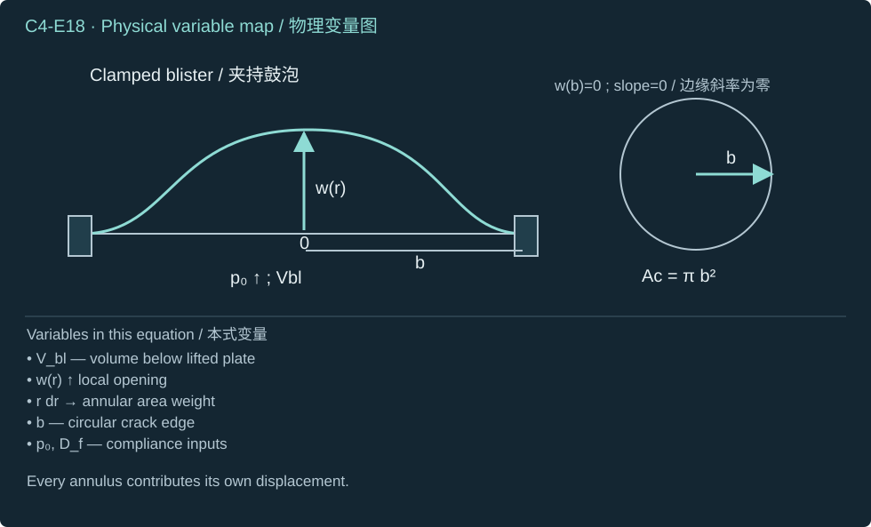

Blister volume sums the opening of all concentric annuli.

鼓泡体积等于各同心圆环张开贡献之和。

Step 14 — Include the maintained-pressure source in potential energy. At a fixed crack radius, displacement and volume scale linearly with pressure. The elastic energy is the area under the pressure–volume loading curve, one half pressure times volume. The pressure reservoir’s potential contribution is negative pressure times volume. Subtracting it leaves a negative half-product. Using only stored plate energy would give the wrong sign for pressure-controlled crack driving force.

步骤14——将恒压源计入势能。在固定裂纹半径时，位移与体积都随压力线性变化。弹性能为压力—体积加载曲线下的面积，即压力乘体积的一半。压力储库的势能贡献是负压力乘体积。将其扣除后，总势能为负的一半乘积。若只用板的储能，就会得到恒压裂纹驱动力的错误符号。

**Symbols before Eq. (C4-E19).**

**式（C4-E19）前的符号定义。**

| First individual definition / 第一项单独定义 | Second individual definition / 第二项单独定义 |
| --- | --- |
| $C_b>0$ is blister volume compliance (m³ Pa⁻¹), defined by the pressure derivative at fixed radius, including the regular zero-load value $C_b>0$为鼓泡体积柔度（m³ Pa⁻¹），由固定半径下的压力导数定义，包含正则零载荷值 | $V_{\rm bl}\ge0$ is added volume (m³) $V_{\rm bl}\ge0$为新增体积（m³） |
| $p_0\ge0$ maintained pressure (Pa) $p_0\ge0$为恒定压力（Pa） | $b>0$ crack radius (m) $b>0$为裂纹半径（m） |
| $D_f>0$ bending stiffness (N m) $D_f>0$为弯曲刚度（N m） | $U_b$ is stored plate bending energy (J) $U_b$为板弯曲储能（J） |
| $\mathcal P$ plate-plus-pressure-reservoir potential (J) $\mathcal P$为板与恒压储库的总势能（J） | $v$ a dummy volume along the fixed-radius elastic loading curve (m³), with $dv$ its element (m³) $v$为固定半径弹性加载曲线上的虚拟体积变量（m³） |
| $dv$ — Dummy-volume integration element (m³) $dv$ — 体积哑变量积分微元（m³） |  |

**Conventions and conditions.** $\partial/\partial p_0$ is the pressure derivative; the vertical bar holds radius fixed; $\int$ integrates that loading curve; Subscripts b and bl label blister compliance/bending and blister volume, respectively; the meanings are explicitly fixed here; No crack-area variation is taken during the loading-curve integral; For positive pressure, compliance also equals volume divided by pressure; at zero pressure the derivative avoids division by zero.

**约定与条件。** $\partial/\partial p_0$为压力导数；竖线表示保持半径不变；$\int$表示该加载曲线积分；下标b与bl分别表示鼓泡柔度／弯曲及鼓泡体积，此处已明确其含义；在加载曲线积分过程中不改变裂纹面积；正压力时，柔度也等于体积除以压力；零压力时采用导数避免除以零。

(C4-E19) · Derived potential under maintained-pressure control

$$
C_b=\left.\frac{\partial V_{\rm bl}}{\partial p_0}\right|_b=\frac{\pi b^6}{192D_f},\qquad V_{\rm bl}=C_bp_0,\qquad U_b=\int_0^{V_{\rm bl}}\frac{v}{C_b}\,dv=\frac{V_{\rm bl}^2}{2C_b}=\frac{p_0V_{\rm bl}}2,\qquad \mathcal P=U_b-p_0V_{\rm bl}=-\frac{\pi p_0^2b^6}{384D_f}
$$

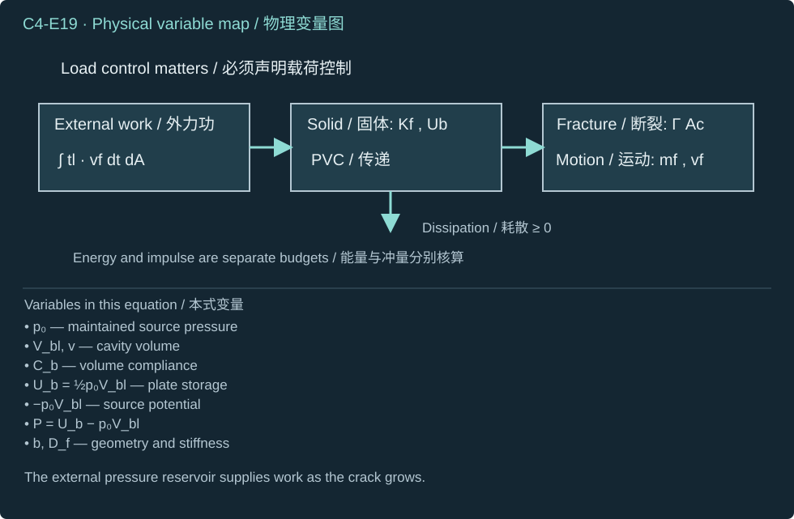

Source work changes the sign of the relevant total potential.

压力源做功改变相关总势能的符号。

Step 15 — Differentiate the total potential with respect to radius and divide by the corresponding area derivative. Both derivatives retain their numerical factors. A positive pressure produces a positive energy-release rate because increasing delamination compliance lowers the plate-plus-reservoir potential. Doubling crack radius at the same pressure increases the driving force sixteenfold in this bending limit.

步骤15——按半径对总势能求导，再除以相应面积导数。两次求导都必须保留数值系数。正压力给出正能量释放率，因为脱层柔度增大会降低板与储库的总势能。在此弯曲极限内，相同压力下裂纹半径加倍，驱动力增至十六倍。

**Symbols before Eq. (C4-E20).**

**式（C4-E20）前的符号定义。**

| First individual definition / 第一项单独定义 | Second individual definition / 第二项单独定义 |
| --- | --- |
| $A_c$ is delaminated area (m²) $A_c$为脱层面积（m²） | $b>0$ its radius (m) $b>0$为其半径（m） |
| $\pi$ the circle constant (dimensionless) $\pi$为圆周率（无量纲） | $\mathcal P$ total potential including maintained pressure (J) $\mathcal P$为包含恒压源的总势能（J） |
| $p_0$ fixed pressure difference (Pa) $p_0$为固定压差（Pa） | $D_f$ bending stiffness (N m) $D_f$为弯曲刚度（N m） |
| $G_{p_0}$ is energy-release rate under that control (J m⁻²) $G_{p_0}$为该控制方式下的能量释放率（J m⁻²） |  |

**Conventions and conditions.** $d/db$ differentiates in radius; the vertical bar and subscript $p_0$ indicate held pressure; Subscript c labels crack area; all length superscripts are powers; Positive $b$ makes the area derivative nonzero.

**约定与条件。** $d/db$表示按半径求导；竖线及下标$p_0$表示保持压力不变；下标c表示裂纹面积；长度上的上标均为幂；$b$为正保证面积导数非零。

(C4-E20) · Derived quasistatic energy-release rate

$$
\begin{aligned}A_c&=\pi b^2,\qquad \left.\frac{d\mathcal P}{db}\right|_{p_0}=-\frac{6\pi p_0^2b^5}{384D_f},\qquad\frac{dA_c}{db}=2\pi b,\\G_{p_0}&=-\frac{(d\mathcal P/db)_{p_0}}{dA_c/db}=\frac{p_0^2b^4}{128D_f}.\end{aligned}
$$

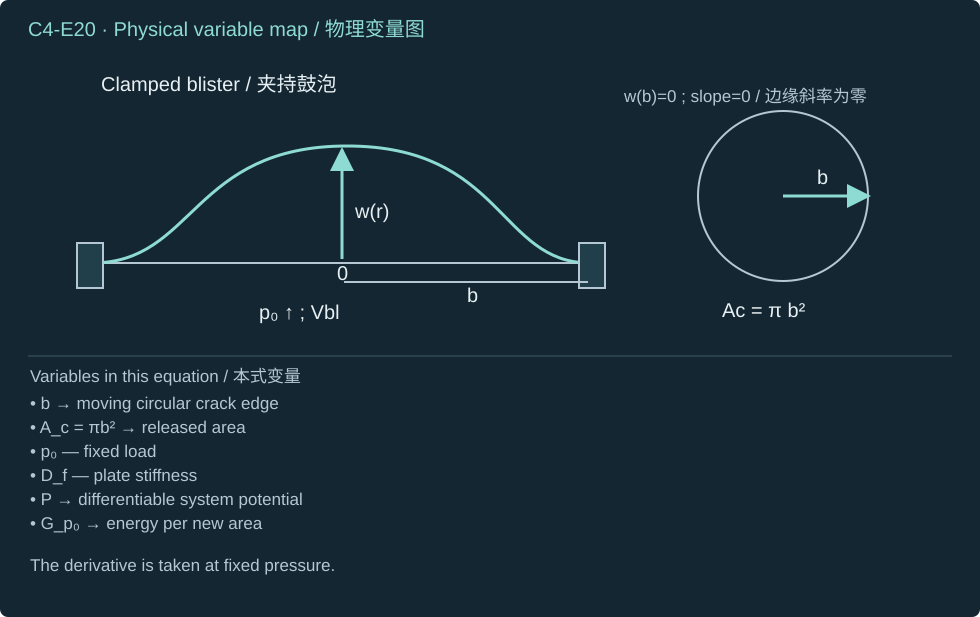

Geometry and compliance convert pressure into fracture energy per area.

几何与柔度将压力转换为单位面积断裂能。

**Symbols before Eq. (C4-E21).**

**式（C4-E21）前的符号定义。**

| First individual definition / 第一项单独定义 | Second individual definition / 第二项单独定义 |
| --- | --- |
| $p_{0,\rm crit}>0$ is critical maintained pressure (Pa) for constant fracture resistance $\Gamma>0$ (J m⁻²) $p_{0,\rm crit}>0$为恒定断裂阻力$\Gamma>0$（J m⁻²）对应的临界恒压（Pa） | $D_f>0$ is bending stiffness (N m) $D_f>0$为弯曲刚度（N m） |
| $b>0$ delamination radius (m) $b>0$为脱层半径（m） | $p_0\ge0$ applied maintained pressure (Pa) $p_0\ge0$为外加恒压（Pa） |
| $G_{p_0}$ the corresponding energy-release rate (J m⁻²) $G_{p_0}$为相应能量释放率（J m⁻²） | $\Gamma$ — Practical interfacial fracture energy (J m⁻²) $\Gamma$ — 实际界面断裂能（J m⁻²） |

**Conventions and conditions.** $\sqrt{\ }$ is the positive root; subscript crit labels the onset threshold; The quotient $G_{p_0}/\Gamma$ is dimensionless; This onset criterion assumes an existing crack and the quasistatic bending model.

**约定与条件。** $\sqrt{\ }$取正根；下标crit表示起始阈值；比值$G_{p_0}/\Gamma$无量纲；此起始判据假设存在预裂纹，并采用准静态弯曲模型。

(C4-E21) · Derived onset threshold within the benchmark

$$
p_{0,\rm crit}=\frac{\sqrt{128D_f\Gamma}}{b^2},\qquad \frac{G_{p_0}}{\Gamma}=\left(\frac{p_0}{p_{0,\rm crit}}\right)^2
$$

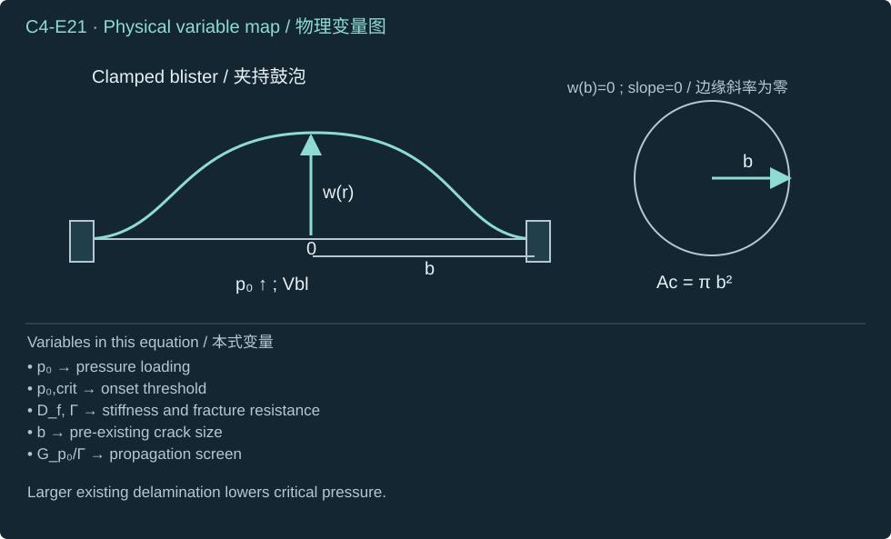

The pressure threshold depends on crack geometry and fracture resistance, not pressure alone.

压力阈值取决于裂纹几何及断裂阻力，而非压力本身。

Step 16 — Change the loading control explicitly. Hold the added volume fixed, with no continuing pressure-reservoir work. Eliminate pressure using volume compliance, differentiate plate storage at fixed volume, and substitute the instantaneous pressure back. The instantaneous expression matches the pressure-controlled value at the same state, but the evolution differs: increasing radius raises the constant-pressure driving force and lowers the constant-volume driving force. For constant resistance this distinguishes destabilizing pressure control from stabilizing volume control in the adopted model. A sealed laser-heated cavity has finite mass and evolving temperature, so neither simple control is automatically its trajectory.

步骤16——明确改变加载控制。固定新增体积，且不再由恒压储库持续做功。利用体积柔度消去压力，在固定体积下对板储能求导，再代回瞬时压力。在相同状态处，瞬时表达式与恒压情况一致，但演化不同：半径增大会提高恒压驱动力，却降低恒容驱动力。对于恒定阻力，在所采用模型中，这区分了趋于失稳的恒压控制与趋于稳定的恒容控制。封闭激光加热腔体具有有限质量和变化温度，因此不能自动将任一简单控制当作其演化路径。

**Symbols before Eq. (C4-E22).**

**式（C4-E22）前的符号定义。**

| First individual definition / 第一项单独定义 | Second individual definition / 第二项单独定义 |
| --- | --- |
| $\bar V>0$ is imposed fixed added volume (m³) $\bar V>0$为强制固定的新增体积（m³） | $U_b$ plate bending energy (J) $U_b$为板弯曲能（J） |
| $C_b$ volume compliance (m³ Pa⁻¹) $C_b$为体积柔度（m³ Pa⁻¹） | $D_f$ bending stiffness (N m) $D_f$为弯曲刚度（N m） |
| $b>0$ crack radius (m) $b>0$为裂纹半径（m） | $p(b)$ the pressure required at that radius (Pa) $p(b)$为该半径处所需压力（Pa） |
| $G_{\bar V}$ — Energy-release rate at fixed added volume (J m⁻²) $G_{\bar V}$ — 固定新增体积下的能量释放率（J m⁻²） | $G_{p_0}$ — Energy-release rate at fixed maintained pressure (J m⁻²) $G_{p_0}$ — 固定恒定压力下的能量释放率（J m⁻²） |
| $p_0$ is maintained pressure (Pa) $p_0$为恒定压力（Pa） | $\pi$ the circle constant, and $\propto$ means proportional at fixed other parameters (dimensionless) $\pi$为圆周率，$\propto$表示其他参数固定时成正比（无量纲） |

**Conventions and conditions.** $d/db$ is radius differentiation holding $\bar V$ fixed; The bar labels controlled volume, not averaging; The fixed-volume system here supplies no additional pressure-source work.

**约定与条件。** $d/db$表示保持$\bar V$不变的半径求导；横线标识受控体积，而非平均；此恒容系统不再提供额外压力源功。

(C4-E22) · Derived loading-control comparison

$$
\begin{aligned}U_b\big|_{\bar V}&=\frac{\bar V^2}{2C_b}=\frac{96D_f\bar V^2}{\pi b^6},\qquad p(b)=\frac{192D_f\bar V}{\pi b^6},\\G_{\bar V}&=-\frac{dU_b/db}{2\pi b}=\frac{288D_f\bar V^2}{\pi^2b^8}=\frac{p(b)^2b^4}{128D_f},\\G_{p_0}&\propto b^4\ \text{at fixed }p_0,\qquad G_{\bar V}\propto b^{-8}\ \text{at fixed }\bar V.\end{aligned}
$$

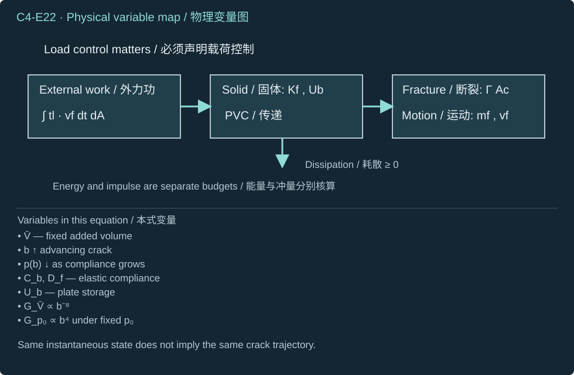

Fixed pressure and fixed volume lead to opposite changes in driving force as the crack grows.

裂纹扩展时，恒压与恒容控制使驱动力发生相反变化。

### Worked blister calculation

### 鼓泡已解算例

Use the source course’s illustrative plate: modulus 2 GPa, thickness 10 μm, Poisson’s ratio 0.35, pre-existing crack radius 100 μm and constant fracture energy 0.10 J m⁻². These are teaching inputs, not properties of the later 1 μm payload or of an identified PVC formulation. Substitute the thickness in metres before cubing, then evaluate stiffness and the positive onset root.

采用源课程的示例薄板：模量2 GPa、厚度10 μm、泊松比0.35、预裂纹半径100 μm、恒定断裂能0.10 J m⁻²。这些是教学输入，并非后续1 μm对象或某一已确认PVC配方的物性。先将厚度换算为米再求立方，然后求刚度与正的起始阈值根。

**Symbols before Eq. (C4-E23).**

**式（C4-E23）前的符号定义。**

| First individual definition / 第一项单独定义 | Second individual definition / 第二项单独定义 |
| --- | --- |
| $D_f$ is film bending stiffness (N m) $D_f$为薄膜弯曲刚度（N m） | $p_{0,\rm crit}$ the positive critical maintained pressure (Pa) $p_{0,\rm crit}$为正临界恒压（Pa） |

**Conventions and conditions.** The substituted teaching Young’s modulus is 2.00×10⁹ Pa, thickness 10.0×10⁻⁶ m, Poisson’s ratio 0.35, crack radius 100×10⁻⁶ m, and fracture resistance 0.10 J m⁻²; Pa, N, m, J and kPa denote pascal, newton, metre, joule and kilopascal; $\sqrt{\ }$ is the positive root; superscripts are powers; Subscript f labels the film and crit the onset threshold.

**约定与条件。** 代入的教学杨氏模量为2.00×10⁹ Pa，厚度10.0×10⁻⁶ m，泊松比0.35，裂纹半径100×10⁻⁶ m，断裂阻力0.10 J m⁻²；Pa、N、m、J及kPa分别为帕、牛顿、米、焦耳及千帕；$\sqrt{\ }$取正根；上标表示幂；下标f表示薄膜，crit表示起始阈值。

(C4-E23) · Checked teaching substitution

$$
\begin{aligned}D_f&=\frac{(2.00\times10^9\ {\rm Pa})(10.0\times10^{-6}\ {\rm m})^3}{12(1-0.35^2)}=1.899335\times10^{-7}\ {\rm N\,m},\\p_{0,\rm crit}&=\frac{\sqrt{128(1.899335\times10^{-7}\ {\rm N\,m})(0.10\ {\rm J\,m^{-2}})}}{(100\times10^{-6}\ {\rm m})^2}=155.921\ {\rm kPa}.\end{aligned}
$$

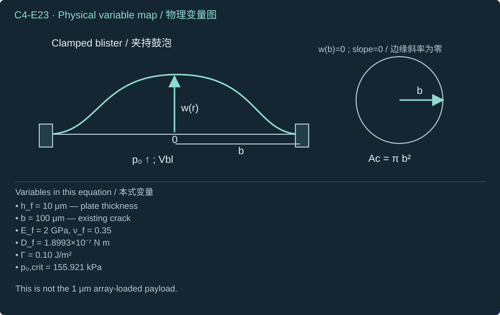

The stated plate and interface yield a conditional 156 kPa maintained-pressure threshold.

所给薄板与界面产生约156 kPa的条件性恒压阈值。

At that pressure, check deflection, volume and payload stress. For the clamped circular profile, the radial edge bending moment magnitude is pressure times radius squared divided by eight. Linear bending stress at the outer thickness surface is six times moment divided by thickness squared. Thus propagation of the intended interface also demands that approximately 11.7 MPa edge bending stress is acceptable for this hypothetical plate; no allowable material strength was supplied. The thickness-to-radius ratio is 0.10, so the thin-plate idealization is a benchmark with finite-thickness error to assess, not certified accuracy.

在该压力下，检验挠度、体积与对象应力。夹持圆板轮廓的边缘径向弯矩幅值为压力乘半径平方除以八；厚度外表面的线性弯曲应力为六倍弯矩除以厚度平方。因此，目标界面能够扩展，还要求此假设薄板可以承受约11.7 MPa的边缘弯曲应力；材料许用强度尚未给定。厚径比为0.10，因此薄板理想化是仍需评估有限厚度误差的基准，而非已认证的精度。

**Symbols before Eq. (C4-E24).**

**式（C4-E24）前的符号定义。**

| First individual definition / 第一项单独定义 | Second individual definition / 第二项单独定义 |
| --- | --- |
| $w(0)$ is centre displacement (m) $w(0)$为中心位移（m） | $h_f=10$ μm thickness (m) $h_f=10$ μm为厚度（m） |
| $b=100$ μm crack radius (m) $b=100$ μm为裂纹半径（m） | $D_f=1.899335$×10⁻⁷ N m bending stiffness $D_f=1.899335$×10⁻⁷ N m为弯曲刚度 |
| $p_{0,\rm crit}=155.921$ kPa maintained threshold (Pa) $p_{0,\rm crit}=155.921$ kPa为恒压阈值（Pa） | $V_{\rm bl}$ is blister volume (m³) $V_{\rm bl}$为鼓泡体积（m³） |
| $M_r(b)$ radial bending moment per edge length (N) $M_r(b)$为单位边长径向弯矩（N） | $\sigma_{rr}$ radial normal bending stress (Pa) $\sigma_{rr}$为径向法向弯曲应力（Pa） |
| $\pi$ the circle constant (dimensionless) $\pi$为圆周率（无量纲） |  |

**Conventions and conditions.** Subscript edge labels its outer-surface value at the clamped edge; r labels radial direction; $|\ |$ denotes magnitude; μm and MPa are micrometre and megapascal; This stress result uses the same linear isotropic plate assumptions.

**约定与条件。** 下标edge表示夹持边缘厚度外表面的值；r表示径向；$|\ |$表示幅值；μm与MPa分别为微米及兆帕；应力结果采用相同线性各向同性薄板假设。

(C4-E24) · Magnitude, geometric-validity and competing-failure checks

$$
\begin{aligned}w(0)&=\frac{p_{0,\rm crit}b^4}{64D_f}=1.28270\ \mu{\rm m},\qquad \frac{w(0)}{h_f}=0.12827,\\V_{\rm bl}&=\frac{\pi p_{0,\rm crit}b^6}{192D_f}=1.34324\times10^{-14}\ {\rm m^3},\\|M_r(b)|&=\frac{p_{0,\rm crit}b^2}{8},\qquad |\sigma_{rr}|_{\rm edge}=\frac{6|M_r(b)|}{h_f^2}=11.6941\ {\rm MPa}.\end{aligned}
$$

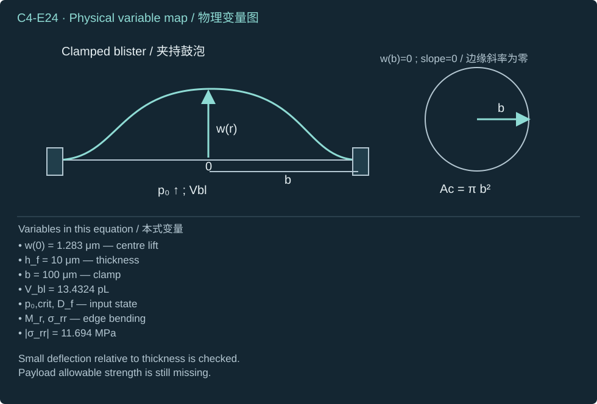

A fracture threshold must be checked against deflection validity and payload bending stress.

断裂阈值必须同时检验挠度适用性与对象弯曲应力。

## 6 · A cohesive law joins local strength to separation work

## 6 · 内聚关系连接局部强度与分离功

Step 17 — Adopt a monotonic triangular tensile traction–separation law at the actual release interface. The initial slope sets reversible opening stiffness, the peak sets initiation strength, and the final opening sets complete tensile separation. The following law is a declared model, not a measured universal interface property. Compression needs a contact branch; unloading needs recoverable response and irreversible damage history; mixed-mode loading needs its own coupling.

步骤17——在实际释放界面采用单调三角形拉伸牵引—分离关系。初始斜率决定可逆张开刚度，峰值决定损伤起始强度，最终张开决定完全拉伸分离。下式是明确采用的模型，而非实测的通用界面性质。压缩需要接触分支；卸载需要可恢复响应与不可逆损伤历史；混合模态加载需要自身的耦合关系。

**Symbols before Eq. (C4-E25).**

**式（C4-E25）前的符号定义。**

| First individual definition / 第一项单独定义 | Second individual definition / 第二项单独定义 |
| --- | --- |
| $\delta\ge0$ now denotes physical relative tensile opening (m), not variational notation $\delta\ge0$此处表示物理相对拉伸张开（m），不再是变分符号 | $t_n(\delta)$ is tensile cohesive traction magnitude (Pa) $t_n(\delta)$为拉伸内聚牵引幅值（Pa） |
| $K_n>0$ initial normal stiffness (Pa m⁻¹) $K_n>0$为初始法向刚度（Pa m⁻¹） | $T_{\max}>0$ peak tensile traction (Pa) $T_{\max}>0$为峰值拉伸牵引（Pa） |
| $\delta_0=T_{\max}/K_n$ peak-traction opening (m) $\delta_0=T_{\max}/K_n$为峰值牵引处张开（m） | $\delta_c>\delta_0$ complete-separation opening (m) $\delta_c>\delta_0$为完全分离张开（m） |

**Conventions and conditions.** Subscripts n, 0 and c label normal, peak onset and final separation; max labels the maximum; The law assumes monotonically increasing opening and a strictly positive softening interval; Compression and unloading are not specified by this formula.

**约定与条件。** 下标n、0、c分别表示法向、峰值起始及最终分离；max表示最大值；关系假设张开单调增大，且软化区间严格为正；此式未指定压缩与卸载行为。

(C4-E25) · Adopted monotonic tensile cohesive law

$$
\delta_0=\frac{T_{\max}}{K_n},\qquad t_n(\delta)=\begin{cases}K_n\delta,&0\le\delta\le\delta_0,\\T_{\max}\dfrac{\delta_c-\delta}{\delta_c-\delta_0},&\delta_0<\delta<\delta_c,\\0,&\delta\ge\delta_c.\end{cases}
$$

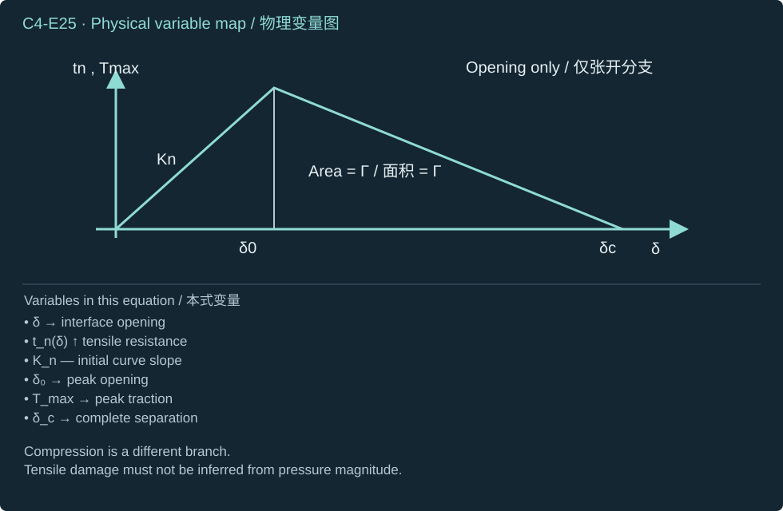

The traction–separation curve contains strength, stiffness and a finite separation distance.

牵引—分离曲线包含强度、刚度及有限分离距离。

Step 18 — Integrate both branches to obtain fracture work per area. The first branch forms the ascending triangle; the second forms the descending triangle. Their sum is independent of where the peak occurs, provided the ordering of openings is admissible. Traction times separation has units Pa m = J m⁻², as required. This does not mean stiffness is irrelevant to initiation dynamics; it means only that the total area of this particular triangular law is fixed by peak traction and final opening.

步骤18——积分两个分支，得到单位面积断裂功。第一分支形成上升三角形，第二分支形成下降三角形。只要张开顺序满足要求，两者之和不依赖峰值出现位置。牵引乘分离距离的单位为Pa m = J m⁻²，符合要求。这并不意味着刚度与损伤起始动力学无关，只表示此特定三角形关系的总面积由峰值牵引及最终张开决定。

**Symbols before Eq. (C4-E26).**

**式（C4-E26）前的符号定义。**

| First individual definition / 第一项单独定义 | Second individual definition / 第二项单独定义 |
| --- | --- |
| $\Gamma>0$ is the fracture energy of the adopted monotonic law (J m⁻²) $\Gamma>0$为所采用单调关系的断裂能（J m⁻²） | $\delta$ tensile opening integration variable (m) $\delta$为拉伸张开积分变量（m） |
| $d\delta$ its element (m) $d\delta$为其微元（m） | $t_n$ is tensile cohesive traction (Pa) $t_n$为拉伸内聚牵引（Pa） |
| $K_n>0$ initial stiffness (Pa m⁻¹) $K_n>0$为初始刚度（Pa m⁻¹） | $T_{\max}>0$ peak traction (Pa) $T_{\max}>0$为峰值牵引（Pa） |
| $\delta_0$ opening at the peak (m) $\delta_0$为峰值处张开（m） | $\delta_c>\delta_0$ final separation opening (m) $\delta_c>\delta_0$为最终分离张开（m） |

**Conventions and conditions.** $\int$ integrates traction against opening; endpoint brackets mean upper minus lower value; Subscripts n, 0, c and max label normal, peak onset, final separation and maximum; The last inequality enforces a nonzero softening branch; it is a model-admissibility condition.

**约定与条件。** $\int$表示牵引对张开的积分；端点方括号表示上端值减下端值；下标n、0、c、max分别表示法向、峰值起始、最终分离与最大值；末行不等式保证非零软化分支，是模型的可接受条件。

(C4-E26) · Exact work integral of the adopted cohesive law

$$
\begin{aligned}\Gamma&=\int_0^{\delta_c}t_n(\delta)\,d\delta\\&=\frac{K_n\delta_0^2}{2}+\frac{T_{\max}}{\delta_c-\delta_0}\left[\delta_c\delta-\frac{\delta^2}{2}\right]_{\delta_0}^{\delta_c}\\&=\frac{T_{\max}\delta_0}{2}+\frac{T_{\max}(\delta_c-\delta_0)}{2}=\frac{T_{\max}\delta_c}{2},\\\delta_c&=\frac{2\Gamma}{T_{\max}},\qquad K_n>\frac{T_{\max}^2}{2\Gamma}\quad\text{for }\delta_0<\delta_c.\end{aligned}
$$

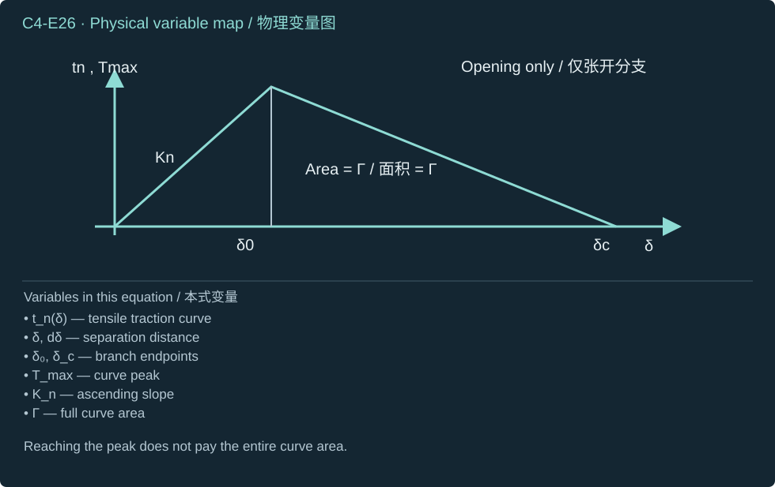

Complete separation needs the entire traction–opening area, not merely the peak value.

完全分离需要完整牵引—张开曲线面积，而不仅仅达到峰值。

**Symbols before Eq. (C4-E27).**

**式（C4-E27）前的符号定义。**

| First individual definition / 第一项单独定义 | Second individual definition / 第二项单独定义 |
| --- | --- |
| $\Gamma$ is assumed fracture energy (J m⁻²) $\Gamma$为假设断裂能（J m⁻²） | $T_{\max}$ assumed peak tensile traction (Pa) $T_{\max}$为假设峰值拉伸牵引（Pa） |
| $K_n$ assumed initial normal stiffness (Pa m⁻¹) $K_n$为假设初始法向刚度（Pa m⁻¹） | $\delta_0$ peak-traction opening (m) $\delta_0$为峰值牵引处张开（m） |
| $\delta_c$ final tensile separation (m) $\delta_c$为最终拉伸分离（m） |  |

**Conventions and conditions.** MPa and nm denote megapascal and nanometre; $\Rightarrow$ denotes substitution into the triangular law; These are separate illustrative cohesive parameters, not measurements of the film release interface; Subscripts max, n, 0 and c identify peak, normal, peak opening and complete opening.

**约定与条件。** MPa与nm表示兆帕与纳米；$\Rightarrow$表示代入三角形关系；这些是独立内聚教学参数，而非薄膜释放界面的测量；下标max、n、0、c分别标识峰值、法向、峰值张开与完全张开。

(C4-E27) · Cohesive admissibility teaching calculation

$$
\Gamma=0.005\ {\rm J\,m^{-2}},\quad T_{\max}=0.10\ {\rm MPa},\quad K_n=10^{13}\ {\rm Pa\,m^{-1}}\quad\Rightarrow\quad\delta_0=10\ {\rm nm},\quad\delta_c=100\ {\rm nm}
$$

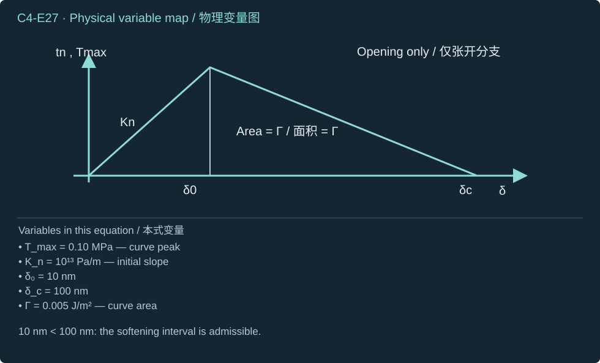

The example has distinct peak and final separation openings.

本例具有不同的峰值张开与最终分离张开。

## 7 · Close the PFC-inventory → array → film calculation

## 7 · 完成PFC存量 → 阵列 → 薄膜的贯穿计算

Step 19 — Carry the same finite source forward. The Chapter 2 core inventory feeds each of the 25 independently supplied cells in Chapter 3. The optical example declares patterned/addressed illumination with equal site allocation. Their total absorbed optical energy is 10 μJ; the declared emitted-jet conversion is 0.005, giving 50 nJ of total jet kinetic energy. Each jet uses carrier-liquid density 1000 kg m⁻³, diameter 10 μm and length 50 μm. No interacting-bubble multiplier is added. Recompute the incoming mass and momentum without rounded intermediate speeds.

步骤19——继续沿用同一个有限源。第2章液核存量为第3章25个独立供给液体单元中的各单元提供相变物质。光学算例声明采用图案化／逐点定址照明，等量分配至各位点。总吸收光能为10 μJ；明确假设出射射流转换率为0.005，因此总射流动能为50 nJ。每股射流使用载液密度1000 kg m⁻³、直径10 μm、长度50 μm。不加入任何相互作用气泡倍增系数。重新计算入射质量与动量，并避免中间速度舍入。

**Symbols before Eq. (C4-E28).**

**式（C4-E28）前的符号定义。**

| First individual definition / 第一项单独定义 | Second individual definition / 第二项单独定义 |
| --- | --- |
| $m_j$ is carrier mass in one uniform cylindrical jet (kg) $m_j$为单股均匀圆柱射流的载液质量（kg） | $\rho=1000$ kg m⁻³ carrier density $\rho=1000$ kg m⁻³为载液密度 |
| $d_j=10$ μm jet diameter $d_j=10$ μm为射流直径 | $L_j=50$ μm jet length $L_j=50$ μm为长度 |
| $\pi$ the circle constant (dimensionless) $\pi$为圆周率（无量纲） | $E_j=2.00$ nJ is assigned kinetic energy per jet (J) $E_j=2.00$ nJ为指定单射流动能（J） |
| $U_j$ its uniform speed (m s⁻¹) $U_j$为其均匀速度（m s⁻¹） | $N=25$ independent identically supplied jets (dimensionless) $N=25$为独立且供给相同的射流数（无量纲） |
| $E_{\rm in}$ total incoming kinetic energy (J) $E_{\rm in}$为总入射动能（J） | $I_{\rm in}$ aligned incoming momentum (N s) $I_{\rm in}$为同向入射动量（N s） |

**Conventions and conditions.** $\sqrt{\ }$ is the positive root; Subscripts j and in label single jet and incoming array; nJ is nanojoule; Simultaneous aligned arrival is assumed for the directional sum, but pressure fields are not added as N times a peak.

**约定与条件。** $\sqrt{\ }$取正根；下标j、in分别标识单射流与入射阵列；nJ为纳焦耳；方向求和假设同时同向到达，但不将压力场按N倍峰值相加。

(C4-E28) · Finite incoming state inherited from the teaching source

$$
\begin{aligned}m_j&=\frac{\rho\pi d_j^2L_j}{4}=3.926990817\times10^{-12}\ {\rm kg},\\U_j&=\sqrt{\frac{2E_j}{m_j}}=31.9153824\ {\rm m\,s^{-1}},\\E_{\rm in}&=NE_j=50.0\ {\rm nJ},\qquad I_{\rm in}=Nm_jU_j=3.133285343\times10^{-9}\ {\rm N\,s}.\end{aligned}
$$

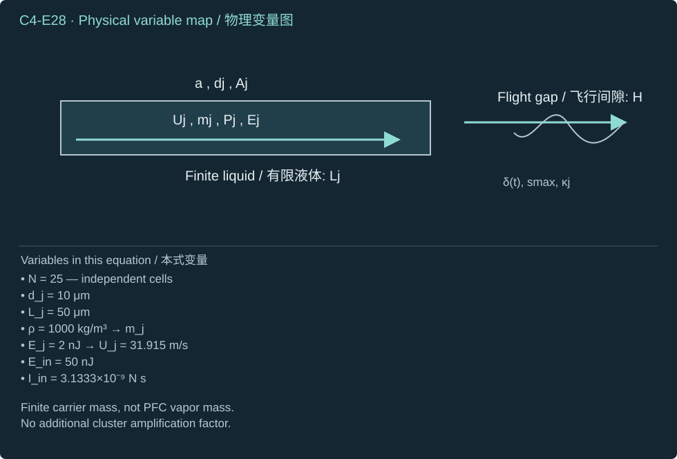

Finite jet energy and aligned momentum provide the input to solid coupling.

有限射流能量与同向动量提供固体耦合输入。

Step 20 — State solid-coupling assumptions separately. Take a payload of area 1 mm², thickness 1 μm and density 2330 kg m⁻³, initially at rest, with no initially stored recoverable energy source. Suppose 20% of the incoming jet energy becomes available for solid deformation, release and departure, and the net opening-direction impulse on the payload after load-path reactions is 50% of incoming aligned momentum. These fractions require measurement or a coupled calculation; neither follows from the PFC boiling point or the 47.23 MPa rigid-contact scale.

步骤20——独立声明固体耦合假设。取对象面积1 mm²、厚度1 μm、密度2330 kg m⁻³，初始静止，且没有初始储存的可恢复能量源。假设入射射流能量的20%可用于固体变形、释放及离开；考虑传力路径反作用后，作用于对象的净张开方向冲量为入射同向动量的50%。这些比例需要测量或耦合计算；均不能由PFC沸点或47.23 MPa刚性接触尺度推出。

**Symbols before Eq. (C4-E29).**

**式（C4-E29）前的符号定义。**

| First individual definition / 第一项单独定义 | Second individual definition / 第二项单独定义 |
| --- | --- |
| $m_f$ is payload mass (kg) $m_f$为对象质量（kg） | $\rho_f=2330$ kg m⁻³ density $\rho_f=2330$ kg m⁻³为密度 |
| $A_f=1.00$ mm² = 1.00×10⁻⁶ m² release area (m²) $A_f=1.00$ mm² = 1.00×10⁻⁶ m²为释放面积（m²） | $h_f=1.00$ μm = 1.00×10⁻⁶ m thickness $h_f=1.00$ μm = 1.00×10⁻⁶ m为厚度 |
| $E_{\rm solid}$ is assigned useful solid energy (J) $E_{\rm solid}$为指定有效固体能量（J） | $E_{\rm in}$ incoming jet kinetic energy (J) $E_{\rm in}$为入射射流动能（J） |
| $\eta_E=0.20$ a dimensionless energy-allocation assumption $\eta_E=0.20$为无量纲能量分配假设 | $I_{\rm net}$ is assigned net opening-direction payload impulse after all load-path reactions (N s) $I_{\rm net}$为考虑全部传力路径反作用后的净张开方向对象冲量（N s） |
| $I_{\rm in}$ aligned incoming momentum (N s) $I_{\rm in}$为同向入射动量（N s） | $\eta_I=0.50$ a dimensionless impulse assumption $\eta_I=0.50$为无量纲冲量假设 |

**Conventions and conditions.** Labels f, in, solid, net, E and I identify film, incoming, useful solid allocation, net, energy and impulse; The numerical first-row factors represent density, area and thickness in SI units.

**约定与条件。** 标签f、in、solid、net、E、I分别标识薄膜、入射、有效固体分配、净量、能量与冲量；第一行数值因子分别是SI制密度、面积及厚度。

(C4-E29) · Explicit conditional solid-coupling allocation

$$
\begin{aligned}m_f&=\rho_fA_fh_f=(2330)(1.00\times10^{-6})(1.00\times10^{-6})\ {\rm kg}=2.33\times10^{-9}\ {\rm kg},\\E_{\rm solid}&=\eta_EE_{\rm in}=0.20(50.0\ {\rm nJ})=10.0\ {\rm nJ},\\I_{\rm net}&=\eta_II_{\rm in}=0.50(3.133285343\times10^{-9}\ {\rm N\,s})=1.566642672\times10^{-9}\ {\rm N\,s}.\end{aligned}
$$

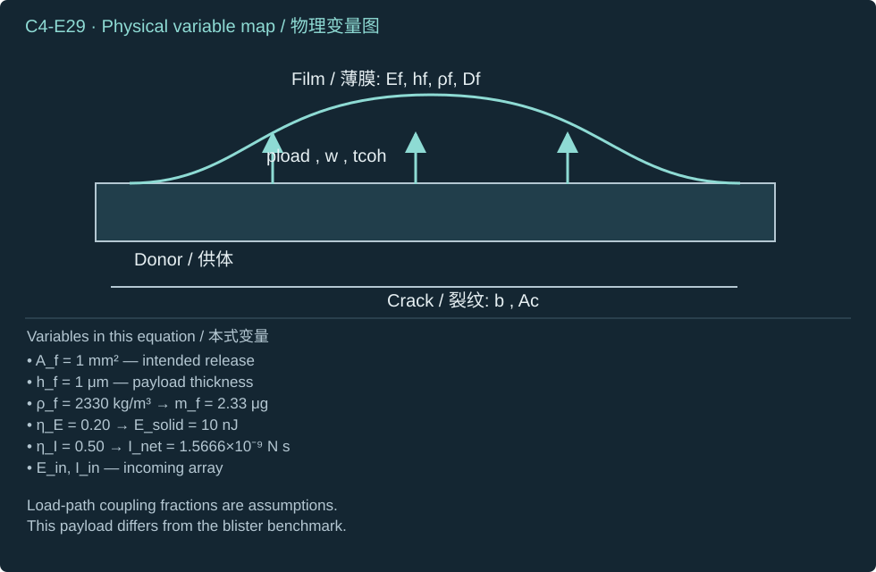

Declared coupling converts incoming jet budgets into conditional payload budgets.

明确声明的耦合将入射射流预算转换为条件性对象预算。

Step 21 — Apply necessary global screens. Constant fracture energy over the entire intended area requires fracture energy times area. Translating the initially resting payload at a minimum specified speed requires one half mass times speed squared. Net impulse must supply at least mass times that minimum speed. These screens omit residual bending, rotation, other dissipation and unintended fracture, so failure excludes the assumed transfer, while passing does not prove it. If the impulse quoted is the exact total actual impulse and no later force acts, final centre-of-mass speed is fixed by equality, not independently selectable.

步骤21——应用必要的整体筛选。若整个目标面积上的断裂能恒定，则释放需要断裂能乘面积。将初始静止对象平动到指定最低速度，需要质量乘速度平方的一半。净冲量至少要提供质量乘该最低速度。这些筛选忽略残余弯曲、转动、其他耗散及错误断裂，因此不通过可排除所假设转印，而通过并不能证明成功。若所给冲量是精确总实际冲量，且之后没有其他力，则最终质心速度由等式确定，不能独立任意选择。

**Symbols before Eq. (C4-E30).**

**式（C4-E30）前的符号定义。**

| First individual definition / 第一项单独定义 | Second individual definition / 第二项单独定义 |
| --- | --- |
| $E_{\rm req}(v_f)$ is minimum fracture-plus-translation energy (J) $E_{\rm req}(v_f)$为最低断裂加平动能量（J） | $I_{\rm req}(v_f)$ required net impulse for the minimum departure speed (N s) $I_{\rm req}(v_f)$为达到最低离开速度所需净冲量（N s） |
| $v_f\ge0$ that required speed (m s⁻¹) $v_f\ge0$为所需速度（m s⁻¹） | $m_f>0$ payload mass (kg) $m_f>0$为对象质量（kg） |
| $A_f$ full intended release area (m²) $A_f$为全部目标释放面积（m²） | $\Gamma\ge0$ assumed uniform fracture energy (J m⁻²) $\Gamma\ge0$为假设均匀断裂能（J m⁻²） |
| $E_{\rm solid}$ is assigned available solid energy (J) $E_{\rm solid}$为指定可用固体能量（J） | $I_{\rm net}$ is net opening-direction impulse after interface/support reactions (N s) $I_{\rm net}$为考虑界面／支承反作用后的净张开方向冲量（N s） |

**Conventions and conditions.** Subscripts req, f, solid and net identify required, payload, useful solid and net quantities; The inequalities are necessary under the stated zero-initial-energy/no-additional-source assumptions; they are not spatial fracture solutions.

**约定与条件。** 下标req、f、solid、net分别标识所需、对象、有效固体及净量；在所述零初始能量／无额外源假设下，不等式是必要条件，而非空间断裂解。

(C4-E30) · Necessary global energy and momentum screens

$$
E_{\rm req}(v_f)=\Gamma A_f+\frac12m_fv_f^2,\qquad I_{\rm req}(v_f)=m_fv_f,\qquad E_{\rm solid}\ge E_{\rm req}(v_f),\qquad I_{\rm net}\ge I_{\rm req}(v_f)
$$

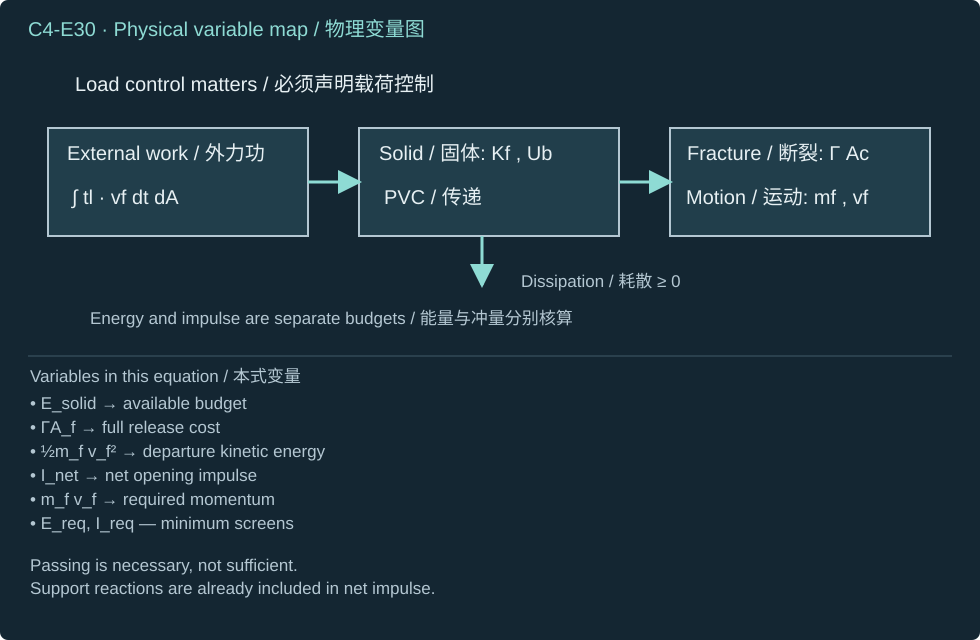

The full intended release area, not a pressure peak, determines the fracture-energy cost.

决定断裂能消耗的是全部目标释放面积，而非压力峰值。

**Symbols before Eq. (C4-E31).**

**式（C4-E31）前的符号定义。**

| First individual definition / 第一项单独定义 | Second individual definition / 第二项单独定义 |
| --- | --- |
| $\Gamma$ is assumed uniform release fracture energy (J m⁻²) $\Gamma$为假设均匀释放断裂能（J m⁻²） | $A_f=1.00$×10⁻⁶ m² intended full release area (m²) $A_f=1.00$×10⁻⁶ m²为全部目标释放面积（m²） |
| $E_{\rm solid}=10.0$ nJ assigned available solid energy (J) $E_{\rm solid}=10.0$ nJ为指定可用固体能量（J） |  |

**Conventions and conditions.** nJ is nanojoule; $\Rightarrow$ denotes numerical substitution; The comparison assumes no initially stored recoverable energy and no additional post-impact source; Subscript f labels film area, and solid labels the assigned useful energy.

**约定与条件。** nJ为纳焦耳；$\Rightarrow$表示数值代入；比较假设没有初始储存的可恢复能量，也没有额外冲击后源；下标f表示薄膜面积，solid表示指定有效能量。

(C4-E31) · Failed release-energy screen

$$
\Gamma=0.020\ {\rm J\,m^{-2}}\quad\Rightarrow\quad \Gamma A_f=(0.020)(1.00\times10^{-6})\ {\rm J}=20.0\ {\rm nJ}>E_{\rm solid}=10.0\ {\rm nJ}
$$

The assigned source cannot release the whole interface even before departure energy is added.

即使尚未计入离开动能，所指定源也无法释放整个界面。

That failure is already decisive under the stated budget. The 47.23 MPa number is a short-time compressive rigid-contact scale on tiny footprints; it does not create additional energy, spread automatically across 1 mm², or persist for the full emitted-jet duration. It may instead cause local damage. Change only the illustrative release fracture energy to 0.005 J m⁻², and require a minimum departure speed of 0.50 m s⁻¹. Re-evaluate both screens, retaining the same incoming jets and coupling assumptions.

在所述预算下，上述失败已经具有决定性。47.23 MPa是微小作用范围上的短时压缩刚性接触尺度；它不会创造额外能量，不会自动覆盖1 mm²，也不会持续整个射流发射时间。它反而可能造成局部损伤。现在仅将教学释放断裂能改为0.005 J m⁻²，并要求最低离开速度0.50 m s⁻¹。保持入射射流和耦合假设不变，重新计算两项筛选。

**Symbols before Eq. (C4-E32).**

**式（C4-E32）前的符号定义。**

| First individual definition / 第一项单独定义 | Second individual definition / 第二项单独定义 |
| --- | --- |
| $\Gamma=0.005$ J m⁻² is the changed teaching fracture energy $\Gamma=0.005$ J m⁻²为改变后的教学断裂能 | $A_f=1.00$×10⁻⁶ m² is release area (m²) $A_f=1.00$×10⁻⁶ m²为释放面积（m²） |
| $m_f=2.33$×10⁻⁹ kg is payload mass (kg) $m_f=2.33$×10⁻⁹ kg为对象质量（kg） | $v_f=0.50$ m s⁻¹ is minimum required departure speed $v_f=0.50$ m s⁻¹为最低所需离开速度 |
| $E_{\rm req}$ is minimum fracture-plus-translation energy (J) $E_{\rm req}$为最低断裂加平动能（J） | $I_{\rm req}$ required net impulse (N s) $I_{\rm req}$为所需净冲量（N s） |
| $I_{\rm net}=1.566642672$×10⁻⁹ N s the assigned actual net impulse $I_{\rm net}=1.566642672$×10⁻⁹ N s为指定实际净冲量 |  |

**Conventions and conditions.** nJ is nanojoule; Subscripts req, f and net label required, payload and net; The 10.0 nJ comparator is assigned solid energy; The first-row numbers are SI mass and speed.

**约定与条件。** nJ为纳焦耳；下标req、f、net分别标识所需、对象及净量；10.0 nJ比较值是指定固体能量；第一行数值为SI制质量与速度。

(C4-E32) · Passed necessary release and minimum-speed screens

$$
\begin{aligned}\Gamma A_f&=5.00\ {\rm nJ},\qquad \frac12m_fv_f^2=\frac12(2.33\times10^{-9})(0.50)^2\ {\rm J}=0.29125\ {\rm nJ},\\E_{\rm req}(0.50\ {\rm m\,s^{-1}})&=5.29125\ {\rm nJ}<10.0\ {\rm nJ},\\I_{\rm req}(0.50\ {\rm m\,s^{-1}})&=(2.33\times10^{-9})(0.50)\ {\rm N\,s}=1.165\times10^{-9}\ {\rm N\,s}<I_{\rm net}.\end{aligned}
$$

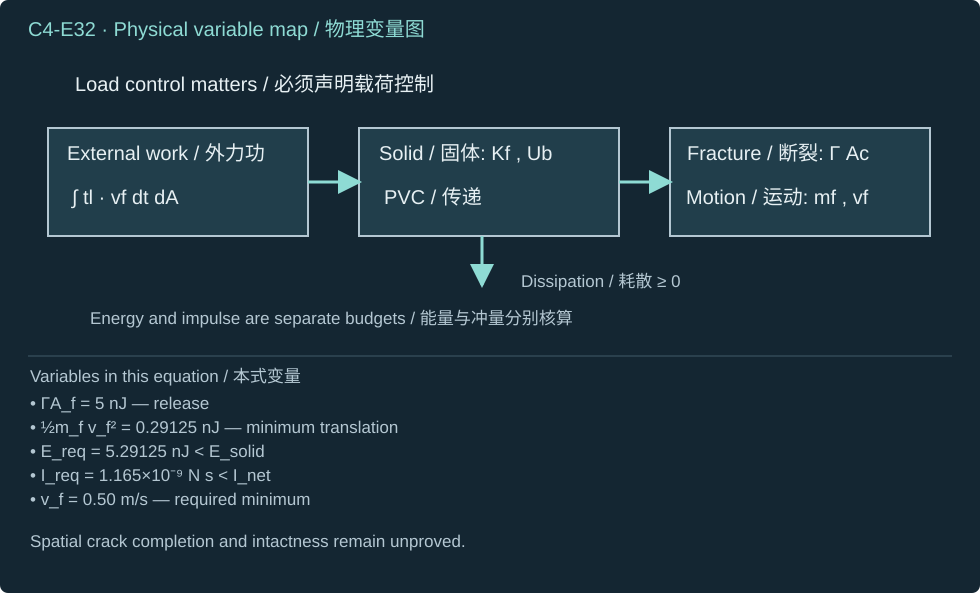

Reducing the assumed fracture cost allows the necessary budgets to pass.

降低假设断裂消耗后，必要预算可以通过。

Step 22 — Check mutual consistency of the energy and impulse allocations. If the assigned net impulse is the complete actual impulse from rest, its final centre-of-mass speed is 0.67238 m s⁻¹, above the requested minimum. The associated kinetic energy is 0.52669 nJ, not the 0.29125 nJ minimum-speed value. Including it still leaves the low-fracture-energy case below the 10 nJ budget. If a design demands exactly 0.50 m s⁻¹ instead, later counter-impulse or a different coupling allocation must be identified. Energy and momentum cannot be tuned independently without a physical load path.

步骤22——检验能量与冲量分配是否相容。若指定净冲量是对象从静止开始受到的全部实际冲量，则其最终质心速度为0.67238 m s⁻¹，高于所需最低值。对应动能为0.52669 nJ，而非最低速度的0.29125 nJ。将该动能计入后，低断裂能情况仍低于10 nJ预算。若设计要求速度恰好为0.50 m s⁻¹，就必须明确后续反向冲量或不同耦合分配。若无物理传力路径，能量与动量不能独立调节。

**Symbols before Eq. (C4-E33).**

**式（C4-E33）前的符号定义。**

| First individual definition / 第一项单独定义 | Second individual definition / 第二项单独定义 |
| --- | --- |
| $v_{\rm CM}$ is actual final centre-of-mass speed (m s⁻¹) if the specified $I_{\rm net}$ is the complete net impulse from rest (N s) $v_{\rm CM}$为实际最终质心速度（m s⁻¹），条件是所给$I_{\rm net}$为从静止开始受到的全部净冲量（N s） | $m_f=2.33$×10⁻⁹ kg is payload mass (kg) $m_f=2.33$×10⁻⁹ kg为对象质量（kg） |
| $K_{\rm CM}$ centre-of-mass kinetic energy (J) $K_{\rm CM}$为质心动能（J） | $\Gamma=0.005$ J m⁻² fracture energy $\Gamma=0.005$ J m⁻²为断裂能 |
| $A_f=1.00$×10⁻⁶ m² release area (m²) $A_f=1.00$×10⁻⁶ m²为释放面积（m²） | $E_{\rm solid}=10.0$ nJ assigned available energy (J) $E_{\rm solid}=10.0$ nJ为指定可用能量（J） |
| $I_{\rm net}$ — Net opening-direction impulse after all load-path reactions (N s) $I_{\rm net}$ — 考虑全部载荷路径反作用后的净张开方向冲量（N s） |  |

**Conventions and conditions.** CM labels centre of mass and net labels impulse after all reactions; nJ denotes nanojoule; Rotation, shape motion and dissipation still require additional positive energy beyond the terms shown.

**约定与条件。** CM标识质心，net表示考虑全部反作用后的冲量；nJ为纳焦耳；转动、形状运动及耗散仍需在所示项之外增加正能量。

(C4-E33) · Energy–momentum compatibility check

$$
v_{\rm CM}=\frac{I_{\rm net}}{m_f}=0.672378829\ {\rm m\,s^{-1}},\qquad K_{\rm CM}=\frac{I_{\rm net}^2}{2m_f}=0.526688683\ {\rm nJ},\qquad \Gamma A_f+K_{\rm CM}=5.526688683\ {\rm nJ}<E_{\rm solid}
$$

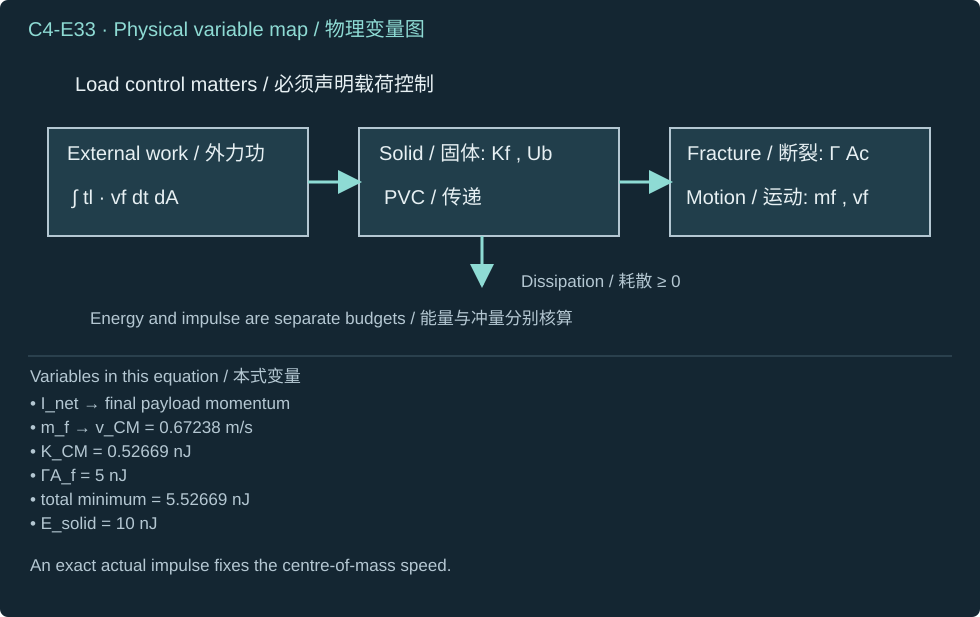

The stated impulse and low-fracture-energy budget are mutually consistent at the implied speed.

所给冲量与低断裂能预算在其决定的速度处相互相容。

Unresolved project link: neither coupling fraction, fracture energy, local cohesive strength nor the transmitted PVC load is calibrated for the proposed stack. The screens therefore establish conditional feasibility or exclusion, not a project prediction. Next resolve crack coverage, footprint-induced puncture/bending, torque, unintended interface failure, and intact arrival.

尚未闭合的项目环节：两个耦合比例、断裂能、局部内聚强度及PVC传递载荷，都尚未针对拟议叠层标定。因此，这些筛选只建立条件性可行或排除，而非项目预测。下一步须解析裂纹覆盖、作用范围引起的穿孔／弯曲、转矩、错误界面失效及完整到达。

## 8 · Placement and reset complete the useful operating window

## 8 · 落位与复位完成有效运行窗口

Step 23 — Follow the payload beyond release. During a short ballistic flight with negligible drag and gravity, its lateral offset equals its normal flight gap times the tangent of departure angle. This uses the payload trajectory, not the earlier liquid-jet flight gap. A nonuniform array can create torque and rotation even when its net impulse is sufficient. The receiver must arrest the object without damaging it or causing rebound and must supply adequate final adhesion.

步骤23——继续追踪释放后的对象。在阻力与重力可忽略的短时弹道飞行中，横向偏移等于法向飞行间隙乘离开角的正切。这使用对象轨迹，而非之前液体射流的飞行间隙。即使净冲量足够，不均匀阵列也可能产生转矩和转动。接收表面必须使对象停下而不损伤或反弹，并提供足够最终黏附。

**Symbols before Eq. (C4-E34).**

**式（C4-E34）前的符号定义。**

| First individual definition / 第一项单独定义 | Second individual definition / 第二项单独定义 |
| --- | --- |
| $\Delta x$ is lateral payload offset (m) $\Delta x$为对象横向偏移（m） | $H_f>0$ normal payload flight gap (m) $H_f>0$为对象法向飞行间隙（m） |
| $\theta\in(-\pi/2,\pi/2)$ departure angle relative to the target normal (rad) $\theta\in(-\pi/2,\pi/2)$为相对目标法向的离开角（rad） |  |

**Conventions and conditions.** $\tan$ is tangent; the numerical angle is converted from degrees to radians for evaluation; μm is micrometre and $\Rightarrow$ denotes substitution; Subscript f labels film/payload flight, not liquid-jet travel; The relation assumes straight flight without significant drag, gravity or rotation-dependent aerodynamic force; $\Delta$ marks position difference.

**约定与条件。** $\tan$为正切；数值角度由度转换为弧度计算；μm为微米，$\Rightarrow$表示代入；下标f标识薄膜／对象飞行，而非液体射流运动；关系假设直线飞行，且无显著阻力、重力或随转动变化的气动力；$\Delta$表示位置差。

(C4-E34) · Ballistic placement estimate

$$
\Delta x=H_f\tan\theta,\qquad H_f=100\ \mu{\rm m},\quad\theta=1^{\circ}\quad\Rightarrow\quad\Delta x=1.74551\ \mu{\rm m}
$$

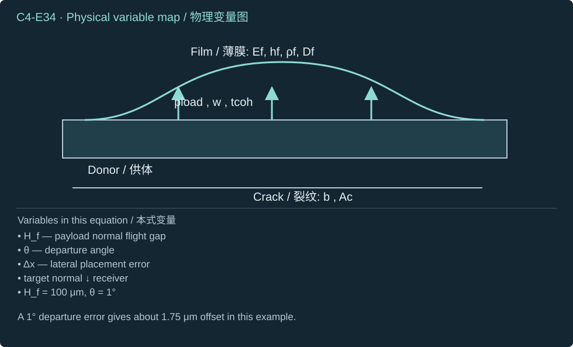

A finite receiving gap converts angular error into placement error.

有限接收间隙将角度误差转换为落位误差。

Reset is part of repeatability. Cooling, condensation, remaining PFC and carrier inventory, shell integrity and trapped gas determine the next shot’s state. A persistent cavity can alter absorption, wetting and mechanical transmission. The complete operating window therefore requires intended activation, useful finite output, correct-interface release, payload survival, acceptable landing and reproducible reset. A record single-shot pressure maximum and a repeatable intact-transfer envelope must be reported separately.

复位属于重复性的一部分。冷却、冷凝、剩余PFC与载液存量、壳层完整性及滞留气体决定下一次的状态。持续腔体可能改变吸收、润湿与力学传递。因此，完整运行窗口要求目标激活、有效有限输出、正确界面释放、对象存活、合格落位及可重复复位。单次最高压力记录与可重复完整转印范围必须分开报告。

The discriminating evidence is specific: deposited energy and activation statistics; cavity shape and lifetime; finite arriving jet mass, speed and direction; exposed-surface and buried-interface load histories; PVC and film motion; crack progression; final integrity, location and next-shot state. Maximum bubble radius alone cannot identify all those links. Each additional model should close a measured or explicitly missing link rather than rebuild a separate general mechanics curriculum.

能够区分机制的证据是具体的：沉积能量与激活统计；腔体形状及寿命；有限到达射流质量、速度与方向；外露表面与埋藏界面载荷历程；PVC和薄膜运动；裂纹扩展；最终完整性、位置及下一次状态。仅凭最大气泡半径无法识别全部环节。新增模型应闭合已测量或明确缺失的环节，而非另建一套广泛力学知识主线。

## Three graduation-defense explanations

## 三个毕业答辩式解释题

### A 47 MPa impact is observed. Why can transfer still fail, and how does intact PVC change the explanation?

### 观测到47 MPa冲击。为什么转印仍可能失败？完整PVC层如何改变解释？

Explain this in your own words. Use assumptions, a physical argument, and a limitation; equation memorization is not required.

请用自己的话解释，说明假设、物理推理及适用限制；不要求背诵公式。

\*\*Reference answer and mastery criteria / 参考答案与掌握标准\*\*

**Symbols before Eq. (C4-E35).**

**式（C4-E35）前的符号定义。**

| First individual definition / 第一项单独定义 | Second individual definition / 第二项单独定义 |
| --- | --- |
| $\boldsymbol t_l$ — Liquid traction on the solid (Pa) $\boldsymbol t_l$ — 液体作用于固体的牵引（Pa） | $\boldsymbol T_l$ liquid stress tensor (Pa) $\boldsymbol T_l$为液体应力张量（Pa） |
| $\boldsymbol n_f$ solid-to-liquid unit normal (dimensionless) $\boldsymbol n_f$为固体指向液体的单位法向（无量纲） | $\boldsymbol I_l$ applied liquid impulse (N s) $\boldsymbol I_l$为液体外加冲量（N s） |
| $\mathcal W_l$ delivered work (J) $\mathcal W_l$为传递功（J） | $A_f(t)$ is loaded surface (m²) $A_f(t)$为受载表面（m²） |
| $dA$ its element (m²) $dA$为其微元（m²） | $\boldsymbol v_f$ surface velocity (m s⁻¹) $\boldsymbol v_f$为表面速度（m s⁻¹） |
| $t_a$ — Load-event start time (s) $t_a$ — 载荷事件开始时刻（s） | $t_b$ — Load-event end time (s) $t_b$ — 载荷事件结束时刻（s） |
| $t$ — Time (s) $t$ — 时间（s） | $dt$ — Time integration element (s) $dt$ — 时间积分微元（s） |

**Conventions and conditions.** $\int$ means surface/time integration; the dot denotes a vector projection; Subscripts l and f label liquid and film; The same identities first load PVC if it is the exposed layer; $t_a<t_b$ fixes the integration interval..

**约定与条件。** 原公式：$\boldsymbol t_l$为流体施加于固体的牵引（Pa）；$\int$表示表面／时间积分；点乘表示向量投影；下标l、f表示液体与薄膜；若PVC为外露层，同一恒等式首先加载PVC；$t_a<t_b$ 确定积分区间。。

(C4-E35) · Original load, impulse and work formulas

$$
\boldsymbol t_l=\boldsymbol T_l\boldsymbol n_f,\qquad \boldsymbol I_l=\int_{t_a}^{t_b}\int_{A_f(t)}\boldsymbol t_l\,dA\,dt,\qquad \mathcal W_l=\int_{t_a}^{t_b}\int_{A_f(t)}\boldsymbol t_l\cdot\boldsymbol v_f\,dA\,dt
$$

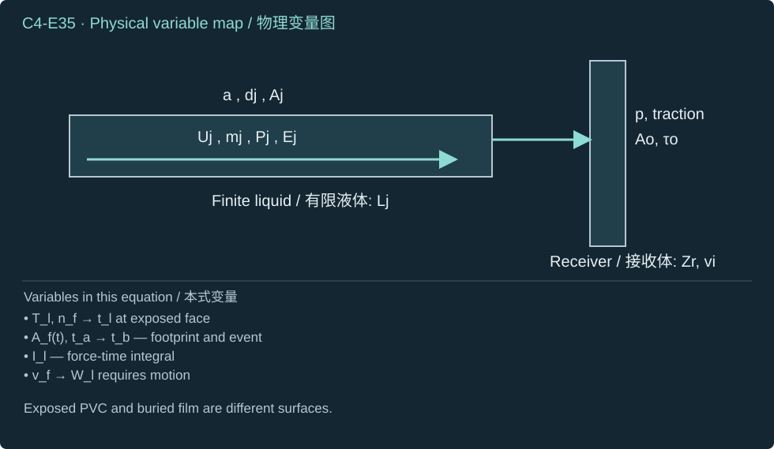

Reference answer: pressure, impulse and work describe different parts of the transmission path.

参考答案：压力、冲量与功描述传递路径中的不同部分。

**Symbols before Eq. (C4-E36).**

**式（C4-E36）前的符号定义。**

| First individual definition / 第一项单独定义 | Second individual definition / 第二项单独定义 |
| --- | --- |
| $E_{\rm solid}$ — Assigned useful solid-energy budget (J) $E_{\rm solid}$ — 指定的有效固体能量预算（J） | $\Gamma$ uniform release fracture energy (J m⁻²) $\Gamma$为均匀释放断裂能（J m⁻²） |
| $A_f$ intended full release area (m²) $A_f$为全部目标释放面积（m²） | $m_f$ payload mass (kg) $m_f$为对象质量（kg） |
| $v_f$ minimum required departure speed (m s⁻¹) $v_f$为最低所需离开速度（m s⁻¹） | $I_{\rm net}$ net opening impulse after all reactions (N s) $I_{\rm net}$为考虑全部反作用后的净张开冲量（N s） |

**Conventions and conditions.** The payload initially rests and has no additional recoverable source; Subscripts solid, f and net label useful solid allocation, payload and net impulse.

**约定与条件。** 原必要筛选：$E_{\rm solid}$为指定可用固体能量（J）；对象初始静止，且无额外可恢复源；下标solid、f、net标识有效固体分配、对象及净冲量。

(C4-E36) · Original global screens

$$
E_{\rm solid}\ge\Gamma A_f+\frac12m_fv_f^2,\qquad I_{\rm net}\ge m_fv_f
$$

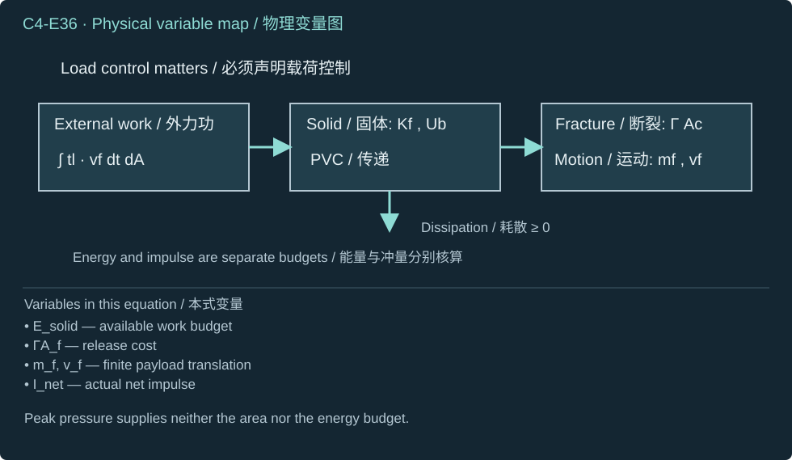

Reference answer: finite energy and net impulse must reach the intended interface.

参考答案：有限能量与净冲量必须到达目标界面。

A 47.23 MPa peak only characterizes the earliest local compressive contact under a rigid-receiver approximation. Its footprint, duration and load-path transmission are still needed. Twenty-five jets carry 50 nJ, and the assumed useful solid fraction supplies only 10 nJ. Releasing 1 mm² at 0.020 J m⁻² already costs 20 nJ, so the declared budget fails before translation is paid. Direct impact first loads the film; with intact PVC it first loads PVC, whose motion and contact determine what reaches the film. A pressure trace at PVC is not automatically an opening traction at the release interface. Failure of this necessary energy screen is decisive for the stated assumptions; passing a lower-energy case still requires crack coverage and intactness.

47.23 MPa峰值只是在刚性接收体近似下，最早局部压缩接触的特征。还需要作用范围、持续时间及传力路径中的传递情况。25股射流携带50 nJ，假设有效固体比例只提供10 nJ。在0.020 J m⁻²断裂能下释放1 mm²已经需要20 nJ，因此尚未支付平动能，所述预算就失败了。直接冲击首先加载薄膜；完整PVC情况下首先加载PVC，其运动与接触决定到达薄膜的载荷。PVC处压力历程并非自动等于释放界面张开牵引。在所述假设下，必要能量筛选失败具有决定性；低能耗情况通过筛选后，仍需检验裂纹覆盖与完整性。

#### What a mastered answer demonstrates

#### 掌握后的回答应体现

* Distinguish local compressive pressure from opening traction, impulse and delivered work.

  区分局部压缩压力、张开牵引、冲量与传递功。
* Explain why the stated 10 nJ budget cannot pay the 20 nJ full-area release cost.

  解释为什么所给10 nJ预算无法支付20 nJ整面积释放消耗。
* Trace direct and PVC-mediated force paths, identify unknown transmission, and retain spatial/competing-failure checks.

  追踪直接及PVC介导传力路径，指出未知传递关系，并保留空间／竞争失效检验。

### Can the 156 kPa blister threshold be used as a jet-transfer threshold? Defend the answer using geometry and loading control.

### 能否把156 kPa鼓泡阈值用作射流转印阈值？请依据几何和加载控制进行论证。

Explain this in your own words. Use assumptions, a physical argument, and a limitation; equation memorization is not required.

请用自己的话解释，说明假设、物理推理及适用限制；不要求背诵公式。

\*\*Reference answer and mastery criteria / 参考答案与掌握标准\*\*

**Symbols before Eq. (C4-E37).**

**式（C4-E37）前的符号定义。**

| First individual definition / 第一项单独定义 | Second individual definition / 第二项单独定义 |
| --- | --- |
| $w(r)$ — Blister opening displacement (m) $w(r)$ — 鼓泡张开位移（m） | $r\in[0,b]$ radial position (m) $r\in[0,b]$为径向位置（m） |
| $b>0$ existing circular crack radius (m) $b>0$为预存圆裂纹半径（m） | $p_0\ge0$ uniform maintained pressure difference (Pa) $p_0\ge0$为均匀恒定压差（Pa） |
| $D_f>0$ linear plate bending stiffness (N m) $D_f>0$为线性薄板弯曲刚度（N m） | $G_{p_0}$ fixed-pressure energy-release rate (J m⁻²) $G_{p_0}$为恒压能量释放率（J m⁻²） |
| $\Gamma>0$ constant fracture resistance (J m⁻²) $\Gamma>0$为恒定断裂阻力（J m⁻²） | $p_{0,\rm crit}$ positive onset pressure (Pa) $p_{0,\rm crit}$为正起始压力（Pa） |

**Conventions and conditions.** $\sqrt{\ }$ is the positive root; Subscripts f, 0 and crit denote film, maintained load and threshold; These expressions require regular centre and a clamped crack edge, quasistatic bending, and negligible stretching/pretension.

**约定与条件。** 原鼓泡公式：$w(r)$为张开位移（m）；$\sqrt{\ }$取正根；下标f、0、crit分别表示薄膜、恒定载荷与阈值；表达式要求中心正则、裂纹边缘夹持、准静态弯曲，且拉伸／预张力可忽略。

(C4-E37) · Original pressure-controlled benchmark formulas

$$
w(r)=\frac{p_0}{64D_f}(b^2-r^2)^2,\qquad G_{p_0}=\frac{p_0^2b^4}{128D_f},\qquad p_{0,\rm crit}=\frac{\sqrt{128D_f\Gamma}}{b^2}
$$

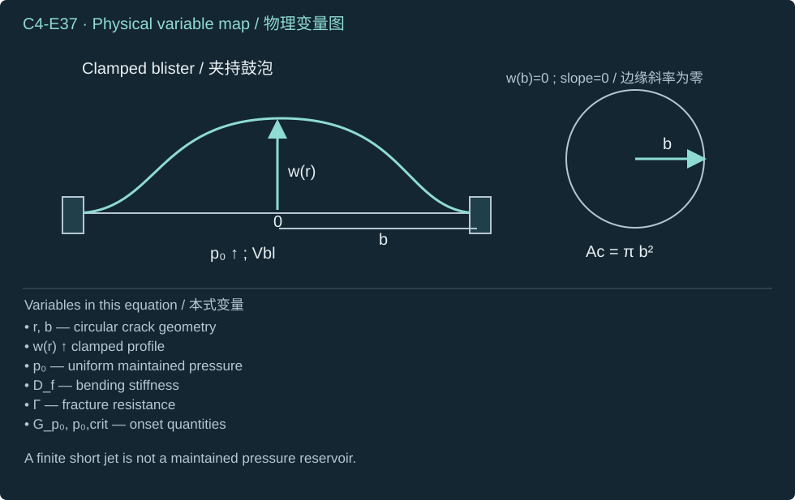

Reference answer: this pressure threshold follows a particular geometry and loading control.

参考答案：此压力阈值源于特定几何及加载控制。

The blister threshold comes from solving a uniformly loaded clamped plate, integrating its displacement to volume, including the maintained-pressure reservoir’s work, then differentiating total potential with crack area. It applies to a pre-existing circular crack under slow bending with negligible stretching, pretension and inertia. A brief localized jet generally supplies neither that uniform field nor that maintained source, and an intact PVC layer changes the exposed structure. The same instantaneous pressure is not enough: at fixed pressure the driving force increases with crack radius; at fixed volume pressure falls and the driving force decreases. A sealed finite PFC cavity needs its evolving pressure–volume–temperature state. For a rapid jet, use the actual transmitted traction, film inertia, crack kinetics and energy conservation. Check payload stress as well as desired-interface release.

鼓泡阈值来自求解均匀加载的夹持薄板，将位移积分为体积，计入恒压储库的功，再按裂纹面积对总势能求导。它适用于预存圆裂纹、慢速弯曲，以及拉伸、预张力与惯性可忽略的情况。短暂局部射流通常既不提供该均匀载荷场，也不提供该恒定源；完整PVC层还会改变外露结构。仅瞬时压力相同是不够的：恒压时驱动力随裂纹半径增加，恒容时压力下降且驱动力减小。有限封闭PFC腔体需要自身变化的压力—体积—温度状态。对快速射流，应使用实际传递牵引、薄膜惯性、裂纹动力学及能量守恒，并同时检验对象应力与目标界面释放。

#### What a mastered answer demonstrates

#### 掌握后的回答应体现

* Reconstruct pressure → plate opening → volume → source-inclusive potential → energy-release rate.

  重构压力 → 薄板张开 → 体积 → 含源势能 → 能量释放率。
* Identify the clamped existing crack, uniform maintained pressure and quasistatic small-deflection assumptions.

  指出夹持预裂纹、均匀恒压及准静态小挠度假设。
* Explain why short/localized loads, fixed volume, sealed thermodynamics or PVC transmission require another calculation.

  解释短时／局部载荷、恒容、封闭热力学或PVC传递为什么需要另一计算。

### Both global screens pass. What must still be established before claiming a useful, repeatable intact-transfer window?

### 两项整体筛选均通过。宣称有效且可重复的完整转印窗口之前，还需要建立哪些证据？

Explain this in your own words. Use assumptions, a physical argument, and a limitation; equation memorization is not required.

请用自己的话解释，说明假设、物理推理及适用限制；不要求背诵公式。

\*\*Reference answer and mastery criteria / 参考答案与掌握标准\*\*

**Symbols before Eq. (C4-E38).**

**式（C4-E38）前的符号定义。**

| First individual definition / 第一项单独定义 | Second individual definition / 第二项单独定义 |
| --- | --- |
| $\Gamma$ — Practical interfacial fracture energy (J m⁻²) $\Gamma$ — 实际界面断裂能（J m⁻²） | $\delta$ physical opening integration variable (m) $\delta$为物理张开积分变量（m） |
| $d\delta$ its element (m) $d\delta$为其微元（m） | $\delta_c$ complete opening (m) $\delta_c$为完全张开（m） |
| $t_n$ tensile cohesive traction (Pa) $t_n$为拉伸内聚牵引（Pa） | $T_{\max}$ peak tensile traction (Pa) $T_{\max}$为峰值拉伸牵引（Pa） |
| $G$ is energy available per new crack area (J m⁻²) $G$为单位新增裂纹面积可用能量（J m⁻²） | $\psi$ dimensionless mode mixture $\psi$为无量纲模态混合参数 |
| $T_i$ interface temperature (K) $T_i$为界面温度（K） | $v_c$ crack speed (m s⁻¹) $v_c$为裂纹速度（m s⁻¹） |

**Conventions and conditions.** The half-product applies to the adopted triangular monotonic law; $\int$ denotes opening integration; Subscripts n, c, i and max identify normal, crack/final opening, interface and maximum.

**约定与条件。** 原界面公式：$\Gamma$为单位面积拉伸内聚断裂功（J m⁻²）；一半乘积适用于所采用的三角形单调关系；$\int$表示张开积分；下标n、c、i、max分别表示法向、裂纹／最终张开、界面与最大值。

(C4-E38) · Original cohesive work and fracture criteria

$$
\Gamma=\int_0^{\delta_c}t_n(\delta)\,d\delta=\frac12T_{\max}\delta_c,\qquad G\ge\Gamma(\psi,T_i,v_c)
$$

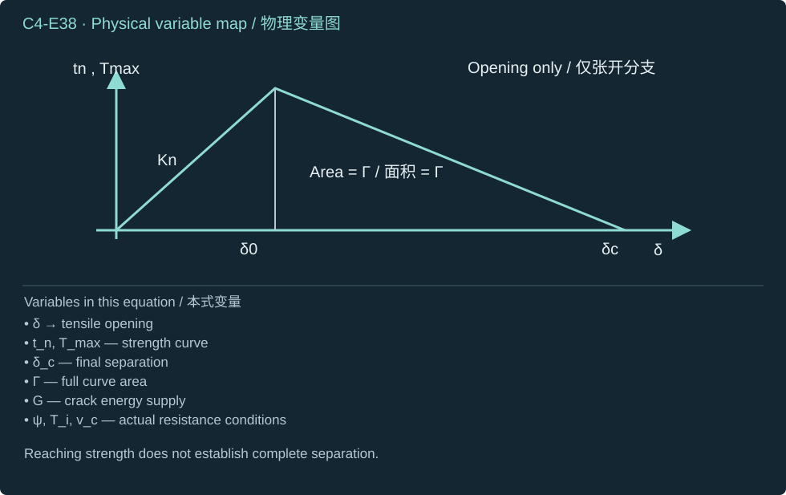

Reference answer: successful release requires both initiation and separation work at the correct interface.

参考答案：成功释放需要在正确界面上同时满足起始与分离功要求。

**Symbols before Eq. (C4-E39).**

**式（C4-E39）前的符号定义。**

| First individual definition / 第一项单独定义 | Second individual definition / 第二项单独定义 |
| --- | --- |
| $E_{\rm solid}$ — Assigned useful solid-energy budget (J) $E_{\rm solid}$ — 指定的有效固体能量预算（J） | $\Gamma$ fracture energy (J m⁻²) $\Gamma$为断裂能（J m⁻²） |
| $A_f$ full release area (m²) $A_f$为全部释放面积（m²） | $m_f$ payload mass (kg) $m_f$为对象质量（kg） |
| $v_f$ minimum departure speed (m s⁻¹) $v_f$为最低离开速度（m s⁻¹） | $I_{\rm net}$ net opening impulse (N s) $I_{\rm net}$为净张开冲量（N s） |
| $\Delta x$ is lateral payload offset (m) $\Delta x$为对象横向偏移（m） | $H_f$ normal payload flight gap (m) $H_f$为对象法向飞行间隙（m） |
| $\theta$ departure angle relative to receiver normal, and $\tan$ tangent (rad) $\theta$为相对接收面法向的离开角，$\tan$为正切（rad） |  |

**Conventions and conditions.** The screens assume initial rest without another energy source; the placement relation assumes straight short flight; Subscripts solid, f and net label useful solid energy, payload and net impulse.

**约定与条件。** 原筛选与落位关系：$E_{\rm solid}$为可用有效固体能量（J）；筛选假设初始静止且无其他能量源；落位关系假设短时直线飞行；下标solid、f、net标识有效固体能量、对象及净冲量。

(C4-E39) · Original necessary operating-window checks

$$
E_{\rm solid}\ge\Gamma A_f+\frac12m_fv_f^2,\qquad I_{\rm net}\ge m_fv_f,\qquad \Delta x=H_f\tan\theta
$$

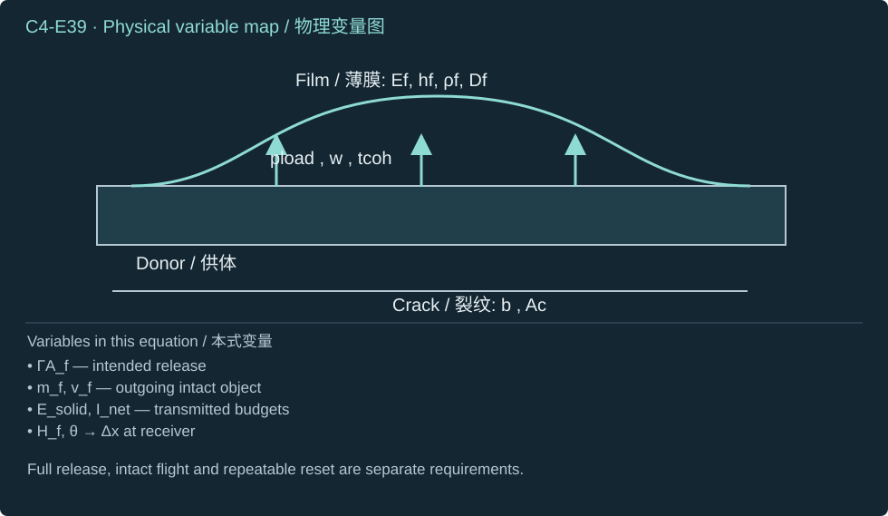

Reference answer: passing global budgets starts, rather than completes, the transfer argument.

参考答案：通过整体预算是转印论证的起点，而非终点。

The lower-fracture-energy case has enough assigned energy and net impulse for the requested minimum speed, but it does not yet prove complete transfer. Local loading must initiate the intended interface and supply its full separation work; compression alone is not tensile damage. The crack must cover the intended area before another bond releases or the payload punctures, tears or bends excessively. An exact actual net impulse also fixes outgoing centre-of-mass motion, so the energy allocation must remain consistent. Then check tilt, rotation, flight, landing adhesion and arrest without rebound. Verify those links with synchronized solid motion, crack progression and final integrity rather than a pressure maximum alone. Finally test cooling, condensation and remaining inventory over repeated shots. Record the largest single-shot output separately from the repeatable intact-transfer window.

低断裂能情况在指定能量和净冲量下，可以达到所需最低速度，但还不能证明完整转印。局部载荷必须使目标界面起始，并提供全部分离功；单纯压缩不是拉伸损伤。裂纹必须在错误粘接界面释放，或对象穿孔、撕裂、过度弯曲之前覆盖目标面积。精确实际净冲量还会确定出射质心运动，因此能量分配必须保持相容。之后要检验倾斜、转动、飞行、落位黏附及无反弹停下。应通过同步固体运动、裂纹扩展和最终完整性验证这些环节，而非只看压力峰值。最后在重复脉冲中检验冷却、冷凝及剩余存量，并将最高单次输出与可重复完整转印窗口分开记录。

#### What a mastered answer demonstrates

#### 掌握后的回答应体现

* Distinguish local strength initiation, full separation work and competing fracture paths.

  区分局部强度起始、完整分离功及竞争断裂路径。
* Keep energy and actual net impulse consistent and explain why spatial crack coverage and payload damage remain unresolved.

  保持能量与实际净冲量相容，并解释为什么空间裂纹覆盖和对象损伤仍未确定。
* Connect correct release to placement, landing and repeatable thermal/phase reset, proposing observations for the missing links.

  将正确释放连接至落位、着陆及可重复热／相变复位，并为缺失环节提出观测。

---

# Appendix A: Hydrogel versus liquid platforms

# 附录 A：水凝胶与液体平台

## The question is whether gel improves complete transfer

## 问题在于凝胶是否改善完整转印过程

A hydrogel can preserve the position of PFC droplets, support a patterned liquid reservoir, and conform to a payload at small preload. It also adds a polymer network that stores energy, dissipates motion, changes heat and mass transport, and may tear. This appendix evaluates those changes through the same chain as the preceding chapters: absorbed energy → finite phase source → mechanical motion → intended interface release → intact placement and reset. A smaller cavity or a larger pressure peak alone does not establish improvement.

水凝胶可以保持 PFC 液滴的位置、支撑图案化液体储库，并在小预载下贴合被转印对象。它同时引入聚合物网络，该网络会储存能量、耗散运动、改变传热传质，并可能撕裂。本附录沿用前面各章的链条评估这些变化：吸收能量 → 有限相变源 → 力学运动 → 目标界面释放 → 完整定位与复位。仅凭腔体更小或压力峰值更大，不能证明性能改善。

| Architecture 结构方案 | Where displaced material can go 被排开材料的去向 | Benefit to test; new cost 待检验的收益与新增代价 |
| --- | --- | --- |
| Conventional liquid site containing PFC 含 PFC 的常规液体位点 | Toward an exposed meniscus or defined outlet; the carrier remains a liquid. 朝暴露液面或明确出口运动；载液保持液体状态。 | Direct liquid displacement; wetting drift, spreading and neighboring flows can vary. 直接排开液体；润湿漂移、铺展和邻近流动可能发生变化。 |
| Open liquid pocket supported by gel 凝胶支撑的开放液腔 | Liquid leaves an opening while the gel wall deforms. 液体经开口离开，同时凝胶壁发生变形。 | A located outlet and compliant support; moving walls consume, return or redirect energy. 定位出口与柔顺支撑；运动壁面会消耗、返还能量或改变其方向。 |
| PFC embedded directly in bulk gel PFC 直接嵌入体相凝胶 | Initially into network deformation; an external liquid path must exist or be created. 起初转化为网络变形；必须已有或形成通往外部的液体路径。 | Stable inclusion locations; large strain, trapped vapor, network rupture and solid contamination. 稳定的夹杂位置；大应变、滞留蒸气、网络破裂及固体污染。 |
| Sealed cavity under a gel/composite stamp 凝胶／复合印章下的密封腔体 | Boundary bulging and pressure transmission rather than an open liquid outlet. 通过边界鼓起与压力传递，而不是开放液体出口。 | Distributed deformation and local peeling; this can be a blister actuator with a different release mechanism. 分布式变形与局部剥离；它可以是具有不同释放机制的鼓泡致动器。 |

Li and colleagues demonstrated a sealed hydrogel-composite stamp in which laser heating creates a water-vapor cavity, deforms covering layers, and releases a platelet. It supports the pressure–deformation–fracture route; it does not verify a coherent jet from PFC embedded in bulk gel. Its millisecond heating event must not supply a microsecond PFC constitutive law by analogy. [[R11]](../reference/sources.html#r11)

Li 等人展示了密封水凝胶复合印章：激光加热产生水蒸气腔体，使覆盖层变形并释放片状对象。该研究支持压力—变形—断裂路径，却没有验证体相凝胶中嵌入 PFC 后产生相干射流。不能仅凭类比，用其毫秒级加热事件提供微秒级 PFC 过程的本构规律。[[R11]](../reference/sources.html#r11)

## 1. Declare the intact spherical control

## 1. 明确完整球形控制模型

The analytical control is an infinite, homogeneous, isotropic, incompressible medium with a continuous unbroken neo-Hookean network. An existing spherical cavity has stress-free reference radius $R_{\mathrm{ref}}>0$ and current radius $R(t)>0$. Material occupies the exterior of the cavity. Far-field total radial stress is $-p_\infty(t)$, the gas/liquid cavity pressure is spatially uniform $p_b(t)$, and the interfacial tension is constant $\sigma$. Tensile Cauchy stress is positive. The radial coordinate points from the cavity center outward; positive wall speed means expansion. No gravity, nearby boundary, outlet, solvent drainage, damage, shell stress or material phase slip is resolved.

解析控制模型采用无限、均匀、各向同性、不可压缩介质，包含连续且未破坏的 neo-Hookean 网络。已有球形空腔的无应力参考半径为 $R_{\mathrm{ref}}>0$，当前半径为 $R(t)>0$。材料位于空腔外部。远场总径向应力为 $-p_\infty(t)$，腔内气体／液体压力 $p_b(t)$ 在空间上均匀，界面张力 $\sigma$ 为常数。拉伸 Cauchy 应力取正。径向坐标从空腔中心向外，泡壁速度为正表示膨胀。模型不解析重力、附近边界、出口、溶剂排水、损伤、壳层应力或材料相间滑移。

At initial time $t=0$, take $R=R_{\mathrm{ref}}$, $\dot R=0$ and an unstretched network. A constant-tension interface requires $p_b(0)-p_\infty(0)=2\sigma/R_{\mathrm{ref}}$ for this initial mechanical equilibrium. A subsequent laser/phase calculation supplies $p_b(t)$; the elastic calculation does not derive it. If the network was polymerized around a loaded inclusion, the stress-free configuration may differ from its observed initial shape. The initial liquid-PFC core radius $a_0$ is an inventory variable and is not silently identified with $R_{\mathrm{ref}}$ or with the evolving vapor-cavity radius.

初始时刻 $t=0$ 取 $R=R_{\mathrm{ref}}$、$\dot R=0$，网络没有伸长。若界面张力为常数，该初始力学平衡要求 $p_b(0)-p_\infty(0)=2\sigma/R_{\mathrm{ref}}$。后续激光／相变计算提供 $p_b(t)$；弹性计算不会推导这个压力。若网络围绕受载夹杂进行聚合，其无应力构形可能不同于观测到的初始形状。初始液态 PFC 核半径 $a_0$ 是描述物质量的变量，不能默默将其等同于 $R_{\mathrm{ref}}$ 或不断演化的蒸气空腔半径。

| Symbol 符号 | Physical meaning 物理意义 | SI units SI 单位 | Role and convention 作用与约定 |
| --- | --- | --- | --- |
| $t$ | Time 时间 | s | Independent coordinate of the transient cavity event; the reference state is specified at zero. 瞬态腔体事件的独立坐标；参考状态规定在零时刻。 |
| $r_0$ | Reference material radial coordinate 参考材料径向坐标 | m | Labels a material shell in the stress-free configuration; held fixed for material motion. 标识无应力构形中的材料壳层；追踪材料运动时保持不变。 |
| $r$ | Current material radial coordinate 当前材料径向坐标 | m | Current position of the shell labeled by r₀; distinct from current wall radius R. 由 r₀ 标识的壳层当前所在位置；不同于当前壁面半径 R。 |
| $R_{\mathrm{ref}}$ | Stress-free reference cavity radius 无应力参考腔体半径 | m | Reference geometry for network stretch; not automatically an observed loaded cavity radius. 网络伸长的参考几何；不能自动等同于观测到的受载腔体半径。 |
| $R$ | Current cavity radius 当前腔体半径 | m | Locates the moving cavity boundary in the current configuration. 定位当前构形中的运动腔体边界。 |
| $\dot R$ | Cavity wall radial velocity 腔体壁面径向速度 | m s⁻¹ | First time derivative of R; positive expansion and negative inward motion. R 的一阶时间导数；正值表示膨胀，负值表示向内运动。 |
| $\ddot R$ | Cavity wall radial acceleration 腔体壁面径向加速度 | m s⁻² | Second time derivative of R in the inertial radial balance. 惯性径向平衡中的 R 的二阶时间导数。 |
| $a_0$ | Initial liquid-PFC core radius 初始液态 PFC 核半径 | m | Inventory geometry; neither R nor the network reference radius is silently substituted for it. 存量几何；不能默默用 R 或网络参考半径替代它。 |
| $\lambda_r$ | Radial principal stretch 径向主伸长 | 1 | Ratio of current to reference radial line elements at a material shell. 材料壳层处当前与参考径向线元的比值。 |
| $\lambda_\theta$ | First tangential principal stretch 第一切向主伸长 | 1 | Circumferential line-element ratio in the θ direction. θ 方向周向线元的比值。 |
| $\lambda_\phi$ | Second tangential principal stretch 第二切向主伸长 | 1 | Circumferential line-element ratio in the φ direction; equals the other tangential stretch under spherical symmetry. φ 方向周向线元的比值；在球对称下等于另一切向伸长。 |
| $\mathbf F$ | Deformation-gradient tensor 变形梯度张量 | 1 | Maps reference line elements into the current configuration. 将参考线元映射到当前构形。 |
| $\mathbf B$ | Left Cauchy–Green tensor 左 Cauchy—Green 张量 | 1 | Product of deformation gradient and its transpose; enters the neo-Hookean stress. 变形梯度与其转置的乘积；进入 neo-Hookean 应力。 |
| $G_g$ | Gel-network shear modulus 凝胶网络剪切模量 | Pa | Elastic material parameter controlling stored network resistance; relevant strain/rate dependence must be validated. 控制所储存网络阻力的弹性材料参数；相关应变／速率依赖需验证。 |
| $\eta_g$ | Represented Kelvin–Voigt viscosity 所描述的 Kelvin—Voigt 黏度 | Pa s | Coefficient of the adopted viscous stress; avoid counting the same solvent dissipation twice. 所采用黏性应力的系数；避免对同一溶剂耗散重复计数。 |
| $\rho_g$ | Effective medium mass density 有效介质质量密度 | kg m⁻³ | Density of the moving surrounding medium, not the PFC core or vapor alone. 周围运动介质的密度，不是单独的 PFC 核或蒸气密度。 |
| $\sigma$ | Cavity-interface tension 腔体界面张力 | N m⁻¹ | Constant coefficient for the declared interface; separate from network elastic stress. 指定界面的恒定系数；与网络弹性应力不同。 |
| $\mathbf T^e$ | Elastic Cauchy-stress tensor 弹性 Cauchy 应力张量 | Pa | Tensile-positive stress contributed by the network constitutive law; e denotes elasticity. 网络本构规律产生的应力，拉伸为正；e 表示弹性。 |
| $\mathbf T$ | Total Cauchy-stress tensor 总 Cauchy 应力张量 | Pa | Includes elastic and represented viscous contributions in the radial momentum balance. 包含径向动量平衡中的弹性及所描述黏性贡献。 |
| $\chi$ | Incompressibility multiplier 不可压缩约束乘子 | Pa | Unknown isotropic stress multiplier; unlike Chapter 3’s interaction parameter, it has pressure units here. 未知各向同性应力乘子；与第三章的相互作用参数不同，此处具有压力单位。 |
| $p_b$ | Uniform cavity absolute pressure 均匀腔内绝对压力 | Pa | Supplied by the laser/phase source calculation, not derived from the elastic resistance. 由激光／相变源计算提供，不由弹性阻力推导。 |
| $p_\infty$ | Far-field absolute pressure 远场绝对压力 | Pa | Sets the exterior radial-traction condition under the stated stress convention. 在指定应力约定下确定外部径向牵引条件。 |
| $p_{\mathrm{el}}$ | Signed elastic cavity resistance 带符号弹性腔体阻力 | Pa | Stress-difference integral resisting expansion; its intact-network formula is not a fracture threshold. 抵抗膨胀的应力差积分；其完整网络公式不是断裂阈值。 |
| $u_r$ | Radial material velocity 材料径向速度 | m s⁻¹ | Velocity of the surrounding material, consistent with the stated no-phase-slip control. 周围材料的速度，与所声明无相间滑移对照一致。 |
| $\mathbf D$ | Symmetric velocity-gradient tensor 对称速度梯度张量 | s⁻¹ | Strain-rate tensor used by the represented viscous constitutive law. 所描述黏性本构规律使用的应变率张量。 |
| $W_g$ | Stored network elastic work 储存的网络弹性功 | J | Integrated recoverable network work measured from the stress-free reference cavity. 从无应力参考腔体起算的可恢复网络功积分。 |
| $K_g$ | Surrounding-medium kinetic energy 周围介质动能 | J | Integrated energy of the radial exterior motion. 外部径向运动能量的积分。 |
| $E_\sigma$ | Cavity surface energy 腔体表面能 | J | Interface-area energy under the declared constant-tension assumption. 指定恒张力假设下的界面面积能量。 |
| $P_{\mathrm{dis}}$ | Nonnegative viscous dissipation power 非负黏性耗散功率 | W | Rate of irreversible mechanical-energy loss; differs from recoverable storage. 不可逆力学能损失速率；不同于可恢复储能。 |
| $\tau_e$ | Event duration 事件持续时间 | s | Specified loading/evolution time used to test material-response assumptions. 检验材料响应假设采用的指定受载／演化时间。 |
| $\tau_{\mathrm{rel}}$ | Measured stress-relaxation time 测量的应力松弛时间 | s | Independently identified memory time; not Kelvin–Voigt retardation time. 独立确定的记忆时间；不是 Kelvin—Voigt 延迟时间。 |
| $L_g$ | Specified gel communication length 指定凝胶传播长度 | m | Distance over which shear support or solvent drainage must communicate. 剪切支撑或溶剂排水需要传播的距离。 |
| $\mathrm{De}$ | Deborah number Deborah 数 | 1 | Stress-relaxation time divided by event duration in the declared memory test. 在指定记忆检验中为应力松弛时间除以事件持续时间。 |
| $t_s$ | Shear communication time 剪切传播时间 | s | Small-disturbance elastic communication scale over Lg; not a universal cavity-collapse time. 跨越 Lg 的小扰动弹性传播尺度；不是通用腔体塌缩时间。 |
| $t_{\mathrm{poro}}$ | Poroelastic drainage time scale 孔弹性排水时间尺度 | s | Diffusion-scale solvent/network pressure equilibration under the stated linear approximation. 在指定线性近似下溶剂／网络压力平衡的扩散时间尺度。 |

Ordinary powers, scalar products and comparisons use their usual meanings; subscripts name directions, materials or states. $d/dr$ is a derivative in current radius, $\partial/\partial$ holds other independent coordinates fixed, $\int$ is a definite integral with its written limits, $\lim$ is a limit, and $\pi$ is the dimensionless circle constant. All local symbol declarations below repeat the quantities actually displayed. Gaudron, Warnez and Johnsen provide the nonlinear-elastic cavity framework; the intermediate transformations and work evaluation here are derived explicitly for this stated control. [[R13]](../reference/sources.html#r13)

普通幂、标量乘积和比较沿用通常意义；下标表示方向、材料或状态。$d/dr$ 表示对当前径向位置求导，$\partial/\partial$ 表示保持其他独立坐标不变的偏导，$\int$ 表示采用所写上下限的定积分，$\lim$ 表示极限，$\pi$ 为无量纲圆周率。下文每处局部符号声明都重复定义实际显示的量。Gaudron、Warnez 和 Johnsen 提供了非线性弹性空腔的理论框架；这里针对已声明的控制模型，显式推导中间变换及功的计算。[[R13]](../reference/sources.html#r13)

## 2. Derive the elastic pressure rather than inserting it

## 2. 推导弹性压力，而不是直接代入

Step 1 — exact volume conservation. Follow one material shell from its reference radius to its present radius. Incompressibility equates the material volume between the cavity and that shell. Differentiate at fixed time to obtain the radial stretch; divide only by strictly positive radii.

步骤 1——精确的体积守恒。跟踪一个材料球壳从参考位置到当前位置。不可压缩性要求腔体与球壳之间的材料体积相等。在固定时刻求导即可得到径向伸长；只有严格为正的半径才进行除法。

**Symbols before Eq. (A-E01).**

**式（A-E01）前的符号定义。**

| First individual definition / 第一项单独定义 | Second individual definition / 第二项单独定义 |
| --- | --- |
| $r_0\geq R_{\mathrm{ref}}>0$ — Reference material radius (m) $r_0\geq R_{\mathrm{ref}}>0$ — 参考物质半径（m） | $r\geq R>0$ — Current material radius (m) $r\geq R>0$ — 当前物质半径（m） |
| $R_{\mathrm{ref}}$ — Stress-free reference cavity radius (m) $R_{\mathrm{ref}}$ — 无应力参考腔体半径（m） | $R$ — Current cavity radius (m) $R$ — 当前腔体半径（m） |
| $\lambda_r$ — Radial principal stretch (dimensionless) $\lambda_r$ — 径向主伸长比（无量纲） | $\lambda_\theta$ — Polar tangential principal stretch (dimensionless) $\lambda_\theta$ — 极角切向主伸长比（无量纲） |
| $\lambda_\phi$ — Azimuthal tangential principal stretch (dimensionless) $\lambda_\phi$ — 方位角切向主伸长比（无量纲） | $\theta$ — Polar tangential coordinate label (—) $\theta$ — 极角切向坐标标记（—） |
| $\phi$ — Azimuthal tangential coordinate label (—) $\phi$ — 方位角切向坐标标记（—） |  |

**Conventions and conditions.** $\partial r/\partial r_0$ is the derivative with respect to the reference material coordinate at fixed time.

**约定与条件。** $\partial r/\partial r_0$ 表示构形映射中固定时刻的材料坐标导数。

(A-E01) · Exact kinematics under incompressibility

$$
\begin{aligned}r^3-R^3&=r_0^3-R_{\mathrm{ref}}^3,\\3r^2\frac{\partial r}{\partial r_0}&=3r_0^2,\\\lambda_r:=\frac{\partial r}{\partial r_0}&=\frac{r_0^2}{r^2},\qquad\lambda_\theta=\lambda_\phi=\frac{r}{r_0},\\\lambda_r\lambda_\theta\lambda_\phi&=1.\end{aligned}
$$

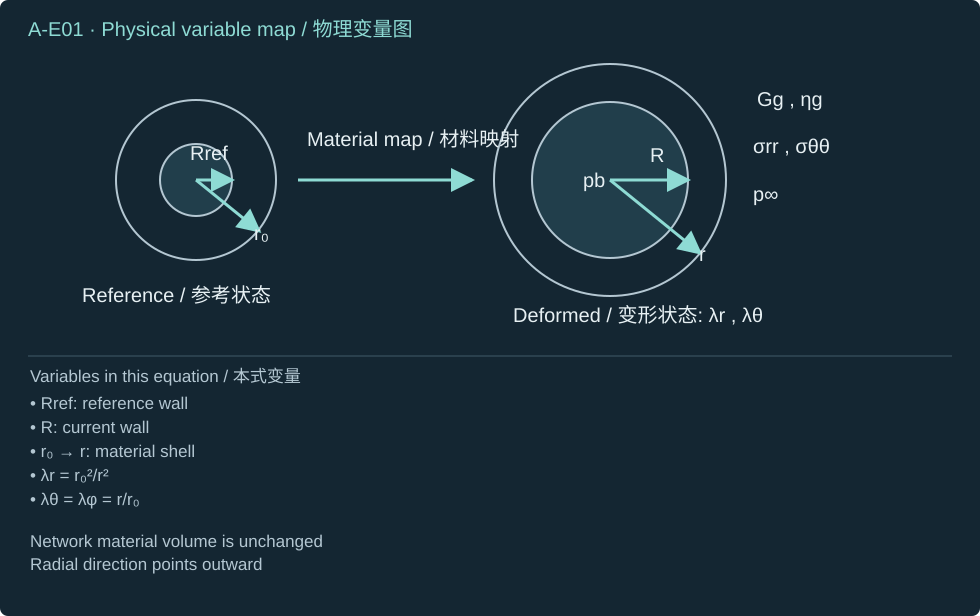

The same network shell moves outward while thinning radially and stretching tangentially.

同一网络球壳向外移动，同时径向变薄、切向伸长。

Step 2 — declared constitutive law. In principal directions the neo-Hookean Cauchy stress is a common incompressibility multiplier plus a stretch-dependent part. Subtract radial from tangential stress to eliminate that unknown multiplier. This is a material model, not a universal hydrogel law.

步骤 2——明确采用的本构规律。在主方向上，neo-Hookean Cauchy 应力由共同的不可压缩约束乘子及依赖伸长的部分组成。用切向应力减去径向应力，消除未知约束乘子。这是材料模型，不是普适的水凝胶定律。

**Symbols before Eq. (A-E02).**

**式（A-E02）前的符号定义。**

| First individual definition / 第一项单独定义 | Second individual definition / 第二项单独定义 |
| --- | --- |
| $\mathbf T^e$ — Elastic Cauchy stress tensor, tension positive (Pa) $\mathbf T^e$ — 拉伸取正的弹性柯西应力张量（Pa） | $\chi$ is the incompressibility multiplier (Pa) $\chi$ 为不可压缩约束乘子（Pa） |
| $\mathbf I$ is the dimensionless identity tensor $\mathbf I$ 为无量纲单位张量 | $G_g>0$ is network shear modulus (Pa) $G_g>0$ 为网络剪切模量（Pa） |
| $\mathbf F$ is the dimensionless deformation gradient $\mathbf F$ 为无量纲变形梯度 | $\mathbf B$ its left Cauchy–Green tensor (dimensionless) $\mathbf B$ 为左 Cauchy–Green 张量（无量纲） |
| $\lambda_r$ — Radial principal stretch (dimensionless) $\lambda_r$ — 径向主伸长比（无量纲） | $\lambda_\theta$ — Polar tangential principal stretch (dimensionless) $\lambda_\theta$ — 极角切向主伸长比（无量纲） |
| $r$ — Current material radius (m) $r$ — 当前物质半径（m） | $r_0>0$ — Reference material radius (m) $r_0>0$ — 参考物质半径（m） |
| $T^e_{rr}$ — Radial elastic Cauchy stress (Pa) $T^e_{rr}$ — 径向弹性柯西应力（Pa） | $T^e_{\theta\theta}$ — Polar tangential elastic Cauchy stress (Pa) $T^e_{\theta\theta}$ — 极角切向弹性柯西应力（Pa） |
| $T^e_{\phi\phi}$ — Azimuthal tangential elastic Cauchy stress (Pa) $T^e_{\phi\phi}$ — 方位角切向弹性柯西应力（Pa） |  |

**Conventions and conditions.** $\mathsf T$ denotes transpose; Elastic stress is positive in tension..

**约定与条件。** $\mathsf T$ 表示转置；弹性应力以拉伸为正。。

(A-E02) · Constitutive assumption and exact subtraction

$$
\begin{aligned}\mathbf T^e&=-\chi\mathbf I+G_g\mathbf B,\qquad\mathbf B=\mathbf F\mathbf F^{\mathsf T},\\T^e_{rr}&=-\chi+G_g\lambda_r^2,\qquad T^e_{\theta\theta}=T^e_{\phi\phi}=-\chi+G_g\lambda_\theta^2,\\T^e_{\theta\theta}-T^e_{rr}&=G_g\left[\left(\frac r{r_0}\right)^2-\left(\frac{r_0}r\right)^4\right].\end{aligned}
$$

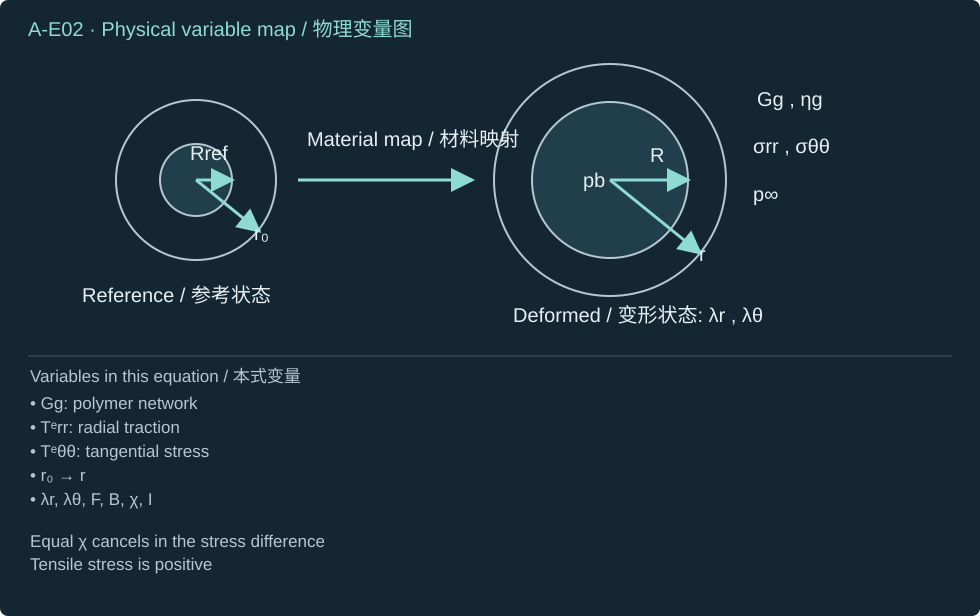

Radial and tangential stretches produce different network stresses around the cavity.

空腔周围的径向与切向伸长产生不同的网络应力。

Step 3 — integrate the elastic contribution. For a static spherical field, radial equilibrium places twice the tangential–radial stress difference over radius in the radial stress derivative. The wall traction and the far-field traction then identify the pressure needed to support the elastic deformation. The same stress-difference integral will reappear as a resistance in the dynamic balance; setting the whole dynamic field quasistatic is not required there.

步骤 3——积分弹性贡献。对静态球形应力场，径向平衡使径向应力导数等于切向—径向应力差的两倍除以半径。壁面牵引与远场牵引由此确定维持弹性变形所需的压力。同一应力差积分还会作为阻力出现在动力学平衡中；后者并不要求整个动态场处于准静态。

**Symbols before Eq. (A-E03).**

**式（A-E03）前的符号定义。**

| First individual definition / 第一项单独定义 | Second individual definition / 第二项单独定义 |
| --- | --- |
| $T^e_{rr}$ — Radial elastic Cauchy stress (Pa) $T^e_{rr}$ — 径向弹性柯西应力（Pa） | $T^e_{\theta\theta}$ — Polar tangential elastic Cauchy stress (Pa) $T^e_{\theta\theta}$ — 极角切向弹性柯西应力（Pa） |
| $r$ is current radius (m) $r$ 为当前半径（m） | $r_0=r_0(r)$ the reference coordinate (m) $r_0=r_0(r)$ 为参考坐标（m） |
| $R>0$ the cavity radius (m) $R>0$ 为腔体半径（m） | $p_b$ — Cavity pressure (Pa) $p_b$ — 空腔压力（Pa） |
| $p_\infty$ — Far-field pressure (Pa) $p_\infty$ — 远场压力（Pa） | $\sigma\geq0$ is constant tension (N m⁻¹) $\sigma\geq0$ 为恒定张力（N m⁻¹） |
| $G_g>0$ is shear modulus (Pa) $G_g>0$ 为剪切模量（Pa） | $p_{\mathrm{el}}$ is the signed elastic resistance (Pa) $p_{\mathrm{el}}$ 为带符号的弹性阻力（Pa） |

**Conventions and conditions.** $d/dr$ differentiates in $r$, $\int_R^\infty$ integrates over exterior material, and $\infty$ labels the infinite far field.

**约定与条件。** $d/dr$ 表示对 $r$ 求导，$\int_R^\infty$ 对外部材料积分，$\infty$ 标记无限远场。

(A-E03) · Static balance defining the elastic resistance

$$
\begin{aligned}\frac{dT^e_{rr}}{dr}&=\frac{2}{r}(T^e_{\theta\theta}-T^e_{rr}),\\T^e_{rr}(\infty)&=-p_\infty,\qquad T^e_{rr}(R)=-p_b+\frac{2\sigma}{R},\\p_{\mathrm{el}}(R):=p_b-p_\infty-\frac{2\sigma}{R}&=2G_g\int_R^\infty\left[\left(\frac r{r_0}\right)^2-\left(\frac{r_0}r\right)^4\right]\frac{dr}{r}.\end{aligned}
$$

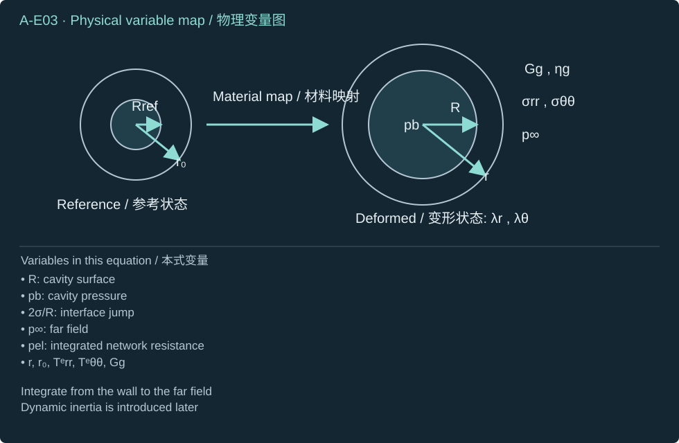

The wall pressure supports capillary traction and the accumulated elastic resistance.

壁面压力同时支撑毛细牵引与积分后的弹性阻力。

Step 4 — change variables with its Jacobian. During expansion $R>R_{\mathrm{ref}}$, set the dimensionless ratio $q=r_0/r$. The mapping makes it increase from $R_{\mathrm{ref}}/R$ at the wall to one at infinity. Differentiate its cube, cancel its positive square, and use the positive factor $1-q^3$ for finite exterior positions. Exactly at the undeformed state the transformation is degenerate; evaluate zero resistance directly instead of dividing by zero.

步骤 4——带雅可比地变换变量。膨胀时 $R>R_{\mathrm{ref}}$，定义无量纲比值 $q=r_0/r$。由构形映射，它从壁面处的 $R_{\mathrm{ref}}/R$ 增大到无穷远处的 1。对其三次方求导，约去正的平方，并对有限外部位置使用正因子 $1-q^3$。在恰好未变形的状态，这个变换退化；此时直接求得零阻力，而不是除以零。

**Symbols before Eq. (A-E04).**

**式（A-E04）前的符号定义。**

| First individual definition / 第一项单独定义 | Second individual definition / 第二项单独定义 |
| --- | --- |
| $q=r_0/r$ is a positive dimensionless coordinate ratio $q=r_0/r$ 为正的无量纲坐标比 | $r_0$ — Reference material radius (m) $r_0$ — 参考物质半径（m） |
| $r$ — Current material radius (m) $r$ — 当前物质半径（m） | $R>R_{\mathrm{ref}}>0$ — Current cavity radius (m) $R>R_{\mathrm{ref}}>0$ — 当前腔体半径（m） |
| $R_{\mathrm{ref}}$ — Stress-free reference cavity radius (m) $R_{\mathrm{ref}}$ — 无应力参考腔体半径（m） | $q(R)$ — Coordinate-ratio value at the cavity wall (dimensionless) $q(R)$ — 空腔壁面处的坐标比值（无量纲） |
| $q(\infty)$ denote endpoint values (dimensionless) $q(\infty)$ 表示端点值（无量纲） | $dq$ — Dimensionless coordinate-ratio integration element (dimensionless) $dq$ — 无量纲坐标比积分微元（无量纲） |
| $dr$ — Current-radius integration element (m) $dr$ — 当前半径积分微元（m） |  |

**Conventions and conditions.** $\infty$ denotes the far-field limit; The factorization $1-q^6=(1-q^3)(1+q^3)$ applies for $q<1$ before taking the endpoint limit.

**约定与条件。** $\infty$ 表示远场极限；因式分解 $1-q^6=(1-q^3)(1+q^3)$ 先在 $q<1$ 时使用，再取端点极限。

(A-E04) · Exact change of variable for expansion

$$
\begin{aligned}q^3&=1-\frac{R^3-R_{\mathrm{ref}}^3}{r^3},\qquad q(R)=\frac{R_{\mathrm{ref}}}{R},\qquad q(\infty)=1,\\3q^2\,dq&=3(1-q^3)\frac{dr}{r},\qquad \frac{dr}{r}=\frac{q^2\,dq}{1-q^3},\\\left(q^{-2}-q^4\right)\frac{dr}{r}&=\frac{1-q^6}{1-q^3}\,dq=(1+q^3)\,dq.\end{aligned}
$$

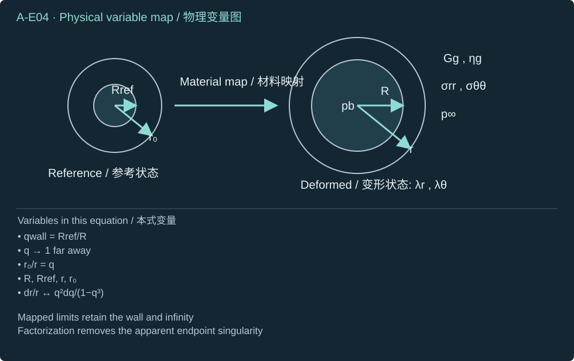

The material coordinate ratio converts a spatial stress integral into a regular polynomial integral.

材料坐标比将空间应力积分转化为正则的多项式积分。

**Symbols before Eq. (A-E05).**

**式（A-E05）前的符号定义。**

| First individual definition / 第一项单独定义 | Second individual definition / 第二项单独定义 |
| --- | --- |
| $p_{\mathrm{el}}$ is elastic cavity resistance (Pa) $p_{\mathrm{el}}$ 为弹性腔体阻力（Pa） | $G_g>0$ is network shear modulus (Pa) $G_g>0$ 为网络剪切模量（Pa） |
| $R\geq R_{\mathrm{ref}}>0$ — Current cavity radius (m) $R\geq R_{\mathrm{ref}}>0$ — 当前腔体半径（m） | $R_{\mathrm{ref}}$ — Stress-free reference cavity radius (m) $R_{\mathrm{ref}}$ — 无应力参考腔体半径（m） |
| $q$ is the dimensionless integration variable $q$ 为无量纲积分变量 |  |

**Conventions and conditions.** $\int$ is a definite integral; $[f(q)]_a^b$ means upper-endpoint minus lower-endpoint evaluation of the bracketed function.

**约定与条件。** $\int$ 为定积分；$[f(q)]_a^b$ 表示括号中函数的上端点值减去下端点值。

(A-E05) · Derived neo-Hookean elastic resistance

$$
\begin{aligned}p_{\mathrm{el}}(R)&=2G_g\int_{R_{\mathrm{ref}}/R}^{1}(1+q^3)\,dq\\&=2G_g\left[q+\frac{q^4}{4}\right]_{R_{\mathrm{ref}}/R}^{1}\\&=2G_g\left[\frac54-\frac{R_{\mathrm{ref}}}{R}-\frac14\left(\frac{R_{\mathrm{ref}}}{R}\right)^4\right]\\&=\frac{G_g}{2}\left[5-4\frac{R_{\mathrm{ref}}}{R}-\left(\frac{R_{\mathrm{ref}}}{R}\right)^4\right].\end{aligned}
$$

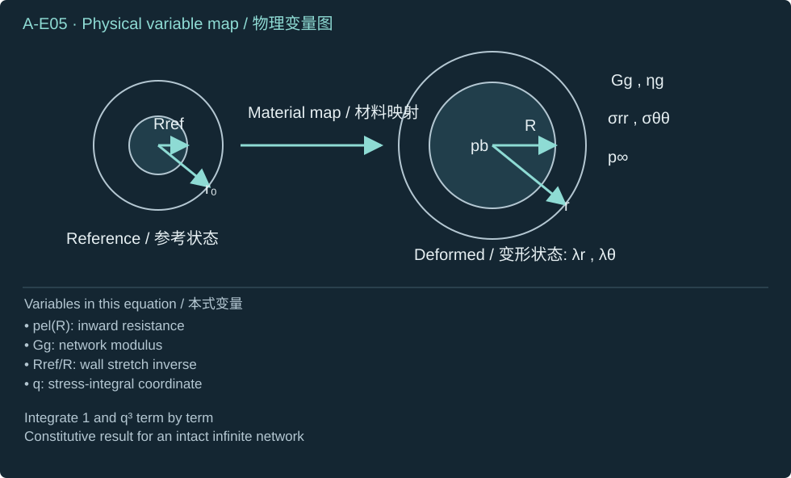

Elastic resistance follows from the full stretch field, not from a guessed constant pressure.

弹性阻力来自完整伸长场，而不是猜测的恒定压力。

Each row uses, in order, Eq. (A-E04), the antiderivative of $1+q^3$, upper-minus-lower endpoint evaluation, and scalar multiplication. The result matches the neo-Hookean elastic term reported in Gaudron et al., Eq. (2.18). The constitutive large-expansion limit is a plateau in pressure resistance, not a material fracture threshold. A fractured, finite, prestressed or strain-stiffening gel can depart from this result. [[R13]](../reference/sources.html#r13)

各行依次使用式（A-E04）、$1+q^3$ 的原函数、上端点减下端点，以及标量乘法。该结果与 Gaudron 等人式（2.18）报告的 neo-Hookean 弹性项一致。本构模型的大膨胀极限是压力阻力的平台值，不是材料断裂阈值。已破裂、有限尺寸、预应力或具有应变硬化的凝胶都可能偏离这一结果。[[R13]](../reference/sources.html#r13)

**Symbols before Eq. (A-E06).**

**式（A-E06）前的符号定义。**

| First individual definition / 第一项单独定义 | Second individual definition / 第二项单独定义 |
| --- | --- |
| $p_{\mathrm{el}}$ is pressure resistance (Pa) $p_{\mathrm{el}}$ 为压力阻力（Pa） | $G_g>0$ is shear modulus (Pa) $G_g>0$ 为剪切模量（Pa） |
| $R\geq R_{\mathrm{ref}}>0$ — Current cavity radius (m) $R\geq R_{\mathrm{ref}}>0$ — 当前腔体半径（m） | $R_{\mathrm{ref}}$ — Stress-free reference cavity radius (m) $R_{\mathrm{ref}}$ — 无应力参考腔体半径（m） |

**Conventions and conditions.** $d/dR$ is the radius derivative (giving Pa m⁻¹ here); $\lim$ takes the positive large-radius-ratio limit; $\infty$ denotes an unbounded ratio.

**约定与条件。** $d/dR$ 表示半径导数（此处单位为 Pa m⁻¹）；$\lim$ 取正的大半径比极限；$\infty$ 表示比值无界。

(A-E06) · Limiting-state and sign checks

$$
\begin{aligned}p_{\mathrm{el}}(R_{\mathrm{ref}})&=\frac{G_g}{2}(5-4-1)=0,\\\frac{dp_{\mathrm{el}}}{dR}&=2G_g\left(\frac{R_{\mathrm{ref}}}{R^2}+\frac{R_{\mathrm{ref}}^4}{R^5}\right)>0,\\\lim_{R/R_{\mathrm{ref}}\to\infty}p_{\mathrm{el}}(R)&=\frac52G_g.\end{aligned}
$$

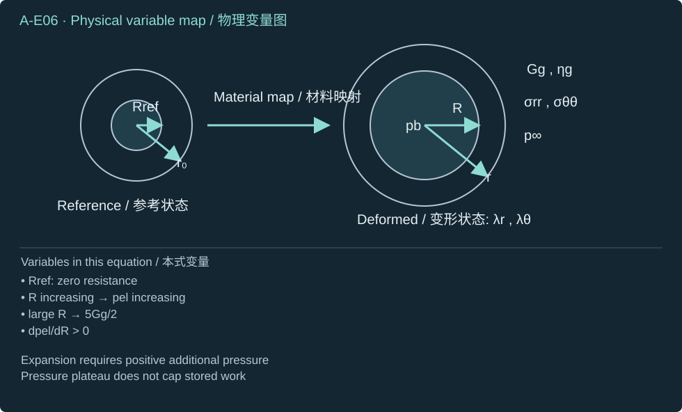

Zero deformation gives zero elastic resistance, and positive expansion raises it monotonically.

零变形给出零弹性阻力，正向膨胀使阻力单调增大。

## 3. Close the elastic work calculation

## 3. 完整计算弹性功

Step 5 — integrate work against cavity volume. Pressure is conjugate to volume change, not to radius change alone. Multiply by the spherical area, insert Eq. (A-E05), and integrate each power of the dummy radius. The last term uses the antiderivative $-1/\xi$ of $\xi^{-2}$; retain both endpoints so that the reference work is zero.

步骤 5——对腔体体积积分功。压力与体积变化共轭，而不是单独与半径变化共轭。乘以球面面积，代入式（A-E05），再逐项积分虚拟半径的各次幂。最后一项使用 $\xi^{-2}$ 的原函数 $-1/\xi$；保留两个端点，保证参考状态的功为零。

**Symbols before Eq. (A-E07).**

**式（A-E07）前的符号定义。**

| First individual definition / 第一项单独定义 | Second individual definition / 第二项单独定义 |
| --- | --- |
| $W_g$ is stored elastic work relative to the unstretched state (J) $W_g$ 为相对未伸长状态的储存弹性功（J） | $p_{\mathrm{el}}(\xi)$ is signed elastic resistance (Pa) $p_{\mathrm{el}}(\xi)$ 为带符号弹性阻力（Pa） |
| $G_g>0$ is modulus (Pa) $G_g>0$ 为模量（Pa） | $R\geq R_{\mathrm{ref}}>0$ — Current cavity radius (m) $R\geq R_{\mathrm{ref}}>0$ — 当前腔体半径（m） |
| $R_{\mathrm{ref}}$ — Stress-free reference cavity radius (m) $R_{\mathrm{ref}}$ — 无应力参考腔体半径（m） | $d\xi$ is its differential (m) $d\xi$ 为其微分（m） |
| $\pi$ is the circle constant (dimensionless) $\pi$ 为圆周率（无量纲） | $\xi$ — Dummy cavity-radius integration coordinate (m) $\xi$ — 空腔半径积分哑坐标（m） |

**Conventions and conditions.** $[\ ]_{R_{\mathrm{ref}}}^{R}$ denotes endpoint subtraction.

**约定与条件。** $[\ ]_{R_{\mathrm{ref}}}^{R}$ 表示端点相减。

(A-E07) · Exact work integral within the elastic model

$$
\begin{aligned}W_g(R)&=4\pi\int_{R_{\mathrm{ref}}}^{R}p_{\mathrm{el}}(\xi)\xi^2\,d\xi\\&=2\pi G_g\int_{R_{\mathrm{ref}}}^{R}\left(5\xi^2-4R_{\mathrm{ref}}\xi-R_{\mathrm{ref}}^4\xi^{-2}\right)d\xi\\&=2\pi G_g\left[\frac{5\xi^3}{3}-2R_{\mathrm{ref}}\xi^2+\frac{R_{\mathrm{ref}}^4}{\xi}\right]_{R_{\mathrm{ref}}}^{R}\\&=2\pi G_g\left[\frac{5R^3}{3}-2R_{\mathrm{ref}}R^2+\frac{R_{\mathrm{ref}}^4}{R}-\frac{2R_{\mathrm{ref}}^3}{3}\right].\end{aligned}
$$

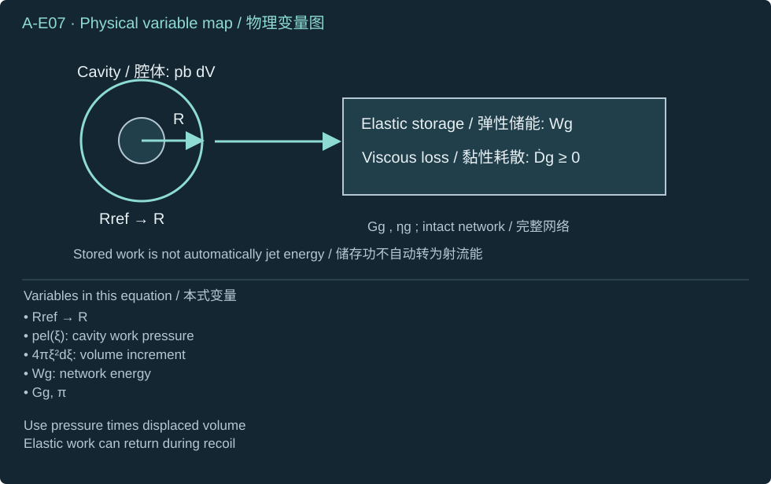

The area factor converts radius increments into cavity volume increments before integrating work.

先用面积因子将半径增量转化为腔体体积增量，再积分功。

In the final row the lower endpoint contributes $(5/3-2+1)R_{\mathrm{ref}}^3=2R_{\mathrm{ref}}^3/3$, which is subtracted. A pressure plateau therefore still allows work to grow approximately in proportion to cavity volume. The units are Pa m³ = J. Differentiating the closed form gives exactly pressure times area; this is a stronger check than comparing pressure magnitudes alone.

最后一行中，下端点贡献为 $(5/3-2+1)R_{\mathrm{ref}}^3=2R_{\mathrm{ref}}^3/3$，需将其减去。因此，即使压力出现平台，功仍可近似随腔体体积增长。单位为 Pa m³ = J。对闭式结果求导恰好得到压力乘面积；这个核查比单独比较压力大小更有力。

**Symbols before Eq. (A-E08).**

**式（A-E08）前的符号定义。**

| First individual definition / 第一项单独定义 | Second individual definition / 第二项单独定义 |
| --- | --- |
| $W_g$ is elastic work (J) $W_g$ 为弹性功（J） | $p_{\mathrm{el}}$ resistance (Pa) $p_{\mathrm{el}}$ 为阻力（Pa） |
| $G_g>0$ shear modulus (Pa) $G_g>0$ 为剪切模量（Pa） | $R$ — Current cavity radius (m) $R$ — 当前腔体半径（m） |
| $R_{\mathrm{ref}}>0$ — Stress-free reference cavity radius (m) $R_{\mathrm{ref}}>0$ — 无应力参考腔体半径（m） | $\delta R=R-R_{\mathrm{ref}}$ a small radius change (m), with $\|\delta R\|/R_{\mathrm{ref}}\ll1$ $\delta R=R-R_{\mathrm{ref}}$ 为小半径变化（m），满足 $\|\delta R\|/R_{\mathrm{ref}}\ll1$ |
| $\pi$ is dimensionless $\pi$ 为无量纲量 |  |

**Conventions and conditions.** $d/dR$ is differentiation in radius; $O$ denotes terms bounded by a constant times the indicated scale as that ratio tends to zero.

**约定与条件。** $d/dR$ 表示对半径求导；$O$ 表示当该比值趋于零时，被某常数乘所示尺度界定的项。

(A-E08) · Work-conjugacy and small-deformation checks

$$
\begin{aligned}\frac{dW_g}{dR}&=2\pi G_g\left(5R^2-4R_{\mathrm{ref}}R-\frac{R_{\mathrm{ref}}^4}{R^2}\right)=4\pi R^2p_{\mathrm{el}}(R),\\R=R_{\mathrm{ref}}+\delta R\colon\qquad p_{\mathrm{el}}&=\frac{4G_g\delta R}{R_{\mathrm{ref}}}+O\!\left(G_g\frac{\delta R^2}{R_{\mathrm{ref}}^2}\right),\\W_g&=8\pi G_gR_{\mathrm{ref}}\delta R^2+O(G_g\delta R^3).\end{aligned}
$$

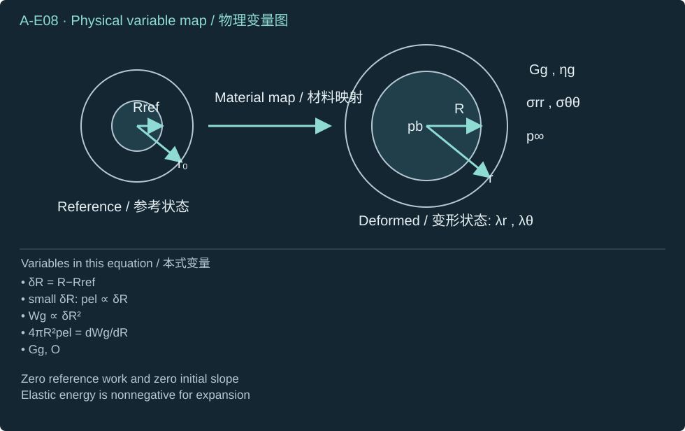

Near the reference cavity, pressure is linear in radius change and stored work is quadratic.

在参考腔体附近，压力与半径变化呈线性关系，储存功则呈二次关系。

The linear term follows by differentiating Eq. (A-E05) at the reference radius; integrate $4\pi R_{\mathrm{ref}}^2$ times that term to obtain the quadratic work. An independent volume-integral check sums the neo-Hookean strain-energy density throughout the reference material and reproduces Eq. (A-E07). Energy storage is reversible in this intact hyperelastic law. Returning that energy to useful jet motion is conditional on timing and geometry; it is not guaranteed, and stored work should not automatically be counted as irreversible heat loss.

线性项来自在参考半径处对式（A-E05）求导；将其乘以 $4\pi R_{\mathrm{ref}}^2$ 后积分，得到二次功项。独立的体积积分核查对参考材料中的 neo-Hookean 应变能密度求和，重现式（A-E07）。该完整超弹性规律中的能量储存可逆。能量能否返还给有效射流运动，取决于时序和几何，并不保证发生；储存功也不应自动计作不可逆热损失。

## 4. Add inertia and loss without double counting

## 4. 加入惯性与损耗，避免重复计算

Step 6 — choose a Kelvin–Voigt viscous contribution. Let the total stress add $2\eta_g\mathbf D$ to the elastic stress, where $\mathbf D$ is the symmetric velocity gradient. Incompressibility and no wall/material slip supply the radial speed field. Its radial gradient is negative during outward motion, while tangential extension is positive.

步骤 6——选择 Kelvin–Voigt 黏性贡献。令总应力在弹性应力上加入 $2\eta_g\mathbf D$，其中 $\mathbf D$ 为对称速度梯度。不可压缩性及壁面／材料无滑移给出径向速度场。向外运动时，其径向梯度为负，切向拉伸为正。

**Symbols before Eq. (A-E09).**

**式（A-E09）前的符号定义。**

| First individual definition / 第一项单独定义 | Second individual definition / 第二项单独定义 |
| --- | --- |
| $\mathbf T$ — Total Cauchy stress tensor (Pa) $\mathbf T$ — 总柯西应力张量（Pa） | $\mathbf T^e$ — Elastic Cauchy stress tensor, tension positive (Pa) $\mathbf T^e$ — 拉伸取正的弹性柯西应力张量（Pa） |
| $\eta_g\geq0$ is the chosen medium viscosity (Pa s) $\eta_g\geq0$ 为所选介质黏度（Pa s） | $\mathbf D$ — Material strain-rate tensor (s⁻¹) $\mathbf D$ — 物质应变率张量（s⁻¹） |
| $u_r$ is radial material speed (m s⁻¹) $u_r$ 为径向材料速度（m s⁻¹） | $r\geq R(t)>0$ is current position (m) $r\geq R(t)>0$ 为当前位置（m） |
| $R$ wall radius (m) $R$ 为壁面半径（m） | $t$ time (s) $t$ 为时间（s） |
| $\dot R$ wall speed (m s⁻¹) $\dot R$ 为泡壁速度（m s⁻¹） | $T_{rr}$ — Total radial Cauchy stress (Pa) $T_{rr}$ — 总径向柯西应力（Pa） |
| $T_{\theta\theta}$ — Total polar tangential Cauchy stress (Pa) $T_{\theta\theta}$ — 总极角切向柯西应力（Pa） | $T^e_{rr}$ — Radial elastic Cauchy stress (Pa) $T^e_{rr}$ — 径向弹性柯西应力（Pa） |
| $T^e_{\theta\theta}$ — Polar tangential elastic Cauchy stress (Pa) $T^e_{\theta\theta}$ — 极角切向弹性柯西应力（Pa） | $D_{rr}$ — Radial strain-rate component (s⁻¹) $D_{rr}$ — 径向应变率分量（s⁻¹） |
| $D_{\theta\theta}$ — Polar tangential strain-rate component (s⁻¹) $D_{\theta\theta}$ — 极角切向应变率分量（s⁻¹） | $D_{\phi\phi}$ — Azimuthal tangential strain-rate component (s⁻¹) $D_{\phi\phi}$ — 方位角切向应变率分量（s⁻¹） |

**Conventions and conditions.** $\partial/\partial r$ is the fixed-time spatial derivative.

**约定与条件。** $\partial/\partial r$ 为固定时刻的空间导数。

(A-E09) · Kelvin–Voigt closure and exact radial kinematics

$$
\begin{aligned}\mathbf T&=\mathbf T^e+2\eta_g\mathbf D,\qquad u_r(r,t)=\frac{R^2\dot R}{r^2},\\D_{rr}&=\frac{\partial u_r}{\partial r}=-\frac{2R^2\dot R}{r^3},\qquad D_{\theta\theta}=D_{\phi\phi}=\frac{u_r}{r}=\frac{R^2\dot R}{r^3},\\T_{\theta\theta}-T_{rr}&=T^e_{\theta\theta}-T^e_{rr}+\frac{6\eta_gR^2\dot R}{r^3}.\end{aligned}
$$

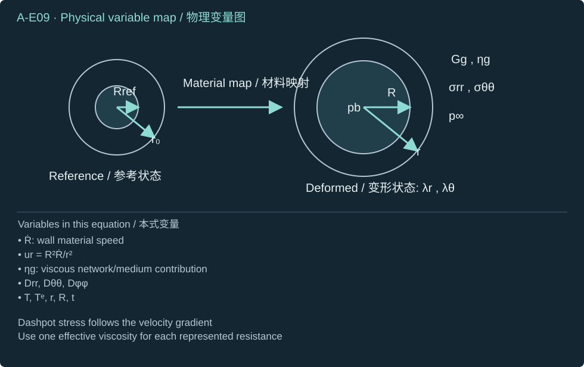

The viscous term derives from the surrounding-medium strain rate, not from bubble mass.

黏性项来自周围介质的应变率，而不是气泡质量。

Step 7 — integrate the radial momentum equation. The fixed-position time derivative and the convective derivative must both be retained. Substitution of Eq. (A-E09) leaves an integrable acceleration field. The total wall stress is $-p_b+2\sigma/R$, and total far-field stress is $-p_\infty$; integrate the stress difference instead of guessing its sign.

步骤 7——积分径向动量方程。必须同时保留固定位置的时间偏导和对流导数。代入式（A-E09）后得到可积的加速度场。总壁面应力为 $-p_b+2\sigma/R$，总远场应力为 $-p_\infty$；应积分应力差，而不是猜测其符号。

**Symbols before Eq. (A-E10).**

**式（A-E10）前的符号定义。**

| First individual definition / 第一项单独定义 | Second individual definition / 第二项单独定义 |
| --- | --- |
| $a_r$ is material radial acceleration (m s⁻²) $a_r$ 为材料径向加速度（m s⁻²） | $u_r$ radial speed (m s⁻¹) $u_r$ 为径向速度（m s⁻¹） |
| $r\geq R>0$ — Current material radial position outside the cavity (m) $r\geq R>0$ — 空腔外部的当前物质径向位置（m） | $t$ time (s) $t$ 为时间（s） |
| $\dot R$ — Cavity-wall radial velocity (m s⁻¹) $\dot R$ — 空腔壁面径向速度（m s⁻¹） | $\ddot R$ wall speed/acceleration (m s⁻¹, m s⁻²) $\ddot R$ 为泡壁速度／加速度（m s⁻¹、m s⁻²） |
| $\rho_g>0$ is density (kg m⁻³) $\rho_g>0$ 为密度（kg m⁻³） | $\eta_g\geq0$ viscosity (Pa s) $\eta_g\geq0$ 为黏度（Pa s） |
| $T_{rr}$ — Total radial Cauchy stress (Pa) $T_{rr}$ — 总径向柯西应力（Pa） | $T_{\theta\theta}$ — Total polar tangential Cauchy stress (Pa) $T_{\theta\theta}$ — 总极角切向柯西应力（Pa） |
| $R$ — Current cavity radius (m) $R$ — 当前腔体半径（m） |  |

**Conventions and conditions.** $\partial$ denotes fixed-other-coordinate derivatives and the integrals run through the exterior to infinity; Integrated acceleration times density has units Pa.

**约定与条件。** $\partial$ 表示保持其他坐标不变的偏导，积分经外部材料到无穷远；积分后的加速度乘以密度的单位为 Pa。

(A-E10) · Momentum law and explicitly evaluated integrals

$$
\begin{aligned}a_r&:=\frac{\partial u_r}{\partial t}+u_r\frac{\partial u_r}{\partial r}=\frac{2R\dot R^2+R^2\ddot R}{r^2}-\frac{2R^4\dot R^2}{r^5},\\\rho_g a_r&=\frac{\partial T_{rr}}{\partial r}+\frac{2}{r}(T_{rr}-T_{\theta\theta}),\\\rho_g\int_R^\infty a_r\,dr&=\rho_g\left[R\ddot R+2\dot R^2-\frac{\dot R^2}{2}\right]=\rho_g\left(R\ddot R+\frac32\dot R^2\right),\\2\int_R^\infty\frac{6\eta_gR^2\dot R}{r^4}\,dr&=12\eta_gR^2\dot R\left(\frac{1}{3R^3}\right)=\frac{4\eta_g\dot R}{R}.\end{aligned}
$$

Integrating the material acceleration and the viscous stress difference gives their distinct radial contributions.

对材料加速度与黏性应力差积分，得到各自不同的径向贡献。

**Symbols before Eq. (A-E11).**

**式（A-E11）前的符号定义。**

| First individual definition / 第一项单独定义 | Second individual definition / 第二项单独定义 |
| --- | --- |
| $\rho_g$ is effective medium density (kg m⁻³) $\rho_g$ 为有效介质密度（kg m⁻³） | $R>0$ is the cavity radius (m) $R>0$ 为腔体半径（m） |
| $\dot R$ — Cavity-wall radial velocity (m s⁻¹) $\dot R$ — 空腔壁面径向速度（m s⁻¹） | $\ddot R$ — Cavity-wall radial acceleration (m s⁻²) $\ddot R$ — 空腔壁面径向加速度（m s⁻²） |
| $p_b$ — Cavity pressure (Pa) $p_b$ — 空腔压力（Pa） | $p_\infty$ — Far-field pressure (Pa) $p_\infty$ — 远场压力（Pa） |
| $p_{\mathrm{el}}(R)$ — Signed elastic cavity-pressure resistance (Pa) $p_{\mathrm{el}}(R)$ — 带符号弹性空腔压力阻力（Pa） | $\sigma$ is tension (N m⁻¹) $\sigma$ 为张力（N m⁻¹） |
| $\eta_g$ is the represented medium viscosity (Pa s) $\eta_g$ 为所描述介质的黏度（Pa s） |  |

**Conventions and conditions.** Each term has units Pa.

**约定与条件。** 每一项的单位均为 Pa。

(A-E11) · Derived intact-medium radial control

$$
\rho_g\left(R\ddot R+\frac32\dot R^2\right)=p_b-p_\infty-\frac{2\sigma}{R}-p_{\mathrm{el}}(R)-\frac{4\eta_g\dot R}{R}.
$$

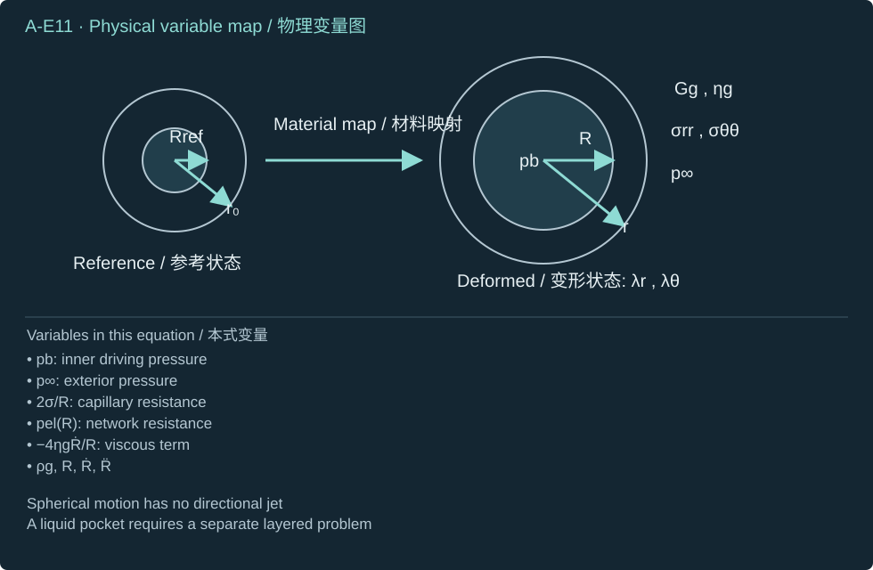

The spherical control quantifies cavity work and wall motion before any directional-flow calculation.

球形控制模型先量化腔体功与泡壁运动，再进行定向流动计算。

The stress derivative integrates to far-field minus wall stress; subtracting the two stress-difference integrals yields Eq. (A-E11). Setting $G_g=0$ recovers the corresponding liquid radial model. For expansion the viscous term is negative; during inward motion it is positive and opposes collapse. Do not add a separate solvent viscosity if the fitted $\eta_g$ already represents the same dissipation. A separate solvent/network model needs its own relative motion and constitutive partition. Phase transfer that gives appreciable material/wall velocity slip also changes the kinematic premise.

应力导数积分得到远场应力减去壁面应力；再减去两个应力差积分，便得到式（A-E11）。取 $G_g=0$ 可恢复相应的液体径向模型。膨胀时黏性项为负；向内运动时为正，抵抗塌缩。若拟合的 $\eta_g$ 已描述同一耗散，不应再另加溶剂黏度。独立的溶剂／网络模型需要各自的相对运动及本构分配。若相变传递造成明显的材料／壁面速度滑移，也会改变运动学前提。

Step 8 — multiply by the volume-change rate to check conservation. The medium kinetic energy follows the radial field, and the elastic work derivative was already checked. The viscous pressure has signed effects on acceleration but always removes mechanical energy because the dissipation contains the square of speed.

步骤 8——乘以体积变化率，核查能量守恒。介质动能由径向速度场确定，弹性功导数已完成核查。黏性压力对加速度的作用具有符号，但它总会移除机械能，因为耗散包含速度平方。

**Symbols before Eq. (A-E12).**

**式（A-E12）前的符号定义。**

| First individual definition / 第一项单独定义 | Second individual definition / 第二项单独定义 |
| --- | --- |
| $K_g$ — Surrounding-medium kinetic energy (J) $K_g$ — 周围介质动能（J） | $W_g$ — Stored network elastic work (J) $W_g$ — 储存的网络弹性功（J） |
| $E_\sigma$ — Interface energy (J) $E_\sigma$ — 界面能（J） | $\rho_g$ density (kg m⁻³) $\rho_g$ 为密度（kg m⁻³） |
| $R>0$ radius (m) $R>0$ 为半径（m） | $\dot R$ wall speed (m s⁻¹) $\dot R$ 为泡壁速度（m s⁻¹） |
| $\sigma$ tension (N m⁻¹) $\sigma$ 为张力（N m⁻¹） | $\dot V$ is cavity volume-change rate (m³ s⁻¹) $\dot V$ 为腔体体积变化率（m³ s⁻¹） |
| $p_b$ — Cavity pressure (Pa) $p_b$ — 空腔压力（Pa） | $p_\infty$ — Far-field pressure (Pa) $p_\infty$ — 远场压力（Pa） |
| $P_{\mathrm{dis}}$ nonnegative viscous power (W) $P_{\mathrm{dis}}$ 为非负黏性功率（W） | $\eta_g\geq0$ viscosity (Pa s) $\eta_g\geq0$ 为黏度（Pa s） |
| $t$ time (s) $t$ 为时间（s） | $\pi$ the circle constant (dimensionless) $\pi$ 为圆周率（无量纲） |

**Conventions and conditions.** $d/dt$ is the full time derivative.

**约定与条件。** $d/dt$ 为全时间导数。

(A-E12) · Derived mechanical energy balance

$$
\begin{aligned}K_g&=2\pi\rho_gR^3\dot R^2,\qquad E_\sigma=4\pi\sigma R^2,\qquad \dot V=4\pi R^2\dot R,\\\frac{d}{dt}(K_g+W_g+E_\sigma)&=(p_b-p_\infty)\dot V-P_{\mathrm{dis}},\\P_{\mathrm{dis}}&=16\pi\eta_gR\dot R^2\geq0.\end{aligned}
$$

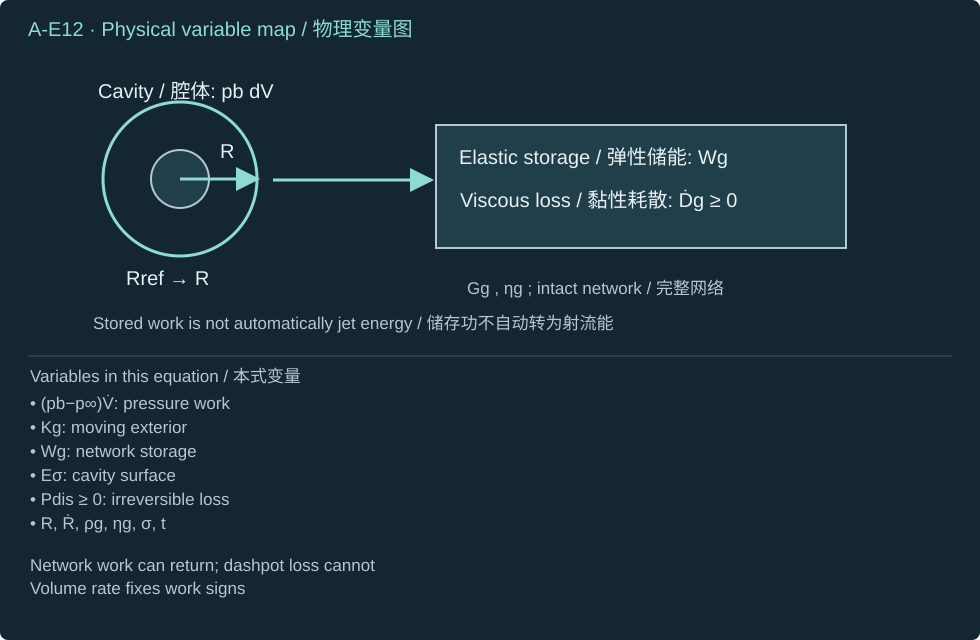

Pressure work divides into inertia, recoverable network energy, surface energy and viscous loss.

压力功分配到惯性、可恢复的网络能、表面能和黏性损耗。

## 5. Worked benchmark: pressure is not the work budget

## 5. 计算示例：压力并不等于功预算

All following numbers are declared teaching inputs, not measurements of a proposed PFC gel. Choose network shear modulus 20 kPa, stress-free radius 5 µm, current radius 30 µm and density 1000 kg m⁻³. First calculate the wall resistance and stored work. The sixfold wall stretch is large; assuming an intact neo-Hookean network there is an explicit hypothesis that needs material validation.

以下数值均为明确设定的教学输入，并非所提出 PFC 凝胶的实测值。取网络剪切模量 20 kPa、无应力半径 5 µm、当前半径 30 µm，以及密度 1000 kg m⁻³。先计算壁面阻力和储存功。壁面伸长六倍属于大变形；此时假设 neo-Hookean 网络保持完整，是需要材料验证的明确假设。

**Symbols before Eq. (A-E13).**

**式（A-E13）前的符号定义。**

| First individual definition / 第一项单独定义 | Second individual definition / 第二项单独定义 |
| --- | --- |
| $p_{\mathrm{el}}$ is elastic resistance (Pa) $p_{\mathrm{el}}$ 为弹性阻力（Pa） | $W_g$ is stored elastic work (J) $W_g$ 为储存弹性功（J） |
| $\pi$ is dimensionless $\pi$ 为无量纲量 | $G_g=20000$ — Substituted network shear modulus (Pa) $G_g=20000$ — 代入的网络剪切模量（Pa） |
| $R_{\mathrm{ref}}=5\times10^{-6}$ — Substituted reference cavity radius (m) $R_{\mathrm{ref}}=5\times10^{-6}$ — 代入的参考空腔半径（m） | $R=30\times10^{-6}$ — Substituted current cavity radius (m) $R=30\times10^{-6}$ — 代入的当前空腔半径（m） |

**Conventions and conditions.** The numbers 5 and 30 in radius ratios both use µm. Powers denote numerical exponents; Pa means pascal, J joule, and the cross denotes multiplication..

**约定与条件。** 半径比值中的数值 5 与 30 均采用 µm。幂表示数值指数；Pa 为帕斯卡，J 为焦耳，叉号表示乘法。。

(A-E13) · Teaching-input substitution

$$
\begin{aligned}p_{\mathrm{el}}&=\frac{20000}{2}\left[5-4\left(\frac5{30}\right)-\left(\frac5{30}\right)^4\right]=43325.6173\ \mathrm{Pa},\\W_g&=2\pi(20000)\left[\frac53(30\times10^{-6})^3-2(5\times10^{-6})(30\times10^{-6})^2\right.\\&\hspace{30mm}\left.+\frac{(5\times10^{-6})^4}{30\times10^{-6}}-\frac23(5\times10^{-6})^3\right]\\&=4.51603944\times10^{-9}\ \mathrm J.\end{aligned}
$$

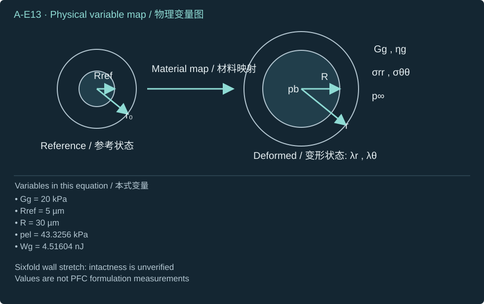

This soft network still stores several nanojoules when the cavity radius expands sixfold.

腔体半径膨胀六倍时，即使这个柔软网络也会储存数纳焦耳能量。

For comparison, prescribe a constant net pressure-work scale of 100 kPa over exactly the same displaced volume. This is a work scale, not a solved gas-pressure history. It gives 11.2574 nJ, of which the calculated network storage is 40.1163%. The remaining 6.74133 nJ is an upper residual for kinetic and surface increments plus losses in this artificial expansion ledger; it is not a predicted external jet energy. Initial surface energy cancels only after its increment is treated consistently.

作为比较，对完全相同的排开体积指定恒定净压力功尺度 100 kPa。这是功的尺度，而不是求解得到的气体压力历程。它给出 11.2574 nJ，其中计算出的网络储存占 40.1163%。余下 6.74133 nJ 是这个人为膨胀账本中，动能与表面能增量加损耗的剩余上限；它不是外部射流能量的预测值。只有一致地处理表面能增量后，初始表面能才能消去。

**Symbols before Eq. (A-E14).**

**式（A-E14）前的符号定义。**

| First individual definition / 第一项单独定义 | Second individual definition / 第二项单独定义 |
| --- | --- |
| $\Delta V$ is expanded cavity volume (m³) $\Delta V$ 为腔体膨胀体积（m³） | $R=30$ µm (m) $R=30$ µm（m） |
| $R_{\mathrm{ref}}=5$ — Stress-free reference cavity radius (m) $R_{\mathrm{ref}}=5$ — 无应力参考腔体半径（m） | $\Delta p_w=100000$ Pa is a constant illustrative net pressure-work input $\Delta p_w=100000$ Pa 为恒定的示例净压力功输入 |
| $W_{100}$ is the resulting work scale (J), with subscript 100 labeling its 100 kPa input $W_{100}$ 为由此得到的功尺度（J），下标 100 标记其 100 kPa 输入 | $W_g=4.51603944$ nJ is stored network work (J) $W_g=4.51603944$ nJ 为储存网络功（J） |
| $\pi$ is dimensionless $\pi$ 为无量纲量 |  |

**Conventions and conditions.** nJ means $10^{-9}$ J.

**约定与条件。** nJ 表示 $10^{-9}$ J。

(A-E14) · Finite work-budget comparison

$$
\begin{aligned}\Delta V&=\frac{4\pi}{3}(R^3-R_{\mathrm{ref}}^3)=1.12573737\times10^{-13}\ \mathrm{m^3},\\W_{100}&:=\Delta p_w\Delta V=11.2573737\ \mathrm{nJ},\\\frac{W_g}{W_{100}}&=0.401162791,\qquad W_{100}-W_g=6.74133424\ \mathrm{nJ}.\end{aligned}
$$

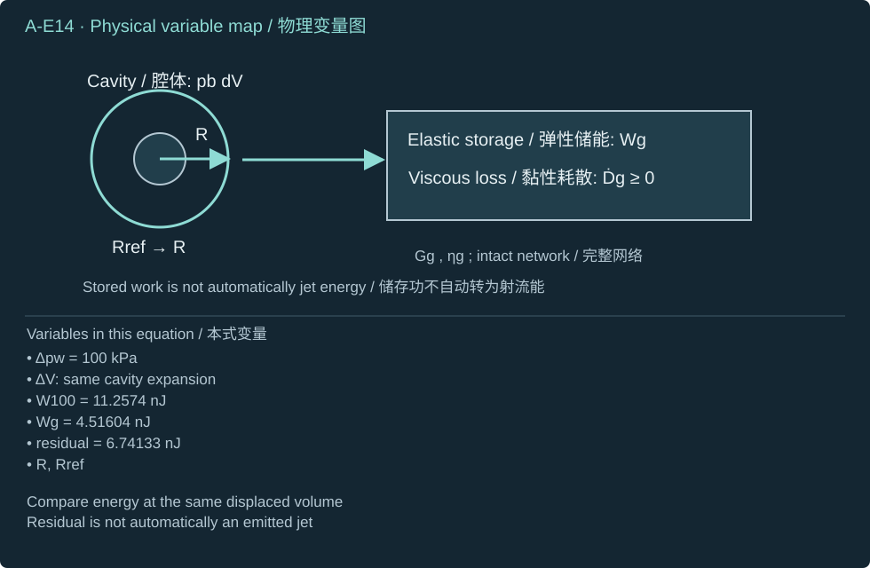

The elastic cost occupies a finite fraction of the work budget even though its pressure is below 100 kPa.

即使弹性压力低于 100 kPa，其能量代价也占据功预算的有限份额。

A separate sign calculation uses an illustrative viscosity 0.010 Pa s, current radius 30 µm and inward wall speed −10 m s⁻¹. Its signed right-hand-side pressure contribution is +13.3333 kPa, but its irreversible power remains +1.50796 mW. A positive resistance during collapse is not energy generation. These instantaneous values require a time history before integrating total dissipation.

另一个符号计算采用示例黏度 0.010 Pa s、当前半径 30 µm，以及向内泡壁速度 −10 m s⁻¹。其方程右侧带符号压力贡献为 +13.3333 kPa，但不可逆功率仍为 +1.50796 mW。塌缩时阻力为正不代表产生能量。这些瞬时值需要结合时间历程，才能积分总耗散。

**Symbols before Eq. (A-E15).**

**式（A-E15）前的符号定义。**

| First individual definition / 第一项单独定义 | Second individual definition / 第二项单独定义 |
| --- | --- |
| $p_{\mathrm{visc,RHS}}$ is the signed viscous pressure term on the radial equation's right-hand side (Pa) $p_{\mathrm{visc,RHS}}$ 为径向方程右侧的带符号黏性压力项（Pa） | $P_{\mathrm{dis}}$ is dissipated power (W) $P_{\mathrm{dis}}$ 为耗散功率（W） |
| $\eta_g=0.010$ Pa s is illustrative viscosity $\eta_g=0.010$ Pa s 为示例黏度 | $R=30\times10^{-6}$ m radius $R=30\times10^{-6}$ m 为半径 |
| $\dot R=-10$ m s⁻¹ wall speed $\dot R=-10$ m s⁻¹ 为泡壁速度 | $\pi$ the circle constant (dimensionless) $\pi$ 为圆周率（无量纲） |

**Conventions and conditions.** RHS labels that side; The number 100 is the squared speed in m² s⁻².

**约定与条件。** RHS 标记右侧；数值 100 为以 m² s⁻² 表示的速度平方。

(A-E15) · Signed-pressure and positive-loss check

$$
\begin{aligned}p_{\mathrm{visc,RHS}}&=-\frac{4\eta_g\dot R}{R}=-\frac{4(0.010)(-10)}{30\times10^{-6}}=13333.3333\ \mathrm{Pa},\\P_{\mathrm{dis}}&=16\pi\eta_gR\dot R^2=16\pi(0.010)(30\times10^{-6})(100)=1.50796447\times10^{-3}\ \mathrm W.\end{aligned}
$$

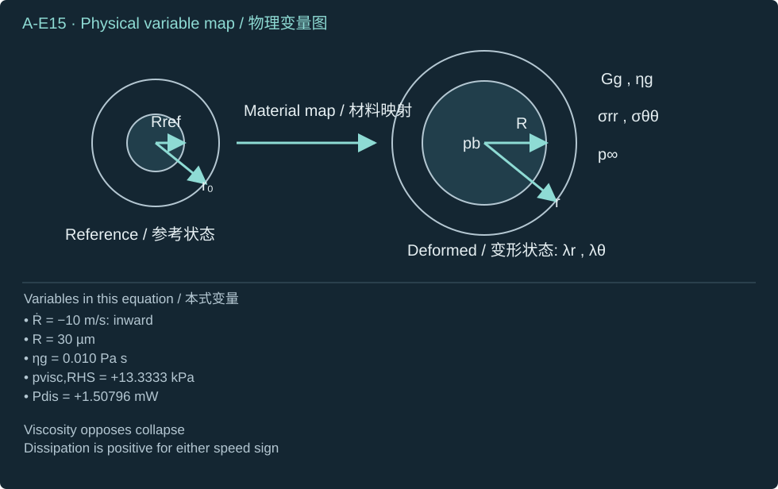

Inward motion changes the pressure sign but leaves dissipated power positive.

向内运动改变压力项符号，但耗散功率仍为正。

## 6. Use event times, not a separate vibration curriculum

## 6. 使用事件时间尺度，不另设振荡课程

Step 9 — compare network memory to event duration. The Deborah number uses an independently identified stress-relaxation time. A large value means stress memory persists during the event; it does not mean an infinitely stiff wall. A small value allows relaxation but does not remove geometric confinement or prove rapid solvent drainage. A relaxation spectrum may require several times rather than one.

步骤 9——比较网络记忆与事件持续时间。Deborah 数使用独立确定的应力松弛时间。数值大表示应力记忆在事件期间持续存在，并不表示壁面无限刚硬。数值小允许发生松弛，但不会消除几何约束，也不能证明溶剂迅速排出。若存在松弛谱，可能需要多个时间而不是一个。

**Symbols before Eq. (A-E16).**

**式（A-E16）前的符号定义。**

| First individual definition / 第一项单独定义 | Second individual definition / 第二项单独定义 |
| --- | --- |
| $\mathrm{De}$ is the dimensionless event Deborah number $\mathrm{De}$ 为无量纲事件 Deborah 数 | $\tau_{\mathrm{rel}}>0$ is an independently identified network stress-relaxation time (s) $\tau_{\mathrm{rel}}>0$ 为独立确定的网络应力松弛时间（s） |
| $\tau_e>0$ is the specified cavity/jet event duration (s) $\tau_e>0$ 为指定的腔体／射流事件持续时间（s） |  |

**Conventions and conditions.** Subscripts rel and e label relaxation and event respectively.

**约定与条件。** 下标 rel、e 分别表示松弛与事件。

(A-E16) · Response-time definition

$$
\mathrm{De}:=\frac{\tau_{\mathrm{rel}}}{\tau_e}.
$$

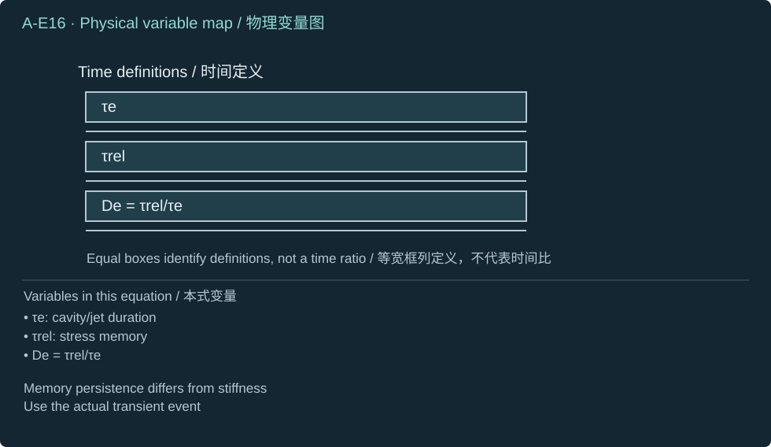

The event duration determines which part of the network response can act before the jet or load arrives.

事件持续时间决定网络响应的哪一部分能在射流或载荷到达前发挥作用。

Do not silently call $\eta_g/G_g$ a Kelvin–Voigt stress-relaxation time. In the linear shear version, held strain gives constant elastic stress after the rate term vanishes. Releasing the imposed stress instead gives exponential strain recovery with a retardation time. This distinction prevents fitting an invented relaxation mechanism to the spherical dashpot model.

不要默默把 $\eta_g/G_g$ 称作 Kelvin–Voigt 应力松弛时间。在其线性剪切版本中，保持应变不变时，速率项消失后弹性应力保持恒定。若解除外加应力，才会产生指数式应变恢复，其时间为迟滞时间。这一区分可避免给球形黏壶模型拟合一个凭空假设的松弛机制。

**Symbols before Eq. (A-E17).**

**式（A-E17）前的符号定义。**

| First individual definition / 第一项单独定义 | Second individual definition / 第二项单独定义 |
| --- | --- |
| $T_{\mathrm{sh}}$ is shear stress (Pa) $T_{\mathrm{sh}}$ 为剪切应力（Pa） | $\gamma$ is dimensionless small shear strain $\gamma$ 为无量纲小剪切应变 |
| $\dot\gamma$ its rate (s⁻¹) $\dot\gamma$ 为其速率（s⁻¹） | $G_g>0$ shear modulus (Pa) $G_g>0$ 为剪切模量（Pa） |
| $\eta_g>0$ viscosity (Pa s) $\eta_g>0$ 为黏度（Pa s） | $t\geq0$ is time after release (s) $t\geq0$ 为卸载后的时间（s） |
| $\gamma_0$ initial strain (dimensionless) $\gamma_0$ 为初始应变（无量纲） | $\tau_{\mathrm{KV}}$ the Kelvin–Voigt zero-stress recovery/retardation time (s), and $\exp$ the exponential of a dimensionless argument $\tau_{\mathrm{KV}}$ 为 Kelvin–Voigt 零应力恢复／迟滞时间（s），$\exp$ 表示对无量纲参数取指数 |

**Conventions and conditions.** sh and KV are labels, not multiplication.

**约定与条件。** sh 与 KV 是标签，不是乘法。

(A-E17) · Linear constitutive check for the chosen dashpot

$$
\begin{aligned}T_{\mathrm{sh}}&=G_g\gamma+\eta_g\dot\gamma,\\T_{\mathrm{sh}}=0:\quad\dot\gamma&=-\frac{G_g}{\eta_g}\gamma,\qquad\gamma(t)=\gamma_0\exp(-t/\tau_{\mathrm{KV}}),\qquad\tau_{\mathrm{KV}}:=\frac{\eta_g}{G_g}.\end{aligned}
$$

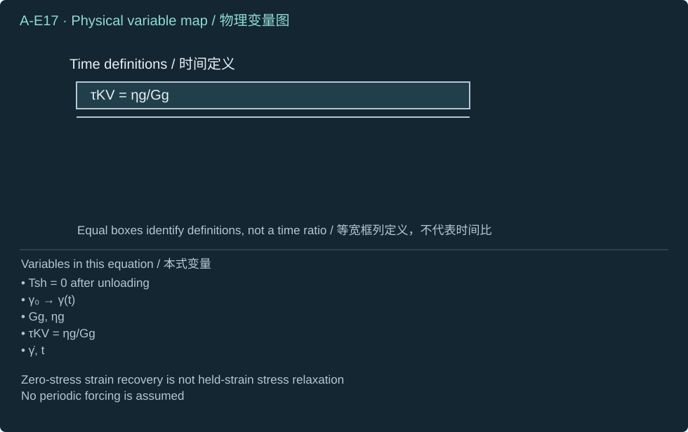

Kelvin–Voigt strain recovery illustrates what its parameter ratio means and what it does not mean.

Kelvin–Voigt 应变恢复说明其参数比值的意义及不能代表的意义。

Step 10 — test spatial communication. A small-strain shear speed estimate concerns network/shear deformation over a stated length. The ideal liquid-collapse reference concerns radial liquid inertia over a stated maximum radius. Use the same 30 µm comparison length but keep the two physical models distinct. The resulting ratio is 2.44464: global support shear equilibration is not automatically rapid on that liquid-collapse timescale. This is a flag for nonradial support motion, not a proof that the derived spherical model has omitted all inertia.

步骤 10——检验空间传播。小应变剪切波速估计涉及指定长度上的网络／剪切变形；理想液体塌缩参考则涉及指定最大半径上的液体径向惯性。比较时采用相同的 30 µm 长度，但保持两个物理模型的区别。所得比值为 2.44464：整个支撑体的剪切平衡并不自动比该液体塌缩过程快。这提示需关注非径向支撑运动，而不是证明所推导球形模型完全忽略了惯性。

**Symbols before Eq. (A-E18).**

**式（A-E18）前的符号定义。**

| First individual definition / 第一项单独定义 | Second individual definition / 第二项单独定义 |
| --- | --- |
| $c_s$ is a small-strain shear speed estimate (m s⁻¹) $c_s$ 为小应变剪切波速估计（m s⁻¹） | $G_g=20000$ Pa modulus $G_g=20000$ Pa 为模量 |
| $\rho_g=1000$ kg m⁻³ medium density $\rho_g=1000$ kg m⁻³ 为介质密度 | $L_g=30$ µm comparison length $L_g=30$ µm 为比较长度 |
| $t_s$ its shear crossing time (s) $t_s$ 为该长度上的剪切传播时间（s） | $t_{c,\mathrm{liq}}$ is ideal empty-liquid-cavity collapse time (s) $t_{c,\mathrm{liq}}$ 为理想空液体腔的塌缩时间（s） |
| $R_{\max}=30$ µm maximum radius $R_{\max}=30$ µm 为最大半径 | $\rho_l=1000$ kg m⁻³ liquid density $\rho_l=1000$ kg m⁻³ 为液体密度 |
| $\Delta p_c=100000$ Pa collapse pressure gap $\Delta p_c=100000$ Pa 为塌缩压力差 |  |

**Conventions and conditions.** The coefficient is the Rayleigh integral; liq labels the liquid control, $\simeq$ is an estimate, and µs means $10^{-6}$ s.

**约定与条件。** 系数来自 Rayleigh 积分；liq 标记液体控制模型，$\simeq$ 表示估计，µs 表示 $10^{-6}$ s。

(A-E18) · Teaching response-time comparison

$$
\begin{aligned}c_s&\simeq\sqrt{G_g/\rho_g}=4.47213595\ \mathrm{m\,s^{-1}},\qquad t_s:=L_g/c_s=6.70820393\ \mathrm{\mu s},\\t_{c,\mathrm{liq}}&=0.9146813565\,R_{\max}\sqrt{\rho_l/\Delta p_c}=2.74404407\ \mathrm{\mu s},\qquad\frac{t_s}{t_{c,\mathrm{liq}}}=2.44464147.\end{aligned}
$$

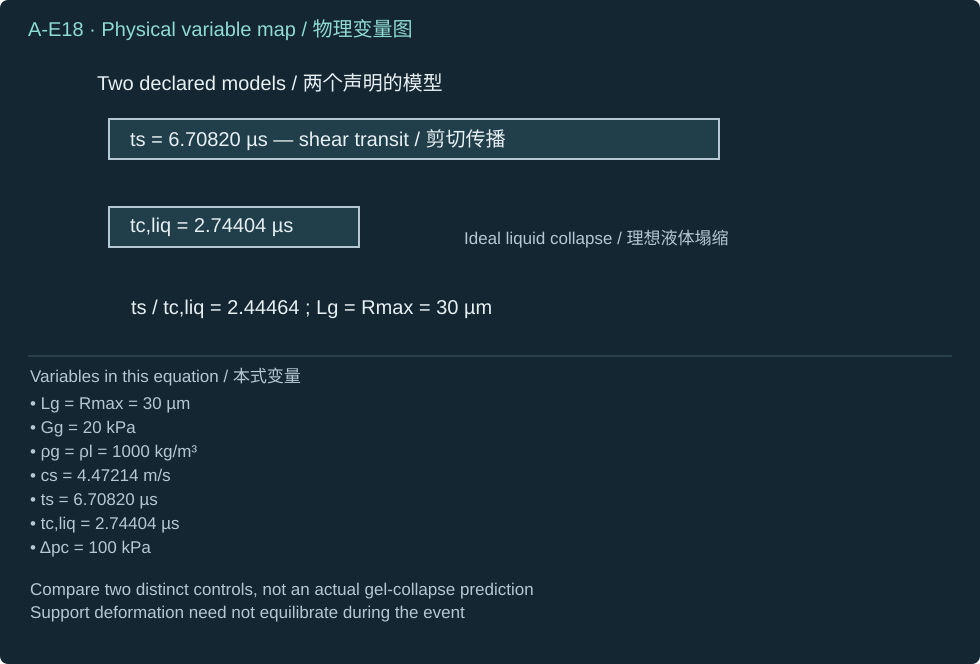

The gel communication estimate exceeds the ideal liquid-collapse reference for the declared inputs.

对已声明输入，凝胶传播时间估计大于理想液体塌缩参考时间。

Low shear modulus does not imply low rapid-compression resistance. In a small-strain compressible extension, longitudinal motion also samples the bulk modulus. Compressibility must be restored when acoustic travel or high wall speed becomes central. The incompressible spherical control takes that longitudinal propagation idealization to its limit; it cannot predict shock peaks or finite arrival times by itself.

低剪切模量不意味着快速压缩阻力小。在小应变可压缩扩展中，纵向运动还涉及体积模量。当声传播时间或较高泡壁速度变得关键时，必须恢复可压缩性。不可压缩球形控制模型采用了纵向传播的极限理想化；它自身不能预测冲击波峰值或有限传播到达时间。

**Symbols before Eq. (A-E19).**

**式（A-E19）前的符号定义。**

| First individual definition / 第一项单独定义 | Second individual definition / 第二项单独定义 |
| --- | --- |
| $c_L$ is longitudinal wave speed estimate (m s⁻¹) in a separate small-strain compressible extension $c_L$ 为独立小应变可压缩扩展中的纵波波速估计（m s⁻¹） | $K_g^{\mathrm{bulk}}>0$ is bulk modulus (Pa), distinctly labeled from kinetic energy $K_g$ $K_g^{\mathrm{bulk}}>0$ 为体积模量（Pa），其明确标签使之区别于动能 $K_g$ |
| $G_g$ shear modulus (Pa) $G_g$ 为剪切模量（Pa） | $\rho_g$ density (kg m⁻³) $\rho_g$ 为密度（kg m⁻³） |
| $L_g$ length (m) $L_g$ 为长度（m） | $t_L$ longitudinal crossing time (s) $t_L$ 为纵波传播时间（s） |
| $M_w$ dimensionless wall Mach number $M_w$ 为无量纲泡壁 Mach 数 | $\dot R$ wall speed (m s⁻¹) $\dot R$ 为泡壁速度（m s⁻¹） |
| $K_g$ — Surrounding-medium kinetic energy (J) $K_g$ — 周围介质动能（J） |  |

**Conventions and conditions.** $|\ |$ takes absolute value; $\simeq$ denotes an estimate.

**约定与条件。** $|\ |$ 表示绝对值；$\simeq$ 表示估计。

(A-E19) · Separate compressibility diagnostic

$$
c_L\simeq\sqrt{\frac{K_g^{\mathrm{bulk}}+4G_g/3}{\rho_g}},\qquad t_L:=\frac{L_g}{c_L},\qquad M_w:=\frac{|\dot R|}{c_L}.
$$

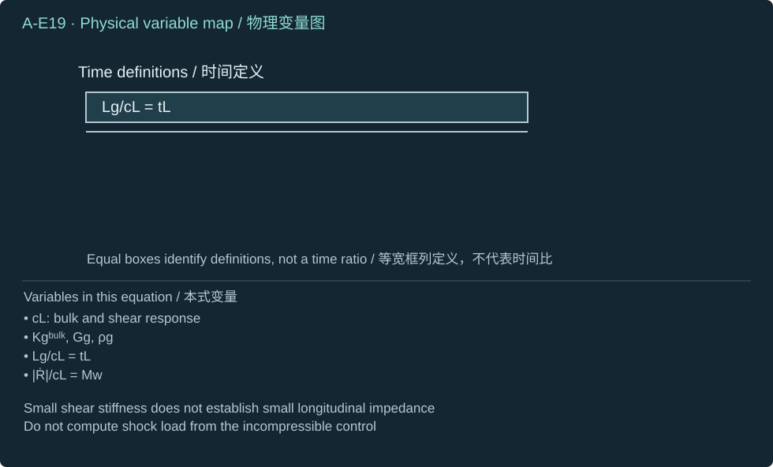

Shear and longitudinal propagation test different aspects of a water-rich gel's transient response.

剪切与纵向传播检验富水凝胶瞬态响应的不同方面。

Step 11 — derive the drainage estimate from a separate two-phase approximation. For small perturbations in a uniform gel, adopt Darcy relative solvent flux and a constant storage modulus. Solvent conservation then produces a diffusion equation. This does not extend the large-strain intact-cavity law automatically to porous flow near the vapor interface.

步骤 11——从独立的两相近似推导排水估计。对均匀凝胶中的小扰动，采用 Darcy 相对溶剂通量和恒定储存模量。溶剂守恒随后给出扩散方程。这并不会自动将大应变完整腔体规律扩展到蒸气界面附近的多孔流动。

**Symbols before Eq. (A-E20).**

**式（A-E20）前的符号定义。**

| First individual definition / 第一项单独定义 | Second individual definition / 第二项单独定义 |
| --- | --- |
| $\mathbf j_l$ is relative solvent volume flux (m s⁻¹) $\mathbf j_l$ 为相对溶剂体积通量（m s⁻¹） | $k_{\mathrm{perm}}>0$ permeability (m²) $k_{\mathrm{perm}}>0$ 为渗透率（m²） |
| $\mu_l>0$ solvent viscosity (Pa s) $\mu_l>0$ 为溶剂黏度（Pa s） | $p_{\mathrm{pore}}$ incremental pore pressure (Pa) $p_{\mathrm{pore}}$ 为增量孔隙压力（Pa） |
| $M_d>0$ storage/constrained drained modulus adopted for this scalar approximation (Pa) $M_d>0$ 为该标量近似采用的储存／受约束排水模量（Pa） | $t$ time (s) $t$ 为时间（s） |
| $D_{\mathrm{poro}}$ diffusion coefficient (m² s⁻¹) $D_{\mathrm{poro}}$ 为扩散系数（m² s⁻¹） | $L_g$ drainage length (m) $L_g$ 为排水长度（m） |
| $t_{\mathrm{poro}}$ drainage time estimate (s) $t_{\mathrm{poro}}$ 为排水时间估计（s） |  |

**Conventions and conditions.** $\nabla$, $\nabla\cdot$, $\nabla^2$ are gradient, divergence and Laplacian in space; the dot here is the vector divergence operator, not an equation separator; $\sim$ means scaling estimate.

**约定与条件。** $\nabla$、$\nabla\cdot$、$\nabla^2$ 为空间梯度、散度和 Laplace 算子；此处点号属于向量散度算子，不是方程分隔符；$\sim$ 表示尺度估计。

(A-E20) · Darcy/storage approximation and derived diffusion

$$
\begin{aligned}\mathbf j_l&=-\frac{k_{\mathrm{perm}}}{\mu_l}\nabla p_{\mathrm{pore}},\qquad\frac{1}{M_d}\frac{\partial p_{\mathrm{pore}}}{\partial t}+\nabla\cdot\mathbf j_l=0,\\\frac{\partial p_{\mathrm{pore}}}{\partial t}&=D_{\mathrm{poro}}\nabla^2p_{\mathrm{pore}},\qquad D_{\mathrm{poro}}:=\frac{k_{\mathrm{perm}}M_d}{\mu_l},\\t_{\mathrm{poro}}&\sim\frac{L_g^2}{D_{\mathrm{poro}}}=\frac{\mu_lL_g^2}{k_{\mathrm{perm}}M_d}.\end{aligned}
$$

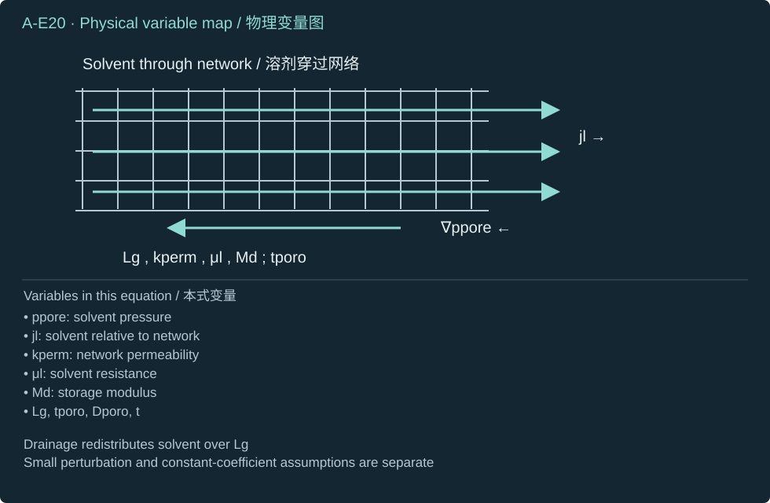

Pressure gradients drive solvent through the network, producing a length-dependent drainage time.

压力梯度驱动溶剂通过网络，产生依赖长度的排水时间。

Substitute the first row's Darcy flux into conservation to obtain the second row; constant coefficients allow them outside the derivatives. Balance a time derivative against a spatial second derivative over $L_g$ for the third row. This scaling agrees with primary poroelastic gel measurements; the actual permeability and storage modulus still need characterization. For a deliberately illustrative permeability $10^{-17}$ m², modulus 60 kPa, solvent viscosity 0.001 Pa s and length 30 µm, the estimate is 1.5 s. A 3 µs event is then approximately undrained at that length, not proof that no local solvent movement occurs. [Primary drainage study](https://pubs.rsc.org/en/content/articlehtml/2021/sm/d0sm02243h).

将第一行的 Darcy 通量代入守恒式即可得到第二行；常系数可移到导数外。用 $L_g$ 尺度上的空间二阶导数与时间导数平衡，得到第三行。该尺度关系与原始研究中的凝胶孔弹性测量一致；实际渗透率与储存模量仍需表征。若明确采用示例渗透率 $10^{-17}$ m²、模量 60 kPa、溶剂黏度 0.001 Pa s、长度 30 µm，估计时间为 1.5 s。此时 3 µs 事件在该长度上近似不排水，但这不证明完全不存在局部溶剂运动。[原始排水研究](https://pubs.rsc.org/en/content/articlehtml/2021/sm/d0sm02243h)。

## 7. Test mechanisms and compare complete operating windows

## 7. 检验机制，并比较完整工作窗口

The hypothesis that compliant confinement stabilizes a PFC-driven jet remains unresolved. Elastic-boundary experiments by Brujan and colleagues show that deformation and recoil can accompany jets in either direction and ejection of boundary material; their reported maximum liquid-jet speed was 960 m s⁻¹ in a particular laser-bubble/gel geometry. That observation defeats a universal stabilization claim and is not a performance limit or calibration for PFC transfer. [[R12]](../reference/sources.html#r12)

柔顺约束能够稳定 PFC 驱动射流这一假设仍未解决。Brujan 等人的弹性边界实验表明，变形与回弹可伴随向两个方向的射流，以及边界材料喷出；他们在特定激光气泡／凝胶几何中报告的最高液体射流速度为 960 m s⁻¹。该观察否定普适的稳定化主张，却不是 PFC 转印的性能极限或标定。[[R12]](../reference/sources.html#r12)

Keep all four architectures available for experiments. In a liquid pocket, resolve liquid momentum, moving-wall traction and outlet shape together. In bulk embedding, successful vaporization is only the source step: identify the route through which a finite carrier-liquid mass exits, or show that the actuator works by solid deformation instead. In a sealed cavity, use pressure–layer-motion–fracture coupling directly. For the film/PVC concept, retain both direct liquid/film loading and loading transmitted through an intact PVC layer. The intended release interface and payload stress must be identified in either route.

保留全部四种结构方案供实验使用。在液腔中，需要联合解析液体动量、运动壁面牵引与出口形状。对体相嵌入，成功汽化只是源环节：应明确有限载液质量离开的路径，或证明致动器其实通过固体变形工作。对密封腔体，直接采用压力—层运动—断裂耦合。对薄膜／PVC 概念，保留液体直接加载薄膜，以及载荷经完整 PVC 层传递这两条路径。两条路径都必须确定目标释放界面及被转印对象的应力。

| Control or observation 控制或观测 | What it discriminates 可区分的机制 |
| --- | --- |
| Match PFC inventory, distribution, shell survival, absorber position, initial temperature and measured absorbed energy. 匹配 PFC 物质量、分布、壳层存活、吸收体位置、初始温度及实测吸收能量。 | Separates optical/activation changes from mechanical support changes; equal incident energy alone does not do this. 将光学／激活变化与力学支撑变化区分开；仅使入射能量相等做不到这一点。 |
| Synchronize cavity contour, gel/film motion, emitted liquid composition, finite jet mass, speed, angle and arrival. 同步记录腔体轮廓、凝胶／薄膜运动、喷出液体成分、有限射流质量、速度、角度及到达时间。 | Distinguishes a liquid jet, a recoil-driven second jet, solid fragments and a membrane/blister actuator. 区分液体射流、回弹驱动的第二股射流、固体碎片及膜片／鼓泡致动器。 |
| Specify pressure location, area, bandwidth and time window; record displacement and crack progression. 明确压力位置、面积、带宽及时间窗口；记录位移和裂纹进展。 | Connects fluid output to interface work and selective release rather than an isolated peak. 将流体输出连接到界面功和选择性释放，而不是孤立峰值。 |
| Across independent events, compare angular spread, mass/speed variation, breakup, release success, damage and placement error. 在独立事件间比较角度分散、质量／速度变异、破碎、释放成功率、损伤及定位误差。 | Tests repeatability at a useful delivered load; a lower speed variation with insufficient release is not an improved process. 在有用的实际传递载荷下检验重复性；若载荷不足以释放，仅速度变异降低不代表工艺改善。 |
| Measure cooling, retained vapor, swelling, residue, network damage and reset before repeated pulses. 重复脉冲前测量冷却、滞留蒸气、溶胀、残留物、网络损伤及复位。 | Tests whether positional benefits survive reuse and whether activation/geometry drift accumulates. 检验定位优势能否在复用中持续，以及激活／几何漂移是否累积。 |

Report two different outcomes separately: the largest verified single-event pressure or finite-mass jet speed under stated conditions, and the repeatable intact-transfer window. A favorable gel may trade peak speed for controlled peeling and lower placement scatter, or may improve alignment while reducing useful impulse. Neither trade is decidable from the radial resistance formula. The unresolved inputs are event-rate material laws, actual inclusion/reference geometry, damage and phase kinetics, outlet evolution, and the measured release/landing interface laws.

分别报告两个不同结果：指定条件下经验证的最大单次压力或有限质量射流速度，以及可重复的完整转印窗口。有利的凝胶可能以降低峰值速度换取可控剥离和较小定位离散，也可能改善对准却降低有效冲量。这两类取舍都不能由径向阻力公式决定。尚未解决的输入包括事件速率下的材料规律、实际夹杂／参考几何、损伤及相变动力学、出口演化，以及实测释放／落点界面规律。

## 8. Three defense questions: explain the chain in your own words

## 8. 三道答辩题：用自己的话解释物理链条

### Why are an open pocket, bulk-embedded PFC and a sealed hydrogel stamp different actuators?

### 为什么开放液腔、体相嵌入 PFC 和密封水凝胶印章是不同致动器？

Explain this in your own words. Use assumptions, a physical argument, and a limitation; equation memorization is not required.

请用自己的话解释，说明假设、物理推理及适用限制；不要求背诵公式。

\*\*Reference answer and mastery criteria / 参考答案与掌握标准\*\*

**Symbols before Eq. (A-E21).**

**式（A-E21）前的符号定义。**

| First individual definition / 第一项单独定义 | Second individual definition / 第二项单独定义 |
| --- | --- |
| $\rho_g$ is effective exterior density (kg m⁻³) $\rho_g$ 为外部有效密度（kg m⁻³） | $R>0$ cavity radius (m) $R>0$ 为腔体半径（m） |
| $\dot R$ — Cavity-wall radial velocity (m s⁻¹) $\dot R$ — 空腔壁面径向速度（m s⁻¹） | $\ddot R$ — Cavity-wall radial acceleration (m s⁻²) $\ddot R$ — 空腔壁面径向加速度（m s⁻²） |
| $p_b$ — Cavity pressure (Pa) $p_b$ — 空腔压力（Pa） | $p_\infty$ — Far-field pressure (Pa) $p_\infty$ — 远场压力（Pa） |
| $p_{\mathrm{el}}$ — Signed elastic cavity resistance (Pa) $p_{\mathrm{el}}$ — 带符号弹性腔体阻力（Pa） | $\sigma$ tension (N m⁻¹) $\sigma$ 为张力（N m⁻¹） |
| $\eta_g$ represented medium viscosity (Pa s) $\eta_g$ 为所描述介质的黏度（Pa s） |  |

**Conventions and conditions.** This quoted original formula has the intact spherical, no-slip assumptions of Eq; (A-E11).

**约定与条件。** 这一引用的原始公式采用式（A-E11）的完整球形、无滑移假设。

(A-E21) · Original radial control recalled

$$
\rho_g\left(R\ddot R+\frac32\dot R^2\right)=p_b-p_\infty-\frac{2\sigma}{R}-p_{\mathrm{el}}(R)-\frac{4\eta_g\dot R}{R}.
$$

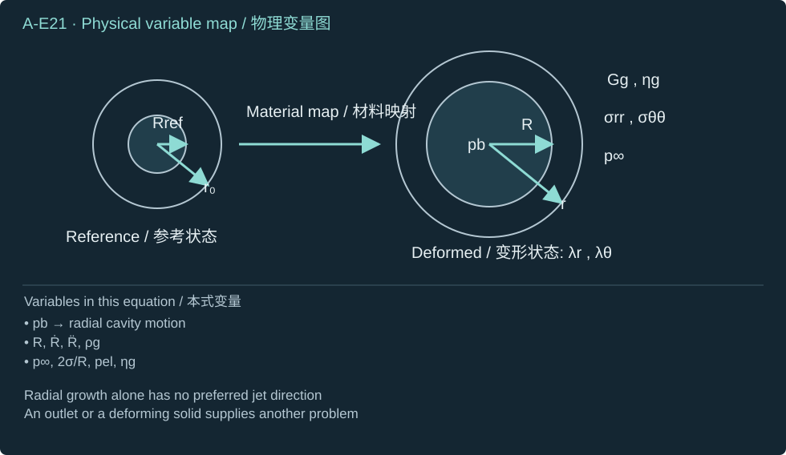

A radial model describes expansion and resistance; it does not manufacture an outlet.

径向模型描述膨胀及阻力，不会凭空产生出口。

A defensible explanation begins with where matter can move. A liquid site or open gel-supported pocket can emit carrier liquid through a meniscus/outlet if asymmetric pressure-driven flow develops. A buried inclusion can expand a cavity yet produce no external liquid jet; network rupture or a channel is an additional mechanism with contamination and damage consequences. A sealed composite cavity can instead bend a cover and drive an interfacial crack without any liquid jet leaving the stamp. The hydrogel paper demonstrates this pressure–deformation–release mechanism, not all four architectures.

可成立的解释应从材料能向哪里运动开始。液体位点或开放的凝胶支撑液腔，如果形成非对称的压力驱动流动，就可以通过液面／出口喷出载液。埋入的夹杂可以使腔体膨胀，却不产生外部液体射流；网络破裂或通道属于额外机制，会带来污染与损伤后果。密封复合腔体则可使覆盖层弯曲并驱动界面裂纹，而无需任何液体射流离开印章。水凝胶论文展示的是这种压力—变形—释放机制，并非全部四种结构。

The spherical equation supplies an intact-medium pressure/work control but cannot determine jet direction or release on its own. Use a spatial moving-interface calculation for an outlet, and a solid/interface calculation for a blister or intact PVC force path. A correct answer may retain all candidates while specifying their different missing closure. Successful PFC activation does not prove a carrier jet or selective transfer.

球形方程提供完整介质的压力／功控制关系，但自身不能确定射流方向或释放。对出口需要空间运动界面计算；对鼓泡或完整 PVC 载荷路径，需要固体／界面计算。正确回答可以保留所有候选方案，同时指出各自缺少的不同闭合关系。PFC 成功激活不证明载液射流或选择性转印。

#### What a mastered answer demonstrates

#### 掌握后的回答应体现

* Identifies the displaced-material path and distinguishes external liquid flow from solid deformation or damage.

  明确被排开材料的路径，区分外部液体流动、固体变形与损伤。
* Connects pressure to an explicit outlet or solid/interface load path and states what the spherical equation cannot calculate.

  将压力连接到明确出口或固体／界面载荷路径，并说明球形方程不能计算什么。
* Uses the hydrogel paper as architecture-specific evidence and keeps the other possibilities conditional rather than discarded.

  将水凝胶论文作为特定结构的证据，保留其他条件性可能，而不是排除它们。

### Why does the 5Gg/2 pressure plateau neither prove stabilization nor replace an energy calculation?

### 为什么 5Gg/2 压力平台既不能证明稳定化，也不能代替能量计算？

Explain this in your own words. Use assumptions, a physical argument, and a limitation; equation memorization is not required.

请用自己的话解释，说明假设、物理推理及适用限制；不要求背诵公式。

\*\*Reference answer and mastery criteria / 参考答案与掌握标准\*\*

**Symbols before Eq. (A-E22).**

**式（A-E22）前的符号定义。**

| First individual definition / 第一项单独定义 | Second individual definition / 第二项单独定义 |
| --- | --- |
| $p_{\mathrm{el}}$ is elastic resistance (Pa) $p_{\mathrm{el}}$ 为弹性阻力（Pa） | $W_g$ stored work (J) $W_g$ 为储存功（J） |
| $G_g>0$ shear modulus (Pa) $G_g>0$ 为剪切模量（Pa） | $R\geq R_{\mathrm{ref}}>0$ — Current cavity radius (m) $R\geq R_{\mathrm{ref}}>0$ — 当前腔体半径（m） |
| $R_{\mathrm{ref}}$ — Stress-free reference cavity radius (m) $R_{\mathrm{ref}}$ — 无应力参考腔体半径（m） | $\pi$ is dimensionless $\pi$ 为无量纲量 |

**Conventions and conditions.** These quote Eqs; (A-E05) and (A-E07) for the intact infinite incompressible neo-Hookean medium.

**约定与条件。** 这些公式引用式（A-E05）与（A-E07），适用于完整、无限、不可压缩 neo-Hookean 介质。

(A-E22) · Original pressure and work formulas recalled

$$
\begin{aligned}p_{\mathrm{el}}(R)&=\frac{G_g}{2}\left[5-4\frac{R_{\mathrm{ref}}}{R}-\left(\frac{R_{\mathrm{ref}}}{R}\right)^4\right],\\W_g(R)&=2\pi G_g\left[\frac{5R^3}{3}-2R_{\mathrm{ref}}R^2+\frac{R_{\mathrm{ref}}^4}{R}-\frac{2R_{\mathrm{ref}}^3}{3}\right].\end{aligned}
$$

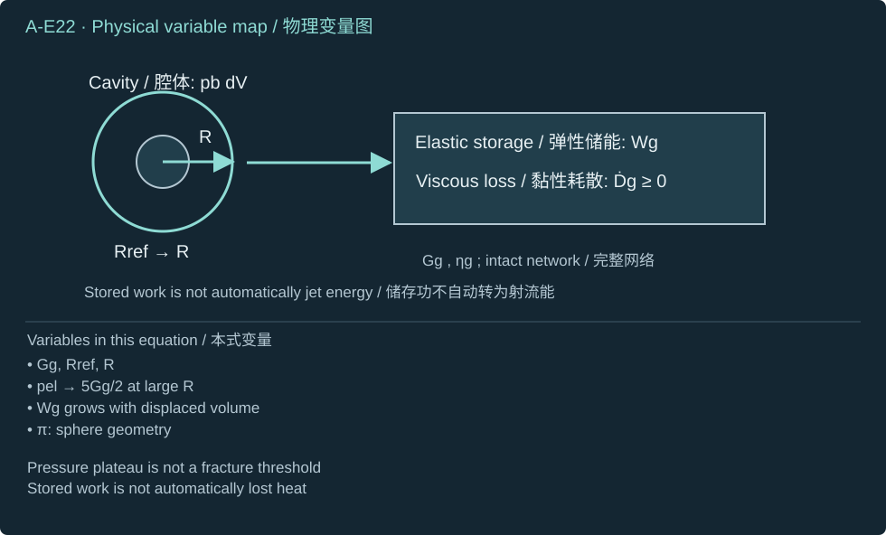

Pressure resistance and elastic work answer different parts of the feasibility calculation.

压力阻力与弹性功回答可行性计算中的不同部分。

At the declared 20 kPa modulus and 5 → 30 µm expansion, resistance is 43.3256 kPa and network work is 4.51604 nJ. A constant 100 kPa net-pressure scale supplies 11.2574 nJ over the same displaced volume, so 40.1163% is stored in the model network. Comparing only 43.3 kPa with 100 kPa misses this integral and the remaining surface, viscous and kinetic demands. The 5 µm reference is a cavity/network reference, not an automatically inherited PFC liquid core size.

对设定的 20 kPa 模量和 5 → 30 µm 膨胀，阻力为 43.3256 kPa，网络功为 4.51604 nJ。恒定 100 kPa 净压力尺度在同一排开体积上提供 11.2574 nJ，因此模型网络储存 40.1163%。仅比较 43.3 kPa 与 100 kPa，会漏掉这个积分及剩余的表面、黏性和动能需求。5 µm 参考值属于腔体／网络参考，不是自动沿用的 PFC 液态核尺寸。

The plateau $5G_g/2$ belongs to a selected intact constitutive model. It neither limits fracture nor proves jet stability. Work continues to grow with volume, real material can stiffen or tear, and directional flow is absent from this radial model. Stored elastic energy can return on recoil but may return too late, in another direction, or into damage. Viscous loss, by contrast, is nonnegative in both expansion and collapse. The useful conversion needs the actual phase-pressure history, moving geometry and energy partition, not an assumed efficiency pasted onto the pressure formula.

平台值 $5G_g/2$ 属于选定的完整本构模型。它既不限定断裂，也不证明射流稳定。功仍随体积增长，真实材料可能硬化或撕裂，而且该径向模型没有定向流动。储存弹性能可在回弹时返还，但返还可能太晚、朝另一个方向，或进入损伤。相反，黏性损耗在膨胀与塌缩时都非负。有效转换需要实际相变压力历程、运动几何和能量分配，不能把假定效率直接贴到压力公式上。

#### What a mastered answer demonstrates

#### 掌握后的回答应体现

* Explains the stretch-based elastic origin, zero reference resistance, and constitutive rather than fracture meaning of the plateau.

  说明基于伸长的弹性来源、参考状态零阻力，以及平台属于本构而非断裂意义。
* Uses pressure times volume change to interpret the 4.51604 nJ storage and its 40.1163% benchmark fraction without calling it a predicted jet energy.

  用压力乘体积变化解释 4.51604 nJ 储存及其 40.1163% 示例比例，不将其称为预测射流能量。
* Separates recoverable storage from irreversible viscosity and identifies damage, timing and nonspherical flow as unresolved links.

  区分可恢复储存与不可逆黏性，指出损伤、时序和非球形流动仍是未闭合环节。

### What evidence would establish that a hydrogel improves this PFC transfer process, rather than merely changing its mechanism?

### 什么证据能证明水凝胶改善了该 PFC 转印过程，而不只是改变其机制？

Explain this in your own words. Use assumptions, a physical argument, and a limitation; equation memorization is not required.

请用自己的话解释，说明假设、物理推理及适用限制；不要求背诵公式。

\*\*Reference answer and mastery criteria / 参考答案与掌握标准\*\*

**Symbols before Eq. (A-E23).**

**式（A-E23）前的符号定义。**

| First individual definition / 第一项单独定义 | Second individual definition / 第二项单独定义 |
| --- | --- |
| $\mathrm{De}$ is dimensionless event Deborah number $\mathrm{De}$ 为无量纲事件 Deborah 数 | $\tau_{\mathrm{rel}}$ measured stress-memory time (s) $\tau_{\mathrm{rel}}$ 为实测应力记忆时间（s） |
| $\tau_e$ event duration (s) $\tau_e$ 为事件持续时间（s） | $t_s$ — Shear crossing-time estimate (s) $t_s$ — 剪切跨越时间估计（s） |
| $t_{\mathrm{poro}}$ — Drainage-time estimate (s) $t_{\mathrm{poro}}$ — 排水时间估计（s） | $L_g$ is a specified length (m) $L_g$ 为指定长度（m） |
| $G_g$ shear modulus (Pa) $G_g$ 为剪切模量（Pa） | $\rho_g$ density (kg m⁻³) $\rho_g$ 为密度（kg m⁻³） |
| $\mu_l$ solvent viscosity (Pa s) $\mu_l$ 为溶剂黏度（Pa s） | $k_{\mathrm{perm}}$ permeability (m²) $k_{\mathrm{perm}}$ 为渗透率（m²） |
| $M_d$ adopted drained storage modulus (Pa) $M_d$ 为所采用的排水储存模量（Pa） |  |

**Conventions and conditions.** $\sim$ denotes scaling and the square root is the small-strain shear-speed estimate; These recall Eqs; (A-E16), (A-E18) and (A-E20).

**约定与条件。** $\sim$ 表示尺度关系，平方根为小应变剪切波速估计；这些公式引用式（A-E16）、（A-E18）、（A-E20）。

(A-E23) · Original event-response formulas recalled

$$
\mathrm{De}=\frac{\tau_{\mathrm{rel}}}{\tau_e},\qquad t_s=\frac{L_g}{\sqrt{G_g/\rho_g}},\qquad t_{\mathrm{poro}}\sim\frac{\mu_lL_g^2}{k_{\mathrm{perm}}M_d}.
$$

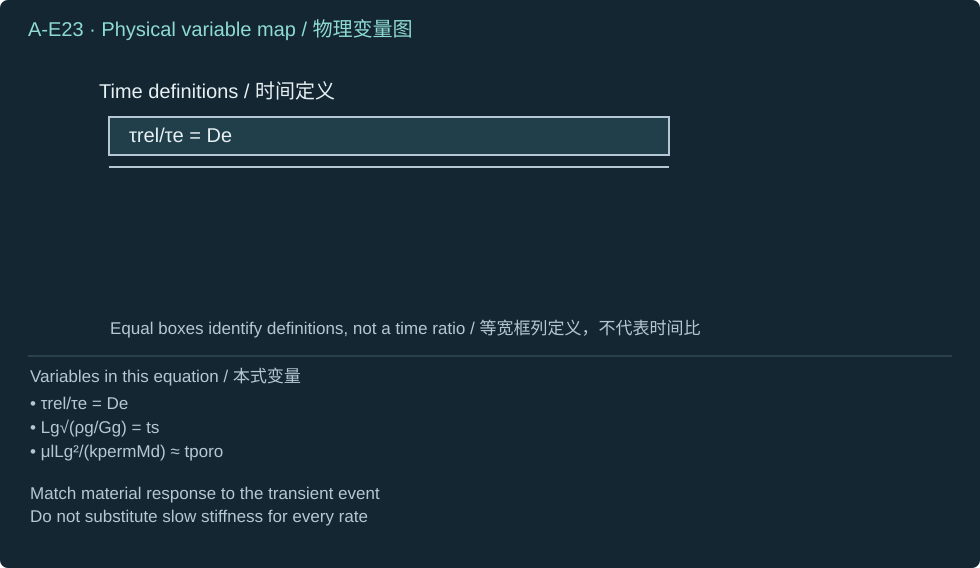

Three timescale comparisons constrain three different physical assumptions.

三个时间尺度比较分别约束三个不同的物理假设。

**Symbols before Eq. (A-E24).**

**式（A-E24）前的符号定义。**

| First individual definition / 第一项单独定义 | Second individual definition / 第二项单独定义 |
| --- | --- |
| $\mathbf J_{\mathrm{target}}$ is vector impulse delivered to the specified target (N s) $\mathbf J_{\mathrm{target}}$ 为传递到指定目标的向量冲量（N s） | $\mathbf t_{\mathrm{load}}$ is external load traction (Pa) $\mathbf t_{\mathrm{load}}$ 为外加载荷牵引（Pa） |
| $A_t$ target loading area (m²) $A_t$ 为目标受载面积（m²） | $t_0$ — Specified event start time (s) $t_0$ — 指定事件开始时刻（s） |
| $t_1$ — Specified event end time (s) $t_1$ — 指定事件结束时刻（s） | $W_{\mathrm{sep,min}}$ is necessary fracture-work budget (J) $W_{\mathrm{sep,min}}$ 为必要断裂功预算（J） |
| $A_{\mathrm{rel}}$ intended released interface area (m²) $A_{\mathrm{rel}}$ 为目标释放界面面积（m²） | $\Gamma_c$ relevant interface fracture energy (J m⁻²), conditional on mode and rate $\Gamma_c$ 为相关界面断裂能（J m⁻²），取决于模态与速率 |
| $dA$ — Area integration element (m²) $dA$ — 面积积分微元（m²） | $dt$ — Time integration element (s) $dt$ — 时间积分微元（s） |

**Conventions and conditions.** Neither integral alone proves crack onset or intact landing.

**约定与条件。** 这两个积分都不能独自证明裂纹起始或完整落点。

(A-E24) · Original load and interface-work accounting

$$
\mathbf J_{\mathrm{target}}=\int_{t_0}^{t_1}\int_{A_t}\mathbf t_{\mathrm{load}}\,dA\,dt,\qquad W_{\mathrm{sep,min}}=\int_{A_{\mathrm{rel}}}\Gamma_c\,dA.
$$

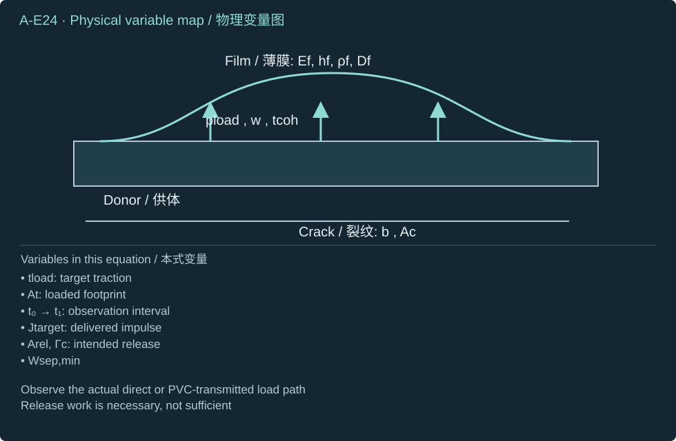

A fair comparison follows the delivered load into the intended interface and the final placement.

公平比较要跟踪实际载荷进入目标界面及最终定位。

I would preserve all architectures and match the PFC batch/inventory, absorber location, absorbed energy, initial temperature, outlet definition and release interface where physically possible. When an architecture changes a matched condition, I would measure that change and report the comparison as conditional. I would characterize network behavior at the event strain, rate and temperature, test shell survival and heat deposition, and distinguish the 6.7082 µs shear estimate from the 2.7440 µs empty-liquid reference. Those times do not predict the actual gel-cavity event or longitudinal shock load.

我会保留所有结构方案，并在物理允许范围内匹配 PFC 批次／物质量、吸收体位置、吸收能量、初始温度、出口定义及释放界面。若某一结构改变了匹配条件，就测量该变化，并将比较报告为有条件的比较。我会在事件的应变、速率和温度下表征网络行为，检验壳层存活及热沉积，并区分 6.7082 µs 剪切时间估计与 2.7440 µs 空液体参考。这两个时间不能预测实际凝胶腔体事件或纵向冲击载荷。

Then I would synchronize cavity, jet/composition, solid motion, calibrated load and crack images; compare independent-shot distributions and intact placement, contamination and reset. Stabilization means lower relevant angle/speed/mass/footprint variability at sufficient useful load, not one slower or smaller bubble. I would report the largest verified single-event output separately from the repeatable intact-transfer envelope. Missing rate-dependent mechanics, permeability, phase kinetics or fracture data leave a stated uncertainty instead of being replaced by the published hydrogel stamp's parameters.

随后，我会同步记录腔体、射流／成分、固体运动、标定载荷和裂纹影像；比较独立事件的分布，以及完整定位、污染和复位。稳定化意味着在足够的有效载荷下，相关角度／速度／质量／载荷范围变异降低，而不是一次更慢或更小的气泡。我会分别报告经验证的最大单次输出与可重复的完整转印范围。若缺少速率相关力学、渗透率、相变动力学或断裂数据，就明确保留不确定性，而不是用已发表水凝胶印章的参数代替。

#### What a mastered answer demonstrates

#### 掌握后的回答应体现

* Defines a fair absorbed-energy/material/geometry comparison while retaining each architecture and both film/PVC load paths.

  定义公平的吸收能量／材料／几何比较，同时保留每种结构及两条薄膜／PVC 载荷路径。
* Distinguishes stress memory, shear communication, solvent drainage and longitudinal compression, with the assumptions of each estimate.

  区分应力记忆、剪切传播、溶剂排水与纵向压缩，并说明各估计的假设。
* Links synchronized mechanism measurements to useful impulse, selective fracture, intact placement, variability and reset; separates extreme output from repeatable transfer.

  将同步机制测量连接到有效冲量、选择性断裂、完整定位、变异与复位；区分极端输出与可重复转印。